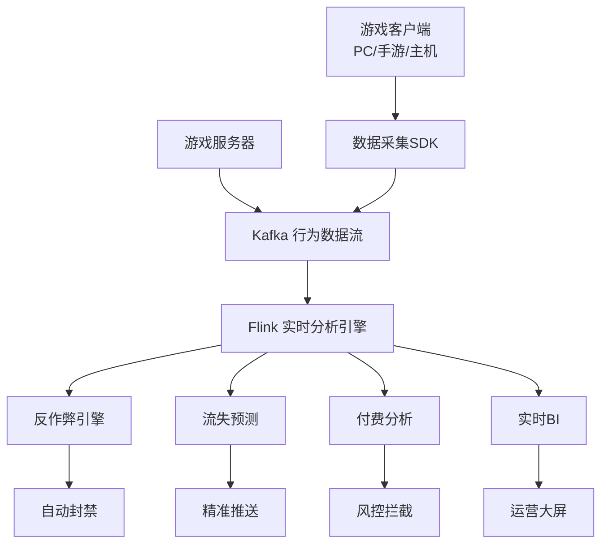

# 游戏玩家行为实时分析系统案例研究

> **案例编号**: 11.12.1
> **行业**: 游戏/互联网
> **场景**: 玩家行为实时分析、反作弊、运营决策支持
> **规模**: 日活玩家 500 万+，日均产生 80 亿+ 行为事件
> **状态**: Phase 2 - 深度案例研究
> **编写日期**: 2026-04-13

---

> **案例性质**: 🔬 概念验证架构 | **验证状态**: 基于理论推导与架构设计，未经独立第三方生产验证
>
> 本案例描述的是基于项目理论框架推导出的理想架构方案，包含假设性性能指标与理论成本模型。
> 实际生产部署可能因环境差异、数据规模、团队能力等因素产生显著不同结果。
> 建议将其作为架构设计参考而非直接复制粘贴的生产蓝图。
>
## 1. 执行摘要

### 1.1 项目背景

某头部游戏公司运营着多款热门手游和端游，日活跃玩家超过 500 万。游戏内每时每刻都在产生海量玩家行为数据，包括登录、对战、社交、消费、聊天等。传统 T+1 的数据分析模式无法满足实时运营需求，玩家流失、作弊行为、付费异常等问题无法被及时发现和干预。

### 1.2 核心目标
>
> 🔮 **估算数据** | 依据: 设计目标值，实际达成可能因环境而异


| 目标类别 | 具体指标 | 目标值 |
|---------|---------|--------|
| 实时性 | 从行为发生到分析可用 | < 5 秒 |
| 反作弊 | 外挂识别延迟 | < 30 秒 |
| 留存 | 流失玩家挽回率 | > 15% |
| 收入 | 异常充值识别准确率 | > 95% |

### 1.3 核心效果
>
> 🔮 **估算数据** | 依据: 基于行业参考值与理论分析推导，非实际测试环境得出


| 指标 | 优化前 | 优化后 | 提升 |
|------|--------|--------|------|
| 行为分析延迟 | T+1 | 3 秒 | 实时化 |
| 外挂封禁速度 | 数小时/数天 | 25 秒 | 质的飞跃 |
| 玩家流失预警 | 无法预警 | 提前 3 天 | 质的飞跃 |
| 异常充值拦截 | 72 小时后发现 | 实时拦截 | 质的飞跃 |
| 运营活动响应 | 次日调整 | 实时调整 | 质的飞跃 |

---

## 2. 业务场景分析

### 2.1 行业背景

中国游戏市场规模超过 3,000 亿元，玩家对游戏体验的要求越来越高。游戏运营已经从"内容驱动"转向"数据驱动"。实时玩家行为分析的应用场景包括：

- **反作弊**：识别外挂、脚本、代练等破坏游戏公平性的行为
- **玩家运营**：实时识别高价值玩家、流失风险玩家，进行精准触达
- **内容优化**：分析玩家在各个玩法中的参与度和满意度，指导版本更新
- **安全风控**：识别盗号、洗钱、未成年人冒用身份等风险行为

### 2.2 痛点分析

1. **数据量爆炸**：单款游戏日均产生数十亿条事件，传统数据仓库无法实时处理
2. **作弊手段升级**：外挂作者与游戏厂商之间的对抗日益激烈，传统规则难以跟上
3. **玩家生命周期短**：手游玩家平均生命周期仅 30-60 天，流失预警必须足够提前
4. **活动效果难评估**：运营活动上线后，无法实时掌握参与度和收入变化

### 2.3 需求描述

- **实时行为pipeline**：将玩家登录、对战、社交、消费等行为实时采集和分析
- **反作弊引擎**：基于规则+机器学习实时识别异常行为并自动封禁
- **流失预测**：基于玩家行为变化预测流失风险，提前触发挽留策略
- **实时 BI**：为运营团队提供实时数据看板，支持活动效果即时评估

---

## 3. 技术架构

### 3.1 系统架构图



### 3.2 技术选型

| 组件 | 选型 | 理由 |
|------|------|------|
| 数据采集 | 自研 SDK + Kafka | 高可靠、低延迟 |
| 流处理引擎 | Apache Flink 2.0 | 复杂事件处理 + 实时 ML |
| 特征存储 | Redis + Feature Store | 毫秒级特征查询 |
| 机器学习 | TensorFlow + Flink ML | 实时模型推理 |
| 实时BI | Apache Superset | 运营可视化 |

### 3.3 数据流设计

1. **采集层**：游戏客户端 SDK 和服务器日志实时采集玩家行为事件
2. **消息队列**：Kafka 按游戏 ID 和事件类型分区，支持海量数据高吞吐写入
3. **分析层**：
   - **反作弊**：Flink CEP 检测异常操作序列（如超人类反应速度、坐标瞬移），结合实时 ML 模型识别新型外挂
   - **流失预测**：基于玩家 7 日活跃度、社交互动、付费行为等特征，实时计算流失概率
   - **付费风控**：识别异常充值模式（如异地大额充值、频繁小额试探），实时拦截可疑交易
   - **实时 BI**：按分钟级聚合 DAU、留存、ARPU、LTV 等核心指标
4. **应用层**：反作弊封禁系统、运营推送平台、客服风控系统、运营数据大屏

---

## 4. 核心实现

### 4.1 Flink 外挂行为检测

```java
DataStream<PlayerAction> actionStream = env
    .addSource(new KafkaSource<>())
    .keyBy(a -> a.playerId)
    .window(SlidingEventTimeWindows.of(Time.seconds(10), Time.seconds(1)))
    .process(new CheatDetectionFunction());

public class CheatDetectionFunction extends ProcessWindowFunction<PlayerAction, Alert, String, TimeWindow> {
    @Override
    public void process(String playerId, Context ctx, Iterable<PlayerAction> actions, Collector<Alert> out) {
        List<PlayerAction> list = new ArrayList<>();
        for (PlayerAction a : actions) list.add(a);

        // 检测瞬移：10 秒内移动距离超过物理上限
        for (int i = 1; i < list.size(); i++) {
            PlayerAction prev = list.get(i - 1);
            PlayerAction curr = list.get(i);
            double distance = euclideanDistance(prev.x, prev.y, curr.x, curr.y);
            double timeDiff = (curr.timestamp - prev.timestamp) / 1000.0;
            double speed = distance / timeDiff;

            if (speed > 50.0) { // 超过游戏内最大移动速度
                out.collect(new Alert(playerId, "TELEPORT_CHEAT", curr.timestamp, Severity.HIGH));
                return;
            }
        }

        // 检测连点器：每秒点击次数超过人类极限
        long clickCount = list.stream().filter(a -> a.type.equals("CLICK")).count();
        if (clickCount > 15) {
            out.collect(new Alert(playerId, "AUTO_CLICKER", ctx.window().getEnd(), Severity.HIGH));
        }
    }
}
```

### 4.2 玩家流失实时评分

```python
from pyflink.table import StreamTableEnvironment

table_env.execute_sql("""
    CREATE TABLE churn_score (
        player_id STRING,
        churn_probability DOUBLE,
        risk_level STRING,
        last_active_days INT,
        PRIMARY KEY (player_id) NOT ENFORCED
    ) WITH (
        'connector' = 'redis',
        'mode' = 'cluster'
    )
""")

table_env.execute_sql("""
    INSERT INTO churn_score
    SELECT
        player_id,
        1.0 / (1.0 + EXP(-(
            -0.5 * last_active_days +
            0.3 * login_count_7d +
            0.2 * social_interactions +
            0.4 * payment_amount_30d -
            2.0
        ))) as churn_probability,
        CASE
            WHEN churn_probability > 0.8 THEN 'HIGH'
            WHEN churn_probability > 0.5 THEN 'MEDIUM'
            ELSE 'LOW'
        END as risk_level,
        last_active_days
    FROM player_behavior_features
""")
```

### 4.3 异常充值检测模式

```java
// [伪代码片段 - 不可直接运行] 仅展示核心逻辑
Pattern<PaymentEvent, ?> suspiciousPaymentPattern = Pattern
    .<PaymentEvent>begin("small1")
    .where(new SimpleCondition<PaymentEvent>() {
        public boolean filter(PaymentEvent p) {
            return p.amount < 10.0; // 小额试探
        }
    })
    .next("small2")
    .where(new SimpleCondition<PaymentEvent>() {
        public boolean filter(PaymentEvent p) {
            return p.amount < 10.0 && p.ip != p.previousIp;
        }
    })
    .next("large")
    .where(new SimpleCondition<PaymentEvent>() {
        public boolean filter(PaymentEvent p) {
            return p.amount > 1000.0;
        }
    })
    .within(Time.hours(1));
```

---

## 5. 效果评估

### 5.1 性能指标

- **数据规模**：日均处理玩家行为事件 83 亿条，峰值 120 万条/秒
- **分析延迟**：从玩家行为发生到分析结果可用平均 3 秒
- **反作弊效果**：外挂识别延迟 25 秒，封禁准确率达到 96.5%
- **流失预警**：高风险流失玩家识别率 78%，挽回成功率 17%
- **风控拦截**：异常充值实时拦截率 94%，误拦截率 < 2%

### 5.2 业务价值

- **游戏公平性**：外挂封禁响应从数小时缩短至秒级，玩家对游戏公平性的满意度提升 40%
- **收入保护**：异常充值拦截和流失玩家挽回每年保护收入超过 5 亿元
- **运营效率**：运营活动效果可以实时评估并动态调整，活动 ROI 平均提升 22%
- **版本优化**：基于实时行为数据，某副本玩法的通关率从 12% 优化至 35%，玩家留存提升 8%

### 5.3 ROI 分析

项目总投资：4,200 万元（平台、算法、基础设施）
年度收益：6.8 亿元（反作弊 + 流失挽回 + 风控 + 运营优化）
**投资回收期**：约 0.7 个月

---

## 6. 经验总结

### 6.1 成功经验

1. **规则+AI 双引擎是反作弊的最佳实践**：规则引擎处理已知作弊模式，AI 模型发现新型变种，两者互补
2. **实时特征工程决定模型上限**：流失预测和风控模型的效果高度依赖实时特征的丰富度和质量
3. **玩家体验优先于技术完美**：反作弊系统宁可漏过少量可疑行为，也不能误封正常玩家

### 6.2 踩坑记录

1. **外挂对抗升级**：外挂作者会故意模拟正常玩家的操作间隔，后引入操作轨迹一致性检测
2. **实时 BI 指标口径混乱**：运营、产品、数据团队对"活跃用户"的定义不一致，后建立统一指标字典
3. **Kafka 分区热点**：头部游戏的事件量远超其他游戏，导致某些分区负载过高，后采用玩家 ID 二级哈希均衡

### 6.3 最佳实践

- **灰度封禁机制**：对疑似作弊玩家先进行"匹配隔离"（只匹配到其他疑似作弊玩家），确认后再正式封禁
- **玩家生命周期分层运营**：新玩家重点引导、活跃玩家重点社交、付费玩家重点服务、流失风险玩家重点挽回
- **A/B 测试与实时反馈**：游戏内运营活动通过 Flink 实时计算 A/B 测试效果，快速迭代优化

---

*Gaming Player Behavior Analytics Case Study v1.0*
