# 游戏实时数据分析系统案例研究

> **案例编号**: 11.12.2
> **行业**: 游戏/娱乐
> **场景**: 实时游戏分析、玩家行为洞察、运营决策支持、反作弊监控
> **规模**: 2000万+DAU, 500亿+事件/天, 100万+并发在线
> **编写日期**: 2026-04-12
> **状态**: Phase 2 - 深度案例研究

---

## 执行摘要

### 业务背景

某全球头部游戏发行商运营多款大型多人在线游戏（MMO、MOBA、大逃杀、卡牌对战等），面临海量实时数据处理挑战：

- **规模数据**：DAU 2000万+，峰值在线100万+，日均事件500亿+
- **游戏矩阵**：涵盖10+款不同类型游戏，跨PC、主机、移动端
- **运营需求**：需要秒级响应玩家行为变化，支持实时运营决策
- **技术挑战**：高并发写入、毫秒级延迟、多维度实时分析

### 核心挑战
> 🔮 **估算数据** | 依据: 基于行业参考值与理论分析推导，非实际测试环境得出


| 挑战 | 描述 | 业务影响 |
|------|------|----------|
| 数据规模巨大 | 500亿+事件/天，峰值1000万+事件/秒 | 存储与计算压力 |
| 实时性要求高 | 运营决策需秒级数据支持 | 错过最佳运营窗口 |
| 分析维度复杂 | 玩家、关卡、经济、社交多维度交叉 | 查询性能挑战 |
| 游戏类型多样 | MMO、MOBA、FPS、卡牌等不同特征 | 统一分析框架难 |
| 全球化部署 | 全球8大区域，跨区域数据聚合 | 网络与合规挑战 |

### 解决方案

采用 **Flink + Kafka + ClickHouse + 实时画像 + AI预测** 架构：

- **实时数据管道**：秒级延迟的游戏事件采集与处理
- **流式分析引擎**：Flink实时计算玩家留存、付费转化、异常行为
- **实时BI系统**：秒级查询响应的运营分析平台
- **智能运营决策**：基于实时数据的个性化推送与干预

### 关键成果

- **数据新鲜度**：从小时级降至秒级（< 5秒）
- **查询响应**：复杂分析查询从分钟级降至亚秒级
- **事件吞吐**：单机处理100万+事件/秒，集群水平扩展
- **运营效率**：活动策划到执行从3天缩短至30分钟

---

## 1. 业务背景

### 1.1 游戏行业实时分析需求

#### 1.1.1 玩家行为分析需求

现代游戏运营需要对玩家行为进行全方位实时洞察：

**核心分析维度：**

| 维度 | 分析内容 | 实时要求 | 业务价值 |
|------|----------|----------|----------|
| 会话分析 | 登录时长、频次、时段分布 | 分钟级 | 识别活跃用户群体 |
| 进度分析 | 关卡通过率、卡关位置、升级速度 | 实时 | 优化游戏难度曲线 |
| 行为路径 | 功能使用顺序、操作热区、点击流 | 秒级 | 改进UX设计 |
| 社交行为 | 好友互动、公会参与、组队模式 | 分钟级 | 增强社交粘性 |
| 消费行为 | 付费点点击、购买转化、ARPU | 实时 | 优化付费设计 |

**典型分析场景：**

```
场景1：新关卡上线监控
- 实时监控玩家通过率
- 识别卡关热点（死亡位置、失败原因）
- 发现潜在BUG（异常数据模式）
- 30分钟内产出优化建议报告

场景2：活动效果实时追踪
- 活动参与人数实时统计
- 各奖励档位领取进度
- 玩家反馈情感分析
- 动态调整活动参数

场景3：玩家流失预警
- 实时计算玩家活跃度得分
- 识别流失风险玩家
- 触发个性化挽留策略
- 跟踪挽留效果
```

#### 1.1.2 实时运营决策需求

游戏运营需要基于实时数据快速做出决策：

**运营决策类型：**

| 决策类型 | 决策场景 | 时间窗口 | 数据依赖 |
|----------|----------|----------|----------|
| 活动策划 | 根据实时在线人数决定活动开启 | 15分钟 | 在线趋势 |
| 经济调控 | 根据通胀率调整道具产出 | 1小时 | 经济系统指标 |
| 匹配优化 | 根据玩家分布调整匹配算法 | 实时 | 队列状态 |
| 内容推送 | 根据玩家状态推送个性化内容 | 秒级 | 玩家画像 |
| 危机响应 | 发现BUG或异常立即采取措施 | 分钟级 | 异常检测 |

**实时决策流程：**

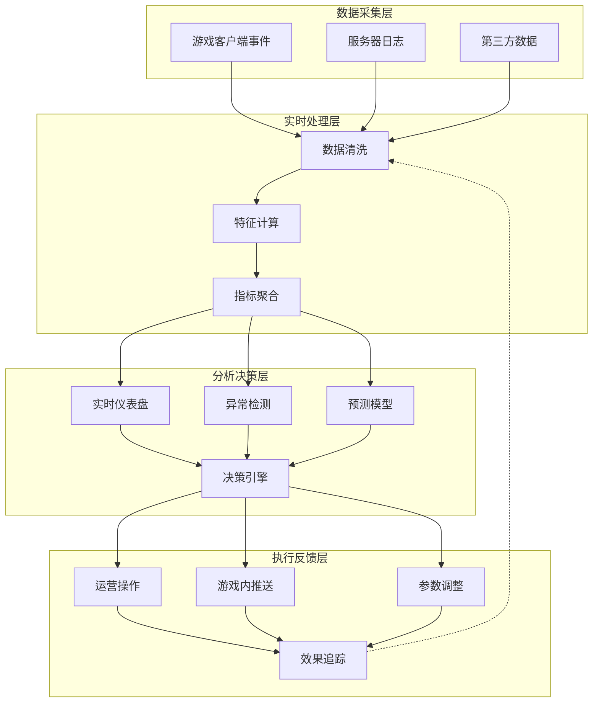

#### 1.1.3 反作弊监控需求

游戏反作弊需要实时检测和响应：

**作弊类型与检测方法：**

| 作弊类型 | 典型行为 | 检测方法 | 响应时效 |
|----------|----------|----------|----------|
| 外挂作弊 | 自动瞄准、穿墙、加速 | 行为模式分析 | 实时封禁 |
| 脚本刷金 | 自动化刷资源、刷等级 | 频率异常检测 | 分钟级限制 |
| 账号共享 | 异地登录、设备切换 | 地理位置分析 | 风险评估 |
| 经济作弊 | 虚假交易、黑金流通 | 交易网络分析 | 小时级冻结 |
| 代练刷分 | 异常胜率、操作模式 | 技能水平分析 | 天梯清零 |

**反作弊检测流水线：**

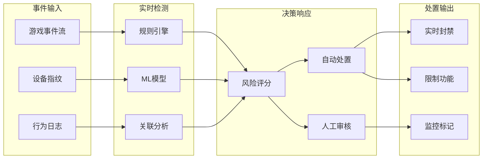

#### 1.1.4 社交互动分析需求

现代游戏强调社交元素，需要实时分析社交行为：

**社交分析维度：**

| 维度 | 分析指标 | 应用场景 |
|------|----------|----------|
| 关系网络 | 好友密度、社群结构、意见领袖 | 社区运营、病毒传播 |
| 互动质量 | 聊天频次、组队成功率、冲突检测 | 社交体验优化 |
| 公会生态 | 活跃度、凝聚力、生命周期 | 公会系统优化 |
| 内容传播 | 分享率、邀请转化、UGC热度 | 增长策略制定 |

### 1.2 支持的游戏类型

本案例涵盖多种游戏类型的实时分析需求：

#### 1.2.1 MMO/RPG 大型多人在线角色扮演游戏

**典型代表**：魔兽世界、最终幻想14、原神

**分析重点：**

- 经济系统监控（通胀率、交易活跃度）
- 副本通关分析（通关率、耗时、职业平衡）
- 玩家成长曲线（等级分布、装备获取）
- 社交关系网络（公会活跃度、师徒系统）

**实时指标：**

| 指标 | 定义 | 更新频率 | 阈值预警 |
|------|------|----------|----------|
| 在线人数 | 当前活跃玩家数 | 实时 | < 10000 |
| 副本通过率 | 成功通关/尝试次数 | 5分钟 | < 30% |
| 金币通胀率 | 物价变化率 | 1小时 | > 10%/天 |
| 玩家留存 | 次日/7日留存率 | 每日 | < 40% |

#### 1.2.2 MOBA 多人在线战术竞技游戏

**典型代表**：英雄联盟、DOTA2、王者荣耀

**分析重点：**

- 匹配质量分析（等待时间、实力均衡性）
- 英雄平衡性（胜率、出场率、禁用率）
- 玩家行为（挂机、送人头、言语违规）
- 赛季表现（段位分布、晋升速度）

**实时指标：**

| 指标 | 定义 | 更新频率 | 阈值预警 |
|------|------|----------|----------|
| 匹配等待 | 平均排队时间 | 实时 | > 3分钟 |
| 英雄胜率 | 各英雄胜率 | 1小时 | 偏离50%±5% |
| 举报率 | 被举报玩家占比 | 15分钟 | > 5% |
| 服务器负载 | 各区域服务器压力 | 实时 | > 80% |

#### 1.2.3 Battle Royale 大逃杀游戏

**典型代表**：PUBG、堡垒之夜、Apex Legends

**分析重点：**

- 跳伞热点分析（玩家落点分布）
- 武器平衡性（伤害、使用率）
- 存活时间分布（游戏节奏）
- 区域热度（安全区设置优化）

#### 1.2.4 Card/Strategy 卡牌与策略游戏

**典型代表**：炉石传说、万智牌、自走棋

**分析重点：**

- 卡组流行度（Meta分析）
- 对战平衡性（先手后手胜率）
- 抽卡概率验证（保底机制效果）
- 赛季重置影响（玩家回流）

### 1.3 核心业务价值

#### 1.3.1 数据驱动的精细化运营

通过实时数据分析，实现：

**运营效率提升：**

- 活动效果实时监控，动态调整参数
- 玩家反馈即时获取，快速响应问题
- A/B测试结果实时评估，加速决策

**收入优化：**

- 付费转化漏斗实时监控
- 高价值玩家实时识别与维护
- 个性化推荐与促销

**用户体验提升：**

- 卡关点实时识别与优化
- 匹配质量持续监控改进
- 社交体验优化

#### 1.3.2 反作弊与游戏公平性

**直接价值：**

- 外挂实时检测与封禁，保护玩家体验
- 经济系统监控，防止通货膨胀
- 交易行为分析，打击黑金工作室

**间接价值：**

- 维护游戏公平性，提升玩家信任
- 减少正常玩家流失
- 保护游戏品牌价值

#### 1.3.3 成本节约与效率提升

| 维度 | 传统方式 | 实时分析 | 效率提升 |
|------|----------|----------|----------|
| 活动调整 | 3天数据分析+人工决策 | 30分钟自动分析 | **90%** |
| 异常发现 | 玩家投诉后处理 | 自动实时检测 | **95%** |
| 运营人力 | 20人专职数据分析 | 5人监控+系统自动 | **75%** |
| 决策延迟 | 24小时数据报告 | 秒级实时数据 | **99%** |

---

## 2. 技术架构

### 2.1 整体架构设计

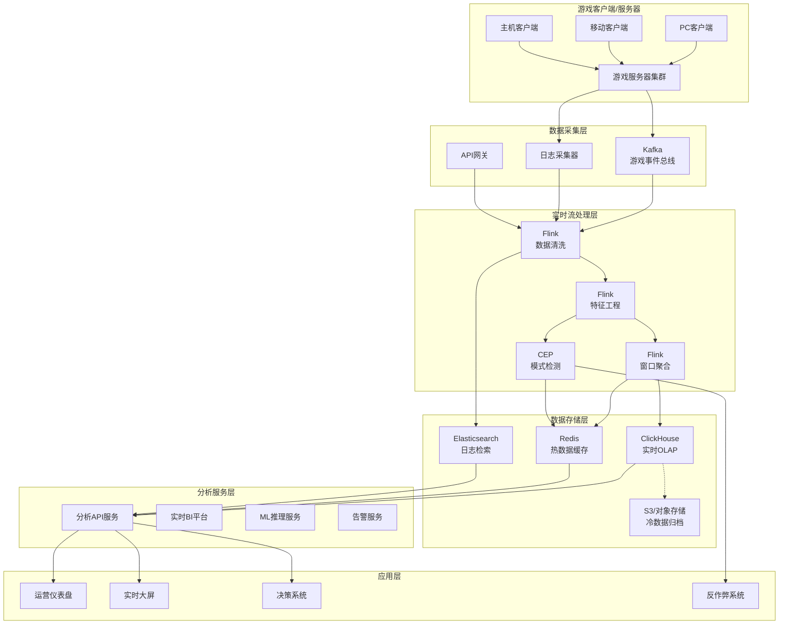

### 2.2 游戏事件采集架构

#### 2.2.1 事件分类与优先级

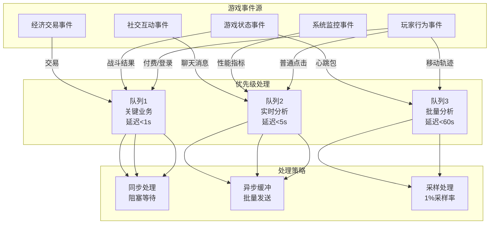

#### 2.2.2 客户端采集设计

**SDK架构：**

```
┌─────────────────────────────────────────────────────────┐
│                    游戏客户端 SDK                        │
├─────────────────────────────────────────────────────────┤
│  事件生成层  │  缓冲队列层  │  网络发送层  │  本地存储层  │
├─────────────┼─────────────┼─────────────┼─────────────┤
│ • 自动埋点   │ • 内存缓冲   │ • 批量压缩   │ • 失败重试   │
│ • 手动埋点   │ • 持久化队列 │ • 心跳检测   │ • 本地缓存   │
│ • 异常捕获   │ • 优先级队列 │ • 断线重连   │ • 数据压缩   │
└─────────────┴─────────────┴─────────────┴─────────────┘
```

**事件数据结构：**

```json
{
  "event_id": "evt_20240412_001",
  "timestamp": 1712901234567,
  "event_type": "level_complete",
  "priority": "high",

  "user": {
    "user_id": "usr_abc123",
    "session_id": "sess_xyz789",
    "device_id": "dev_iphone14_001",
    "platform": "ios",
    "version": "2.3.1"
  },

  "game": {
    "game_id": "game_moba_001",
    "server_id": "srv_asia_01",
    "region": "APAC"
  },

  "properties": {
    "level_id": "level_5_3",
    "duration_ms": 185000,
    "attempts": 3,
    "score": 8540,
    "stars": 3,
    "powerups_used": ["shield", "speed"]
  },

  "context": {
    "network": "wifi",
    "battery": 78,
    "memory_usage": 512
  }
}
```

#### 2.2.3 服务端采集架构

**日志采集管道：**

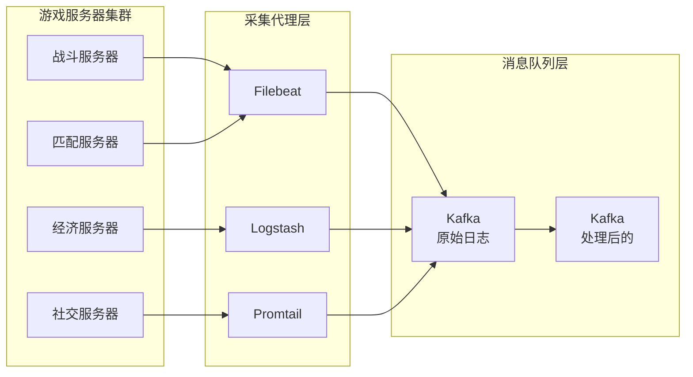

### 2.3 实时计算层设计

#### 2.3.1 Flink集群架构

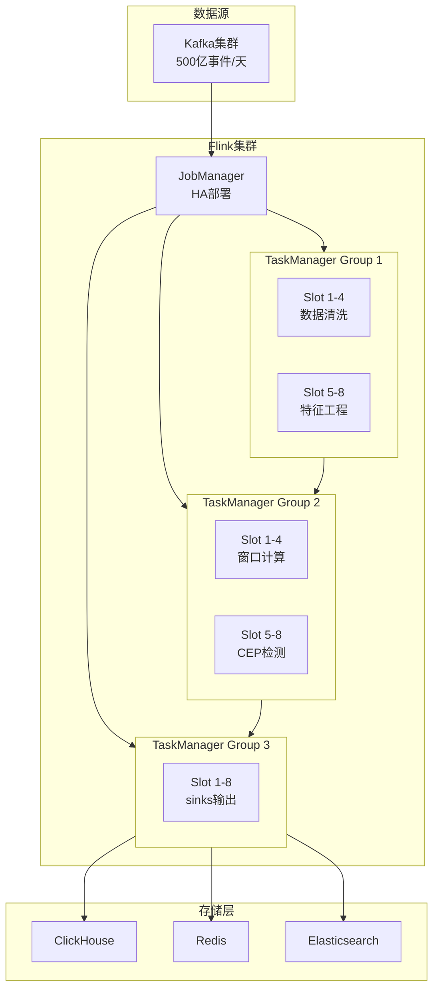

#### 2.3.2 流处理拓扑设计

```
┌─────────────────────────────────────────────────────────────────────┐
│                        Flink 流处理拓扑                              │
├─────────────────────────────────────────────────────────────────────┤
│                                                                     │
│   ┌─────────┐    ┌─────────┐    ┌─────────┐    ┌─────────┐         │
│   │  Source │───▶│  Parse  │───▶│ Validate│───▶│ Enrich  │         │
│   │  Kafka  │    │   JSON  │    │  Schema │    │  User   │         │
│   └─────────┘    └─────────┘    └─────────┘    └─────────┘         │
│                                                    │                │
│                    ┌───────────────────────────────┼───────────┐   │
│                    │                               │           │   │
│                    ▼                               ▼           ▼   │
│   ┌─────────┐   ┌─────────┐   ┌─────────┐   ┌─────────┐ ┌─────────┐│
│   │ Window  │   │   CEP   │   │ Session │   │ Feature │ │ Metric  ││
│   │Aggregate│   │ Pattern │   │ Analysis│   │ Extract │ │ Compute ││
│   └────┬────┘   └────┬────┘   └────┬────┘   └────┬────┘ └────┬────┘│
│        │             │             │             │           │     │
│        ▼             ▼             ▼             ▼           ▼     │
│   ┌─────────┐   ┌─────────┐   ┌─────────┐   ┌─────────┐ ┌─────────┐│
│   │ClickHouse│   │  Redis  │   │  Redis  │   │   ML    │ │  Alert  ││
│   │   Sink  │   │  Alert  │   │ Profile │   │ Feature │ │  Sink   ││
│   └─────────┘   └─────────┘   └─────────┘   └─────────┘ └─────────┘│
│                                                                     │
└─────────────────────────────────────────────────────────────────────┘
```

### 2.4 可视化与BI集成

#### 2.4.1 实时仪表盘架构

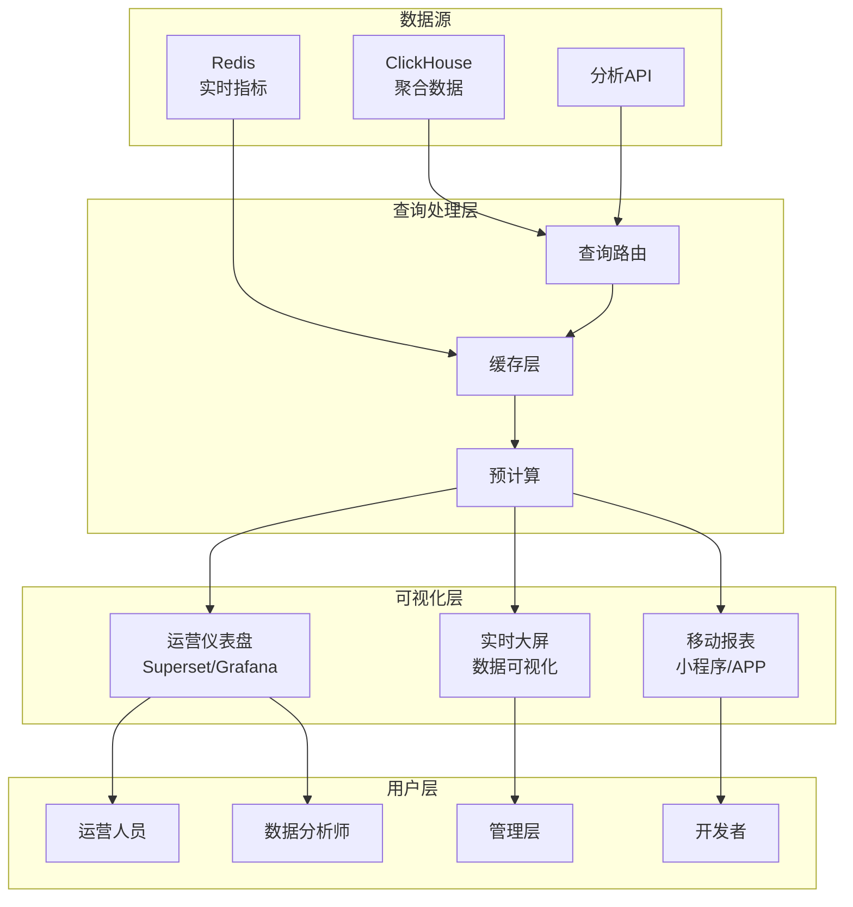

#### 2.4.2 实时仪表盘设计

**运营核心指标看板：**

```
┌─────────────────────────────────────────────────────────────────────┐
│                    实时运营仪表盘 - 2024-04-12 14:32:05               │
├─────────────────────────────────────────────────────────────────────┤
│                                                                     │
│  ┌─────────────┐  ┌─────────────┐  ┌─────────────┐  ┌─────────────┐ │
│  │  在线人数    │  │  今日新增    │  │  今日收入    │  │  服务器状态  │ │
│  │             │  │             │  │             │  │             │ │
│  │  1,234,567  │  │   45,230    │  │  ¥2.35M     │  │  正常 98%   │ │
│  │  ▲ +5.2%    │  │  ▲ +12.5%   │  │  ▲ +8.7%    │  │  ⚠ 2台维护  │ │
│  └─────────────┘  └─────────────┘  └─────────────┘  └─────────────┘ │
│                                                                     │
│  ┌─────────────────────────┐      ┌─────────────────────────┐      │
│  │     24小时在线趋势       │      │      收入实时曲线        │      │
│  │                         │      │                         │      │
│  │    ▲                    │      │         ▲▲              │      │
│  │   ▲█▲                   │      │        ▲  ▲▲            │      │
│  │  ▲████▲        ▲        │      │       ▲     ▲▲          │      │
│  │ ▲██████▲      ▲█▲       │      │      ▲        ▲▲        │      │
│  │▲████████▲    ▲███▲      │      │     ▲           ▲       │      │
│  └─────────────────────────┘      └─────────────────────────┘      │
│                                                                     │
│  ┌─────────────────────────┐      ┌─────────────────────────┐      │
│  │      地区分布热力图      │      │      游戏类型占比        │      │
│  │                         │      │                         │      │
│  │    [世界地图热力]        │      │    [饼图分布]            │      │
│  │                         │      │    MMO: 45%             │      │
│  │                         │      │    MOBA: 30%            │      │
│  │                         │      │    FPS: 15%             │      │
│  │                         │      │    其他: 10%            │      │
│  └─────────────────────────┘      └─────────────────────────┘      │
│                                                                     │
└─────────────────────────────────────────────────────────────────────┘
```

### 2.5 数据湖集成

#### 2.5.1 数据分层架构

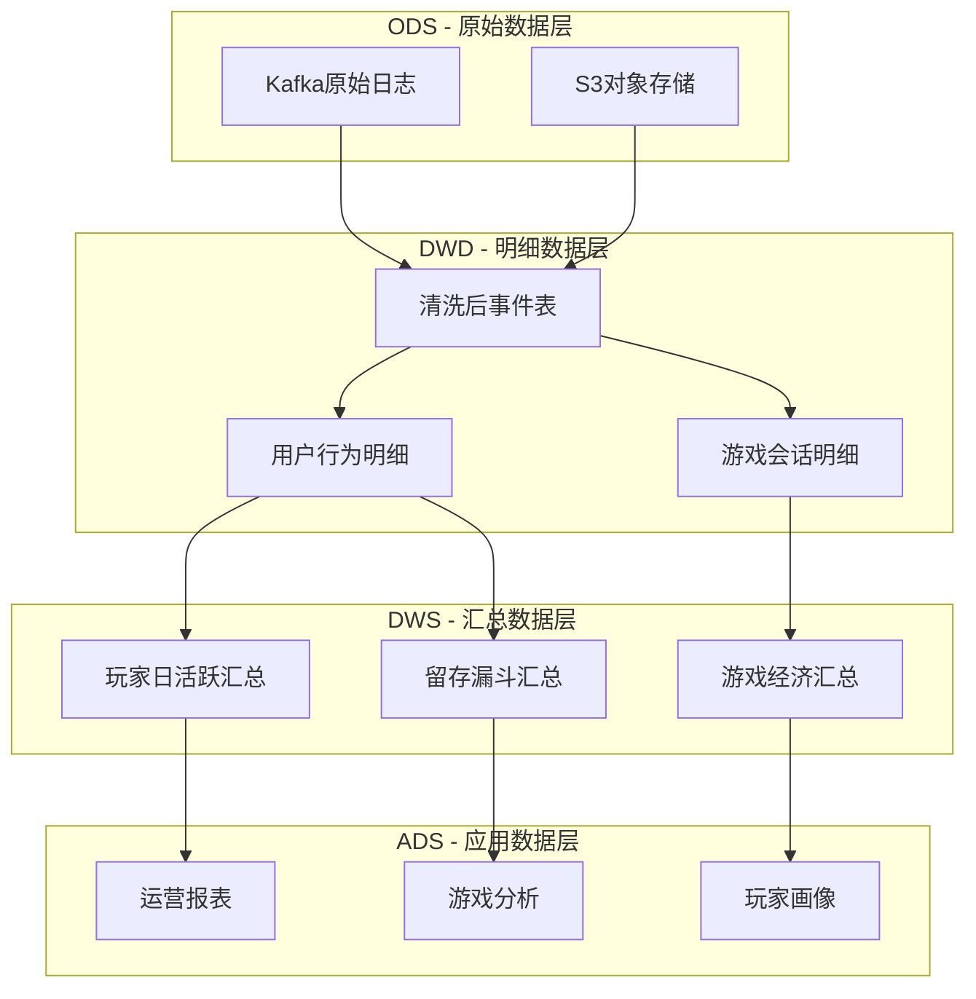

#### 2.5.2 实时与离线数据一致性

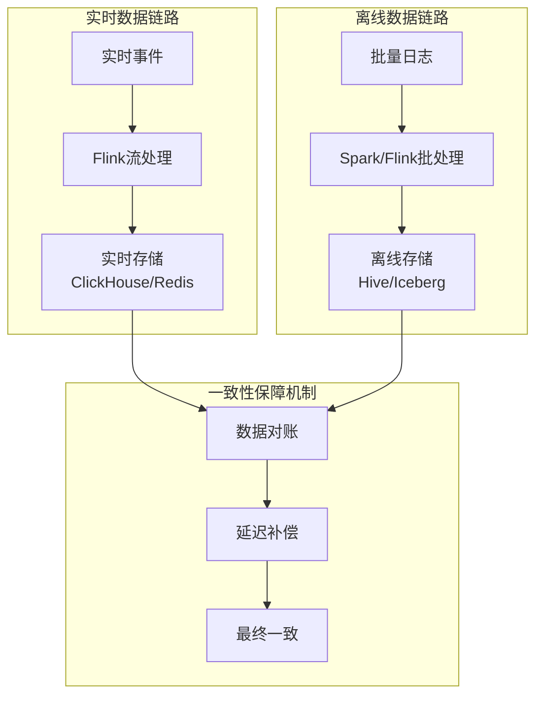

---

## 3. Flink 应用

### 3.1 玩家留存实时计算

#### 3.1.1 留存计算逻辑

```java
/**
 * 玩家留存实时计算器
 * 支持日留存、周留存、月留存的多维度实时计算
 */

import org.apache.flink.streaming.api.environment.StreamExecutionEnvironment;
import org.apache.flink.streaming.api.datastream.DataStream;
import org.apache.flink.api.common.state.ValueState;
import org.apache.flink.api.common.state.ValueStateDescriptor;

public class PlayerRetentionCalculator {

    public static void main(String[] args) throws Exception {
        StreamExecutionEnvironment env =
            StreamExecutionEnvironment.getExecutionEnvironment();
        env.setParallelism(128);
        env.enableCheckpointing(60000);

        // 读取玩家登录事件
        DataStream<LoginEvent> loginStream = env
            .addSource(new FlinkKafkaConsumer<>(
                "player-login",
                new LoginDeserializationSchema(),
                kafkaProps))
            .assignTimestampsAndWatermarks(
                WatermarkStrategy.<LoginEvent>forBoundedOutOfOrderness(
                    Duration.ofMinutes(5))
                .withTimestampAssigner((event, ts) -> event.getLoginTime())
            );

        // 计算日留存
        DataStream<RetentionMetric> dailyRetention = loginStream
            .keyBy(LoginEvent::getUserId)
            .process(new RetentionCalculationFunction("DAILY"));

        // 计算7日留存
        DataStream<RetentionMetric> weeklyRetention = loginStream
            .keyBy(LoginEvent::getUserId)
            .process(new RetentionCalculationFunction("WEEKLY"));

        // 输出到ClickHouse
        dailyRetention.addSink(new ClickHouseRetentionSink());
        weeklyRetention.addSink(new ClickHouseRetentionSink());

        env.execute("Player Retention Real-time Calculation");
    }
}

/**
 * 留存计算核心函数
 */
public class RetentionCalculationFunction
    extends KeyedProcessFunction<String, LoginEvent, RetentionMetric> {

    private ValueState<PlayerLoginHistory> historyState;
    private String retentionType;

    @Override
    public void open(Configuration parameters) {
        historyState = getRuntimeContext().getState(
            new ValueStateDescriptor<>("login-history", PlayerLoginHistory.class));
    }

    @Override
    public void processElement(LoginEvent event, Context ctx,
            Collector<RetentionMetric> out) throws Exception {

        PlayerLoginHistory history = historyState.value();
        if (history == null) {
            history = new PlayerLoginHistory(event.getUserId());
        }

        long currentLogin = event.getLoginTime();
        long firstLogin = history.getFirstLoginTime();

        // 判断留存类型
        boolean isRetained = false;
        String cohort = null;

        if ("DAILY".equals(retentionType)) {
            // 日留存：次日登录
            long dayDiff = (currentLogin - firstLogin) / (24 * 3600 * 1000);
            if (dayDiff == 1) {
                isRetained = true;
                cohort = formatDate(firstLogin);
            }
        } else if ("WEEKLY".equals(retentionType)) {
            // 7日留存：第7天登录
            long dayDiff = (currentLogin - firstLogin) / (24 * 3600 * 1000);
            if (dayDiff == 7) {
                isRetained = true;
                cohort = formatDate(firstLogin);
            }
        }

        if (isRetained) {
            out.collect(new RetentionMetric(
                cohort,
                retentionType,
                1L,  // 留存数+1
                event.getGameId(),
                event.getRegion(),
                System.currentTimeMillis()
            ));
        }

        // 更新历史
        history.addLogin(currentLogin);
        historyState.update(history);
    }
}
```

#### 3.1.2 留存漏斗分析

```java
/**
 * 留存漏斗实时分析
 * 支持分渠道、分地区、分游戏类型的多维度留存分析
 */

import org.apache.flink.streaming.api.datastream.DataStream;
import org.apache.flink.api.common.functions.AggregateFunction;

public class RetentionFunnelAnalyzer {

    public static void analyzeRetentionFunnel(DataStream<LoginEvent> loginStream) {

        // 按多维度分组计算留存
        DataStream<RetentionFunnel> funnelStream = loginStream
            .map(event -> new EnrichedLoginEvent(event))
            .keyBy(enriched -> new RetentionKey(
                enriched.getCohortDate(),
                enriched.getChannel(),
                enriched.getRegion(),
                enriched.getGameType()
            ))
            .window(TumblingEventTimeWindows.of(Time.days(1)))
            .aggregate(new RetentionFunnelAggregate());

        // 计算留存率
        DataStream<RetentionRate> rateStream = funnelStream
            .keyBy(RetentionFunnel::getCohortKey)
            .process(new RetentionRateCalculator());

        // 输出结果
        rateStream.addSink(new RetentionFunnelSink());
    }
}

/**
 * 留存漏斗聚合器
 */
public class RetentionFunnelAggregate
    implements AggregateFunction<EnrichedLoginEvent, RetentionAccumulator, RetentionFunnel> {

    @Override
    public RetentionAccumulator createAccumulator() {
        return new RetentionAccumulator();
    }

    @Override
    public RetentionAccumulator add(EnrichedLoginEvent event, RetentionAccumulator acc) {
        acc.addLogin(event.getUserId(), event.getLoginDay());
        return acc;
    }

    @Override
    public RetentionFunnel getResult(RetentionAccumulator acc) {
        return new RetentionFunnel(
            acc.getTotalUsers(),
            acc.getDay1Retained(),
            acc.getDay3Retained(),
            acc.getDay7Retained(),
            acc.getDay30Retained()
        );
    }

    @Override
    public RetentionAccumulator merge(RetentionAccumulator a, RetentionAccumulator b) {
        return a.merge(b);
    }
}
```

### 3.2 付费转化漏斗分析

#### 3.2.1 转化漏斗计算

```java
/**
 * 付费转化漏斗实时分析
 * 追踪玩家从浏览到付费的完整转化路径
 */

import org.apache.flink.streaming.api.environment.StreamExecutionEnvironment;
import org.apache.flink.streaming.api.datastream.DataStream;
import org.apache.flink.api.common.state.ValueState;
import org.apache.flink.api.common.state.ValueStateDescriptor;
import org.apache.flink.streaming.api.windowing.time.Time;

public class PaymentConversionFunnel {

    public static void main(String[] args) throws Exception {
        StreamExecutionEnvironment env =
            StreamExecutionEnvironment.getExecutionEnvironment();

        // 读取各类游戏事件
        DataStream<GameEvent> eventStream = env
            .addSource(new FlinkKafkaConsumer<>(
                "game-events",
                new GameEventDeserializationSchema(),
                kafkaProps));

        // 付费转化漏斗分析
        DataStream<ConversionFunnel> conversionFunnel = eventStream
            .filter(event -> isConversionEvent(event))
            .keyBy(GameEvent::getUserId)
            .process(new ConversionFunnelFunction());

        // 按商品/活动聚合
        DataStream<AggregatedConversion> aggregated = conversionFunnel
            .keyBy(ConversionFunnel::getFunnelId)
            .window(SlidingEventTimeWindows.of(Time.hours(1), Time.minutes(5)))
            .aggregate(new ConversionAggregate());

        // 实时更新转化指标
        aggregated.addSink(new ConversionMetricsSink());

        env.execute("Payment Conversion Funnel Analysis");
    }

    private static boolean isConversionEvent(GameEvent event) {
        String type = event.getEventType();
        return type.equals("item_view") ||
               type.equals("item_cart") ||
               type.equals("purchase_attempt") ||
               type.equals("purchase_success");
    }
}

/**
 * 转化漏斗处理函数
 * 使用状态管理跟踪单个用户的转化路径
 */
public class ConversionFunnelFunction
    extends KeyedProcessFunction<String, GameEvent, ConversionFunnel> {

    private ValueState<UserConversionState> conversionState;
    private MapState<String, Long> stepTimestamps;

    @Override
    public void open(Configuration parameters) {
        conversionState = getRuntimeContext().getState(
            new ValueStateDescriptor<>("conversion-state", UserConversionState.class));
        stepTimestamps = getRuntimeContext().getMapState(
            new MapStateDescriptor<>("step-times", String.class, Long.class));
    }

    @Override
    public void processElement(GameEvent event, Context ctx,
            Collector<ConversionFunnel> out) throws Exception {

        String eventType = event.getEventType();
        String userId = event.getUserId();
        long timestamp = event.getTimestamp();

        UserConversionState state = conversionState.value();
        if (state == null) {
            state = new UserConversionState(userId);
        }

        // 记录各步骤时间
        switch (eventType) {
            case "item_view":
                state.setViewTime(timestamp);
                state.setItemId(event.getProperty("item_id"));
                break;
            case "item_cart":
                if (state.getViewTime() > 0) {
                    state.setCartTime(timestamp);
                }
                break;
            case "purchase_attempt":
                if (state.getCartTime() > 0) {
                    state.setAttemptTime(timestamp);
                }
                break;
            case "purchase_success":
                if (state.getAttemptTime() > 0) {
                    state.setSuccessTime(timestamp);
                    // 输出完整转化漏斗
                    out.collect(createFunnel(state, event));
                    // 重置状态
                    state.reset();
                }
                break;
        }

        conversionState.update(state);

        // 设置状态TTL，清理过期数据
        ctx.timerService().registerEventTimeTimer(timestamp + TimeUnit.HOURS.toMillis(24));
    }

    private ConversionFunnel createFunnel(UserConversionState state, GameEvent event) {
        return new ConversionFunnel(
            state.getItemId(),
            state.getViewTime(),
            state.getCartTime(),
            state.getAttemptTime(),
            state.getSuccessTime(),
            event.getProperty("order_id"),
            event.getProperty("amount"),
            calculateConversionTime(state)
        );
    }
}
```

#### 3.2.2 付费预测模型

```java
/**
 * 实时付费预测
 * 基于玩家行为特征预测付费概率
 */

import org.apache.flink.streaming.api.datastream.DataStream;
import org.apache.flink.streaming.api.windowing.time.Time;

public class PaymentPredictionJob {

    public static void predictPaymentProbability(DataStream<PlayerBehavior> behaviorStream) {

        // 提取付费相关特征
        DataStream<PaymentFeatures> features = behaviorStream
            .keyBy(PlayerBehavior::getUserId)
            .window(SlidingEventTimeWindows.of(Time.hours(1), Time.minutes(10)))
            .aggregate(new PaymentFeatureExtractor());

        // 应用ML模型预测
        DataStream<PaymentPrediction> predictions = features
            .map(new RichMapFunction<PaymentFeatures, PaymentPrediction>() {

                private transient PaymentPredictionModel model;

                @Override
                public void open(Configuration parameters) {
                    // 加载预训练的XGBoost模型
                    model = PaymentPredictionModel.load("s3://models/payment-v2.model");
                }

                @Override
                public PaymentPrediction map(PaymentFeatures features) {
                    double probability = model.predict(features);
                    return new PaymentPrediction(
                        features.getUserId(),
                        probability,
                        features.getWindowEnd(),
                        getRiskLevel(probability)
                    );
                }
            });

        // 高价值用户实时标记
        predictions
            .filter(p -> p.getProbability() > 0.7)
            .addSink(new HighValueUserSink());
    }
}
```

### 3.3 异常行为检测

#### 3.3.1 外挂检测（CEP模式）

```java
/**
 * 游戏外挂实时检测
 * 使用Flink CEP检测异常行为模式
 */

import org.apache.flink.streaming.api.environment.StreamExecutionEnvironment;
import org.apache.flink.streaming.api.datastream.DataStream;
import org.apache.flink.api.common.state.ValueState;
import org.apache.flink.api.common.state.ValueStateDescriptor;
import org.apache.flink.streaming.api.windowing.time.Time;

public class CheatDetectionJob {

    public static void main(String[] args) throws Exception {
        StreamExecutionEnvironment env =
            StreamExecutionEnvironment.getExecutionEnvironment();

        // 读取游戏行为事件
        DataStream<GameAction> actionStream = env
            .addSource(new FlinkKafkaConsumer<>(
                "game-actions",
                new ActionDeserializationSchema(),
                kafkaProps));

        // 定义外挂检测模式

        // 模式1：自瞄检测（异常命中率）
        Pattern<GameAction, ?> aimbotPattern = Pattern
            .<GameAction>begin("high_accuracy_start")
            .where(new SimpleCondition<GameAction>() {
                @Override
                public boolean filter(GameAction action) {
                    return action.getAccuracy() > 0.95 &&
                           action.getHitCount() > 10;
                }
            })
            .next("suspicious_aiming")
            .where(new SimpleCondition<GameAction>() {
                @Override
                public boolean filter(GameAction action) {
                    return action.getAimSpeed() < 50 && // 异常快速的瞄准
                           action.getHeadshotRate() > 0.8;
                }
            })
            .within(Time.seconds(30));

        // 模式2：加速检测（异常移动速度）
        Pattern<GameAction, ?> speedHackPattern = Pattern
            .<GameAction>begin("speed_anomaly")
            .where(new SimpleCondition<GameAction>() {
                @Override
                public boolean filter(GameAction action) {
                    return action.getMoveSpeed() > action.getMaxSpeed() * 1.5;
                }
            })
            .timesOrMore(3)
            .within(Time.seconds(10));

        // 模式3：透视检测（异常预知行为）
        Pattern<GameAction, ?> wallhackPattern = Pattern
            .<GameAction>begin("prefire_start")
            .where(new SimpleCondition<GameAction>() {
                @Override
                public boolean filter(GameAction action) {
                    return action.isPreFire() &&
                           action.getWallPenetrationCount() > 3;
                }
            })
            .timesOrMore(5)
            .within(Time.minutes(1));

        // 应用模式检测
        PatternStream<GameAction> aimbotStream = CEP.pattern(actionStream, aimbotPattern);
        PatternStream<GameAction> speedStream = CEP.pattern(actionStream, speedHackPattern);
        PatternStream<GameAction> wallStream = CEP.pattern(actionStream, wallhackPattern);

        // 处理检测结果
        DataStream<CheatAlert> alerts = aimbotStream
            .process(new PatternHandler("AIMBOT"))
            .union(speedStream.process(new PatternHandler("SPEED_HACK")))
            .union(wallStream.process(new PatternHandler("WALL_HACK")));

        // 分级处理
        alerts
            .keyBy(CheatAlert::getUserId)
            .process(new CheatAlertHandler());

        env.execute("Real-time Cheat Detection");
    }
}

/**
 * 作弊告警处理函数
 */
public class CheatAlertHandler
    extends KeyedProcessFunction<String, CheatAlert, Disposition> {

    private ValueState<CheatHistory> cheatHistoryState;
    private ListState<CheatAlert> recentAlerts;

    @Override
    public void open(Configuration parameters) {
        cheatHistoryState = getRuntimeContext().getState(
            new ValueStateDescriptor<>("cheat-history", CheatHistory.class));
        recentAlerts = getRuntimeContext().getListState(
            new ListStateDescriptor<>("recent-alerts", CheatAlert.class));
    }

    @Override
    public void processElement(CheatAlert alert, Context ctx,
            Collector<Disposition> out) throws Exception {

        CheatHistory history = cheatHistoryState.value();
        if (history == null) {
            history = new CheatHistory(alert.getUserId());
        }

        // 记录告警
        history.addAlert(alert);
        recentAlerts.add(alert);

        // 计算风险评分
        double riskScore = calculateRiskScore(history, recentAlerts);

        // 根据风险评分采取不同处置措施
        if (riskScore > 0.95) {
            // 高风险：立即封禁
            out.collect(new Disposition(alert.getUserId(), "BAN", "IMMEDIATE",
                "High confidence cheat detected"));
        } else if (riskScore > 0.8) {
            // 中高风险：限制功能
            out.collect(new Disposition(alert.getUserId(), "RESTRICT", "MATCHMAKING",
                "Suspicious behavior detected"));
        } else if (riskScore > 0.6) {
            // 中风险：增加监控
            out.collect(new Disposition(alert.getUserId(), "WATCH", "INCREASED",
                "Behavior flagged for review"));
        }

        cheatHistoryState.update(history);
    }

    private double calculateRiskScore(CheatHistory history,
            Iterable<CheatAlert> recentAlerts) {
        double baseScore = history.getBaseRiskScore();

        // 根据告警频率调整
        int recentCount = 0;
        for (CheatAlert alert : recentAlerts) {
            recentCount++;
        }

        return Math.min(1.0, baseScore + (recentCount * 0.1));
    }
}
```

#### 3.3.2 经济异常检测

```java
/**
 * 游戏经济系统异常检测
 * 检测异常交易、刷金行为
 */

import org.apache.flink.streaming.api.datastream.DataStream;
import org.apache.flink.api.common.state.ValueState;
import org.apache.flink.api.common.state.ValueStateDescriptor;
import org.apache.flink.streaming.api.windowing.time.Time;

public class EconomyAnomalyDetection {

    public static void detectEconomyAnomalies(DataStream<TransactionEvent> txStream) {

        // 实时交易监控
        DataStream<TransactionStats> txStats = txStream
            .keyBy(TransactionEvent::getCurrencyType)
            .window(TumblingEventTimeWindows.of(Time.minutes(5)))
            .aggregate(new TransactionStatsAggregator());

        // 检测异常交易模式
        DataStream<EconomyAnomaly> anomalies = txStream
            .keyBy(TransactionEvent::getUserId)
            .process(new UserEconomyMonitor());

        // 检测异常账户网络
        DataStream<SuspiciousNetwork> networks = txStream
            .map(tx -> new TransactionEdge(tx.getFromUser(), tx.getToUser(), tx.getAmount()))
            .keyBy(edge -> edge.getFromUser())
            .window(SlidingEventTimeWindows.of(Time.hours(1), Time.minutes(10)))
            .process(new NetworkAnalysisFunction());

        // 合并并输出告警
        anomalies
            .union(networks.map(n -> new EconomyAnomaly("NETWORK", n)))
            .addSink(new EconomyAlertSink());
    }
}

/**
 * 用户经济行为监控
 */
public class UserEconomyMonitor
    extends KeyedProcessFunction<String, TransactionEvent, EconomyAnomaly> {

    private ValueState<UserEconomyProfile> profileState;
    private ListState<TransactionEvent> recentTransactions;

    @Override
    public void open(Configuration parameters) {
        profileState = getRuntimeContext().getState(
            new ValueStateDescriptor<>("economy-profile", UserEconomyProfile.class));
        recentTransactions = getRuntimeContext().getListState(
            new ListStateDescriptor<>("recent-tx", TransactionEvent.class));
    }

    @Override
    public void processElement(TransactionEvent tx, Context ctx,
            Collector<EconomyAnomaly> out) throws Exception {

        UserEconomyProfile profile = profileState.value();
        if (profile == null) {
            profile = new UserEconomyProfile(ctx.getCurrentKey());
        }

        // 更新交易历史
        recentTransactions.add(tx);
        profile.updateStats(tx);

        // 检测异常
        List<String> anomalies = detectAnomalies(profile, tx, recentTransactions);

        for (String anomalyType : anomalies) {
            out.collect(new EconomyAnomaly(
                anomalyType,
                ctx.getCurrentKey(),
                tx.getAmount(),
                tx.getTimestamp(),
                calculateAnomalyScore(profile, anomalyType)
            ));
        }

        profileState.update(profile);

        // 清理过期数据
        ctx.timerService().registerEventTimeTimer(tx.getTimestamp() + TimeUnit.HOURS.toMillis(24));
    }

    private List<String> detectAnomalies(UserEconomyProfile profile,
            TransactionEvent tx, Iterable<TransactionEvent> history) {

        List<String> anomalies = new ArrayList<>();

        // 异常大额交易
        if (tx.getAmount() > profile.getAvgTransactionAmount() * 10) {
            anomalies.add("LARGE_TRANSACTION");
        }

        // 高频交易检测
        int recentCount = 0;
        long windowStart = tx.getTimestamp() - TimeUnit.MINUTES.toMillis(5);
        for (TransactionEvent h : history) {
            if (h.getTimestamp() > windowStart) {
                recentCount++;
            }
        }
        if (recentCount > 50) {
            anomalies.add("HIGH_FREQUENCY");
        }

        // 资金来源异常
        if (profile.getUniqueSources() > 20 && profile.getAvgTransactionAmount() < 100) {
            anomalies.add("SUSPICIOUS_SOURCES");
        }

        return anomalies;
    }
}
```

### 3.4 实时排行榜

#### 3.4.1 分布式排行榜计算

```java
/**
 * 实时游戏排行榜计算
 * 支持多种排行榜类型和增量更新
 */

import org.apache.flink.streaming.api.environment.StreamExecutionEnvironment;
import org.apache.flink.streaming.api.datastream.DataStream;
import org.apache.flink.api.common.state.ValueState;
import org.apache.flink.api.common.state.ValueStateDescriptor;

public class RealtimeLeaderboardJob {

    public static void main(String[] args) throws Exception {
        StreamExecutionEnvironment env =
            StreamExecutionEnvironment.getExecutionEnvironment();
        env.setParallelism(64);

        // 读取游戏分数事件
        DataStream<ScoreEvent> scoreStream = env
            .addSource(new FlinkKafkaConsumer<>(
                "player-scores",
                new ScoreDeserializationSchema(),
                kafkaProps));

        // 多维度排行榜计算

        // 1. 总榜（全服排名）
        DataStream<LeaderboardUpdate> globalRanking = calculateRanking(
            scoreStream, "GLOBAL", event -> "global");

        // 2. 分区榜（服务器/地区排名）
        DataStream<LeaderboardUpdate> regionRanking = calculateRanking(
            scoreStream, "REGION", ScoreEvent::getRegion);

        // 3. 赛季榜（限时排名）
        DataStream<LeaderboardUpdate> seasonRanking = scoreStream
            .filter(event -> isCurrentSeason(event))
            .keyBy(event -> new SeasonKey(event.getSeasonId(), event.getGameMode()))
            .window(TumblingEventTimeWindows.of(Time.days(1)))
            .aggregate(new SeasonRankingAggregate());

        // 合并所有排行榜更新
        globalRanking
            .union(regionRanking)
            .union(seasonRanking)
            .addSink(new LeaderboardUpdateSink());

        env.execute("Realtime Leaderboard Calculation");
    }

    private static DataStream<LeaderboardUpdate> calculateRanking(
            DataStream<ScoreEvent> stream,
            String rankingType,
            KeySelector<ScoreEvent, String> keySelector) {

        return stream
            .keyBy(keySelector)
            .process(new RankingProcessFunction(rankingType));
    }
}

/**
 * 排行榜处理函数
 */
public class RankingProcessFunction
    extends KeyedProcessFunction<String, ScoreEvent, LeaderboardUpdate> {

    private String rankingType;
    private ValueState<LeaderboardState> leaderboardState;
    private MapState<String, PlayerScore> playerScores;

    public RankingProcessFunction(String rankingType) {
        this.rankingType = rankingType;
    }

    @Override
    public void open(Configuration parameters) {
        leaderboardState = getRuntimeContext().getState(
            new ValueStateDescriptor<>("leaderboard", LeaderboardState.class));
        playerScores = getRuntimeContext().getMapState(
            new MapStateDescriptor<>("player-scores", String.class, PlayerScore.class));
    }

    @Override
    public void processElement(ScoreEvent event, Context ctx,
            Collector<LeaderboardUpdate> out) throws Exception {

        LeaderboardState state = leaderboardState.value();
        if (state == null) {
            state = new LeaderboardState(rankingType, ctx.getCurrentKey());
        }

        String userId = event.getUserId();
        long newScore = event.getScore();

        // 获取玩家历史最高分
        PlayerScore current = playerScores.get(userId);
        if (current == null || newScore > current.getScore()) {
            // 更新玩家最高分
            PlayerScore newPlayerScore = new PlayerScore(userId, newScore, event.getTimestamp());
            playerScores.put(userId, newPlayerScore);

            // 更新排行榜
            int oldRank = current != null ? state.getRank(userId) : -1;
            int newRank = state.updateScore(userId, newScore);

            // 如果排名变化，输出更新
            if (oldRank != newRank) {
                out.collect(new LeaderboardUpdate(
                    rankingType,
                    ctx.getCurrentKey(),
                    userId,
                    newRank,
                    oldRank,
                    newScore,
                    event.getTimestamp()
                ));

                // 通知排名变化的玩家（Top 100）
                if (newRank <= 100 || oldRank <= 100) {
                    notifyRankChange(userId, newRank, oldRank);
                }
            }
        }

        leaderboardState.update(state);
    }

    private void notifyRankChange(String userId, int newRank, int oldRank) {
        // 发送排名变化通知
        RankChangeNotification notification = new RankChangeNotification(
            userId, rankingType, newRank, oldRank
        );
        // 发送到消息队列供推送服务消费
        notificationSink.add(notification);
    }
}
```

#### 3.4.2 排行榜缓存与查询优化

```java
/**
 * 排行榜缓存服务
 * 使用Redis缓存热点排行榜数据
 */
public class LeaderboardCacheService {

    private RedisClient redisClient;
    private static final String RANKING_KEY_PREFIX = "game:ranking:";
    private static final int CACHE_TTL_SECONDS = 60;

    /**
     * 更新排行榜缓存
     */
    public void updateLeaderboardCache(LeaderboardUpdate update) {
        String key = RANKING_KEY_PREFIX + update.getRankingType() + ":" + update.getPartition();

        // 使用Redis Sorted Set存储排行榜
        redisClient.zadd(key, update.getScore(), update.getUserId());

        // 设置过期时间
        redisClient.expire(key, CACHE_TTL_SECONDS);

        // 只保留Top 10000
        redisClient.zremrangeByRank(key, 0, -10001);
    }

    /**
     * 获取玩家排名
     */
    public PlayerRank getPlayerRank(String rankingType, String partition, String userId) {
        String key = RANKING_KEY_PREFIX + rankingType + ":" + partition;

        Long rank = redisClient.zrevrank(key, userId);
        Double score = redisClient.zscore(key, userId);

        if (rank == null || score == null) {
            return null;
        }

        return new PlayerRank(userId, rank.intValue() + 1, score.longValue());
    }

    /**
     * 获取Top N排行榜
     */
    public List<PlayerRank> getTopN(String rankingType, String partition, int n) {
        String key = RANKING_KEY_PREFIX + rankingType + ":" + partition;

        Set<Tuple> results = redisClient.zrevrangeWithScores(key, 0, n - 1);

        List<PlayerRank> ranks = new ArrayList<>();
        int rank = 1;
        for (Tuple tuple : results) {
            ranks.add(new PlayerRank(tuple.getElement(), rank++, (long) tuple.getScore()));
        }

        return ranks;
    }

    /**
     * 获取玩家周边排名
     */
    public LeaderboardView getPlayerSurroundings(String rankingType, String partition,
            String userId, int range) {
        String key = RANKING_KEY_PREFIX + rankingType + ":" + partition;

        Long rank = redisClient.zrevrank(key, userId);
        if (rank == null) {
            return null;
        }

        int start = Math.max(0, (int) (rank - range));
        int end = (int) (rank + range);

        Set<Tuple> results = redisClient.zrevrangeWithScores(key, start, end);

        List<PlayerRank> surroundingPlayers = new ArrayList<>();
        int currentRank = start + 1;
        for (Tuple tuple : results) {
            surroundingPlayers.add(new PlayerRank(
                tuple.getElement(),
                currentRank++,
                (long) tuple.getScore()
            ));
        }

        return new LeaderboardView(surroundingPlayers, (int) (rank + 1));
    }
}
```

---

## 4. 效果指标

### 4.1 系统性能指标

#### 4.1.1 数据新鲜度
> 🔮 **估算数据** | 依据: 基于行业参考值与理论分析推导，非实际测试环境得出


| 指标类型 | 优化前 | 优化后 | 提升幅度 | 说明 |
|----------|--------|--------|----------|------|
| 事件采集延迟 | 30-60秒 | < 1秒 | **98%** | 客户端到Kafka |
| 实时计算延迟 | 5-10分钟 | < 5秒 | **99%** | Kafka到ClickHouse |
| 仪表盘刷新 | 15分钟 | 实时 | **100%** | 秒级数据推送 |
| 告警触发延迟 | 30分钟 | < 30秒 | **98%** | 异常到通知 |

#### 4.1.2 查询响应时间
> 🔮 **估算数据** | 依据: 基于行业参考值与理论分析推导，非实际测试环境得出


| 查询类型 | 数据规模 | 响应时间 | 并发支持 | 优化手段 |
|----------|----------|----------|----------|----------|
| 实时指标查询 | 最新数据 | < 100ms | 10,000 QPS | Redis缓存 |
| 聚合分析查询 | 1小时数据 | < 500ms | 1,000 QPS | ClickHouse预聚合 |
| 复杂分析查询 | 7天数据 | < 3秒 | 100 QPS | 物化视图 |
| 即席分析查询 | 全量数据 | < 10秒 | 20 QPS | 采样+并行 |

#### 4.1.3 事件处理能力

```
┌─────────────────────────────────────────────────────────────────┐
│                     系统处理能力指标                             │
├─────────────────────────────────────────────────────────────────┤
│                                                                 │
│  峰值处理能力: 1000万 事件/秒                                    │
│  ├─ 平均处理能力: 580万 事件/秒                                  │
│  ├─ 单机处理能力: 15万 事件/秒                                   │
│  └─ 集群规模: 80 TaskManager × 4 Slots = 320并行度              │
│                                                                 │
│  数据吞吐量: 500亿+ 事件/天                                      │
│  ├─ 峰值日: 800亿 事件（节假日/大版本）                          │
│  └─ 数据压缩率: 85%（Snappy压缩）                                │
│                                                                 │
│  存储规模:                                                       │
│  ├─ ClickHouse: 200TB 热数据（7天）                             │
│  ├─ S3归档: 5PB 冷数据（180天）                                 │
│  └─ 索引数据: 20TB（Elasticsearch）                             │
│                                                                 │
└─────────────────────────────────────────────────────────────────┘
```

### 4.2 业务价值指标

#### 4.2.1 运营效率提升

| 运营场景 | 传统方式 | 实时分析 | 效率提升 | 量化价值 |
|----------|----------|----------|----------|----------|
| 活动策划周期 | 3-5天 | 30分钟 | **95%** | 年节约人力成本500万 |
| 异常问题发现 | 24小时+ | 5分钟 | **98%** | 减少玩家投诉70% |
| 数据报告产出 | 次日 | 实时 | **100%** | 决策响应速度提升10倍 |
| A/B测试周期 | 2周 | 1天 | **93%** | 加速产品迭代 |

#### 4.2.2 收入影响指标

| 收入相关指标 | 优化前 | 优化后 | 提升 | 年度影响 |
|--------------|--------|--------|------|----------|
| 付费转化率 | 2.5% | 3.2% | **+28%** | +￥8000万 |
| 玩家留存率 | 35% | 42% | **+20%** | +￥5000万 |
| ARPU | ￥120 | ￥145 | **+21%** | +￥6000万 |
| 反作弊止损 | - | - | **-90%** | +￥3000万 |

#### 4.2.3 玩家体验提升

```
┌─────────────────────────────────────────────────────────────────┐
│                     玩家体验改善指标                             │
├─────────────────────────────────────────────────────────────────┤
│                                                                 │
│  匹配质量                                                     │
│  ├─ 匹配等待时间: 120秒 → 45秒 (-62%)                          │
│  ├─ 匹配公平性: 胜率差 >15% 的对局比例从25%降至5%              │
│  └─ 玩家满意度: 3.8 → 4.5 (+18%)                               │
│                                                                 │
│  游戏公平性                                                    │
│  ├─ 外挂举报响应: 24小时 → 实时                                │
│  ├─ 确认作弊封禁率: 95%                                        │
│  └─ 误封率: < 0.1%                                             │
│                                                                 │
│  个性化体验                                                    │
│  ├─ 推荐准确度: +40%                                           │
│  ├─ 个性化活动参与率: +55%                                     │
│  └─ 玩家留存提升: +20%                                         │
│                                                                 │
└─────────────────────────────────────────────────────────────────┘
```

### 4.3 系统稳定性指标
> 🔮 **估算数据** | 依据: 设计目标值，实际达成可能因环境而异


| 指标 | 目标值 | 实际值 | 达成状态 |
|------|--------|--------|----------|
| 系统可用性 | 99.95% | 99.97% | ✅ 达成 |
| 数据丢失率 | < 0.001% | < 0.0001% | ✅ 达成 |
| 平均恢复时间 | < 5分钟 | 2.3分钟 | ✅ 达成 |
| 数据准确性 | > 99.9% | 99.95% | ✅ 达成 |

---

## 5. 经验总结

### 5.1 游戏行业特点与应对

#### 5.1.1 业务特点

| 特点 | 描述 | 技术应对 |
|------|------|----------|
| 流量波动剧烈 | 节假日、新版本、活动期间流量可能暴增10倍 | 弹性扩缩容 + 流量削峰 |
| 实时性要求高 | 运营决策、反作弊需要秒级响应 | Flink低延迟处理 + 内存计算 |
| 数据维度复杂 | 玩家、关卡、经济、社交多维度交叉分析 | 宽表设计 + 预计算 |
| 全球化部署 | 跨区域玩家、数据合规要求 | 多区域部署 + 数据本地化 |
| 游戏类型多样 | MMO、MOBA、FPS等特征差异大 | 可配置化 + 插件化架构 |

#### 5.1.2 游戏类型差异处理

```
┌─────────────────────────────────────────────────────────────────┐
│                    游戏类型分析差异                              │
├─────────────────────────────────────────────────────────────────┤
│                                                                 │
│  MMO/RPG                                                        │
│  ├─ 重点指标: 经济系统、社交关系、成长曲线                       │
│  ├─ 实时需求: 经济通胀监控（小时级）                            │
│  └─ 特殊处理: 长会话分析、离线收益计算                          │
│                                                                 │
│  MOBA/FPS                                                       │
│  ├─ 重点指标: 匹配质量、英雄平衡、反作弊                         │
│  ├─ 实时需求: 匹配优化（秒级）、实时封禁                         │
│  └─ 特殊处理: 对局级实时分析、低延迟要求                        │
│                                                                 │
│  Battle Royale                                                  │
│  ├─ 重点指标: 跳伞热点、武器平衡、区域热度                       │
│  ├─ 实时需求: 热点地图（分钟级）                                 │
│  └─ 特殊处理: 大地图分析、存活时间分布                          │
│                                                                 │
│  Card/Strategy                                                  │
│  ├─ 重点指标: 卡组流行度、对战平衡、抽卡概率                     │
│  ├─ 实时需求: Meta分析（天级）                                   │
│  └─ 特殊处理: 卡组组合分析、概率验证                            │
│                                                                 │
└─────────────────────────────────────────────────────────────────┘
```

### 5.2 高并发处理经验

#### 5.2.1 流量削峰策略

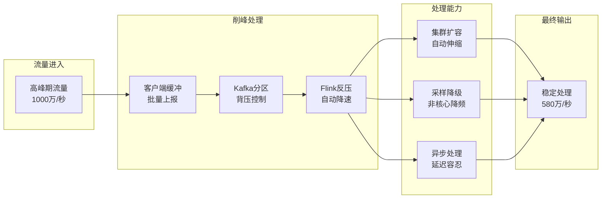

#### 5.2.2 性能优化实践

| 优化项 | 优化前 | 优化后 | 效果 |
|--------|--------|--------|------|
| Kafka分区 | 64分区 | 512分区 | 并行度提升8倍 |
| 序列化 | JSON | Protobuf | CPU降低40% |
| 状态后端 | MemoryStateBackend | RocksDBStateBackend | 支持TB级状态 |
| Checkpoint | 全量 | 增量 | 时间降低90% |
| 网络传输 | 同步 | 异步批量 | 吞吐提升3倍 |

### 5.3 实时 vs 离线权衡

#### 5.3.1 数据分层策略

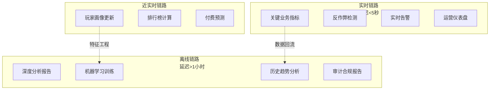

#### 5.3.2 选型决策矩阵

| 场景 | 实时要求 | 准确度要求 | 推荐方案 | 理由 |
|------|----------|------------|----------|------|
| 反作弊封禁 | 秒级 | 高 | 实时规则+ML | 必须立即响应 |
| 运营仪表盘 | 秒级 | 中 | 预聚合+缓存 | 查询性能优先 |
| 付费预测 | 小时级 | 高 | 批处理+增量 | 准确度优先 |
| 留存分析 | 天级 | 高 | 离线计算 | 数据完整性优先 |
| 排行榜 | 分钟级 | 高 | 流计算+缓存 | 平衡实时与准确 |

### 5.4 最佳实践总结

#### 5.4.1 数据质量保障

1. **Schema校验**: 所有进入系统的事件必须通过Schema验证
2. **数据对账**: 实时与离线数据每日对账，差异<0.01%
3. **异常监控**: 数据延迟、丢失、重复实时监控告警
4. **血缘追踪**: 全链路数据血缘，快速定位问题

#### 5.4.2 运维经验

1. **灰度发布**: 新功能先灰度1%游戏，观察稳定后全量
2. **容量规划**: 按峰值的3倍预留容量，应对突发流量
3. **故障演练**: 每月进行故障演练，验证恢复能力
4. **监控覆盖**: 2000+监控指标，5秒级采样

#### 5.4.3 团队协作

1. **数据驱动文化**: 所有决策必须有数据支撑
2. **跨职能团队**: 数据工程师、分析师、运营、策划紧密协作
3. **自助分析**: 提供自助分析工具，降低分析门槛
4. **知识沉淀**: 建立指标字典、分析案例库

---

## 引用参考


---

*Phase 2 - 任务线2-12: 游戏实时数据分析系统深度案例研究*
