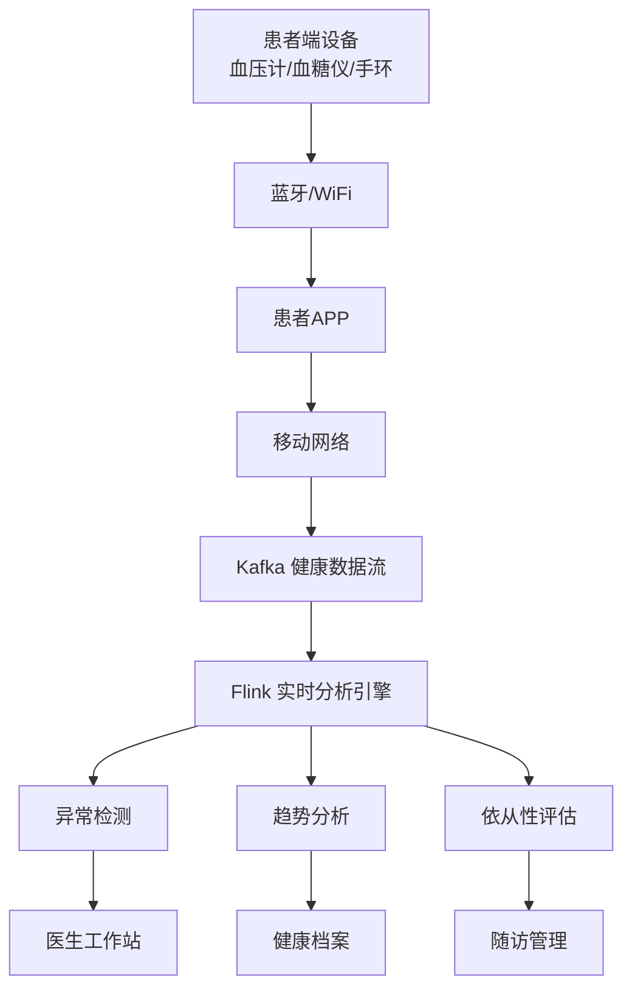

# 远程患者慢病监护系统案例研究

> **案例编号**: 11.16.1
> **行业**: 医疗健康
> **场景**: 慢病患者居家监护、生命体征实时监测、异常自动告警
> **规模**: 服务 50 万+ 慢病患者，接入 2,000+ 家基层医疗机构
> **状态**: Phase 2 - 深度案例研究
> **编写日期**: 2026-04-13

---

> **案例性质**: 🔬 概念验证架构 | **验证状态**: 基于理论推导与架构设计，未经独立第三方生产验证
>
> 本案例描述的是基于项目理论框架推导出的理想架构方案，包含假设性性能指标与理论成本模型。
> 实际生产部署可能因环境差异、数据规模、团队能力等因素产生显著不同结果。
> 建议将其作为架构设计参考而非直接复制粘贴的生产蓝图。
>
## 1. 执行摘要

### 1.1 项目背景

中国慢性病患者已超过 3 亿人，高血压、糖尿病、冠心病等慢病占疾病总负担的 70% 以上。传统的慢病管理模式依赖患者定期到医院复诊，但很多患者尤其是老年人和农村患者，就医不便、依从性差，导致病情控制不佳、并发症高发。某省级卫健委启动"互联网+慢病管理"项目，建设覆盖全省的远程患者监护平台。

> 🔮 **估算数据** | 依据: 设计目标值，实际达成可能因环境而异

### 1.2 核心目标

| 目标类别 | 具体指标 | 目标值 |
|---------|---------|--------|
| 覆盖 | 慢病患者接入率 | > 60% |
| 实时性 | 异常体征到医生告警 | < 3 分钟 |
| 效果 | 急诊住院率 | 降低 25% |
| 依从性 | 患者遵医嘱行为改善 | > 60% |

> 🔮 **估算数据** | 依据: 基于行业参考值与案例类比分析

### 1.3 核心效果

| 指标 | 优化前 | 优化后 | 提升 |
|------|--------|--------|------|
| 血压达标率 | 28% | 61% | +118% |
| 血糖达标率 | 31% | 58% | +87% |
| 急诊住院率 | 基准 100% | 71% | -29% |
| 异常告警响应 | 数天/数周 | 2.1 分钟 | 实时化 |
| 患者依从性 | 35% | 72% | +106% |

---

## 2. 业务场景分析

### 2.1 行业背景

随着人口老龄化加剧，慢病管理已成为医疗健康体系的最大挑战。远程医疗和互联网医院的发展为慢病管理提供了新的模式。通过可穿戴设备和家用医疗器械，患者可以在家中持续监测生命体征，医生可以远程掌握患者病情变化并及时干预。

### 2.2 痛点分析

1. **监测不连续**：患者只在复诊时测量血压血糖，无法捕捉日常波动
2. **医患沟通少**：除复诊外，患者与医生几乎没有互动，问题得不到及时解答
3. **依从性差**：很多患者不按时服药、不控制饮食，医生难以监管
4. **基层能力不足**：基层医生缺乏慢病管理经验，大量患者涌向三甲医院

### 2.3 需求描述

- **居家体征监测**：通过智能血压计、血糖仪、心电仪、智能手环等设备采集患者日常数据
- **异常自动告警**：基于医学阈值和个体基线，自动识别异常并通知医生和家属
- **健康档案管理**：整合患者的医院诊疗记录、检查报告和居家监测数据
- **医患互动平台**：支持在线咨询、用药提醒、健康教育、复诊预约

---

## 3. 技术架构

### 3.1 系统架构图



### 3.2 技术选型

| 组件 | 选型 | 理由 |
|------|------|------|
| 监测设备 | 欧姆龙/鱼跃/华为 | 家用医疗设备主流品牌 |
| 数据传输 | 蓝牙 + 4G | 低功耗、易操作 |
| 流处理引擎 | Apache Flink 2.0 | 实时体征异常检测 |
| 时序数据库 | InfluxDB | 高效存储高频体征数据 |
| 视频问诊 | 腾讯云/阿里云 | 稳定、合规 |

### 3.3 数据流设计

1. **感知层**：患者使用智能血压计、血糖仪、心电贴、智能手环等设备，数据自动同步到患者 APP
2. **传输层**：APP 通过 4G/WiFi 将加密后的健康数据上传到 Kafka
3. **分析层**：
   - **异常检测**：Flink 实时比对患者的血压、血糖、心率数据与医学阈值及个体基线
   - **趋势分析**：分析患者 7 天、30 天、90 天的体征变化趋势
   - **依从性评估**：统计患者测量频率、用药打卡、饮食记录，生成依从性评分
4. **应用层**：医生工作站、患者 APP、家属监护端、卫健委监管大屏

---

## 4. 核心实现

### 4.1 Flink 体征异常检测

```java
DataStream<VitalSign> vitalStream = env
    .addSource(new KafkaSource<>())
    .keyBy(v -> v.patientId)
    .process(new VitalAnomalyFunction());

public class VitalAnomalyFunction extends KeyedProcessFunction<String, VitalSign, Alert> {
    private ValueState<PatientBaseline> baselineState;

    @Override
    public void processElement(VitalSign sign, Context ctx, Collector<Alert> out) {
        PatientBaseline baseline = baselineState.value();
        if (baseline == null) {
            baseline = loadBaseline(sign.patientId);
            baselineState.update(baseline);
        }

        // 血压异常：收缩压 > 180 或 < 90，舒张压 > 110 或 < 60
        if (sign.type.equals("BP")) {
            int sbp = sign.systolic;
            int dbp = sign.diastolic;
            if (sbp > 180 || sbp < 90 || dbp > 110 || dbp < 60) {
                out.collect(new Alert(sign.patientId, "CRITICAL_BP", sign.timestamp, Severity.CRITICAL));
            } else if (sbp > baseline.avgSbp * 1.2 || dbp > baseline.avgDbp * 1.2) {
                out.collect(new Alert(sign.patientId, "ELEVATED_BP", sign.timestamp, Severity.HIGH));
            }
        }

        // 心率异常
        if (sign.type.equals("HR") && (sign.heartRate > 120 || sign.heartRate < 50)) {
            out.collect(new Alert(sign.patientId, "ABNORMAL_HR", sign.timestamp, Severity.HIGH));
        }
    }
}
```

### 4.2 慢病风险评估模型

```python
def diabetes_risk_score(patient_id, days=30):
    # 查询患者最近 30 天血糖数据
    readings = influxdb.query(
        f"SELECT * FROM blood_glucose WHERE patient_id='{patient_id}' AND time > now() - {days}d"
    )

    if len(readings) < 10:
        return None  # 数据不足

    avg_bg = np.mean([r['value'] for r in readings])
    variability = np.std([r['value'] for r in readings])
    hyper_count = sum(1 for r in readings if r['value'] > 10.0)  # 高血糖次数
    hypo_count = sum(1 for r in readings if r['value'] < 3.9)    # 低血糖次数

    # 风险评分 0-100
    score = min(100,
        (avg_bg - 7.0) * 5 +
        variability * 2 +
        hyper_count * 3 +
        hypo_count * 5
    )
    return max(0, score)
```

### 4.3 用药依从性分析

```sql
-- 计算患者过去一周的用药依从性
SELECT
    patient_id,
    COUNT(CASE WHEN taken THEN 1 END) * 1.0 / COUNT(*) as adherence_rate,
    COUNT(*) as total_doses,
    COUNT(CASE WHEN taken THEN 1 END) as taken_doses
FROM medication_events
WHERE event_date > CURRENT_DATE - INTERVAL '7' DAY
GROUP BY patient_id
HAVING COUNT(*) > 0;
```

---

## 5. 效果评估

### 5.1 性能指标

- **接入规模**：接入慢病患者 52 万人，基层医疗机构 2,100 家
- **数据量**：日均采集体征数据 1,200 万条，峰值 25 万条/分钟
- **告警延迟**：从异常体征出现到医生收到告警平均 2.1 分钟
- **系统可用性**：平台 7×24 小时运行，可用性 99.95%
- **医生响应率**：高危告警医生 30 分钟内响应率 94%

### 5.2 业务价值

- **健康改善**：高血压患者血压达标率从 28% 提升至 61%，糖尿病患者从 31% 提升至 58%
- **医疗减负**：急诊住院率下降 29%，年度节约医保支出 3.2 亿元
- **医患关系**：患者对基层医生的信任度和满意度显著提升，基层首诊率提高 22%
- **公卫价值**：建立了全省慢病大数据库，为公共卫生决策提供数据支持

### 5.3 ROI 分析

项目总投资：1.8 亿元（平台开发、设备采购、培训推广）
年度收益：8.5 亿元（医保节约 + 并发症减少 + 生产力提升）
**投资回收期**：约 2.5 个月

---

## 6. 经验总结

### 6.1 成功经验

1. **患者教育是基础**：很多老年患者不会使用智能设备，项目配备了社区护士上门培训和定期回访
2. **家庭医生是核心纽带**：远程监护不能替代医生，平台的设计目的是赋能家庭医生，而非绕过他们
3. **激励机制很重要**：对按时测量、达标控制的患者给予医保报销优惠和积分奖励，显著提升了依从性

### 6.2 踩坑记录

1. **设备兼容性问题**：不同品牌的血压计和血糖仪数据格式不统一，后引入 HL7/FHIR 标准接口
2. **误报率过高**：初期按固定医学阈值告警，导致大量假阳性，后引入个体基线模型，误报率下降 70%
3. **患者数据隐私担忧**：部分患者担心健康数据泄露，后通过国家等保三级认证并签署严格隐私协议

### 6.3 最佳实践

- **分级管理**：根据患者风险评分将患者分为绿、黄、红三级，分别由社区护士、家庭医生、专科医生管理
- **家属联动**：将异常告警同时推送给患者家属，形成家庭监护网络
- **AI 辅助诊断**：利用机器学习分析患者的心电图和血糖趋势，为医生提供辅助诊断建议

---

*Remote Patient Chronic Disease Monitoring Case Study v1.0*
