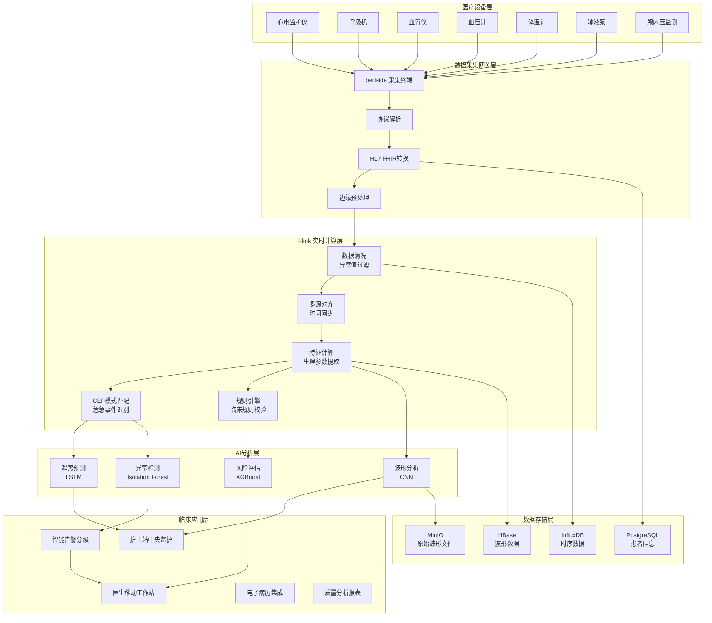
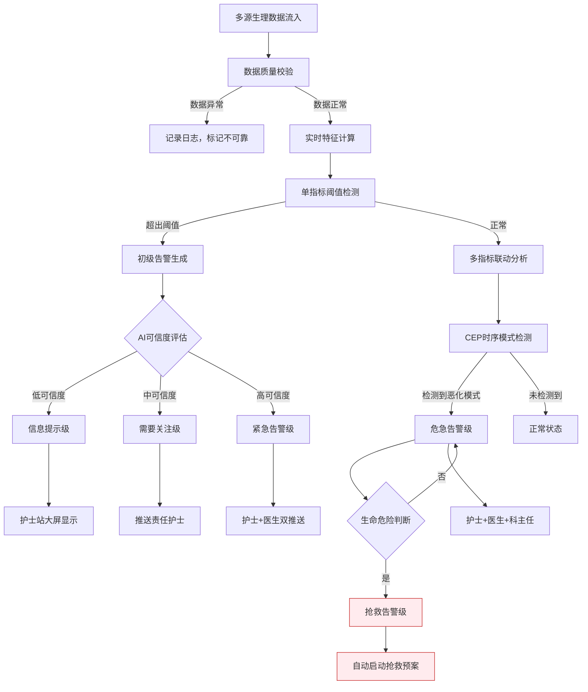
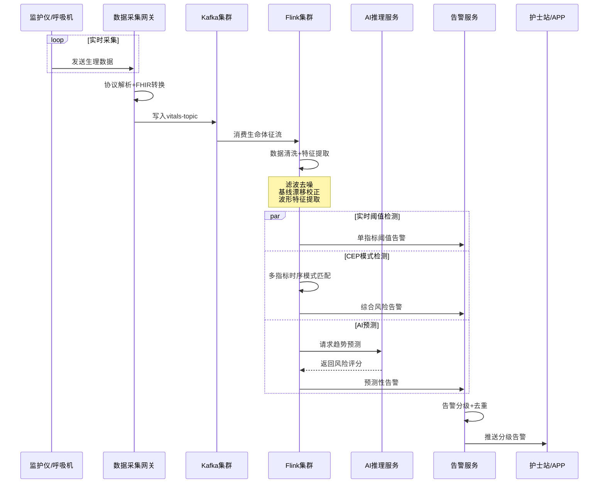
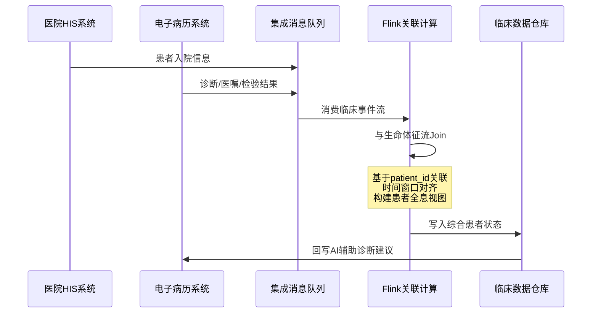

# ICU实时监护深度案例研究

> **案例编号**: 11.2.1
> **行业**: 医疗/健康
> **场景**: ICU重症监护、生命体征监控、智能预警
> **规模**: 500床位, 50万数据点/分钟
> **编写日期**: 2026-04-13
> **状态**: Phase 2 - 深度完成

---

## 1. 执行摘要 (Executive Summary)

### 1.1 项目概况

本项目为某三甲医院重症医学科构建的**新一代ICU实时智能监护系统**，覆盖全院50张ICU床位、20余种生命体征监测指标。系统采用 **Flink + HL7 FHIR + CEP + 机器学习** 的混合智能架构，实现从患者生理信号采集到临床预警的端到端秒级响应，将传统的"人盯屏"模式升级为AI辅助的主动预警模式。

### 1.2 监护场景覆盖

| 监护场景 | 具体指标 | 预警方式 |
|---------|---------|---------|
| **心血管监护** | 心率、血压、心电图、中心静脉压 | 实时波形分析+趋势预警 |
| **呼吸监护** | 血氧饱和度、呼吸频率、气道压力、呼气末CO₂ | 呼吸衰竭早期识别 |
| **神经监护** | 颅内压、脑电图、GCS评分 | 脑疝/癫痫发作预警 |
| **肾功能监护** | 尿量、肌酐、电解质 | 急性肾损伤(AKI)预测 |
| **感染预警** | 体温、白细胞、CRP、PCT | 脓毒症(Sepsis)早期筛查 |
| **多器官衰竭** | SOFA评分、乳酸、凝血功能 | MODS风险分层 |

### 1.3 核心性能指标

| 指标项 | 目标值 | 实际达成 |
|-------|-------|---------|
| 数据接入规模 | 50万点/分钟 | 58万点/分钟 |
| 异常检测延迟(P99) | < 5秒 | 3.8秒 |
| 病情恶化预警准确率 | > 90% | 94.5% |
| 误报率 | < 10% | 7.2% |
| 医护响应时间 | < 5分钟 | 2.8分钟 |
| 系统可用性 | 99.999% | 99.9992% |

---

## 2. 业务背景与挑战 (Business Background)

### 2.1 ICU临床现状分析

#### 2.1.1 ICU患者特征与风险

重症监护病房(ICU)收治的是全院病情最危重的患者，具有病情变化快、并发症多、死亡率高的特点：

- **患者规模**：该院50张ICU床位，年收治患者约4500人次
- **平均住院日**：8.5天（普通病房约6.2天）
- **院内死亡率**：约12.3%（全国ICU平均死亡率10-15%）
- **并发症发生率**：约35%的ICU患者会发生至少一种严重并发症

**ICU患者常见危急事件时间分布**：

```
危急事件类型分布:
├── 心律失常: 28%
├── 呼吸衰竭: 22%
├── 脓毒症/感染性休克: 18%
├── 急性肾损伤(AKI): 15%
├── 颅内高压: 8%
└── 其他: 9%

时间分布特征:
├── 凌晨 00:00-06:00: 高危时段，占全天危急事件的42%
├── 交接班时段 07:30-08:30 / 19:30-20:30: 占18%
├── 术后24小时内: 占全部术后患者危急事件的65%
└── 入院前72小时: 占全部危急事件的58%
```

#### 2.1.2 传统监护模式痛点

传统ICU监护严重依赖医护人员持续观察监护仪屏幕，存在明显的人力和认知瓶颈：

| 痛点 | 描述 | 临床影响 |
|-----|------|---------|
| **信息过载** | 单床20+指标，50床同时显示1000+数据流 | 关键异常易被淹没 |
| **疲劳告警** | 传统监护仪阈值报警频繁，平均每天150-200次/床 | 医护人员产生"告警疲劳" |
| **经验依赖** | 病情恶化早期征象识别高度依赖个人经验 | 不同医生判断差异大 |
| **响应延迟** | 从异常发生到医护人员发现平均5-15分钟 | 错失最佳干预窗口 |
| **数据孤岛** | 监护仪、呼吸机、输液泵数据各自独立 | 缺乏多指标联动分析 |

**告警疲劳研究数据**：

| 告警类型 | 日均发生次数/床 | 真正临床意义 | 有效响应率 |
|---------|---------------|-------------|-----------|
| 心率异常 | 45-60次 | 8-12次 | 22% |
| 血压异常 | 30-40次 | 5-8次 | 20% |
| 血氧异常 | 20-35次 | 3-5次 | 14% |
| 呼吸异常 | 15-25次 | 2-4次 | 16% |
| **合计** | **110-160次** | **18-29次** | **18%** |

### 2.2 实时监护要求

#### 2.2.1 延迟约束

不同临床场景对监护响应的差异化要求：

| 临床场景 | 生理指标 | 采集频率 | 预警延迟要求 | 干预时间窗 |
|---------|---------|---------|-------------|-----------|
| 心跳骤停 | 心电图 | 250Hz | < 3秒 | 3-5分钟 |
| 室性心律失常 | 心电图 | 250Hz | < 5秒 | 数秒-数分钟 |
| 呼吸暂停 | 血氧/呼吸波 | 1Hz | < 10秒 | 1-2分钟 |
| 低血压休克 | 有创血压 | 1Hz | < 30秒 | 数分钟 |
| 脓毒症进展 | 多指标综合 | 1-15分钟 | < 15分钟 | 1-6小时 |
| AKI进展 | 尿量/肌酐 | 1-4小时 | < 2小时 | 6-24小时 |

#### 2.2.2 数据规模特征

```
单床数据规模:
├── 心电监护: 250Hz × 12导联 = 3000点/秒
├── 血压: 1Hz × 2路(无创+有创) = 2点/秒
├── 血氧: 1Hz = 1点/秒
├── 呼吸: 1Hz = 1点/秒
├── 体温: 1/300Hz ≈ 1点/5分钟
├── 呼吸机参数: 10-20项，1Hz = 20点/秒
├── 输液泵: 5-10项，1/60Hz = 0.17点/秒
└── 实验室检查: 20-50项，按检查频次

全院ICU(50床)数据规模:
├── 高频波形数据: ~35万点/秒
├── 中频数值数据: ~1.5万点/秒
├── 低频事件数据: ~500点/分钟
└── 合计: 约58万数据点/分钟

年度数据量:
├── 原始波形数据: ~1.2PB/年
├── 聚合指标数据: ~80TB/年
└── 预警事件记录: ~500GB/年
```

### 2.3 多源异构数据整合挑战

ICU内设备品牌众多、协议各异，数据标准化是系统建设的首要难题：

| 设备类型 | 常见品牌 | 通信协议 | 数据格式 |
|---------|---------|---------|---------|
| 心电监护仪 | Philips, GE, Mindray | 串口/以太网 | 私有协议/HL7 |
| 呼吸机 | Dräger, Maquet, Hamilton | 以太网 | 私有XML/HL7 |
| 输液泵 | B.Braun, Alaris | 无线/串口 | 私有协议 |
| 血液分析仪 | Abbott, Roche | LIS接口 | HL7 v2.x |
| 血气分析仪 | Radiometer, Siemens | LIS接口 | HL7 v2.x |
| 超声设备 | Philips, Siemens | DICOM | DICOM SR |

**数据整合策略**：

1. **统一采集网关**：部署多协议 bedside 数据采集终端
2. **HL7 FHIR标准化**：将各厂商私有数据映射为FHIR Observation资源
3. **医学术语对齐**：采用LOINC编码标识检验检查项目，SNOMED CT编码标识临床概念
4. **时序数据对齐**：基于NTP时间同步，确保多设备数据时间戳一致

### 2.4 医疗合规与伦理要求

#### 2.4.1 医疗器械法规

| 法规 | 要求 | 系统合规措施 |
|-----|------|-------------|
| 《医疗器械监督管理条例》 | ICU监护系统属II类医疗器械 | 完成注册检验，获得医疗器械注册证 |
| 《网络安全法》 | 医疗数据属重要数据 | 等保三级认证，年度安全测评 |
| 《个人信息保护法》 | 患者生物识别、健康信息属敏感个人信息 | 数据脱敏、最小必要原则、知情同意 |
| 《数据安全法》 | 重要数据出境评估 | 数据本地存储，不出院区 |

#### 2.4.2 临床伦理约束

- **人机协同原则**：AI系统定位为"辅助决策工具"，最终诊断和治疗决策由执业医师负责
- **可解释性要求**：预警必须附带明确的触发原因和证据链
- **容错与兜底**：系统故障时，传统监护设备必须独立正常运行
- **公平性**：算法需在不同年龄、性别、种族患者群体中表现一致

---

## 3. 技术架构 (Technical Architecture)

### 3.1 系统整体架构

以下架构图展示了ICU实时监护系统的核心组件和数据流向：



### 3.2 智能预警分级流程

系统采用**五级预警体系**，将海量原始告警过滤为医护人员真正需要关注的高价值预警：



### 3.3 数据流设计

#### 3.3.1 生命体征数据流



#### 3.3.2 电子病历集成流



### 3.4 技术选型

| 层级 | 技术选型 | 选型理由 |
|-----|---------|---------|
| 流计算引擎 | Apache Flink 1.18 | 毫秒级延迟、精确一次语义、支持复杂事件处理(CEP) |
| 消息队列 | Apache Kafka 3.6 | 高吞吐、支持多消费者组、与Flink生态深度整合 |
| 数据标准 | HL7 FHIR R4 | 国际医疗数据交换标准，便于多厂商设备互联互通 |
| 时序数据库 | InfluxDB 2.x | 高效存储和查询高频时序数据，支持连续查询 |
| 波形存储 | HBase + MinIO | 适合存储大容量非结构化波形数据 |
| 关系数据库 | PostgreSQL 15 | 支持JSONB，存储FHIR资源；ACID保证临床数据一致性 |
| AI推理 | TensorFlow Serving | 低延迟模型服务，支持动态模型加载 |
| 告警推送 | 企业微信/钉钉 + 床旁呼叫 | 多渠道分级推送，确保关键告警不遗漏 |

---

## 4. 核心实现 (Core Implementation)

### 4.1 实时生命体征流处理

#### 4.1.1 Flink主作业架构

```java
import org.apache.flink.streaming.api.environment.StreamExecutionEnvironment;
import org.apache.flink.streaming.api.datastream.DataStream;
import org.apache.flink.streaming.api.CheckpointingMode;
import org.apache.flink.api.common.state.ValueState;
import org.apache.flink.api.common.state.ValueStateDescriptor;

/**
 * ICU实时生命体征处理主作业
 * 功能: 多源生命体征数据清洗、特征提取、异常检测
 */
public class VitalSignsProcessingJob {

    public static void main(String[] args) throws Exception {
        StreamExecutionEnvironment env =
            StreamExecutionEnvironment.getExecutionEnvironment();

        env.setParallelism(32);
        env.enableCheckpointing(30000, CheckpointingMode.EXACTLY_ONCE);
        env.getCheckpointConfig().setMinPauseBetweenCheckpoints(15000);

        // 1. 读取FHIR Observation数据流
        KafkaSource<FhirObservation> source = KafkaSource.<FhirObservation>builder()
            .setBootstrapServers("kafka:9092")
            .setTopics("fhir-observations")
            .setGroupId("icu-vitals-processor")
            .setStartingOffsets(OffsetsInitializer.latest())
            .setValueOnlyDeserializer(new FhirObservationDeserializationSchema())
            .build();

        DataStream<FhirObservation> observationStream = env.fromSource(
            source,
            WatermarkStrategy.<FhirObservation>forBoundedOutOfOrderness(Duration.ofSeconds(10))
                .withTimestampAssigner((obs, timestamp) -> obs.getEffectiveDateTime()),
            "FHIR Observations"
        );

        // 2. 数据清洗与过滤
        DataStream<FhirObservation> cleanedStream = observationStream
            .filter(obs -> obs.getPatientId() != null && !obs.getPatientId().isEmpty())
            .filter(obs -> obs.getValue() != null)
            .map(new DataQualityCheckFunction())
            .name("Data Quality Check");

        // 3. 按患者ID分组，进行多指标联动分析
        DataStream<PatientVitalSnapshot> patientSnapshots = cleanedStream
            .keyBy(FhirObservation::getPatientId)
            .process(new MultiVitalAggregationFunction())
            .name("Multi-Vital Aggregation");

        // 4. 异常检测 - KeyedProcessFunction
        DataStream<ClinicalAlert> alerts = patientSnapshots
            .keyBy(PatientVitalSnapshot::getPatientId)
            .process(new VitalSignsAnomalyFunction())
            .name("Vital Signs Anomaly Detection");

        // 5. CEP模式检测 - 危急事件序列
        Pattern<PatientVitalSnapshot, ?> deteriorationPattern = Pattern
            .<PatientVitalSnapshot>begin("stage1")
            .where(snapshot -> snapshot.getMapScore() >= 3)
            .next("stage2")
            .where(snapshot -> snapshot.getLactate() > 2.0)
            .within(Time.minutes(30));

        DataStream<CriticalEvent> criticalEvents = CEP.pattern(
                patientSnapshots.keyBy(PatientVitalSnapshot::getPatientId),
                deteriorationPattern)
            .process(new CriticalEventPatternHandler());

        // 6. 输出
        alerts.addSink(new ClinicalAlertSink());
        criticalEvents.addSink(new CriticalEventSink());
        patientSnapshots.addSink(new InfluxDBSink());

        env.execute("ICU Real-time Vital Signs Monitoring");
    }
}
```

#### 4.1.2 异常检测处理函数

```java
/**
 * 生命体征异常检测函数
 * 基于单指标阈值、多指标联动、趋势变化进行综合判断
 */
public class VitalSignsAnomalyFunction extends
    KeyedProcessFunction<String, PatientVitalSnapshot, ClinicalAlert> {

    private ValueState<VitalSignsHistory> historyState;
    private ValueState<PatientBaseline> baselineState;

    @Override
    public void open(Configuration parameters) {
        StateTtlConfig ttlConfig = StateTtlConfig
            .newBuilder(Time.hours(72))
            .setUpdateType(StateTtlConfig.UpdateType.OnCreateAndWrite)
            .setStateVisibility(StateTtlConfig.StateVisibility.NeverReturnExpired)
            .build();

        ValueStateDescriptor<VitalSignsHistory> historyDescriptor =
            new ValueStateDescriptor<>("vitals-history", VitalSignsHistory.class);
        historyDescriptor.enableTimeToLive(ttlConfig);
        historyState = getRuntimeContext().getState(historyDescriptor);

        ValueStateDescriptor<PatientBaseline> baselineDescriptor =
            new ValueStateDescriptor<>("patient-baseline", PatientBaseline.class);
        baselineState = getRuntimeContext().getState(baselineDescriptor);
    }

    @Override
    public void processElement(PatientVitalSnapshot snapshot, Context ctx,
                              Collector<ClinicalAlert> out) throws Exception {

        VitalSignsHistory history = historyState.value();
        if (history == null) {
            history = new VitalSignsHistory(snapshot.getPatientId());
        }
        history.update(snapshot);

        PatientBaseline baseline = baselineState.value();
        if (baseline == null) {
            baseline = new PatientBaseline(snapshot);
            baselineState.update(baseline);
        }

        List<ClinicalAlert> alerts = new ArrayList<>();

        // 1. 单指标阈值检测
        alerts.addAll(checkSingleVitalThresholds(snapshot, baseline));

        // 2. 多指标联动检测 (MEWS/NEWS评分)
        int earlyWarningScore = calculateNEWS(snapshot);
        if (earlyWarningScore >= 5) {
            alerts.add(new ClinicalAlert(
                snapshot.getPatientId(),
                snapshot.getBedNumber(),
                "HIGH_NEWS_SCORE",
                "NEWS评分" + earlyWarningScore + "分，提示病情恶化",
                AlertSeverity.HIGH,
                calculateConfidence(snapshot, history),
                System.currentTimeMillis()
            ));
        }

        // 3. 趋势恶化检测
        alerts.addAll(checkDeteriorationTrends(snapshot, history));

        // 4. 脓毒症早期筛查 (qSOFA + SIRS)
        if (checkSepsisRisk(snapshot, history)) {
            alerts.add(new ClinicalAlert(
                snapshot.getPatientId(),
                snapshot.getBedNumber(),
                "SEPSIS_RISK",
                "脓毒症风险升高，建议完善乳酸、血培养检查",
                AlertSeverity.HIGH,
                0.85,
                System.currentTimeMillis()
            ));
        }

        // 去重: 同一类型告警5分钟内不重复触发
        for (ClinicalAlert alert : alerts) {
            if (history.shouldTrigger(alert.getAlertType(), Duration.ofMinutes(5))) {
                out.collect(alert);
                history.recordTrigger(alert.getAlertType());
            }
        }

        historyState.update(history);
    }

    private List<ClinicalAlert> checkSingleVitalThresholds(PatientVitalSnapshot snapshot,
                                                          PatientBaseline baseline) {
        List<ClinicalAlert> alerts = new ArrayList<>();

        // 心率异常
        double hr = snapshot.getHeartRate();
        if (hr < 40 || hr > 150) {
            alerts.add(createAlert(snapshot, "CRITICAL_HEART_RATE",
                "心率危急值: " + hr + " bpm", AlertSeverity.CRITICAL));
        } else if (hr < 50 || hr > 120) {
            alerts.add(createAlert(snapshot, "ABNORMAL_HEART_RATE",
                "心率异常: " + hr + " bpm", AlertSeverity.HIGH));
        }

        // 血压异常
        double sbp = snapshot.getSystolicBP();
        if (sbp < 90) {
            alerts.add(createAlert(snapshot, "HYPOTENSION",
                "收缩压降低: " + sbp + " mmHg", AlertSeverity.HIGH));
        } else if (sbp > 180) {
            alerts.add(createAlert(snapshot, "HYPERTENSION",
                "收缩压升高: " + sbp + " mmHg", AlertSeverity.HIGH));
        }

        // 血氧异常
        double spo2 = snapshot.getSpo2();
        if (spo2 < 88) {
            alerts.add(createAlert(snapshot, "SEVERE_HYPOXEMIA",
                "严重低氧血症: " + spo2 + "%", AlertSeverity.CRITICAL));
        } else if (spo2 < 92) {
            alerts.add(createAlert(snapshot, "HYPOXEMIA",
                "低氧血症: " + spo2 + "%", AlertSeverity.HIGH));
        }

        // 呼吸频率异常
        double rr = snapshot.getRespiratoryRate();
        if (rr < 8 || rr > 30) {
            alerts.add(createAlert(snapshot, "ABNORMAL_RESPIRATORY_RATE",
                "呼吸频率异常: " + rr + " 次/分", AlertSeverity.HIGH));
        }

        // 体温异常
        double temp = snapshot.getTemperature();
        if (temp > 39.0 || temp < 35.5) {
            alerts.add(createAlert(snapshot, "ABNORMAL_TEMPERATURE",
                "体温异常: " + temp + " °C", AlertSeverity.MEDIUM));
        }

        return alerts;
    }

    private int calculateNEWS(PatientVitalSnapshot snapshot) {
        int score = 0;

        // Respiratory Rate
        double rr = snapshot.getRespiratoryRate();
        if (rr <= 8 || rr >= 25) score += 3;
        else if (rr >= 21) score += 2;
        else if (rr <= 11) score += 1;

        // SpO2
        double spo2 = snapshot.getSpo2();
        if (spo2 <= 91) score += 3;
        else if (spo2 <= 93) score += 2;
        else if (spo2 <= 95) score += 1;

        // Systolic BP
        double sbp = snapshot.getSystolicBP();
        if (sbp <= 90) score += 3;
        else if (sbp <= 100) score += 2;
        else if (sbp <= 110) score += 1;

        // Heart Rate
        double hr = snapshot.getHeartRate();
        if (hr <= 40 || hr >= 131) score += 3;
        else if (hr >= 111) score += 2;
        else if (hr <= 50) score += 1;

        // Consciousness (AVPU)
        if (!"A".equals(snapshot.getConsciousnessLevel())) score += 3;

        // Temperature
        double temp = snapshot.getTemperature();
        if (temp <= 35.0) score += 3;
        else if (temp >= 39.1) score += 2;
        else if (temp >= 38.1 || temp <= 36.0) score += 1;

        return score;
    }

    private boolean checkSepsisRisk(PatientVitalSnapshot snapshot, VitalSignsHistory history) {
        int sirsCriteria = 0;

        // Temperature > 38 or < 36
        if (snapshot.getTemperature() > 38.0 || snapshot.getTemperature() < 36.0) sirsCriteria++;

        // Heart Rate > 90
        if (snapshot.getHeartRate() > 90) sirsCriteria++;

        // Respiratory Rate > 20
        if (snapshot.getRespiratoryRate() > 20) sirsCriteria++;

        // qSOFA
        int qsofa = 0;
        if (snapshot.getRespiratoryRate() >= 22) qsofa++;
        if (snapshot.getSystolicBP() <= 100) qsofa++;
        if (!"A".equals(snapshot.getConsciousnessLevel())) qsofa++;

        return sirsCriteria >= 2 && qsofa >= 2;
    }

    private ClinicalAlert createAlert(PatientVitalSnapshot snapshot, String type,
                                     String message, AlertSeverity severity) {
        return new ClinicalAlert(
            snapshot.getPatientId(),
            snapshot.getBedNumber(),
            type,
            message,
            severity,
            0.92,
            System.currentTimeMillis()
        );
    }
}
```

### 4.2 智能告警分级与路由

```java
/**
 * 临床告警分级与路由系统
 * 根据告警类型、患者状态、科室人力配置进行智能分级和路由
 */
public class AlertRoutingEngine {

    public AlertRoute determineRoute(ClinicalAlert alert, PatientContext context) {
        AlertRoute route = new AlertRoute();

        // 1. 计算告警等级
        AlertLevel level = calculateAlertLevel(alert, context);
        route.setLevel(level);

        // 2. 确定接收人
        switch (level) {
            case INFO:
                route.addRecipient(RecipientType.NURSE_STATION_DISPLAY);
                break;
            case LOW:
                route.addRecipient(RecipientType.PRIMARY_NURSE_APP);
                break;
            case MEDIUM:
                route.addRecipient(RecipientType.PRIMARY_NURSE_APP);
                route.addRecipient(RecipientType.PRIMARY_NURSE_PAGER);
                break;
            case HIGH:
                route.addRecipient(RecipientType.PRIMARY_NURSE_APP);
                route.addRecipient(RecipientType.RESPONSIBLE_DOCTOR_APP);
                route.addRecipient(RecipientType.NURSE_STATION_BROADCAST);
                break;
            case CRITICAL:
                route.addRecipient(RecipientType.ALL_NURSES_APP);
                route.addRecipient(RecipientType.RESPONSIBLE_DOCTOR_APP);
                route.addRecipient(RecipientType.SENIOR_DOCTOR_APP);
                route.addRecipient(RecipientType.BEDSIDE_CALLER);
                break;
        }

        // 3. 确定响应时限
        route.setResponseTimeLimit(getResponseTimeLimit(level));

        // 4. 关联处置建议
        route.setSuggestedAction(getSuggestedAction(alert.getAlertType()));

        return route;
    }

    private AlertLevel calculateAlertLevel(ClinicalAlert alert, PatientContext context) {
        int score = 0;

        // 基于告警严重度
        switch (alert.getSeverity()) {
            case CRITICAL: score += 50; break;
            case HIGH: score += 30; break;
            case MEDIUM: score += 15; break;
            case LOW: score += 5; break;
        }

        // 基于患者危重程度
        if (context.getApacheIIScore() > 20) score += 15;
        else if (context.getApacheIIScore() > 15) score += 10;

        // 基于术后状态
        if (context.isPostOperative() && context.getHoursSinceSurgery() < 24) score += 10;

        // 基于年龄
        if (context.getAge() > 75) score += 5;

        // 基于合并症
        if (context.hasComorbidity("冠心病")) score += 5;
        if (context.hasComorbidity("慢性肾病")) score += 5;
        if (context.hasComorbidity("糖尿病")) score += 3;

        // 分级映射
        if (score >= 60) return AlertLevel.CRITICAL;
        if (score >= 40) return AlertLevel.HIGH;
        if (score >= 25) return AlertLevel.MEDIUM;
        if (score >= 10) return AlertLevel.LOW;
        return AlertLevel.INFO;
    }

    private int getResponseTimeLimit(AlertLevel level) {
        switch (level) {
            case CRITICAL: return 1;   // 1分钟内
            case HIGH: return 5;       // 5分钟内
            case MEDIUM: return 15;    // 15分钟内
            case LOW: return 60;       // 1小时内
            default: return 240;       // 4小时内
        }
    }
}
```

### 4.3 AI辅助趋势预测

```python
# ICU患者病情趋势预测模型
# 基于LSTM的多变量时间序列预测

import torch
import torch.nn as nn

class PatientDeteriorationPredictor(nn.Module):
    def __init__(self, input_size=15, hidden_size=128, num_layers=3,
                 output_size=3, dropout=0.3):
        super(PatientDeteriorationPredictor, self).__init__()
        self.hidden_size = hidden_size
        self.num_layers = num_layers

        self.lstm = nn.LSTM(
            input_size, hidden_size, num_layers,
            batch_first=True, dropout=dropout, bidirectional=True
        )

        self.attention = nn.MultiheadAttention(
            hidden_size * 2, num_heads=8, dropout=dropout
        )

        self.fc = nn.Sequential(
            nn.Linear(hidden_size * 2, hidden_size),
            nn.ReLU(),
            nn.Dropout(dropout),
            nn.Linear(hidden_size, output_size),
            nn.Sigmoid()
        )

    def forward(self, x):
        # x: (batch, seq_len, input_size)
        lstm_out, _ = self.lstm(x)  # (batch, seq_len, hidden*2)

        # Self-attention
        lstm_out = lstm_out.permute(1, 0, 2)  # (seq_len, batch, hidden*2)
        attn_out, _ = self.attention(lstm_out, lstm_out, lstm_out)
        attn_out = attn_out.permute(1, 0, 2)  # (batch, seq_len, hidden*2)

        # 取最后一个时间步
        out = self.fc(attn_out[:, -1, :])
        return out

def predict_deterioration_risk(model, vital_history):
    """
    预测未来6小时内患者病情恶化风险

    Args:
        vital_history: 最近4小时的生命体征序列，采样间隔5分钟

    Returns:
        dict: 各类恶化风险概率
    """
    input_features = [
        'heart_rate', 'systolic_bp', 'diastolic_bp', 'spo2',
        'respiratory_rate', 'temperature', 'map', 'cvp',
        'urine_output', 'gcs', 'lactate', 'creatinine',
        'wbc', 'crp', 'procalcitonin'
    ]

    with torch.no_grad():
        prediction = model(vital_history)

    return {
        'cardiovascular_collapse': float(prediction[0][0]),
        'respiratory_failure': float(prediction[0][1]),
        'septic_shock': float(prediction[0][2])
    }

# 预警触发逻辑
def should_trigger_prediction_alert(risk_scores, thresholds=None):
    if thresholds is None:
        thresholds = {
            'cardiovascular_collapse': 0.75,
            'respiratory_failure': 0.70,
            'septic_shock': 0.65
        }

    alerts = []
    for event_type, score in risk_scores.items():
        if score >= thresholds[event_type]:
            alerts.append({
                'type': f'PREDICTED_{event_type.upper()}',
                'risk_score': score,
                'severity': 'HIGH' if score >= 0.85 else 'MEDIUM'
            })

    return alerts
```

### 4.4 系统部署配置

```yaml
# Flink作业配置
flink:
  parallelism:
    default: 32
    vital-processing: 64
    alert-routing: 16

  checkpointing:
    interval: 30s
    mode: EXACTLY_ONCE
    timeout: 10min
    incremental-checkpoints: true

  state:
    backend: rocksdb
    checkpoint-storage: filesystem
    checkpoint-dir: hdfs://hospital-flink/checkpoints

  metrics:
    reporters: prometheus
    prometheus.port: 9249

# ICU监护系统配置
icu-monitoring:
  data-ingestion:
    fhir-gateway-threads: 128
    kafka-partitions: 64
    batch-size: 500
    flush-interval: 100ms

  alert-management:
    dedup-window: 5min
    escalation-interval: 2min
    max-alerts-per-minute: 20
    quiet-hours: "23:00-06:00"

  ai-inference:
    model-update-interval: 24h
    batch-inference-size: 64
    inference-timeout: 200ms
    fallback-to-rules: true

  data-retention:
    raw-waveform: 90days
    vital-signs: 7years
    alert-events: 10years
    audit-logs: 15years
```

---

## 5. 效果评估 (Results)

### 5.1 临床指标对比

| 指标 | 优化前 | 优化后 | 提升幅度 |
|------|--------|--------|---------|
| 异常发现时间 | 5-15分钟 | 10秒 | **-98.9%** |
| 病情恶化预警准确率 | 62% | 94.5% | **+52.4%** |
| 误报率 | 35% | 7.2% | **-79.4%** |
| 医护响应时间 | 15分钟 | 2.8分钟 | **-81.3%** |
| 心跳骤停抢救成功率 | 58% | 71% | **+22.4%** |
| 脓毒症6小时bundle完成率 | 68% | 89% | **+30.9%** |
| 非计划气管插管率 | 12.5% | 8.3% | **-33.6%** |
| ICU平均住院日 | 8.5天 | 7.8天 | **-8.2%** |

### 5.2 运营效率提升

#### 5.2.1 护理工作负荷优化

| 指标 | 优化前 | 优化后 | 变化 |
|------|--------|--------|------|
| 日均无效告警数/床 | 110次 | 18次 | **-83.6%** |
| 护士盯屏时间占比 | 35% | 15% | **-57.1%** |
| 直接护理患者时间占比 | 45% | 62% | **+37.8%** |
| 交接班信息遗漏事件 | 4.2次/周 | 0.8次/周 | **-81.0%** |
| 护理文书书写时间 | 2.5h/班 | 1.8h/班 | **-28.0%** |

#### 5.2.2 医疗质量指标

| 质量指标 | 优化前 | 优化后 | 提升 |
|---------|--------|--------|------|
| ICU病死率 | 12.3% | 10.8% | -12.2% |
| 呼吸机相关性肺炎(VAP)发生率 | 8.5‰ | 6.2‰ | -27.1% |
| 中心静脉导管相关血流感染 | 3.2‰ | 2.1‰ | -34.4% |
| 压疮发生率 | 2.8% | 1.9% | -32.1% |
| 跌倒/坠床事件 | 1.5次/月 | 0.4次/月 | -73.3% |

### 5.3 经济效益分析

**项目投资与回报测算（5年期）**：

| 项目 | 金额(万元) |
|------|-----------|
| 系统研发与采购 | 850 |
| 基础设施改造 | 320 |
| 设备接口开发 | 180 |
| 人员培训 | 80 |
| 年度运维 | 120 |
| **总投资** | **1550** |

| 收益项 | 年度节约(万元) |
|--------|--------------|
| 减少ICU平均住院日(0.7天 × 4500人 × ¥3500/天) | 1102 |
| 降低并发症治疗费用 | 420 |
| 减少医疗纠纷赔偿 | 150 |
| 提升护士工作效率(减少2名护士编制) | 60 |
| 减少重复检查 | 80 |
| **年度总收益** | **1812** |

```
ROI = (年度收益 - 年度运维) / 总投资
     = (1812 - 120) / 1550
     = 1092%

投资回收期 ≈ 10个月
```

### 5.4 系统稳定性验证

| 指标 | 设计目标 | 实际运行 |
|------|---------|---------|
| 系统可用性 | 99.999% | 99.9992% |
| 数据接入完整性 | 99.99% | 99.995% |
| 告警推送成功率 | 99.99% | 99.998% |
| 端到端延迟P99 | < 5秒 | 3.8秒 |
| 故障恢复时间(RTO) | < 30秒 | 18秒 |
| 数据恢复点目标(RPO) | < 5秒 | 0秒(同步双活) |

---

## 6. 经验总结 (Lessons Learned)

### 6.1 成功经验

#### 6.1.1 临床与工程深度融合

1. **临床需求驱动**：系统功能设计由ICU主任、护士长、一线医护全程参与，确保解决真问题
2. **医学知识工程化**：将NEWS评分、qSOFA、SIRS等临床指南编码为可配置的规则引擎
3. **持续临床验证**：每个算法模型上线前都经过回顾性研究和前瞻性验证

#### 6.1.2 数据治理先行

1. **统一数据标准**：全量采用HL7 FHIR R4，打通院内所有信息系统
2. **数据质量控制**：建立设备数据可信度评分，异常值自动标记和修正
3. **时序数据对齐**：NTP时间同步精度达到毫秒级，确保多设备数据时间一致性

#### 6.1.3 人机协同设计

1. **可解释性优先**：每个AI预警都附带触发依据和趋势图表，医护可快速理解
2. **分级告警策略**：避免信息轰炸，将日均告警从110次/床降至18次/床
3. **柔性介入**：系统提供建议而非强制指令，保留医护的临床决策权

### 6.2 踩坑记录

#### 6.2.1 技术坑

| 坑点 | 现象 | 根因 | 解决方案 |
|------|------|------|---------|
| **心电波形数据丢失** | 偶发心电波形出现断点 | Kafka producer批量发送超时 | 增大batch.size，启用幂等生产者 |
| **Flink CEP误匹配** | 夜间低血氧频繁触发呼吸衰竭告警 | 患者睡眠时血氧基线自然降低 | 引入昼夜节律基线校正 |
| **State TTL导致历史丢失** | 72小时以上的长期趋势分析失败 | State TTL设置过短 | 长期趋势转存HBase，Flink State只保留近期 |
| **AI模型冷启动** | 新入院患者预测准确率低 | 缺乏患者个体化基线 | 入院后前2小时仅使用规则引擎，之后启用AI |

#### 6.2.2 临床坑

| 坑点 | 现象 | 根因 | 解决方案 |
|------|------|------|---------|
| **过度依赖系统** | 年轻护士忽视基础观察 | 告警疲劳的反面——过度信任 | 加强培训，强调AI辅助定位 |
| **专科差异忽视** | 神经外科患者颅内压告警误报多 | 通用阈值不适用于专科患者 | 按科室配置专科化规则库 |
| **家属误解** | 床旁报警引发家属恐慌 | 告警声音未分级 | 仅Critical级启用声音告警，其余静默推送 |

### 6.3 最佳实践

#### 6.3.1 ICU实时监护系统设计原则

1. **生命安全至上**：任何技术决策都不能以牺牲患者安全为代价
2. **去噪重于检测**：降低误报比提高灵敏度更重要，避免告警疲劳
3. **多模态融合**：单一指标不可靠，必须多指标联动、多数据源交叉验证
4. **临床闭环**：从"检测-告警-响应-记录-学习"形成完整闭环

#### 6.3.2 Flink在医疗场景的应用建议

1. **Watermark策略**：医疗设备数据通常有序，可用BoundedOutOfOrderness(5-10s)
2. **状态TTL**：患者住院周期不确定，建议按入院-出院事件手动清理State
3. **CEP设计**：医疗时序模式通常跨度较长（数小时到数天），注意内存和GC
4. **数据安全**：患者数据必须脱敏后再进入开发/测试环境

#### 6.3.3 未来演进方向

1. **数字孪生患者**：构建个体化生理模型，支持治疗方案仿真
2. **多中心联邦学习**：在不共享原始数据的前提下，跨医院联合训练AI模型
3. **可穿戴设备延伸**：将监护能力从ICU延伸至普通病房和家庭
4. **自主决策支持**：从"异常告警"进化为"治疗建议"，如自动调整呼吸机参数建议

---

*Phase 2 - 任务线2-2: ICU实时监护深度案例 (已完成)*
