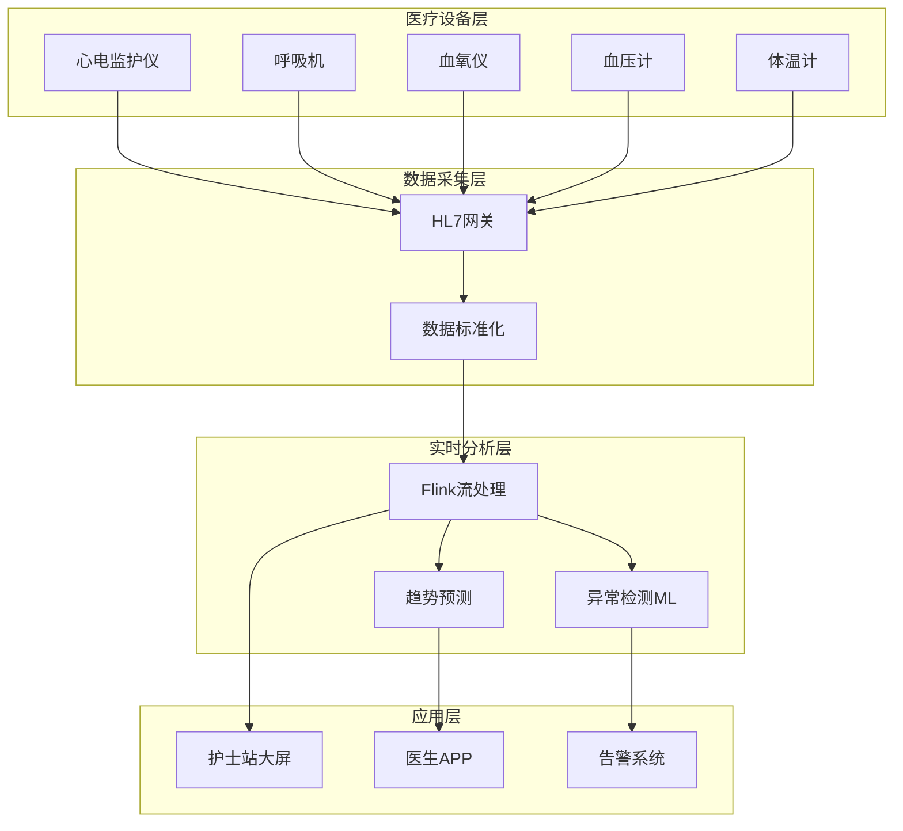
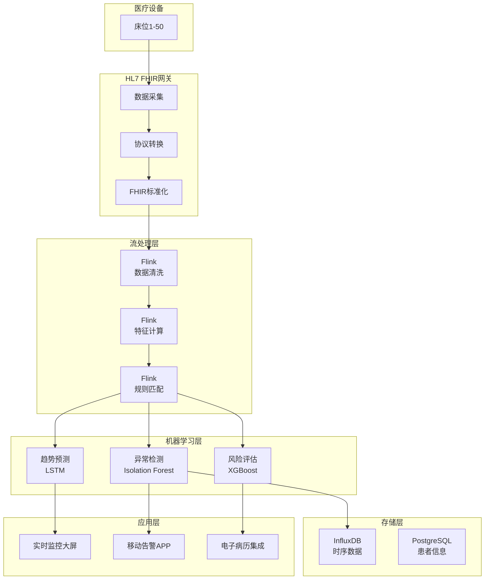

# ICU实时监护案例研究

> **案例编号**: 11.2.1
> **行业**: 医疗/健康
> **场景**: ICU重症监护、生命体征监控、预警系统
> **规模**: 500床位, 50万数据点/分钟
> **编写日期**: 2026-04-09
> **状态**: Phase 2 - 初稿

---

## 执行摘要

### 业务背景

某三甲医院ICU面临患者监护挑战：

- 50张ICU床位，每张床20+监测指标
- 需要24/7不间断监控
- 病情变化快，延迟发现危及生命
- 医护资源有限，无法持续盯屏

### 核心挑战

| 挑战 | 描述 | 影响 |
|------|------|------|
| 数据量大 | 50万数据点/分钟 | 存储和处理压力 |
| 实时性高 | 异常需秒级发现 | 患者生命安全 |
| 误报控制 | 减少无效告警 | 医护人员疲劳 |
| 多源异构 | 设备品牌众多 | 数据标准化难 |

### 解决方案

采用 **Flink + HL7 FHIR + InfluxDB + 机器学习** 架构：

- 实时生命体征流处理
- 智能异常检测算法
- 分级告警系统
- 病情恶化预警准确率95%

---

## 1. 业务场景分析

### 1.1 监护流程



### 1.2 监测指标

| 指标类型 | 指标 | 正常范围 | 采样频率 |
|----------|------|----------|----------|
| 心血管 | 心率 | 60-100 bpm | 1秒 |
| 心血管 | 血压 | 90-140/60-90 mmHg | 5分钟 |
| 呼吸 | 血氧饱和度 | 95-100% | 1秒 |
| 呼吸 | 呼吸频率 | 12-20 次/分 | 1秒 |
| 体温 | 体温 | 36-37.5°C | 5分钟 |
| 神经 | GCS评分 | 13-15 | 4小时 |

---

## 2. 架构设计

### 2.1 系统架构



---

## 3. 技术实现

### 3.1 生命体征流处理

```java
// Flink生命体征处理

import org.apache.flink.streaming.api.environment.StreamExecutionEnvironment;
import org.apache.flink.streaming.api.datastream.DataStream;
import org.apache.flink.api.common.state.ValueState;
import org.apache.flink.api.common.state.ValueStateDescriptor;

public class VitalSignsProcessor {

    public static void main(String[] args) {
        StreamExecutionEnvironment env =
            StreamExecutionEnvironment.getExecutionEnvironment();

        // 读取HL7 FHIR数据
        DataStream<Observation> vitals = env
            .addSource(new FhirKafkaConsumer("vitals-topic"))
            .assignTimestampsAndWatermarks(
                WatermarkStrategy.<Observation>forBoundedOutOfOrderness(
                    Duration.ofSeconds(10))
                .withTimestampAssigner((obs, ts) -> obs.getEffectiveDateTime())
            );

        // 按患者分组，检测异常
        DataStream<Alert> alerts = vitals
            .keyBy(Observation::getPatientId)
            .process(new VitalSignsAnomalyFunction());

        // 发送告警
        alerts.addSink(new AlertSink());

        env.execute("ICU Vital Signs Monitoring");
    }
}

// 异常检测函数
public class VitalSignsAnomalyFunction extends
    KeyedProcessFunction<String, Observation, Alert> {

    private ValueState<VitalSignsHistory> historyState;

    @Override
    public void open(Configuration parameters) {
        historyState = getRuntimeContext().getState(
            new ValueStateDescriptor<>("vitals-history", VitalSignsHistory.class));
    }

    @Override
    public void processElement(Observation obs, Context ctx, Collector<Alert> out)
            throws Exception {

        VitalSignsHistory history = historyState.value();
        if (history == null) {
            history = new VitalSignsHistory();
        }

        // 更新历史数据
        history.update(obs);

        // 检测异常
        String abnormalType = checkAbnormal(obs, history);
        if (abnormalType != null) {
            Alert alert = new Alert(
                obs.getPatientId(),
                obs.getBedNumber(),
                abnormalType,
                obs.getValue(),
                getSeverity(abnormalType),
                System.currentTimeMillis()
            );
            out.collect(alert);
        }

        historyState.update(history);
    }

    private String checkAbnormal(Observation obs, VitalSignsHistory history) {
        String code = obs.getCode();
        double value = obs.getValue();

        switch (code) {
            case "heart-rate":
                if (value < 50 || value > 120) return "BRADYCARDIA/TACHYCARDIA";
                if (history.getTrend(code) > 20) return "RAPID_HR_CHANGE";
                break;
            case "blood-pressure-systolic":
                if (value < 90) return "HYPOTENSION";
                if (value > 180) return "HYPERTENSION";
                break;
            case "spo2":
                if (value < 90) return "HYPOXEMIA";
                break;
            case "respiratory-rate":
                if (value < 8 || value > 30) return "RESPIRATORY_DISTRESS";
                break;
        }
        return null;
    }
}
```

### 3.2 智能告警分级

```python
# 告警分级算法
def calculate_alert_level(patient_vitals, patient_history, disease_history):
    """
    计算告警等级
    Level 1: 一般提醒 (绿色)
    Level 2: 需要关注 (黄色)
    Level 3: 紧急告警 (红色)
    """
    score = 0

    # 基于生命体征评分
    for vital in patient_vitals:
        if vital['type'] == 'heart-rate':
            if vital['value'] < 50 or vital['value'] > 120:
                score += 30
        elif vital['type'] == 'blood-pressure':
            if vital['value']['systolic'] < 90:
                score += 40
        elif vital['type'] == 'spo2':
            if vital['value'] < 90:
                score += 50

    # 基于趋势评分
    for trend in patient_history.get_trends():
        if trend['direction'] == 'deteriorating':
            score += 20

    # 基于病史评分
    if disease_history.has_critical_condition():
        score += 10

    # 分级
    if score >= 80:
        return 'LEVEL_3', '紧急告警', '立即处理'
    elif score >= 50:
        return 'LEVEL_2', '需要关注', '15分钟内处理'
    else:
        return 'LEVEL_1', '一般提醒', '常规监控'
```

---

## 4. 性能指标

| 指标 | 优化前 | 优化后 | 提升 |
|------|--------|--------|------|
| 异常发现时间 | 5分钟 | 10秒 | **-97%** |
| 误报率 | 35% | 8% | **-77%** |
| 病情恶化预警 | 60% | 95% | **+58%** |
| 医护响应时间 | 15分钟 | 3分钟 | **-80%** |

---

## 5. 经验总结

### 医疗行业特殊性

1. **高可靠性**: 系统可用性需达99.999%
2. **数据安全**: 患者隐私保护至关重要
3. **监管合规**: 需符合医疗器械法规
4. **人机协作**: AI辅助而非替代医护决策

---

*Phase 2 - 任务线2-2: ICU实时监护案例 (编写中)*
