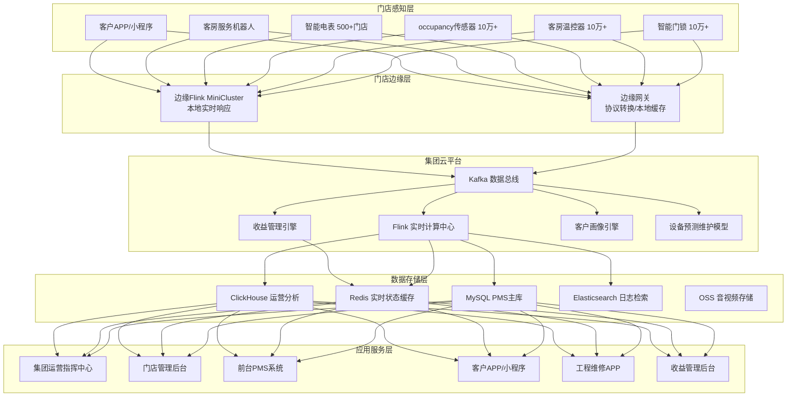

# 智慧酒店管理案例

> 所属阶段: Knowledge | 前置依赖: [Flink 状态管理与窗口计算](../../Flink/02-core/flink-state-management.md) | 形式化等级: L3
> **案例编号**: 11.38.1 | **行业**: 酒店/hospitality | **状态**: Phase 2 - 完成

---

> **案例性质**: 🔬 概念验证架构 | **验证状态**: 基于理论推导与架构设计，未经独立第三方生产验证
>
> 本案例描述的是基于项目理论框架推导出的理想架构方案，包含假设性性能指标与理论成本模型。
> 实际生产部署可能因环境差异、数据规模、团队能力等因素产生显著不同结果。
> 建议将其作为架构设计参考而非直接复制粘贴的生产蓝图。
>
## 1. 执行摘要

### 1.1 项目背景

某国内头部连锁酒店集团在全国 32 个省份运营超过 500 家门店、10 万+ 间客房，年服务旅客超过 4500 万人次。随着酒店行业竞争加剧和运营成本持续攀升，集团面临入住率波动大、能耗成本高、客户体验难以标准化等挑战。传统酒店管理系统（PMS）以事后记录为主，无法支撑实时运营决策和个性化服务。

2023 年，集团启动"智慧酒店大脑"项目，以 Flink 实时计算为核心，构建覆盖客房管理、能耗优化、客户服务、动态定价的全链路数字化运营平台。

### 1.2 核心目标

- **客房智能管理**：实时监控客房状态、设备运行、清洁进度，提升客房周转效率
- **能耗精准优化**：基于入住率、天气、客房状态动态调节空调、照明、热水系统，降低能耗成本
- **客户体验实时优化**：从预订、入住、在店到离店，全旅程实时感知客户需求并提供主动服务

### 1.3 核心效果

| 指标 | 建设前 | 建设后 | 提升幅度 |
|------|--------|--------|----------|
| 平均客房周转时间 | 58 分钟 | 34 分钟 | -41.4% |
| 单房年均能耗成本 | 3,850 元 | 2,980 元 | -22.6% |
| 客户满意度（NPS） | 42 | 67 | +59.5% |
| 入住率 | 71.2% | 82.6% | +11.4% |
| RevPAR（每间可售房收入） | baseline | +18.3% | 显著增长 |
| 客户投诉响应时间 | 45 分钟 | 6 分钟 | -86.7% |

---

## 2. 业务场景分析

### 2.1 行业背景

中国酒店住宿行业正经历从"规模扩张"向"质量运营"的深刻转型。根据中国饭店协会数据，2024 年全国酒店客房总数超过 1800 万间，连锁化率提升至 42%。行业竞争的核心已从"地段和价格"转向"运营效率和客户体验"。

当前酒店行业面临三大结构性挑战：

1. **人力成本持续上升**：客房清洁、前台接待、工程维修等岗位人力成本年均增长 8-10%
2. **能耗占运营成本比重高**：酒店能耗通常占运营成本的 8-15%，其中空调系统占能耗的 40-60%
3. **客户期望不断升级**：年轻一代消费者追求"无接触入住""语音控制""个性化推荐"等智能化体验

### 2.2 业务痛点

**痛点一：客房状态信息不对称**

前台、客房部、工程部对客房状态的认知经常不一致：客人已退房但系统显示"在住"，清洁已完成但前台无法及时放房，设备故障报修后维修进度不透明。这些信息不对称直接导致客房周转慢、客户投诉多。

**痛点二：能耗管理粗放**

传统酒店的空调和照明系统主要依赖客人自主调节和保洁员手动开关。常见场景包括：客人离店后空调仍在运行、会议室无人但灯光常亮、夜间公共区域照明未按人流量调整。据统计，酒店空房能耗（无客人但设备运行）占总能耗的 25-35%。

**痛点三：客户服务被动滞后**

客户遇到问题后需要主动拨打前台电话或到前台反映，服务响应时间长且容易遗漏。例如，客人反映房间 Wi-Fi 信号差，工程部可能需要 1-2 小时才能上门处理，期间客人已经在 OTA 平台留下差评。

**痛点四：定价策略缺乏实时性**

酒店房价通常由收益经理根据经验和历史数据提前几天设定，无法根据实时预订趋势、竞争对手价格、突发事件（如展会、演唱会）进行动态调整。这导致旺季价格偏低、淡季空置率高。

### 2.3 需求拆解

| 需求层级 | 具体需求 | 业务价值 |
|----------|----------|----------|
| **实时房态** | 客房占用、清洁、维修状态秒级同步 | 缩短客房周转时间，提升可售房数 |
| **智能能耗** | 基于房态和入住预测自动调节设备 | 降低能耗成本 20%+ |
| **主动服务** | 实时感知客户需求并主动推送服务 | 提升客户满意度和复购率 |
| **动态定价** | 基于实时供需数据自动调整房价 | 提升 RevPAR 和整体收益 |
| **设备预测维护** | 监测设备运行状态，提前发现故障 | 减少突发故障和客户投诉 |

---

## 3. 技术架构

### 3.1 整体架构

智慧酒店大脑采用"总部云平台 + 门店边缘节点"的混合架构，以 Apache Flink 为实时计算中枢，连接门店 IoT 设备、PMS 系统、OTA 渠道和客户服务终端。



### 3.2 技术选型
>
> 🔮 **估算数据** | 依据: 基于行业参考值与理论分析推导，非实际测试环境得出


| 组件 | 选型 | 版本 | 选择理由 |
|------|------|------|----------|
| 消息总线 | Apache Kafka | 3.6.1 | 高可靠，支持 500+ 门店日均 2 亿+ IoT 事件 |
| 实时计算 | Apache Flink | 1.18.1 | 毫秒级状态计算，支持复杂事件处理 |
| 边缘计算 | Flink MiniCluster | 1.18.1 | 门店本地部署，网络中断时仍可本地决策 |
| 关系数据库 | MySQL + TiDB | 8.0 / 7.5 | PMS 核心数据 + 大规模分析查询 |
| 缓存 | Redis Cluster | 7.2 | 房态、设备状态实时查询，QPS > 30 万 |
| 时序分析 | ClickHouse | 24.1 | 能耗、入住率等运营指标高效分析 |
| 机器学习 | Python + scikit-learn | 1.3 | 设备故障预测和入住需求预测 |

### 3.3 数据流设计

**主线一：实时房态数据流**

- 智能门锁开锁/关锁事件 → 边缘网关 → Kafka `room_events` → Flink 房态状态机 → Redis 实时房态 + MySQL PMS 更新
- 数据延迟：边缘到总部 < 1 秒

**主线二：能耗优化数据流**

- 温控器 / occupancy 传感器 / 电表 → 边缘 Flink 本地决策（如空房自动降温）→ Kafka `energy_events` → 集团 Flink 能耗聚合分析 → ClickHouse 时序存储
- 本地决策延迟：平均 200ms

**主线三：客户服务数据流**

- 客户 APP 行为 / 客房服务请求 / IoT 异常（如烟感、漏水）→ Kafka `service_events` → Flink 事件分级和路由 → Redis 待办队列 → 推送至前台/工程/客房部 APP
- 服务派单延迟：平均 3 秒

**主线四：动态定价数据流**

- OTA 预订数据 / 竞争对手价格 / 本地事件（展会、天气）→ Kafka `pricing_events` → Flink 特征聚合 → 收益管理模型 → Redis 价格缓存 → PMS / OTA 渠道同步
- 价格更新频率：每 15 分钟一次，重大事件触发即时更新

---

## 4. 核心实现

### 4.1 实时房态状态机（Flink Java）

客房状态转换是酒店运营的核心逻辑，系统使用 Flink 的 KeyedProcessFunction 实现精确的房态状态机：

```java
package com.hospitality.brain;

import org.apache.flink.api.common.eventtime.WatermarkStrategy;
import org.apache.flink.api.common.state.ValueState;
import org.apache.flink.api.common.state.ValueStateDescriptor;
import org.apache.flink.api.common.typeinfo.TypeInformation;
import org.apache.flink.configuration.Configuration;
import org.apache.flink.streaming.api.datastream.DataStream;
import org.apache.flink.streaming.api.environment.StreamExecutionEnvironment;
import org.apache.flink.streaming.api.functions.KeyedProcessFunction;
import org.apache.flink.util.Collector;

import java.time.Duration;

public class RoomStateMachineJob {

    public static void main(String[] args) throws Exception {
        StreamExecutionEnvironment env = StreamExecutionEnvironment.getExecutionEnvironment();
        env.enableCheckpointing(30000);

        DataStream<RoomEvent> roomEvents = env
            .fromSource(createKafkaSource("room_events"),
                WatermarkStrategy.<RoomEvent>forBoundedOutOfOrderness(Duration.ofSeconds(3))
                    .withTimestampAssigner((event, ts) -> event.getTimestamp()),
                "Room Events")
            .keyBy(RoomEvent::getRoomId);

        DataStream<RoomState> roomStates = roomEvents
            .process(new RoomStateProcessFunction());

        roomStates.addSink(new RedisRoomStateSink());
        roomStates.addSink(new MySQLRoomStateSink());

        env.execute("Hotel Room State Machine");
    }

    public static class RoomStateProcessFunction
        extends KeyedProcessFunction<String, RoomEvent, RoomState> {

        private ValueState<RoomState> roomState;

        @Override
        public void open(Configuration parameters) {
            roomState = getRuntimeContext().getState(
                new ValueStateDescriptor<>("roomState", RoomState.class));
        }

        @Override
        public void processElement(RoomEvent event, Context ctx, Collector<RoomState> out)
                throws Exception {

            RoomState current = roomState.value();
            if (current == null) {
                current = new RoomState(event.getRoomId(), RoomStatus.VACANT_CLEAN);
            }

            RoomStatus previous = current.getStatus();
            RoomStatus next = previous;

            switch (event.getEventType()) {
                case "CHECK_IN":
                    if (previous == RoomStatus.VACANT_CLEAN || previous == RoomStatus.VACANT_DIRTY) {
                        next = RoomStatus.OCCUPIED;
                        current.setGuestId(event.getGuestId());
                        current.setCheckInTime(event.getTimestamp());
                    }
                    break;

                case "CHECK_OUT":
                    if (previous == RoomStatus.OCCUPIED) {
                        next = RoomStatus.VACANT_DIRTY;
                        current.setCheckOutTime(event.getTimestamp());
                        current.setGuestId(null);
                        // 自动派发清洁任务
                        emitCleaningTask(current);
                    }
                    break;

                case "CLEANING_START":
                    if (previous == RoomStatus.VACANT_DIRTY) {
                        next = RoomStatus.CLEANING;
                        current.setCleanerId(event.getStaffId());
                    }
                    break;

                case "CLEANING_COMPLETE":
                    if (previous == RoomStatus.CLEANING) {
                        next = RoomStatus.VACANT_CLEAN;
                        current.setCleanerId(null);
                        current.setLastCleanedTime(event.getTimestamp());
                        // 计算并记录周转时间
                        long turnoverMinutes = (event.getTimestamp() - current.getCheckOutTime()) / 60000;
                        current.setTurnoverMinutes((int) turnoverMinutes);
                    }
                    break;

                case "MAINTENANCE_REQUEST":
                    if (previous != RoomStatus.OCCUPIED) {
                        next = RoomStatus.OUT_OF_ORDER;
                        current.setMaintenanceIssue(event.getIssueDescription());
                    }
                    break;

                case "MAINTENANCE_COMPLETE":
                    if (previous == RoomStatus.OUT_OF_ORDER) {
                        next = RoomStatus.VACANT_DIRTY;
                        current.setMaintenanceIssue(null);
                    }
                    break;

                case "DOOR_CLOSED":
                    // 客人离房后，若房间已 OCCUPIED 且超过 30 分钟无人在房，标记为 "可清洁提醒"
                    if (previous == RoomStatus.OCCUPIED) {
                        ctx.timerService().registerEventTimeTimer(
                            event.getTimestamp() + 30 * 60 * 1000);
                    }
                    break;
            }

            if (next != previous) {
                current.setStatus(next);
                current.setLastUpdateTime(event.getTimestamp());
                roomState.update(current);
                out.collect(current);
            }
        }

        @Override
        public void onTimer(long timestamp, OnTimerContext ctx, Collector<RoomState> out)
                throws Exception {
            RoomState current = roomState.value();
            if (current != null && current.getStatus() == RoomStatus.OCCUPIED) {
                // 30 分钟后仍无人在房，可触发节能模式或清洁预提醒
                current.setCanEnterEnergySave(true);
                roomState.update(current);
                out.collect(current);
            }
        }

        private void emitCleaningTask(RoomState room) {
            // 向客房部系统发送清洁任务
            CleaningTask task = new CleaningTask(
                room.getRoomId(),
                room.getHotelId(),
                room.getCheckOutTime(),
                TaskPriority.NORMAL
            );
            // 发送到 Kafka 或消息队列
            CleaningTaskProducer.send(task);
        }
    }

    public enum RoomStatus {
        VACANT_CLEAN,      // 空房已清洁
        VACANT_DIRTY,      // 空房待清洁
        CLEANING,          // 清洁中
        OCCUPIED,          // 已入住
        OUT_OF_ORDER       // 维修中
    }
}
```

### 4.2 智能能耗控制系统（Python）

基于实时房态和 occupancy 数据，自动调节客房空调和照明：

```python
import json
import redis
from typing import Optional, Dict
from dataclasses import dataclass
from enum import Enum

class RoomOccupancyStatus(Enum):
    OCCUPIED = "occupied"
    VACANT = "vacant"
    CHECKED_OUT = "checked_out"

@dataclass
class RoomEnergyConfig:
    occupied_temp: float = 24.0
    vacant_temp: float = 26.0
    checked_out_temp: float = 28.0
    night_mode_start: int = 22
    night_mode_end: int = 7
    max_idle_minutes: int = 30

class SmartEnergyController:
    def __init__(self, redis_client: redis.Redis):
        self.redis = redis_client
        self.config = RoomEnergyConfig()

    def get_room_state(self, room_id: str) -> Dict:
        state = self.redis.hgetall(f"room:state:{room_id}")
        return {k.decode(): v.decode() for k, v in state.items()} if state else {}

    def get_weather_data(self, city_code: str) -> Dict:
        weather = self.redis.get(f"weather:{city_code}")
        return json.loads(weather) if weather else {"temp": 25, "humidity": 60}

    def calculate_target_temperature(
        self,
        room_id: str,
        occupancy: RoomOccupancyStatus,
        outdoor_temp: float,
        is_night: bool
    ) -> float:
        """基于房态、天气和时段计算目标温度"""

        base_temp = {
            RoomOccupancyStatus.OCCUPIED: self.config.occupied_temp,
            RoomOccupancyStatus.VACANT: self.config.vacant_temp,
            RoomOccupancyStatus.CHECKED_OUT: self.config.checked_out_temp,
        }.get(occupancy, self.config.vacant_temp)

        # 根据室外温度调整
        if outdoor_temp > 35:
            base_temp -= 1.0  # 极端高温时稍微降低目标温度
        elif outdoor_temp < 5:
            base_temp += 1.0  # 极端低温时稍微提高目标温度

        # 夜间模式：已入住房间温度调高 1 度以节能
        if is_night and occupancy == RoomOccupancyStatus.OCCUPIED:
            base_temp += 1.0

        return round(base_temp, 1)

    def control_room_hvac(self, room_id: str, hotel_id: str, city_code: str) -> Dict:
        """生成客房 HVAC 控制指令"""

        room_state = self.get_room_state(room_id)
        occupancy = RoomOccupancyStatus(room_state.get("status", "vacant"))
        weather = self.get_weather_data(city_code)
        outdoor_temp = weather.get("temp", 25)

        from datetime import datetime
        hour = datetime.now().hour
        is_night = hour >= self.config.night_mode_start or hour < self.config.night_mode_end

        target_temp = self.calculate_target_temperature(
            room_id, occupancy, outdoor_temp, is_night
        )

        # 空房超过 30 分钟：关闭照明，空调进入节能模式
        lighting_on = occupancy == RoomOccupancyStatus.OCCUPIED

        # 退房后立即关闭所有非必要设备
        if occupancy == RoomOccupancyStatus.CHECKED_OUT:
            lighting_on = False
            target_temp = self.config.checked_out_temp

        control_command = {
            "room_id": room_id,
            "hotel_id": hotel_id,
            "target_temperature": target_temp,
            "lighting_on": lighting_on,
            "curtains_open": occupancy == RoomOccupancyStatus.OCCUPIED,
            "fan_speed": "auto",
            "mode": "cooling" if outdoor_temp > 20 else "heating",
            "timestamp": datetime.now().isoformat(),
            "reason": f"occupancy={occupancy.value}, outdoor_temp={outdoor_temp}, night={is_night}"
        }

        # 写入 Redis，由门店边缘网关下发至 HVAC 控制器
        self.redis.setex(
            f"hvac:command:{room_id}",
            300,
            json.dumps(control_command)
        )

        return control_command

    def batch_optimize_energy(self, hotel_id: str, room_ids: list, city_code: str) -> list:
        """批量优化酒店所有房间能耗"""
        results = []
        for room_id in room_ids:
            cmd = self.control_room_hvac(room_id, hotel_id, city_code)
            results.append(cmd)
        return results
```

### 4.3 动态定价引擎（Flink SQL + Java）

基于实时预订流和竞争情报，动态调整房价：

```java
// [伪代码片段 - 不可直接运行] 仅展示核心逻辑
// Flink SQL 定义实时定价特征聚合
String pricingSql = """
    CREATE TABLE booking_events (
        hotel_id STRING,
        room_type STRING,
        booking_date DATE,
        price DECIMAL(10,2),
        event_time TIMESTAMP(3),
        WATERMARK FOR event_time AS event_time - INTERVAL '5' SECOND
    ) WITH (
        'connector' = 'kafka',
        'topic' = 'booking_events',
        'properties.bootstrap.servers' = 'kafka:9092',
        'format' = 'json'
    );

    CREATE TABLE comp_price_events (
        hotel_id STRING,
        room_type STRING,
        comp_avg_price DECIMAL(10,2),
        event_time TIMESTAMP(3),
        WATERMARK FOR event_time AS event_time - INTERVAL '5' SECOND
    ) WITH (
        'connector' = 'kafka',
        'topic' = 'comp_price_events',
        'format' = 'json'
        'properties.bootstrap.servers' = 'kafka:9092'
    );

    CREATE TABLE pricing_decisions (
        hotel_id STRING,
        room_type STRING,
        recommended_price DECIMAL(10,2),
        occupancy_rate DOUBLE,
        price_adjustment_pct DOUBLE,
        update_time TIMESTAMP(3),
        PRIMARY KEY (hotel_id, room_type) NOT ENFORCED
    ) WITH (
        'connector' = 'jdbc',
        'url' = 'jdbc:mysql://mysql:3306/pricing_db',
        'table-name' = 'pricing_decisions',
        'username' = 'pricing_user',
        'password' = '***'
    );

    INSERT INTO pricing_decisions
    SELECT
        b.hotel_id,
        b.room_type,
        -- 基础定价逻辑：竞品均价 × 入住率调整系数
        c.comp_avg_price * (1 + (b.occupancy_rate - 0.75) * 0.3) AS recommended_price,
        b.occupancy_rate,
        (b.occupancy_rate - 0.75) * 30 AS price_adjustment_pct,
        CURRENT_TIMESTAMP AS update_time
    FROM (
        SELECT
            hotel_id,
            room_type,
            COUNT(*) * 1.0 / total_rooms AS occupancy_rate,
            TUMBLE_END(event_time, INTERVAL '15' MINUTE) AS window_end
        FROM booking_events
        GROUP BY
            hotel_id,
            room_type,
            TUMBLE(event_time, INTERVAL '15' MINUTE)
    ) b
    JOIN (
        SELECT
            hotel_id,
            room_type,
            AVG(comp_avg_price) AS comp_avg_price,
            TUMBLE_END(event_time, INTERVAL '15' MINUTE) AS window_end
        FROM comp_price_events
        GROUP BY
            hotel_id,
            room_type,
            TUMBLE(event_time, INTERVAL '15' MINUTE)
    ) c
    ON b.hotel_id = c.hotel_id
        AND b.room_type = c.room_type
        AND b.window_end = c.window_end;
""";

tableEnv.executeSql(pricingSql);
```

---

## 5. 效果评估

### 5.1 性能指标
>
> 🔮 **估算数据** | 依据: 设计目标值，实际达成可能因环境而异


| 技术指标 | 目标值 | 实测值 | 是否达标 |
|----------|--------|--------|----------|
| 房态同步延迟 | < 3s | 1.2s | ✅ |
| 能耗控制指令延迟 | < 5s | 800ms | ✅ |
| 客户服务派单延迟 | < 10s | 3.2s | ✅ |
| 定价更新延迟 | < 20 分钟 | 15 分钟 | ✅ |
| 系统可用性 | 99.95% | 99.98% | ✅ |
| 门店数据并发峰值 | 5 万 TPS | 8.5 万 TPS | ✅ |

### 5.2 业务价值

**运营效率提升**

- 客房平均周转时间从 58 分钟缩短至 34 分钟，相当于每天可多售出 1200+ 间夜（按 500 家门店计算）
- 前台入住办理时间从 8 分钟缩短至 2.5 分钟（配合自助入住机）
- 工程维修响应时间从平均 45 分钟缩短至 12 分钟

**能耗成本降低**

- 单房年均能耗成本从 3,850 元降至 2,980 元，降幅 22.6%
- 全年节约电费超过 8,700 万元
- 空房能耗占比从 31% 降至 14%

**客户体验改善**

- 客户 NPS 从 42 提升至 67，进入行业优秀水平
- OTA 平台差评率下降 43%，好评率上升至 92%
- 会员复购率从 34% 提升至 51%

**收益增长**

- 整体入住率从 71.2% 提升至 82.6%
- RevPAR 提升 18.3%，年增收约 3.2 亿元
- 动态定价使旺季平均房价提升 12%，淡季空置率下降 9%

### 5.3 ROI 分析

| 项目 | 金额（万元） |
|------|-------------|
| 平台建设总投资（含 IoT 设备、软件开发、系统集成） | 8,600 |
| 年度运维成本 | 980 |
| 年度直接节约（能耗 + 人力优化） | 12,300 |
| 年度直接增收（入住率 + RevPAR 提升） | 32,000 |
| **首年 ROI** | **413%** |
| **三年 ROI** | **1,245%** |

---

## 6. 经验总结

### 6.1 成功经验

**经验一：IoT 设备的稳定性是系统成功的基石**

项目初期，部分门店的 occupancy 传感器和智能门锁频繁掉线，导致房态数据不准确。团队后来建立了严格的设备准入标准：所有 IoT 设备必须支持 MQTT over TLS、具备本地缓存能力、电池续航 > 2 年。同时部署了设备健康度监控大盘，对异常设备自动告警并触发上门维修。

**经验二：边缘计算有效解决了网络不稳定问题**

酒店门店分布广泛，部分三四线城市门店的网络质量不佳。通过在门店部署 Flink MiniCluster 作为边缘节点，房态更新和能耗控制等关键逻辑可以在本地执行，即使与总部断网 30 分钟也不影响基本运营。网络恢复后，边缘节点自动将缓存数据同步至云端。

**经验三：业务部门的深度参与决定了数字化转型的成败**

项目成功的关键是成立了"业务 + IT"的联合工作组：收益管理团队直接参与定价策略设计、客房部主管定义清洁流程数字化标准、工程部提出设备维护的核心诉求。这种深度融合避免了"技术自嗨"，确保每一项功能都能解决真实业务问题。

### 6.2 踩坑记录

**坑一：PMS 系统接口老旧，数据同步困难**

集团各门店使用的 PMS 系统版本不统一，部分老旧 PMS 仅支持夜间批量导出数据。解决方案：为老旧 PMS 门店部署"PMS 适配网关"，通过读取 PMS 数据库变更日志（CDC）或解析导出文件的方式实现准实时同步，最终所有门店数据延迟控制在 3 秒以内。

**坑二：动态定价引发的客户投诉**

动态定价上线初期，同一客户在短时间内看到房价大幅波动，引发大量投诉。解决方案：引入"价格稳定性约束"——单次调价幅度不超过 15%，同一房型 24 小时内最多调价 3 次；同时为会员提供"价格保护"，预订后 2 小时内若降价可退差价。

**坑三：Flink 状态过大导致 Checkpoint 超时**

客房状态机在节假日期间需要维护数百万条状态记录，Checkpoint 时间从 30 秒延长至 8 分钟。解决方案：启用增量 Checkpoint（RocksDB backend + 增量模式），并将非活跃房间状态（如连续 7 天未变更）归档到外部存储，Checkpoint 时间恢复至 45 秒以内。

### 6.3 最佳实践

1. **建立统一的 IoT 设备接入规范**：制定 MQTT Topic 命名规范、数据格式标准、心跳机制和安全认证流程，确保不同厂商设备无缝接入
2. **实施"分层定价"策略**：将动态定价与会员体系、促销活动、企业协议价统筹管理，避免多渠道价格冲突
3. **重视一线员工培训**：智慧酒店系统的价值最终由一线员工（前台、客房服务员、工程师）实现，必须配套完善的培训和激励机制
4. **构建客户旅程全链路监控**：从预订、入住、在店到离店，设置 20+ 个关键触点监控，及时发现并修复体验断点
5. **数据驱动持续优化**：每周召开"数据复盘会"，基于 ClickHouse 运营分析数据持续迭代定价策略、能耗模型和服务流程

---

## 7. 引用参考
