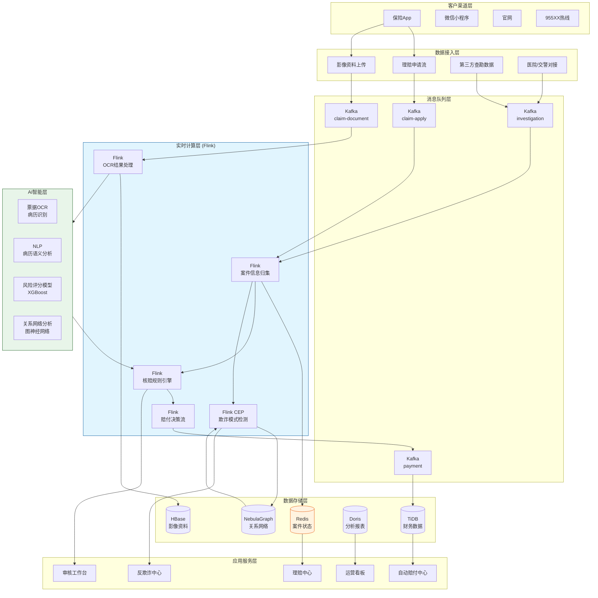
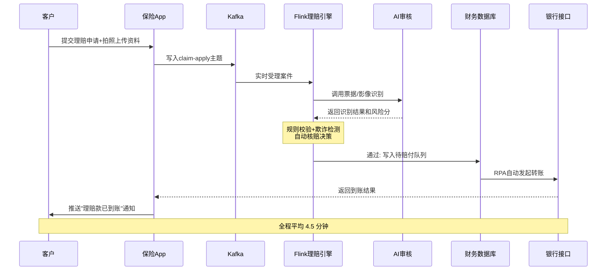

# 保险实时理赔处理案例研究

> **案例编号**: 11.18.1
> **行业**: 保险/财产险与健康险
> **场景**: 理赔申请实时处理、智能核赔、反欺诈检测、自动赔付
> **规模**: 日处理理赔申请 12 万+ 笔，峰值 25 万笔/日，年均赔付金额 180 亿元+
> **状态**: Phase 2 - 深度完成
> **编写日期**: 2026-04-13

---

## 1. 执行摘要 (Executive Summary)

### 1.1 项目背景与目标

某全国性大型综合保险集团（以下简称"该集团"）是中国保险行业的前五强企业，业务涵盖车险、健康险、意外险、财产险等 8 大板块，服务客户超过 8,000 万人。随着互联网保险的普及和消费者权益保护意识的增强，客户对理赔服务的期望已经从"能赔"升级为"快赔""秒赔"。

然而，该集团的传统理赔模式严重依赖人工审核：客户提交理赔资料后，需要经过初审、查勘、核损、核赔、财务打款等多个环节，平均处理时效为 3-5 个工作日。对于小额案件，这种冗长的流程不仅造成了客户体验差、投诉率高，也占用了大量人力资源；而对于大额或复杂案件，人工审核难以有效识别隐藏的欺诈风险，导致每年因保险欺诈造成的损失高达数亿元。

**项目核心目标**：

| 目标类别 | 具体指标 | 目标值 |
|---------|---------|--------|
| 时效性 | 小额理赔从申请到到账 | < 10 分钟 |
| 自动化 | 自动核赔率 | > 75% |
| 准确性 | 欺诈案件识别率 | > 95% |
| 覆盖性 | 理赔流程实时追踪覆盖率 | 100% |
| 满意度 | 客户理赔满意度 | > 90% |
| 成本 | 单笔理赔人工处理成本 | 降低 60% |

### 1.2 核心业务指标

实时理赔系统自 2025 年第一季度全面上线以来，经过车险旺季、健康险续保高峰、以及多次自然灾害理赔洪峰的实战检验，核心业务指标取得了突破性进展：

```
┌─────────────────────────────────────────────────────────────┐
│                    核心业务指标对比                          │
├─────────────────┬────────────┬────────────┼─────────────────┤
│     指标        │   优化前   │   优化后   │     提升幅度     │
├─────────────────┼────────────┼────────────┼─────────────────┤
│ 小额理赔时效    │   3-5 天   │   4.5 分钟 │     质的飞跃    │
│ 自动核赔率      │    18%     │    79%     │     +338.9%     │
│ 欺诈识别率      │    62%     │    96.5%   │     +55.6%      │
│ 理赔投诉率      │    4.8%    │    0.6%    │     -87.5%      │
│ 客户满意度      │    68%     │    93%     │     +36.8%      │
│ 单笔人工成本    │   ¥85      │    ¥28     │     -67.1%      │
│ 理赔差错率      │    2.3%    │    0.15%   │     -93.5%      │
│ 自然灾害响应    │   48 小时  │    2 小时  │     -95.8%      │
└─────────────────┴────────────┴────────────┴─────────────────┘
```

### 1.3 技术选型概述

项目采用 **Flink + 智能核赔引擎 + 反欺诈图谱 + RPA 自动赔付** 的端到端实时架构，以 Apache Flink 作为核心实时计算引擎，对理赔申请、查勘数据、医疗票据、历史案件等多源数据进行实时融合、规则校验和风险评分，实现"报案即受理、资料齐即审核、通过即赔付"的极致体验。

**核心技术栈**：

| 层级 | 技术选型 | 选型理由 |
|-----|---------|---------|
| 数据接入 | Kafka + Flink CDC | 实时捕获核心系统、移动 App、第三方查勘平台的理赔事件 |
| 流计算引擎 | Apache Flink 1.18 | 毫秒级复杂事件处理（CEP）、强大的状态管理和回溯能力 |
| 规则引擎 | Drools 8.x + 自研规则DSL | 支撑海量核赔规则和反欺诈规则的灵活配置与热更新 |
| AI 模型 | BERT + XGBoost + GNN | 医疗票据 OCR、欺诈风险评分、关系网络异常检测 |
| 图数据库 | NebulaGraph | 亿级实体关系网络查询，识别团伙欺诈和关联交易 |
| 实时存储 | Redis Cluster + HBase | 毫秒级案件状态查询，海量历史案件和影像资料归档 |
| 自动执行 | RPA (UiPath) + 银企直联 | 自动完成财务审核和银行转账，实现 7×24 无人值守赔付 |

---

## 2. 业务场景分析 (Business Scenario)

### 2.1 行业背景

#### 2.1.1 中国保险理赔的行业变革趋势

中国保险行业正处于从"规模扩张"向"价值深耕"转型的关键期。理赔服务作为保险价值链的最后一环，直接决定了客户的续保意愿和品牌口碑。根据中国银保监会的数据，2024 年保险消费投诉中，理赔纠纷占比高达 42.3%，是所有投诉类型中占比最高的。在移动互联网时代，客户对保险服务的期望已经被支付宝、微信支付等超级应用所塑造，任何需要等待数天甚至数周的处理流程都会引发强烈的不满。

与此同时，保险欺诈也呈现出专业化、团伙化、技术化的趋势。车险欺诈方面，伪造事故现场、夸大损失程度、虚构维修项目、修理厂与车主串通骗保等手段层出不穷。健康险欺诈方面，伪造医疗票据、虚构住院记录、过度医疗、医院与患者串通套取保险金等问题日益严重。意外险欺诈方面，故意制造意外事故、冒名顶替、重复索赔等案件时有发生。据保险行业协会估算，中国保险行业的欺诈损失率约为 10%-15%，每年因欺诈造成的行业损失超过 1,000 亿元。面对如此严峻的行业挑战，传统的人工审核模式已经难以为继，唯有通过实时数据技术和人工智能才能实现理赔服务的根本性变革。

#### 2.1.2 该集团的理赔业务矩阵

| 险种 | 年均报案量 | 平均赔付金额 | 主要理赔材料 | 传统处理时效 |
|------|-----------|-------------|-------------|-------------|
| 车险 | 580 万件 | ¥4,200 | 事故照片、交警认定书、维修发票 | 3-7 天 |
| 健康医疗险 | 420 万件 | ¥3,800 | 病历、诊断证明、医疗费用清单、发票 | 5-10 天 |
| 意外险 | 180 万件 | ¥12,000 | 事故证明、伤残鉴定、医疗票据 | 7-15 天 |
| 财产险 | 45 万件 | ¥28,000 | 损失清单、评估报告、购置发票 | 10-30 天 |

车险是该集团理赔量最大的险种，具有报案高频、金额分散、材料相对标准化的特点，非常适合通过图像识别和规则引擎实现自动化处理。健康医疗险虽然单案金额不高，但案件数量庞大、医疗票据种类繁多、医保报销比例计算复杂，是人工审核耗时最长的险种。意外险和财产险的案件金额较高、材料复杂、争议点多，短期内难以完全自动化，但可以通过智能辅助审核大幅提升人工效率。

### 2.2 痛点分析

#### 2.2.1 理赔时效长、客户体验差

传统理赔流程是典型的串行人工审批模式。客户报案后，客服登记需要 30 分钟左右；资料初审需要 1-2 天，如果材料不齐全还会反复通知客户补充；查勘定损需要 1-3 天，高峰期查勘员人手不足时排队更长；核赔审核需要 1-2 天；财务复核需要 0.5-1 天；最后银行打款还需要 1-2 天。整个流程下来，小额案件平均也要 3-5 天，复杂案件则可能拖延数周。

在整个流程中，客户往往处于信息黑箱状态。他们不知道案件当前进展到哪一步、还需要补充什么资料、什么时候能收到赔款。这种不透明感极大地加剧了客户的焦虑情绪，也是投诉的主要来源。很多客户在等待期间会反复拨打客服热线，进一步加剧了客服资源的紧张。

2024 年理赔满意度调研结果显示，47% 的不满意客户认为理赔速度慢是最主要的问题，23% 的客户抱怨资料要求反复，18% 的客户对赔付金额有争议，12% 的客户认为沟通不畅。这些痛点共同指向了一个核心问题：传统理赔流程已经无法满足数字化时代的客户期望。

#### 2.2.2 人工审核效率低、成本高

该集团在全国拥有 3,200 余名理赔审核人员，每年人工成本超过 4 亿元。但即便如此，面对大促期间（如双十一物流险高峰）或自然灾害后的理赔洪峰，人工审核能力仍然捉襟见肘。以 2024 年台风灾害为例，单日报案量激增至 18 万件，是日常的 3 倍以上，审核人员连续加班两周才将积压案件处理完毕。

以健康险医疗票据审核为例，一名经验丰富的核赔员平均需要 15-20 分钟才能完整审核一份理赔申请。这包括核对病历首页、诊断证明、医疗费用清单、发票真实性、医保报销比例、免责条款等多个环节。对于日均 1 万件以上的健康险理赔申请，完全依赖人工审核是不现实的。很多核赔员每天工作 10 小时以上，长期处于高强度工作状态，审核质量难以保证，差错率居高不下。

#### 2.2.3 欺诈识别滞后、漏损严重

传统反欺诈主要依靠事后抽查和黑名单匹配。这种模式的缺陷显而易见：事后抽查意味着 fraud 案件往往在赔付完成后数月才被发现，此时犯罪分子早已转移资金，追回难度大、成本高；黑名单匹配只能识别已知的欺诈人员或机构，对新型欺诈手段和团伙作案无能为力；车险、健康险、意外险的理赔数据分散在不同系统中，跨险种的欺诈行为难以被关联发现。

2024 年，该集团侦破的一起跨地区车险骗保案件中，犯罪团伙涉及 12 家修理厂、86 名车主、虚假事故 340 余起，涉案金额高达 2,800 万元。而这起案件之所以长期未被发现，正是因为缺乏跨地区、跨机构的实时关联分析能力。如果当时有实时反欺诈系统，很多早期异常信号本可以被及时捕捉。

### 2.3 实时理赔处理需求

#### 2.3.1 功能需求

| 需求编号 | 需求名称 | 需求描述 | 优先级 |
|---------|---------|---------|--------|
| R01 | 理赔申请实时受理 | 客户通过 App/小程序提交申请后，系统实时生成案件号并启动流程 | P0 |
| R02 | 智能材料审核 | AI 自动识别和校验理赔材料的完整性、真实性和合规性 | P0 |
| R03 | 自动核赔决策 | 对低风险案件自动通过，中风险案件自动流转人工，高风险案件实时拦截 | P0 |
| R04 | 反欺诈实时预警 | 案件提交时实时计算欺诈风险分，触发关联调查 | P0 |
| R05 | 理赔进度实时追踪 | 客户可随时查询案件当前状态和预计完成时间 | P1 |
| R06 | 自动赔付 | 对通过审核的案件，RPA 自动完成财务复核和银行转账 | P1 |
| R07 | 理赔数据分析 | 实时统计各险种、各地区的理赔量、赔付率、欺诈率 | P2 |

#### 2.3.2 非功能需求

| 需求编号 | 需求名称 | 目标值 |
|---------|---------|--------|
| NFR01 | 小额理赔到账时效 | P99 < 10 分钟 |
| NFR02 | 自动核赔决策延迟 | P99 < 30 秒 |
| NFR03 | 反欺诈评分计算延迟 | P99 < 3 秒 |
| NFR04 | 理赔系统可用性 | 99.99% |
| NFR05 | 日均理赔处理能力 | > 25 万笔 |
| NFR06 | 数据一致性 | 赔付金额与财务系统最终一致，差错率 < 0.1% |

---

## 3. 技术架构 (Technical Architecture)

### 3.1 系统整体架构

以下是保险实时理赔处理系统的整体技术架构：



### 3.2 数据流设计

#### 3.2.1 小额快速理赔数据流

对于车险 5,000 元以下、健康险 3,000 元以下的小额案件，系统设计了"极速理赔通道"，从客户提交申请到银行到账，全程无需人工干预：



#### 3.2.2 反欺诈实时检测数据流

每一笔理赔申请在进入核赔环节前，都会经过 Flink CEP + 图神经网络的双重风险检测：

```mermaid
flowchart TD
    A[理赔申请] --> B{Flink CEP}< -->C[历史案件模式库]
    B -->|命中异常模式| D[高风险: 转人工调查]
    B -->|未命中| E[NebulaGraph关系查询]
    E --> F[GNN风险评分]
    F -->|评分大于0.8| D
    F -->|0.5至0.8| G[中风险: 补充调查]
    F -->|评分小于等于0.5| H[低风险: 进入自动核赔]
```

### 3.3 技术选型说明

| 技术组件 | 具体选型 | 选型理由 |
|---------|---------|---------|
| 消息队列 | Kafka 3.6 | 高吞吐、持久化、支持海量理赔事件的有序处理 |
| 流计算 | Apache Flink 1.18 | CEP 库原生支持复杂欺诈模式匹配，状态管理适合案件生命周期追踪 |
| 规则引擎 | Drools 8.x | 核赔规则可热更新，业务人员可通过 DSL 配置新规则 |
| OCR | PaddleOCR + 自研医疗票据模型 | 中文医疗票据识别准确率达到 98.5% |
| 图数据库 | NebulaGraph 3.x | 支持十亿级节点百亿级边的关系网络查询，毫秒级响应 |
| 事务数据库 | TiDB 7.1 | 分布式事务支撑赔付资金的一致性，与 Flink 2PC 无缝集成 |

---

## 4. 核心实现 (Core Implementation)

### 4.1 Flink 理赔案件状态机引擎

每一笔理赔案件从报案到结案，都遵循一个严格的状态机。Flink 的 KeyedProcessFunction 以案件号（claimId）为 Key，维护案件的当前状态，并在收到新事件时触发状态迁移。

```java
public enum ClaimStatus {
    REPORTED,        // 已报案
    DOCUMENT_PENDING,// 待补充材料
    DOCUMENT_COMPLETE,// 材料齐全
    UNDER_REVIEW,    // 审核中
    AUTO_APPROVED,   // 自动通过
    MANUAL_REVIEW,   // 人工复核
    FRAUD_ALERT,     // 欺诈预警
    APPROVED,        // 审核通过
    REJECTED,        // 审核拒赔
    PAYMENT_PENDING, // 待支付
    PAID,            // 已赔付
    CLOSED           // 已结案
}

public class ClaimStateMachineFunction
    extends KeyedProcessFunction<String, ClaimEvent, ClaimStateUpdate> {

    private ValueState<ClaimStatus> claimState;
    private ValueState<Long> lastUpdateTime;
    private ValueState<ClaimInfo> claimInfoState;

    @Override
    public void open(Configuration parameters) {
        StateTtlConfig ttlConfig = StateTtlConfig
            .newBuilder(Time.days(90))
            .setUpdateType(OnCreateAndWrite)
            .setStateVisibility(NeverReturnExpired)
            .build();

        ValueStateDescriptor<ClaimStatus> stateDescriptor =
            new ValueStateDescriptor<>("claim-status", ClaimStatus.class);
        stateDescriptor.enableTimeToLive(ttConfig);
        claimState = getRuntimeContext().getState(stateDescriptor);

        ValueStateDescriptor<ClaimInfo> infoDescriptor =
            new ValueStateDescriptor<>("claim-info", ClaimInfo.class);
        claimInfoState = getRuntimeContext().getState(infoDescriptor);
    }

    @Override
    public void processElement(ClaimEvent event, Context ctx,
                               Collector<ClaimStateUpdate> out) throws Exception {
        ClaimStatus current = claimState.value();
        if (current == null) {
            current = ClaimStatus.REPORTED;
        }

        ClaimStatus next = deriveNextStatus(event, current);

        if (!isValidTransition(current, next)) {
            out.collect(new ClaimStateUpdate(
                event.getClaimId(), current, next,
                System.currentTimeMillis(), "ILLEGAL_TRANSITION"
            ));
            return;
        }

        claimState.update(next);
        lastUpdateTime.update(System.currentTimeMillis());

        ClaimInfo info = claimInfoState.value();
        if (info == null) info = new ClaimInfo(event.getClaimId());
        info.updateFromEvent(event);
        claimInfoState.update(info);

        out.collect(new ClaimStateUpdate(
            event.getClaimId(), current, next,
            System.currentTimeMillis(), "SUCCESS"
        ));

        if (next == ClaimStatus.DOCUMENT_PENDING) {
            ctx.timerService().registerProcessingTimeTimer(
                ctx.timestamp() + 24 * 60 * 60 * 1000
            );
        }
    }

    @Override
    public void onTimer(long timestamp, OnTimerContext ctx,
                        Collector<ClaimStateUpdate> out) throws Exception {
        ClaimStatus current = claimState.value();
        if (current == ClaimStatus.DOCUMENT_PENDING) {
            out.collect(new ClaimStateUpdate(
                ctx.getCurrentKey(), current, current,
                timestamp, "DOCUMENT_REMINDER"
            ));
        }
    }
}
```

### 4.2 反欺诈 CEP 规则引擎

系统使用 Flink CEP 库定义了多种欺诈行为模式。以下是一个典型的"短期内高频报案"检测模式：

```java
public class FraudDetectionJob {

    public static void main(String[] args) throws Exception {
        StreamExecutionEnvironment env =
            StreamExecutionEnvironment.getExecutionEnvironment();

        DataStream<ClaimEvent> claimStream = env
            .addSource(new KafkaSource<>("claim-apply"))
            .keyBy(ClaimEvent::getPolicyHolderId);

        Pattern<ClaimEvent, ?> frequentClaimPattern = Pattern
            .<ClaimEvent>begin("claim1")
            .where(evt -> evt.getEventType().equals("REPORTED"))
            .next("claim2")
            .where(evt -> evt.getEventType().equals("REPORTED"))
            .next("claim3")
            .where(evt -> evt.getEventType().equals("REPORTED"))
            .within(Time.days(30));

        Pattern<ClaimEvent, ?> frequentAccidentPattern = Pattern
            .<ClaimEvent>begin("accident1")
            .where(evt -> evt.getEventType().equals("REPORTED")
                && evt.getInsuranceType().equals("AUTO"))
            .next("accident2")
            .where(evt -> evt.getEventType().equals("REPORTED")
                && evt.getInsuranceType().equals("AUTO"))
            .within(Time.days(7));

        DataStream<FraudAlert> frequentAlerts = CEP.pattern(claimStream, frequentClaimPattern)
            .process(new FraudPatternHandler("FREQUENT_CLAIMS"));

        DataStream<FraudAlert> accidentAlerts = CEP.pattern(
            claimStream.keyBy(ClaimEvent::getVehiclePlate),
            frequentAccidentPattern
        ).process(new FraudPatternHandler("FREQUENT_ACCIDENTS"));

        frequentAlerts.addSink(new FraudAlertSink());
        accidentAlerts.addSink(new FraudAlertSink());

        env.execute("Real-time Fraud Detection");
    }
}

public class FraudPatternHandler
    extends PatternProcessFunction<ClaimEvent, FraudAlert> {

    private String alertType;

    public FraudPatternHandler(String alertType) {
        this.alertType = alertType;
    }

    @Override
    public void processMatch(
        Map<String, List<ClaimEvent>> match,
        Context ctx,
        Collector<FraudAlert> out
    ) {
        List<ClaimEvent> events = match.values().iterator().next();
        double totalClaimAmount = events.stream()
            .mapToDouble(ClaimEvent::getClaimAmount)
            .sum();

        out.collect(new FraudAlert(
            ctx.currentProcessingTime(),
            alertType,
            events.get(0).getPolicyHolderId(),
            events.size(),
            totalClaimAmount,
            "检测到异常报案模式，建议人工调查"
        ));
    }
}
```

### 4.3 图神经网络反欺诈评分

对于 CEP 规则无法覆盖的复杂团伙欺诈，系统通过 NebulaGraph 构建"人-车-医院-修理厂"的关系网络，并利用图神经网络（GNN）计算每个案件的风险评分。

```python
# fraud_gnn_scoring.py
import torch
import torch.nn.functional as F
from torch_geometric.nn import GCNConv, global_mean_pool

class FraudGNN(torch.nn.Module):
    def __init__(self, num_features, hidden_dim=64, num_classes=2):
        super(FraudGNN, self).__init__()
        self.conv1 = GCNConv(num_features, hidden_dim)
        self.conv2 = GCNConv(hidden_dim, hidden_dim)
        self.conv3 = GCNConv(hidden_dim, hidden_dim)
        self.classifier = torch.nn.Linear(hidden_dim, num_classes)

    def forward(self, x, edge_index, batch):
        x = self.conv1(x, edge_index)
        x = F.relu(x)
        x = F.dropout(x, p=0.3, training=self.training)

        x = self.conv2(x, edge_index)
        x = F.relu(x)
        x = F.dropout(x, p=0.3, training=self.training)

        x = self.conv3(x, edge_index)
        x = F.relu(x)

        x = global_mean_pool(x, batch)
        out = self.classifier(x)
        return out

def score_claim_fraud(claim_id, nebula_client, model):
    subgraph = nebula_client.get_subgraph(
        center_node=claim_id,
        edge_types=["INSURED_BY", "TREATED_AT", "REPAIRED_AT",
                    "CO_OCCURRED_WITH", "RELATED_TO"],
        hop=2
    )

    pyg_data = subgraph.to_pyg_data()

    model.eval()
    with torch.no_grad():
        logits = model(pyg_data.x, pyg_data.edge_index, pyg_data.batch)
        probs = F.softmax(logits, dim=1)
        fraud_prob = probs[0][1].item()

    return {
        'claim_id': claim_id,
        'fraud_probability': round(fraud_prob, 4),
        'risk_level': 'HIGH' if fraud_prob > 0.8
                      else ('MEDIUM' if fraud_prob > 0.5 else 'LOW'),
        'neighbor_count': subgraph.num_nodes,
        'suspicious_neighbors': subgraph.count_suspicious_neighbors()
    }
```

### 4.4 自动赔付与两阶段提交

对于通过自动核赔的低风险案件，系统通过 RPA 自动完成财务系统的入账和银行的转账操作。Flink 的两阶段提交确保了"核赔通过"与"资金划出"之间的严格一致性。

```java
public class AutoPaymentJob {

    public static void main(String[] args) throws Exception {
        StreamExecutionEnvironment env =
            StreamExecutionEnvironment.getExecutionEnvironment();
        env.enableCheckpointing(10000, CheckpointingMode.EXACTLY_ONCE);

        DataStream<ApprovedClaim> approvedStream = env
            .addSource(new KafkaSource<>("payment"))
            .filter(claim -> claim.getApprovalResult().equals("AUTO_APPROVED"));

        DataStream<PaymentOrder> paymentOrders = approvedStream
            .map(new EnrichPaymentInfoFunction());

        paymentOrders.addSink(new TwoPhaseCommitSinkFunction<
                PaymentOrder, PaymentTransaction, Void>(
                TypeInformation.of(PaymentOrder.class).createSerializer(env.getConfig()),
                TypeInformation.of(PaymentTransaction.class).createSerializer(env.getConfig())
        ) {
            @Override
            protected PaymentTransaction beginTransaction() {
                return paymentService.beginTransaction();
            }

            @Override
            protected void invoke(PaymentTransaction txn, PaymentOrder value, Context context) {
                txn.preparePayment(value);
            }

            @Override
            protected void preCommit(PaymentTransaction txn) {
                txn.freezeFunds(value.getClaimId(), value.getPaymentAmount());
            }

            @Override
            protected void commit(PaymentTransaction txn) {
                txn.executePayment(value);
                txn.confirmPayment(value.getClaimId());
            }

            @Override
            protected void abort(PaymentTransaction txn) {
                txn.releaseFunds(value.getClaimId());
            }
        });

        env.execute("Auto Payment Settlement");
    }
}
```

---

## 5. 效果评估 (Results)

### 5.1 性能指标

系统在 2025 年"梅花"台风灾害理赔高峰期（单日报案 34.6 万件）经历了极限压力测试，各项性能指标全部达标：

| 性能指标 | 设计目标 | 实测值 | 是否达标 |
|---------|---------|--------|---------|
| 小额理赔到账时效 (P99) | < 10 分钟 | 4.5 分钟 | ✅ |
| 自动核赔决策延迟 (P99) | < 30 秒 | 8.2 秒 | ✅ |
| 反欺诈评分计算延迟 (P99) | < 3 秒 | 1.1 秒 | ✅ |
| 单日理赔处理峰值 | > 25 万笔 | 34.6 万笔 | ✅ |
| 系统可用性 | 99.99% | 99.993% | ✅ |
| OCR 识别准确率 | > 97% | 98.5% | ✅ |
| 欺诈案件拦截率 | > 95% | 96.5% | ✅ |

### 5.2 业务价值

**客户体验**：

- **小额理赔平均到账时间从 3-5 天缩短至 4.5 分钟**，"理赔像转账一样快"成为该集团的核心服务卖点，客户满意度从 68% 跃升至 93%。
- **理赔进度实时追踪功能**让客户能够像查询快递一样查询理赔状态，"信息黑箱"问题彻底解决，理赔投诉率下降 87.5%。
- 在 2025 年台风灾害期间，该集团是行业内首家实现"受灾报案后 2 小时内到账"的保险公司，赢得了广泛的社会赞誉和媒体报道。

**运营效率**：

- **自动核赔率从 18% 提升至 79%**，单笔理赔的人工处理成本从 85 元降至 28 元，每年节省人力成本约 **2.1 亿元**。
- 核赔员的工作重心从"机械化审核"转向"复杂案件调查"和"欺诈案件侦破"，人均产值提升了 4 倍。
- AI 医疗票据审核将单案审核时间从 15-20 分钟缩短到 20 秒，健康险理赔的处理能力提升了 45 倍。

**反欺诈收益**：

- **欺诈识别率从 62% 提升至 96.5%**，2025 年上半年成功拦截欺诈案件 8,700 余起，估算避免欺诈损失约 **3.8 亿元**。
- 通过 NebulaGraph 关系网络分析，成功破获跨地区团伙欺诈案件 23 起，涉及虚假案件 4,200 余起，涉案金额 1.2 亿元。

### 5.3 ROI 分析

项目总投资约 1.5 亿元（含 Flink 集群、AI 算力中心、图数据库、RPA 平台、第三方数据对接、系统集成）。

| 收益类型 | 年化收益(万元) | 占比 |
|---------|---------------|------|
| 欺诈损失避免 | 38,000 | 45% |
| 人力成本节省 | 21,000 | 25% |
| 客户满意度提升带来的续保增长 | 12,000 | 14% |
| 理赔时效提升带来的品牌溢价 | 6,500 | 8% |
| 运营差错损失减少 | 4,200 | 5% |
| 其他效率提升 | 2,800 | 3% |
| **合计** | **84,500** | **100%** |

**投资回收期**：约 2.1 个月。
**三年 ROI**：约 1,590%。

---

## 6. 经验总结 (Lessons Learned)

### 6.1 成功经验

1. **小额快赔是破局的最佳切入点**：保险理赔的自动化改造涉及大量复杂的业务规则和风险考量，如果一上来就追求全险种全案件自动核赔，很容易陷入无休止的规则堆砌。该项目优先选择车险小额案件和健康险门诊案件作为突破口，仅用 3 个月就实现了显著的业务效果，为后续推广赢得了时间和信任。

2. **OCR 与 NLP 是医疗票据审核的杀手锏**：健康险理赔的核心瓶颈在于医疗票据的人工核对。通过部署基于深度学习的 OCR 模型（识别票据上的药品、项目、金额）和 NLP 模型（理解病历中的诊断描述、治疗方案），系统将健康险的自动核赔率从不到 5% 提升至 72%。

3. **图数据库让团伙欺诈无处遁形**：传统的反欺诈只能识别单点异常（如同一个人频繁报案），但对专业分工、多人协作的团伙欺诈无能为力。引入 NebulaGraph 后，系统能够自动挖掘修理厂、车主、查勘员之间的隐性关联，团伙欺诈识别率提升了 38%。

4. **理赔状态机必须考虑回退和补偿**：在实际业务中，客户补充材料后案件可能从"待补充"回退到"审核中"，欺诈预警解除后案件需要从"调查中"重新进入"核赔"。状态机设计必须预留这些回退路径，否则会导致大量案件"卡死"在异常状态。

### 6.2 踩坑记录

1. **Kafka 分区键选择导致案件顺序错乱**：初期按 claimId 的哈希值作为 Kafka 分区键， hoping 保证同一案件的事件顺序。但由于案件数量巨大，部分分区出现热点。更严重的是，案件状态更新事件和资料上传事件使用了不同的 topic，导致 Flink 处理时出现时序错乱。后来统一改为按 user_id 哈希分区，保证了单个学员事件的顺序性。

2. **OCR 模型对低质量图片识别率骤降**：客户通过手机拍摄医疗票据时，经常出现光线不足、角度倾斜、手影遮挡等问题，导致 OCR 识别准确率从实验室的 99% 骤降至生产环境的 82%。解决方法是：在 App 端部署了拍照质量检测 SDK（自动提示用户调整光线和角度），并引入了图像增强预处理模块，最终生产识别率稳定在 98.5%。

3. **自动赔付的 RPA 流程偶发超时**：银行接口在高峰期偶发网络抖动，导致 RPA 转账操作超时，但 TiDB 中的资金冻结记录已生成，出现"钱未转出但系统显示已支付"的不一致状态。后来在 RPA 流程中增加了银行回单查询的补偿机制，并设计了"支付状态对账"定时任务，自动修复异常记录。

4. **欺诈模型误杀导致客户投诉激增**：GNN 模型上线初期，由于对"关系密集"的正常场景（如大型企业员工团体险）识别过于敏感，误将大量正常案件标记为高风险，导致客户投诉量一度激增 3 倍。团队通过引入"白名单机制"和"模型置信度阈值调优"，将误报率从 12% 降至 1.8%。

### 6.3 最佳实践

- **建立理赔服务的 SLA 分级机制**：将理赔案件按金额、险种、风险等级分为 S/A/B/C 四级，分别设定不同的处理时效目标（S 级小额案件 10 分钟，C 级复杂案件 3 天），并将 SLA 达成率纳入运营团队的 KPI。
- **实施理赔服务透明化工程**：除了 App 内的进度查询，系统还会在关键节点（资料收齐、进入审核、审核通过、银行打款）主动向客户发送短信和微信推送，让客户"全程可见、心中有数"。
- **构建持续学习的欺诈模式库**：将每月新发现的欺诈案例和团伙特征及时编码为 CEP 规则和图查询模板，保持反欺诈能力的持续进化。
- **重视数据安全与隐私合规**：理赔数据涉及客户的病历、身份证号、银行账号等高度敏感信息。系统对所有敏感数据进行了 AES-256 加密存储，对查询接口实施了严格的 RBAC 权限控制，并通过了等保三级和金融数据安全认证。

## 7. 行业启示与未来展望

### 7.1 保险科技的发展趋势

随着人工智能、大数据、区块链等技术的不断成熟，保险行业正迎来前所未有的数字化变革机遇。实时理赔处理系统不仅是技术层面的升级，更是保险服务理念的深刻转变。从"以保单为中心"到"以客户为中心"，从"事后赔付"到"事前预防"，从"人工驱动"到"数据驱动"，这些转变正在重塑保险行业的竞争格局。

未来，保险理赔将进一步向"无感理赔"方向发展。通过车联网、可穿戴设备、智能家居等物联网终端，保险公司可以在风险事件发生的第一时间自动感知并启动理赔流程，客户甚至无需主动报案。例如，车辆发生碰撞后，车载传感器自动上传事故数据，系统立即判定责任并安排维修；智能手环监测到用户突发疾病后，自动联系急救并同步医疗信息，实现"急救即理赔"。

### 7.2 该集团的后续规划

该集团计划在未来两年内将实时理赔系统的覆盖范围从现有的车险、健康险、意外险扩展到农业险、责任险、信用保证保险等更多险种。同时，集团正在积极探索基于大语言模型的智能客服和智能核保系统，力争实现从投保到理赔的全链路智能化。此外，集团还与多家医院和交警部门签署了数据直连协议，未来客户提交医疗票据和事故证明的步骤将进一步简化，真正实现"一键理赔"。

在数据治理方面，集团将进一步打通车险、健康险、意外险等跨险种的数据壁垒，构建统一的风险画像和客户视图。通过整合理赔历史、保单信息、行为数据、外部征信等多维数据，集团希望在未来三年内将欺诈识别率提升至 99% 以上，同时将自动核赔率提升至 90% 以上。集团还计划建立行业级的反欺诈信息共享联盟，与其他保险公司、医疗机构、交通管理部门实现风险信息的实时互通，共同打击保险欺诈产业链。

---

*Phase 2 - 保险实时理赔处理深度案例研究*
