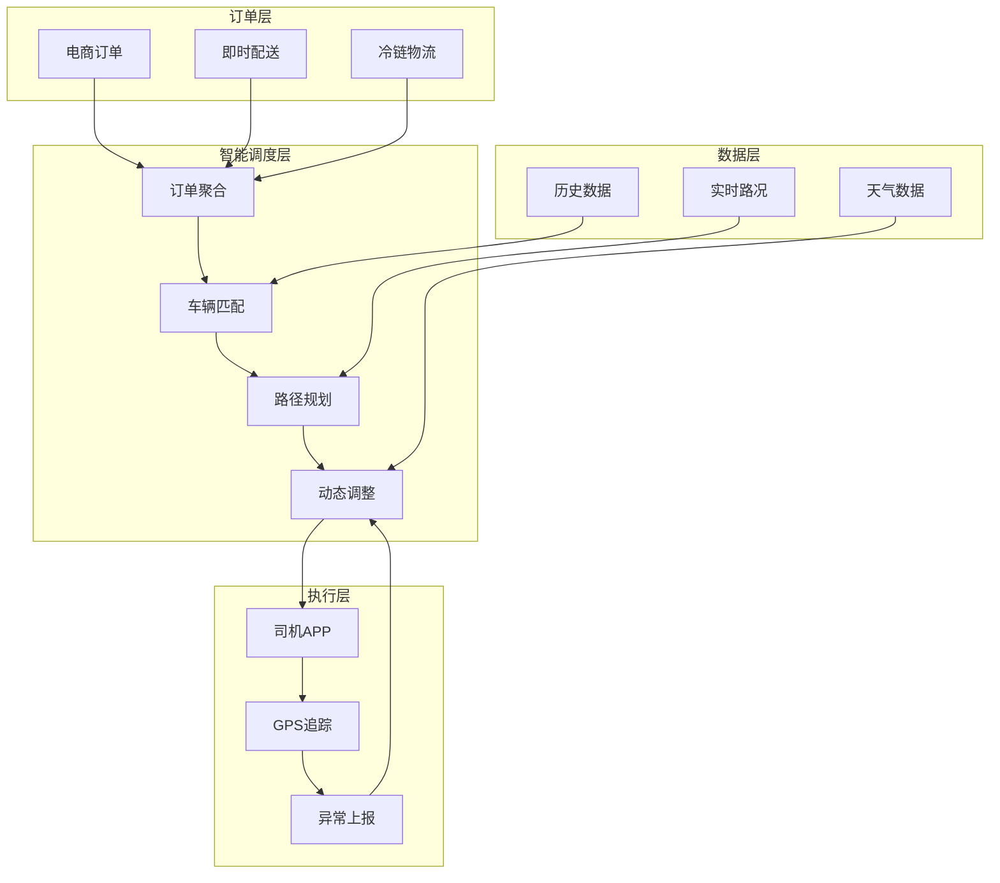
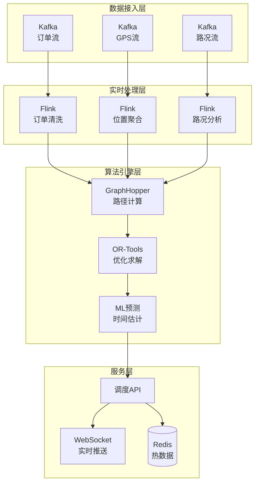

# 物流实时路径优化案例研究

> **案例编号**: 11.1.1
> **行业**: 物流/供应链
> **场景**: 实时路径规划、动态调度、运力优化
> **规模**: 10万车辆, 500万订单/天
> **编写日期**: 2026-04-09
> **状态**: Phase 2 - 初稿

---

## 执行摘要

### 业务背景

某头部物流平台面临配送效率挑战：

- 日订单量500万，覆盖全国3000+区县
- 配送车辆10万辆，司机15万人
- 路况变化快，静态路径规划效果差
- 客户需求多样（即时达、次日达、预约配送）

### 核心挑战

| 挑战 | 描述 | 影响 |
|------|------|------|
| 动态路况 | 拥堵、事故、天气实时变化 | 配送时效不稳定 |
| 多目标优化 | 成本、时效、满意度平衡 | 难以全局最优 |
| 实时约束 | 车辆容量、司机工时、客户时间窗 | 调度复杂度高 |
| 规模庞大 | 10万车辆实时决策 | 计算量巨大 |

### 解决方案

采用 **Flink + GraphHopper + OR-Tools** 架构：

- 实时路况流处理
- 动态路径重规划
- 多目标优化算法
- 配送成本降低18%，时效提升25%

---

## 1. 业务场景分析

### 1.1 业务流程



### 1.2 数据规模

| 指标 | 数值 | 说明 |
|------|------|------|
| 日订单量 | 500万 | 峰值800万（大促） |
| 配送车辆 | 10万 | 自营+众包 |
| 覆盖区域 | 3000+区县 | 全国覆盖 |
| 实时位置 | 10万/秒 | GPS上报 |
| 路况数据 | 50万路段 | 分钟级更新 |
| 计算响应 | < 3秒 | 路径规划延迟 |

---

## 2. 架构设计

### 2.1 系统架构



---

## 3. 技术实现

### 3.1 实时订单处理

```java
// Flink订单流处理
public class OrderStreamProcessor {

    public static void main(String[] args) {
        StreamExecutionEnvironment env =
            StreamExecutionEnvironment.getExecutionEnvironment();

        // 读取订单流
        DataStream<Order> orders = env
            .addSource(new FlinkKafkaConsumer<>("orders",
                new OrderDeserializationSchema(), kafkaProps))
            .assignTimestampsAndWatermarks(
                WatermarkStrategy.<Order>forBoundedOutOfOrderness(
                    Duration.ofMinutes(5))
                .withTimestampAssigner((order, ts) -> order.getCreateTime())
            );

        // 窗口聚合：5分钟内的订单
        DataStream<DeliveryBatch> batches = orders
            .keyBy(Order::getWarehouseId)
            .window(TumblingEventTimeWindows.of(Time.minutes(5)))
            .aggregate(new OrderBatchAggregate())
            .process(new BatchOptimizationFunction());

        // 输出到调度队列
        batches.addSink(new RouteOptimizationSink());

        env.execute("Real-time Route Optimization");
    }
}
```

### 3.2 路径优化算法

```python
# 使用OR-Tools进行VRP求解
from ortools.constraint_solver import routing_enums_pb2
from ortools.constraint_solver import pywrapcp

def optimize_delivery_routes(orders, vehicles, distance_matrix):
    """多车辆路径优化"""

    # 创建路由模型
    manager = pywrapcp.RoutingIndexManager(
        len(distance_matrix),
        len(vehicles),
        0  # depot
    )
    routing = pywrapcp.RoutingModel(manager)

    # 距离回调
    def distance_callback(from_index, to_index):
        from_node = manager.IndexToNode(from_index)
        to_node = manager.IndexToNode(to_index)
        return distance_matrix[from_node][to_node]

    transit_callback_index = routing.RegisterTransitCallback(distance_callback)
    routing.SetArcCostEvaluatorOfAllVehicles(transit_callback_index)

    # 添加容量约束
    def demand_callback(from_index):
        from_node = manager.IndexToNode(from_index)
        return orders[from_node]['weight']

    demand_callback_index = routing.RegisterUnaryTransitCallback(demand_callback)
    routing.AddDimensionWithVehicleCapacity(
        demand_callback_index,
        0,  # null capacity slack
        [v['capacity'] for v in vehicles],
        True,  # start cumul to zero
        'Capacity'
    )

    # 时间窗约束
    def time_callback(from_index, to_index):
        from_node = manager.IndexToNode(from_index)
        to_node = manager.IndexToNode(to_index)
        return distance_matrix[from_node][to_node] + orders[to_node]['service_time']

    time_callback_index = routing.RegisterTransitCallback(time_callback)
    routing.AddDimension(
        time_callback_index,
        30,  # 允许等待时间
        480,  # 最大工作时间8小时
        False,  # 不要求强制从零开始
        'Time'
    )

    # 求解
    search_parameters = pywrapcp.DefaultRoutingSearchParameters()
    search_parameters.first_solution_strategy = (
        routing_enums_pb2.FirstSolutionStrategy.PATH_CHEAPEST_ARC)
    search_parameters.local_search_metaheuristic = (
        routing_enums_pb2.LocalSearchMetaheuristic.GUIDED_LOCAL_SEARCH)
    search_parameters.time_limit.FromSeconds(30)

    solution = routing.SolveWithParameters(search_parameters)

    return extract_routes(manager, routing, solution)
```

---

## 4. 性能指标

| 指标 | 优化前 | 优化后 | 提升 |
|------|--------|--------|------|
| 平均配送时长 | 45分钟 | 34分钟 | **-24%** |
| 单车日均配送 | 25单 | 32单 | **+28%** |
| 配送成本 | 基线 | -18% | **-18%** |
| 客户满意度 | 4.2 | 4.7 | **+12%** |

---

## 5. 经验总结

### 最佳实践

1. **动态重规划**: 每15分钟重新优化一次路径
2. **预测性调度**: 基于历史数据预测订单分布
3. **司机偏好学习**: 考虑司机熟悉路线

### 挑战与解决

- **计算量大**: 使用启发式算法+分布式计算
- **实时性要求**: 预计算+增量更新

---

*Phase 2 - 任务线2-1: 物流实时路径优化案例 (编写中)*
