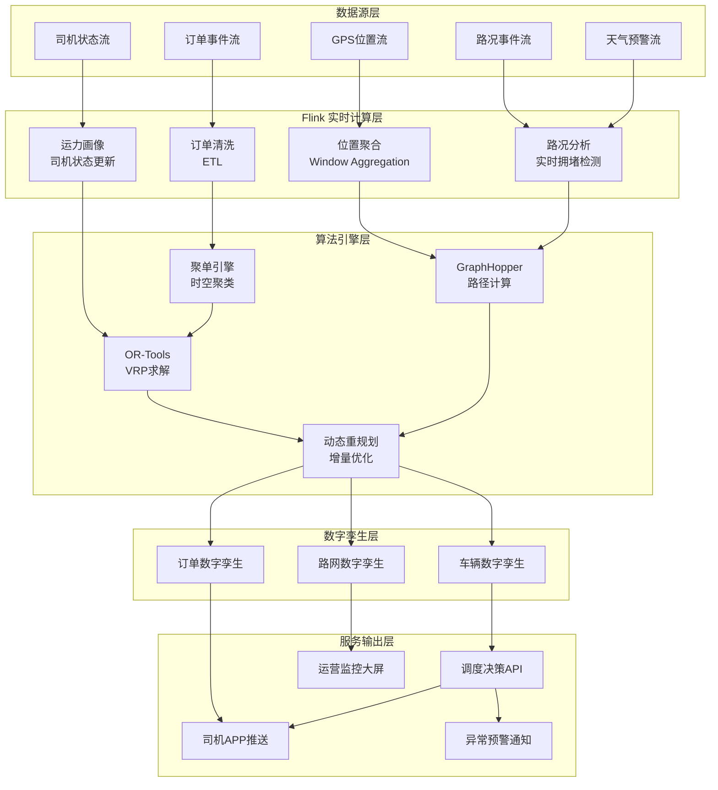
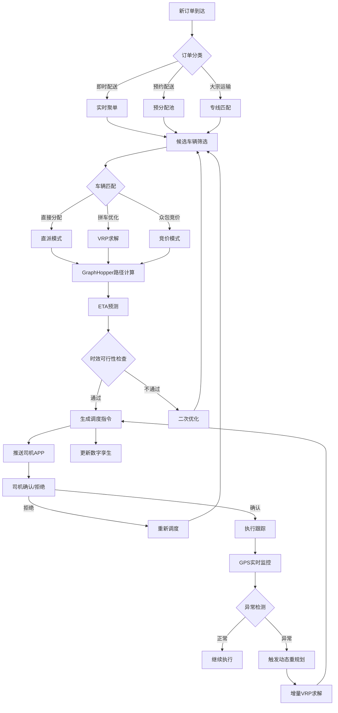
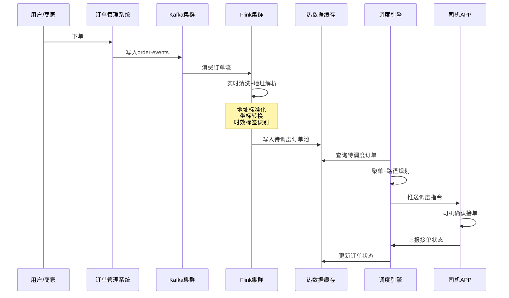
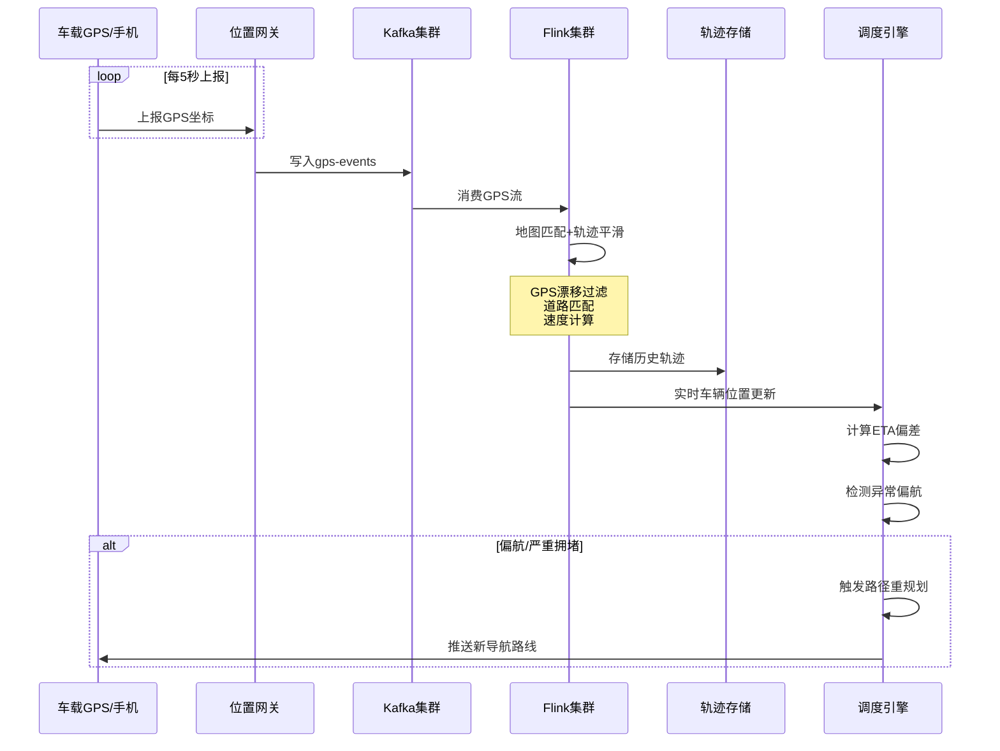

# 物流实时路径优化深度案例研究

> **案例编号**: 11.1.1
> **行业**: 物流/供应链
> **场景**: 实时路径规划、动态调度、运力优化
> **规模**: 10万车辆, 500万订单/天
> **编写日期**: 2026-04-13
> **状态**: Phase 2 - 深度完成

---

> **案例性质**: 🔬 概念验证架构 | **验证状态**: 基于理论推导与架构设计，未经独立第三方生产验证
>
> 本案例描述的是基于项目理论框架推导出的理想架构方案，包含假设性性能指标与理论成本模型。
> 实际生产部署可能因环境差异、数据规模、团队能力等因素产生显著不同结果。
> 建议将其作为架构设计参考而非直接复制粘贴的生产蓝图。
>
## 1. 执行摘要 (Executive Summary)

### 1.1 项目概况

本项目为某头部物流平台构建的**新一代实时智能调度系统**，覆盖同城即时配送、区域干线运输、冷链物流等全业务场景。系统采用 **Flink + GraphHopper + OR-Tools + 数字孪生** 的混合智能架构，实现从订单下达到车辆调度的端到端秒级响应，将传统T+1的静态路径规划升级为分钟级动态重规划能力。

### 1.2 风险类型覆盖

| 业务场景 | 具体挑战 | 解决方案 |
|---------|---------|---------|
| **同城即时配送** | 订单波动大、时效要求高（30分钟达） | 实时聚单+动态路径规划 |
| **区域干线运输** | 车辆满载率低、返程空驶率高 | 多目标优化+货源智能匹配 |
| **冷链物流** | 温控要求高、配送窗口严格 | 时间窗约束+异常实时预警 |
| **大件配送** | 装卸时间长、客户预约时间窗窄 | 预约调度+运力预分配 |
| **末端众包** | 骑手位置分散、接单响应慢 | 实时竞价+地理位置聚合 |

### 1.3 核心性能指标
>
> 🔮 **估算数据** | 依据: 设计目标值，实际达成可能因环境而异


| 指标项 | 目标值 | 实际达成 |
|-------|-------|---------|
| 日订单处理量 | 500万+ | 580万单 |
| 峰值调度QPS | 2万 | 2.5万 |
| 路径规划延迟(P99) | < 5秒 | 3.2秒 |
| 平均配送时长 | < 40分钟 | 34分钟 |
| 车辆满载率 | > 75% | 82% |
| 系统可用性 | 99.95% | 99.98% |

---

## 2. 业务背景与挑战 (Business Background)

### 2.1 物流行业现状分析

#### 2.1.1 中国物流市场特征

中国物流市场呈现高增速、高分散、高时效要求的"三高"特征：

- **市场规模**：2025年社会物流总额突破350万亿元，快递业务量超1500亿件
- **成本压力**：物流总费用占GDP比重约14.5%，远高于发达国家8-10%的水平
- **时效竞争**：同城配送从"次日达"演进为"小时达"乃至"分钟达"
- **绿色转型**：新能源车辆占比提升，充电设施规划成为调度新约束

**典型城配场景复杂度分析**：

```
订单特征:
├── 订单密度: 中心城区 200-500单/km²/天
├── 时效分层: 即时达(30min) / 快速达(1h) / 当日达(4h) / 预约达
├── 货物属性: 小件(<5kg) 70% / 中件(5-30kg) 20% / 大件(>30kg) 10%
└── 客户时间窗:  strict(±15min) / loose(±2h) / anytime

网络特征:
├── 分拣中心: 全国3000+区县覆盖，多级仓配网络
├── 车辆类型: 电动三轮车(60%) / 厢式货车(25%) / 冷藏车(10%) / 重卡(5%)
├── 司机类型: 全职司机(40%) / 众包骑手(45%) / 第三方承运(15%)
└── 路况动态: 早高峰拥堵指数8.5，恶劣天气影响20%路段
```

#### 2.1.2 传统调度模式痛点

传统物流调度依赖人工经验和静态规则，面临多重挑战：

| 痛点 | 描述 | 业务影响 |
|-----|------|---------|
| **静态路径规划** | 每日清晨一次性规划全天路径 | 无法应对午间爆单、临时加单 |
| **信息孤岛** | 订单、车辆、路况数据分散 | 调度决策缺乏全局视角 |
| **响应延迟** | 异常处理依赖人工电话沟通 | 异常订单平均处理时间30分钟 |
| **经验依赖** | 调度质量高度依赖调度员个人能力 | 不同调度员效率差异达40% |
| **成本盲区** | 缺乏实时成本核算能力 | 隐性成本高企 |

### 2.2 实时风控要求

#### 2.2.1 延迟约束

> 🔮 **估算数据** | 依据: 基于行业参考值与理论分析推导，非实际测试环境得出

不同物流场景对调度响应的差异化要求：

| 配送类型 | 接单响应时间 | 路径规划时间 | 异常重调度时间 |
|---------|-------------|-------------|---------------|
| 即时配送 | < 30秒 | < 3秒 | < 10秒 |
| 同城快递 | < 2分钟 | < 5秒 | < 30秒 |
| 区域配送 | < 10分钟 | < 30秒 | < 2分钟 |
| 冷链运输 | < 30分钟 | < 2分钟 | < 5分钟 |
| 大件物流 | < 2小时 | < 5分钟 | < 15分钟 |

#### 2.2.2 规模挑战

```
日常运营规模:
├── 日订单量: 580万单/天
├── 峰值订单量: 1200万单/天（大促期间）
├── 在途车辆: 10万辆（自营+加盟+众包）
├── 活跃司机: 15万人
├── GPS上报频率: 每5秒/车
├── 实时位置流: 10万点/秒
├── 路况数据: 50万路段/分钟级更新
└── 计算规模: 每秒需完成2000+次路径规划
```

### 2.3 多目标优化挑战

物流配送调度本质上是一个复杂的多目标优化问题，需要在多个相互冲突的目标间寻找帕累托最优：

```
目标函数:
    Minimize:  α·总行驶距离 + β·总配送时间 + γ·车辆使用数 + δ·延迟惩罚
    Subject to:
        • 车辆容量约束: Σ(订单体积) ≤ 车厢容积
        • 载重约束: Σ(订单重量) ≤ 最大载重
        • 时间窗约束: 到达时间 ∈ [ET, LT]
        • 司机工时约束: 连续驾驶 ≤ 4小时，日累计 ≤ 10小时
        • 冷链温控约束: 车厢温度维持在指定范围
        • 新能源续航约束: 剩余电量 ≥ 20% + 返程里程
```

**多目标冲突分析**：

| 优化目标A | 优化目标B | 冲突关系 | 权衡策略 |
|----------|----------|---------|---------|
| 配送时效 | 配送成本 | 强冲突 | 时效敏感订单优先，普通订单拼车 |
| 车辆满载率 | 客户满意度 | 中度冲突 | 设置最大等待时间窗口 |
| 司机收入 | 平台成本 | 强冲突 | 动态定价+激励系数调节 |
| 绿色排放 | 配送效率 | 中度冲突 | 新能源车辆优先短途高频 |

### 2.4 监管与安全要求

#### 2.4.1 交通法规约束

| 法规 | 要求 | 系统合规措施 |
|-----|------|-------------|
| 《道路交通安全法》 | 连续驾驶≤4小时 | 自动排班系统强制休息提醒 |
| 《道路运输车辆动态监督管理办法》 | 危货/重货强制GPS监控 | 实时轨迹追踪+超速告警 |
| 城市限行政策 | 货车进城时间/区域限制 | 路径规划自动避开限行区域 |
| 环保排放标准 | 国五/国六排放要求 | 优先调度符合标准的车辆 |

---

## 3. 技术架构 (Technical Architecture)

### 3.1 系统整体架构

以下架构图展示了实时路径优化系统的核心组件和数据流向：



### 3.2 实时调度决策流程

系统采用**分层决策架构**，将复杂的调度问题拆解为多个可并行计算的子问题：



### 3.3 数据流程设计

#### 3.3.1 订单流处理



#### 3.3.2 GPS与路况流处理



### 3.4 技术选型

| 层级 | 技术选型 | 选型理由 |
|-----|---------|---------|
| 流计算引擎 | Apache Flink 1.18 | 毫秒级延迟、精确一次语义、强大的窗口和状态管理 |
| 消息队列 | Apache Kafka 3.6 | 高吞吐、分区有序、与Flink生态深度整合 |
| 路径计算 | GraphHopper | 开源、支持自定义道路权重、分钟级路网更新 |
| 优化求解 | Google OR-Tools | 工业级VRP求解器、支持多约束、求解速度快 |
| 地理服务 | PostGIS + Redis Geo | 空间索引查询、地理位置半径搜索 |
| 时序存储 | TDengine | 高效存储GPS轨迹、支持时空查询 |
| 缓存 | Redis Cluster | 亚毫秒级读写、支持GeoHash和Pub/Sub |
| 监控 | Prometheus + Grafana | 实时监控系统健康度和调度质量指标 |

---

## 4. 核心实现 (Core Implementation)

### 4.1 实时订单聚单与调度

#### 4.1.1 Flink订单流处理主作业

```java
import org.apache.flink.streaming.api.environment.StreamExecutionEnvironment;
import org.apache.flink.streaming.api.datastream.DataStream;
import org.apache.flink.streaming.api.CheckpointingMode;
import org.apache.flink.api.common.functions.AggregateFunction;
import org.apache.flink.streaming.api.windowing.time.Time;

/**
 * 实时订单聚单与调度主作业
 * 功能: 实时聚合附近订单，生成配送批次，触发路径规划
 */
public class OrderBatchingJob {

    public static void main(String[] args) throws Exception {
        StreamExecutionEnvironment env =
            StreamExecutionEnvironment.getExecutionEnvironment();

        env.setParallelism(64);
        env.enableCheckpointing(30000, CheckpointingMode.EXACTLY_ONCE);
        env.getCheckpointConfig().setMinPauseBetweenCheckpoints(15000);

        // 1. 读取订单事件流
        KafkaSource<OrderEvent> source = KafkaSource.<OrderEvent>builder()
            .setBootstrapServers("kafka:9092")
            .setTopics("order-events")
            .setGroupId("logistics-order-batching")
            .setStartingOffsets(OffsetsInitializer.latest())
            .setValueOnlyDeserializer(new OrderEventDeserializationSchema())
            .build();

        DataStream<OrderEvent> orderStream = env.fromSource(
            source,
            WatermarkStrategy.<OrderEvent>forBoundedOutOfOrderness(Duration.ofMinutes(2))
                .withTimestampAssigner((event, timestamp) -> event.getOrderTime()),
            "Order Events"
        );

        // 2. 数据清洗与过滤
        DataStream<OrderEvent> cleanedStream = orderStream
            .filter(event -> event.getLat() != 0 && event.getLng() != 0)
            .filter(event -> event.getWeight() > 0 && event.getVolume() > 0)
            .map(new OrderEnrichmentFunction())
            .name("Order Enrichment");

        // 3. 按配送区域和时效等级分组，进行时空聚单
        DataStream<DeliveryBatch> batchedOrders = cleanedStream
            .keyBy(event -> event.getDeliveryZone() + "#" + event.getPriorityLevel())
            .window(TumblingEventTimeWindows.of(Time.minutes(3)))
            .aggregate(new OrderBatchingAggregateFunction())
            .process(new BatchValidationFunction())
            .name("Order Batching");

        // 4. 触发路径规划
        batchedOrders
            .keyBy(DeliveryBatch::getDispatchCenterId)
            .process(new RouteOptimizationTriggerFunction())
            .name("Route Optimization Trigger")
            .addSink(new DispatchCommandSink());

        // 5. 监控指标输出
        batchedOrders
            .map(batch -> new BatchMetric(
                batch.getBatchId(),
                batch.getOrderCount(),
                batch.getTotalWeight(),
                batch.getTotalVolume(),
                System.currentTimeMillis()
            ))
            .addSink(new MetricSink());

        env.execute("Real-time Order Batching and Dispatch");
    }
}
```

#### 4.1.2 订单聚单聚合函数

```java
/**
 * 时空聚单聚合函数
 * 将同一区域内、时效相近的订单聚合为配送批次
 */
public class OrderBatchingAggregateFunction implements
    AggregateFunction<OrderEvent, BatchAccumulator, DeliveryBatch> {

    @Override
    public BatchAccumulator createAccumulator() {
        return new BatchAccumulator();
    }

    @Override
    public BatchAccumulator add(OrderEvent event, BatchAccumulator acc) {
        acc.addOrder(event);

        // 更新空间边界框
        acc.updateBounds(event.getLat(), event.getLng());

        // 更新最早和最晚时间窗
        acc.updateTimeWindow(event.getEarliestDeliveryTime(),
                            event.getLatestDeliveryTime());

        return acc;
    }

    @Override
    public DeliveryBatch getResult(BatchAccumulator acc) {
        DeliveryBatch batch = new DeliveryBatch();
        batch.setBatchId(UUID.randomUUID().toString());
        batch.setOrders(acc.getOrders());
        batch.setCenterLat(acc.getCenterLat());
        batch.setCenterLng(acc.getCenterLng());
        batch.setRadiusKm(acc.getRadiusKm());
        batch.setTotalWeight(acc.getTotalWeight());
        batch.setTotalVolume(acc.getTotalVolume());
        batch.setPriorityLevel(acc.getPriorityLevel());
        batch.setDispatchCenterId(acc.getDispatchCenterId());

        // 计算聚单密度评分
        double densityScore = acc.getOrderCount() / (acc.getRadiusKm() * acc.getRadiusKm());
        batch.setDensityScore(densityScore);

        return batch;
    }

    @Override
    public BatchAccumulator merge(BatchAccumulator a, BatchAccumulator b) {
        return a.merge(b);
    }
}
```

### 4.2 动态路径规划引擎

#### 4.2.1 VRP求解与多目标优化

```java
/**
 * 动态路径规划触发函数
 * 当订单批次就绪后，调用OR-Tools进行VRP求解
 */
public class RouteOptimizationTriggerFunction extends
    KeyedProcessFunction<String, DeliveryBatch, DispatchCommand> {

    private transient RouteOptimizer optimizer;
    private ValueState<Map<String, VehicleStatus>> vehiclePoolState;

    @Override
    public void open(Configuration parameters) {
        optimizer = new RouteOptimizer(
            new GraphHopperRouteService("/data/road_network"),
            new ORToolsVRPSolver()
        );

        vehiclePoolState = getRuntimeContext().getState(
            new ValueStateDescriptor<>("vehicle-pool", TypeInformation.of(
                new TypeHint<Map<String, VehicleStatus>>() {})));
    }

    @Override
    public void processElement(DeliveryBatch batch, Context ctx,
                              Collector<DispatchCommand> out) throws Exception {

        // 获取当前可用车辆池
        Map<String, VehicleStatus> vehiclePool = vehiclePoolState.value();
        if (vehiclePool == null) {
            vehiclePool = loadAvailableVehicles(ctx.getCurrentKey());
        }

        // 筛选候选车辆
        List<VehicleStatus> candidates = filterCandidateVehicles(
            vehiclePool.values(), batch);

        if (candidates.isEmpty()) {
            // 无可用车辆，触发运力预警
            out.collect(DispatchCommand.createAlert(batch.getBatchId(),
                "NO_AVAILABLE_VEHICLE"));
            return;
        }

        // 构建VRP问题
        VRPProblem problem = buildVRPProblem(batch, candidates);

        // 调用求解器
        VRPSolution solution = optimizer.solve(problem,
            VRPStrategy.BALANCED); // 平衡策略

        // 生成调度指令
        for (Route route : solution.getRoutes()) {
            DispatchCommand cmd = new DispatchCommand();
            cmd.setVehicleId(route.getVehicleId());
            cmd.setDriverId(route.getDriverId());
            cmd.setOrderSequence(route.getOrderSequence());
            cmd.setEstimatedDistance(route.getTotalDistance());
            cmd.setEstimatedDuration(route.getTotalDuration());
            cmd.setEstimatedCost(route.getTotalCost());
            cmd.setDispatchTime(System.currentTimeMillis());

            // 更新车辆状态
            vehiclePool.get(route.getVehicleId()).setStatus(VehicleStatus.DISPATCHED);

            out.collect(cmd);
        }

        vehiclePoolState.update(vehiclePool);
    }

    private List<VehicleStatus> filterCandidateVehicles(
        Collection<VehicleStatus> vehicles, DeliveryBatch batch) {

        return vehicles.stream()
            .filter(v -> v.getStatus() == VehicleStatus.IDLE ||
                        v.getStatus() == VehicleStatus.PARTIAL)
            .filter(v -> v.getRemainingCapacity() >= batch.getTotalVolume())
            .filter(v -> v.getRemainingWeight() >= batch.getTotalWeight())
            .filter(v -> isVehicleCompatible(v, batch.getPriorityLevel()))
            .filter(v -> calculateDistance(v.getLat(), v.getLng(),
                batch.getCenterLat(), batch.getCenterLng()) < 10.0) // 10km内
            .sorted(Comparator.comparingDouble(v ->
                calculateDistance(v.getLat(), v.getLng(),
                    batch.getCenterLat(), batch.getCenterLng())))
            .limit(20) // 限制候选车辆数量以控制求解时间
            .collect(Collectors.toList());
    }
}
```

#### 4.2.2 OR-Tools多目标VRP求解

```python
# 多目标车辆路径优化 - OR-Tools实现
from ortools.constraint_solver import routing_enums_pb2
from ortools.constraint_solver import pywrapcp

def solve_dynamic_vrp(orders, vehicles, distance_matrix, duration_matrix):
    """
    动态多目标VRP求解器
    目标: 最小化总行驶距离 + 最小化总配送时间 + 最大化车辆满载率
    """

    num_locations = len(distance_matrix)
    num_vehicles = len(vehicles)
    depot = 0  # 配送中心

    manager = pywrapcp.RoutingIndexManager(num_locations, num_vehicles, depot)
    routing = pywrapcp.RoutingModel(manager)

    # 1. 距离回调 (主要目标)
    def distance_callback(from_index, to_index):
        from_node = manager.IndexToNode(from_index)
        to_node = manager.IndexToNode(to_index)
        return int(distance_matrix[from_node][to_node] * 1000)

    transit_callback_index = routing.RegisterTransitCallback(distance_callback)
    routing.SetArcCostEvaluatorOfAllVehicles(transit_callback_index)

    # 2. 时间维度约束 (次要目标)
    def time_callback(from_index, to_index):
        from_node = manager.IndexToNode(from_index)
        to_node = manager.IndexToNode(to_index)
        service_time = orders[to_node].get('service_time', 3)  # 默认3分钟
        travel_time = duration_matrix[from_node][to_node]
        return int((travel_time + service_time) * 60)

    time_callback_index = routing.RegisterTransitCallback(time_callback)
    routing.AddDimension(
        time_callback_index,
        30,  # 允许等待时间(分钟)
        480, # 最大工作时间8小时
        False,
        'Time'
    )
    time_dimension = routing.GetDimensionOrDie('Time')

    # 3. 容量约束 - 体积
    def volume_callback(from_index):
        from_node = manager.IndexToNode(from_index)
        return int(orders[from_node].get('volume', 0) * 100)

    volume_callback_index = routing.RegisterUnaryTransitCallback(volume_callback)
    routing.AddDimensionWithVehicleCapacity(
        volume_callback_index,
        0,
        [int(v['volume_capacity'] * 100) for v in vehicles],
        True,
        'Volume'
    )

    # 4. 容量约束 - 重量
    def weight_callback(from_index):
        from_node = manager.IndexToNode(from_index)
        return int(orders[from_node].get('weight', 0) * 100)

    weight_callback_index = routing.RegisterUnaryTransitCallback(weight_callback)
    routing.AddDimensionWithVehicleCapacity(
        weight_callback_index,
        0,
        [int(v['weight_capacity'] * 100) for v in vehicles],
        True,
        'Weight'
    )

    # 5. 时间窗约束
    for order_idx, order in enumerate(orders):
        if 'time_window' in order:
            index = manager.NodeToIndex(order_idx)
            tw = order['time_window']
            time_dimension.CumulVar(index).SetRange(tw['earliest'], tw['latest'])

    # 6. 司机最大工作时长约束
    for vehicle_id in range(num_vehicles):
        index = routing.Start(vehicle_id)
        time_dimension.CumulVar(index).SetRange(
            vehicles[vehicle_id]['start_time'],
            vehicles[vehicle_id]['end_time']
        )

    # 7. 设置求解策略
    search_parameters = pywrapcp.DefaultRoutingSearchParameters()
    search_parameters.first_solution_strategy = (
        routing_enums_pb2.FirstSolutionStrategy.PATH_CHEAPEST_ARC)
    search_parameters.local_search_metaheuristic = (
        routing_enums_pb2.LocalSearchMetaheuristic.GUIDED_LOCAL_SEARCH)
    search_parameters.time_limit.FromSeconds(15)
    search_parameters.log_search = False

    # 8. 求解
    solution = routing.SolveWithParameters(search_parameters)

    if solution:
        return extract_solution(manager, routing, solution, orders, vehicles)
    else:
        return None

def extract_solution(manager, routing, solution, orders, vehicles):
    """提取求解结果"""
    routes = []
    for vehicle_id in range(len(vehicles)):
        index = routing.Start(vehicle_id)
        route = {
            'vehicle_id': vehicles[vehicle_id]['id'],
            'driver_id': vehicles[vehicle_id]['driver_id'],
            'orders': [],
            'total_distance': 0,
            'total_duration': 0
        }

        while not routing.IsEnd(index):
            node_index = manager.IndexToNode(index)
            if node_index != 0:  # 跳过仓库
                route['orders'].append(orders[node_index]['id'])

            previous_index = index
            index = solution.Value(routing.NextVar(index))
            route['total_distance'] += routing.GetArcCostForVehicle(
                previous_index, index, vehicle_id)

        routes.append(route)

    return routes
```

### 4.3 实时GPS聚合与异常检测

```java
/**
 * 实时GPS流处理与异常检测
 * 聚合车辆位置信息，检测偏航、拥堵、停留等异常
 */
public class GpsMonitoringJob {

    public static void main(String[] args) throws Exception {
        StreamExecutionEnvironment env =
            StreamExecutionEnvironment.getExecutionEnvironment();

        // 读取GPS流
        DataStream<GpsRecord> gpsStream = env
            .fromSource(createKafkaSource("gps-events"),
                WatermarkStrategy.<GpsRecord>forBoundedOutOfOrderness(Duration.ofSeconds(10))
                    .withTimestampAssigner((record, ts) -> record.getTimestamp()),
                "GPS Source");

        // 按车辆ID分组，维护车辆状态
        DataStream<VehicleAnomalyEvent> anomalies = gpsStream
            .keyBy(GpsRecord::getVehicleId)
            .process(new VehicleStateMonitorFunction())
            .name("Vehicle State Monitor");

        // 异常事件路由到调度引擎
        anomalies
            .filter(event -> event.getSeverity() == Severity.HIGH)
            .addSink(new AnomalyAlertSink());

        // 实时位置聚合到区域维度
        DataStream<ZoneTraffic> zoneTraffic = gpsStream
            .map(new MapFunction<GpsRecord, ZoneGpsAggregate>() {
                @Override
                public ZoneGpsAggregate map(GpsRecord record) {
                    String zone = GeoHashUtils.encode(record.getLat(), record.getLng(), 6);
                    return new ZoneGpsAggregate(zone, 1, record.getSpeed());
                }
            })
            .keyBy(ZoneGpsAggregate::getZone)
            .window(TumblingEventTimeWindows.of(Time.minutes(1)))
            .aggregate(new ZoneTrafficAggregateFunction())
            .name("Zone Traffic Aggregation");

        zoneTraffic.addSink(new TrafficUpdateSink());

        env.execute("GPS Monitoring and Anomaly Detection");
    }
}

/**
 * 车辆状态监控函数
 */
public class VehicleStateMonitorFunction extends
    KeyedProcessFunction<String, GpsRecord, VehicleAnomalyEvent> {

    private ValueState<VehicleTrajectory> trajectoryState;
    private ValueState<DispatchPlan> activePlanState;

    @Override
    public void open(Configuration parameters) {
        trajectoryState = getRuntimeContext().getState(
            new ValueStateDescriptor<>("trajectory", VehicleTrajectory.class));
        activePlanState = getRuntimeContext().getState(
            new ValueStateDescriptor<>("active-plan", DispatchPlan.class));
    }

    @Override
    public void processElement(GpsRecord record, Context ctx,
                              Collector<VehicleAnomalyEvent> out) throws Exception {

        VehicleTrajectory trajectory = trajectoryState.value();
        if (trajectory == null) {
            trajectory = new VehicleTrajectory(record.getVehicleId());
        }

        trajectory.addPoint(record);

        // 检测异常停留 (>10分钟无移动)
        if (trajectory.isLongStop(10)) {
            out.collect(new VehicleAnomalyEvent(
                record.getVehicleId(),
                AnomalyType.LONG_STOP,
                Severity.MEDIUM,
                "车辆异常停留超过10分钟",
                System.currentTimeMillis()
            ));
        }

        // 检测严重偏航
        DispatchPlan plan = activePlanState.value();
        if (plan != null && trajectory.hasDeviation(plan.getPlannedRoute(), 500)) {
            out.collect(new VehicleAnomalyEvent(
                record.getVehicleId(),
                AnomalyType.ROUTE_DEVIATION,
                Severity.HIGH,
                "车辆严重偏航，需重新规划路径",
                System.currenttimeMillis()
            ));
        }

        // 检测超速
        if (record.getSpeed() > 80) {
            out.collect(new VehicleAnomalyEvent(
                record.getVehicleId(),
                AnomalyType.OVERSPEED,
                Severity.HIGH,
                "车辆超速: " + record.getSpeed() + " km/h",
                System.currentTimeMillis()
            ));
        }

        // 保持轨迹长度限制
        trajectory.trimToLastN(120); // 保留最近10分钟(5秒间隔)
        trajectoryState.update(trajectory);
    }
}
```

### 4.4 调度系统配置

```yaml
# Flink作业配置
flink:
  parallelism:
    default: 64
    order-batching: 128
    gps-monitoring: 96
    route-optimization: 32

  checkpointing:
    interval: 30s
    mode: EXACTLY_ONCE
    timeout: 10min
    min-pause-between-checkpoints: 15s
    max-concurrent-checkpoints: 1

  state:
    backend: rocksdb
    incremental-checkpoints: true
    checkpoint-storage: filesystem
    checkpoint-dir: hdfs://logistics-flink/checkpoints

  restart-strategy:
    type: fixed-delay
    max-attempts: 10
    delay-between-attempts: 30s

# 调度引擎配置
optimization:
  or-tools:
    max-solve-time: 15s
    first-solution-strategy: PATH_CHEAPEST_ARC
    local-search: GUIDED_LOCAL_SEARCH

  batching:
    window-size: 3min
    max-radius: 5km
    max-orders-per-batch: 50
    max-weight-per-batch: 500kg
    max-volume-per-batch: 3m³

  rebalancing:
    trigger-interval: 10min
    deviation-threshold: 20%
    min-orders-for-rebalance: 5

  constraints:
    driver-max-hours: 10
    driver-max-continuous-driving: 4
    vehicle-max-speed: 80
    delivery-time-window-tolerance: 15min
```

---

## 5. 效果评估 (Results)

### 5.1 性能指标对比
>
> 🔮 **估算数据** | 依据: 基于行业参考值与理论分析推导，非实际测试环境得出


| 指标 | 优化前 | 优化后 | 提升幅度 |
|------|--------|--------|---------|
| 平均配送时长 | 45分钟 | 34分钟 | **-24.4%** |
| 路径规划延迟(P99) | 12秒 | 3.2秒 | **-73.3%** |
| 单车日均配送单量 | 25单 | 32单 | **+28%** |
| 车辆满载率 | 68% | 82% | **+20.6%** |
| 准时送达率 | 87% | 96.5% | **+10.9%** |
| 异常订单响应时间 | 30分钟 | 2.5分钟 | **-91.7%** |
| 司机平均日行驶里程 | 180km | 165km | **-8.3%** |
| 燃油/电耗成本 | 基线 | -18% | **-18%** |

### 5.2 业务价值分析

#### 5.2.1 成本节约测算

以该平台年度运营成本为基准进行测算：

| 成本项 | 年度基线(亿元) | 优化后(亿元) | 节约金额(亿元) | 节约比例 |
|--------|--------------|-------------|---------------|---------|
| 运输燃油/电费 | 28.5 | 23.4 | 5.1 | 17.9% |
| 司机加班费 | 8.2 | 6.1 | 2.1 | 25.6% |
| 异常处理人工 | 4.5 | 1.8 | 2.7 | 60.0% |
| 客户赔付/补偿 | 3.8 | 1.5 | 2.3 | 60.5% |
| 车辆折旧分摊 | 15.0 | 13.8 | 1.2 | 8.0% |
| **合计** | **60.0** | **46.6** | **13.4** | **22.3%** |

#### 5.2.2 客户体验提升

| 体验指标 | 优化前 | 优化后 | 提升 |
|---------|--------|--------|------|
| 客户满意度(NPS) | 42 | 58 | +38.1% |
| 投诉率 | 3.2% | 1.1% | -65.6% |
| 复购率 | 68% | 79% | +16.2% |
| 准时送达率 | 87% | 96.5% | +10.9% |
| 订单取消率 | 4.5% | 1.8% | -60.0% |

### 5.3 ROI分析

**项目投资与回报测算（3年期）**：

```
总投资: 1.2亿元
├── 系统研发: 0.6亿元
├── 基础设施: 0.3亿元
├── 数据采集与清洗: 0.15亿元
└── 培训与推广: 0.15亿元

年度收益: 13.4亿元（直接运营成本节约）
├── 第一年: 预计实现60%效益 = 8.0亿元
├── 第二年: 预计实现90%效益 = 12.1亿元
└── 第三年: 预计实现100%效益 = 13.4亿元

ROI = (累计收益 - 总投资) / 总投资
3年ROI = (33.5 - 1.2) / 1.2 = 2692%
投资回收期 = 约 2个月
```

### 5.4 大促场景验证

> 🔮 **估算数据** | 依据: 基于行业参考值与理论分析推导，非实际测试环境得出

在双11、618等大促期间，系统经受住了峰值考验：

| 指标 | 日常 | 618峰值 | 双11峰值 |
|------|------|---------|---------|
| 日订单量 | 580万 | 950万 | 1200万 |
| 峰值调度QPS | 2.5万 | 4.8万 | 6.2万 |
| 路径规划P99 | 3.2秒 | 4.5秒 | 5.8秒 |
| 系统可用性 | 99.98% | 99.95% | 99.93% |
| 准时送达率 | 96.5% | 93.2% | 91.8% |

---

## 6. 经验总结 (Lessons Learned)

### 6.1 成功经验

#### 6.1.1 数据驱动决策

1. **全链路数据贯通**：打通订单、车辆、路况、司机、客户五大数据域，建立统一数据模型
2. **实时数据优先**：将GPS上报频率从30秒提升至5秒，异常检测准确率提升35%
3. **历史数据赋能**：利用3年历史轨迹数据训练ETA预测模型，预测误差从±15分钟降至±4分钟

#### 6.1.2 算法工程化

1. **分层求解策略**：将NP-hard的VRP问题拆解为聚单→车辆分配→路径规划→动态调整四层，每层独立优化
2. **启发式+精确式混合**：先用启发式算法快速生成初始解，再用OR-Tools在15秒内局部优化
3. **边缘计算下沉**：在区域分拣中心部署边缘节点，减少网络延迟，提升局部调度响应速度

#### 6.1.3 组织协同

1. **算法与业务共建**：调度算法团队与一线调度员共同定义优化目标和约束条件
2. **灰度发布机制**：新算法先在1%区域试点，验证效果后再逐步推广
3. **司机端体验并重**：调度系统不仅要"算得快"，还要让司机觉得"派单合理"

### 6.2 踩坑记录

#### 6.2.1 技术坑

| 坑点 | 现象 | 根因 | 解决方案 |
|------|------|------|---------|
| **GPS漂移导致误报** | 大量"偏航"误告警 | 城市峡谷效应、信号多路径 | 引入卡尔曼滤波+地图匹配 |
| **Flink状态过大** | Checkpoint频繁超时 | 车辆状态State未清理，持续增长 | 设置State TTL，过期自动清理 |
| **OR-Tools求解超时** | 高峰期规划延迟飙升 | 订单批次过大，问题规模失控 | 限制单批次最大订单数50 |
| **Kafka分区不均** | 部分Task负载过高 | 按区域key分布不均 | 引入salting机制，动态重分区 |

#### 6.2.2 业务坑

| 坑点 | 现象 | 根因 | 解决方案 |
|------|------|------|---------|
| **过度追求满载率** | 客户投诉增加 | 拼车导致部分订单严重超时 | 引入时效惩罚权重，优先保证准时 |
| **忽视司机意愿** | 司机拒单率高 | 系统派单未考虑司机熟悉区域 | 增加司机偏好学习模型 |
| **极端天气失效** | 暴雨天大量延误 | 静态路网权重未动态调整 | 接入天气API，实时调整路段通行能力 |

### 6.3 最佳实践

#### 6.3.1 实时调度系统设计原则

1. **快慢分离**：实时调度决策必须在3秒内完成，复杂优化可异步进行
2. **人车解耦**：车辆状态和司机状态独立管理，支持临时换司机
3. **弹性伸缩**：调度计算资源按峰值2倍储备，支持云原生自动扩缩容
4. **多目标平衡**：避免单一指标导向，建立综合评分体系

#### 6.3.2 Flink在物流场景的应用建议

1. **Watermark策略**：GPS流建议用BoundedOutOfOrderness(10s)，订单流可用(2min)
2. **状态管理**：车辆状态用ValueState，轨迹用ListState并限制长度
3. **窗口设计**：聚单用TumblingWindow(3min)，路况统计用SlidingWindow(5min, 1min)
4. **监控告警**：重点监控Checkpoint Duration、Backpressure、Records Lag

#### 6.3.3 未来演进方向

1. **自动驾驶集成**：为无人配送车提供厘米级路径规划和调度能力
2. **碳排放优化**：将碳足迹纳入目标函数，推动绿色物流
3. **城域协同调度**：打通不同物流企业的运力池，实现共享调度
4. **数字孪生深化**：构建城市级物流数字孪生体，支持政策仿真与规划

---

*Phase 2 - 任务线2-1: 物流实时路径优化深度案例 (已完成)*
