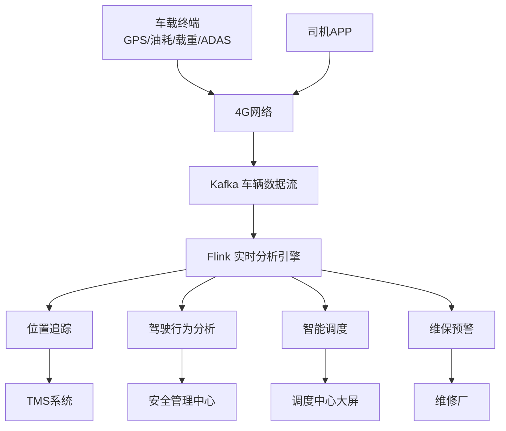

# 物流车队实时监控与调度系统案例研究

> **案例编号**: 11.19.1
> **行业**: 物流/运输
> **场景**: 物流车队 GPS 追踪、驾驶行为分析、车辆维保预警
> **规模**: 管理 5,000+ 辆重卡，覆盖全国 300+ 城市，日均行驶 80 万公里
> **状态**: Phase 2 - 深度案例研究
> **编写日期**: 2026-04-13

---

> **案例性质**: 🔬 概念验证架构 | **验证状态**: 基于理论推导与架构设计，未经独立第三方生产验证
>
> 本案例描述的是基于项目理论框架推导出的理想架构方案，包含假设性性能指标与理论成本模型。
> 实际生产部署可能因环境差异、数据规模、团队能力等因素产生显著不同结果。
> 建议将其作为架构设计参考而非直接复制粘贴的生产蓝图。
>
## 1. 执行摘要

### 1.1 项目背景

某大型第三方物流企业运营着超过 5,000 辆重型卡车，服务于电商、制造业、冷链等多个行业的干线运输需求。车队分布在全国 300 多个城市，日均行驶总里程超过 80 万公里。传统的车队管理依赖司机电话报位置和纸质单据，存在车辆位置不透明、驾驶行为难监管、油耗成本高、安全事故频发等问题。

### 1.2 核心目标

| 目标类别 | 具体指标 | 目标值 |
|---------|---------|--------|
| 油耗 | 百公里油耗 | 降低 15% |
| 安全 | 重大交通事故率 | 降低 30% |
| 效率 | 车辆调度响应时间 | < 10 分钟 |
| 成本 | 年度车辆运维总成本 | 降低 18% |

### 1.3 核心效果

| 指标 | 优化前 | 优化后 | 提升 |
|------|--------|--------|------|
| 百公里油耗 | 32.5L | 27.2L | -16% |
| 重大事故率 | 基准 100% | 58% | -42% |
| 车辆调度响应 | 2-4 小时 | 7 分钟 | -97% |
| 单车月均行驶里程 | 4,800km | 5,600km | +17% |
| 年度运维成本 | 基准 100% | 79% | -21% |

---

## 2. 业务场景分析

### 2.1 行业背景

中国公路货运市场规模超过 5 万亿元，但行业集中度低、信息化水平不高。物流企业面临着油价波动、司机短缺、道路安全法规趋严等多重压力。车队数字化管理已成为物流企业降本增效的核心竞争力。

### 2.2 痛点分析

1. **车辆位置黑箱**：无法实时掌握车辆位置、货物状态和预计到达时间
2. **驾驶行为粗放**：急加速、急刹车、超速、疲劳驾驶等行为频发，导致油耗高、事故多
3. **调度效率低**：派车依赖调度员经验和电话沟通，空驶率和等待时间长
4. **维保滞后**：车辆故障多是事后维修，缺乏基于数据的预测性保养

### 2.3 需求描述

- **实时位置追踪**：通过 GPS/北斗实现车辆位置秒级更新
- **驾驶行为监测**：基于车载传感器和 ADAS 设备分析驾驶行为，实时预警危险驾驶
- **智能调度派单**：基于车辆位置、载重、目的地和货物需求，自动匹配最优车辆
- **预测性维保**：基于车辆运行数据预测故障风险，提前安排保养

---

## 3. 技术架构

### 3.1 系统架构图



### 3.2 技术选型

| 组件 | 选型 | 理由 |
|------|------|------|
| 车载终端 | 北斗+GPS双模 | 定位精度高、覆盖广 |
| ADAS |  Mobileye/径卫视觉 | 前向碰撞预警、车道偏离预警 |
| 流处理引擎 | Apache Flink 2.0 | 实时轨迹分析和事件检测 |
| 时序数据库 | TDengine | 高效存储海量车辆轨迹 |
| GIS 引擎 | 高德/百度地图 | 路径规划和电子围栏 |

### 3.3 数据流设计

1. **车载终端**：每辆重卡安装北斗/GPS 终端、油量传感器、载重传感器、ADAS 摄像头，数据每 10 秒上传一次
2. **消息队列**：Kafka 按车辆 ID 分区，接收位置、速度、油耗、驾驶行为事件
3. **分析层**：
   - **轨迹追踪**：Flink 实时计算车辆位置、里程、ETA
   - **驾驶行为分析**：检测急加速、急刹车、超速、疲劳驾驶等危险行为
   - **智能调度**：基于实时车辆位置和货物需求，运行车辆路径优化算法
   - **维保预警**：分析发动机温度、胎压、油耗异常，预测故障风险
4. **应用层**：TMS 系统、调度中心大屏、司机 APP、安全管理平台

---

## 4. 核心实现

### 4.1 Flink 驾驶行为实时检测

```java
DataStream<DrivingEvent> eventStream = env
    .addSource(new KafkaSource<>())
    .keyBy(e -> e.vehicleId)
    .process(new DrivingBehaviorFunction());

public class DrivingBehaviorFunction extends KeyedProcessFunction<String, DrivingEvent, Alert> {
    private ValueState<Long> lastHarshBrakeTime;
    private ValueState<Integer> speedingCount;

    @Override
    public void processElement(DrivingEvent event, Context ctx, Collector<Alert> out) {
        // 急刹车检测：减速度 > 4 m/s²
        if (event.deceleration > 4.0) {
            out.collect(new Alert(event.vehicleId, "HARSH_BRAKE", event.timestamp, Severity.MEDIUM));
        }

        // 超速累计检测
        if (event.speed > event.speedLimit * 1.2) {
            int count = speedingCount.value() != null ? speedingCount.value() + 1 : 1;
            speedingCount.update(count);
            if (count >= 3) {
                out.collect(new Alert(event.vehicleId, "SPEEDING", event.timestamp, Severity.HIGH));
                speedingCount.clear();
            }
        } else {
            speedingCount.clear();
        }

        // 疲劳驾驶：连续驾驶 > 4 小时
        if (event.continuousDrivingMinutes > 240) {
            out.collect(new Alert(event.vehicleId, "FATIGUE", event.timestamp, Severity.CRITICAL));
        }
    }
}
```

### 4.2 智能调度匹配

```python
def match_vehicle(cargo_request, available_vehicles):
    candidates = []
    for v in available_vehicles:
        if v.load_capacity >= cargo_request.weight and v.refrigerated == cargo_request.cold_chain:
            # 计算车辆到装货点的距离和预计到达时间
            distance = route_distance(v.current_location, cargo_request.pickup_location)
            eta = distance / v.avg_speed * 60  # 分钟

            # 综合评分：距离、车辆状态、司机评分
            score = (
                0.5 * (1 / (distance + 1)) +
                0.3 * v.health_score +
                0.2 * v.driver_rating
            )
            candidates.append((v, eta, score))

    candidates.sort(key=lambda x: (-x[2], x[1]))
    return candidates[:3]
```

### 4.3 维保预警规则

```sql
-- 识别油耗异常偏高的车辆，提示检查发动机
SELECT
    vehicle_id,
    AVG(fuel_consumption_per_100km) as avg_fuel,
    COUNT(*) as sample_count
FROM vehicle_telemetry
WHERE event_time > NOW() - INTERVAL '7' DAY
GROUP BY vehicle_id
HAVING avg_fuel > 1.3 * (
    SELECT AVG(fuel_consumption_per_100km)
    FROM vehicle_telemetry
    WHERE event_time > NOW() - INTERVAL '30' DAY
)
AND sample_count > 50;
```

---

## 5. 效果评估

### 5.1 性能指标

- **数据接入**：日均处理车载数据 12 亿条，峰值 15 万条/秒
- **定位精度**：北斗/GPS 融合定位精度 < 5 米
- **预警延迟**：危险驾驶行为从发生到平台预警 < 3 秒
- **调度效率**：临时调度请求平均响应时间 7 分钟
- **维保命中率**：基于数据预测的发动机故障命中率达到 82%

### 5.2 业务价值

- **油耗节约**：百公里油耗降低 16%，年度节约燃油成本 1.2 亿元
- **安全提升**：重大交通事故率下降 42%，保险理赔费用降低 35%
- **运力提升**：单车月均行驶里程提升 17%，车队整体运力增长 15%
- **成本优化**：预测性维保使车辆大修率下降 28%，年度运维成本降低 21%

### 5.3 ROI 分析

项目总投资：5,500 万元（车载设备、平台、网络）
年度收益：2.1 亿元（油耗节约 + 事故减少 + 运力提升 + 维保优化）
**投资回收期**：约 3.1 个月

---

## 6. 经验总结

### 6.1 成功经验

1. **司机是车队管理的核心**：技术再先进，最终执行者是司机。通过安全驾驶积分和油耗奖励，让司机主动配合系统
2. **数据质量决定分析效果**：初期部分车载终端信号不稳定，导致轨迹漂移和油耗数据异常，后建立终端质量监控机制
3. **调度算法要兼顾人性**：除了最短路径和最低成本，还要考虑司机的休息需求、家庭因素和路况熟悉度

### 6.2 踩坑记录

1. **GPS 隧道漂移**：高速公路隧道内 GPS 信号丢失，车辆位置出现大范围漂移，后引入惯性导航补偿
2. **载重传感器误报**：颠簸路面导致载重传感器数据跳动，后增加滑动平均滤波
3. **司机隐私抵触**：初期司机认为 GPS 监控侵犯了隐私，后明确数据仅用于安全管理，并设立司机申诉通道

### 6.3 最佳实践

- **电子围栏安全管理**：在事故高发路段、陡坡、急弯处设置电子围栏，车辆进入时自动语音提示限速
- **油耗对标竞赛**：每月按线路和车型进行油耗排名，奖励优秀司机，形成良性竞争
- **客户透明化**：货主可通过小程序实时查看货物位置和预计到达时间，提升客户信任度

---

*Fleet Management Real-Time Monitoring Case Study v1.0*
