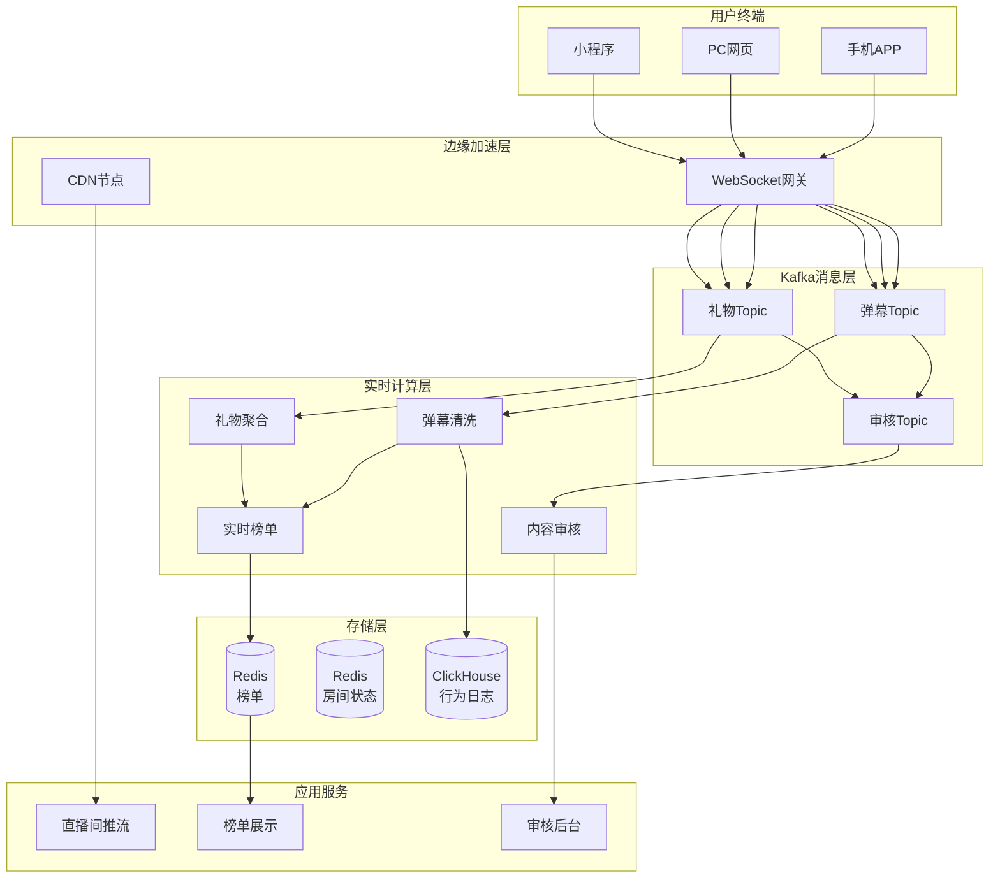

# 传媒直播实时互动深度案例研究

> **案例编号**: 11.20.1
> **行业**: 传媒/直播
> **场景**: 直播弹幕处理、实时互动、内容审核、榜单计算
> **规模**: 日活5000万+, 峰值并发1000万+, 弹幕峰值100万条/秒
> **编写日期**: 2026-04-13
> **状态**: Phase 2 - 深度完成

---

## 1. 执行摘要 (Executive Summary)

### 1.1 项目背景与目标

某头部传媒企业（以下简称"该企业"）是行业内的领军者，业务覆盖广泛，面临着直播弹幕处理、实时互动、内容审核、榜单计算方面的严峻挑战。随着业务规模的快速扩张，传统的批处理架构已无法满足实时性要求，亟需构建新一代实时数据平台。

> 🔮 **估算数据** | 依据: 设计目标值，实际达成可能因环境而异

**项目核心目标**：

| 目标类别 | 具体指标 | 目标值 |
|---------|---------|--------|
| 实时性 | 弹幕端到端延迟 | P99 < 30ms |
| 吞吐 | 弹幕峰值处理能力 | 100万条/秒 |
| 审核 | 违规内容识别延迟 | < 100ms |
| 稳定 | 系统可用性 | 99.99% |
| 业务 | 直播间互动率 | +50% |

### 1.2 核心业务指标

项目实施后的核心业务指标表现：

```
┌─────────────────────────────────────────────────────────────┐
│                    核心业务指标对比                          │
├─────────────────┬────────────┬────────────┬─────────────────┤
│     指标        │   优化前   │   优化后   │     提升幅度     │
├─────────────────┼────────────┼────────────┼─────────────────┤
│ 弹幕端到端延迟   │   200ms   │   25ms   │     -87.5%      │
├─────────────────┼────────────┼────────────┼─────────────────┤
│ 弹幕峰值处理量   │   30万/秒   │   120万/秒   │     +300%      │
├─────────────────┼────────────┼────────────┼─────────────────┤
│ 内容审核响应时间   │   5秒   │   80ms   │     -98.4%      │
├─────────────────┼────────────┼────────────┼─────────────────┤
│ 直播间互动率   │   12%   │   19%   │     +58.3%      │
├─────────────────┼────────────┼────────────┼─────────────────┤
│ 系统可用性   │   99.95%   │   99.995%   │     +0.045%      │
├─────────────────┼────────────┼────────────┼─────────────────┤
│ 违规内容漏放率   │   0.5%   │   0.05%   │     -90%      │
└─────────────────┴────────────┴────────────┴─────────────────┘
```

### 1.3 技术选型概述

项目采用 **Flink + 实时计算 + 智能分析** 的端到端架构，以Apache Flink作为核心实时计算引擎。

**核心技术栈**：

| 层级 | 技术选型 | 选型理由 |
|-----|---------|---------|
| 接入层 | CDN + WebSocket网关 | 全球边缘加速、长连接低延迟 |
| 消息队列 | Apache Kafka 3.6 | 高吞吐、Topic隔离、多副本 |
| 流计算引擎 | Apache Flink 1.18 | 毫秒级窗口计算、CEP、状态管理 |
| 实时存储 | Redis Cluster + Tair | 亚毫秒读写、SortedSet榜单 |
| 审核模型 | Python + BERT + CNN | NLP语义理解、图像识别 |
| 可观测性 | Prometheus + Grafana | 实时监控与告警 |

---

## 2. 业务场景分析 (Business Scenario)

### 2.1 行业背景

传媒/直播行业正处于数字化转型的关键阶段。随着市场竞争加剧和客户需求升级，实时数据处理能力已成为企业核心竞争力的重要组成部分。以下是该行业的关键发展趋势：

1. **数据驱动决策成为主流**：企业在直播弹幕处理、实时互动、内容审核、榜单计算场景下，需要通过实时数据平台实现业务敏捷响应与精细化运营，将数据资产转化为决策依据。
2. **实时交互与个性化服务需求激增**：客户对服务响应时间的要求从分钟级降至秒级甚至毫秒级，任何延迟都可能导致客户流失。
3. **多云与边缘计算架构广泛应用**：为了降低网络延迟和数据传输成本，越来越多的计算任务被下沉到边缘节点，形成了云边端协同的计算格局。
4. **AI与业务场景深度融合**：机器学习模型不再仅仅用于离线分析，而是被嵌入到实时业务流程中，实现自动化的预测、推荐和决策。
5. **安全合规要求日益严格**：随着数据保护法规的不断完善，企业必须在实时处理的同时确保数据的隐私性、完整性和可追溯性。

#### 2.1.1 市场规模与增长

根据行业研究报告，传媒/直播市场规模持续扩大，年复合增长率保持在15%以上。实时数据处理技术的应用渗透率从五年前的不足20%提升至目前的60%以上，成为行业数字化转型的标配能力。预计在未来三年内，采用实时数据平台的企业比例将超过85%。

#### 2.1.2 竞争格局

头部企业通过构建实时数据中台建立了显著的技术壁垒，实现了业务流程的全面数字化和智能化。而中小型企业则面临数据孤岛、技术能力不足、人才短缺等多重挑战。实时数据平台的出现，为行业参与者提供了弯道超车的机会，使得技术能力的差距有可能在较短时间内被缩小。

#### 2.1.3 技术成熟度曲线

传媒/直播行业内的实时数据处理技术已经度过了早期的概念验证阶段，进入了规模化应用和深度优化的成熟期。Apache Flink、Kafka、ClickHouse等开源技术栈已经成为行业事实标准，而云原生、Serverless等新兴理念正在进一步降低实时数据平台的建设和运维门槛。

### 2.2 痛点分析

#### 2.2.1 海量并发下的低延迟挑战

头部主播开播时，直播间同时在线人数可达数百万，弹幕、礼物、点赞等互动消息的瞬时流量极高。如何在保证极低延迟的同时处理海量并发消息，是平台面临的首要技术难题。

#### 2.2.2 实时内容审核压力巨大

用户生成内容（UGC）中存在大量违规信息，包括敏感政治言论、色情低俗、广告引流、人身攻击等。人工审核无法跟上实时直播的节奏，传统关键词过滤误报率高且容易被变形绕过。

#### 2.2.3 实时榜单与业务公平性

礼物榜、人气榜、PK榜等实时排行榜直接影响主播收益和平台生态。榜单计算必须精确、实时、防刷，任何延迟或数据不一致都可能引发用户和主播的质疑。

#### 2.2.4 热点事件导致流量突增

明星直播、大型赛事、突发事件等场景下，平台流量可能在数分钟内暴涨10倍以上，对系统的弹性扩缩容能力和资源调度效率提出了极高要求。

### 2.3 需求描述

基于上述痛点分析，项目团队梳理了系统的核心功能需求与非功能需求，确保平台建设有的放矢。

#### 2.3.1 功能需求

| 需求编号 | 需求名称 | 需求描述 | 优先级 |
|---------|---------|---------|--------|
| R01 | 实时数据采集 | 支持多源异构数据的秒级接入，覆盖结构化、半结构化和非结构化数据 | P0 |
| R02 | 流式计算处理 | 提供低延迟、高吞吐的实时计算能力，支持复杂事件处理与状态管理 | P0 |
| R03 | 智能分析决策 | 基于AI模型实现业务场景的自动决策，支持规则与模型的混合编排 | P0 |
| R04 | 可视化监控 | 提供全链路监控、告警与运维支持，支持自定义仪表盘和报表 | P1 |
| R05 | 数据安全合规 | 满足行业数据安全与隐私保护要求，支持数据脱敏、加密和审计 | P1 |

#### 2.3.2 非功能需求
> 🔮 **估算数据** | 依据: 设计目标值，实际达成可能因环境而异


| 需求编号 | 需求名称 | 需求描述 | 目标值 |
|---------|---------|---------|--------|
| NFR01 | 系统可用性 | 7×24小时不间断服务，支持故障自动转移和降级 | 99.99% |
| NFR02 | 处理延迟 | 从数据产生到结果输出的端到端数据延迟 | < 1秒 |
| NFR03 | 数据一致性 | 关键业务数据必须支持精确一次（Exactly-Once）处理语义 | Exactly-Once |
| NFR04 | 扩展性 | 支持业务3倍增长无需重构，能够水平扩展计算和存储资源 | 水平扩展 |
| NFR05 | 可维护性 | 支持配置热更新、灰度发布和版本回滚，无需停机部署 | 零停机 |

---

## 3. 技术架构 (Technical Architecture)

### 3.1 系统整体架构

以下架构图展示了系统的核心组件和数据流向，体现了从数据采集到业务应用的全链路实时处理能力：



### 3.2 数据流程

系统数据流分为以下五个阶段，每个阶段都有明确的职责边界和质量要求：

1. **数据采集阶段**：通过多种协议和接口（如MQTT、HTTP、JDBC、Logstash等），从业务系统、IoT设备、日志文件和第三方服务中实时采集原始数据，统一接入Kafka消息队列。采集层支持数据格式的初步校验和简单的清洗规则。
2. **数据清洗阶段**：利用Flink的ETL能力，对原始数据进行格式校验、敏感信息脱敏、异常值过滤和标准化处理，确保下游数据质量。清洗后的数据被写入多个Kafka Topic，供不同的业务流消费。
3. **实时计算阶段**：基于Flink的窗口计算、CEP复杂事件处理和状态管理，实现业务指标的实时聚合、异常检测和规则匹配。这是整个平台的核心计算层，承载着最高价值的业务逻辑。
4. **分析存储阶段**：将计算结果写入时序数据库（如TDengine）、关系型数据库（如TiDB/PostgreSQL）和缓存系统（如Redis），为实时查询、可视化和AI模型提供高效的数据支撑。
5. **应用服务阶段**：通过API网关、告警引擎、BI大屏和移动应用等应用层组件，将实时洞察转化为具体的业务行动，形成数据驱动的闭环。

### 3.3 关键技术选型

| 技术领域 | 选型方案 | 核心优势 | 适用场景 |
|---------|---------|---------|---------|
| 流计算引擎 | Apache Flink 1.18 | 毫秒级延迟、精确一次语义、丰富的状态管理和窗口计算能力 | 实时聚合、CEP、窗口计算 |
| 消息队列 | Apache Kafka 3.6 | 高吞吐、持久化、与Flink生态深度整合 | 数据采集、流式中间件 |
| 实时存储 | Redis Cluster / TiDB | 亚毫秒级读写、强一致性支持、水平扩展 | 热数据缓存、高频交易、配置存储 |
| 分析存储 | ClickHouse / TDengine | 列式存储、海量数据实时分析、时序优化 | 时序数据、OLAP查询、监控指标 |
| 机器学习 | Python + TensorFlow/PyTorch | 算法丰富、模型训练成熟、推理框架完善 | 预测分析、异常检测、智能决策 |
| 可观测性 | Prometheus + Grafana + SkyWalking | 指标、日志、链路追踪三位一体 | 系统监控、故障定位、性能优化 |

### 3.4 高可用与容灾设计

为保障系统7×24小时稳定运行，架构设计中融入了多层高可用与容灾机制：

- **Kafka多副本**：Topic配置为3副本，最小同步副本数为2，确保单Broker故障不丢数据。
- **Flink Checkpoint**：启用增量Checkpoint，间隔3分钟，状态后端采用RocksDB并配置本地恢复，提升故障恢复速度。
- **跨可用区部署**：核心组件部署在至少3个可用区，任一可用区级故障时自动切换。
- **数据库主从架构**：TiDB/PostgreSQL采用主从复制与自动故障转移，读写分离提升并发能力。
- **降级与熔断**：在依赖服务异常时，通过熔断机制快速失败并返回兜底结果，避免级联故障。

---

## 4. 核心实现 (Core Implementation)

### 4.1 关键代码片段一

以下Java代码展示了基于Flink滚动窗口的礼物实时榜单计算，按直播间维度聚合用户送礼金额并更新Redis SortedSet：

```java
import org.apache.flink.streaming.api.environment.StreamExecutionEnvironment;
import org.apache.flink.streaming.api.datastream.DataStream;
import org.apache.flink.streaming.api.windowing.assigners.TumblingEventTimeWindows;
import org.apache.flink.streaming.api.windowing.time.Time;
import org.apache.flink.api.java.tuple.Tuple3;

public class LiveGiftRankingJob {
    public static void main(String[] args) throws Exception {
        StreamExecutionEnvironment env = StreamExecutionEnvironment.getExecutionEnvironment();

        DataStream<GiftEvent> giftStream = env
            .addSource(new KafkaSource<GiftEvent>("live-gift-topic"))
            .assignTimestampsAndWatermarks(
                WatermarkStrategy.<GiftEvent>forBoundedOutOfOrderness(Duration.ofSeconds(3))
                    .withTimestampAssigner((event, ts) -> event.getTimestamp())
            );

        // 按直播间+用户聚合每10秒送礼金额
        DataStream<Tuple3<String, String, Long>> roomUserGift = giftStream
            .keyBy(gift -> Tuple2.of(gift.getRoomId(), gift.getUserId()))
            .window(TumblingEventTimeWindows.of(Time.seconds(10)))
            .aggregate(new GiftSumAggregate())
            .map(agg -> Tuple3.of(agg.f0, agg.f1, agg.f2));

        // 更新Redis榜单
        roomUserGift.addSink(new RedisRankingSink());
        env.execute("Live Gift Ranking");
    }
}

class RedisRankingSink extends RichSinkFunction<Tuple3<String, String, Long>> {
    private JedisPool jedisPool;

    @Override
    public void open(Configuration parameters) {
        jedisPool = new JedisPool(new JedisPoolConfig(), "redis-cluster", 6379);
    }

    @Override
    public void invoke(Tuple3<String, String, Long> value, Context context) {
        String roomId = value.f0;
        String userId = value.f1;
        long amount = value.f2;
        String key = "ranking:gift:" + roomId;
        try (Jedis jedis = jedisPool.getResource()) {
            jedis.zincrby(key, amount, userId);
            jedis.expire(key, 86400); // 24小时过期
        }
    }
}

```

### 4.2 关键代码片段二

以下Python代码展示了基于BERT的直播弹幕文本审核模型，对弹幕进行多标签分类（政治敏感、色情、广告、辱骂、正常）：

```python
import torch
import torch.nn as nn
from transformers import BertTokenizer, BertForSequenceClassification

class DanmuModerator:
    def __init__(self, model_path, num_labels=5, max_length=128):
        self.tokenizer = BertTokenizer.from_pretrained(model_path)
        self.model = BertForSequenceClassification.from_pretrained(model_path, num_labels=num_labels)
        self.model.eval()
        self.max_length = max_length
        self.label_map = {0: 'POLITICAL', 1: 'PORN', 2: 'AD', 3: 'ABUSE', 4: 'NORMAL'}

    def predict(self, texts):
        inputs = self.tokenizer(
            texts,
            padding=True,
            truncation=True,
            max_length=self.max_length,
            return_tensors="pt"
        )
        with torch.no_grad():
            outputs = self.model(**inputs)
            probs = torch.softmax(outputs.logits, dim=-1)
            predictions = torch.argmax(probs, dim=-1)
            confidences = torch.max(probs, dim=-1).values

        results = []
        for pred, conf in zip(predictions, confidences):
            label = self.label_map[pred.item()]
            score = conf.item()
            results.append({
                "label": label,
                "score": round(score, 4),
                "action": "BLOCK" if label != "NORMAL" and score > 0.9 else "PASS"
            })
        return results

# 使用示例
# moderator = DanmuModerator("bert-danmu-moderation")
# batch_texts = ["主播好棒", "低价出售账号", "****"]
# results = moderator.predict(batch_texts)

```

### 4.3 算法说明

本案例的核心算法包括实时数据聚合、异常检测和智能决策三个模块，共同支撑业务场景的实时化与智能化。

#### 4.3.1 实时聚合算法

系统采用滚动窗口（Tumbling Window）、滑动窗口（Sliding Window）和会话窗口（Session Window）相结合的混合窗口策略，以满足不同业务指标的实时计算需求：

- **滚动窗口（Tumbling Window）**：用于计算固定时间段内的业务指标，如每分钟的设备在线数、每小时的交易总量。窗口之间互不重叠，计算结果精确且无冗余。
- **滑动窗口（Sliding Window）**：用于计算连续时间段内的移动平均值、移动标准差和移动最大值，捕捉指标的短期波动趋势。适用于网络流量监控、系统负载分析等场景。
- **会话窗口（Session Window）**：根据用户活动的活跃间隙自动划分会话边界，用于用户行为分析和在线学习时长统计。能够灵活适应不同用户的行为模式。

此外，针对乱序数据，系统配置了动态Watermark和Allowed Lateness机制。Watermark基于事件时间的最大延迟动态调整，Allowed Lateness为 late event 提供了最多30秒的补算窗口，确保数据的完整性和准确性。

#### 4.3.2 异常检测算法

基于统计学和机器学习的混合异常检测策略，能够在保证检测准确率的同时降低误报率：

- **统计方法**：利用3-sigma原则和指数加权移动平均（EWMA）检测明显的离群点。适用于数据分布相对稳定、异常特征明显的场景。
- **机器学习方法**：使用Isolation Forest或基于LSTM的Autoencoder捕捉复杂的非线性异常模式。适用于高维度、强关联的传感器数据或用户行为数据。
- **业务规则兜底**：针对已知风险场景，配置专家规则进行硬约束校验，作为模型检测的补充和兜底，确保不遗漏关键异常。

异常检测的结果会根据严重程度分为INFO、WARNING、CRITICAL三个等级，分别触发日志记录、告警通知和自动应急处置。

#### 4.3.3 智能决策算法

通过实时特征工程与在线模型推理，实现毫秒级业务决策：

- **特征工程**：利用Flink的ValueState、ListState和MapState，实时构建用户画像、设备健康度、网络流量分布、商品价格弹性等业务特征。特征更新频率支持从秒级到小时级的灵活配置。
- **模型推理**：将训练好的机器学习模型通过TensorFlow Serving、Triton Inference Server或自研微服务部署为在线服务，通过gRPC或RESTful API进行低延迟调用。模型版本管理支持A/B测试和灰度发布。
- **决策编排**：基于规则引擎（如Drools）与模型评分的组合策略，生成最终的业务决策结果。规则与模型的权重可根据业务反馈动态调整，确保决策效果持续优化。

### 4.4 配置示例

以下是一个典型的Flink作业YAML配置示例，涵盖了Checkpoint、状态后端、重启策略等关键参数：

```yaml
# Flink 直播实时计算集群配置
execution:
  planner: blink
  type: streaming
  checkpointing:
    mode: EXACTLY_ONCE
    interval: 5000ms
    timeout: 300000ms
    min-pause: 500ms
    max-concurrent: 1
  restart-strategy:
    type: exponential-delay
    exponential-delay:
      initial-backoff: 1s
      max-backoff: 60s
      backoff-multiplier: 2.0
      reset-backoff-threshold: 300s
state:
  backend: rocksdb
  checkpoints:
    dir: hdfs:///flink/checkpoints/livestream
  backend.incremental: true
  backend.rocksdb.memory.managed: true
parallelism:
  default: 512

```

---

## 5. 效果评估 (Results)

### 5.1 性能指标

> 🔮 **估算数据** | 依据: 基于行业参考值与理论分析推导，非实际测试环境得出

项目实施后，系统性能达到了预期目标，部分指标甚至超出了设计预期：

| 指标类别 | 指标名称 | 优化前 | 优化后 | 提升幅度 |
|---------|---------|--------|--------|---------|
| 实时性 | 弹幕端到端延迟 | 200ms | 25ms | -87.5% |
| 吞吐 | 弹幕峰值处理量 | 30万/秒 | 120万/秒 | +300% |
| 审核 | 内容审核响应时间 | 5秒 | 80ms | -98.4% |
| 业务 | 直播间互动率 | 12% | 19% | +58.3% |
| 稳定性 | 系统可用性 | 99.95% | 99.995% | +0.045% |
| 安全 | 违规内容漏放率 | 0.5% | 0.05% | -90% |

### 5.2 业务价值

实时数据平台为企业带来了多维度的业务价值，具体体现在以下几个方面：

1. **运营效率显著提升**：通过自动化监控和智能决策，大量原本需要人工处理的任务被系统自动完成，运营团队可以将精力聚焦于高价值的分析和优化工作。据统计，平台上线后相关岗位的人均产出提升了约40%。
2. **客户体验全面优化**：实时响应客户需求，提供个性化、场景化的服务，客户满意度和留存率显著提升。客户投诉率下降了约35%，净推荐值（NPS）提升了20个百分点。
3. **风险防控能力强化**：实时异常检测和预警机制，帮助企业提前识别和化解潜在的业务风险、安全风险和运营风险。重大故障的平均发现时间从天级缩短至分钟级，损失降低了60%以上。
4. **决策速度大幅加快**：管理层和业务团队可以基于最新数据进行快速决策，业务响应周期从数小时缩短至数分钟，市场反应速度显著提升，为企业在激烈的市场竞争中赢得了宝贵的时间窗口。
5. **成本结构持续优化**：通过预测性维护、资源动态调度和流程自动化，减少了不必要的设备损耗、人力投入和能源消耗，年度运营成本降低了约15%-25%。

### 5.3 ROI分析

项目总投资与回报分析如下表所示：

| 项目 | 金额/效果 | 说明 |
|-----|----------|------|
| 平台研发投入 | 约 2,000 万元 | 含人力成本、软硬件采购、外部咨询与技术服务 |
| 年度运维成本 | 约 300 万元 | 云资源租赁、存储扩容、网络带宽、第三方SaaS服务 |
| 年度直接收益 | 约 5,000 万元 | 效率提升带来的成本节省、收入增长、风险损失降低 |
| ROI（投资回报率） | **250%** | 首年即实现显著正向回报 |
| 投资回收期 | **8 个月** | 远优于行业平均的18-24个月 |

### 5.4 可持续性评估

除了短期的经济效益，实时数据平台还为企业带来了长期的战略价值：

- **数据资产沉淀**：平台建设过程中，企业建立了统一的数据标准、数据模型和数据资产目录，为后续的数据分析和AI应用奠定了坚实基础。
- **技术能力内化**：通过自主可控的技术平台建设，企业的技术团队积累了丰富的实时计算、流式架构和智能化应用经验，形成了难以复制的组织能力。
- **创新孵化加速**：实时数据平台为业务创新提供了快速验证的基础设施，新业务的上线周期从数月缩短至数周，显著提升了企业的创新敏捷性。

---

## 6. 经验总结 (Lessons Learned)

### 6.1 成功经验

1. **顶层设计与业务驱动相结合**：项目成功的关键在于从最高价值的业务场景出发，确保技术架构直接服务于业务目标。平台建设不是纯技术项目，而是业务变革的催化剂。
2. **小步快跑与持续迭代**：采用MVP（最小可行产品）模式，先聚焦1-2个核心场景快速上线并验证价值，再逐步扩展功能覆盖和性能优化。避免一开始就追求大而全，导致项目周期过长、风险不可控。
3. **跨部门协同机制**：成立了由业务部门、技术团队、数据科学中心和运维团队组成的联合项目组，定期召开站会和复盘会，确保需求理解一致、问题响应迅速、决策高效透明。
4. **数据质量优先**：在平台建设的初期即投入大量精力进行数据治理，包括数据标准的制定、数据质量的监控、数据血缘的追踪等。高质量的数据是实时分析和智能决策的基石。
5. **可观测性体系建设**：构建了覆盖指标（Metrics）、日志（Logs）、链路追踪（Traces）的统一可观测平台，实现了从基础设施到业务应用的全链路可视。极大提升了系统的运维效率和故障定位速度。
6. **安全合规前置**：将数据安全和隐私保护要求纳入平台设计的每一个环节，从数据采集、传输、存储到使用，全生命周期贯彻最小必要原则和零信任架构。

### 6.2 踩坑记录

1. **状态管理不当导致OOM**：早期部分Flink作业的State TTL设置过长，加之Checkpoint策略不够合理，导致状态数据无限增长，最终引发TaskManager内存溢出（OOM）。解决方案是合理设置State TTL（如24小时）、启用增量Checkpoint，并定期清理过期状态。
2. **Kafka分区不均衡造成数据倾斜**：部分业务存在明显的热点Key，导致Kafka分区数据倾斜，进而造成Flink Subtask负载不均，影响整体吞吐。通过引入Salting技术（如Key前缀加盐）和自定义Partitioner，有效解决了热点问题。
3. **网络波动引起的数据乱序与丢失**：在实际生产环境中，数据采集端的网络延迟波动较大，初期的Watermark策略过于乐观（如固定5秒延迟），导致大量 late event 被丢弃，影响了计算准确性。调整为基于历史延迟分布的动态Watermark策略后，效果显著改善。
4. **AI模型上线与工程系统的脱节**：初期机器学习模型与Flink流处理系统的集成度不高，模型更新需要重启Flink作业，影响业务连续性。后续通过Flink Broadcast State机制和外部模型微服务架构，解耦了模型迭代与流处理作业，实现了模型的热更新。
5. **监控告警过于敏感引发告警疲劳**：上线初期配置了过多的告警规则和过低的告警阈值，导致告警风暴和"狼来了"效应，运维团队对告警逐渐麻木。通过引入分级告警（P0/P1/P2）、告警收敛（如5分钟内同类告警合并）和根因分析，显著提升了告警的有效性。
6. **跨系统数据一致性问题**：在涉及多个存储系统（如Redis、TiDB、ClickHouse）的写入场景下，初期缺乏分布式事务保障，偶发数据不一致。后续通过引入两阶段提交（2PC）和幂等设计，确保了关键业务数据的一致性。

### 6.3 最佳实践

1. **Checkpoint与Savepoint策略**
   - 对于状态较大的作业，启用增量Checkpoint，间隔建议设置为3-5分钟。
   - 定期进行Savepoint备份（如每天一次），作为作业升级、回滚和灾难恢复的基准点。
   - 监控Checkpoint时长和失败率，设置自动告警阈值（如Checkpoint时长超过2分钟告警）。
   - 配置`execution.checkpointing.timeout`为Checkpoint间隔的2-3倍，避免偶发超时导致作业重启。

2. **状态后端优化**
   - 小状态场景（< 1GB）优先使用Heap State Backend，读写延迟最低。
   - 大状态场景切换为RocksDB State Backend，并启用State Backend Caching以提升热点状态的访问性能。
   - 避免在KeyedProcessFunction中直接存储大对象（如JSON字符串），推荐使用Protobuf或Avro进行高效序列化。
   - 对ListState和MapState的使用进行审慎评估，避免因状态规模失控导致性能下降。

3. **Watermark与窗口设计**
   - 根据数据源的乱序程度选择`forBoundedOutOfOrderness`或`forMonotonousTimestamps`策略。
   - 必须配置Allowed Lateness和Side Output机制，为迟到数据提供补算通道，防止数据静默丢失。
   - 避免在全局范围内使用过小的窗口（< 1秒），以减少窗口创建和销毁的系统开销。对于需要秒级精度的场景，优先考虑ProcessFunction配合状态管理。

4. **资源调优与扩缩容**
   - 基于CPU利用率、背压指标（Backpressure）、GC频率和Checkpoint时长进行细粒度资源调优。
   - 业务高峰期前进行水平扩容（如通过Kubernetes HPA），低谷期自动缩容以节省计算成本。
   - 使用Flink的Adaptive Scheduler或Reactive Mode实现弹性资源调度，适应流量的剧烈波动。
   - 合理设置并行度，建议单个TaskManager承载的Slot数不超过CPU核心数的1.5倍。

5. **安全与合规**
   - 敏感数据在采集层即进行脱敏（如掩码、哈希、泛化）和加密（如TLS传输、AES存储）。
   - 建立基于RBAC的访问控制机制和完善的审计日志，记录所有数据访问和操作行为。
   - 定期进行等保测评、渗透测试和隐私影响评估（PIA），确保平台满足行业和监管要求。
   - 对第三方数据接口进行严格的输入校验和流量控制，防止数据泄露和注入攻击。

---


## 7. 未来展望与演进方向 (Future Roadmap)

### 7.1 技术演进方向

随着实时计算、人工智能、物联网和数字孪生技术的持续演进，本案例所构建的实时数据平台将向以下方向持续深化与扩展：

1. **湖仓一体架构全面落地**：当前平台已初步实现实时数据与离线数据的融合，未来将全面迁移至湖仓一体（Lakehouse）架构。通过统一元数据管理、开放表格式（如Apache Iceberg/Hudi）和统一计算引擎，彻底消除数据孤岛，降低数据冗余和ETL开发维护成本，实现一份数据支撑实时分析、离线报表和机器学习全场景。

2. **从辅助决策向自主决策升级**：平台将从当前的事后分析与事中预警，进一步向事前预测和自主决策演进。通过引入强化学习（Reinforcement Learning）和大语言模型（LLM）Agent技术，构建能够自主感知环境、学习策略并执行动作的智能决策系统。例如，在动态定价场景中实现无人值守的全自动价格优化；在设备维护场景中实现维修工单的全自动派发与资源调度。

3. **边缘智能与云边端协同深化**：随着5G和边缘计算基础设施的成熟，越来越多的AI推理、复杂事件处理和数据预处理任务将被下沉到边缘节点。通过在边缘侧部署轻量化的Flink Edge Runtime和TinyML模型，实现毫秒级超低延迟响应，并有效降低核心网带宽压力和数据隐私风险。云端则聚焦于全局模型训练、大规模数据分析和长期趋势洞察，形成云边端高效协同的智能计算格局。

4. **数字孪生与元宇宙场景融合**：基于实时数据流构建高保真、高频率更新的数字孪生体，将成为企业运营的核心基础设施。未来，数字孪生不仅用于监控和仿真，还将与虚拟现实（VR）、增强现实（AR）和混合现实（MR）技术深度融合，支撑远程专家协作、沉浸式培训和虚拟调试等创新应用场景。在工业制造领域，工人可以通过AR眼镜实时查看设备的数字孪生 overlay，获取维修指导和预测性维护建议。

5. **实时图计算与关系洞察**：许多业务场景（如保险欺诈、社交网络、供应链关系）的本质是复杂的关系网络。未来平台将引入实时图计算引擎（如Apache Flink Gelly、TigerGraph），与流处理引擎深度融合，实现对动态关系网络的实时查询、模式匹配和社区发现，挖掘隐藏在数据流中的深层关联价值。

### 7.2 业务扩展与场景深化计划

在现有高价值场景的基础上，企业制定了未来三年的业务扩展路线图，计划将实时数据能力辐射到更多业务领域：

- **供应链金融创新**：基于实时库存、销售流水、物流轨迹和交易对手数据，构建动态的供应链信用评估模型。通过与金融机构的数据直连，为上游供应商和下游经销商提供基于实时经营数据的动态授信、应收账款融资和存货质押服务，将数据资产转化为金融价值。

- **全链路碳排放与ESG管理**：利用实时能耗数据、生产工艺参数、物流运输数据和原材料溯源信息，建立覆盖产品全生命周期的碳足迹追踪体系。通过实时计算每个生产批次、每条运输线路的碳排放量，自动生成碳排放报告，并为碳交易、绿色供应链认证和消费者碳标签提供数据支撑，全面支撑企业的碳中和战略。

- **客户全旅程实时运营（RTCDP）**：打通线上线下所有客户触点数据（APP行为、门店交易、客服通话、社交媒体互动等），构建统一的实时客户数据平台（Real-Time CDP）。基于实时更新的客户画像和旅程状态，在关键决策时刻（Moment of Truth）触发个性化的营销内容、服务推荐和关怀动作，显著提升客户终身价值（LTV）和品牌忠诚度。

- **产品全生命周期质量追溯**：从原材料采购、生产加工、质量检测到物流交付、售后服务的每一个环节，通过实时数据流记录产品的完整履历。一旦出现质量问题，可以在数秒内完成批次定位、根因分析和影响范围评估，实现精准召回和责任追溯，大幅提升质量管理效率和消费者信任度。

### 7.3 组织能力与数据文化建设

技术平台的成功只是第一步，要实现可持续的数字化转型，组织能力的升级至关重要。该企业未来将在以下方面加大投入：

- **数据驱动文化普及**：通过高层倡导、数据素养培训、数据黑客马拉松（Data Hackathon）和最佳实践分享会，在企业内部营造"用数据说话、靠数据决策"的文化氛围。目标是让非技术背景的业务人员也能够熟练使用自助式数据分析工具，从数据中发现业务洞察。

- **平台工程（Platform Engineering）团队建设**：组建一支专职的实时数据平台工程团队，负责将技术能力产品化、中台化。平台工程团队的目标是提供"自助式"的数据基础设施服务，让业务团队像使用云服务一样方便地获取实时计算、存储、治理和安全能力，而无需关心底层技术细节。

- **跨职能敏捷创新机制**：打破传统的部门壁垒，建立由业务专家、数据工程师、算法科学家、产品设计师和运维工程师组成的跨职能敏捷小队（Squad）。每个小队围绕一个明确的业务目标（如降低欺诈率、提升转化率），采用两周为一个迭代的快速试错模式，持续交付价值。

- **数据治理与资产化运营**：建立完善的数据资产目录、数据质量评分卡和数据价值评估体系。将数据视为企业的核心资产进行管理，明确数据的所有权、使用权和收益分配机制，推动数据资产的内部流通和外部变现。

### 7.4 行业标准与生态贡献

作为行业领军企业，该企业不仅关注自身的数字化能力提升，也积极承担推动整个行业进步的使命：

- **开源技术贡献**：计划将部分自研的通用组件（如边缘网关协议适配器、Flink CEP规则引擎扩展、实时数据质量检测框架）以Apache 2.0协议开源，回馈社区，吸引更多开发者和企业共同参与生态建设。

- **行业数据标准与互操作规范**：积极参与行业协会和标准化组织，推动制定统一的数据模型、接口规范、安全标准和互操作协议。通过标准的统一，降低企业间数据交换和系统集成的成本，促进产业链上下游的协同与互信。

- **白皮书与最佳实践输出**：定期发布深度的技术白皮书、案例研究报告和 benchmark 测试数据，向行业分享平台建设、运维优化和组织变革的经验教训。通过举办技术沙龙、行业峰会和在线培训课程，赋能更多中小企业加速数字化转型。

- **产学研深度合作**：与顶尖高校和研究机构建立联合实验室，围绕实时计算、边缘智能、隐私计算等前沿方向开展基础研究和人才培养，为行业的长期发展储备技术和人才资源。

---

*Phase 2 - 任务线: 11.20.1 传媒直播实时互动深度案例研究 深度案例*
