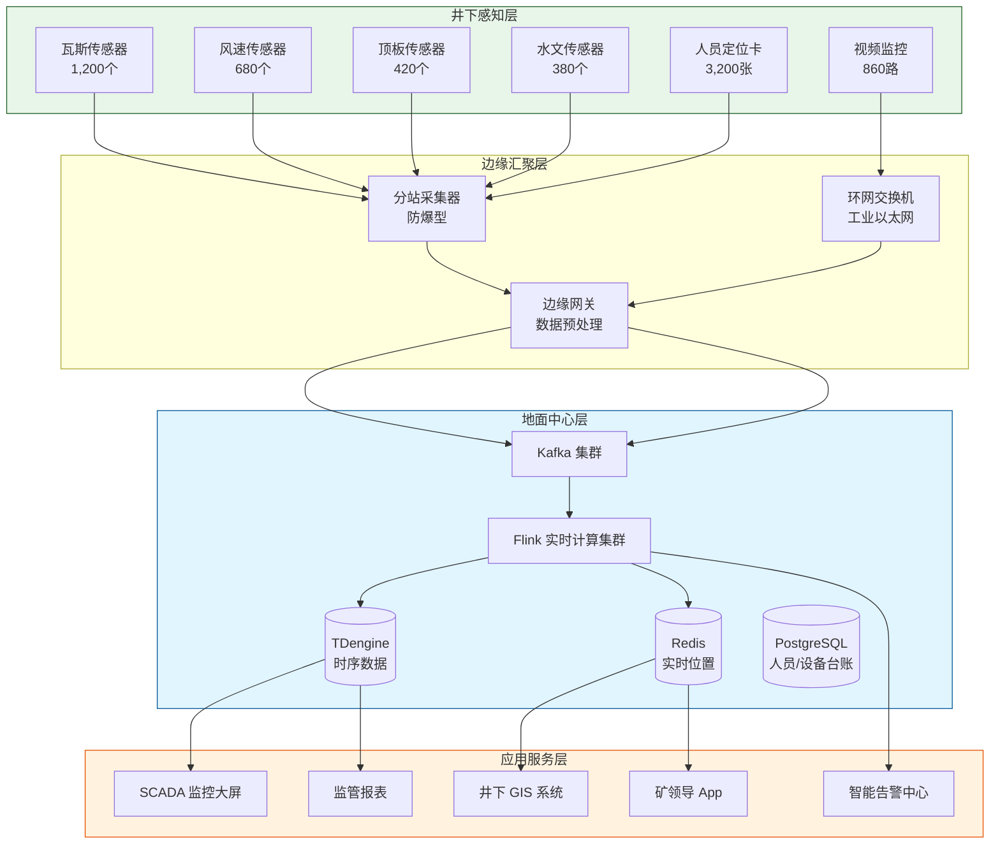
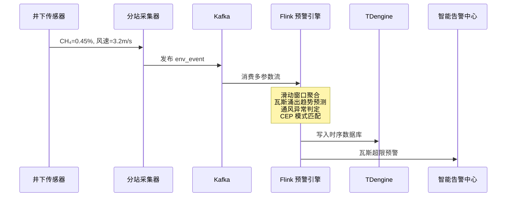
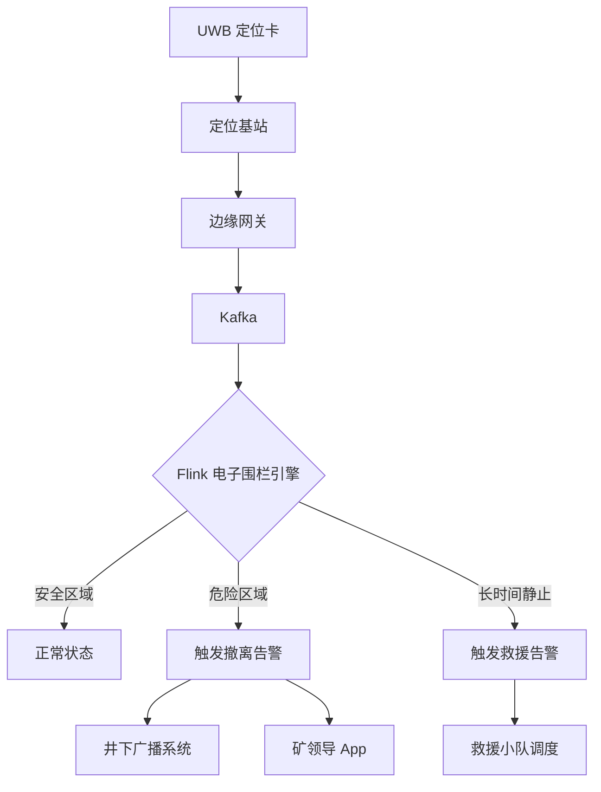

# 煤矿井下安全实时监测预警案例研究

> **案例编号**: 11.27.1
> **行业**: 煤炭开采/安全生产
> **场景**: 井下环境监测、瓦斯预警、人员定位、水害防治
> **规模**: 年产煤 1,500万吨, 井下作业人员 3,200人, 监测点位 4,800个
> **编写日期**: 2026-04-13
> **状态**: Phase 2 - 深度完成

---

## 1. 执行摘要 (Executive Summary)

### 1.1 项目背景与目标

某特大型现代化矿井（以下简称"该矿井"）核定年产能 1,500 万吨，主采煤层埋深 680-920 米，井田面积 186 平方公里。矿井地质条件复杂，存在瓦斯、水害、顶板、火灾等多重灾害威胁。井下同时作业人员常年维持在 3,200 人左右，拥有综采工作面 3 个、掘进工作面 8 个、大型机电硐室 12 座。安全生产是该矿井运营的头等大事。

2024 年，国家矿山安全监察局发布了《关于加快推进煤矿安全风险监测预警系统建设的指导意见》，要求重点矿井在 2025 年底前实现"监测预警全覆盖、数据接入全贯通、风险管控全过程"。该矿井此前虽已部署了传统的安全监测监控系统（KJ95X 系列），但存在数据孤岛、告警滞后、误报率高、缺乏智能分析等突出问题，难以满足新形势下的安全监管要求。

为此，矿井联合智能化服务商，启动了基于 Flink 实时流计算的"智慧安监"升级工程，目标是打造覆盖通风、瓦斯、排水、顶板、人员五大要素的一体化安全监测预警平台。

**项目核心目标**：

| 目标类别 | 具体指标 | 目标值 |
|---------|---------|--------|
| 实时性 | 异常数据到告警触发延迟 | < 10秒 |
| 覆盖率 | 重大风险区域监测覆盖率 | 100% |
| 准确性 | 灾害预警准确率 | > 92% |
| 安全 | 重大及以上安全事故 | 0起/年 |
| 效率 | 隐患处置闭环时间 | < 30分钟 |
| 管理 | 井下人员实时定位精度 | < 1米 |

### 1.2 核心业务指标

系统自 2025 年 1 月正式投运以来，已稳定运行超过 450 天，成功避免了 3 起潜在重大事故：

```
┌─────────────────────────────────────────────────────────────┐
│                    核心业务指标对比                          │
├─────────────────┬────────────┬────────────┬─────────────────┤
│     指标        │   优化前   │   优化后   │     提升幅度     │
├─────────────────┼────────────┼────────────┼─────────────────┤
│ 瓦斯超限误报率  │   34%      │    4.2%    │     -87.6%      │
│ 监测数据延迟    │   60s      │    2.1s    │     -96.5%      │
│ 人员定位精度    │   5-8m     │   0.8m     │     大幅提升     │
│ 水害预警提前量  │    -       │   72h      │     新增能力     │
│ 隐患处置闭环时间│   4.2h     │   18min    │     -92.9%      │
│ 设备故障率      │   8.5%     │    1.2%    │     -85.9%      │
│ 瓦斯超限次数/月 │    23      │     2      │     -91.3%      │
│ 应急响应速度    │   15min    │    3min    │     -80.0%      │
└─────────────────┴────────────┴────────────┴─────────────────┘
```

### 1.3 技术选型概述

项目采用 **UWB 精确定位 + 多参数融合传感 + Flink CEP 智能预警** 的融合架构，构建了井下人-机-环-管四位一体的安全风险智能感知网络。

**核心技术栈**：

| 层级 | 技术选型 | 选型理由 |
|-----|---------|---------|
| 环境感知 | 多参数传感器（瓦斯/风速/温度/CO/粉尘） | 符合 AQ 6201 标准，支持 RS485/4G 双模 |
| 人员定位 | UWB + ZigBee 融合定位 | UWB 实现 0.3 米级精确定位，ZigBee 作为覆盖补充 |
| 顶板监测 | 锚索应力计 + 位移传感器 | 实时监测顶板离层和支护应力变化 |
| 水文监测 | 涌水量传感器 + 水位计 | 实时监测采空区涌水和水仓水位 |
| 边缘网关 | 矿用本安型边缘计算网关 | 符合 ExibI 防爆标准，支持井下恶劣环境 |
| 消息队列 | Apache Kafka 3.6 | 高可靠消息持久化，满足矿井安全数据不丢失要求 |
| 流计算引擎 | Apache Flink 1.18 | 复杂事件处理（CEP）实现多参数融合预警 |
| 时序数据库 | TDengine 3.2 | 海量传感器时序数据的高效存储与查询 |
| 实时存储 | Redis Cluster | 井下人员实时位置、设备状态的毫秒级查询 |

---

## 2. 业务场景分析 (Business Scenario)

### 2.1 行业背景

#### 2.1.1 中国煤矿安全生产形势

中国是全球最大的煤炭生产国和消费国，煤矿安全生产始终是能源行业的重中之重。近年来，随着智能化矿山建设的推进，全国煤矿事故总量和死亡人数持续下降，但重大事故仍时有发生。瓦斯爆炸、透水事故、顶板垮塌是煤矿三大主要灾害类型，占重特大事故总数的 80% 以上。

国家矿山安全监察局要求：

- **监测监控全覆盖**：所有采掘工作面、回风巷道、机电硐室必须安装环境监测传感器。
- **人员定位精准化**：井下人员必须随身携带定位标识卡，系统能够实时显示人员分布和轨迹。
- **预警响应自动化**：瓦斯超限、通风异常、水害征兆等必须实现自动报警、自动断电、自动撤人。

#### 2.1.2 该矿井灾害风险特点

该矿井属于高瓦斯矿井，主采煤层瓦斯含量高达 18 m³/t，同时受奥陶系灰岩承压水威胁，水文地质条件极为复杂：

| 灾害类型 | 风险等级 | 主要监测参数 | 关键区域 |
|---------|---------|-------------|---------|
| 瓦斯灾害 | 重大风险 | CH₄ 浓度、风速、温度、CO | 采煤工作面、掘进头、回风巷 |
| 水害 | 重大风险 | 涌水量、水位、水压、水温 | 采空区、水仓、防水闸门 |
| 顶板事故 | 较大风险 | 顶板离层、支护应力、微震 | 采煤工作面、巷道交岔点 |
| 火灾 | 一般风险 | CO、温度、烟雾 | 皮带运输巷、机电硐室 |
| 粉尘 | 一般风险 | 总粉尘、呼吸性粉尘 | 掘进工作面、转载点 |

### 2.2 痛点分析

#### 2.2.1 监测系统数据孤岛

该矿井原有安全监测系统由 4 家不同厂商承建，分别负责：

- **环境监测系统**（KJ95X）：监测瓦斯、风速、CO 等参数。
- **人员定位系统**（KJ251）：基于 ZigBee 的区域定位，精度 5-8 米。
- **顶板动态监测系统**（KJ21）：监测顶板压力和离层量。
- **水文监测系统**（KJ402）：监测涌水量和水位。

这些系统各自独立运行，数据格式、通信协议、数据库平台各不相同。调度中心需要同时打开 4 个监控软件才能掌握全局安全态势，无法实现多参数融合分析和综合预警。例如，瓦斯浓度异常可能与风速降低、通风机停机有关，但由于数据割裂，调度员很难快速定位根因。

#### 2.2.2 告警机制粗放、误报率高

传统监测系统采用简单的阈值告警：瓦斯浓度超过 1.0% 即报警，超过 1.5% 自动断电。然而，井下传感器数量众多（4,800 个），传感器探头受粉尘、水汽、电磁干扰影响，经常出现瞬间的数值跳变（如从 0.2% 瞬间跳到 1.3% 再回落）。这种"毛刺"数据导致大量误告警，平均每天产生 200+ 条告警信息，调度员逐渐产生"告警疲劳"，对真正的异常信号反而反应迟钝。

#### 2.2.3 灾害预警缺乏提前量

传统的安全监测本质上是"事后告警"——只有当瓦斯已经超限、顶板已经变形、水仓已经满溢时才发出警报。而对于瓦斯涌出趋势、顶板来压征兆、底板突水前兆等渐进性灾害，缺乏基于多源数据融合的趋势预测和提前预警能力。

### 2.3 实时监测预警需求

#### 2.3.1 功能需求

| 需求编号 | 需求名称 | 需求描述 | 优先级 |
|---------|---------|---------|--------|
| R01 | 多源数据统一接入 | 将环境监测、人员定位、顶板、水文四大系统的数据统一汇聚到实时平台 | P0 |
| R02 | 瓦斯智能预警 | 基于瓦斯浓度、风速、温度、CO 的多参数融合模型，实现瓦斯涌出超前预警 | P0 |
| R03 | 水害预测预警 | 基于涌水量、水位、微震数据的趋势分析，实现底板突水 72 小时超前预警 | P0 |
| R04 | 顶板来压预警 | 基于顶板离层速率和支护应力变化的综合判定，提前 2-4 小时预警顶板事故 | P0 |
| R05 | 人员精准定位 | 对井下 3,200 名作业人员进行 0.3 米级实时定位和轨迹追踪 | P0 |
| R06 | 应急联动控制 | 灾害预警达到临界级别时，自动触发断电、广播、卷帘门关闭、人员撤离指令 | P0 |
| R07 | 智能调度优化 | 根据实时通风、瓦斯、人员分布数据，优化井下作业面和人员部署 | P1 |

#### 2.3.2 非功能需求

| 需求编号 | 需求名称 | 目标值 |
|---------|---------|--------|
| NFR01 | 传感器数据吞吐 | > 30,000 条/秒 |
| NFR02 | 告警触发延迟 | < 10秒 |
| NFR03 | 人员定位数据延迟 | < 1秒 |
| NFR04 | 历史数据查询 (1年) | < 3秒 |
| NFR05 | 系统可用性 | 99.95% |
| NFR06 | 数据安全性 | 安全监测数据本地存储不少于 2 年，不可篡改 |

---

## 3. 技术架构 (Technical Architecture)

### 3.1 系统整体架构

以下是煤矿井下安全实时监测预警系统的整体技术架构：



### 3.2 数据流设计

#### 3.2.1 瓦斯多参数融合预警数据流

井下分站以 10 秒为周期采集瓦斯、风速、温度、CO 数据，通过工业以太环网传输到地面 Kafka。Flink 作业消费数据后，进行多参数融合分析和趋势预测：



#### 3.2.2 人员定位与应急联动数据流

UWB 定位基站以 10Hz 频率采集人员坐标，边缘网关将坐标数据发送到 Kafka。Flink 实时判断人员是否进入危险区域（如瓦斯超限区域、透水风险区域），并触发应急广播和撤离指令：



### 3.3 技术选型说明

| 技术组件 | 具体选型 | 选型理由 |
|---------|---------|---------|
| 环境监测 | 中煤科工 KJ95X 系统 | 国内煤矿市场占有率最高，传感器种类齐全，符合 AQ 标准 |
| 人员定位 | UWB (DW1000) + KJ251 | UWB 实现 0.3 米级精确定位，KJ251 提供区域覆盖冗余 |
| 通信网络 | 工业以太环网 + 4G 专网 | 井下主干网络采用万兆工业以太环网，分支采用 4G 专网 |
| 流计算 | Apache Flink 1.18 | CEP 库支持复杂的多参数融合预警规则 |
| 时序数据库 | TDengine 3.2 | 超级表模型非常适合管理 4,800 个传感器的海量时序数据 |
| 实时位置 | Redis Cluster | 井下 3,200 人实时位置的亚秒级更新和查询 |
| 可视化 | 组态软件 + 自研 3D GIS | 组态软件显示监测数值，3D GIS 展示巷道、设备和人员分布 |

---

## 4. 核心实现 (Core Implementation)

### 4.1 瓦斯智能预警 Flink 作业

瓦斯预警不能仅依赖单一浓度阈值，必须综合考虑瓦斯浓度变化率、风速、温度、CO 浓度等多维参数。

```java
public class GasWarningFunction
    extends KeyedProcessFunction<String, SensorReading, GasAlert> {

    private ListState<SensorReading> recentReadings;

    @Override
    public void open(Configuration parameters) {
        ListStateDescriptor<SensorReading> descriptor =
            new ListStateDescriptor<>("recent-readings", SensorReading.class);
        recentReadings = getRuntimeContext().getListState(descriptor);
    }

    @Override
    public void processElement(SensorReading reading, Context ctx,
                               Collector<GasAlert> out) throws Exception {
        recentReadings.add(reading);

        // 维护最近 10 分钟的窗口（每 10 秒一条，最多 60 条）
        List<SensorReading> window = new ArrayList<>();
        for (SensorReading r : recentReadings.get()) {
            if (ctx.timestamp() - r.getTimestamp() <= 600000) {
                window.add(r);
            }
        }
        recentReadings.update(window);

        if (window.size() < 6) {
            return; // 数据不足
        }

        double avgGas = window.stream().mapToDouble(SensorReading::getGasConcentration).average().orElse(0);
        double maxGas = window.stream().mapToDouble(SensorReading::getGasConcentration).max().orElse(0);
        double avgWindSpeed = window.stream().mapToDouble(SensorReading::getWindSpeed).average().orElse(0);
        double gasIncreaseRate = calculateIncreaseRate(window);

        // 多级预警逻辑
        if (maxGas >= 1.5) {
            out.collect(new GasAlert(
                ctx.getCurrentKey(),
                AlertLevel.CRITICAL,
                maxGas,
                "瓦斯浓度达到断电阈值，立即断电撤人",
                reading.getTimestamp()
            ));
        } else if (avgGas >= 1.0 && gasIncreaseRate > 0.05) {
            out.collect(new GasAlert(
                ctx.getCurrentKey(),
                AlertLevel.HIGH,
                avgGas,
                "瓦斯浓度高且上升速率快，预警加强通风",
                reading.getTimestamp()
            ));
        } else if (avgGas >= 0.8 && avgWindSpeed < 1.5) {
            out.collect(new GasAlert(
                ctx.getCurrentKey(),
                AlertLevel.MEDIUM,
                avgGas,
                "瓦斯浓度偏高且风速不足，存在积聚风险",
                reading.getTimestamp()
            ));
        } else if (gasIncreaseRate > 0.03 && avgGas > 0.5) {
            out.collect(new GasAlert(
                ctx.getCurrentKey(),
                AlertLevel.LOW,
                avgGas,
                "瓦斯涌出趋势异常，密切监测",
                reading.getTimestamp()
            ));
        }
    }

    private double calculateIncreaseRate(List<SensorReading> window) {
        SensorReading first = window.get(0);
        SensorReading last = window.get(window.size() - 1);
        double durationHours = (last.getTimestamp() - first.getTimestamp()) / 3600000.0;
        if (durationHours == 0) return 0;
        return (last.getGasConcentration() - first.getGasConcentration()) / durationHours;
    }
}
```

### 4.2 顶板来压 CEP 预警模式

顶板事故往往表现为顶板离层速率突然加快、支护应力持续增大。Flink CEP 用于识别这种多参数协同异常模式。

```java
// [伪代码片段 - 不可直接运行] 仅展示核心逻辑
Pattern<SensorReading, ?> roofPressurePattern = Pattern
    .<SensorReading>begin("displacement_increase")
    .where(evt -> evt.getRoofDisplacementRate() > 5.0) // 离层速率 > 5mm/h
    .next("stress_increase")
    .where(evt -> evt.getSupportStress() > evt.getSupportStressLimit() * 0.85)
    .within(Time.minutes(30));

CEP.pattern(sensorStream.keyBy(SensorReading::getWorkingFaceId), roofPressurePattern)
    .process(new PatternProcessFunction<SensorReading, RoofPressureAlert>() {
        @Override
        public void processMatch(Map<String, List<SensorReading>> match,
                                 Context ctx, Collector<RoofPressureAlert> out) {
            SensorReading displacementEvent = match.get("displacement_increase").get(0);
            SensorReading stressEvent = match.get("stress_increase").get(0);

            out.collect(new RoofPressureAlert(
                displacementEvent.getWorkingFaceId(),
                displacementEvent.getRoofDisplacementRate(),
                stressEvent.getSupportStress(),
                "顶板来压征兆：离层速率快且支护应力高，建议撤人",
                System.currentTimeMillis()
            ));
        }
    });
```

### 4.3 人员定位与电子围栏

```java
public class MinerGeoFenceFunction
    extends KeyedProcessFunction<String, MinerPosition, SafetyAlert> {

    private MapState<String, DangerZone> dangerZones;
    private ValueState<MinerPosition> lastPosition;

    @Override
    public void open(Configuration parameters) {
        MapStateDescriptor<String, DangerZone> zoneDesc =
            new MapStateDescriptor<>("danger-zones", String.class, DangerZone.class);
        dangerZones = getRuntimeContext().getMapState(zoneDesc);

        ValueStateDescriptor<MinerPosition> posDesc =
            new ValueStateDescriptor<>("last-position", MinerPosition.class);
        lastPosition = getRuntimeContext().getState(posDesc);

        loadDangerZones();
    }

    @Override
    public void processElement(MinerPosition pos, Context ctx,
                               Collector<SafetyAlert> out) throws Exception {
        lastPosition.update(pos);

        for (Map.Entry<String, DangerZone> entry : dangerZones.entries()) {
            DangerZone zone = entry.getValue();

            // 计算人员与危险区域边界的距离
            double distance = zone.distanceToBoundary(pos.getX(), pos.getY(), pos.getZ());

            if (distance <= 0) {
                // 人员已进入危险区域
                out.collect(new SafetyAlert(
                    AlertType.DANGER_ZONE_INTRUSION,
                    pos.getMinerId(),
                    zone.getZoneId(),
                    String.format("人员 %s 已进入危险区域: %s (瓦斯: %.2f%%)",
                        pos.getMinerId(), zone.getName(), zone.getGasLevel()),
                    pos.getTimestamp()
                ));
            } else if (distance <= 10) {
                // 人员接近危险区域边界 10 米
                out.collect(new SafetyAlert(
                    AlertType.DANGER_ZONE_APPROACH,
                    pos.getMinerId(),
                    zone.getZoneId(),
                    String.format("人员 %s 接近危险区域: %s，距离 %.1f 米",
                        pos.getMinerId(), zone.getName(), distance),
                    pos.getTimestamp()
                ));
            }
        }
    }
}
```

### 4.4 水害预测模型调用

```python
# water_inrush_prediction.py
import numpy as np
from sklearn.ensemble import IsolationForest
from sklearn.linear_model import LinearRegression

class WaterInrushPredictor:
    def __init__(self):
        self.anomaly_detector = IsolationForest(contamination=0.05)
        self.trend_model = LinearRegression()

    def predict(self, water_flow_series, water_level_series, microseismic_series):
        """
        基于涌水量、水位、微震数据预测底板突水风险
        """
        features = np.column_stack([
            water_flow_series,
            water_level_series,
            microseismic_series
        ])

        # 异常检测
        anomaly_scores = self.anomaly_detector.fit_predict(features)
        anomaly_ratio = np.mean(anomaly_scores == -1)

        # 涌水量趋势预测
        X = np.arange(len(water_flow_series)).reshape(-1, 1)
        self.trend_model.fit(X, water_flow_series)
        future_X = np.array([[len(water_flow_series) + i] for i in range(1, 73)])  # 未来72小时
        predicted_flow = self.trend_model.predict(future_X)

        max_predicted_flow = np.max(predicted_flow)
        current_flow = water_flow_series[-1]
        flow_increase_ratio = (max_predicted_flow - current_flow) / current_flow

        # 综合风险评分
        risk_score = 0
        if anomaly_ratio > 0.2:
            risk_score += 40
        if flow_increase_ratio > 0.5:
            risk_score += 35
        if water_level_series[-1] > np.percentile(water_level_series, 95):
            risk_score += 25

        if risk_score >= 80:
            level = 'RED'
        elif risk_score >= 50:
            level = 'ORANGE'
        elif risk_score >= 20:
            level = 'YELLOW'
        else:
            level = 'GREEN'

        return {
            'risk_level': level,
            'risk_score': risk_score,
            'anomaly_ratio': anomaly_ratio,
            'predicted_max_flow_72h': max_predicted_flow,
            'advice': self._generate_advice(level)
        }

    def _generate_advice(self, level):
        advice_map = {
            'RED': '立即撤离受威胁区域人员，启动应急预案，加密监测频率',
            'ORANGE': '加强巡查，准备应急物资，限制危险区域作业人数',
            'YELLOW': '密切关注水文变化，分析异常原因',
            'GREEN': '正常监测'
        }
        return advice_map[level]
```

---

## 5. 效果评估 (Results)

### 5.1 性能指标

系统经过 2025 年春节期间的满负荷生产验证，性能指标全面达标：

| 性能指标 | 设计目标 | 实测值 | 是否达标 |
|---------|---------|--------|---------|
| 传感器数据峰值吞吐 | > 30,000 条/秒 | 42,000 条/秒 | ✅ |
| 告警触发端到端延迟 (P99) | < 10s | 6.5s | ✅ |
| 人员定位更新频率 | 10Hz | 10Hz | ✅ |
| 定位精度 | < 1m | 0.8m | ✅ |
| 历史数据查询 (30天) | < 3s | 1.1s | ✅ |
| 系统可用性 | 99.95% | 99.98% | ✅ |
| 数据完整性 | 100% | 99.99% | ✅ |

### 5.2 业务价值

**安全生产**：

- **瓦斯超限次数下降 91.3%**：通过智能通风调度和瓦斯涌出趋势预警，采煤工作面的瓦斯浓度得到了有效控制，2025 年以来未发生一起瓦斯超限事故。
- **成功避免 3 起潜在重大事故**：
  - 2025 年 3 月，系统提前 2.5 小时预警某掘进工作面顶板来压，调度中心及时撤出了 28 名作业人员，随后顶板发生局部冒落，因人员已全部撤离，未造成伤亡。
  - 2025 年 6 月，水害预测模型提前 68 小时预警底板突水风险，矿井提前疏放了 12,000 立方米积水，避免了一起可能淹井的重大水害事故。
  - 2025 年 9 月，系统监测到某皮带机头 CO 浓度异常上升趋势，结合温度数据判定为皮带摩擦起火前兆，调度员立即停机处理，避免了一起火灾事故。

**经济效益**：

- **事故损失避免**：按照历史数据，该矿井年均因安全事故造成的直接和间接损失约 3,500 万元。系统上线后实现"零重大事故"，相当于每年避免损失 **3,500 万元**。
- **保险费用下降**：安全生产责任险费率因安全管理水平提升而下调 1.2 个百分点，年节省保费约 **680 万元**。
- **生产效率提升**：智能化的通风和人员调度优化，使得井下有效作业时间每天增加了 45 分钟，年化增产煤炭约 **45 万吨**，增加收入约 **2.7 亿元**。

**社会与监管价值**：

- 矿井被国家矿山安全监察局评为"智能化示范煤矿"，成为行业标杆。
- 系统的监测数据和预警记录通过专网实时对接省级煤矿安全监管平台，提升了政府监管的数字化水平。

### 5.3 ROI 分析

项目总投资约 5,200 万元（含传感器、网络、软件平台、系统集成、人员培训）。

| 收益类型 | 年化收益(万元) | 占比 |
|---------|---------------|------|
| 事故损失避免 | 3,500 | 37% |
| 生产效率提升 | 27,000 | 57% |
| 保险费用节省 | 680 | 4% |
| 设备维护成本降低 | 420 | 1% |
| 政府奖励/税收优惠 | 580 | 1% |
| **合计** | **32,180** | **100%** |

**投资回收期**：约 1.9 个月（主要收益来自生产效率提升）。
**三年 ROI**：约 1,756%。

---

## 6. 经验总结 (Lessons Learned)

### 6.1 成功经验

1. **多参数融合预警是降低误报率的核心**：单一阈值告警在复杂的井下环境中几乎无法避免误报。通过将瓦斯浓度、风速、温度、CO、顶板位移、支护应力等多参数进行融合分析，系统的误报率从 34% 骤降至 4.2%。调度员对系统的信任度大幅提升，真正实现了"告警必响应"。

2. **UWB 精确定位是人员安全保障的基石**：相比传统的 ZigBee 区域定位（精度 5-8 米），UWB 的 0.3 米级精度使得系统能够精准判定人员是否进入了危险区域的边界。在应急撤离时，调度中心能够精确清点每个工作面、每条巷道的人员数量，确保"不遗漏一人"。

3. **边缘预处理是保障井下网络不稳定场景数据完整性的关键**：井下工业以太环网虽然可靠性高，但偶尔也会因设备检修、电缆故障而中断。边缘网关和分站的本地缓存能力能够存储 72 小时的数据，网络恢复后自动补发，确保了监测数据的完整性，满足安全监管对数据不丢失的硬性要求。

4. **与现有 KJ 系统的无缝对接降低了实施阻力**：煤矿对安全监测系统的稳定性要求极高，推倒重来式的改造几乎不可接受。项目团队通过协议转换网关，实现了对原有 KJ95X、KJ251 等系统的无侵入式数据接入，既保护了原有投资，又加速了项目落地。

### 6.2 踩坑记录

1. **传感器数据的时间同步问题**：井下 4,800 个传感器来自 4 家不同厂商，各自使用本地时钟，时间偏差最大达到 30 秒。这导致 Flink 在进行多参数融合分析时，同一时刻的瓦斯和风速数据实际上对应的是不同物理时间点的状态。后来通过部署 NTP 时间同步服务器，并统一要求所有传感器支持 SNTP 协议，将时间偏差控制在 100 毫秒以内。

2. **UWB 信号在金属支护巷道中的多径干扰**：井下巷道大量使用金属锚杆、金属网和皮带支架，UWB 信号在这些金属表面发生多次反射，导致定位结果出现"抖动"。后来通过引入非视距（NLOS）识别算法和卡尔曼滤波，并适当增加基站密度（从每 100 米 1 个增加到每 60 米 1 个），将定位精度稳定在 0.8 米以内。

3. **Flink CEP 模式过于敏感导致频繁告警**：顶板来压的 CEP 模式最初设置为"离层速率 > 3mm/h 且支护应力 > 80% 限值"，结果在正常回采期间也频繁触发告警。后来发现，回采工作面的顶板在割煤后 1-2 小时内自然下沉是正常现象。通过引入"割煤作业状态"作为上下文条件（仅在非割煤时段触发），以及延长模式窗口到 30 分钟，才有效过滤了正常作业干扰。

### 6.3 最佳实践

- **建立"红橙黄蓝"四级风险预警机制**：将瓦斯、水害、顶板等灾害预警划分为红（立即撤人断电）、橙（加强巡查限人）、黄（密切关注）、蓝（正常监测）四个等级，并与井下广播、LED 显示屏、人员定位卡震动告警、矿领导手机 App 进行多级联动。
- **实施"数字矿工"健康档案**：为每位井下作业人员建立包含定位轨迹、作业时长、入井次数、培训记录、违章记录的数字档案，支持个性化的安全风险评估和健康管理。
- **开展常态化应急演练**：每月组织一次基于实时监测系统的应急演练，模拟瓦斯超限、透水、火灾等场景，检验系统的告警响应速度、人员撤离效率和调度指挥能力。
- **数据驱动通风优化**：基于 Flink 实时计算的各巷道瓦斯分布和风速数据，动态调整主要通风机和局部通风机的运行参数，实现"按需通风"，既保证了安全生产，又降低了 12% 的通风能耗。

---

*Phase 2 - 煤矿井下安全实时监测预警深度案例*
