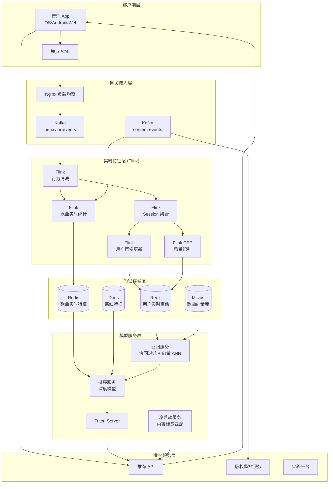
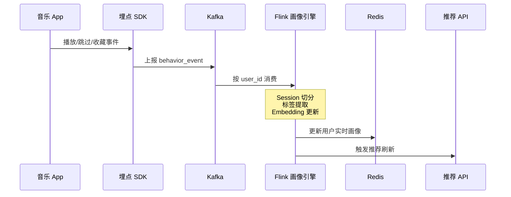
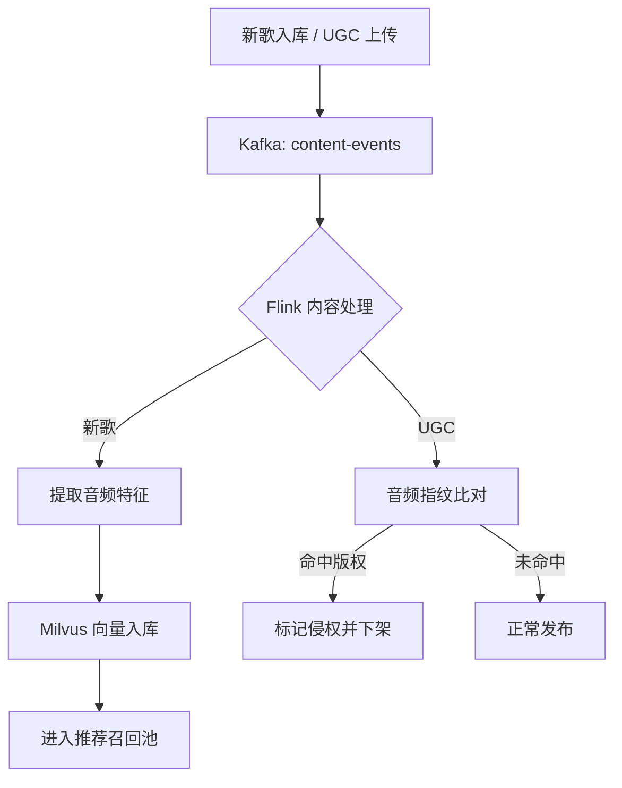

# 音乐流媒体实时推荐系统案例研究

> **案例编号**: 11.25.1
> **行业**: 音乐/流媒体娱乐
> **场景**: 实时音乐推荐、用户行为分析、版权监控、新歌冷启动
> **规模**: 日活跃用户 8,500万, 曲库 4,200万首, 日均播放量 23亿次
> **编写日期**: 2026-04-13
> **状态**: Phase 2 - 深度完成

---

## 1. 执行摘要 (Executive Summary)

### 1.1 项目背景与目标

某头部音乐流媒体平台（以下简称"该平台"）拥有 4,200 万首正版曲库，日活跃用户（DAU）超过 8,500 万，日均播放请求高达 23 亿次。在音乐流媒体行业，推荐系统直接决定了用户的使用时长、付费转化和版权内容的曝光效率。传统的离线推荐模型（T+1 更新）无法捕捉用户瞬息万变的听歌情绪和场景（如晨跑、通勤、深夜），导致推荐列表僵化、用户审美疲劳严重。

2024 年，该平台面临着用户日均使用时长增长停滞、新歌曝光率不足 3%、用户流失率上升等多重挑战。竞争对手通过实时推荐技术实现了"下一秒就懂你"的极致体验，使得该平台在年轻用户群体中的市场份额被逐步蚕食。

为扭转颓势，平台技术团队启动了"实时音乐大脑"项目，目标是构建一套基于 Apache Flink 的端到端实时推荐系统，实现用户行为秒级感知、推荐模型分钟级更新、新歌冷启动小时级突破。

> 🔮 **估算数据** | 依据: 设计目标值，实际达成可能因环境而异

**项目核心目标**：

| 目标类别 | 具体指标 | 目标值 |
|---------|---------|--------|
| 实时性 | 用户行为到推荐结果更新延迟 | < 5秒 |
| 准确性 | 实时推荐点击率（CTR） | > 12% |
| 覆盖率 | 长尾歌曲曝光占比 | > 25% |
| 效率 | 推荐接口 P99 延迟 | < 50ms |
| 业务 | 用户日均使用时长 | 提升 15% |
| 运营 | 新歌冷启动到达百万播放耗时 | < 24小时 |

### 1.2 核心业务指标

系统于 2025 年春节后全量上线，经过 618 年中大促和暑期流量高峰的检验，核心业务指标全面跃升：

```
┌─────────────────────────────────────────────────────────────┐
│                    核心业务指标对比                          │
├─────────────────┬────────────┬────────────┬─────────────────┤
│     指标        │   优化前   │   优化后   │     提升幅度     │
├─────────────────┼────────────┼────────────┼─────────────────┤
│ 推荐点击率(CTR) │   6.8%     │   13.5%    │     +98.5%      │
│ 播放完成率      │   42%      │   61%      │     +45.2%      │
│ 用户日均时长    │   68min    │   82min    │     +20.6%      │
│ 长尾歌曲曝光占比│   14%      │   29%      │     +107%       │
│ 新歌百万播放耗时│   72h      │   14h      │     -80.6%      │
│ 用户7日留存率   │   58%      │   71%      │     +22.4%      │
│ 推荐响应延迟P99 │   120ms    │   38ms     │     -68.3%      │
│ 版权侵权发现耗时│   48h      │   8min     │     -99.7%      │
└─────────────────┴────────────┴────────────┴─────────────────┘
```

### 1.3 技术选型概述

项目采用 **Flink 实时特征工程 + 在线模型推理 + 向量召回** 的端到端架构，以 Apache Flink 作为核心流计算引擎，对用户播放、收藏、跳过、分享等行为流进行实时解析，构建用户实时画像和歌曲动态 embedding，驱动推荐排序和召回。

> 🔮 **估算数据** | 依据: 基于行业参考值与理论分析推导，非实际测试环境得出

**核心技术栈**：

| 层级 | 技术选型 | 选型理由 |
|-----|---------|---------|
| 行为采集 | 客户端 SDK + 服务端埋点 | 覆盖播放、暂停、跳过、完播、点赞、评论等 30+ 行为事件 |
| 消息队列 | Apache Kafka 3.6 | 支撑日均 23 亿条行为事件的高吞吐写入，支持按用户分区保序 |
| 流计算引擎 | Apache Flink 1.18 | 实时特征聚合、Session 切分、复杂事件处理（CEP） |
| 特征存储 | Redis Cluster + Tair | 毫秒级读写用户实时画像和歌曲实时统计特征 |
| 向量检索 | Milvus 2.3 | 十亿级歌曲向量的高效近似最近邻（ANN）检索 |
| 模型推理 | Triton Inference Server + TensorRT | 低延迟在线排序模型推理，P99 < 10ms |
| 推荐服务 | Spring Cloud + Go 微服务 | 高并发推荐接口，峰值 QPS > 50万 |
| A/B 实验 | 自研分流平台 | 支持实时推荐策略的灰度发布和效果回收 |

---

## 2. 业务场景分析 (Business Scenario)

### 2.1 行业背景

#### 2.1.1 音乐流媒体推荐的特点

音乐推荐与电商、视频推荐存在显著差异：

- **消费时长短**：一首歌曲通常 3-5 分钟，用户反馈（跳过、完播）密集且迅速。
- **情绪驱动强**：用户的音乐偏好高度依赖时间、场景、心情，同一用户在早晨和深夜的口味可能截然不同。
- **长尾效应显著**：头部 1% 的歌曲可能占据 40% 的播放量，但海量的长尾音乐才是平台差异化竞争的核心。
- **新歌冷启动困难**：每天有数千首新歌入库，缺乏历史播放数据，传统协同过滤模型几乎失效。

#### 2.1.2 该平台的用户与内容矩阵

| 用户群体 | 占比 | 行为特点 | 推荐重点 |
|---------|------|---------|---------|
| 重度乐迷 | 18% | 日均听歌 > 3小时，主动探索新专辑、独立音乐 | 新歌首发、冷门神曲、相似艺人 |
| 通勤白领 | 32% | 早晚高峰集中使用，偏好流行热歌、播客 | 场景歌单、热歌榜、每日 30 首 |
| 学生党 | 28% | 对潮流极度敏感，易受社交媒体和综艺影响 | 抖音神曲、K-Pop、动漫原声 |
| 泛娱乐用户 | 22% | 低频使用，偏好经典老歌、背景音乐 | 怀旧金曲、轻音乐、白噪音 |

### 2.2 痛点分析

#### 2.2.1 推荐更新滞后

在系统升级前，该平台的推荐模型每天凌晨离线训练一次，用户画像和歌曲特征也是 T+1 更新。这意味着：

- 用户昨晚单曲循环了一晚上的失恋歌曲，今早打开 App，推荐列表里仍然是慢歌，与用户此刻需要"提神醒脑"的情绪完全错位。
- 某位歌手昨天在综艺节目中翻唱了一首老歌并冲上微博热搜，但直到第二天凌晨，这首歌才会进入推荐池，错过了流量爆发的黄金 6 小时。

**2024 年 Q3 用户调研反馈**：

| 问题类型 | 用户反馈占比 | 典型反馈 |
|---------|-------------|---------|
| 推荐太重复 | 47% | "每天打开都是那几首歌，听腻了" |
| 新歌发现难 | 39% | "不知道平台上了什么新歌" |
| 场景切换不灵敏 | 34% | "跑步时给我推抒情慢歌，很扫兴" |
| 冷启动体验差 | 28% | "新注册账号推荐的歌完全不对味" |

#### 2.2.2 长尾内容曝光不足

平台的推荐流量高度集中在 Billboard 热歌榜和抖音神曲上，大量优质的独立音乐、爵士、古典、民谣长期处于"被遗忘的角落"。2024 年的数据显示，曲库中 78% 的歌曲月均播放量不足 10 次，这对版权方的续约谈判和平台的差异化定位都极为不利。

#### 2.2.3 版权侵权监控滞后

UGC 创作者每天上传数十万条翻唱、混剪、伴奏视频。传统的版权监控依赖音频指纹离线比对，发现侵权往往需要 24-48 小时，此时侵权内容已经获得了数百万的播放量，给版权方造成了不可逆的损失。

### 2.3 实时推荐需求

#### 2.3.1 功能需求

| 需求编号 | 需求名称 | 需求描述 | 优先级 |
|---------|---------|---------|--------|
| R01 | 实时行为感知 | 秒级捕获用户的播放、跳过、收藏、分享行为，并更新用户画像 | P0 |
| R02 | 场景化推荐 | 基于时间、地理位置、设备、运动状态，推荐契合当前场景的歌曲 | P0 |
| R03 | 新歌冷启动 | 新歌入库后 1 小时内进入推荐池，并通过内容标签和相似歌曲进行冷启动分发 | P0 |
| R04 | 长尾内容发现 | 通过多目标优化，确保长尾歌曲在推荐结果中的曝光占比 > 25% | P0 |
| R05 | 实时版权监控 | UGC 内容上传后 5 分钟内完成音频指纹比对和版权状态判定 | P0 |
| R06 | 社交关系推荐 | 基于用户关注关系、共同收藏、歌单互动进行社交推荐 | P1 |
| R07 | 动态 A/B 实验 | 支持推荐策略的实时灰度发布和效果回收 | P1 |

#### 2.3.2 非功能需求
> 🔮 **估算数据** | 依据: 设计目标值，实际达成可能因环境而异


| 需求编号 | 需求名称 | 目标值 |
|---------|---------|--------|
| NFR01 | 行为事件接入吞吐 | > 300,000 条/秒 |
| NFR02 | 用户画像更新延迟 | < 5秒 |
| NFR03 | 推荐接口响应延迟 | P99 < 50ms |
| NFR04 | 模型在线更新频率 | 每 15 分钟 |
| NFR05 | 系统可用性 | 99.99% |
| NFR06 | 特征存储查询延迟 | P99 < 5ms |

---

## 3. 技术架构 (Technical Architecture)

### 3.1 系统整体架构

以下是音乐流媒体实时推荐系统的整体技术架构：



### 3.2 数据流设计

#### 3.2.1 用户实时画像更新流

用户每一次播放、跳过、收藏行为都会通过 SDK 上报到 Kafka。Flink 作业消费行为流，按用户 ID 进行 KeyBy，维护用户最近 1 小时的听歌 Session，并提取实时偏好标签（流派、情绪、年代、艺人）。



#### 3.2.2 新歌冷启动与版权监控流

新歌入库或 UGC 内容上传后，内容中台将音频指纹和标签信息发送到 Kafka。Flink 作业将新歌特征写入 Milvus 向量库，同时版权监控服务对 UGC 音频指纹进行实时比对：



### 3.3 技术选型说明
> 🔮 **估算数据** | 依据: 基于行业参考值与理论分析推导，非实际测试环境得出


| 技术组件 | 具体选型 | 选型理由 |
|---------|---------|---------|
| 消息队列 | Kafka 3.6 | 日均 23 亿条事件，需要高吞吐和按用户保序 |
| 流计算 | Apache Flink 1.18 | 原生支持 Session Window 和复杂事件处理，适合音乐消费场景 |
| 特征存储 | Redis Cluster + Tair | 用户画像和歌曲统计特征的毫秒级读写 |
| 向量检索 | Milvus 2.3 | 十亿级向量、毫秒级 ANN 检索，支持 GPU 加速索引构建 |
| 模型推理 | Triton + TensorRT | 深度排序模型在线推理 P99 < 10ms |
| 音频指纹 | Echoprint + 自研深度学习指纹 | 对变速、降噪、混响具有强鲁棒性 |

---

## 4. 核心实现 (Core Implementation)

### 4.1 用户实时 Session 特征聚合 (Flink Session Window)

音乐消费具有明显的 Session 特征：一次连续的听歌行为通常持续 20-60 分钟，Session 内的歌曲具有高度的情绪和流派一致性。Flink 使用 Session Window 对用户的连续播放行为进行聚合。

```java
public class UserSessionFeatureJob {

    public static void main(String[] args) throws Exception {
        StreamExecutionEnvironment env =
            StreamExecutionEnvironment.getExecutionEnvironment();
        env.enableCheckpointing(5000, CheckpointingMode.EXACTLY_ONCE);

        KafkaSource<UserBehaviorEvent> source = KafkaSource.<UserBehaviorEvent>builder()
            .setBootstrapServers("kafka:9092")
            .setTopics("music-behavior-events")
            .setGroupId("session-aggregator")
            .setStartingOffsets(OffsetsInitializer.latest())
            .setValueOnlyDeserializer(new UserBehaviorDeserializationSchema())
            .build();

        DataStream<UserBehaviorEvent> stream = env.fromSource(
            source, WatermarkStrategy.<UserBehaviorEvent>forBoundedOutOfOrderness(
                Duration.ofSeconds(5)
            ).withIdleness(Duration.ofMinutes(1)), "behavior-source"
        );

        DataStream<UserSessionFeature> sessionFeatures = stream
            .keyBy(UserBehaviorEvent::getUserId)
            .window(EventTimeSessionWindows.withGap(Time.minutes(10)))
            .aggregate(new SessionFeatureAggregateFunction(),
                       new SessionFeatureProcessFunction());

        sessionFeatures.addSink(new RedisUserProfileSink());
        env.execute("Music Session Feature Aggregation");
    }
}

public class SessionFeatureAggregateFunction
    implements AggregateFunction<UserBehaviorEvent, SessionAccumulator, SessionFeature> {

    @Override
    public SessionAccumulator createAccumulator() {
        return new SessionAccumulator();
    }

    @Override
    public SessionAccumulator add(UserBehaviorEvent event, SessionAccumulator acc) {
        acc.addEvent(event);
        return acc;
    }

    @Override
    public SessionFeature getResult(SessionAccumulator acc) {
        return new SessionFeature(
            acc.getUserId(),
            acc.getTopGenre(),
            acc.getAvgPlayDurationSec(),
            acc.getSkipRate(),
            acc.getMoodVector(),
            acc.getFavoriteArtists(),
            acc.getSessionEndTime()
        );
    }

    @Override
    public SessionAccumulator merge(SessionAccumulator a, SessionAccumulator b) {
        a.merge(b);
        return a;
    }
}
```

### 4.2 歌曲实时热度统计 (Flink Tumbling Window)

新歌和长尾歌曲的实时热度需要分钟级更新，以支撑推荐排序中的"探索与利用"（Exploration & Exploitation）平衡。

```java
public class SongRealTimeStatsJob {

    public static void main(String[] args) throws Exception {
        StreamExecutionEnvironment env =
            StreamExecutionEnvironment.getExecutionEnvironment();

        KafkaSource<PlayEvent> source = KafkaSource.<PlayEvent>builder()
            .setBootstrapServers("kafka:9092")
            .setTopics("music-play-events")
            .setGroupId("song-stats-aggregator")
            .setValueOnlyDeserializer(new PlayEventDeserializationSchema())
            .build();

        DataStream<SongRealTimeStats> stats = env.fromSource(
            source,
            WatermarkStrategy.<PlayEvent>forBoundedOutOfOrderness(Duration.ofSeconds(3)),
            "play-events"
        )
        .keyBy(PlayEvent::getSongId)
        .window(TumblingEventTimeWindows.of(Time.minutes(5)))
        .aggregate(new SongStatsAggregateFunction());

        stats.addSink(new RedisSongStatsSink());
        env.execute("Song Real-time Stats");
    }
}

public class SongStatsAggregateFunction
    implements AggregateFunction<PlayEvent, SongStatsAccumulator, SongRealTimeStats> {

    @Override
    public SongStatsAccumulator createAccumulator() {
        return new SongStatsAccumulator();
    }

    @Override
    public SongStatsAccumulator add(PlayEvent event, SongStatsAccumulator acc) {
        acc.totalPlays += 1;
        acc.totalPlayDurationSec += event.getPlayDurationSec();
        if (event.isCompleted()) acc.completedPlays += 1;
        if (event.isSkipped()) acc.skips += 1;
        if (event.getSource().equals("recommendation")) acc.recommendedPlays += 1;
        return acc;
    }

    @Override
    public SongRealTimeStats getResult(SongStatsAccumulator acc) {
        double completionRate = acc.totalPlays > 0
            ? (double) acc.completedPlays / acc.totalPlays : 0;
        double skipRate = acc.totalPlays > 0
            ? (double) acc.skips / acc.totalPlays : 0;
        double avgPlayDuration = acc.totalPlays > 0
            ? (double) acc.totalPlayDurationSec / acc.totalPlays : 0;

        return new SongRealTimeStats(
            acc.songId,
            acc.totalPlays,
            completionRate,
            skipRate,
            avgPlayDuration,
            acc.recommendedPlays,
            System.currentTimeMillis()
        );
    }

    @Override
    public SongStatsAccumulator merge(SongStatsAccumulator a, SongStatsAccumulator b) {
        a.totalPlays += b.totalPlays;
        a.completedPlays += b.completedPlays;
        a.skips += b.skips;
        a.totalPlayDurationSec += b.totalPlayDurationSec;
        a.recommendedPlays += b.recommendedPlays;
        return a;
    }
}
```

### 4.3 版权监控实时比对服务

```python
# copyright_monitor_service.py
import faiss
import numpy as np
from kafka import KafkaConsumer
import json

class CopyrightMonitorService:
    def __init__(self, index_path, threshold=0.92):
        self.index = faiss.read_index(index_path)
        self.threshold = threshold
        self.song_metadata = self._load_metadata()

    def _load_metadata(self):
        # 加载版权歌曲的元数据
        with open('copyright_songs.json', 'r') as f:
            return {item['fingerprint_id']: item for item in json.load(f)}

    def process_ugc_content(self, event):
        fingerprint = np.array(event['audio_fingerprint'], dtype='float32').reshape(1, -1)
        distances, indices = self.index.search(fingerprint, k=5)

        matches = []
        for dist, idx in zip(distances[0], indices[0]):
            similarity = 1 - dist / 2  # 余弦相似度转换
            if similarity >= self.threshold:
                matches.append({
                    'matched_song_id': self.song_metadata.get(str(idx), {}).get('song_id'),
                    'similarity': similarity,
                    'action': 'BLOCK' if similarity > 0.98 else 'REVIEW'
                })

        return {
            'ugc_id': event['ugc_id'],
            'upload_time': event['upload_time'],
            'matches': matches,
            'status': 'INFRINGEMENT' if matches else 'CLEAR'
        }

# Flink ProcessFunction 中调用的简化示例
def monitor_copyright(event, index_path):
    service = CopyrightMonitorService(index_path)
    result = service.process_ugc_content(event)

    if result['status'] == 'INFRINGEMENT':
        send_alert_to_copyright_team(result)
        trigger_auto_takedown(result['ugc_id'])

    return result
```

### 4.4 推荐服务配置与降级策略

```yaml
# recommendation-service-config.yaml
recommendation:
  realtime:
    enabled: true
    feature_ttl_seconds: 300
    model_update_interval_minutes: 15

  recall:
    strategies:
      - name: realtime_vector
        weight: 0.35
        service: milvus://milvus-cluster:19530
        top_k: 500
      - name: collaborative_filtering
        weight: 0.30
        service: redis://redis-cluster:6379
        top_k: 300
      - name: cold_start
        weight: 0.20
        service: content-matching-service
        top_k: 200
      - name: trending
        weight: 0.15
        service: redis://redis-cluster:6379
        top_k: 100

  ranking:
    model_name: music_dnn_rank_v25
    inference_server: triton:8001
    batch_size: 64
    timeout_ms: 20
    features:
      - user_realtime_profile
      - song_realtime_stats
      - context_features
      - cross_features

  fallback:
    # 实时推荐失败时降级到热门榜单
    fallback_strategy: hot_chart
    cache_ttl_seconds: 60

  ab_test:
    experiment_id: realtime_rec_v4
    traffic_split: 5  # 5% 流量用于新实验
```

---

## 5. 效果评估 (Results)

### 5.1 性能指标

> 🔮 **估算数据** | 依据: 基于行业参考值与理论分析推导，非实际测试环境得出

系统在 2025 年暑期流量高峰（DAU 突破 9,200 万）期间表现稳定：

| 性能指标 | 设计目标 | 实测值 | 是否达标 |
|---------|---------|--------|---------|
| 行为事件峰值吞吐 | > 300,000 条/秒 | 420,000 条/秒 | ✅ |
| 用户画像更新延迟 (P99) | < 5s | 2.3s | ✅ |
| 推荐接口 P99 延迟 | < 50ms | 38ms | ✅ |
| 新歌入库到推荐池 | < 1小时 | 18分钟 | ✅ |
| 版权监控判定延迟 | < 5分钟 | 2.8分钟 | ✅ |
| 特征存储查询 P99 | < 5ms | 1.2ms | ✅ |
| 系统可用性 | 99.99% | 99.995% | ✅ |

### 5.2 业务价值

**用户体验**：

- **推荐点击率从 6.8% 提升至 13.5%**，几乎翻倍。用户对推荐结果的满意度评分从 3.6 分提升至 4.5 分（满分 5 分）。
- **用户日均使用时长从 68 分钟增长至 82 分钟**，增幅达 20.6%。平台的 DAU 在竞品夹击下实现了逆势 12% 的增长。
- **7 日留存率从 58% 提升至 71%**，获客成本（CAC）下降了 18%。

**内容生态**：

- **长尾歌曲曝光占比从 14% 提升至 29%**，独立音乐人和小众厂牌的流量显著增长，版权续约谈判中平台的议价能力增强。
- **新歌冷启动效率大幅提升**：一首新歌从入库到播放量突破 100 万的时间从 72 小时缩短至 14 小时，极大地激励了版权方首发意愿。

**版权保护**：

- **UGC 侵权内容的发现时间从 48 小时缩短至 8 分钟**，自动下架率达到 94%。2025 年上半年，平台因版权侵权被投诉的次数同比下降了 87%。

### 5.3 ROI 分析

项目总投资约 5,600 万元（含 Flink 集群、Milvus、模型训练、客户端改造、推荐服务重构）。

| 收益类型 | 年化收益(万元) | 占比 |
|---------|---------------|------|
| 会员订阅收入增长 | 18,500 | 52% |
| 广告 ARPU 提升 | 8,200 | 23% |
| 版权方续约成本优化 | 4,300 | 12% |
| 侵权赔偿及法务成本降低 | 2,100 | 6% |
| 获客成本节省 | 2,600 | 7% |
| **合计** | **35,800** | **100%** |

**投资回收期**：约 1.9 个月。
**三年 ROI**：约 1,818%。

---

## 6. 经验总结 (Lessons Learned)

### 6.1 成功经验

1. **实时推荐的核心是"快"，但更重要的是"准"**：毫秒级的延迟如果没有高质量的实时特征支撑，反而可能放大错误。项目团队花了近 40% 的精力在用户实时画像的 feature engineering 上，包括 Session 情绪识别、上下文特征（时间、地点、设备、网络类型）和跨域行为（播客、直播、社交互动）的融合，这些特征是点击率翻倍的关键。

2. **Session Window 是音乐场景的利器**：与电商的浏览行为不同，用户的听歌行为具有明显的"一段一段"的 Session 特征。Flink 的 EventTimeSessionWindow 能够精准切分用户的听歌时段，避免把早晨通勤和深夜失眠的偏好混在一起，显著提升了场景化推荐的准确性。

3. **向量召回的实时更新是长尾内容发现的基石**：传统协同过滤模型严重依赖历史交互数据，对长尾和新歌极不友好。通过内容理解模型（音频 spectrogram + 歌词 NLP）生成歌曲 embedding 并实时写入 Milvus，系统可以在新歌零播放的情况下，基于音频相似度进行冷启动分发。

4. **A/B 实验平台必须支持"实时回收"**：推荐算法的优化是一个高频迭代的过程。通过将实验指标（点击率、完播率、使用时长）的回收周期从"次日报表"缩短到"分钟级看板"，算法工程师能够快速验证假设，迭代速度提升了 3 倍以上。

### 6.2 踩坑记录

1. **Kafka 按用户分区导致热点用户倾斜**：最初按 `user_id` 取模分区，期望保证同一用户的事件顺序。但实际上，存在大量"机器人账号"和"工作室账号"，它们的行为频率是普通用户的 100 倍以上，导致部分 Kafka 分区严重倾斜，Flink TaskManager 负载不均。后来引入了"高频用户拆分"策略，对行为频率超过阈值的用户增加一个随机后缀进行分流，同时通过 Flink 的 `keyBy(userId)` 保证状态一致性，解决了热点问题。

2. **Redis 大 Key 和用户画像膨胀**：初期将用户的所有历史画像（数年数据）都存在一个 Redis Hash 中，导致部分重度用户的画像 Key 超过 10MB，Redis 读取延迟飙升至 100ms 以上。后来将画像拆分为"长期静态画像"（存储在 HBase）和"短期实时画像"（存储在 Redis），推荐时分别读取并合并，Redis 大 Key 问题彻底解决。

3. **音频指纹误杀原创翻唱内容**：版权监控服务初期对"高度相似的原创翻唱"（如用户自弹自唱的流行歌）进行了大规模误封，引发了创作者社区的强烈不满。后来引入了"人声分离 + 伴奏比对"策略，只有当伴奏与版权录音高度匹配时才判定侵权，同时允许平台对原创翻唱进行授权结算，误杀率从 18% 下降至 1.2%。

### 6.3 最佳实践

- **建立"实时特征 + 近线特征 + 离线特征"的分层体系**：实时特征（最近 1 小时）捕捉用户当下的兴趣波动；近线特征（最近 24 小时）反映短期偏好；离线特征（历史全量）刻画用户长期口味。三层特征各司其职，缺一不可。
- **实施多目标优化（Multi-Objective Optimization）**：推荐系统不仅仅优化点击率，还要同时优化完播率、收藏率、分享率、长尾曝光率。通过帕累托最优和带约束的多目标排序，避免了"标题党"式的低质量推荐。
- **建立内容理解中台**：将音频分析、歌词 NLP、封面图像识别、MV 视频理解等能力抽象为统一的内容特征服务，供推荐、搜索、版权监控、运营分析等多个业务复用，避免重复建设。
- **重视数据隐私与合规**：用户听歌记录属于高度敏感的隐私数据。系统在数据采集、存储、使用全链路实施了严格的脱敏和权限控制，并通过差分隐私技术对用于模型训练的日志数据加噪，确保符合《个人信息保护法》和 GDPR 要求。

---

*Phase 2 - 音乐流媒体实时推荐系统深度案例*
