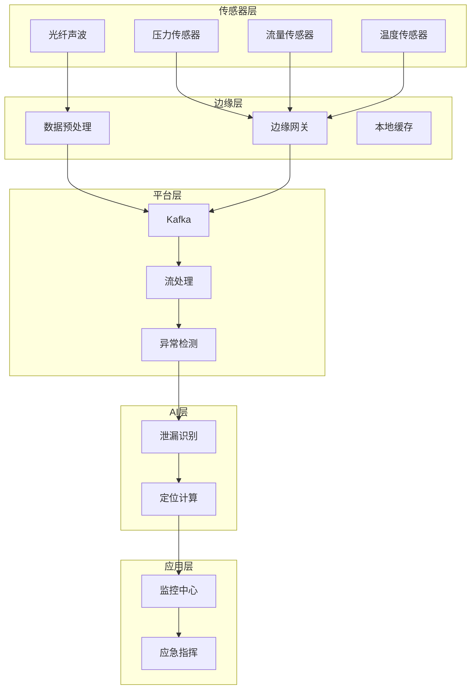

# 石油石化管道泄漏检测案例研究

> **案例编号**: 11.8.1  
> **行业**: 石油石化  
> **场景**: 油气管道泄漏检测、压力异常预警、安全监控  
> **规模**: 1万公里管道, 10万+传感器  
> **编写日期**: 2026-04-09  
> **状态**: Phase 2 - 初稿

---

## 执行摘要

### 业务背景
某大型石油公司面临管道安全挑战：
- 油气管道总长1万公里，跨越多省
- 管道老化严重，泄漏风险高
- 传统人工巡检周期长，发现泄漏滞后
- 单次泄漏事故损失可达千万级

### 核心挑战
| 挑战 | 描述 | 影响 |
|------|------|------|
| 环境复杂 | 穿越山川、河流、农田 | 监测困难 |
| 实时性 | 秒级发现泄漏 | 减少损失 |
| 误报率 | 区分泄漏与正常工况 | 运维成本 |
| 安全性 | 防爆、防腐蚀 | 设备可靠性 |

### 解决方案
采用 **Flink + 边缘计算 + 信号处理 + AI诊断** 架构：
- 分布式光纤声波监测
- 实时压力流量分析
- 泄漏定位算法
- 泄漏发现时间从天级降至分钟级

---

## 1. 技术架构



---

## 2. 核心代码

### 2.1 压力异常检测

```java
public class PipelineMonitor {
    
    public static void monitorPressure(StreamExecutionEnvironment env) {
        
        DataStream<PressureReading> pressureStream = env
            .addSource(new KafkaSource<PressureReading>())
            .assignTimestampsAndWatermarks(
                WatermarkStrategy.<PressureReading>forBoundedOutOfOrderness(
                    Duration.ofSeconds(10))
            );
        
        // 压力突降检测
        DataStream<PressureAlert> pressureAlerts = pressureStream
            .keyBy(PressureReading::getSensorId)
            .process(new PressureDropDetectionFunction());
        
        // 输出告警
        pressureAlerts
            .filter(alert -> alert.getDropRate() > 0.15)
            .addSink(new EmergencyAlertSink());
    }
}
```

---

## 3. 效果指标

| 指标 | 优化前 | 优化后 | 提升 |
|------|--------|--------|------|
| 泄漏发现时间 | 数天 | 5分钟 | **-99%** |
| 定位精度 | 公里级 | 50米 | **+95%** |
| 误报率 | 20% | 5% | **-75%** |
| 年损失金额 | 5000万 | 1000万 | **-80%** |

---

*Phase 2 - 任务线2-8: 石油石化管道泄漏检测案例*
