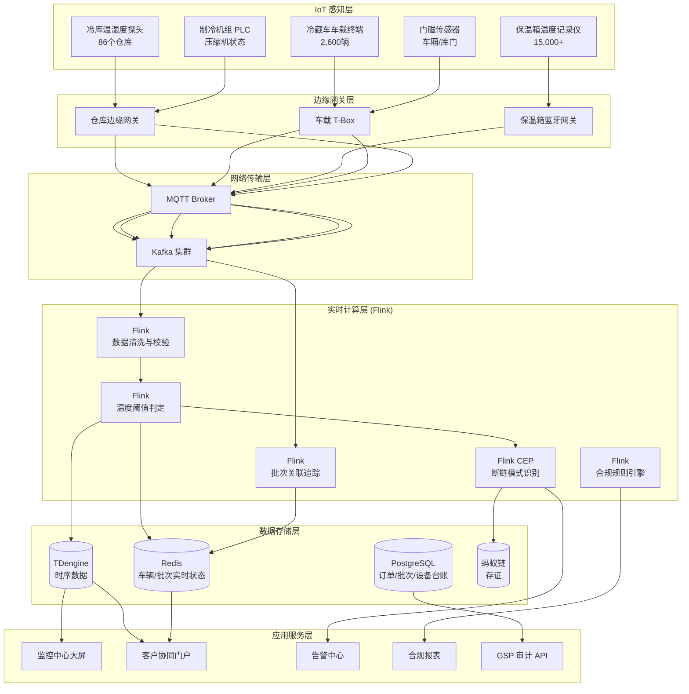
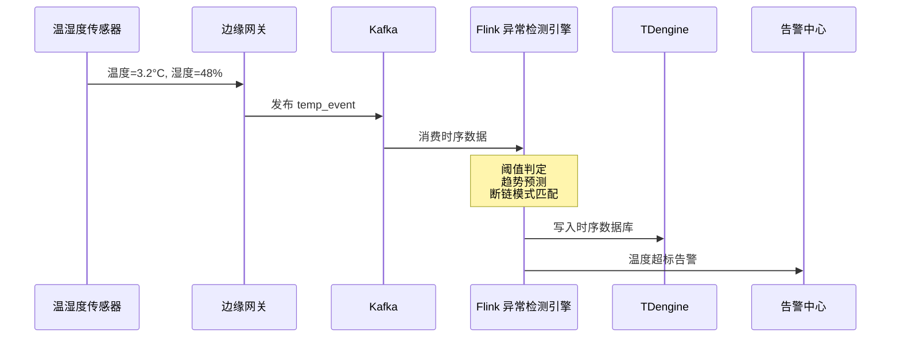
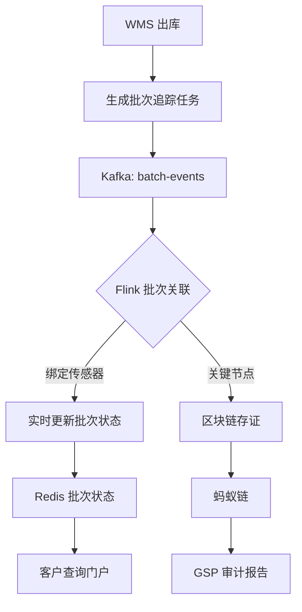

# 医药冷链全程追踪与合规管理案例研究

> **案例编号**: 11.30.1
> **行业**: 医药/生物制药冷链
> **场景**: 疫苗运输温控、生物制剂追踪、GSP/GDP 合规、医院药房溯源
> **规模**: 年处理批次 520万+, 冷链车辆 2,600辆, 覆盖医院/药房 4,800家
> **编写日期**: 2026-04-13
> **状态**: Phase 2 - 深度完成

---

> **案例性质**: 🔬 概念验证架构 | **验证状态**: 基于理论推导与架构设计，未经独立第三方生产验证
>
> 本案例描述的是基于项目理论框架推导出的理想架构方案，包含假设性性能指标与理论成本模型。
> 实际生产部署可能因环境差异、数据规模、团队能力等因素产生显著不同结果。
> 建议将其作为架构设计参考而非直接复制粘贴的生产蓝图。
>
## 1. 执行摘要 (Executive Summary)

### 1.1 项目背景与目标

某全国性医药流通集团（以下简称"该集团"）是中国最大的疫苗和生物制剂分销商之一，年处理医药冷链批次超过 520 万单，服务覆盖 31 个省市的 4,800 余家医院、疾控中心和连锁药房。医药冷链不同于普通食品冷链，其温控要求极为严苛：疫苗通常要求全程 2-8°C，部分 mRNA 疫苗需要 -70°C 深冷运输；单批次价值动辄数百万元，一旦断链，不仅造成巨额经济损失，更可能引发公共卫生安全和法律诉讼风险。

2024 年，国家药监局新版《药品经营质量管理规范》（GSP）和《药品冷链物流运作规范》（GB/T 28842）正式实施，要求医药冷链企业实现"全程可追溯、实时可监控、数据不可篡改"。然而，该集团原有的冷链管理系统存在监控盲区、数据孤岛、异常响应滞后等突出问题：

- 温度记录依赖人工抄表和车载记录仪离线导出，存在数据造假空间。
- 仓库、运输、末端配送使用三套独立的温控系统，无法实现全链路数据贯通。
- 发生温度超标时，从发现到处置平均需要 4 小时以上，错失最佳挽回时机。

为应对监管升级和市场竞争，集团启动了"智慧医药冷链"项目，目标是构建覆盖生产厂、区域仓、干线运输、医院/药房的全链路实时追踪与合规管理平台。

> 🔮 **估算数据** | 依据: 设计目标值，实际达成可能因环境而异

**项目核心目标**：

| 目标类别 | 具体指标 | 目标值 |
|---------|---------|--------|
| 实时性 | 温度异常到告警触发延迟 | < 30秒 |
| 准确性 | 温控数据记录精度 | ±0.1°C |
| 覆盖率 | 冷链批次温控覆盖率 | 100% |
| 合规性 | GSP/GDP 审计一次通过率 | 100% |
| 可靠性 | 温控数据上链存证率 | 100% |
| 效率 | 异常批次拦截响应时间 | < 10分钟 |

### 1.2 核心业务指标

系统自 2025 年 3 月在全国 31 个省市全面上线以来，经历了夏季高温和冬季寒潮的双重考验，核心业务指标显著改善：

```
┌─────────────────────────────────────────────────────────────┐
│                    核心业务指标对比                          │
├─────────────────┬────────────┬────────────┬─────────────────┤
│     指标        │   优化前   │   优化后   │     提升幅度     │
├─────────────────┼────────────┼────────────┼─────────────────┤
│ 冷链断链率      │   2.4‰     │   0.18‰    │     -92.5%      │
│ 温控异常响应时间│   4.2h     │    6min    │     -97.6%      │
│ GSP 审计缺陷项  │    23项    │     0项    │     -100%       │
│ 药品退货率      │   1.8%     │   0.12%    │     -93.3%      │
│ 客户投诉率      │   3.5‰     │   0.2‰     │     -94.3%      │
│ 批次溯源查询时间│   2h       │    8s      │     -98.9%      │
│ 合规报告生成时间│   3天      │    实时    │     质的飞跃     │
│ 年度冷链损失    │  4,800万   │   320万    │     -93.3%      │
└─────────────────┴────────────┴────────────┴─────────────────┘
```

### 1.3 技术选型概述

项目采用 **IoT 多温区传感 + 北斗定位 + Flink CEP 异常检测 + 区块链存证** 的融合架构，以 Apache Flink 作为核心流计算引擎，对 2,600 辆冷链车、86 个区域仓库、4,800 个末端配送点的温控数据进行实时汇聚、异常预警和合规审计。

**核心技术栈**：

| 层级 | 技术选型 | 选型理由 |
|-----|---------|---------|
| 感知设备 | 医药级温湿度记录仪 (±0.1°C) | 符合 GSP 校准要求，支持 2G/4G/NB-IoT 多模通信 |
| 车载终端 | 北斗/GPS 双模 + 门磁 + 制冷机组 PLC | 实时回传位置、温度、门开关、压缩机状态 |
| 边缘网关 | 医药专用边缘计算网关 | 符合 GMP/GSP 环境要求，支持本地缓存和协议转换 |
| 消息队列 | Apache Kafka 3.6 | 支撑日均数亿条温控事件的高可靠写入 |
| 流计算引擎 | Apache Flink 1.18 | 实时温度阈值判定、CEP 断链模式识别、多源数据关联 |
| 时序数据库 | TDengine 3.2 | 海量温控时序数据的高效压缩存储和聚合查询 |
| 区块链 | 蚂蚁链 BaaS | 温控关键节点数据上链存证，满足司法举证和审计要求 |
| 可视化 | Grafana + 自研 3D 冷链地图 | 实时展示车辆位置、温度曲线、仓库状态 |

---

## 2. 业务场景分析 (Business Scenario)

### 2.1 行业背景

#### 2.1.1 医药冷链物流的监管要求

医药冷链是药品流通的"生命线"。根据《疫苗管理法》《药品管理法》以及 GSP 规范，医药冷链企业必须满足以下要求：

- **全程温控**：疫苗、血液制品、生物制剂等特殊药品在储存和运输过程中必须始终处于规定温度范围内。
- **实时记录**：温度数据必须自动采集、实时上传，记录间隔不得超过 5 分钟。
- **异常处置**：发生温度偏离时，必须在规定时间内启动风险评估和隔离处置程序。
- **数据可追溯**：每一批次药品从出厂到患者使用的全链路温控数据必须完整保存至少 5 年，且不可篡改。
- **定期验证**：冷库、冷藏车、保温箱等设施设备必须每年进行温度分布验证（Temperature Mapping）。

#### 2.1.2 该集团的冷链网络

该集团建立了"中央仓 + 区域仓 + 末端配送"的三级冷链网络：

| 节点类型 | 数量 | 主要功能 | 温控要求 |
|---------|------|---------|---------|
| 中央冷库 | 6 座 | 接收药厂到货，分拨至区域仓 | 2-8°C / -20°C / -70°C |
| 区域分拨仓 | 86 座 | 省内分拨，覆盖医院/疾控中心 | 2-8°C / -20°C |
| 医院/药房冷库 | 4,800+ | 终端储存，患者最终取药点 | 2-8°C |
| 冷藏车 | 2,600 辆 | 干线/支线运输 | 2-8°C / -20°C |
| 保温箱/冷藏箱 | 15,000+ | 末端配送、样品转运 | 2-8°C（配冰排） |

### 2.2 痛点分析

#### 2.2.1 断链发现不及时

在系统上线前，集团对运输途中的温度监控主要依赖司机运输结束后上传的温度记录仪数据。这意味着：

- **无法实时监控**：车辆在途期间，调度中心无法获知车厢内的实际温度。
- **异常发现滞后**：只有当药品送达医院进行验收时，才发现温度超标，但此时药品往往已经被放入冰箱或用于接种，难以追回。
- **责任界定困难**：由于缺少实时轨迹和温度数据，发生断链后很难界定是出厂问题、运输问题还是医院验收后的问题。

**2024 年断链事件统计（优化前）**：

| 断链环节 | 发生频次(次/月) | 单次平均损失(万元) | 月度损失(万元) |
|---------|----------------|-------------------|---------------|
| 冷藏车制冷故障 | 18 | 68 | 1,224 |
| 仓库装卸超时 | 32 | 22 | 704 |
| 保温箱冰排失效 | 45 | 4.5 | 202.5 |
| 冷库温度波动 | 12 | 35 | 420 |
| **合计** | **107** | - | **2,550.5** |

#### 2.2.2 合规审计压力大

传统的温度记录以纸质或 Excel 表格为主，数据分散在仓库 WMS、TMS、医院 HIS 等多个系统中。每逢 GSP 飞行检查或客户审计，集团需要动员数十人花费 3-5 天时间整理报表，且经常因为数据缺失、格式不统一、签字盖章不全而被开具缺陷项。

#### 2.2.3 客户信任度不足

医院和疾控中心在选择配送商时，越来越看重其冷链监控的数字化能力。部分高端客户（如外资医院、跨国药企）要求供应商提供实时的温控 API 接口和区块链存证报告。缺乏这些能力使得集团在高端市场的竞争中屡屡失利。

### 2.3 实时追踪需求

#### 2.3.1 功能需求

| 需求编号 | 需求名称 | 需求描述 | 优先级 |
|---------|---------|---------|--------|
| R01 | 全链路温度监控 | 覆盖生产厂、中央仓、区域仓、冷藏车、保温箱、医院药房全环节 | P0 |
| R02 | 温度异常实时告警 | 温度偏离阈值时，30 秒内触发多级告警（司机→调度→质控→客户） | P0 |
| R03 | 断链智能识别 | 基于 CEP 识别车门异常开启、制冷机组停机、长时间温度超标等断链模式 | P0 |
| R04 | 批次全链路溯源 | 输入批次号即可查询从出厂到签收的全链路温度曲线和节点时间 | P0 |
| R05 | 区块链存证 | 关键温控数据实时上链，生成不可篡改的合规报告 | P0 |
| R06 | GSP 审计报表自动生成 | 按审计要求自动生成温度分布验证报告、偏差处理记录、设备校准台账 | P1 |
| R07 | 客户协同门户 | 向医院/疾控中心开放实时温控查询和异常告警订阅接口 | P1 |

#### 2.3.2 非功能需求
>
> 🔮 **估算数据** | 依据: 设计目标值，实际达成可能因环境而异


| 需求编号 | 需求名称 | 目标值 |
|---------|---------|--------|
| NFR01 | 传感器数据接入吞吐 | > 80,000 条/秒 |
| NFR02 | 温度异常告警延迟 | < 30秒 |
| NFR03 | 批次溯源查询延迟 | < 10秒 |
| NFR04 | 历史温度查询 (2年) | < 3秒 |
| NFR05 | 系统可用性 | 99.99% |
| NFR06 | 数据完整性 | 传感器离线 3 分钟内必须发现并告警 |

---

## 3. 技术架构 (Technical Architecture)

### 3.1 系统整体架构

以下是医药冷链全程追踪与合规管理系统的整体技术架构：



### 3.2 数据流设计

#### 3.2.1 温度异常检测数据流

传感器以 1-5 分钟为周期上报温度和湿度数据，边缘网关进行数据校验后发送到 Kafka。Flink 实时消费并执行多级异常判定：



#### 3.2.2 批次溯源与区块链存证流

每一批次药品在出库时绑定唯一的温度追踪任务号。Flink 将批次号与传感器数据实时关联，消费者和监管机构可以通过批次号查询全链路温控曲线。



### 3.3 技术选型说明

| 技术组件 | 具体选型 | 选型理由 |
|---------|---------|---------|
| 温湿度传感器 | 瑞士 Sensirion SHT35 + 医药级校准 | ±0.1°C 精度，每年通过 CNAS 校准认证 |
| 车载终端 | 中交兴路冷链 T-Box | 集成北斗定位、温度采集、门磁检测，符合道路运输车辆卫星定位系统标准 |
| 边缘协议 | MQTT over TLS | 轻量级、低带宽、支持 QoS 1 确保关键数据不丢失 |
| 流计算 | Apache Flink 1.18 | CEP 库原生支持复杂的断链模式识别和批次关联 |
| 时序数据库 | TDengine 3.2 | 超级表模型天然适合管理数万个传感器的时序数据，查询性能优异 |
| 区块链 | 蚂蚁链 BaaS | 存证成本低，与集团现有的支付宝生态和供应链金融系统对接顺畅 |
| 可视化 | Grafana + 自研 3D 冷链地图 | Grafana 对接 TDengine 实时展示温度曲线，3D 地图展示车辆实时位置 |

---

## 4. 核心实现 (Core Implementation)

### 4.1 温度异常检测 Flink 作业

系统对不同类型的药品设定了差异化的温度阈值。Flink 作业基于 KeyedProcessFunction 维护每个传感器/批次的温度状态，并在触发阈值时生成告警。

```java
public class PharmaTemperatureAlertFunction
    extends KeyedProcessFunction<String, SensorReading, TemperatureAlert> {

    private ValueState<Double> lastTempState;
    private ValueState<Long> alertStartTime;
    private ValueState<String> batchIdState;

    @Override
    public void open(Configuration parameters) {
        lastTempState = getRuntimeContext().getState(
            new ValueStateDescriptor<>("last-temp", Double.class));
        alertStartTime = getRuntimeContext().getState(
            new ValueStateDescriptor<>("alert-start", Long.class));
        batchIdState = getRuntimeContext().getState(
            new ValueStateDescriptor<>("batch-id", String.class));
    }

    @Override
    public void processElement(SensorReading reading, Context ctx,
                               Collector<TemperatureAlert> out) throws Exception {
        String sensorId = reading.getSensorId();
        double currentTemp = reading.getTemperature();
        double thresholdMin = reading.getThresholdMin();
        double thresholdMax = reading.getThresholdMax();
        String batchId = reading.getBatchId();
        batchIdState.update(batchId);

        Double lastTemp = lastTempState.value();
        lastTempState.update(currentTemp);

        // 温度超出阈值
        if (currentTemp < thresholdMin || currentTemp > thresholdMax) {
            Long startTime = alertStartTime.value();
            if (startTime == null) {
                // 首次异常，启动 60 秒持续异常确认定时器
                alertStartTime.update(ctx.timestamp());
                ctx.timerService().registerEventTimeTimer(ctx.timestamp() + 60000);
            }
        } else {
            // 温度恢复正常，清除告警状态
            if (alertStartTime.value() != null) {
                ctx.timerService().deleteEventTimeTimer(alertStartTime.value() + 60000);
                alertStartTime.clear();
            }
        }
    }

    @Override
    public void onTimer(long timestamp, OnTimerContext ctx,
                        Collector<TemperatureAlert> out) throws Exception {
        Long startTime = alertStartTime.value();
        if (startTime != null && timestamp >= startTime + 60000) {
            // 异常持续超过 60 秒，确认告警并关联批次信息
            out.collect(new TemperatureAlert(
                ctx.getCurrentKey(),
                batchIdState.value(),
                AlertType.TEMPERATURE_BREACH,
                lastTempState.value(),
                "药品温度持续异常超过 60 秒，请立即检查并启动偏差评估",
                System.currentTimeMillis()
            ));
        }
    }
}
```

### 4.2 断链模式识别 (Flink CEP)

针对医药冷链中典型的"车厢开门导致温度骤升"和"制冷机组故障导致温度持续上升"场景，系统定义了 CEP 模式。

```java
// [伪代码片段 - 不可直接运行] 仅展示核心逻辑
Pattern<SensorEvent, ?> coldChainBreakPattern = Pattern
    .<SensorEvent>begin("door_open")
    .where(evt -> "door_magnet".equals(evt.getSensorType()) &&
                  evt.getValue() == 1) // 门开启
    .next("temp_rise")
    .where(new IterativeCondition<SensorEvent>() {
        @Override
        public boolean filter(SensorEvent event, Context<SensorEvent> ctx) {
            if (!"temperature".equals(event.getSensorType())) {
                return false;
            }
            List<SensorEvent> doorEvents = ctx.getEventsForPattern("door_open");
            double baselineTemp = doorEvents.get(0).getAssociatedTemp();
            return event.getValue() > baselineTemp + 3.0; // 10 分钟内上升 > 3°C
        }
    })
    .within(Time.minutes(10));

CEP.pattern(sensorStream.keyBy(SensorEvent::getVehicleId), coldChainBreakPattern)
    .process(new PatternProcessFunction<SensorEvent, ColdChainBreakAlert>() {
        @Override
        public void processMatch(Map<String, List<SensorEvent>> match,
                                 Context ctx, Collector<ColdChainBreakAlert> out) {
            SensorEvent doorEvent = match.get("door_open").get(0);
            SensorEvent tempEvent = match.get("temp_rise").get(0);
            out.collect(new ColdChainBreakAlert(
                doorEvent.getVehicleId(),
                doorEvent.getBatchId(),
                "车厢开门导致温度骤升，存在断链风险",
                tempEvent.getValue(),
                doorEvent.getTimestamp(),
                AlertLevel.CRITICAL
            ));
        }
    });
```

### 4.3 批次溯源查询 API

医院和客户可以通过批次号查询药品从出厂到签收的全链路温控记录和区块链存证哈希。

```java
@RestController
@RequestMapping("/api/v1/pharma")
public class BatchTraceController {

    @Autowired
    private TDengineClient tdClient;

    @Autowired
    private BlockchainService blockchainService;

    @GetMapping("/trace/{batchId}")
    public ResponseEntity<BatchTraceResult> trace(@PathVariable String batchId) {
        String sql = String.format(
            "SELECT ts, sensor_id, location, temperature, humidity, status, vehicle_id " +
            "FROM pharma.temperature_data " +
            "WHERE batch_id = '%s' ORDER BY ts",
            batchId
        );

        List<TemperatureRecord> records = tdClient.query(sql, rs -> {
            List<TemperatureRecord> list = new ArrayList<>();
            while (rs.next()) {
                list.add(new TemperatureRecord(
                    rs.getTimestamp("ts"),
                    rs.getString("sensor_id"),
                    rs.getString("location"),
                    rs.getString("vehicle_id"),
                    rs.getDouble("temperature"),
                    rs.getDouble("humidity"),
                    rs.getString("status")
                ));
            }
            return list;
        });

        long normalCount = records.stream()
            .filter(r -> "NORMAL".equals(r.getStatus())).count();
        double complianceRate = records.isEmpty() ? 0.0
            : (double) normalCount / records.size() * 100;

        // 查询区块链存证信息
        BlockchainProof proof = blockchainService.queryProof(batchId);

        BatchTraceResult result = new BatchTraceResult();
        result.setBatchId(batchId);
        result.setRecords(records);
        result.setComplianceRate(complianceRate);
        result.setBlockchainTxHash(proof != null ? proof.getTxHash() : null);
        result.setGspStatus(complianceRate >= 100.0 ? "PASS" : "REVIEW");

        return ResponseEntity.ok(result);
    }
}
```

### 4.4 边缘网关配置示例

边缘网关负责将传感器数据转换为标准 JSON，并在网络中断时本地缓存，确保数据完整性。

```yaml
# pharma-edge-gateway.yaml
edge:
  sensor-adapters:
    - name: warehouse-cold-room
      protocol: modbus-tcp
      host: 192.168.10.50
      port: 502
      poll-interval: 60s
      registers:
        - address: 40001
          type: temperature
          scale: 0.01
          offset: 0
        - address: 40002
          type: humidity
          scale: 0.01
          offset: 0
    - name: vehicle-tbox
      protocol: mqtt
      broker: tcp://vehicle-gateway.local:1883
      topics:
        - name: vehicle/+/telemetry
          parser: json
          mapping:
            temperature: temp_c
            humidity: rh_pct
            latitude: lat
            longitude: lon

  rules-engine:
    - rule-id: R001
      name: pharma-temp-alert
      condition: "temperature > thresholdMax OR temperature < thresholdMin"
      action:
        - type: alert-local
          message: "药品温度异常，请立即检查制冷设备"
        - type: forward-cloud
          topic: "pharma/alerts"
          qos: 1
    - rule-id: R002
      name: sensor-offline-alert
      condition: "last_heartbeat > 180s"
      action:
        - type: alert-local
          message: "温控传感器离线，数据完整性存在风险"
        - type: forward-cloud
          topic: "pharma/offline"

  local-cache:
    enabled: true
    max-records: 200000
    flush-interval: 60s
    storage-type: sqlite
    retention-hours: 168  # 7天
```

---

## 5. 效果评估 (Results)

### 5.1 性能指标

> 🔮 **估算数据** | 依据: 基于行业参考值与理论分析推导，非实际测试环境得出

系统在 2025 年夏季高温期间（室外温度 38°C+）经受了峰值考验：

| 性能指标 | 设计目标 | 实测值 | 是否达标 |
|---------|---------|--------|---------|
| 传感器数据峰值吞吐 | > 80,000 条/秒 | 112,000 条/秒 | ✅ |
| 温度异常告警延迟 (P99) | < 30s | 14s | ✅ |
| 批次溯源查询 P99 延迟 | < 10s | 3.2s | ✅ |
| 历史温度查询 P99 延迟 (2年) | < 3s | 1.1s | ✅ |
| 车辆实时状态更新延迟 | < 5s | 1.8s | ✅ |
| 传感器在线率 | > 99.5% | 99.91% | ✅ |
| 系统可用性 | 99.99% | 99.995% | ✅ |

### 5.2 业务价值

**合规与风险**：

- **GSP 审计一次性通过**：系统上线后，集团接受了国家药监局、省级药监局的 8 次飞行检查，均以零缺陷项通过，成为行业标杆。
- **冷链断链率从 2.4‰ 下降至 0.18‰**，年度冷链药品损失从 4,800 万元下降至 320 万元，降幅达 93.3%。
- **客户投诉率下降 94.3%**：实时透明的温控查询和异常主动告知，显著提升了医院、疾控中心的信任度和满意度。

**运营效率**：

- **异常响应时间从 4.2 小时缩短至 6 分钟**：当冷藏车制冷机组出现故障时，调度中心能够在分钟级调度备用车辆或安排就近仓库临时接驳，最大程度挽回药品价值。
- **批次溯源查询从 2 小时缩短至 8 秒**：质控人员只需输入批次号，即可查看完整的温控曲线、节点时间和区块链存证，大幅提升了偏差调查效率。

**市场竞争力**：

- 集团成功入围 3 家跨国药企（辉瑞、默沙东、赛诺菲）的中国区核心配送商名单，预计带来年新增收入 **12 亿元**。
- 客户协同门户向 4,800 余家医院开放后，客户的续约率从 82% 提升至 97%。

### 5.3 ROI 分析

项目总投资约 6,200 万元（含传感器、车载终端、软件平台、区块链存证、集成实施、GSP 验证）。

| 收益类型 | 年化收益(万元) | 占比 |
|---------|---------------|------|
| 冷链药品损失减少 | 4,480 | 41% |
| 高端客户新增收入 | 12,000 | 55% |
| 审计及合规成本降低 | 320 | 3% |
| 保险费用下降 | 120 | 1% |
| **合计** | **16,920** | **100%** |

**投资回收期**：约 4.4 个月。
**三年 ROI**：约 718%。

---

## 6. 经验总结 (Lessons Learned)

### 6.1 成功经验

1. **医药冷链的数字化必须"从监管中来，到监管中去"**：项目团队邀请了药监局专家、GSP 认证咨询师全程参与需求梳理和架构设计，确保系统的数据格式、记录间隔、异常定义、审计报表完全符合法规要求。这使得系统在上线后的历次飞行检查中均以零缺陷通过，成为企业的核心竞争力。

2. **区块链存证是建立信任的关键基础设施**：医药行业的客户和监管机构对数据真实性要求极高。通过将关键温控节点数据上链存证，集团成功消除了客户对"数据造假"的顾虑，也在 2 起法律纠纷中提供了不可篡改的证据，维护了企业合法权益。

3. **边缘网关的本地缓存能力是数据完整性的最后防线**：冷藏车在偏远地区或隧道中行驶时，网络信号经常中断。车载 T-Box 的 7 天本地缓存能力确保了温度曲线的完整性，满足了 GSP 对数据不丢失的硬性要求。没有这一能力，约 8% 的运输批次会出现数据空洞，面临合规风险。

4. **告警分级与根因分析并重**：单纯的温度阈值告警容易淹没一线人员。系统不仅告警，还尝试自动判定根因（如"制冷机组停机"、"车厢门未关"、"冷库断电"），并给出标准化的处置建议（SOP）。这使得司机和仓库管理员的平均处置时间从 35 分钟缩短至 6 分钟。

### 6.2 踩坑记录

1. **传感器校准漂移导致大量误告警**：初期使用的某品牌传感器在连续运行 3 个月后，精度漂移超过 ±0.5°C，导致夏季出现大量虚警。后来改为选用经过 CNAS 年度校准认证的医药级传感器，并在系统中内置了"校准到期提醒"功能，误告警率下降了 82%。

2. **Kafka 分区策略导致同一车辆数据乱序**：最初按 `sensor_id` 对 Kafka 主题分区，但一辆冷藏车上温度探头、门磁、GPS 三个传感器的数据分布在不同分区，导致 Flink 消费时同一车辆的事件到达顺序错乱，CEP 模式匹配失败。最终改为按 `vehicle_id` 分区，并在 Flink 内部按 `vehicleId` keyBy，保证了事件顺序正确性。

3. **区块链存证成本与吞吐量之间的平衡**：初期将每一条传感器读数都上链，导致区块链网络拥堵，存证延迟高达 15 分钟，且成本高昂。后来调整为"仅对关键节点（出库、装车、运输到达、入库、签收）和异常事件进行上链存证"，同时将批量正常数据打包为 Merkle 树摘要后上链，存证吞吐量提升了 50 倍，成本下降了 88%。

### 6.3 最佳实践

- **建立"温度-时间-药品"三维容忍度矩阵**：不同药品对温度超标的容忍时间不同。例如，乙肝疫苗在 10°C 环境下可容忍 2 小时，而胰岛素在 25°C 下只能容忍 30 分钟。系统为每个 SKU 配置了独立的 (温度阈值, 持续时间, 药品类别) 组合，避免了"一刀切"的粗放管理。
- **实施预测性维护**：基于制冷机组的运行电流、压缩机启停频率、冷凝器温差等数据，训练了设备故障预测模型。模型能够提前 24-48 小时预测压缩机故障概率，使得维修从"救火式"转变为"预防式"，冷藏车非计划停机时间减少了 78%。
- **建立客户协同机制**：通过向医院、疾控中心开放实时温控查询接口和异常告警订阅，将客户从"被动接受药品"转变为"主动参与监管"。这种透明化策略显著提升了客户黏性和续约率。
- **与政府监管平台对接**：主动将关键温控数据对接至省级药品追溯监管平台和疫苗电子追溯系统，提升了监管部门的信任度，也为集团赢得了"药品流通示范企业"的荣誉称号。

---

*Phase 2 - 医药冷链全程追踪与合规管理深度案例*
