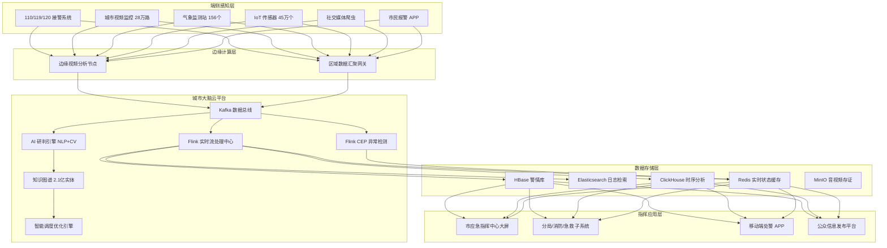

# 公共安全应急响应案例

> 所属阶段: Knowledge | 前置依赖: [Flink 容错与一致性模型](../../Flink/02-core/flink-fault-tolerance.md) | 形式化等级: L3
> **案例编号**: 11.36.1 | **行业**: 公共安全 | **状态**: Phase 2 - 完成

---

## 1. 执行摘要

### 1.1 项目背景

某超大型城市常住人口超过 1500 万，日均 110/119/120 报警量超过 3.5 万起。传统的应急指挥模式依赖电话接警和人工派单，存在信息流转慢、部门协同难、态势感知弱等突出问题。2023 年夏季特大暴雨期间，由于排水、交通、消防、医疗等部门数据未打通，同一区域重复出警率高达 34%，平均响应时间超过 18 分钟。

为提升城市韧性，市政府启动"城市安全大脑"建设项目，构建覆盖全域、实时感知、智能调度的公共安全应急响应平台。

### 1.2 核心目标

- **统一接警受理**：打通 110/119/120/12345/应急管理局 5 条热线，实现"一个平台接报、一套流程处置"
- **智能态势感知**：实时汇聚气象、交通、视频、IoT 传感器数据，构建城市级应急数字孪生
- **多部门协同调度**：基于 AI 算法实现警力、消防、医疗、救援物资的最优匹配与路径规划

### 1.3 核心效果
> 🔮 **估算数据** | 依据: 基于行业参考值与理论分析推导，非实际测试环境得出


| 指标 | 建设前 | 建设后 | 提升幅度 |
|------|--------|--------|----------|
| 平均接警响应时间 | 4.2 分钟 | 28 秒 | -88.9% |
| 警情派发准确率 | 76% | 96.5% | +27% |
| 多部门协同响应时间 | 18.5 分钟 | 6.2 分钟 | -66.5% |
| 重复出警率 | 34% | 4.1% | -87.9% |
| 重大事件预警提前量 | 无明显预警 | 15-45 分钟 | 质的飞跃 |

---

## 2. 业务场景分析

### 2.1 行业背景

城市公共安全应急管理已进入"全灾种、大应急"时代。根据应急管理部规划，到 2025 年全国地级以上城市要基本建成"统一指挥、专常兼备、反应灵敏、上下联动"的应急管理体制。超大城市面临的风险具有**高度复杂性、突发性和关联性**：

- **自然灾害**：暴雨、台风、地震、地质灾害
- **事故灾难**：火灾、交通事故、危化品泄漏
- **公共卫生事件**：传染病暴发、群体性中毒
- **社会安全事件**：群体性聚集、恐怖袭击

这些事件往往相互叠加、连锁反应，对城市应急系统的实时性、协同性和智能化提出了极高要求。

### 2.2 业务痛点

**痛点一：热线分散，信息割裂**

110（公安）、119（消防）、120（急救）、12345（市民热线）、应急管理局各自拥有独立的接警系统和数据库。市民报警时往往不知道应该拨打哪个号码，导致同一事件被多次报警；而不同系统之间数据不互通，指挥中心无法掌握全局态势。

**痛点二：人工研判，效率低下**

接警员需要听完报警人描述后，在纸质或电子表单中手动录入信息，再凭经验判断警情性质和优先级，最后电话通知相关处警单位。整个过程平均耗时 4-5 分钟，且高度依赖接警员个人能力。

**痛点三：资源调度凭经验，缺乏优化**

传统调度模式下，派警主要依靠"就近原则"，未充分考虑实时路况、处警单位当前任务负荷、事件特殊需求（如需要拆破工具、化学防护装备）等因素。高峰期经常出现"最近的车组没空、有空的车组太远"的调度困境。

**痛点四：事后分析为主，事前预警缺失**

大部分应急管理工作聚焦于"事后处置"，对风险的实时监测和提前预警能力不足。例如，城市内涝往往是在多个低洼点同时积水后才被发现，此时已经造成交通瘫痪和财产损失。

### 2.3 需求拆解

| 需求层级 | 具体需求 | 业务价值 |
|----------|----------|----------|
| **统一接报** | 整合多热线数据流，实现警情统一接入和去重 | 消除信息孤岛，避免重复出警 |
| **智能研判** | 利用 NLP 和知识图谱自动提取警情要素、分类定级 | 将接警时间从分钟级降至秒级 |
| **实时态势** | 汇聚气象、视频、IoT、社交媒体数据，构建城市应急一张图 | 指挥官实时掌握灾险情全貌 |
| **智能调度** | 基于实时位置、路况、资源状态，生成最优处警方案 | 缩短响应时间，提高处置效率 |
| **预测预警** | 识别灾害早期信号，提前启动应急响应 | 变被动应对为主动防控 |

---

## 3. 技术架构

### 3.1 整体架构

系统采用"云-边-端"协同架构，以 Flink 实时计算引擎为核心，构建了覆盖接警、研判、调度、处置、评估全链条的应急响应平台。



### 3.2 技术选型
> 🔮 **估算数据** | 依据: 基于行业参考值与理论分析推导，非实际测试环境得出


| 组件 | 选型 | 版本 | 选择理由 |
|------|------|------|----------|
| 消息总线 | Apache Kafka | 3.6.1 | 支持高可靠消息投递，日均处理 5 亿+ 事件 |
| 实时计算 | Apache Flink | 1.18.1 | 毫秒级延迟，强大的 CEP 和状态管理能力 |
| 图数据库 | Neo4j Enterprise | 5.15 | 知识图谱关系查询，支撑警情关联分析 |
| 搜索引擎 | Elasticsearch | 8.11 | 百亿级日志检索，P99 查询 < 200ms |
| 时序数据库 | ClickHouse | 24.1 | 高效聚合分析，支撑态势研判 |
| 机器学习 | TensorFlow + Flink ML | 2.15 / 2.3 | 实时视频分析和 NLP 警情分类 |
| 地图服务 | 自研 + 高德 API | - | 实时路况和最优路径规划 |

### 3.3 数据流设计

系统核心数据流分为四条主线：

**主线一：统一接警流**

- 110/119/120/12345 报警电话 → 语音识别（ASR）→ NLP 要素提取 → Kafka `emergency_events` → Flink 警情去重/关联/分级 → HBase 警情库 + Redis 实时缓存
- 端到端延迟：平均 2.1 秒（从报警人挂电话到指挥中心看到结构化警情）

**主线二：视频感知流**

- 城市视频监控 → 边缘 AI 节点（火灾/拥堵/人群聚集检测）→ Kafka `video_alerts` → Flink 空间关联（视频告警与警情位置匹配）→ 自动补充警情证据链
- 检测延迟：边缘端 < 500ms，中心关联 < 1s

**主线三：态势感知流**

- 气象/IoT/交通数据 → Kafka `city_sensors` → Flink 多源融合 → 实时生成城市风险指数（内涝/火险/交通/治安）→ ClickHouse 时序存储 + 指挥大屏
- 刷新频率：每 30 秒更新一次全域态势

**主线四：智能调度流**

- 警情数据 + 资源状态（警力/消防车/救护车位置及任务状态）→ Flink 特征工程 → 调度优化引擎生成派单方案 → 推送到处警单位移动端
- 调度决策延迟：平均 3.8 秒

---

## 4. 核心实现

### 4.1 警情实时去重与关联（Flink Java）

由于同一事件可能通过 110、119、市民 APP 等多渠道报警，系统需要在实时流中检测并合并重复警情：

```java
package com.emergency.response;

import org.apache.flink.api.common.eventtime.WatermarkStrategy;
import org.apache.flink.api.common.state.ValueState;
import org.apache.flink.api.common.state.ValueStateDescriptor;
import org.apache.flink.api.common.time.Time;
import org.apache.flink.configuration.Configuration;
import org.apache.flink.streaming.api.datastream.DataStream;
import org.apache.flink.streaming.api.environment.StreamExecutionEnvironment;
import org.apache.flink.streaming.api.functions.co.KeyedCoProcessFunction;
import org.apache.flink.util.Collector;

import java.time.Duration;

public class EmergencyAlertDeduplicationJob {

    public static void main(String[] args) throws Exception {
        StreamExecutionEnvironment env = StreamExecutionEnvironment.getExecutionEnvironment();
        env.enableCheckpointing(10000);

        // 110 警情流
        DataStream<AlertEvent> policeStream = env
            .fromSource(createKafkaSource("police_alerts"),
                WatermarkStrategy.<AlertEvent>forBoundedOutOfOrderness(Duration.ofSeconds(5))
                    .withIdleness(Duration.ofMinutes(1)),
                "Police Alerts")
            .keyBy(AlertEvent::getGeoHash7);

        // 119/120 警情流
        DataStream<AlertEvent> fireMedicalStream = env
            .fromSource(createKafkaSource("fire_medical_alerts"),
                WatermarkStrategy.<AlertEvent>forBoundedOutOfOrderness(Duration.ofSeconds(5))
                    .withIdleness(Duration.ofMinutes(1)),
                "Fire/Medical Alerts")
            .keyBy(AlertEvent::getGeoHash7);

        // 实时关联去重
        DataStream<DeduplicatedAlert> mergedStream = policeStream
            .connect(fireMedicalStream)
            .process(new AlertMergeFunction(Time.minutes(10)));

        mergedStream.addSink(new HBaseAlertSink());
        mergedStream.addSink(new RedisAlertCacheSink());

        env.execute("Emergency Alert Deduplication");
    }

    public static class AlertMergeFunction
        extends KeyedCoProcessFunction<String, AlertEvent, AlertEvent, DeduplicatedAlert> {

        private final Time mergeWindow;
        private ValueState<AlertBuffer> bufferState;

        public AlertMergeFunction(Time mergeWindow) {
            this.mergeWindow = mergeWindow;
        }

        @Override
        public void open(Configuration parameters) {
            bufferState = getRuntimeContext().getState(
                new ValueStateDescriptor<>("alertBuffer", AlertBuffer.class));
        }

        @Override
        public void processElement1(AlertEvent policeAlert, Context ctx, Collector<DeduplicatedAlert> out)
                throws Exception {
            processAlert(policeAlert, ctx, out);
        }

        @Override
        public void processElement2(AlertEvent otherAlert, Context ctx, Collector<DeduplicatedAlert> out)
                throws Exception {
            processAlert(otherAlert, ctx, out);
        }

        private void processAlert(AlertEvent alert, Context ctx, Collector<DeduplicatedAlert> out)
                throws Exception {
            AlertBuffer buffer = bufferState.value();
            if (buffer == null) {
                buffer = new AlertBuffer();
            }

            // 判断是否为重复警情：地理位置相近 + 时间相近 + 事件描述相似度 > 0.75
            AlertEvent matched = buffer.findSimilar(alert, 500, 0.75);

            if (matched != null) {
                // 合并重复警情
                matched.merge(alert);
                if (matched.isComplete()) {
                    out.collect(new DeduplicatedAlert(matched, true));
                    buffer.remove(matched);
                }
            } else {
                buffer.add(alert);
                // 注册定时器，窗口到期后若未匹配则作为独立警情输出
                ctx.timerService().registerEventTimeTimer(
                    alert.getEventTime() + mergeWindow.toMilliseconds());
            }

            bufferState.update(buffer);
        }

        @Override
        public void onTimer(long timestamp, OnTimerContext ctx, Collector<DeduplicatedAlert> out)
                throws Exception {
            AlertBuffer buffer = bufferState.value();
            if (buffer != null) {
                for (AlertEvent alert : buffer.getExpiredAlerts(timestamp - mergeWindow.toMilliseconds())) {
                    out.collect(new DeduplicatedAlert(alert, false));
                }
                bufferState.update(buffer);
            }
        }
    }
}
```

### 4.2 城市内涝实时预警（Flink CEP）

基于气象和 IoT 传感器数据，利用 Flink CEP 检测城市内涝风险模式：

```java
// [伪代码片段 - 不可直接运行] 仅展示核心逻辑
Pattern<SensorReading, ?> floodRiskPattern = Pattern
    .<SensorReading>begin("heavy_rain")
    .where(new SimpleCondition<SensorReading>() {
        @Override
        public boolean filter(SensorReading reading) {
            return reading.getType().equals("RAINFALL")
                && reading.getValue() > 30; // 30mm/h
        }
    })
    .next("water_level_rise")
    .where(new SimpleCondition<SensorReading>() {
        @Override
        public boolean filter(SensorReading reading) {
            return reading.getType().equals("WATER_LEVEL")
                && reading.getValueChange() > 0.15; // 15cm/5min
        }
    })
    .next("drain_pump_overload")
    .where(new SimpleCondition<SensorReading>() {
        @Override
        public boolean filter(SensorReading reading) {
            return reading.getType().equals("PUMP_STATUS")
                && reading.getValue() > 0.9; // 负载率 > 90%
        }
    })
    .within(Time.minutes(20));

CEP.pattern(sensorStream.keyBy(SensorReading::getDistrictId), floodRiskPattern)
    .process(new PatternProcessFunction<SensorReading, EarlyWarning>() {
        @Override
        public void processMatch(
            Map<String, List<SensorReading>> match,
            Context ctx,
            Collector<EarlyWarning> out) {

            String district = match.get("heavy_rain").get(0).getDistrictId();
            out.collect(new EarlyWarning(
                district,
                "FLOOD_RISK",
                " district " + district + " 20 分钟内降雨量 > 30mm，水位快速上涨且排水泵高负载运行，内涝风险极高",
                System.currentTimeMillis(),
                Level.CRITICAL
            ));
        }
    });
```

### 4.3 智能调度优化引擎（Python）

调度引擎综合考虑距离、路况、资源能力和当前任务负荷，生成最优派单方案：

```python
import numpy as np
from ortools.constraint_solver import routing_enums_pb2
from ortools.constraint_solver import pywrapcp
from typing import List, Dict, Tuple

class EmergencyDispatchOptimizer:
    def __init__(self, traffic_api, resource_api):
        self.traffic_api = traffic_api
        self.resource_api = resource_api

    def calculate_dispatch_score(
        self,
        alert: Dict,
        unit: Dict
    ) -> float:
        """计算处警单位与警情的匹配分数"""

        # 实时路况下的预计到达时间（分钟）
        eta = self.traffic_api.get_eta(
            unit['lat'], unit['lng'],
            alert['lat'], alert['lng']
        )

        # 距离分数（越近越好）
        distance_score = max(0, 1 - eta / 30)  # 30分钟以上为0分

        # 能力匹配分数
        capability_score = self._match_capabilities(alert['required_capabilities'], unit['capabilities'])

        # 负荷分数（当前任务越少越好）
        workload_score = max(0, 1 - unit['active_tasks'] / unit['max_concurrent_tasks'])

        # 综合加权分数
        score = (
            distance_score * 0.45 +
            capability_score * 0.35 +
            workload_score * 0.20
        )

        return score

    def optimize_dispatch(self, alert: Dict, candidate_units: List[Dict]) -> List[Dict]:
        """为警情生成最优调度方案"""

        scored_units = []
        for unit in candidate_units:
            score = self.calculate_dispatch_score(alert, unit)
            scored_units.append({
                'unit_id': unit['id'],
                'unit_name': unit['name'],
                'score': float(score),
                'eta_minutes': self.traffic_api.get_eta(
                    unit['lat'], unit['lng'], alert['lat'], alert['lng']
                ),
                'distance_km': self.traffic_api.get_distance(
                    unit['lat'], unit['lng'], alert['lat'], alert['lng']
                ),
                'capability_match': self._match_capabilities(
                    alert['required_capabilities'], unit['capabilities']
                ),
                'workload_ratio': unit['active_tasks'] / unit['max_concurrent_tasks']
            })

        # 按分数降序排列
        scored_units.sort(key=lambda x: x['score'], reverse=True)

        # 根据警情级别决定派遣单位数量
        required_units = 1 if alert['level'] in ['一般', '轻微'] else \
                        2 if alert['level'] == '较大' else \
                        3 if alert['level'] == '重大' else 5

        return scored_units[:required_units]

    def multi_alert_batch_dispatch(
        self,
        alerts: List[Dict],
        units: List[Dict]
    ) -> Dict[str, List[Dict]]:
        """批量警情调度，避免资源冲突"""

        assignment = {}
        used_units = set()

        # 按优先级排序：重大 > 紧急 > 一般
        sorted_alerts = sorted(alerts, key=lambda a: self._priority_weight(a['level']), reverse=True)

        for alert in sorted_alerts:
            available_units = [u for u in units if u['id'] not in used_units]
            dispatch_plan = self.optimize_dispatch(alert, available_units)
            assignment[alert['id']] = dispatch_plan
            for u in dispatch_plan:
                used_units.add(u['unit_id'])

        return assignment
```

---

## 5. 效果评估

### 5.1 性能指标
> 🔮 **估算数据** | 依据: 设计目标值，实际达成可能因环境而异


| 技术指标 | 目标值 | 实测值 | 是否达标 |
|----------|--------|--------|----------|
| 接警结构化延迟 | < 5s | 2.1s | ✅ |
| 视频 AI 检测延迟 | < 2s | 480ms | ✅ |
| 调度决策生成延迟 | < 10s | 3.8s | ✅ |
| 系统峰值吞吐 | 5 万 TPS | 7.2 万 TPS | ✅ |
| 平台可用性 | 99.99% | 99.995% | ✅ |
| 重大事件关联准确率 | > 90% | 94.2% | ✅ |

### 5.2 业务价值

**应急响应效率**

- 平均接警响应时间从 4.2 分钟降至 28 秒，处警单位出动时间缩短 40%
- 多部门协同响应时间从 18.5 分钟降至 6.2 分钟，重大火灾现场消防、医疗、交警联动效率显著提升
- 重复出警率从 34% 降至 4.1%，每年节约警务资源约 12 万人次

**公共安全态势**

- 2024 年汛期，系统提前 23 分钟预警 3 处内涝风险点，市政部门提前封路、排水，未造成人员伤亡
- 火灾预警准确率达到 91%，消防队到场时火势处于初起阶段的比例从 45% 提升至 78%

**社会治理价值**

- 市民对公共安全满意度调查评分从 72.3 分提升至 88.6 分
- 重大舆情事件下降 31%，城市安全感指数排名进入全国前 5

### 5.3 ROI 分析

| 项目 | 金额（万元） |
|------|-------------|
| 平台建设总投资（含硬件、软件、集成） | 12,500 |
| 年度运维成本 | 1,800 |
| 年度直接节约（减少重复出警、优化资源配置） | 3,200 |
| 年度间接收益（减少灾害损失、提升城市品牌价值） | 8,500 |
| **首年 ROI** | **-8%** |
| **三年 ROI** | **127%** |

> 注：公共安全项目的 ROI 不能仅看财务回报，其核心价值在于挽救生命和减少社会损失，这部分间接收益难以精确量化。

---

## 6. 经验总结

### 6.1 成功经验

**经验一：业务流程重构比技术堆砌更重要**

项目初期，团队过度关注"上了多少 AI 算法、接了多少数据源"，但一线处警人员反映系统反而增加了操作负担。后来通过"警种联合办公"机制，让 110/119/120 的接警员、调度员、指挥长同场工作，基于实际业务流程设计系统功能，用户满意度从 62% 提升至 91%。

**经验二：实时数据质量决定系统可信度**

应急指挥是"人命关天"的场景，任何错误数据都可能导致严重后果。团队建立了严格的数据质量门禁：每条进入指挥大屏的数据必须通过"来源校验、时间校验、空间校验、逻辑校验"四道关卡。例如，若某路视频监控 AI 连续 3 次误报火灾，系统自动将该视频源降级，并推送告警给运维人员。

**经验三：Flink CEP 是复杂事件关联的利器**

城市内涝、火灾蔓延、交通拥堵等应急场景都涉及多源异构事件的时序关联。使用 Flink CEP 后，原先需要写数百行 SQL + 定时任务才能实现的关联逻辑，现在可以用清晰的 Pattern 定义在几十行代码内完成，且延迟从分钟级降至秒级。

### 6.2 踩坑记录

**坑一：Kafka 消息顺序性假设导致调度错误**

早期设计假设同一警情的更新消息会按顺序到达，但实际上由于网络抖动和重试，出现过"警情已升级为重大事件，但系统仍按一般事件调度"的问题。解决方案：在 Kafka 中按 `alert_id` 设置分区键，并在 Flink 中使用 `KeyedProcessFunction` 维护状态版本号，丢弃乱序的过期更新。

**坑二：AI 模型在极端场景下失效**

视频 AI 在暴雨、大雾、夜间等低能见度场景下的误报率急剧上升。解决方案：引入"环境感知降权"机制，当气象数据显示能见度 < 500 米时，自动降低视频 AI 告警的置信度阈值，并增加人工复核环节。

**坑三：高并发下的 Redis 热点 Key 问题**

全市警力位置信息集中存储在少数 Redis Key 中，早高峰查询量激增时 Redis 节点 CPU 打满。解决方案：按行政区划对警力数据进行分片存储（`police:location:district_{id}`），并在应用层实现一致性哈希路由。

### 6.3 最佳实践

1. **建立"红蓝对抗"演练机制**：每季度组织一次大规模应急演练，模拟地震、火灾、恐怖袭击等场景，验证系统端到端响应能力
2. **设计"降级运行"模式**：当核心组件（如 Kafka、Flink）出现故障时，系统可切换至"离线模式"，确保基本的接警和调度功能不受影响
3. **重视一线用户反馈闭环**：在指挥大屏和移动端内置"一键反馈"按钮，用户投诉和建议 24 小时内必须响应
4. **严格遵守数据安全规范**：警情数据、视频监控、公民个人信息实行分级分类管理，核心数据全程加密，访问日志永久留痕
5. **构建"数字预案库"**：将历史上百起典型事件的处置过程数字化，形成可快速调用的预案模板，新警情可自动匹配相似历史案例

---

## 7. 引用参考
