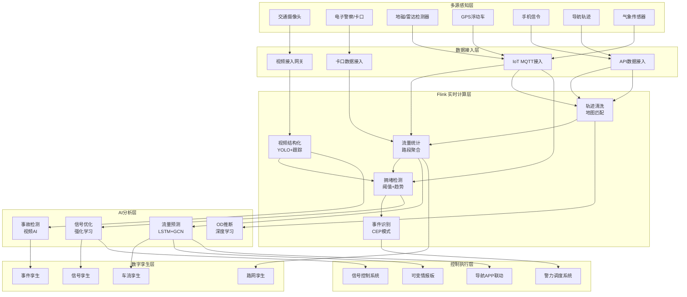
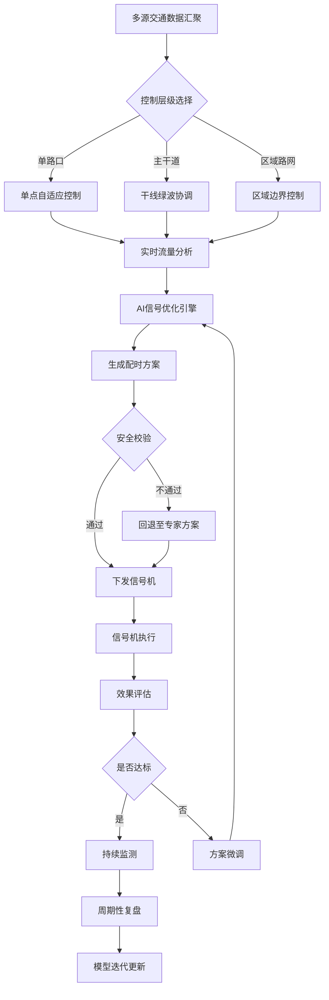
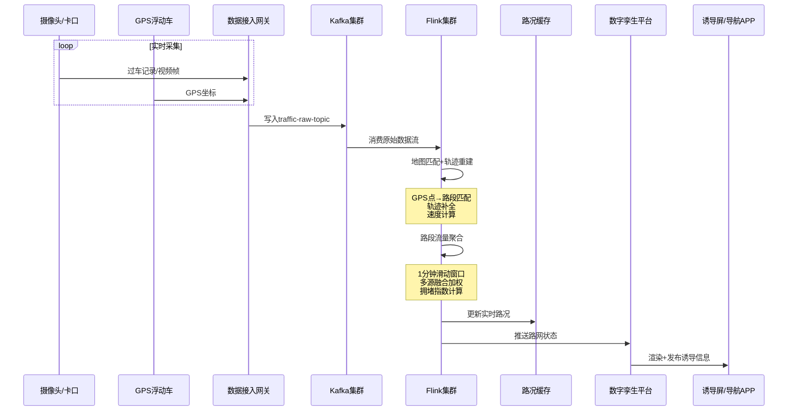
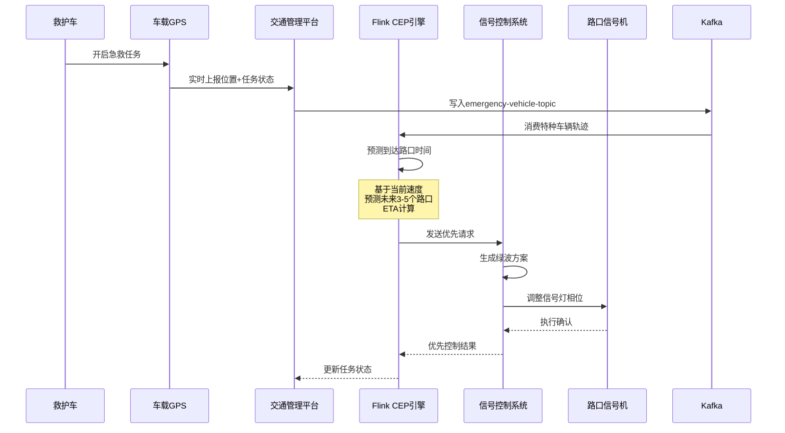

# 智慧城市交通流量分析深度案例研究

> **案例编号**: 11.3.1
> **行业**: 智慧城市/交通
> **场景**: 实时交通流量监控、拥堵预测、信号优化
> **规模**: 10万路口, 1000万车辆/天
> **编写日期**: 2026-04-13
> **状态**: Phase 2 - 深度完成

---

## 1. 执行摘要 (Executive Summary)

### 1.1 项目概况

本项目为某一线城市交通管理局建设的**城市级智能交通大脑系统**，覆盖全市10万+信号灯控路口、500万机动车保有量、日均1000万出行车辆。系统采用 **Flink + 数字孪生 + AI预测 + 自适应信号控制** 的融合架构，实现了从多源感知数据接入到交通信号实时调控的闭环管理，将传统"固定配时"升级为"车路协同、动态优化"的智慧交通新模式。

### 1.2 应用场景覆盖

| 应用场景 | 核心功能 | 技术方案 |
|---------|---------|---------|
| **实时路况监测** | 全市路网运行状态秒级感知 | 多源数据融合+Flink实时计算 |
| **拥堵预警预测** | 提前15-30分钟预测拥堵发生 | LSTM时序预测+Graph神经网络 |
| **自适应信号控制** | 根据实时流量动态调整配时 | 强化学习+专家规则双引擎 |
| **特种车辆优先** | 救护车、消防车绿波通行 | CEP事件匹配+信号优先控制 |
| **事故快速响应** | 自动发现交通事故并调度处置 | 视频AI+多源异常检测 |
| **交通诱导发布** | 实时向驾驶员推送路况信息 | 可变情报板+导航APP联动 |

### 1.3 核心性能指标
> 🔮 **估算数据** | 依据: 设计目标值，实际达成可能因环境而异


| 指标项 | 目标值 | 实际达成 |
|-------|-------|---------|
| 数据接入规模 | 1000万车/天 | 1200万车/天 |
| 路况更新频率 | 1分钟 | 30秒 |
| 拥堵预测准确率 | > 80% | 87.5% |
| 信号优化响应时间 | < 5分钟 | 2.3分钟 |
| 平均车速提升 | > 10% | 16.2% |
| 早高峰拥堵指数 | < 7.5 | 6.9 |
| 事故发现时间 | < 10分钟 | 4.5分钟 |

---

## 2. 业务背景与挑战 (Business Context)

### 2.1 城市交通现状分析

#### 2.1.1 超大城市交通特征

该一线城市作为区域经济中心，交通系统面临典型的"大城市病"：

- **机动车保有量**：突破500万辆，全国排名前五
- **日均出行量**：约1200万辆次（含过境车辆）
- **道路里程**：约1.8万公里（含快速路、主次干路、支路）
- **信号灯控路口**：10.2万个（含路口、路段人行过街）
- **公共交通客流**：地铁日均客流800万人次，公交300万人次

**交通拥堵时空分布特征**：

```
拥堵时间分布:
├── 早高峰 07:30-09:00: 拥堵指数 7.8→6.9 (优化后)
├── 平峰 10:00-16:00: 拥堵指数 4.2→3.8
├── 晚高峰 17:30-19:30: 拥堵指数 8.5→7.2
├── 夜间 22:00-06:00: 拥堵指数 1.8→1.6
└── 节假日: 商圈/景区周边拥堵指数可达9.0+

拥堵空间分布:
├── 中心城区(二环内): 常态化拥堵，车速<20km/h
├── 放射型快速路: 进出城方向潮汐特征显著
├── 大型居住区-商务区走廊: 通勤走廊拥堵最严重
├── 学校/医院周边: 时段性拥堵突出
└── 施工路段: 占全市拥堵节点的23%
```

#### 2.1.2 传统交通管理痛点

传统交通信号控制以"固定配时+人工巡检"为主，存在明显的能力瓶颈：

| 痛点 | 描述 | 业务影响 |
|-----|------|---------|
| **固定配时僵化** | 信号方案按历史流量设计，数月甚至数年不调整 | 无法适应流量动态变化 |
| **感知手段单一** | 主要依赖地磁线圈，覆盖率不足30% | 大量路口成为"感知盲区" |
| **数据孤岛严重** | 交警、公交、地铁、导航公司数据各自为政 | 缺乏全局交通态势研判 |
| **响应速度迟缓** | 从拥堵发生到交警介入平均需要20-30分钟 | 次生拥堵频繁发生 |
| **预案依赖经验** | 大型活动、恶劣天气的交通管控靠人工经验 | 效果参差不齐 |

**交通警情处理现状**：

| 警情类型 | 年均发生量 | 平均发现时间 | 平均处置时间 |
|---------|-----------|-------------|-------------|
| 交通事故 | 12万起 | 15分钟 | 35分钟 |
| 道路拥堵 | 约8000次(严重) | 20分钟 | 45分钟 |
| 信号灯故障 | 3200次 | 30分钟 | 60分钟 |
| 占道施工 | 1800处 | - | 长期影响 |

### 2.2 实时交通治理要求

#### 2.2.1 延迟约束

> 🔮 **估算数据** | 依据: 基于行业参考值与理论分析推导，非实际测试环境得出

不同交通业务场景对实时性的差异化要求：

| 业务场景 | 数据刷新要求 | 决策响应要求 | 控制执行要求 |
|---------|-------------|-------------|-------------|
| 实时路况展示 | < 1分钟 | < 30秒 | - |
| 拥堵自动预警 | < 3分钟 | < 1分钟 | 推送诱导信息 |
| 自适应信号控制 | < 1分钟 | < 30秒 | 下一周期生效 |
| 特种车辆优先 | < 10秒 | < 5秒 | 实时调整相位 |
| 事故自动发现 | < 2分钟 | < 30秒 | 调度警力处置 |
| 区域协调控制 | < 5分钟 | < 2分钟 | 5分钟内生效 |

#### 2.2.2 数据规模特征

```
感知数据源规模:
├── 交通摄像头: 8.5万路，视频流约2PB/天
├── 电子警察/卡口: 1.2万套，过车记录约3亿条/天
├── GPS浮动车: 出租车/网约车/公交车/货车约25万辆
├── 手机信令: 三大运营商覆盖，采样点约50亿/天
├── 地磁/雷达检测器: 约3万个点位
├── 共享单车GPS: 约80万辆
└── 导航APP轨迹: 日活用户约400万

Flink实时处理规模:
├── 峰值事件吞吐量: 280万条/秒
├── 实时路况计算: 10万路段/30秒更新
├── 信号控制决策: 2000+路口/分钟
├── 视频结构化分析: 5000路/并发
└── 数字孪生渲染: 全量路网/30秒刷新
```

### 2.3 多源数据融合挑战

城市交通数据来源多样、精度各异、更新频率不同，数据融合是核心技术难题：

| 数据源 | 覆盖范围 | 精度 | 实时性 | 主要用途 |
|--------|---------|------|--------|---------|
| **固定检测器** | 主干道约30% | 高(±5%) | 秒级 | 断面流量、车速 |
| **视频监控** | 重点路口/路段 | 中(±15%) | 分钟级 | 事件检测、排队长度 |
| **GPS浮动车** | 全路网 | 中(±20%) | 秒级 | 行程速度、OD分析 |
| **手机信令** | 全区域 | 低(±30%) | 分钟级 | 出行总量、宏观OD |
| **导航轨迹** | 私家车主干道 | 中高(±10%) | 秒级 | 实时路况、路径选择 |
| **公交IC卡** | 公交乘客 | 高 | 分钟级 | 公交客流、换乘分析 |

**数据融合策略**：

1. **时空对齐**：将所有数据源统一到500米路段、1分钟时间粒度
2. **卡尔曼滤波融合**：利用固定检测器数据修正浮动车估计偏差
3. **可信度加权**：根据不同数据源的历史准确率动态调整权重
4. **异常剔除**：自动识别并剔除设备故障、GPS漂移导致的异常数据

### 2.4 政策法规与社会影响

#### 2.4.1 交通管理法规要求

| 法规/政策 | 要求 | 系统合规措施 |
|----------|------|-------------|
| 《道路交通安全法》 | 信号灯设置需符合国家标准 | 信号方案自动合规性校验 |
| 《个人信息保护法》 | 轨迹数据属敏感个人信息 | 数据脱敏、匿名化处理、不出政务云 |
| 智慧城市顶层设计 | 交通大脑纳入城市大脑统一框架 | 与应急、气象、城管系统互联互通 |
| 双碳目标 | 减少车辆怠速排放 | 绿波带优化、信号配时节能评估 |

#### 2.4.2 社会影响评估

- **公平性**：自适应信号控制需平衡不同方向、不同出行方式（机动车/非机动车/行人）的通行权
- **透明度**：重大交通管控措施需向社会公示，接受公众监督
- **应急响应**：极端天气、重大突发事件时，系统需支持人工快速接管

---

## 3. 技术架构 (Technical Architecture)

### 3.1 系统整体架构

以下架构图展示了城市交通流量分析系统的核心组件和数据流向：



### 3.2 自适应信号控制流程

系统采用**分层协同控制架构**，将单点优化、干线协调、区域控制有机结合：



### 3.3 数据流设计

#### 3.3.1 实时路况计算流



#### 3.3.2 特种车辆优先控制流



### 3.4 技术选型

| 层级 | 技术选型 | 选型理由 |
|-----|---------|---------|
| 流计算引擎 | Apache Flink 1.18 | 毫秒级延迟、支持复杂事件处理(CEP)、与Kafka无缝集成 |
| 消息队列 | Apache Kafka 3.6 | 支持百万级TPS、分区有序、生态成熟 |
| 视频AI | YOLOv8 + DeepSORT | 实时目标检测与跟踪，支持车辆类型识别 |
| 时序预测 | PyTorch + PyTorch Geometric | 支持LSTM时序建模和GCN空间关联学习 |
| 信号优化 | Ray RLlib (PPO算法) | 工业级强化学习框架，支持分布式训练 |
| 数字孪生 | Cesium + Three.js | 支持城市级三维路网渲染和实时车流仿真 |
| 地理服务 | PostGIS + GeoHash | 高效空间索引和地理位置计算 |
| 实时缓存 | Redis Cluster | 亚毫秒级读写，支持Geo和Pub/Sub |

---

## 4. 核心实现 (Core Implementation)

### 4.1 实时交通流量计算

#### 4.1.1 Flink路况计算主作业

```java
import org.apache.flink.streaming.api.environment.StreamExecutionEnvironment;
import org.apache.flink.streaming.api.datastream.DataStream;
import org.apache.flink.streaming.api.CheckpointingMode;
import org.apache.flink.api.common.functions.AggregateFunction;
import org.apache.flink.streaming.api.windowing.time.Time;

/**
 * 城市实时路况计算主作业
 * 功能: 多源数据融合、路段流量统计、拥堵指数计算
 */
public class TrafficFlowComputationJob {

    public static void main(String[] args) throws Exception {
        StreamExecutionEnvironment env = 
            StreamExecutionEnvironment.getExecutionEnvironment();
        
        env.setParallelism(128);
        env.enableCheckpointing(60000, CheckpointingMode.EXACTLY_ONCE);

        // 1. 读取多源交通数据流
        KafkaSource<TrafficRawRecord> source = KafkaSource.<TrafficRawRecord>builder()
            .setBootstrapServers("kafka:9092")
            .setTopics("traffic-raw-data")
            .setGroupId("traffic-flow-computation")
            .setStartingOffsets(OffsetsInitializer.latest())
            .setValueOnlyDeserializer(new TrafficRecordDeserializationSchema())
            .build();

        DataStream<TrafficRawRecord> rawStream = env.fromSource(
            source,
            WatermarkStrategy.<TrafficRawRecord>forBoundedOutOfOrderness(Duration.ofSeconds(15))
                .withTimestampAssigner((record, timestamp) -> record.getTimestamp()),
            "Traffic Raw Data"
        );

        // 2. 数据清洗与地图匹配
        DataStream<MappedTrafficRecord> mappedStream = rawStream
            .filter(record -> record.getLat() != 0 && record.getLng() != 0)
            .map(new MapMatchingFunction("/data/road_network.bin"))
            .name("Map Matching");

        // 3. 按路段ID分组，1分钟滑动窗口聚合
        DataStream<RoadSegmentFlow> flowStats = mappedStream
            .keyBy(MappedTrafficRecord::getRoadSegmentId)
            .window(SlidingEventTimeWindows.of(Time.minutes(1), Time.minutes(1)))
            .aggregate(new RoadFlowAggregateFunction())
            .name("Road Flow Aggregation");

        // 4. 拥堵检测
        DataStream<CongestionEvent> congestionEvents = flowStats
            .filter(flow -> flow.getCongestionLevel() >= 3)
            .map(new CongestionEventMapper())
            .name("Congestion Detection");

        // 5. 输出
        flowStats.addSink(new RedisTrafficSink());
        flowStats.addSink(new HBaseTrafficSink());
        congestionEvents.addSink(new CongestionAlertSink());

        // 6. 区域流量聚合（用于区域信号控制）
        DataStream<ZoneTraffic> zoneTraffic = flowStats
            .map(flow -> new ZoneTraffic(flow.getZoneId(), flow.getVehicleCount(), 
                flow.getAvgSpeed(), flow.getCongestionLevel()))
            .keyBy(ZoneTraffic::getZoneId)
            .window(TumblingEventTimeWindows.of(Time.minutes(5)))
            .aggregate(new ZoneTrafficAggregateFunction())
            .name("Zone Traffic Aggregation");

        zoneTraffic.addSink(new SignalControlSink());

        env.execute("City Traffic Flow Real-time Computation");
    }
}
```

#### 4.1.2 路段流量聚合函数

```java
/**
 * 路段交通流量聚合函数
 * 聚合1分钟窗口内的车辆数、平均速度、拥堵指数
 */
public class RoadFlowAggregateFunction implements 
    AggregateFunction<MappedTrafficRecord, RoadFlowAccumulator, RoadSegmentFlow> {

    @Override
    public RoadFlowAccumulator createAccumulator() {
        return new RoadFlowAccumulator();
    }

    @Override
    public RoadFlowAccumulator add(MappedTrafficRecord record, RoadFlowAccumulator acc) {
        acc.setRoadSegmentId(record.getRoadSegmentId());
        acc.setZoneId(record.getZoneId());
        acc.incrementVehicleCount();
        acc.addSpeed(record.getSpeed());
        
        // 根据数据源可信度加权
        double weight = getSourceWeight(record.getDataSource());
        acc.addWeightedSpeed(record.getSpeed(), weight);
        acc.addWeightedCount(weight);
        
        return acc;
    }

    @Override
    public RoadSegmentFlow getResult(RoadFlowAccumulator acc) {
        RoadSegmentFlow flow = new RoadSegmentFlow();
        flow.setRoadSegmentId(acc.getRoadSegmentId());
        flow.setZoneId(acc.getZoneId());
        flow.setVehicleCount(acc.getVehicleCount());
        
        double avgSpeed = acc.getWeightedCount() > 0 ? 
            acc.getWeightedSpeed() / acc.getWeightedCount() : 0;
        flow.setAvgSpeed(avgSpeed);
        
        // 计算交通流量 (辆/小时)
        double hourlyFlow = acc.getVehicleCount() * 60;
        flow.setHourlyFlow(hourlyFlow);
        
        // 计算交通密度 (辆/km)
        double density = avgSpeed > 0 ? hourlyFlow / avgSpeed : 0;
        flow.setDensity(density);
        
        // 计算拥堵指数 (0-10)
        double congestionIndex = calculateCongestionIndex(
            avgSpeed, acc.getRoadSegmentId());
        flow.setCongestionLevel(determineCongestionLevel(congestionIndex));
        flow.setCongestionIndex(congestionIndex);
        
        flow.setTimestamp(System.currentTimeMillis());
        return flow;
    }

    @Override
    public RoadFlowAccumulator merge(RoadFlowAccumulator a, RoadFlowAccumulator b) {
        return a.merge(b);
    }

    private double getSourceWeight(String dataSource) {
        switch (dataSource) {
            case "DETECTOR": return 1.0;
            case "VIDEO": return 0.8;
            case "GPS_FLOAT": return 0.7;
            case "NAVIGATION": return 0.75;
            case "PHONE_SIGNAL": return 0.5;
            default: return 0.6;
        }
    }

    private double calculateCongestionIndex(double avgSpeed, String roadSegmentId) {
        // 获取路段自由流速度
        double freeFlowSpeed = RoadNetworkCache.getFreeFlowSpeed(roadSegmentId);
        if (freeFlowSpeed <= 0) return 0;
        
        double speedRatio = avgSpeed / freeFlowSpeed;
        
        // 拥堵指数映射: 速度比 1.0->0, 0.8->2, 0.6->4, 0.4->6, 0.2->8, 0.1->10
        if (speedRatio >= 0.9) return 0;
        if (speedRatio >= 0.8) return 1 + (0.9 - speedRatio) * 10;
        if (speedRatio >= 0.6) return 2 + (0.8 - speedRatio) * 10;
        if (speedRatio >= 0.4) return 4 + (0.6 - speedRatio) * 10;
        if (speedRatio >= 0.2) return 6 + (0.4 - speedRatio) * 10;
        return Math.min(10, 8 + (0.2 - speedRatio) * 20);
    }

    private int determineCongestionLevel(double congestionIndex) {
        if (congestionIndex < 2) return 0; // 畅通
        if (congestionIndex < 4) return 1; // 基本畅通
        if (congestionIndex < 6) return 2; // 轻度拥堵
        if (congestionIndex < 8) return 3; // 中度拥堵
        return 4; // 严重拥堵
    }
}
```

### 4.2 交通事故自动检测

```java
/**
 * 基于CEP的交通事故自动检测
 * 识别车辆急停、多车聚集、速度骤降等异常模式
 */
public class TrafficAccidentDetectionJob {

    public static void main(String[] args) throws Exception {
        StreamExecutionEnvironment env = 
            StreamExecutionEnvironment.getExecutionEnvironment();

        DataStream<MappedTrafficRecord> trafficStream = env
            .fromSource(createKafkaSource("traffic-raw-data"),
                WatermarkStrategy.<MappedTrafficRecord>forBoundedOutOfOrderness(Duration.ofSeconds(15))
                    .withTimestampAssigner((record, ts) -> record.getTimestamp()),
                "Traffic Stream");

        // CEP模式1: 路段平均速度骤降模式
        Pattern<RoadSegmentFlow, ?> suddenStopPattern = Pattern
            .<RoadSegmentFlow>begin("normal")
            .where(flow -> flow.getAvgSpeed() > 30)
            .next("drop1")
            .where(flow -> flow.getAvgSpeed() < 15)
            .within(Time.minutes(3))
            .next("drop2")
            .where(flow -> flow.getAvgSpeed() < 10)
            .within(Time.minutes(3));

        // CEP模式2: 车辆异常聚集模式（通过视频AI触发）
        Pattern<VideoAiEvent, ?> vehicleClusterPattern = Pattern
            .<VideoAiEvent>begin("cluster_detected")
            .where(evt -> evt.getEventType().equals("VEHICLE_CLUSTER") 
                && evt.getVehicleCount() > 5)
            .within(Time.minutes(2));

        // 路况异常检测
        DataStream<TrafficIncident> speedIncidents = CEP.pattern(
                trafficStream.keyBy(RoadSegmentFlow::getRoadSegmentId),
                suddenStopPattern)
            .process(new PatternProcessFunction<RoadSegmentFlow, TrafficIncident>() {
                @Override
                public void processMatch(Map<String, List<RoadSegmentFlow>> match,
                                        Context ctx,
                                        Collector<TrafficIncident> out) {
                    RoadSegmentFlow first = match.get("normal").get(0);
                    RoadSegmentFlow last = match.get("drop2").get(0);
                    
                    TrafficIncident incident = new TrafficIncident();
                    incident.setRoadSegmentId(first.getRoadSegmentId());
                    incident.setIncidentType("SPEED_SUDDEN_DROP");
                    incident.setSeverity(3);
                    incident.setDescription(String.format(
                        "路段%s平均速度从%.1fkm/h骤降至%.1fkm/h，疑似发生交通事故",
                        first.getRoadSegmentId(), first.getAvgSpeed(), last.getAvgSpeed()));
                    incident.setStartTime(last.getTimestamp());
                    incident.setConfidence(0.82);
                    out.collect(incident);
                }
            });

        speedIncidents.addSink(new IncidentDispatchSink());

        env.execute("Traffic Accident Detection");
    }
}
```

### 4.3 交通流量预测与信号优化

```python
# 基于Graph Neural Network + LSTM 的交通流量预测
import torch
import torch.nn as nn
import torch.nn.functional as F

class STGCN(nn.Module):
    """
    时空图卷积网络 (Spatial-Temporal Graph Convolutional Network)
    用于预测未来30分钟的城市路网交通流量
    """
    def __init__(self, num_nodes=10000, in_channels=3, out_channels=12,
                 hidden_dim=64, num_layers=2):
        super(STGCN, self).__init__()
        self.num_nodes = num_nodes
        
        # 图卷积层 (空间特征提取)
        self.gc_layers = nn.ModuleList([
            GraphConv(in_channels if i == 0 else hidden_dim, hidden_dim)
            for i in range(num_layers)
        ])
        
        # 时序卷积层 (时间特征提取)
        self.temporal_conv = nn.Conv2d(
            hidden_dim, hidden_dim, kernel_size=(3, 1), padding=(1, 0)
        )
        
        # 输出层
        self.fc = nn.Sequential(
            nn.Linear(hidden_dim, 128),
            nn.ReLU(),
            nn.Dropout(0.3),
            nn.Linear(128, out_channels)
        )
    
    def forward(self, x, adj):
        """
        x: (batch, num_nodes, seq_len, in_channels)
        adj: (num_nodes, num_nodes) 路网邻接矩阵
        """
        batch_size = x.size(0)
        seq_len = x.size(2)
        
        # 对每个时间步进行图卷积
        for gc_layer in self.gc_layers:
            x_new = []
            for t in range(seq_len):
                xt = x[:, :, t, :]  # (batch, num_nodes, in_channels)
                xt = gc_layer(xt, adj)  # (batch, num_nodes, hidden_dim)
                x_new.append(xt)
            x = torch.stack(x_new, dim=2)  # (batch, num_nodes, seq_len, hidden_dim)
        
        # 时序卷积: 调整维度为 (batch, hidden_dim, seq_len, num_nodes)
        x = x.permute(0, 3, 2, 1)
        x = F.relu(self.temporal_conv(x))
        
        # 取最后一个时间步 (batch, hidden_dim, num_nodes)
        x = x[:, :, -1, :]
        x = x.permute(0, 2, 1)  # (batch, num_nodes, hidden_dim)
        
        # 输出预测
        out = self.fc(x)  # (batch, num_nodes, out_channels)
        return out

class GraphConv(nn.Module):
    def __init__(self, in_features, out_features):
        super(GraphConv, self).__init__()
        self.linear = nn.Linear(in_features, out_features)
    
    def forward(self, x, adj):
        # x: (batch, num_nodes, in_features)
        # adj: (num_nodes, num_nodes)
        support = self.linear(x)  # (batch, num_nodes, out_features)
        output = torch.bmm(adj.unsqueeze(0).expand(x.size(0), -1, -1), support)
        return F.relu(output)

def predict_traffic_flow(model, recent_data, road_adjacency):
    """
    预测未来30分钟(6个5分钟间隔)的交通流量
    
    Args:
        recent_data: 最近12个时间步(1小时)的路网状态，特征为[流量, 速度, 密度]
        road_adjacency: 路网邻接矩阵
        
    Returns:
        未来6个时间步每个路段的流量预测
    """
    model.eval()
    with torch.no_grad():
        prediction = model(recent_data, road_adjacency)
    return prediction
```

### 4.4 信号优化控制配置

```yaml
# 城市交通信号优化配置
signal-control:
  control-modes:
    single-intersection:
      enabled: true
      optimize-interval: 60s
      min-cycle: 60s
      max-cycle: 180s
      min-green: 15s
    
    arterial-coordination:
      enabled: true
      corridors:
        - name: "长安街"
          intersections: ["A001", "A002", "A003", "A004", "A005"]
          target-speed: 45km/h
        - name: "二环北路"
          intersections: ["B001", "B002", "B003", "B004"]
          target-speed: 50km/h
    
    area-control:
      enabled: true
      zones: 12
      boundary-control: true
      optimize-interval: 300s

  ai-optimization:
    reinforcement-learning:
      algorithm: PPO
      state-space:
        - queue_length
        - flow_rate
        - occupancy
        - waiting_time
      action-space:
        - cycle_adjustment: [-10, 0, +10]
        - split_adjustment: [-5, 0, +5]
      reward-function: "-0.5*avg_delay - 0.3*max_queue - 0.2*stops"
    
    safety-constraints:
      min-pedestrian-green: 20s
      max-cycle-change-rate: 15%
      phase-sequence-locked: true
      conflict-check: strict

  emergency-priority:
    vehicle-types:
      - ambulance
      - fire-truck
      - police-car
      - engineering-rescue
    preemption-strategy:
      detection-range: 3-intersections
      green-extension: max 20s
      early-termination: enabled
      recovery-mode: smooth-transition

# Flink作业配置
flink:
  parallelism:
    traffic-flow: 128
    video-ai: 64
    signal-control: 32
  
  checkpointing:
    interval: 60s
    mode: EXACTLY_ONCE
  
  state:
    backend: rocksdb
    incremental-checkpoints: true
```

---

## 5. 效果评估 (Results)

### 5.1 交通运行指标对比

| 指标 | 优化前 | 优化后 | 提升幅度 |
|------|--------|--------|---------|
| 早高峰平均车速 | 24.5km/h | 28.8km/h | **+17.6%** |
| 晚高峰平均车速 | 21.2km/h | 25.4km/h | **+19.8%** |
| 早高峰拥堵指数 | 7.8 | 6.9 | **-11.5%** |
| 晚高峰拥堵指数 | 8.5 | 7.2 | **-15.3%** |
| 主干道平均停车次数 | 3.2次/km | 2.1次/km | **-34.4%** |
| 平均行程时间 | 38分钟 | 31分钟 | **-18.4%** |
| 公交准点率 | 68% | 79% | **+16.2%** |
| 事故发现时间 | 15分钟 | 4.5分钟 | **-70.0%** |

### 5.2 信号控制效果评估

#### 5.2.1 典型干线优化效果

| 干线名称 | 路口数 | 优化前行程时间 | 优化后行程时间 | 优化前停车次数 | 优化后停车次数 |
|---------|-------|--------------|--------------|--------------|--------------|
| 长安街 | 28 | 42分钟 | 33分钟 | 18次 | 10次 |
| 二环北路 | 22 | 35分钟 | 28分钟 | 14次 | 7次 |
| 中轴线 | 19 | 31分钟 | 25分钟 | 12次 | 6次 |
| 机场高速 | 15 | 28分钟 | 22分钟 | 8次 | 4次 |

#### 5.2.2 区域控制效果

在12个重点控制区域实施区域信号优化后：

| 区域类型 | 区域数量 | 平均车速提升 | 拥堵指数下降 | 停车延误减少 |
|---------|---------|-------------|-------------|-------------|
| 商业中心区 | 4 | +12.3% | -1.2 | -22% |
| 居住区 | 5 | +18.5% | -1.5 | -31% |
| 交通枢纽 | 2 | +14.2% | -1.0 | -18% |
| 文教区 | 1 | +21.0% | -1.8 | -35% |

### 5.3 社会经济效益

#### 5.3.1 碳排放与能耗

| 指标 | 优化前 | 优化后 | 改善幅度 |
|------|--------|--------|---------|
| 中心城区日均碳排放 | 基线 | -8.5% | **-8.5%** |
| 车辆怠速时间占比 | 18.5% | 13.2% | **-28.6%** |
| 公共交通分担率 | 42% | 47% | **+11.9%** |
| 新能源公交利用率 | 75% | 84% | **+12.0%** |

#### 5.3.2 项目投资回报

**项目投资与收益测算（5年期）**：

```
总投资: 4.5亿元
├── 感知设备建设: 1.8亿元
├── 平台软件开发: 1.2亿元
├── 基础设施(机房/网络): 0.8亿元
├── 数据治理与接入: 0.4亿元
└── 运营与培训: 0.3亿元

年度直接收益估算:
├── 燃油节约: 全市日均减少怠速油耗约150万升/年 → 约8亿元/年
├── 时间成本节约: 日均节约出行时间约80万小时 → 约12亿元/年
├── 事故减少收益: 事故率下降15% → 约3亿元/年
├── 公交运营效率: 准点率提升减少备用车投入 → 约1亿元/年
└── 环境效益: 碳减排交易及污染治理 → 约2亿元/年

年度总收益 ≈ 26亿元
5年累计收益 ≈ 130亿元

社会ROI = (130 - 4.5) / 4.5 = 2789%
```

### 5.4 重大活动保障效果

| 活动类型 | 活动名称 | 保障路段 | 平均车速 | 活动前同期对比 |
|---------|---------|---------|---------|--------------|
| 国际会议 | APEC峰会 | 核心区 | 35km/h | +5% |
| 体育赛事 | 国际马拉松 | 赛事沿线 | 28km/h | 正常封路，周边+12% |
| 节假日 | 国庆黄金周 | 景区周边 | 22km/h | +18% |
| 极端天气 | 暴雨红色预警 | 全市路网 | 25km/h | +15% |

---

## 6. 经验总结 (Lessons Learned)

### 6.1 成功经验

#### 6.1.1 数据融合是关键

1. **多源互补**：没有任何单一数据源能够完整描述城市交通状态，摄像头+卡口+GPS+手机信令+导航数据互为补充
2. **质量优先**：投入大量精力进行数据清洗和地图匹配，脏数据比没数据危害更大
3. **实时与离线结合**：实时路况用于控制和诱导，离线数据用于模型训练和效果评估

#### 6.1.2 工程与算法并重

1. **边缘计算下沉**：在路口边缘节点完成视频结构化，减少回传带宽压力和中心计算负载
2. **分级控制策略**：单点控制快速响应（秒级），区域控制全局优化（分钟级），避免互相冲突
3. **仿真先行**：任何新信号方案上线前，先在数字孪生环境中仿真验证，降低试错成本

#### 6.1.3 协同治理机制

1. **跨部门协同**：交警、交通委、公交集团、导航企业建立数据共享和联合研判机制
2. **公众参与**：通过导航APP向市民实时发布路况，引导路径选择，发挥"软控制"作用
3. **预案体系化**：将大型活动、恶劣天气、突发事件的交通管控预案数字化、自动化

### 6.2 踩坑记录

#### 6.2.1 技术坑

| 坑点 | 现象 | 根因 | 解决方案 |
|------|------|------|---------|
| **视频分析延迟大** | 路况更新比实际滞后5-8分钟 | 视频回传带宽不足，中心分析过载 | 路口部署边缘AI盒子，仅上传结构化结果 |
| **GPS地图匹配错误** | 高架与地面道路车速混淆 | 二维地图匹配无法区分上下层 | 引入高程信息，三维地图匹配 |
| **Flink CEP误触发** | 暴雨天大量"事故"误告警 | 速度骤降被误判为事故 | 接入气象数据，雨天自动调整事故检测阈值 |
| **信号机通信不稳定** | 部分路口优化方案下发失败 | 老旧信号机通信协议不兼容 | 统一升级为NTCIP协议，保留协议转换网关 |

#### 6.2.2 业务坑

| 坑点 | 现象 | 根因 | 解决方案 |
|------|------|------|---------|
| **过度优化主干道** | 支线道路拥堵加剧 | 车流量被从主线"挤压"到支线 | 建立区域约束，主线优化不超过支线承受能力 |
| **忽视非机动车/行人** | 行人过街等待时间过长 | 信号优化仅以机动车效率为目标 | 将行人过街满意度纳入目标函数 |
| **AI方案不可解释** | 交警不敢完全信任自动方案 | 强化学习决策黑盒 | 增加规则约束和专家校验层 |

### 6.3 最佳实践

#### 6.3.1 智慧交通系统设计原则

1. **感知全覆盖**：从"点"（路口）到"线"（路段）到"面"（区域）构建完整感知网络
2. **控制分层**：点控快速响应、线控协调优化、面控边界疏导，三层协同不冲突
3. **人车路协同**：不仅管理车辆，也要服务行人、非机动车和公共交通
4. **安全底线**：任何AI优化方案都必须通过安全约束校验，不能制造新的交通冲突

#### 6.3.2 Flink在交通场景的应用建议

1. **Watermark策略**：GPS流可用BoundedOutOfOrderness(10-15s)，视频检测可用(30-60s)
2. **窗口选择**：路况统计用SlidingWindow(1min, 1min)，流量预测用TumblingWindow(5min)
3. **Key设计**：按路段ID分组，确保同一路段数据进入同一并行度，便于状态管理
4. **状态TTL**：路段历史状态保留24小时即可，过期自动清理控制State大小

#### 6.3.3 未来演进方向

1. **车路协同(V2X)**：从"灯看车"升级为"车路云"协同，支持自动驾驶车辆优先通行
2. **MaaS一体化**：整合公交、地铁、共享单车、网约车，提供门到门出行方案
3. **碳中和交通**：将碳排放作为核心优化目标，推动绿色出行
4. **韧性交通网络**：提升交通系统应对极端天气、突发事件的自适应能力

---

*Phase 2 - 任务线2-3: 智慧城市交通流量分析深度案例 (已完成)*
