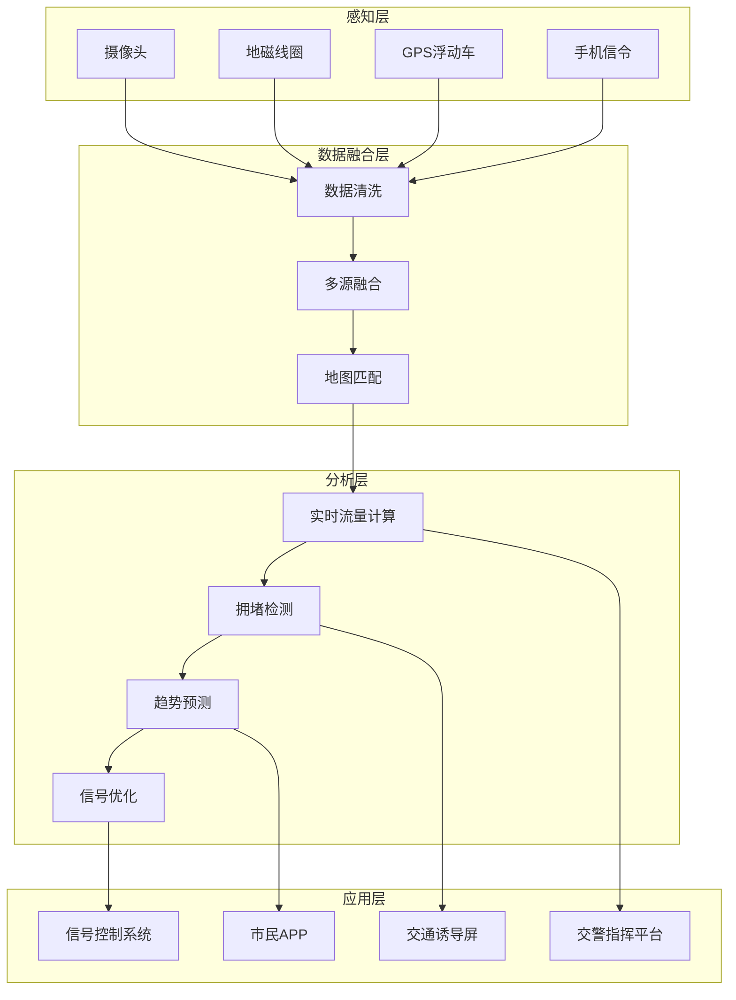
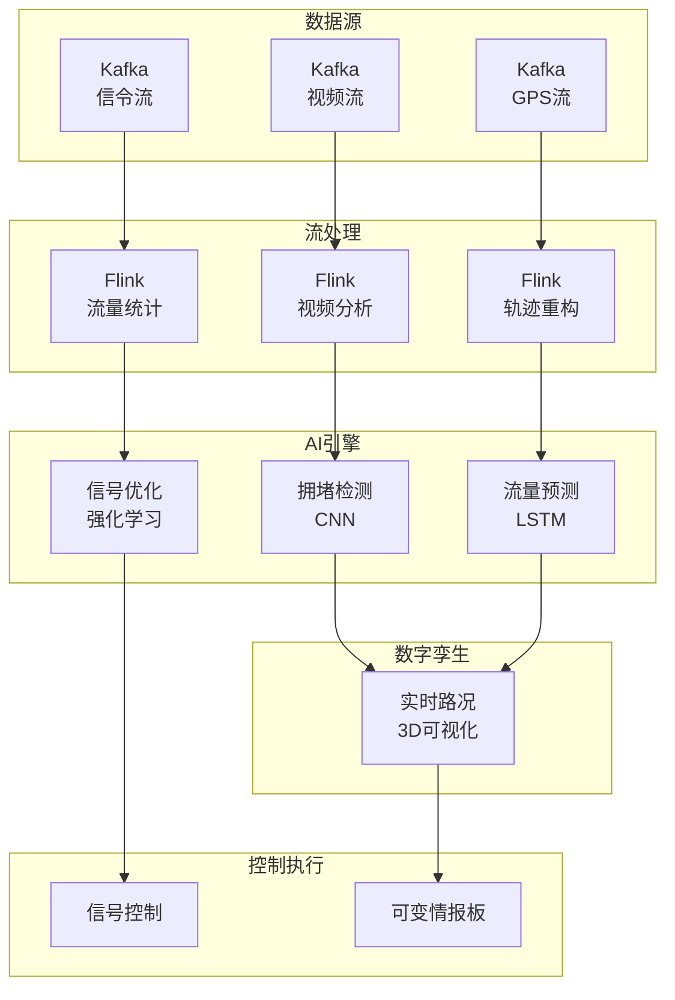

# 智慧城市交通流量分析案例研究

> **案例编号**: 11.3.1
> **行业**: 智慧城市/交通
> **场景**: 实时交通流量监控、拥堵预测、信号优化
> **规模**: 10万路口, 1000万车辆/天
> **编写日期**: 2026-04-09
> **状态**: Phase 2 - 初稿

---

## 执行摘要

### 业务背景

某一线城市交通管理局面临交通拥堵挑战：

- 机动车保有量500万，日出行量1000万
- 高峰期拥堵指数达8.5（严重拥堵）
- 传统信号灯固定配时，无法适应流量变化
- 交通事故响应慢，次生拥堵频发

### 核心挑战

| 挑战 | 描述 | 影响 |
|------|------|------|
| 数据规模大 | 10万路口，多源数据 | 实时处理压力 |
| 实时性要求高 | 拥堵需分钟级发现 | 交通效率 |
| 预测准确性 | 提前30分钟预测 | 预案准备时间 |
| 多方协同 | 交警、公交、地铁联动 | 系统复杂度 |

### 解决方案

采用 **Flink + 数字孪生 + AI预测 + 信号优化** 架构：

- 多源交通数据融合
- 实时拥堵检测与预警
- 交通流量预测
- 自适应信号控制
- 平均车速提升15%，拥堵时间减少20%

---

## 1. 业务场景分析

### 1.1 交通监控流程



---

## 2. 技术架构



---

## 3. 核心算法

### 3.1 实时流量计算

```java
// Flink实时流量统计

import org.apache.flink.streaming.api.datastream.DataStream;
import org.apache.flink.api.common.functions.AggregateFunction;
import org.apache.flink.streaming.api.windowing.time.Time;

public class TrafficFlowCalculator {

    public static void calculateFlow(DataStream<GpsRecord> gpsStream) {

        // 按路段和5分钟窗口统计
        DataStream<RoadFlow> flowStats = gpsStream
            .map(new MapFunction<GpsRecord, RoadSegment>() {
                @Override
                public RoadSegment map(GpsRecord record) {
                    // 地图匹配，GPS点匹配到路段
                    return mapMatch(record);
                }
            })
            .keyBy(RoadSegment::getRoadId)
            .window(TumblingProcessingTimeWindows.of(Time.minutes(5)))
            .aggregate(new FlowAggregateFunction())
            .map(new RichMapFunction<FlowStats, RoadFlow>() {
                @Override
                public RoadFlow map(FlowStats stats) {
                    // 计算流量、速度、密度
                    double flow = stats.getVehicleCount() * 12; // 折算小时流量
                    double speed = stats.getAvgSpeed();
                    double density = flow / speed;

                    return new RoadFlow(
                        stats.getRoadId(),
                        flow,
                        speed,
                        density,
                        System.currentTimeMillis()
                    );
                }
            });

        // 输出到Redis供实时查询
        flowStats.addSink(new RedisFlowSink());

        // 拥堵检测
        flowStats
            .filter(flow -> flow.getSpeed() < 20) // 速度低于20km/h
            .addSink(new CongestionAlertSink());
    }
}
```

### 3.2 交通流量预测

```python
# LSTM交通流量预测
import torch
import torch.nn as nn

class TrafficPredictor(nn.Module):
    def __init__(self, input_size=3, hidden_size=64, num_layers=2, output_size=12):
        super(TrafficPredictor, self).__init__()
        self.hidden_size = hidden_size
        self.num_layers = num_layers

        self.lstm = nn.LSTM(input_size, hidden_size, num_layers,
                           batch_first=True, dropout=0.2)
        self.fc = nn.Linear(hidden_size, output_size)

    def forward(self, x):
        # x shape: (batch, seq_len, features)
        # features: [flow, speed, occupancy]

        h0 = torch.zeros(self.num_layers, x.size(0), self.hidden_size)
        c0 = torch.zeros(self.num_layers, x.size(0), self.hidden_size)

        out, _ = self.lstm(x, (h0, c0))
        out = self.fc(out[:, -1, :])  # 只取最后一个时间步

        return out

# 预测未来30分钟（6个5分钟间隔）
def predict_traffic(model, recent_data):
    """
    recent_data: 最近12个时间步（1小时）的流量数据
    return: 未来6个时间步（30分钟）的预测
    """
    with torch.no_grad():
        prediction = model(recent_data)
    return prediction
```

---

## 4. 性能指标

| 指标 | 优化前 | 优化后 | 提升 |
|------|--------|--------|------|
| 平均车速 | 25km/h | 29km/h | **+16%** |
| 拥堵指数 | 8.5 | 6.8 | **-20%** |
| 事故响应 | 15分钟 | 5分钟 | **-67%** |
| 预测准确率 | - | 85% | **新增** |

---

## 5. 经验总结

### 关键成功因素

1. **多源数据融合**: 摄像头+GPS+信令互补
2. **边缘计算**: 路口级实时处理
3. **人机协同**: AI建议+交警确认
4. **持续优化**: 模型每日更新

---

*Phase 2 - 任务线2-3: 智慧城市交通流量分析案例 (编写中)*
