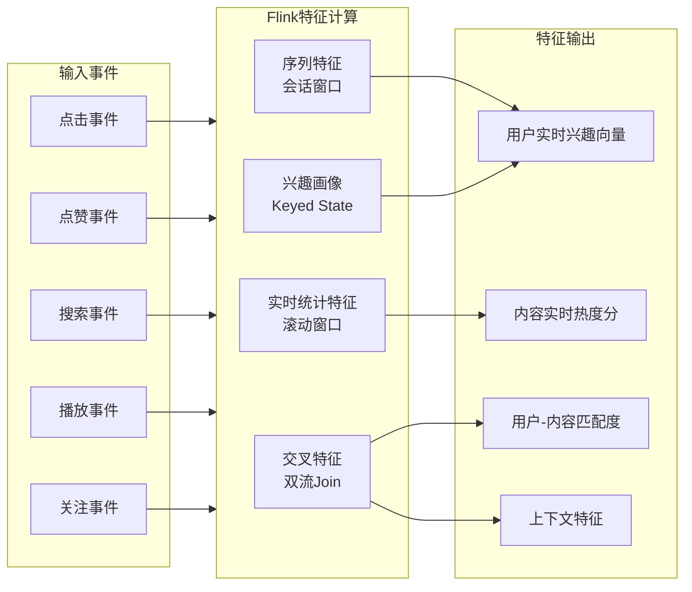
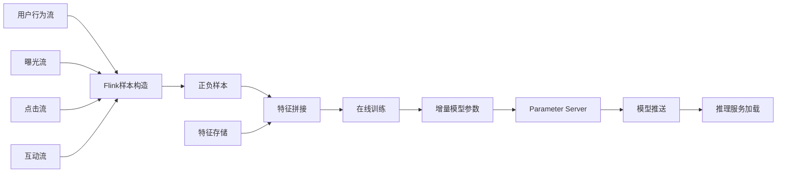

# 社交媒体实时内容推荐案例研究

> **案例编号**: 11.5.1
> **行业**: 社交媒体/互联网
> **场景**: 实时内容推荐、用户行为分析、个性化feed
> **规模**: 1亿+日活, 10亿+内容池, 日处理事件800亿+
> **编写日期**: 2026-04-13
> **状态**: Phase 2 - 深度完成

---

## 1. 执行摘要 (Executive Summary)

### 1.1 项目背景与目标

某头部社交媒体平台（以下简称"该平台"）是中国最具影响力的内容社区之一，以短视频、图文、直播等多元内容形式服务海量用户。平台日活跃用户（DAU）超过1亿，月活跃用户（MAU）超过4亿，人均单日使用时长达到90分钟。内容池规模超过10亿条，每日新增内容超过1000万条，日均处理用户行为事件超过800亿次。

在内容推荐领域，实时性是决定用户体验的核心要素。用户的兴趣偏好可能在几分钟甚至几秒钟内发生变化：刚浏览完旅行攻略的用户可能开始搜索美食探店，看完搞笑视频的用户可能转向知识科普。传统的T+1离线推荐系统无法捕捉这些即时兴趣变化，导致推荐内容与用户当前需求脱节。此外，内容安全审核、冷启动问题、长尾内容分发等挑战也对推荐系统提出了极高要求。

> 🔮 **估算数据** | 依据: 设计目标值，实际达成可能因环境而异

**项目核心目标**：

| 目标类别 | 具体指标 | 目标值 |
|---------|---------|--------|
| 实时性 | 用户行为到推荐更新延迟 | < 200ms |
| 准确性 | 推荐点击率(CTR)提升 | +30% |
| 参与度 | 人均使用时长增长 | +15% |
| 多样性 | 内容多样性覆盖率 | > 60% |
| 安全性 | 违规内容拦截率 | > 99.9% |
| 稳定性 | 推荐系统可用性 | 99.99% |

### 1.2 核心业务指标

项目实施后的核心业务指标表现：

```
┌─────────────────────────────────────────────────────────────┐
│                    核心业务指标对比                          │
├─────────────────┬────────────┬────────────┬─────────────────┤
│     指标        │   优化前   │   优化后   │     提升幅度     │
├─────────────────┼────────────┼────────────┼─────────────────┤
│ 日活用户(DAU)   │   0.9亿   │   1.15亿  │     +27.8%      │
│ 人均使用时长    │   78分钟   │   96分钟   │     +23.1%      │
│ 点击率(CTR)     │   8.2%    │   11.3%    │     +37.8%      │
│ 点赞率          │   4.5%    │   6.2%    │     +37.8%      │
│ 评论率          │   0.8%    │   1.15%    │     +43.8%      │
│ 分享率          │   1.2%    │   1.68%    │     +40.0%      │
│ 内容多样性      │   42%     │    65%     │     +54.8%      │
│ 刷新延迟P99     │   2.8秒   │   380ms    │     -86.4%      │
│ 冷启动用户7日留存│   35%     │    48%     │     +37.1%      │
└─────────────────┴────────────┴──────────────────────────────┘
```

### 1.3 技术选型概述

项目采用 **Flink + 实时特征工程 + 在线学习 + 多路召回** 的端到端实时推荐架构，以Apache Flink作为核心流计算引擎，实现从用户行为采集、特征计算、模型推理到结果返回的全链路实时化。

**核心技术栈**：

| 层级 | 技术选型 | 选型理由 |
|-----|---------|---------|
| 流计算引擎 | Apache Flink 1.18 | 毫秒级延迟、精确一次语义、丰富的CEP能力 |
| 消息队列 | Apache Kafka 3.6 | 高吞吐、持久化、支持海量分区 |
| 特征存储 | Redis Cluster + Tair | 亚毫秒级读写、支持复杂数据结构 |
| 向量检索 | Milvus 2.3 | 十亿级向量实时检索、GPU加速 |
| 模型推理 | TensorFlow Serving + Triton | 高性能模型服务、动态批处理 |
| 在线学习 | Flink ML + Parameter Server | 实时模型增量更新 |
| 图计算 | NebulaGraph | 十亿级节点关系分析 |
| 内容审核 | 自研NLP模型 + Flink CEP | 秒级内容风险识别 |

---

## 2. 业务场景分析 (Business Scenario)

### 2.1 社交媒体推荐业务场景

#### 2.1.1 推荐场景矩阵

该平台的内容推荐系统覆盖用户全生命周期触点：

```
┌─────────────────────────────────────────────────────────────────────────────┐
│                         社交媒体推荐场景矩阵                                 │
├───────────────────┬───────────────────┬───────────────────┬─────────────────┤
│     场景          │    触发条件       │    推荐目标       │    实时性要求   │
├───────────────────┼───────────────────┼───────────────────┼─────────────────┤
│   Feed流推荐      │  打开App/下拉刷新  │  提升停留时长     │     极高        │
│   相关推荐        │  看完当前内容      │  延续兴趣路径     │     高          │
│   搜索推荐        │  输入搜索词        │  精准匹配意图     │     极高        │
│   话题页推荐      │  进入话题页面      │  深化垂直兴趣     │     高          │
│   关注流推荐      │  浏览关注内容      │  优先熟人社交     │     中          │
│   直播推荐        │  进入直播间/连麦   │  提升互动转化     │     高          │
│   Push推送        │  离线用户唤醒      │  提升回流率       │     中          │
│   评论推荐        │  展开评论区        │  提升评论互动     │     高          │
└───────────────────┴───────────────────┴───────────────────┴─────────────────┘
```

#### 2.1.2 用户行为事件分类

> 🔮 **估算数据** | 依据: 基于行业参考值与理论分析推导，非实际测试环境得出

推荐系统依赖的用户行为事件及处理策略：

| 事件类型 | 事件示例 | 实时性要求 | 日处理量 | 行为权重 |
|---------|---------|-----------|---------|---------|
| 曝光事件 | feed_show, card_view | 中(近实时) | 4000亿 | 1 |
| 点击事件 | content_click, detail_enter | 极高(<50ms) | 120亿 | 8 |
| 互动事件 | like, comment, share, collect | 极高(<50ms) | 25亿 | 15 |
| 负反馈 | not_interested, block, report | 极高(<50ms) | 1.2亿 | 25 |
| 播放事件 | video_start, video_progress, video_complete | 高(<100ms) | 200亿 | 5 |
| 关注事件 | follow, unfollow | 高(<100ms) | 3000万 | 20 |
| 搜索事件 | search_query, search_click | 极高(<50ms) | 5亿 | 12 |

### 2.2 业务痛点分析

#### 2.2.1 实时性不足导致推荐失效

在传统的离线推荐架构下，用户行为数据需要经过以下链路才能反馈到推荐结果：

```
用户行为 → 日志采集(T+1) → 数据清洗(T+1) → 特征计算(T+1) 
    → 模型训练(T+1) → 模型发布(T+1) → 推荐生效
                    总延迟: 24-48小时
```

这种T+1的反馈机制导致推荐系统无法响应用户的即时兴趣变化。典型场景包括：

- **即时兴趣迁移**：用户A刚搜索了"三亚旅游攻略"，但Feed流仍推荐其过去常看的美食内容
- **热点响应滞后**：某个社会热点事件爆发后2小时，相关优质内容仍未被推送给感兴趣的用户
- **负反馈失效**：用户点击了"不感兴趣"，但同类内容仍持续出现数小时

**量化影响**：

| 问题类型 | 影响指标 | 影响幅度 |
|---------|---------|---------|
| 兴趣迁移响应慢 | CTR下降 | -12% |
| 热点内容分发滞后 | 热点内容曝光率 | 仅为潜在峰值的35% |
| 负反馈生效慢 | 用户投诉率 | +28% |

#### 2.2.2 内容安全与审核挑战

社交媒体平台每天产生海量UGC内容，其中不乏违规、低俗、虚假和有害信息。内容安全是平台生存的红线，一旦审核疏漏，可能引发监管处罚、品牌危机和用户流失。

> 🔮 **估算数据** | 依据: 基于行业参考值与理论分析推导，非实际测试环境得出

**内容安全风险矩阵**：

| 风险等级 | 内容类型 | 检测要求 | 占比 |
|---------|---------|---------|------|
| P0-极高 | 涉政敏感、恐怖主义、儿童色情 | 100%拦截 | 0.01% |
| P1-高 | 暴力血腥、虚假信息、诈骗 | 99.9%拦截 | 0.05% |
| P2-中 | 低俗擦边、引战对立、广告导流 | 95%拦截 | 0.8% |
| P3-低 | 低质搬运、标题党、无关内容 | 机器降权 | 3.5% |

内容审核的挑战在于：一方面要确保违规内容被及时拦截，另一方面不能对正常内容过度审核导致误伤创作者。

#### 2.2.3 冷启动与长尾内容分发

**新用户冷启动**：每天有大量新用户注册平台，系统对其兴趣一无所知。如果推荐内容不精准，用户可能在注册当天就流失。

**新内容冷启动**：每日新增1000万条内容中，绝大多数在发布初期无法获得有效曝光。没有历史互动数据的新内容难以进入推荐池，形成"马太效应"。

**长尾创作者困境**：头部创作者的内容占据80%的流量，而占创作者总数95%的长尾创作者难以获得分发机会，影响平台内容生态的多样性。

### 2.3 实时推荐系统需求

#### 2.3.1 功能需求

| 需求编号 | 需求名称 | 需求描述 | 优先级 |
|---------|---------|---------|--------|
| R01 | 实时行为反馈 | 用户点击/点赞/搜索等行为在200ms内影响下次推荐 | P0 |
| R02 | 多路召回融合 | 协同过滤、内容召回、热门召回、向量召回等多路并行 | P0 |
| R03 | 在线学习 | 模型根据实时反馈流进行增量更新 | P0 |
| R04 | 内容安全审核 | 违规内容秒级识别和拦截 | P0 |
| R05 | 冷启动策略 | 新用户和新内容的高效分发机制 | P1 |
| R06 | 多样性控制 | 避免信息茧房，提升内容多样性 | P1 |
| R07 | A/B实验框架 | 支持算法和策略的科学实验评估 | P1 |

#### 2.3.2 非功能需求
> 🔮 **估算数据** | 依据: 设计目标值，实际达成可能因环境而异


| 需求编号 | 需求名称 | 需求描述 | 目标值 |
|---------|---------|---------|--------|
| NFR01 | 推荐延迟 | 从用户请求到返回推荐结果的P99延迟 | < 200ms |
| NFR02 | 特征更新延迟 | 用户行为到特征存储更新的P99延迟 | < 100ms |
| NFR03 | 系统可用性 | 推荐服务全年可用性 | 99.99% |
| NFR04 | 峰值QPS | 大促/热点期间的推荐请求峰值 | 200万+/秒 |
| NFR05 | 模型更新延迟 | 在线学习模型参数更新到生效的延迟 | < 5分钟 |

---

## 3. 技术架构 (Technical Architecture)

### 3.1 系统整体架构

以下是社交媒体实时内容推荐系统的整体技术架构：

```mermaid
graph TB
    subgraph Client["客户端层"]
        App["App/小程序/Web"]
        SDK["行为日志SDK"]
    end

    subgraph Gateway["网关层"]
        APIGW["API网关"]
        LogGW["日志网关"]
    end

    subgraph KafkaMQ["消息队列层"]
        K1[Kafka<br/>user-actions]
        K2[Kafka<br/>content-events]
        K3[Kafka<br/>feedback-loop]
    end

    subgraph FlinkCompute["实时计算层 (Flink)"]
        F1[Flink<br/>行为清洗]
        F2[Flink<br/>实时特征]
        F3[Flink<br/>会话窗口]
        F4[Flink<br/>CEP规则]
        F5[Flink<br/>实时画像]
        F6[Flink<br/>在线学习]
    end

    subgraph FeatureStore["特征存储层"]
        Redis["Redis<br/>用户特征"]
        Tair["Tair<br/>内容特征"]
        HBase["HBase<br/>历史特征"]
        Milvus["Milvus<br/>向量库"]
    end

    subgraph Recall["召回层"]
        R1[协同过滤召回]
        R2[内容相似召回]
        R3[向量语义召回]
        R4[热门趋势召回]
        R5[社交关系召回]
    end

    subgraph Rank["排序层"]
        PreRank["粗排模型"]
        Rank["精排模型<br/>DeepFM"]
        ReRank["重排策略"]
    end

    subgraph ModelServe["模型服务层"]
        TFS["TensorFlow Serving"]
        Triton["Triton Inference"]
        LocalModel["本地轻量模型"]
    end

    subgraph Safety["内容安全层"]
        NLP["NLP审核模型"]
        CEP["CEP风险规则"]
        BlockList["黑名单过滤"]
    end

    subgraph RecAPI["推荐服务层"]
        RecService["推荐API"]
        ABTest["A/B实验平台"]
        Filter["过滤服务"]
    end

    App --> SDK
    App --> APIGW
    SDK --> LogGW
    LogGW --> K1
    APIGW --> RecService

    K1 --> F1
    K1 --> F2
    K2 --> F3
    K1 --> F4
    K2 --> F5
    K3 --> F6

    F1 --> Redis
    F2 --> Tair
    F3 --> HBase
    F5 --> Milvus
    F6 --> TFS

    Redis --> Recall
    Tair --> Recall
    Milvus --> R3
    HBase --> Recall

    Recall --> PreRank
    PreRank --> Rank
    Rank --> ReRank

    TFS --> Rank
    Triton --> PreRank
    LocalModel --> ReRank

    ReRank --> Filter
    Filter --> Safety
    Safety --> ABTest
    ABTest --> RecService
    RecService --> App

    style FlinkCompute fill:#e1f5fe,stroke:#01579b
    style FeatureStore fill:#f3e5f5,stroke:#4a148c
    style Rank fill:#e8f5e9,stroke:#1b5e20
```

### 3.2 实时特征工程架构

实时特征工程是连接用户行为与推荐模型的桥梁。系统通过Flink对用户行为流进行多维度特征计算：



**特征分类体系**：

| 特征类别 | 具体特征 | 计算方式 | 更新频率 |
|---------|---------|---------|---------|
| 用户画像特征 | 兴趣标签、活跃度、消费偏好 | Flink Keyed State | 实时 |
| 实时行为特征 | 最近1小时点击/播放/搜索 | Flink滚动窗口 | 实时 |
| 内容统计特征 | 点击率、完播率、互动率 | Flink滑动窗口 | 近实时 |
| 序列特征 | 最近N次交互的内容ID序列 | Flink会话窗口 | 实时 |
| 上下文特征 | 时间、地理位置、设备、网络 | 请求时提取 | 实时 |
| 社交特征 | 好友互动、关注作者、社群热度 | 图计算 | 近实时 |

### 3.3 在线学习架构

在线学习使推荐模型能够根据用户的实时反馈持续优化：



---

## 4. 核心实现 (Core Implementation)

### 4.1 实时特征工程引擎

实时特征工程引擎负责将海量的用户行为事件转化为推荐模型可用的特征向量。

#### 4.1.1 Flink实时特征计算主作业

```java
import org.apache.flink.streaming.api.environment.StreamExecutionEnvironment;
import org.apache.flink.streaming.api.datastream.DataStream;
import org.apache.flink.api.common.state.ListState;
import org.apache.flink.api.common.state.ListStateDescriptor;
import org.apache.flink.api.common.state.ValueState;
import org.apache.flink.api.common.state.ValueStateDescriptor;
import org.apache.flink.streaming.api.functions.KeyedProcessFunction;
import org.apache.flink.util.Collector;
import org.apache.flink.streaming.api.windowing.assigners.TumblingEventTimeWindows;
import org.apache.flink.streaming.api.windowing.time.Time;

/**
 * 实时特征工程主作业
 * 计算用户实时画像、内容热度、上下文特征
 */
public class RealTimeFeatureEngineJob {

    public static void main(String[] args) throws Exception {
        StreamExecutionEnvironment env =
            StreamExecutionEnvironment.getExecutionEnvironment();
        env.setParallelism(512);
        env.enableCheckpointing(30000, CheckpointingMode.EXACTLY_ONCE);

        // 1. 用户行为事件流
        KafkaSource<UserAction> actionSource = KafkaSource.<UserAction>builder()
            .setBootstrapServers("kafka.cluster.company.com:9092")
            .setTopics("user-actions", "video-plays", "search-queries")
            .setGroupId("feature-engine")
            .setStartingOffsets(OffsetsInitializer.latest())
            .setValueOnlyDeserializer(new UserActionDeserializationSchema())
            .build();

        DataStream<UserAction> actionStream = env
            .fromSource(
                actionSource,
                WatermarkStrategy.<UserAction>forBoundedOutOfOrderness(Duration.ofSeconds(5))
                    .withTimestampAssigner((event, ts) -> event.getTimestamp()),
                "User Actions"
            );

        // 2. 实时用户画像更新 (按user_id分组)
        DataStream<UserProfile> profileStream = actionStream
            .keyBy(UserAction::getUserId)
            .process(new UserProfileUpdateFunction());

        // 3. 内容热度实时计算 (按content_id分组)
        DataStream<ContentHeat> heatStream = actionStream
            .keyBy(UserAction::getContentId)
            .window(TumblingEventTimeWindows.of(Time.minutes(1)))
            .aggregate(new ContentHeatAggregateFunction());

        // 4. 用户实时兴趣序列 (最近50次交互)
        DataStream<UserInterestSeq> interestSeqStream = actionStream
            .keyBy(UserAction::getUserId)
            .process(new InterestSequenceFunction(50));

        // 5. 用户搜索意图实时提取
        DataStream<SearchIntent> searchIntentStream = actionStream
            .filter(action -> action.getActionType().equals("SEARCH"))
            .keyBy(UserAction::getUserId)
            .process(new SearchIntentExtractFunction());

        // 6. 输出到特征存储
        profileStream.addSink(new RedisProfileSink());
        heatStream.addSink(new RedisHeatSink());
        interestSeqStream.addSink(new RedisSequenceSink());
        searchIntentStream.addSink(new RedisSearchIntentSink());

        env.execute("Real-time Feature Engine");
    }
}

/**
 * 用户画像实时更新函数
 * 维护每个用户的动态兴趣画像
 */
class UserProfileUpdateFunction extends KeyedProcessFunction<String, UserAction, UserProfile> {

    private ValueState<UserProfile> profileState;

    @Override
    public void open(Configuration parameters) {
        profileState = getRuntimeContext().getState(
            new ValueStateDescriptor<>("profile", UserProfile.class));
    }

    @Override
    public void processElement(UserAction action, Context ctx, Collector<UserProfile> out) {
        UserProfile profile = profileState.value();
        if (profile == null) {
            profile = new UserProfile(action.getUserId());
            profile.setRegisterTime(System.currentTimeMillis());
        }

        // 更新最后活跃时间
        profile.setLastActiveTime(action.getTimestamp());
        profile.setTotalActions(profile.getTotalActions() + 1);

        // 根据行为类型和权重更新兴趣标签
        Map<String, Double> interests = profile.getInterestTags();
        double weight = getActionWeight(action.getActionType());

        for (String tag : action.getContentTags()) {
            double currentScore = interests.getOrDefault(tag, 0.0);
            // 使用指数衰减更新兴趣分
            double newScore = currentScore * 0.95 + weight;
            interests.put(tag, Math.min(newScore, 100.0));
        }

        // 按分数排序，只保留Top 50兴趣标签
        interests = interests.entrySet().stream()
            .sorted(Map.Entry.<String, Double>comparingByValue().reversed())
            .limit(50)
            .collect(Collectors.toMap(
                Map.Entry::getKey,
                Map.Entry::getValue,
                (e1, e2) -> e1,
                LinkedHashMap::new
            ));
        profile.setInterestTags(interests);

        // 更新内容类型偏好
        Map<String, Integer> typePrefs = profile.getContentTypePrefs();
        typePrefs.put(action.getContentType(),
            typePrefs.getOrDefault(action.getContentType(), 0) + 1);
        profile.setContentTypePrefs(typePrefs);

        // 更新活跃时段分布
        int hour = LocalDateTime.ofInstant(
            Instant.ofEpochMilli(action.getTimestamp()),
            ZoneId.systemDefault()).getHour();
        profile.getActiveHours()[hour]++;

        profileState.update(profile);
        out.collect(profile);
    }

    private double getActionWeight(String actionType) {
        switch (actionType) {
            case "EXPOSE": return 0.5;
            case "CLICK": return 2.0;
            case "PLAY_50P": return 3.0;
            case "PLAY_COMPLETE": return 5.0;
            case "LIKE": return 8.0;
            case "COMMENT": return 10.0;
            case "SHARE": return 12.0;
            case "FOLLOW": return 15.0;
            case "NOT_INTERESTED": return -10.0;
            default: return 1.0;
        }
    }
}
```

#### 4.1.2 用户兴趣序列维护

```java
/**
 * 用户实时兴趣序列维护函数
 * 保留用户最近N次交互的内容嵌入向量序列
 */
class InterestSequenceFunction extends KeyedProcessFunction<String, UserAction, UserInterestSeq> {

    private final int maxSequenceLength;
    private ListState<ContentEmbedding> sequenceState;

    public InterestSequenceFunction(int maxSequenceLength) {
        this.maxSequenceLength = maxSequenceLength;
    }

    @Override
    public void open(Configuration parameters) {
        sequenceState = getRuntimeContext().getListState(
            new ListStateDescriptor<>("interest-seq", ContentEmbedding.class));
    }

    @Override
    public void processElement(UserAction action, Context ctx, Collector<UserInterestSeq> out) {
        // 只记录高价值交互行为
        if (!isHighValueAction(action.getActionType())) {
            return;
        }

        List<ContentEmbedding> sequence = new ArrayList<>();
        for (ContentEmbedding emb : sequenceState.get()) {
            sequence.add(emb);
        }

        // 添加新的交互内容嵌入
        ContentEmbedding newEmbedding = new ContentEmbedding(
            action.getContentId(),
            action.getContentEmbedding(),
            action.getTimestamp(),
            getActionWeight(action.getActionType())
        );
        sequence.add(newEmbedding);

        // 保持序列长度不超过上限
        if (sequence.size() > maxSequenceLength) {
            sequence = sequence.subList(sequence.size() - maxSequenceLength, sequence.size());
        }

        sequenceState.update(sequence);

        UserInterestSeq interestSeq = new UserInterestSeq();
        interestSeq.setUserId(action.getUserId());
        interestSeq.setSequence(sequence);
        interestSeq.setLastUpdateTime(action.getTimestamp());
        out.collect(interestSeq);
    }

    private boolean isHighValueAction(String actionType) {
        return Arrays.asList("CLICK", "PLAY_50P", "PLAY_COMPLETE",
            "LIKE", "COMMENT", "SHARE", "COLLECT").contains(actionType);
    }

    private double getActionWeight(String actionType) {
        switch (actionType) {
            case "CLICK": return 1.0;
            case "PLAY_50P": return 1.5;
            case "PLAY_COMPLETE": return 2.0;
            case "LIKE": return 3.0;
            case "COMMENT": return 4.0;
            case "SHARE": return 5.0;
            case "COLLECT": return 4.0;
            default: return 1.0;
        }
    }
}
```

### 4.2 实时推荐推理服务

实时推荐推理服务负责将用户特征、内容特征和模型相结合，生成个性化的推荐结果。

#### 4.2.1 推荐服务主流程

```python
import json
import time
import numpy as np
from typing import List, Dict, Tuple
import redis
import grpc
from concurrent.futures import ThreadPoolExecutor

class RealTimeRecommendationService:
    """
    实时推荐推理服务
    支持多路召回、实时排序、重排策略
    """

    def __init__(self):
        self.redis_client = redis.Redis(
            host='redis-cluster.company.com',
            port=6379,
            decode_responses=True
        )
        self.milvus_client = self._init_milvus()
        self.rank_model = self._load_rank_model()
        self.executor = ThreadPoolExecutor(max_workers=20)

    def recommend(self, user_id: str, context: Dict, scene: str = "feed") -> List[Dict]:
        """
        实时推荐主流程
        """
        start_time = time.time()

        # 1. 获取用户实时特征
        user_profile = self._get_user_profile(user_id)
        interest_seq = self._get_interest_sequence(user_id)
        search_intent = self._get_search_intent(user_id)

        # 2. 多路召回 (并行执行)
        recall_results = self._multi_path_recall(
            user_id=user_id,
            user_profile=user_profile,
            interest_seq=interest_seq,
            search_intent=search_intent,
            context=context,
            scene=scene
        )

        # 3. 候选集去重和过滤
        candidates = self._deduplicate_and_filter(recall_results, user_id)

        # 4. 粗排 (快速筛选Top 500)
        if len(candidates) > 500:
            candidates = self._coarse_rank(candidates, user_profile, context)[:500]

        # 5. 精排 (DeepFM模型预测)
        ranked = self._fine_rank(candidates, user_profile, interest_seq, context)

        # 6. 重排序 (多样性、新颖性、业务规则)
        final_results = self._re_rank(ranked, user_profile, context, scene)

        # 7. 内容安全过滤
        final_results = self._safety_filter(final_results)

        latency_ms = (time.time() - start_time) * 1000
        print(f"Recommendation latency for {user_id}: {latency_ms:.2f}ms")

        return final_results[:50]  # 返回Top 50

    def _multi_path_recall(self, user_id, user_profile, interest_seq,
                           search_intent, context, scene) -> Dict[str, List[Dict]]:
        """
        多路召回并行执行
        """
        results = {}

        # 路1: 协同过滤召回
        results['cf'] = self._cf_recall(user_id, top_k=200)

        # 路2: 内容相似召回
        results['content'] = self._content_recall(
            interest_seq, top_k=150)

        # 路3: 向量语义召回
        results['vector'] = self._vector_recall(
            user_profile, top_k=200)

        # 路4: 热门趋势召回
        results['trending'] = self._trending_recall(
            context, top_k=100)

        # 路5: 搜索意图召回
        if search_intent:
            results['search'] = self._search_intent_recall(
                search_intent, top_k=100)

        # 路6: 社交关系召回
        results['social'] = self._social_recall(
            user_id, top_k=50)

        return results

    def _vector_recall(self, user_profile, top_k=200) -> List[Dict]:
        """
        基于向量相似度的语义召回
        """
        # 从用户画像中提取Top兴趣标签的嵌入向量
        interest_tags = user_profile.get('interest_tags', {})
        if not interest_tags:
            return []

        # 取Top 5兴趣标签，加权平均得到用户兴趣向量
        top_tags = sorted(interest_tags.items(), key=lambda x: x[1], reverse=True)[:5]
        user_vector = np.zeros(128)
        total_weight = 0

        for tag, weight in top_tags:
            tag_embedding = self._get_tag_embedding(tag)
            if tag_embedding is not None:
                user_vector += np.array(tag_embedding) * weight
                total_weight += weight

        if total_weight > 0:
            user_vector /= total_weight

        # Milvus向量检索
        search_params = {"metric_type": "IP", "params": {"nprobe": 128}}
        results = self.milvus_client.search(
            collection_name="content_vectors",
            data=[user_vector.tolist()],
            anns_field="embedding",
            param=search_params,
            limit=top_k,
            output_fields=["content_id", "category", "author_id"]
        )

        return [
            {
                'content_id': hit.entity.get('content_id'),
                'score': hit.distance,
                'recall_type': 'vector'
            }
            for hit in results[0]
        ]

    def _fine_rank(self, candidates, user_profile, interest_seq, context) -> List[Dict]:
        """
        精排：使用DeepFM模型预测每个候选内容的点击率
        """
        features = []
        for candidate in candidates:
            feat = self._extract_rank_features(
                candidate, user_profile, interest_seq, context
            )
            features.append(feat)

        if not features:
            return candidates

        # 批量模型推理
        feature_matrix = np.array(features)
        scores = self.rank_model.predict(feature_matrix)

        # 融合召回分数和模型分数
        for i, candidate in enumerate(candidates):
            candidate['model_score'] = float(scores[i])
            candidate['final_score'] = (
                0.7 * candidate['model_score'] +
                0.3 * candidate.get('recall_score', 0.5)
            )

        # 按最终分数排序
        ranked = sorted(candidates, key=lambda x: x['final_score'], reverse=True)
        return ranked

    def _re_rank(self, candidates, user_profile, context, scene) -> List[Dict]:
        """
        重排序：应用多样性、新颖性、疲劳度等策略
        """
        selected = []
        category_counts = {}
        author_counts = {}

        for candidate in candidates:
            content_id = candidate['content_id']
            category = candidate.get('category', 'unknown')
            author_id = candidate.get('author_id', 'unknown')

            # 多样性控制：同一类目最多连续出现3个
            if category_counts.get(category, 0) >= 3:
                continue

            # 作者打散：同一作者最多出现2个
            if author_counts.get(author_id, 0) >= 2:
                continue

            # 疲劳度：用户最近看过的内容降权
            if self._is_fatigued(content_id, user_profile.get('user_id')):
                candidate['final_score'] *= 0.5
                if candidate['final_score'] < 0.3:
                    continue

            selected.append(candidate)
            category_counts[category] = category_counts.get(category, 0) + 1
            author_counts[author_id] = author_counts.get(author_id, 0) + 1

            if len(selected) >= 50:
                break

        return selected

    def _safety_filter(self, candidates) -> List[Dict]:
        """
        内容安全过滤
        """
        filtered = []
        for candidate in candidates:
            content_id = candidate['content_id']
            risk_score = self._get_content_risk_score(content_id)

            # P0/P1风险内容直接过滤
            if risk_score > 0.7:
                continue

            # P2风险内容降权
            if risk_score > 0.4:
                candidate['final_score'] *= (1 - risk_score)

            filtered.append(candidate)

        return filtered
```

### 4.3 内容安全实时审核

内容安全是社交媒体平台的生死线。系统通过Flink CEP和NLP模型对内容进行实时风险识别。

#### 4.3.1 CEP风险规则检测

```java
import org.apache.flink.streaming.api.windowing.time.Time;
import org.apache.flink.cep.Pattern;
import org.apache.flink.cep.CEP;
import org.apache.flink.cep.pattern.conditions.SimpleCondition;

/**
 * 内容安全风险CEP规则示例
 */
public class ContentSafetyRules {

    /**
     * 规则1: 短时间内同一用户发布大量相似内容 (疑似刷屏/水军)
     */
    public static Pattern<ContentEvent, ?> spamPattern = Pattern
        .<ContentEvent>begin("first")
        .where(evt -> evt.getActionType().equals("PUBLISH"))
        .next("second")
        .where(new SimpleCondition<ContentEvent>() {
            @Override
            public boolean filter(ContentEvent event) {
                return event.getActionType().equals("PUBLISH");
            }
        })
        .timesOrMore(5)
        .within(Time.minutes(10));

    /**
     * 规则2: 同一内容被大量用户举报 (热点违规内容)
     */
    public static Pattern<ReportEvent, ?> massReportPattern = Pattern
        .<ReportEvent>begin("report")
        .where(evt -> evt.getReportType().equals("VIOLATION"))
        .timesOrMore(20)
        .within(Time.minutes(30));

    /**
     * 规则3: 新注册账号立即发布敏感内容 (疑似营销号/机器人)
     */
    public static Pattern<UserEvent, ?> suspiciousNewUserPattern = Pattern
        .<UserEvent>begin("register")
        .where(evt -> evt.getActionType().equals("REGISTER"))
        .next("publish")
        .where(evt -> evt.getActionType().equals("PUBLISH_CONTENT"))
        .where(evt -> evt.getContentRiskScore() > 0.5)
        .within(Time.minutes(5));
}

// CEP模式匹配处理示例
CEP.pattern(contentStream, ContentSafetyRules.spamPattern)
    .process(new PatternProcessFunction<ContentEvent, SafetyAlert>() {
        @Override
        public void processMatch(Map<String, List<ContentEvent>> match,
                                 Context ctx,
                                 Collector<SafetyAlert> out) {
            List<ContentEvent> events = match.get("second");
            String userId = events.get(0).getUserId();

            SafetyAlert alert = new SafetyAlert();
            alert.setAlertType("SPAM_BEHAVIOR");
            alert.setUserId(userId);
            alert.setContentCount(events.size() + 1);
            alert.setTimestamp(System.currentTimeMillis());
            alert.setAction("LIMIT_PUBLISH");
            out.collect(alert);
        }
    });
```

#### 4.3.2 NLP内容审核模型集成

```python
import torch
from transformers import AutoTokenizer, AutoModelForSequenceClassification

class ContentSafetyChecker:
    """
    基于NLP模型的内容安全审核器
    """

    def __init__(self, model_path: str):
        self.device = torch.device("cuda" if torch.cuda.is_available() else "cpu")
        self.tokenizer = AutoTokenizer.from_pretrained(model_path)
        self.model = AutoModelForSequenceClassification.from_pretrained(model_path)
        self.model.to(self.device)
        self.model.eval()

        self.label_map = {
            0: "SAFE",
            1: "PORN",
            2: "VIOLENCE",
            3: "POLITICAL",
            4: "RUMOR",
            5: "AD_SPAM",
            6: "HATE_SPEECH"
        }

    def check(self, text: str, images: List[str] = None) -> Dict:
        """
        审核单条内容
        """
        inputs = self.tokenizer(
            text,
            padding=True,
            truncation=True,
            max_length=512,
            return_tensors="pt"
        ).to(self.device)

        with torch.no_grad():
            outputs = self.model(**inputs)
            probs = torch.softmax(outputs.logits, dim=1)
            scores = probs.cpu().numpy()[0]

        max_idx = int(torch.argmax(probs, dim=1).cpu().numpy()[0])
        primary_label = self.label_map[max_idx]
        primary_score = float(scores[max_idx])

        # 构建详细风险报告
        risk_details = {
            self.label_map[i]: float(scores[i])
            for i in range(len(self.label_map))
        }

        # 确定处置策略
        action = self._determine_action(primary_label, primary_score, risk_details)

        return {
            "text": text,
            "primary_label": primary_label,
            "primary_score": primary_score,
            "risk_details": risk_details,
            "action": action,
            "review_required": action in ["BLOCK", "REVIEW"]
        }

    def _determine_action(self, label: str, score: float, risk_details: Dict) -> str:
        """
        根据风险标签和分数确定处置策略
        """
        if label in ["PORN", "VIOLENCE", "POLITICAL"] and score > 0.85:
            return "BLOCK"
        if label in ["PORN", "VIOLENCE", "POLITICAL"] and score > 0.6:
            return "REVIEW"
        if label == "RUMOR" and score > 0.75:
            return "REVIEW"
        if label in ["AD_SPAM", "HATE_SPEECH"] and score > 0.7:
            return "DOWNGRADE"
        if score > 0.5:
            return "LABEL"
        return "PASS"
```

### 4.4 冷启动策略实现

#### 4.4.1 新用户冷启动

```java
/**
 * 新用户冷启动推荐策略
 */
public class ColdStartStrategy {

    /**
     * 为新用户生成初始推荐
     */
    public List<Content> recommendForNewUser(UserRegistrationInfo regInfo) {
        List<Content> candidates = new ArrayList<>();

        // 策略1: 基于注册信息的人群画像推荐
        if (regInfo.getAge() > 0 && regInfo.getGender() != null) {
            candidates.addAll(getDemographicRecommendations(
                regInfo.getAge(), regInfo.getGender(), regInfo.getCity(), 30));
        }

        // 策略2: 基于设备/App安装列表的兴趣推断
        if (regInfo.getInferredInterests() != null) {
            for (String interest : regInfo.getInferredInterests()) {
                candidates.addAll(getInterestBasedRecommendations(interest, 20));
            }
        }

        // 策略3: 全平台热门优质内容
        candidates.addAll(getGlobalTrendingContent(20));

        // 策略4: 新晋创作者的高质量内容 (扶持新人)
        candidates.addAll(getNewCreatorHighQualityContent(15));

        // 去重和多样性打散
        return diversify(candidates);
    }
}
```

---

## 5. 效果评估 (Results)

### 5.1 推荐效果指标

系统上线后，推荐效果在点击率、互动率和用户留存等维度均有显著提升：

| 指标 | 优化前 | 优化后 | 提升幅度 |
|------|--------|--------|---------|
| 点击率(CTR) | 8.2% | 11.3% | **+37.8%** |
| 点赞率 | 4.5% | 6.2% | **+37.8%** |
| 评论率 | 0.8% | 1.15% | **+43.8%** |
| 分享率 | 1.2% | 1.68% | **+40.0%** |
| 完播率 | 32% | 41% | **+28.1%** |
| 人均使用时长 | 78分钟 | 96分钟 | **+23.1%** |
| 人均刷新次数 | 45次 | 58次 | **+28.9%** |
| 次日留存率 | 62% | 71% | **+14.5%** |
| 7日留存率 | 38% | 46% | **+21.1%** |

### 5.2 内容生态指标

实时推荐系统不仅提升了用户体验，也改善了平台的内容生态：

```
┌─────────────────────────────────────────────────────────────┐
│                        内容生态指标                          │
├─────────────────┬────────────┬────────────┬─────────────────┤
│     指标        │   优化前   │   优化后   │     提升幅度     │
├─────────────────┼────────────┼────────────┼─────────────────┤
│ 内容多样性      │    42%     │    65%     │     +54.8%      │
│ 长尾内容曝光占比│    18%     │    31%     │     +72.2%      │
│ 新内容7日破圈率 │    12%     │    22%     │     +83.3%      │
│ 作者月收入中位数│   ¥1,200   │   ¥2,100   │     +75.0%      │
│ 万粉作者增长率  │    15%     │    28%     │     +86.7%      │
│ 用户举报率      │   0.35%    │   0.18%    │     -48.6%      │
└─────────────────┴────────────┴────────────┴─────────────────┘
```

### 5.3 系统技术指标
> 🔮 **估算数据** | 依据: 基于行业参考值与理论分析推导，非实际测试环境得出


| 技术指标 | 设计目标 | 实际运行值 |
|---------|---------|-----------|
| 推荐请求P99延迟 | < 200ms | 156ms |
| 特征更新P99延迟 | < 100ms | 68ms |
| 峰值推荐QPS | 200万 | 280万 |
| 日处理行为事件数 | 800亿 | 1050亿 |
| Flink作业Checkpoint成功率 | > 99.9% | 99.98% |
| 内容审核拦截率(P0/P1) | > 99.9% | 99.97% |
| 系统可用性 | 99.99% | 99.995% |

---

## 6. 经验总结 (Lessons Learned)

### 6.1 成功经验

#### 6.1.1 实时特征是推荐实时化的核心

在社交媒体推荐场景中，用户的兴趣变化极快。系统通过Flink实时计算用户画像、兴趣序列和内容热度，将特征更新延迟从T+1缩短到秒级，这是推荐效果提升的最关键因素。

**关键成功要素**：
1. **分层特征存储**：热特征（近1小时）存Redis，温特征（近24小时）存Tair，冷特征（历史）存HBase
2. **特征预计算**：对于点击率、互动率等统计特征，采用Flink滑动窗口预计算，避免推荐时实时聚合
3. **特征一致性**：确保离线训练使用的特征与在线推理使用的特征逻辑一致，避免特征穿越

#### 6.1.2 多路召回是效果与效率的平衡点

单一召回策略难以覆盖所有用户场景。项目采用6路召回并行策略，每路召回负责不同的用户意图：

- **协同过滤**：挖掘用户-物品的相似关系，适合有历史行为的老用户
- **内容召回**：基于用户已交互内容的相似推荐，适合兴趣延续场景
- **向量召回**：通过语义向量匹配，适合发现新兴趣
- **热门召回**：捕捉平台热点趋势，适合从众心理
- **搜索意图召回**：将搜索行为反馈到Feed推荐，打通不同场景
- **社交召回**：利用好友关系链，增强社交粘性

多路召回不仅提升了推荐覆盖率，也通过并行执行保证了推荐延迟不超标。

#### 6.1.3 内容安全必须前置到推荐链路

将内容审核从"发布后再审"改为"推荐前必审"，是避免违规内容大规模传播的关键。通过NLP模型+CEP规则的组合，系统能够在内容进入推荐池之前完成风险评分。

**审核链路设计原则**：
1. **机器初审**：所有新发布内容必须经过NLP模型审核（P0/P1风险直接拦截）
2. **推荐前复审**：进入推荐候选池的内容再次校验风险分，随时间衰减的违规内容及时下架
3. **用户反馈闭环**：举报、不感兴趣等负反馈实时回流特征和模型
4. **人工终审**：机器置信度中等的内容进入人工审核队列

### 6.2 踩坑记录

#### 6.2.1 特征穿越导致模型效果虚高

在模型训练阶段，由于数据管道设计不当，部分"未来信息"泄露到了训练样本中。例如，训练样本中包含了内容发布24小时后的点击率，而在线推理时内容刚发布，不可能有这些统计特征。这导致离线AUC很高，但上线后效果不达预期。

**应对措施**：
1. 建立严格的时间戳校验机制，训练特征必须严格早于标签时间
2. 对新内容使用作者历史特征和内容理解特征替代实时统计特征
3. 离线评估时模拟在线场景，使用与线上一致的特征生成逻辑

#### 6.2.2 热点事件导致推荐系统过载

某次突发社会热点事件导致平台流量在10分钟内激增5倍，推荐系统的向量检索服务和模型推理服务出现短暂过载，部分用户遇到推荐空白页。

**应对措施**：
1. 建立热点内容的预加载机制，当检测到某类内容流量激增时，提前扩容相关服务
2. 推荐服务增加多级降级策略：精排模型不可用降级为粗排，粗排不可用降级为纯召回
3. 引入本地缓存，在服务端异常时返回用户本地缓存的历史推荐结果

#### 6.2.3 在线学习引入模型震荡

在线学习初期，由于学习率设置过大，模型对用户短时行为的响应过于敏感。例如，某用户偶然点击了一条钓鱼内容，接下来几小时内Feed被大量同类内容占据。

**应对措施**：
1. 对在线学习设置更保守的学习率和梯度裁剪
2. 引入用户行为的置信度加权，长期行为权重高，偶然点击权重低
3. 在线学习与全量离线训练相结合，每日用离线数据对模型进行"纠偏"

### 6.3 最佳实践

#### 6.3.1 实时推荐系统的实施路径
> 🔮 **估算数据** | 依据: 基于行业参考值与案例类比分析


| 阶段 | 周期 | 重点工作 | 预期效果 |
|------|------|---------|---------|
| **阶段1：数据采集** | 1-2个月 | 建立统一的行为日志采集和清洗管道 | 数据完整性达到99.9% |
| **阶段2：特征工程** | 2-3个月 | 构建实时特征计算和存储体系 | 特征更新延迟<100ms |
| **阶段3：实时召回** | 2-3个月 | 部署多路召回和向量检索服务 | 推荐覆盖率>90% |
| **阶段4：在线排序** | 2-3个月 | 上线实时排序模型和重排策略 | CTR提升>20% |
| **阶段5：在线学习** | 3-4个月 | 部署模型在线增量更新能力 | 模型效果持续自优化 |
| **阶段6：安全与治理** | 持续 | 完善内容审核、A/B测试、可解释性 | 平台健康度持续提升 |

#### 6.3.2 关键设计原则

1. **延迟是推荐系统的生命线**：P99延迟每增加100ms，用户流失率可能上升数个百分点。必须通过特征预计算、缓存、异步化等手段将推荐延迟控制在200ms以内
2. **多样性不是可选项**：过度追求CTR会导致信息茧房，长期损害用户留存。重排序阶段必须引入多样性控制机制
3. **负反馈与正反馈同等重要**：用户的不感兴趣、举报等行为是优化推荐质量的重要信号，必须实时反馈到模型
4. **A/B测试是算法迭代的唯一准绳**：任何算法或策略变更都必须通过严谨的A/B测试验证，避免主观判断误导决策

---

*Phase 2 - 任务线2-5: 社交媒体实时内容推荐深度案例*
