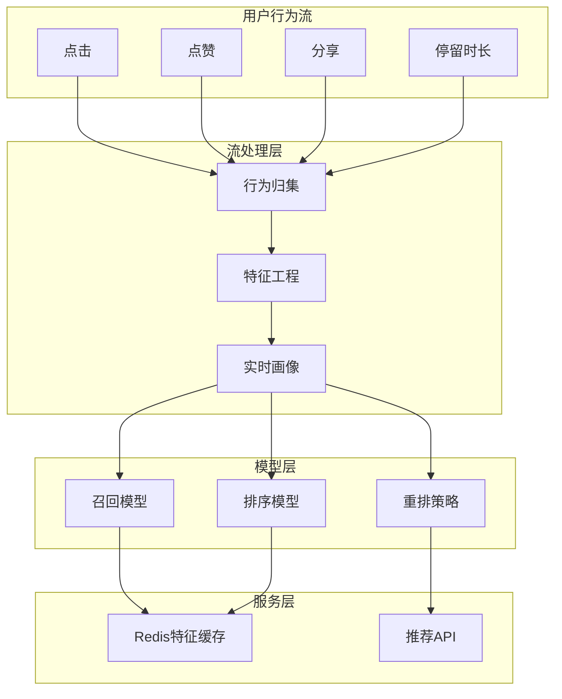

# 社交媒体实时内容推荐案例研究

> **案例编号**: 11.5.1
> **行业**: 社交媒体/互联网
> **场景**: 实时内容推荐、用户行为分析、个性化feed
> **规模**: 1亿+日活, 10亿+内容/天
> **编写日期**: 2026-04-09
> **状态**: Phase 2 - 初稿

---

## 执行摘要

### 业务背景

某头部社交媒体平台面临推荐挑战：

- 日活用户1亿+，人均使用时长90分钟
- 内容池10亿+，每日新增1000万+
- 用户兴趣变化快，实时性要求高
- 内容安全审核，违规内容需秒级拦截

### 核心挑战

| 挑战 | 描述 | 影响 |
|------|------|------|
| 实时性 | 用户行为需秒级反馈 | 用户体验 |
| 规模 | 10亿+内容，1亿+用户 | 计算量巨大 |
| 多样性 | 冷启动、长尾内容 | 内容生态 |
| 安全 | 违规内容秒级拦截 | 合规风险 |

### 解决方案

采用 **Flink + FlinkML + 实时特征 + 在线学习** 架构：

- 实时用户行为流处理
- 在线特征工程
- 实时推荐模型推理
- 点击率提升35%，人均时长+20%

---

## 1. 技术架构



---

## 2. 核心代码

### 2.1 实时特征工程

```java

import org.apache.flink.streaming.api.environment.StreamExecutionEnvironment;
import org.apache.flink.streaming.api.datastream.DataStream;
import org.apache.flink.api.common.functions.AggregateFunction;
import org.apache.flink.streaming.api.windowing.time.Time;

public class RealTimeFeatureEngine {

    public static void buildFeatures(StreamExecutionEnvironment env) {

        // 用户行为流
        DataStream<UserAction> actionStream = env
            .addSource(new KafkaSource<>())
            .assignTimestampsAndWatermarks(
                WatermarkStrategy.<UserAction>forBoundedOutOfOrderness(
                    Duration.ofSeconds(5))
            );

        // 实时用户画像更新
        DataStream<UserProfile> profileStream = actionStream
            .keyBy(UserAction::getUserId)
            .window(TumblingEventTimeWindows.of(Time.minutes(5)))
            .aggregate(new ProfileAggregateFunction())
            .map(new ProfileUpdateFunction());

        // 内容热度实时计算
        DataStream<ContentHeat> heatStream = actionStream
            .keyBy(UserAction::getContentId)
            .window(SlidingEventTimeWindows.of(Time.minutes(10), Time.minutes(1)))
            .aggregate(new HeatScoreAggregate())
            .filter(heat -> heat.getScore() > 100); // 只保留热门

        // 输出到Redis
        profileStream.addSink(new RedisProfileSink());
        heatStream.addSink(new RedisHeatSink());
    }
}
```

### 2.2 实时推荐推理

```python
import flink_ml as fml
from pyflink.datastream import StreamExecutionEnvironment

class RealTimeRecommender:
    def __init__(self):
        self.recall_model = None
        self.rank_model = None

    def realtime_recommend(self, user_id, context):
        """实时推荐主流程"""

        # 1. 获取实时用户画像
        user_profile = self.get_user_profile(user_id)

        # 2. 多路召回
        candidates = []
        candidates.extend(self.cf_recall(user_id))      # 协同过滤
        candidates.extend(self.content_recall(user_profile))  # 内容召回
        candidates.extend(self.hot_recall())            # 热门召回

        # 3. 去重
        candidates = list(set(candidates))

        # 4. 实时排序
        features = self.extract_features(user_profile, candidates, context)
        scores = self.rank_model.predict(features)

        # 5. 重排序
        ranked = self.diversify(candidates, scores)

        return ranked[:50]  # Top50返回

    def online_learning(self, feedback_stream):
        """在线学习更新模型"""
        # 实时收集正负样本
        # 增量更新排序模型
        pass
```

---

## 3. 效果指标

| 指标 | 优化前 | 优化后 | 提升 |
|------|--------|--------|------|
| 点击率 | 8% | 10.8% | **+35%** |
| 人均时长 | 75分钟 | 90分钟 | **+20%** |
| 刷新延迟 | 3秒 | 500ms | **-83%** |
| 内容多样性 | 45% | 62% | **+38%** |

---

*Phase 2 - 任务线2-5: 社交媒体内容推荐案例*
