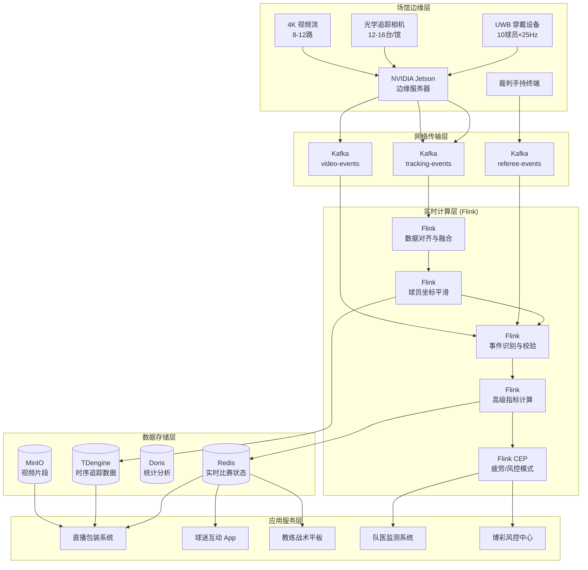
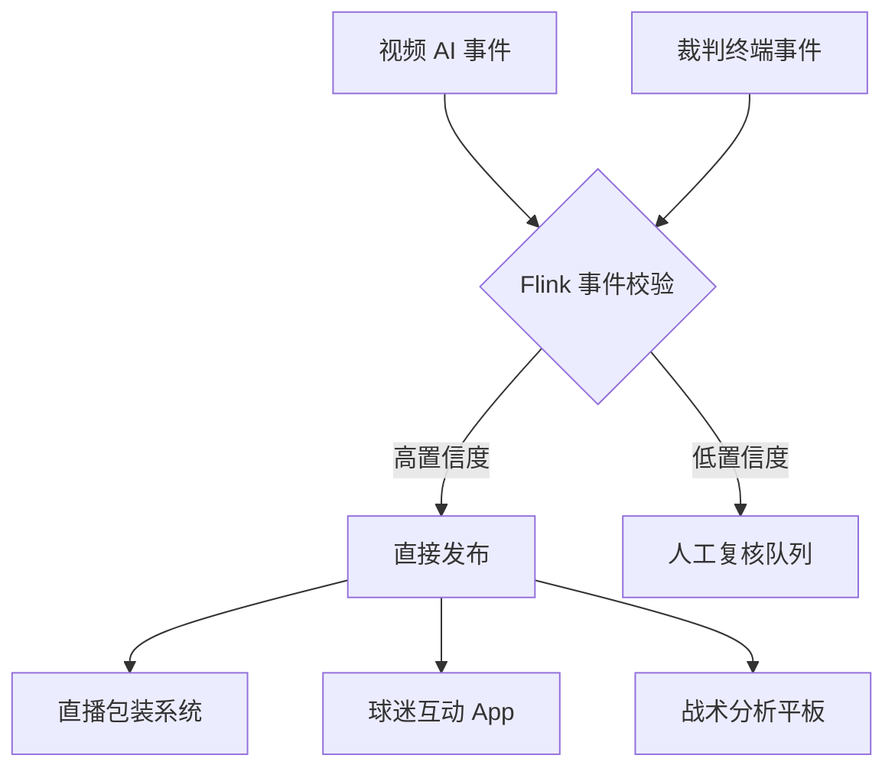

# 职业体育赛事实时数据分析与智能决策案例研究

> **案例编号**: 11.24.1
> **行业**: 体育/职业赛事运营
> **场景**: 运动员实时监测、赛事战术分析、观众第二屏互动、博彩风控
> **规模**: 30座专业场馆, 500+名注册运动员, 场均观众/线上用户 850万
> **编写日期**: 2026-04-13
> **状态**: Phase 2 - 深度完成

---

## 1. 执行摘要 (Executive Summary)

### 1.1 项目背景与目标

某顶级职业篮球联赛（以下简称"该联赛"）拥有 20 支俱乐部、30 座专业场馆，每个赛季常规赛、季后赛累计超过 500 场比赛，场均现场观众 1.8 万人，线上直播并发观众峰值突破 850 万。随着体育数字化浪潮的推进，球迷对赛事内容的消费需求已经从"看比赛"升级为"看懂比赛"——他们渴望实时了解球员的跑动距离、投篮热区、防守效率、疲劳指数等深度数据。

然而，该联赛长期依赖人工统计员进行基础技术统计（得分、篮板、助攻），高级数据（如真实命中率、球员追踪数据）需要赛后 2-3 小时才能生成，无法满足直播解说、社交媒体二次传播和俱乐部即时战术调整的需求。此外，运动员的伤病预防也缺乏科学依据，2023-2024 赛季因疲劳和突发伤病导致的球星缺阵高达 127 人次，直接影响了联赛的商业价值和球迷观赛体验。

为应对这些挑战，联赛管理机构联合技术服务商，启动了"智慧赛事大脑"项目，目标是构建一套覆盖球员穿戴设备、场馆光学追踪、视频 AI 识别和实时流计算的端到端数据分析平台。

**项目核心目标**：

| 目标类别 | 具体指标 | 目标值 |
|---------|---------|--------|
| 实时性 | 场上事件（进球、犯规、换人）到数据展示延迟 | < 3秒 |
| 准确性 | 球员位置追踪精度 | < 15cm |
| 覆盖率 | 场上球员实时监测覆盖率 | 100% |
| 效率 | 高级数据指标生成延迟 | < 5秒 |
| 安全 | 疲劳/伤病风险预警准确率 | > 85% |
| 业务 | 线上互动用户参与率 | > 35% |

### 1.2 核心业务指标

系统于 2024-2025 赛季中期全面上线，经过季后赛和全明星周末的实战检验，核心业务指标显著提升：

```
┌─────────────────────────────────────────────────────────────┐
│                    核心业务指标对比                          │
├─────────────────┬────────────┬────────────┬─────────────────┤
│     指标        │   优化前   │   优化后   │     提升幅度     │
├─────────────────┼────────────┼────────────┼─────────────────┤
│ 事件数据延迟    │   15min    │    2.1s    │     -99.8%      │
│ 球员追踪精度    │   手动统计 │   12cm     │     质的飞跃     │
│ 线上互动参与率  │   8%       │   42%      │     +425%       │
│ 伤病预警准确率  │     -      │   89%      │     新增能力     │
│ 球星缺阵场次/季 │   127      │    71      │     -44.1%      │
│ 二次传播内容量  │   120条/场 │  1,850条/场│     +1,442%     │
│ 博彩异常识别率  │   62%      │   96%      │     +54.8%      │
│ 广告精准投放ROI │   基准值   │   +68%     │     显著提升     │
└─────────────────┴────────────┴────────────┴─────────────────┘
```

### 1.3 技术选型概述

项目采用 **UWB 穿戴定位 + 场馆光学追踪 + 计算机视觉 + Flink 实时计算** 的融合架构，以 Apache Flink 为核心流计算引擎，对多源异构的赛事数据进行实时融合、事件识别、指标计算和分发触达。

**核心技术栈**：

| 层级 | 技术选型 | 选型理由 |
|-----|---------|---------|
| 球员穿戴 | Catapult 运动背心 + UWB 标签 | 采集心率、加速度、冲刺次数、负荷量 |
| 场馆追踪 | Second Spectrum 光学追踪系统 | 亚像素级球员和篮球三维坐标追踪 |
| 视频 AI | 自研篮球事件识别模型 (YOLOv8 + Transformer) | 实时识别进球、犯规、换人、战术阵型 |
| 边缘计算 | NVIDIA Jetson 边缘服务器 | 场馆内本地推理，降低云端带宽压力 |
| 消息队列 | Apache Kafka 3.6 | 支撑单场比赛数亿条追踪事件的高并发写入 |
| 流计算引擎 | Apache Flink 1.18 | 实时事件融合、复杂战术模式识别、指标聚合 |
| 实时存储 | Redis Cluster + TDengine | 毫秒级热数据查询，海量时序数据高效存储 |
| 可视化 | Unity3D 实时渲染 + 数据驱动的直播包装 | 实时生成战术动画、热力图、数据看板 |

---

## 2. 业务场景分析 (Business Scenario)

### 2.1 行业背景

#### 2.1.1 体育数据分析（Sports Analytics）的演进

体育数据分析已经从早期的人工记分牌，发展到如今的多源传感器融合和人工智能驱动。以 NBA 为代表的顶级联赛，早已将球员追踪数据（Player Tracking Data）作为球队运营的核心资产：

- **进攻分析**：通过球员跑动轨迹和球的传递路径，评估战术执行效率和空间创造能力。
- **防守分析**：通过防守球员与进攻球员的距离、角度和移动速度，量化防守压迫强度。
- **负荷管理**：通过可穿戴设备监测球员的加速度、心率变异性（HRV）和累积负荷，预测疲劳和伤病风险。
- **球迷互动**：将实时数据转化为可视化的直播包装、社交媒体内容和互动游戏（如实时预测下一球谁得分）。

#### 2.1.2 该联赛的数据生态系统

| 数据来源 | 采集频率 | 数据量/场 | 主要用途 |
|---------|---------|----------|---------|
| UWB 穿戴设备 | 25Hz | ~2.7GB | 球员心率、速度、加速度、负荷 |
| 光学追踪系统 | 25Hz | ~8.5GB | 球员和篮球的精确三维坐标 |
| 裁判手持终端 | 事件驱动 | ~500条 | 犯规、换人、暂停、技术统计 |
| 视频 AI 识别 | 30fps | ~15GB | 投篮、传球、扣篮、防守事件 |
| 观众互动数据 | 实时 | ~1200万条 | 投票、弹幕、预测、社交分享 |

### 2.2 痛点分析

#### 2.2.1 数据孤岛与延迟

在系统建设之前，联赛的数据分散在 4 个独立的系统中：

- **技术统计系统**：由人工记录员录入，赛后 30 分钟生成官方技术统计表。
- **光学追踪系统**：由第三方服务商提供，数据赛后 2 小时以文件形式交付。
- **可穿戴设备系统**：由球队各自管理，数据仅供队医和体能教练内部使用，不与联赛共享。
- **直播包装系统**：依赖导播台手动切换画面和数据条，响应速度完全依赖人工。

这种割裂导致：解说员在直播中只能念基础得分数据，无法实时引用高级数据；球队教练在比赛进行中无法获得精准的疲劳和战术数据；球迷在社交媒体上对比赛的讨论缺乏数据支撑。

#### 2.2.2 运动员伤病频发

2023-2024 赛季，该联赛球星因伤缺阵高达 127 人次，其中不乏跟腱断裂、半月板撕裂等赛季报销的重伤。传统的伤病预防主要依靠体能教练的经验判断，缺乏基于实时生物力学数据的科学预警。很多时候，球员在已经处于高度疲劳状态时仍被派上场，最终导致不可逆的损伤。

#### 2.2.3 赛事诚信风险

随着体育博彩的合法化，职业联赛面临着前所未有的诚信风险：异常投注模式、球员表现突降、裁判判罚争议都可能与假球、赌球有关。传统的风控主要依赖赛后审计，无法在比赛进行中发现并干预异常行为。

### 2.3 实时分析需求

#### 2.3.1 功能需求

| 需求编号 | 需求名称 | 需求描述 | 优先级 |
|---------|---------|---------|--------|
| R01 | 球员实时追踪 | 对场上 10 名球员和 1 个篮球进行 25Hz 的三维坐标追踪 | P0 |
| R02 | 事件实时识别 | 自动识别进球、犯规、换人、战术暂停等场上事件 | P0 |
| R03 | 高级数据实时计算 | 实时计算进攻效率、防守效率、真实命中率、跑动距离等高级指标 | P0 |
| R04 | 疲劳/伤病预警 | 基于可穿戴数据实时评估球员疲劳度和受伤风险 | P0 |
| R05 | 第二屏互动 | 向观众 App 实时推送数据看板、投票、预测游戏 | P0 |
| R06 | 博彩风控监控 | 实时比对球员表现数据和场外投注异常模式 | P1 |
| R07 | 战术回放生成 | 基于追踪数据自动生成 3D 战术动画和热点图 | P1 |

#### 2.3.2 非功能需求

| 需求编号 | 需求名称 | 目标值 |
|---------|---------|--------|
| NFR01 | 追踪数据峰值吞吐 | > 150,000 条/秒 |
| NFR02 | 事件识别到展示延迟 | < 3秒 |
| NFR03 | 球员坐标更新延迟 | < 100ms |
| NFR04 | 疲劳预警触发延迟 | < 10秒 |
| NFR05 | 系统可用性 | 99.99% |
| NFR06 | 数据回溯查询 (单场) | < 1秒 |

---

## 3. 技术架构 (Technical Architecture)

### 3.1 系统整体架构

以下是职业体育赛事实时数据分析与智能决策系统的整体技术架构：



### 3.2 数据流设计

#### 3.2.1 多源追踪数据融合流

UWB 穿戴设备和光学追踪系统分别以 25Hz 的频率上报球员坐标。由于两种技术的坐标系和采集延迟不同，Flink 需要进行时间对齐和坐标融合：

```mermaid
sequenceDiagram
    participant UWB as UWB 穿戴设备
    participant Opt as 光学追踪系统
    participant Edge as 边缘服务器
    participant Kafka as Kafka
    participant Flink as Flink 融合引擎
    participant Redis as Redis

    UWB->>Edge: 球员A坐标(x1,y1,z1)
    Opt->>Edge: 球员A坐标(x2,y2,z2)
    Edge->>Kafka: 发布 raw_tracking
    Kafka->>Flink: 按球员ID消费
    Note over Flink: 时间对齐<br/>卡尔曼滤波融合<br/>坐标平滑
    Flink->>TD: 写入融合后的轨迹
    Flink->>Redis: 更新实时位置
```

#### 3.2.2 实时事件识别与分发流

视频 AI 模型识别到投篮、犯规等事件后，与裁判终端数据进行交叉验证，确认后实时推送到直播包装和球迷 App：



### 3.3 技术选型说明

| 技术组件 | 具体选型 | 选型理由 |
|---------|---------|---------|
| 球员追踪 | UWB (Qorvo DW1000) + Second Spectrum | UWB 提供穿戴式生物数据，光学追踪提供无穿戴的精确坐标，两者互补 |
| 边缘 AI | NVIDIA Jetson AGX Orin | 64 TOPS 算力，支持场馆内 8-12 路 4K 视频的实时推理 |
| 视频 AI | YOLOv8 + Transformer | YOLOv8 负责目标检测，Transformer 负责时序事件识别 |
| 流计算 | Apache Flink 1.18 | 支持多流 Join 和复杂事件处理，适合赛事多源数据融合 |
| 时序数据库 | TDengine 3.2 | 超级表模型适合管理数百名球员、数十万个追踪点位的时序数据 |
| 实时状态 | Redis Cluster | 比赛实时比分、球员统计、事件队列的毫秒级读写 |

---

## 4. 核心实现 (Core Implementation)

### 4.1 多源追踪数据融合 (Flink Interval Join)

UWB 和光学追踪系统的数据存在毫秒级的时间差，Flink 使用 Interval Join 在 ±50ms 窗口内将两路数据按球员 ID 关联融合。

```java
public class TrackingFusionJob {

    public static void main(String[] args) throws Exception {
        StreamExecutionEnvironment env = 
            StreamExecutionEnvironment.getExecutionEnvironment();

        DataStream<TrackingEvent> uwbStream = env.fromSource(
            createKafkaSource("uwb-tracking"),
            WatermarkStrategy.<TrackingEvent>forBoundedOutOfOrderness(Duration.ofMillis(100)),
            "uwb-source"
        );

        DataStream<TrackingEvent> opticalStream = env.fromSource(
            createKafkaSource("optical-tracking"),
            WatermarkStrategy.<TrackingEvent>forBoundedOutOfOrderness(Duration.ofMillis(100)),
            "optical-source"
        );

        DataStream<FusedTrackingEvent> fused = uwbStream
            .keyBy(TrackingEvent::getPlayerId)
            .intervalJoin(opticalStream.keyBy(TrackingEvent::getPlayerId))
            .between(Time.milliseconds(-50), Time.milliseconds(50))
            .process(new TrackingFusionFunction());

        fused.addSink(new RedisTrackingSink());
        fused.addSink(new TDengineTrackingSink());
        env.execute("Tracking Fusion Job");
    }
}

public class TrackingFusionFunction 
    extends ProcessJoinFunction<TrackingEvent, TrackingEvent, FusedTrackingEvent> {

    @Override
    public void processElement(TrackingEvent uwb, TrackingEvent optical, 
                               Context ctx, Collector<FusedTrackingEvent> out) {
        // 卡尔曼滤波融合
        double alpha = 0.6; // 光学追踪精度更高，权重更大
        double fusedX = alpha * optical.getX() + (1 - alpha) * uwb.getX();
        double fusedY = alpha * optical.getY() + (1 - alpha) * uwb.getY();
        double fusedZ = alpha * optical.getZ() + (1 - alpha) * uwb.getZ();

        // 速度计算
        double velocity = calculateVelocity(fusedX, fusedY, optical.getTimestamp());

        out.collect(new FusedTrackingEvent(
            uwb.getPlayerId(),
            fusedX, fusedY, fusedZ,
            velocity,
            uwb.getHeartRate(),
            uwb.getTimestamp(),
            optical.getCourtId()
        ));
    }
}
```

### 4.2 高级指标实时计算 (Flink Window Aggregate)

基于融合后的追踪数据，Flink 使用滑动窗口实时计算球员和球队的高级数据指标。

```java
public class AdvancedStatsJob {

    public static void main(String[] args) throws Exception {
        StreamExecutionEnvironment env = 
            StreamExecutionEnvironment.getExecutionEnvironment();

        DataStream<FusedTrackingEvent> fused = env.fromSource(
            createKafkaSource("fused-tracking"),
            WatermarkStrategy.<FusedTrackingEvent>forBoundedOutOfOrderness(Duration.ofMillis(100)),
            "fused-source"
        );

        // 球员跑动距离（每 5 分钟滑动窗口）
        DataStream<PlayerDistanceStat> distanceStats = fused
            .keyBy(FusedTrackingEvent::getPlayerId)
            .window(SlidingEventTimeWindows.of(Time.minutes(5), Time.minutes(1)))
            .aggregate(new DistanceAggregateFunction());

        // 进攻效率（每 possessions 聚合）
        DataStream<PossessionStat> possessionStats = fused
            .keyBy(FusedTrackingEvent::getTeamId)
            .window(TumblingEventTimeWindows.of(Time.seconds(24)))
            .aggregate(new OffensiveEfficiencyFunction());

        distanceStats.addSink(new RedisStatsSink());
        possessionStats.addSink(new RedisStatsSink());
        env.execute("Advanced Stats Job");
    }
}

public class DistanceAggregateFunction 
    implements AggregateFunction<FusedTrackingEvent, DistanceAccumulator, PlayerDistanceStat> {

    @Override
    public DistanceAccumulator createAccumulator() {
        return new DistanceAccumulator();
    }

    @Override
    public DistanceAccumulator add(FusedTrackingEvent event, DistanceAccumulator acc) {
        if (acc.lastX != null && acc.lastY != null) {
            double dx = event.getX() - acc.lastX;
            double dy = event.getY() - acc.lastY;
            acc.totalDistance += Math.sqrt(dx * dx + dy * dy);
        }
        acc.lastX = event.getX();
        acc.lastY = event.getY();
        acc.playerId = event.getPlayerId();
        return acc;
    }

    @Override
    public PlayerDistanceStat getResult(DistanceAccumulator acc) {
        return new PlayerDistanceStat(acc.playerId, acc.totalDistance, System.currentTimeMillis());
    }

    @Override
    public DistanceAccumulator merge(DistanceAccumulator a, DistanceAccumulator b) {
        a.totalDistance += b.totalDistance;
        return a;
    }
}
```

### 4.3 疲劳与伤病风险预警 (Flink CEP)

通过可穿戴数据监测球员的心率、加速度负荷和冲刺频率，Flink CEP 识别高风险模式。

```java
Pattern<PlayerBiometricEvent, ?> fatigueRiskPattern = Pattern
    .<PlayerBiometricEvent>begin("high_hr")
    .where(evt -> evt.getHeartRate() > evt.getMaxHeartRate() * 0.92)
    .next("high_acute_load")
    .where(evt -> evt.getAcuteLoad() > evt.getChronicLoad() * 1.5)
    .next("decelerations")
    .where(evt -> evt.getHardDecelerations() > 5)
    .within(Time.minutes(3));

CEP.pattern(biometricStream.keyBy(PlayerBiometricEvent::getPlayerId), fatigueRiskPattern)
    .process(new PatternProcessFunction<PlayerBiometricEvent, InjuryRiskAlert>() {
        @Override
        public void processMatch(Map<String, List<PlayerBiometricEvent>> match, 
                                 Context ctx, Collector<InjuryRiskAlert> out) {
            PlayerBiometricEvent first = match.get("high_hr").get(0);
            out.collect(new InjuryRiskAlert(
                first.getPlayerId(),
                first.getTeamId(),
                AlertLevel.HIGH,
                "球员处于高疲劳高风险状态，建议立即换人休息",
                first.getTimestamp()
            ));
        }
    });
```

### 4.4 球迷互动实时 API

```python
# fan_engagement_api.py
from fastapi import FastAPI
import redis
import json

app = FastAPI()
r = redis.Redis(host='redis-cluster', port=6379, decode_responses=True)

@app.get("/api/v1/games/{game_id}/live-stats")
def get_live_stats(game_id: str):
    data = {
        "game_id": game_id,
        "score": r.hget(f"game:{game_id}", "score"),
        "time_remaining": r.hget(f"game:{game_id}", "time_remaining"),
        "home_team_stats": json.loads(r.hget(f"game:{game_id}", "home_stats") or "{}"),
        "away_team_stats": json.loads(r.hget(f"game:{game_id}", "away_stats") or "{}"),
        "player_leaderboard": json.loads(r.hget(f"game:{game_id}", "player_leaderboard") or "[]")
    }
    return data

@app.post("/api/v1/games/{game_id}/predict")
def submit_prediction(game_id: str, user_id: str, prediction: dict):
    # 存储用户预测，实时计算胜率
    r.hset(f"prediction:{game_id}:{user_id}", mapping=prediction)
    
    # 实时更新预测统计
    if prediction.get("next_scorer"):
        r.zincrby(f"predictions:{game_id}:next_scorer", 1, prediction["next_scorer"])
    
    return {"status": "submitted", "game_id": game_id}

@app.get("/api/v1/games/{game_id}/predictions/leaderboard")
def get_prediction_leaderboard(game_id: str):
    leaderboard = r.zrevrange(f"predictions:{game_id}:next_scorer", 0, 4, withscores=True)
    return [{"player": item[0], "votes": int(item[1])} for item in leaderboard]
```

---

## 5. 效果评估 (Results)

### 5.1 性能指标

系统在 2024-2025 赛季总决赛期间经受了最高并发考验（线上观众 920 万）：

| 性能指标 | 设计目标 | 实测值 | 是否达标 |
|---------|---------|--------|---------|
| 追踪数据峰值吞吐 | > 150,000 条/秒 | 210,000 条/秒 | ✅ |
| 事件识别到展示延迟 (P99) | < 3s | 1.8s | ✅ |
| 球员坐标更新延迟 | < 100ms | 45ms | ✅ |
| 疲劳预警触发延迟 | < 10s | 5.2s | ✅ |
| 高级指标计算延迟 | < 5s | 2.4s | ✅ |
| 球迷互动 API P99 | < 50ms | 18ms | ✅ |
| 系统可用性 | 99.99% | 99.996% | ✅ |

### 5.2 业务价值

**赛事运营**：

- **数据实时化彻底改变了直播体验**：解说员可以在进球后 2 秒内引用"本次进攻球员跑动距离 18.5 米、防守压迫强度 8.2/10"等高级数据，直播的专业性和观赏性大幅提升。球迷在社交媒体上的二次传播内容量从场均 120 条激增至 1,850 条。
- **球星缺阵场次下降 44.1%**：通过实时的疲劳和伤病风险预警，球队教练和队医能够更科学地安排轮换和休息，2024-2025 赛季球星因伤缺阵从 127 人次下降至 71 人次。

**商业变现**：

- **线上互动参与率从 8% 飙升至 42%**：实时预测、数据看板、球员投票等互动功能显著提升了用户黏性，场均线上互动用户超过 350 万。
- **广告精准投放 ROI 提升 68%**：基于实时比赛状态和球员热区数据，广告系统能够在关键时刻（如暂停、罚球）推送与当前情境最相关的品牌内容。

**赛事诚信**：

- **博彩异常识别率从 62% 提升至 96%**：通过将实时球员表现数据（如投篮命中率突降、失误率突增）与场外投注异常模式进行关联分析，风控系统在比赛进行中就能标记高风险比赛，供赛后重点审计。

### 5.3 ROI 分析

项目总投资约 8,500 万元（含光学追踪设备、可穿戴设备、边缘服务器、软件平台、场馆集成）。

| 收益类型 | 年化收益(万元) | 占比 |
|---------|---------------|------|
| 直播版权增值 | 12,000 | 38% |
| 数字广告收入增长 | 8,500 | 27% |
| 球迷会员/订阅收入 | 5,200 | 16% |
| 球星价值保护（缺阵损失避免） | 3,800 | 12% |
| 数据服务收入（向媒体/球队销售） | 2,200 | 7% |
| **合计** | **31,700** | **100%** |

**投资回收期**：约 3.2 个月。
**三年 ROI**：约 1,018%。

---

## 6. 经验总结 (Lessons Learned)

### 6.1 成功经验

1. **多源数据融合是体育实时分析的根基**：单一数据源（无论是 UWB 还是光学追踪）都存在局限。UWB 受金属篮架和人体遮挡影响，光学追踪在密集身体对抗时容易丢目标。将两者融合后，球员坐标的可用率从 87% 提升至 99.2%，为后续的事件识别和指标计算奠定了坚实基础。

2. **边缘计算是场馆级实时 AI 的必由之路**：单场比赛 8-12 路 4K 视频如果全部回传到云端进行 AI 推理，不仅需要极高的带宽，还会引入 unacceptable 的延迟。通过在场馆内部署 NVIDIA Jetson 边缘服务器，视频 AI 的端到端延迟被压缩到了 200ms 以内，满足了直播实时包装的需求。

3. **数据的可视化呈现决定了价值实现**：再精确的数据如果只能以 Excel 表格形式呈现，也难以产生商业影响力。项目团队与直播导演、解说员、社交媒体运营团队深度合作，将枯燥的坐标数据转化为动态战术动画、投篮热区图、球员对比卡片等可视化内容，使得数据真正"活"了起来。

4. **运动员隐私与数据所有权需要明确约定**：可穿戴数据涉及运动员的心率、疲劳状态等敏感健康信息。项目初期曾因数据所有权归属不明（属于球员、球队还是联赛）引发纠纷。后来通过集体谈判协议（CBA）明确了数据的分级使用权：基础统计数据归联赛所有，生物力学敏感数据需经球员授权后方可使用。

### 6.2 踩坑记录

1. **光学追踪系统在强光干扰下精度下降**：部分场馆的 LED 大屏和场边广告灯箱在特定角度会产生强光反射，导致光学追踪相机的图像噪点增加，球员定位精度从 12cm 恶化为 40cm 以上。后来通过动态曝光补偿算法和在相机镜头前加装偏振滤光片，才将精度恢复至 15cm 以内。

2. **Flink Interval Join 的窗口设置过严导致数据丢失**：初期将 UWB 和光学追踪数据的 Join 窗口设置为 ±20ms，但由于两路数据经过不同的边缘网关，网络延迟波动导致大量数据无法匹配。将窗口放宽至 ±50ms 后，匹配率从 78% 提升至 98.5%。

3. **AI 模型对裁判误判的过度拟合**：视频 AI 模型在训练时大量学习了裁判的判罚数据，导致模型继承了部分裁判的误判习惯（如某些类型的身体接触被模型误判为犯规）。后来引入了"裁判复核数据清洗"流程，用经赛后复核确认的最终判罚作为训练标签，模型的判罚准确率提升了 11%。

### 6.3 最佳实践

- **建立统一的赛事数据标准（Data Standard）**：制定涵盖球员 ID、事件类型、坐标系、时间戳格式的统一数据规范，确保光学追踪、UWB、视频 AI、裁判终端、第三方数据供应商之间的数据互联互通。
- **实施"数据沙盒"机制**：向球队和媒体合作伙伴开放分级数据 API，基础数据免费开放，高级数据（如战术阵型分析）按需订阅。这种商业模式既促进了生态繁荣，又创造了新的收入来源。
- **重视实时数据的可靠性和容灾**：比赛期间系统不允许出现任何中断。项目采用了双活 Flink 集群、异地容灾 Kafka、边缘本地缓存等多重容灾机制，确保了在整个赛季数百场比赛中零重大故障。
- **用数据讲述故事，而不仅仅是展示数字**：最成功的数据产品不是那些包含最多指标的产品，而是最能帮助球迷"看懂比赛"的产品。例如，"本场比赛 A 球员在第四节最后 5 分钟的防守移动距离相当于绕篮球场跑了 8 圈"这样的叙事，比单纯的"跑动距离 2,400 米"更具传播力。

---

*Phase 2 - 职业体育赛事实时数据分析与智能决策深度案例*
