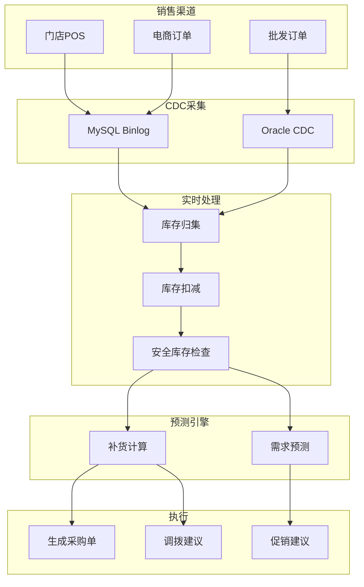
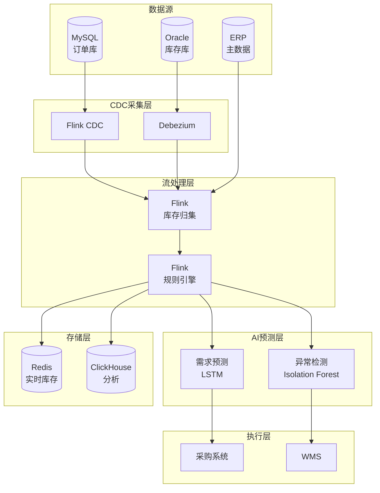

# 供应链实时库存管理案例研究

> **案例编号**: 11.4.1
> **行业**: 供应链/零售
> **场景**: 实时库存追踪、智能补货、需求预测
> **规模**: 5000+门店, 100万+SKU
> **编写日期**: 2026-04-09
> **状态**: Phase 2 - 初稿

---

## 执行摘要

### 业务背景

某大型零售连锁企业面临库存管理挑战：

- 全国5000+门店，100万+SKU
- 库存周转天数45天，资金占用高
- 缺货率8%，影响销售和客户满意度
- 过期损耗率3%，年损失数亿元

### 核心挑战

| 挑战 | 描述 | 影响 |
|------|------|------|
| 库存数据不同步 | 线上线下库存不一致 | 超卖/缺货 |
| 需求预测不准 | 季节性波动大 | 库存积压 |
| 供应链长 | 多级仓库 | 响应慢 |
| 多业态 | 门店/电商/批发 | 复杂度 |

### 解决方案

采用 **Flink + 实时CDC + 智能预测 + 自动补货** 架构：

- 实时库存同步 (CDC)
- 需求预测 (LSTM+Prophet)
- 自动补货决策
- 库存周转天数降低至30天，缺货率降至2%

---

## 1. 业务场景分析

### 1.1 库存管理流程



---

## 2. 技术架构



---

## 3. 核心算法

### 3.1 实时库存归集

```java
// Flink CDC + 库存归集
public class InventoryAggregator {

    public static void main(String[] args) {
        StreamExecutionEnvironment env =
            StreamExecutionEnvironment.getExecutionEnvironment();

        // 1. CDC Source - 订单变更流
        MySqlSource<String> orderSource = MySqlSource.<String>builder()
            .hostname("order-db.company.com")
            .port(3306)
            .databaseList("order_db")
            .tableList("order_db.orders, order_db.order_items")
            .username("cdc_user")
            .password("***")
            .deserializer(new JsonDebeziumDeserializationSchema())
            .build();

        DataStream<OrderChange> orderStream = env
            .fromSource(orderSource, WatermarkStrategy.noWatermarks(), "MySQL CDC")
            .map(new OrderChangeExtractor());

        // 2. CDC Source - 库存变更流
        OracleSource<String> inventorySource = OracleSource.<String>builder()
            .hostname("inventory-db.company.com")
            .port(1521)
            .database("INVENTORY")
            .schemaList("INV")
            .tableList("INV.STOCK_TRANSACTIONS")
            .username("cdc_user")
            .password("***")
            .deserializer(new JsonDebeziumDeserializationSchema())
            .build();

        DataStream<StockChange> stockStream = env
            .fromSource(inventorySource, WatermarkStrategy.noWatermarks(), "Oracle CDC")
            .map(new StockChangeExtractor());

        // 3. 库存归集 - 按SKU+仓库维度
        DataStream<SkuInventory> aggregated = orderStream
            .union(stockStream)
            .keyBy(change -> change.getSkuId() + "_" + change.getWarehouseId())
            .process(new InventoryAggregationFunction());

        // 4. 输出到Redis供实时查询
        aggregated.addSink(new RedisInventorySink());

        // 5. 安全库存检查
        aggregated
            .filter(inv -> inv.getAvailableQty() < inv.getSafetyStock())
            .addSink(new LowStockAlertSink());

        env.execute("Real-time Inventory Aggregation");
    }
}

// 库存归集函数
class InventoryAggregationFunction extends KeyedProcessFunction<String, InventoryChange, SkuInventory> {

    private ValueState<SkuInventory> inventoryState;

    @Override
    public void open(Configuration parameters) {
        inventoryState = getRuntimeContext().getState(
            new ValueStateDescriptor<>("inventory", SkuInventory.class));
    }

    @Override
    public void processElement(InventoryChange change, Context ctx, Collector<SkuInventory> out) {
        SkuInventory current = inventoryState.value();
        if (current == null) {
            current = new SkuInventory(change.getSkuId(), change.getWarehouseId());
        }

        // 根据变更类型更新库存
        switch (change.getType()) {
            case SALE:
                current.setAvailableQty(current.getAvailableQty() - change.getQty());
                current.setReservedQty(current.getReservedQty() + change.getQty());
                break;
            case RECEIPT:
                current.setOnHandQty(current.getOnHandQty() + change.getQty());
                current.setAvailableQty(current.getAvailableQty() + change.getQty());
                break;
            case SHIPMENT:
                current.setReservedQty(current.getReservedQty() - change.getQty());
                current.setOnHandQty(current.getOnHandQty() - change.getQty());
                break;
            case RETURN:
                current.setOnHandQty(current.getOnHandQty() + change.getQty());
                current.setAvailableQty(current.getAvailableQty() + change.getQty());
                break;
        }

        current.setLastUpdateTime(System.currentTimeMillis());
        inventoryState.update(current);
        out.collect(current);
    }
}
```

### 3.2 需求预测

```python
import pandas as pd
from prophet import Prophet
import torch
import torch.nn as nn

class DemandForecaster:
    def __init__(self):
        self.prophet_models = {}
        self.lstm_models = {}

    def train_prophet(self, sku_id, historical_sales):
        """训练Prophet模型进行中长期预测"""
        df = pd.DataFrame({
            'ds': historical_sales['date'],
            'y': historical_sales['quantity']
        })

        model = Prophet(
            yearly_seasonality=True,
            weekly_seasonality=True,
            daily_seasonality=False,
            holidays=self.get_holidays()
        )

        model.fit(df)
        self.prophet_models[sku_id] = model
        return model

    def train_lstm(self, sku_id, historical_sales):
        """训练LSTM模型进行短期预测"""
        # 数据准备
        data = historical_sales['quantity'].values
        scaler = MinMaxScaler()
        data_scaled = scaler.fit_transform(data.reshape(-1, 1))

        # 创建序列
        X, y = [], []
        seq_length = 30
        for i in range(seq_length, len(data_scaled)):
            X.append(data_scaled[i-seq_length:i])
            y.append(data_scaled[i])

        X, y = np.array(X), np.array(y)

        # 模型训练
        model = LSTMModel(input_size=1, hidden_size=64, num_layers=2, output_size=1)
        # ... 训练代码 ...

        self.lstm_models[sku_id] = (model, scaler)
        return model

    def forecast(self, sku_id, days=14):
        """综合预测：LSTM短期 + Prophet中长期"""
        # LSTM预测未来7天
        lstm_pred = self.predict_lstm(sku_id, days=7)

        # Prophet预测未来14天
        prophet_pred = self.predict_prophet(sku_id, days=14)

        # 加权融合
        combined = []
        for i in range(days):
            if i < 7:
                # 前7天LSTM权重高
                combined.append(0.7 * lstm_pred[i] + 0.3 * prophet_pred[i])
            else:
                # 后7天Prophet权重高
                combined.append(0.3 * lstm_pred[min(i, 6)] + 0.7 * prophet_pred[i])

        return combined

    def get_holidays(self):
        """获取节假日信息"""
        return pd.DataFrame({
            'holiday': 'major_sale',
            'ds': pd.to_datetime(['2026-11-11', '2026-06-18', '2026-01-01']),
            'lower_window': -3,
            'upper_window': 3,
        })
```

---

## 4. 性能指标

| 指标 | 优化前 | 优化后 | 提升 |
|------|--------|--------|------|
| 库存周转天数 | 45天 | 30天 | **-33%** |
| 缺货率 | 8% | 2% | **-75%** |
| 过期损耗率 | 3% | 1.2% | **-60%** |
| 库存准确率 | 85% | 99.5% | **+17%** |
| 需求预测准确率 | - | 88% | **新增** |

---

## 5. 经验总结

### 关键成功因素

1. **CDC实时同步**: 确保库存数据一致性
2. **分层预测**: LSTM短期+Prophet中长期
3. **异常检测**: 自动识别销量异常
4. **业务规则**: 安全库存、最小订货量等

### 技术挑战

- **CDC延迟**: 高峰期CDC延迟，采用批量补偿
- **数据质量**: 脏数据影响预测，增加清洗层
- **模型更新**: 每日增量训练，每周全量训练

---

*Phase 2 - 任务线2-4: 供应链实时库存管理案例*
