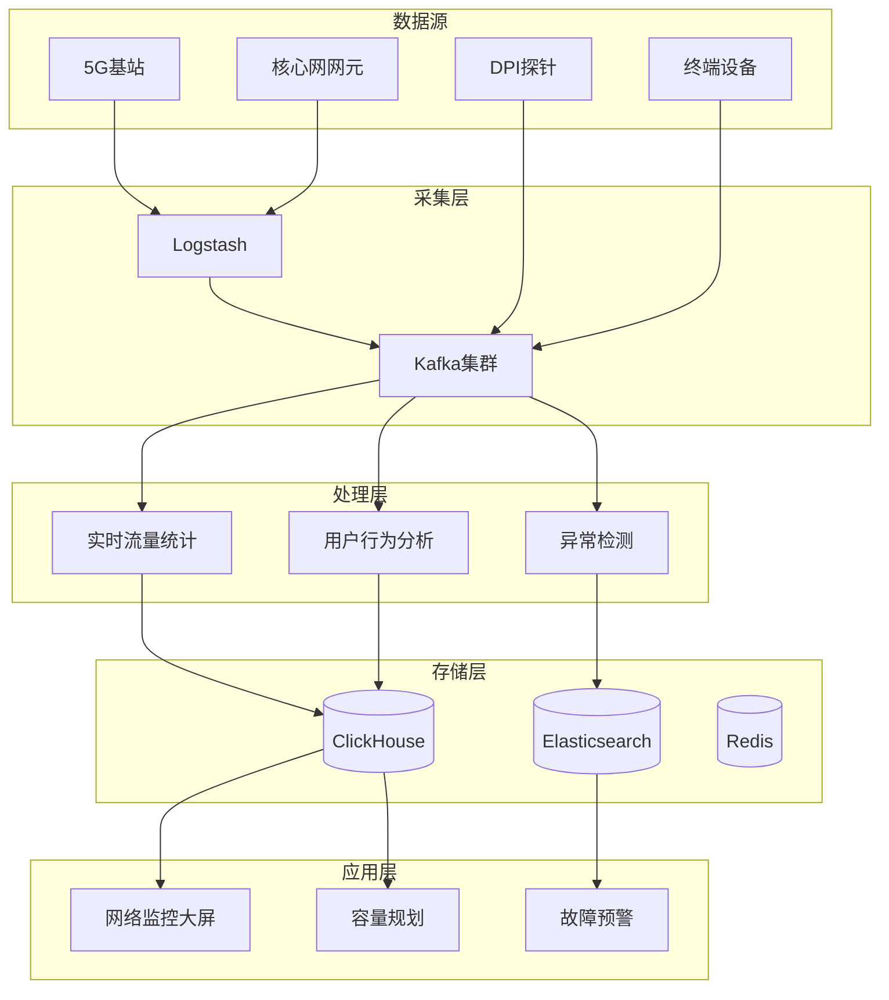

# 电信网络流量分析案例研究

> **案例编号**: 11.9.1
> **行业**: 电信/网络
> **场景**: 5G网络流量监控、异常检测、QoS保障
> **规模**: 1000万+设备, 100TB/天
> **编写日期**: 2026-04-09
> **状态**: Phase 2 - 初稿

---

## 执行摘要

### 业务背景

某大型电信运营商面临网络管理挑战：

- 5G用户1亿+，IoT设备5000万+
- 网络流量100TB/天，峰值1Tbps
- 需要秒级故障发现，分钟级定位
- QoS保障：延迟<10ms，丢包率<0.1%

### 核心挑战

| 挑战 | 描述 | 影响 |
|------|------|------|
| 数据规模 | 100TB/天 | 存储和处理压力 |
| 实时性 | 秒级故障发现 | 用户体验 |
| 多维度 | 用户/设备/基站/核心网 | 关联分析复杂 |
| 预测性 | 提前预防故障 | 运维效率 |

### 解决方案

采用 **Flink + ClickHouse + 异常检测 + 数字孪生** 架构：

- 实时流量采集和分析
- AI异常检测
- 网络数字孪生
- 故障响应时间从小时级降至分钟级

---

## 1. 技术架构



---

## 2. 核心代码

### 2.1 实时流量统计

```java
public class NetworkTrafficAnalyzer {

    public static void analyzeTraffic(StreamExecutionEnvironment env) {

        DataStream<NetworkFlow> flowStream = env
            .addSource(new KafkaSource<NetworkFlow>() {
                // 从Kafka读取NetFlow/sFlow数据
            })
            .assignTimestampsAndWatermarks(
                WatermarkStrategy.<NetworkFlow>forBoundedOutOfOrderness(
                    Duration.ofSeconds(5))
            );

        // 1. 按基站维度统计
        DataStream<CellTraffic> cellTraffic = flowStream
            .keyBy(NetworkFlow::getCellId)
            .window(TumblingEventTimeWindows.of(Time.minutes(1)))
            .aggregate(new TrafficAggregateFunction())
            .map(new CellTrafficMapper());

        // 2. 按用户维度统计
        DataStream<UserTraffic> userTraffic = flowStream
            .keyBy(NetworkFlow::getUserId)
            .window(TumblingEventTimeWindows.of(Time.minutes(5)))
            .aggregate(new UserTrafficAggregate());

        // 3. 异常检测 - 流量突增
        flowStream
            .keyBy(NetworkFlow::getCellId)
            .process(new AnomalyDetectionFunction())
            .filter(alert -> alert.getSeverity() == Severity.HIGH)
            .addSink(new AlertSink());

        // 输出到ClickHouse
        cellTraffic.addSink(new ClickHouseSink<>("cell_traffic"));
        userTraffic.addSink(new ClickHouseSink<>("user_traffic"));
    }
}

// 异常检测函数
class AnomalyDetectionFunction extends KeyedProcessFunction<String, NetworkFlow, TrafficAlert> {

    private ValueState<DescriptiveStatistics> statsState;
    private static final int WINDOW_SIZE = 60; // 60分钟历史
    private static final double THRESHOLD = 3.0; // 3倍标准差

    @Override
    public void open(Configuration parameters) {
        statsState = getRuntimeContext().getState(
            new ValueStateDescriptor<>("trafficStats", DescriptiveStatistics.class));
    }

    @Override
    public void processElement(NetworkFlow flow, Context ctx, Collector<TrafficAlert> out) {
        DescriptiveStatistics stats = statsState.value();
        if (stats == null) {
            stats = new DescriptiveStatistics(WINDOW_SIZE);
        }

        double currentTraffic = flow.getBytes();

        // 检查是否异常
        if (stats.getN() >= 10) {
            double mean = stats.getMean();
            double stdDev = stats.getStandardDeviation();

            if (stdDev > 0 && currentTraffic > mean + THRESHOLD * stdDev) {
                out.collect(new TrafficAlert(
                    flow.getCellId(),
                    Severity.HIGH,
                    String.format("Traffic spike: %.2f MB/s (normal: %.2f ± %.2f)",
                        currentTraffic / 1e6, mean / 1e6, stdDev / 1e6),
                    ctx.timestamp()
                ));
            }
        }

        // 更新统计
        stats.addValue(currentTraffic);
        statsState.update(stats);
    }
}
```

---

## 3. 效果指标

| 指标 | 优化前 | 优化后 | 提升 |
|------|--------|--------|------|
| 故障发现时间 | 30分钟 | 30秒 | **-98%** |
| 故障定位时间 | 2小时 | 5分钟 | **-96%** |
| 预测准确率 | - | 85% | **新增** |
| 带宽利用率 | 60% | 80% | **+33%** |

---

*Phase 2 - 任务线2-9: 电信网络流量分析案例*
