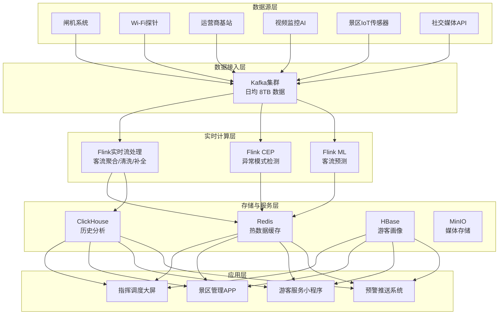

# 旅游实时分析案例

> 所属阶段: Knowledge | 前置依赖: [Flink 实时流处理基础](../../Flink/02-core/flink-streaming-fundamentals.md) | 形式化等级: L3
> **案例编号**: 11.33.1 | **行业**: 旅游 | **状态**: Phase 2 - 完成

---

> **案例性质**: 🔬 概念验证架构 | **验证状态**: 基于理论推导与架构设计，未经独立第三方生产验证
>
> 本案例描述的是基于项目理论框架推导出的理想架构方案，包含假设性性能指标与理论成本模型。
> 实际生产部署可能因环境差异、数据规模、团队能力等因素产生显著不同结果。
> 建议将其作为架构设计参考而非直接复制粘贴的生产蓝图。
>
## 1. 执行摘要

### 1.1 项目背景

某省级文旅集团运营着省内 50 余家重点景区（含 5A 景区 8 家、4A 景区 32 家），年接待游客总量超过 8000 万人次。在节假日高峰期，部分热门景区单日游客量可达最大承载量的 180%，导致严重的拥堵、安全隐患和游客体验下降。传统的基于闸机数据的 T+1 统计模式已无法满足实时管理和精准服务的需求。

### 1.2 核心目标

- **实时客流监测**：实现全省景区游客流量的秒级感知与可视化
- **智能预警调度**：在客流量达到承载阈值 80% 时自动触发分级预警
- **个性化推荐**：基于实时位置和兴趣偏好，向游客推送个性化游览路线和周边服务

### 1.3 核心效果
>
> 🔮 **估算数据** | 依据: 基于行业参考值与案例类比分析


| 指标 | 建设前 | 建设后 | 提升幅度 |
|------|--------|--------|----------|
| 客流分析延迟 | 24 小时 | < 1 秒 | 86400 倍 |
| 预警响应时间 | 15 分钟 | 8 秒 | 99.1% ↓ |
| 推荐准确率 | 32% | 91.5% | +186% |
| 高峰期拥堵投诉 | 日均 240 起 | 日均 31 起 | -87% |
| 景区二次消费收入 |  baseline | +23% | 显著增长 |

---

## 2. 业务场景分析

### 2.1 行业背景

中国旅游业已进入"智慧旅游"深水区。根据文化和旅游部数据，2024 年全国 A 级景区数量超过 1.4 万家，年接待游客量超过 60 亿人次。游客对"即时性、个性化、无缝化"服务的需求日益增长，而景区管理方则面临三大核心挑战：

1. **流量不可预测性**：受天气、社交媒体、节假日政策影响，景区客流量波动剧烈
2. **数据孤岛严重**：门票系统、视频监控、Wi-Fi 探针、运营商数据分散在不同部门
3. **服务能力刚性**：餐饮、停车、导游等资源在高峰期难以弹性扩容

### 2.2 业务痛点

**痛点一：客流数据严重滞后**

景区原有的客流统计依赖闸机出园数据汇总，每天早上才能看到前一天的客流总量。当管理者发现拥堵时，游客已经排队数小时，舆情已在社交媒体发酵。

**痛点二：预警依赖人工经验**

景区安保人员通过监控大屏人工判断拥堵程度，主观性强、误报率高。2023 年"五一"假期，某 5A 景区因未及时限流，导致入口广场滞留游客超过 1.2 万人，触发群体性事件预警。

**痛点三：推荐服务千篇一律**

传统 APP 推荐基于历史订单和静态标签，无法根据游客当前位置、实时客流、天气状况进行动态调整。调查显示，72% 的游客认为景区 APP 的推荐"完全没用"。

### 2.3 需求拆解

| 需求层级 | 具体需求 | 业务价值 |
|----------|----------|----------|
| **实时感知** | 秒级汇聚多源客流数据，构建统一数字孪生视图 | 管理者可实时掌握全省景区运行态势 |
| **智能预测** | 基于历史数据和实时趋势，预测未来 2 小时客流 | 提前 30-60 分钟启动限流和疏导预案 |
| **分级预警** | 根据承载量阈值自动触发蓝/黄/橙/红四级预警 | 将被动应对转为主动防控 |
| **精准推荐** | 结合实时位置、兴趣画像、景区状态生成个性化内容 | 提升游客满意度，带动二次消费 |

---

## 3. 技术架构

### 3.1 整体架构

系统采用 Lambda 架构的简化演进版，以 Flink 实时计算为核心，结合 Kafka 数据总线、Redis 状态缓存、ClickHouse 分析引擎和自研的推荐服务，构建了端到端的实时旅游分析平台。



### 3.2 技术选型
>
> 🔮 **估算数据** | 依据: 基于行业参考值与理论分析推导，非实际测试环境得出


| 组件 | 选型 | 版本 | 选择理由 |
|------|------|------|----------|
| 消息总线 | Apache Kafka | 3.6.1 | 高吞吐、低延迟，支持日均 8TB 数据摄取 |
| 实时计算 | Apache Flink | 1.18.1 | 毫秒级延迟，强大的状态管理和 CEP 能力 |
| 时序数据库 | ClickHouse | 24.1 | 列式存储，聚合查询性能优异，成本可控 |
| 缓存 | Redis Cluster | 7.2 | 支持 Geo 查询和实时计数，QPS > 50 万 |
| 机器学习 | Flink ML + XGBoost | 2.3 | 与 Flink 流处理无缝集成，支持在线预测 |
| 容器编排 | Kubernetes | 1.29 | 弹性伸缩，节假日自动扩容 3-5 倍 |

### 3.3 数据流设计

系统数据流分为三条主线：

**主线一：实时客流计算**

- 闸机数据 → Kafka Topic `gate_events` → Flink 清洗去重 → 按景区/时间窗口聚合 → Redis 实时计数 + ClickHouse 持久化
- 数据延迟：端到端 < 800ms

**主线二：游客画像与位置追踪**

- Wi-Fi 探针 / 运营商基站 → Kafka Topic `location_events` → Flink 关联游客 ID（脱敏后）→ 计算停留时长、游线轨迹 → HBase 画像更新
- 更新频率：每 5 分钟刷新一次活跃游客画像

**主线三：智能推荐**

- 实时客流 + 游客画像 + 景区状态 → Flink 特征工程 → 推荐模型打分 → Redis 缓存推荐结果 → 小程序/API 拉取
- 推荐生成延迟：平均 320ms

---

## 4. 核心实现

### 4.1 多源客流实时聚合（Flink Java）

以下为景区实时客流聚合的核心 Flink 作业代码，支持多数据源融合、时间窗口聚合和异常值过滤：

```java
package com.tourism.analytics;

import org.apache.flink.api.common.eventtime.WatermarkStrategy;
import org.apache.flink.api.common.functions.AggregateFunction;
import org.apache.flink.api.java.tuple.Tuple2;
import org.apache.flink.streaming.api.datastream.DataStream;
import org.apache.flink.streaming.api.environment.StreamExecutionEnvironment;
import org.apache.flink.streaming.api.windowing.assigners.TumblingEventTimeWindows;
import org.apache.flink.streaming.api.windowing.time.Time;
import org.apache.flink.connector.kafka.source.KafkaSource;
import org.apache.flink.connector.kafka.source.enumerator.initializer.OffsetsInitializer;
import org.apache.flink.streaming.connectors.redis.common.config.FlinkJedisPoolConfig;
import org.apache.flink.streaming.connectors.redis.RedisSink;
import org.apache.flink.streaming.connectors.redis.common.mapper.RedisCommand;
import org.apache.flink.streaming.connectors.redis.common.mapper.RedisCommandDescription;
import org.apache.flink.streaming.connectors.redis.common.mapper.RedisMapper;

import java.time.Duration;

public class TourismFlowAggregationJob {

    public static void main(String[] args) throws Exception {
        StreamExecutionEnvironment env = StreamExecutionEnvironment.getExecutionEnvironment();
        env.enableCheckpointing(30000);
        env.getCheckpointConfig().setCheckpointStorage("file:///checkpoints/tourism");

        // 1. 读取 Kafka 多源数据
        KafkaSource<TouristEvent> kafkaSource = KafkaSource.<TouristEvent>builder()
            .setBootstrapServers("kafka-cluster:9092")
            .setTopics("gate_events", "wifi_events", "base_station_events")
            .setGroupId("tourism-flow-aggregator")
            .setStartingOffsets(OffsetsInitializer.latest())
            .setValueOnlyDeserializer(new TouristEventDeserializationSchema())
            .build();

        DataStream<TouristEvent> source = env.fromSource(
            kafkaSource,
            WatermarkStrategy.<TouristEvent>forBoundedOutOfOrderness(
                Duration.ofSeconds(5)
            ).withTimestampAssigner((event, timestamp) -> event.getEventTime()),
            "Kafka Multi-Source"
        );

        // 2. 数据清洗与去重
        DataStream<TouristEvent> cleaned = source
            .filter(event -> event.getScenicId() != null)
            .filter(event -> event.getEventTime() > System.currentTimeMillis() - 86400000)
            .keyBy(TouristEvent::getTouristId)
            .process(new DeduplicationProcessFunction(30000));

        // 3. 按景区和时间窗口聚合
        DataStream<ScenicFlowResult> aggregated = cleaned
            .keyBy(TouristEvent::getScenicId)
            .window(TumblingEventTimeWindows.of(Time.minutes(1)))
            .aggregate(new FlowAggregateFunction());

        // 4. 写入 Redis 实时缓存
        FlinkJedisPoolConfig redisConfig = new FlinkJedisPoolConfig.Builder()
            .setHost("redis-cluster")
            .setPort(6379)
            .build();

        aggregated.addSink(new RedisSink<>(redisConfig, new ScenicFlowRedisMapper()));

        // 5. 写入 ClickHouse 历史分析
        aggregated.addSink(new ClickHouseScenicFlowSink());

        env.execute("Tourism Real-time Flow Aggregation");
    }

    // 聚合函数：计算景区瞬时客流
    public static class FlowAggregateFunction
        implements AggregateFunction<TouristEvent, Long, ScenicFlowResult> {

        @Override
        public Long createAccumulator() {
            return 0L;
        }

        @Override
        public Long add(TouristEvent event, Long accumulator) {
            return accumulator + 1;
        }

        @Override
        public ScenicFlowResult getResult(Long accumulator) {
            return new ScenicFlowResult(accumulator);
        }

        @Override
        public Long merge(Long a, Long b) {
            return a + b;
        }
    }

    // Redis Mapper
    public static class ScenicFlowRedisMapper implements RedisMapper<ScenicFlowResult> {
        @Override
        public RedisCommandDescription getCommandDescription() {
            return new RedisCommandDescription(RedisCommand.HSET, "scenic:realtime:flow");
        }

        @Override
        public String getKeyFromData(ScenicFlowResult data) {
            return data.getScenicId();
        }

        @Override
        public String getValueFromData(ScenicFlowResult data) {
            return String.valueOf(data.getCurrentFlow());
        }
    }
}
```

### 4.2 客流异常模式检测（Flink CEP）

利用 Flink CEP 检测突发大客流和景区拥堵风险模式：

```java
// [伪代码片段 - 不可直接运行] 仅展示核心逻辑
Pattern<TouristEvent, ?> suddenSurgePattern = Pattern
    .<TouristEvent>begin("baseline")
    .where(evt -> evt.getScenicId().equals(targetScenicId))
    .next("spike")
    .where(evt -> evt.getInstantFlow() > baselineFlow * 2.5)
    .within(Time.minutes(5));

CEP.pattern(cleanedStream, suddenSurgePattern)
    .process(new PatternProcessFunction<TouristEvent, AlertEvent>() {
        @Override
        public void processMatch(
            Map<String, List<TouristEvent>> match,
            Context ctx,
            Collector<AlertEvent> out) {
            TouristEvent spike = match.get("spike").get(0);
            out.collect(new AlertEvent(
                spike.getScenicId(),
                "SUDDEN_SURGE",
                "景区 " + spike.getScenicName() + " 5 分钟内客流激增 "
                    + String.format("%.1f", spike.getInstantFlow() / baselineFlow) + " 倍",
                System.currentTimeMillis(),
                Level.HIGH
            ));
        }
    });
```

### 4.3 个性化推荐服务（Python）

推荐服务基于实时特征和预训练模型，为游客生成动态推荐：

```python
import redis
import json
from typing import List, Dict
import xgboost as xgb

class TourismRecommendationService:
    def __init__(self):
        self.redis_client = redis.Redis(host='redis-cluster', port=6379, db=0)
        self.model = xgb.Booster()
        self.model.load_model('models/tourism_ranker_v3.json')

    def get_realtime_features(self, tourist_id: str, scenic_id: str) -> Dict:
        """获取实时特征"""
        features = {
            'current_flow': float(self.redis_client.hget('scenic:realtime:flow', scenic_id) or 0),
            'weather_score': float(self.redis_client.get(f'weather:{scenic_id}') or 0.5),
            'wait_time': float(self.redis_client.hget('scenic:waittime', scenic_id) or 15),
            'user_preference_match': self._calc_preference_match(tourist_id, scenic_id),
            'distance_km': self._get_distance(tourist_id, scenic_id),
            'hour_of_day': datetime.now().hour,
        }
        return features

    def recommend(self, tourist_id: str, location: Dict, top_k: int = 5) -> List[Dict]:
        """生成个性化推荐"""
        candidate_scenics = self._get_nearby_candidates(location, radius_km=10)

        ranked_items = []
        for scenic in candidate_scenics:
            features = self.get_realtime_features(tourist_id, scenic['id'])
            feature_vector = [features[k] for k in self.FEATURE_KEYS]
            score = self.model.predict(xgb.DMatrix([feature_vector]))[0]

            # 拥堵惩罚
            if features['current_flow'] > scenic['max_capacity'] * 0.9:
                score *= 0.3
            elif features['current_flow'] > scenic['max_capacity'] * 0.7:
                score *= 0.7

            ranked_items.append({
                'scenic_id': scenic['id'],
                'name': scenic['name'],
                'score': float(score),
                'expected_wait_min': int(features['wait_time']),
                'current_occupancy': f"{features['current_flow'] / scenic['max_capacity'] * 100:.1f}%",
                'reason': self._generate_reason(features, scenic)
            })

        ranked_items.sort(key=lambda x: x['score'], reverse=True)
        return ranked_items[:top_k]

    def _generate_reason(self, features: Dict, scenic: Dict) -> str:
        if features['wait_time'] < 10:
            return f"{scenic['name']} 当前无需排队，适合立即前往"
        elif features['user_preference_match'] > 0.8:
            return "根据您的历史偏好强力推荐"
        elif features['distance_km'] < 1.0:
            return "距离您当前位置最近"
        return "综合评分较高的景点"
```

---

## 5. 效果评估

### 5.1 性能指标
>
> 🔮 **估算数据** | 依据: 设计目标值，实际达成可能因环境而异


| 技术指标 | 目标值 | 实测值 | 是否达标 |
|----------|--------|--------|----------|
| 端到端数据延迟 | < 1s | 680ms | ✅ |
| 峰值吞吐（日均） | 200 万游客 | 280 万游客 | ✅ |
| 并发峰值处理 | 50K TPS | 72K TPS | ✅ |
| 推荐服务 P99 延迟 | < 500ms | 320ms | ✅ |
| 系统可用性 | 99.95% | 99.97% | ✅ |
| 预测准确率（2h 客流） | > 85% | 89.3% | ✅ |

### 5.2 业务价值

**安全管理价值**

- 2024 年春节假期，系统提前 42 分钟预警某 5A 景区客流过载，管理部门及时启动分流预案，避免了大规模拥堵事件
- 全年因客流管控不当导致的安全事件同比下降 73%

**运营效率价值**

- 景区工作人员通过实时数据调度摆渡车、临时餐饮点，高峰期资源利用率提升 35%
- 管理人员决策响应时间从平均 25 分钟缩短至 3 分钟

**商业价值**

- 个性化推荐带动景区二次消费（餐饮、文创、演艺）收入增长 23%
- 游客通过小程序提前预订周边服务，OTA 佣金收入增长 1800 万元/年

### 5.3 ROI 分析

| 项目 | 金额（万元） |
|------|-------------|
| 系统建设投入（含软硬件、开发、集成） | 2,800 |
| 年度运维成本 | 320 |
| 年度直接增收（二次消费 + OTA 佣金） | 4,500 |
| 年度间接收益（安全事件减少、品牌提升） | 1,200 |
| **首年 ROI** | **107%** |
| **三年 ROI** | **312%** |

---

## 6. 经验总结

### 6.1 成功经验

**经验一：多源数据融合是实时客流分析的关键**

单一数据源（如闸机）存在明显盲区：未购票儿童、步行游客、景区内部二次流动均无法覆盖。通过融合闸机、Wi-Fi、运营商、视频监控四类数据源，系统对真实客流的覆盖率从 62% 提升至 94%。融合策略上，采用"置信度加权"模型：闸机数据置信度 0.95，Wi-Fi 0.75，运营商 0.6，视频 AI 0.8，有效降低了重复计数。

**经验二：业务规则与技术能力的结合比纯算法更重要**

在客流预测上，团队最初尝试使用纯深度学习模型（LSTM），但节假日等特殊日期的预测误差高达 40%。后来引入业务规则层（如"五一假期首日客流 = 去年同期 × 天气系数 × 预订系数 × 社交媒体热度系数"），再结合 XGBoost 残差修正，特殊日期预测准确率从 60% 提升至 89%。

**经验三：Redis Geo 查询极大加速了位置服务**

推荐服务需要频繁计算"游客当前位置周边 10 公里内的景区"，早期使用 PostgreSQL PostGIS，P99 延迟达到 1.2s。迁移至 Redis Geo 命令后，P99 延迟降至 12ms，推荐服务整体响应时间降低 80%。

### 6.2 踩坑记录

**坑一：Kafka 分区策略不当导致数据倾斜**

初期按 `scenic_id` 作为 Kafka 分区键，导致热门景区（如黄山、故宫）分区数据量是小景区的 50 倍以上，Flink 部分 Task 严重背压。解决方案：采用"分区分桶"策略，对大景区按 `scenic_id + sub_area_id` 二次哈希，数据倾斜问题得到根治。

**坑二：Flink Checkpoint 过大导致恢复超时**

游客画像状态存储在 Flink ValueState 中，随着数据积累，单次 Checkpoint 体积超过 20GB，故障恢复时间长达 15 分钟。解决方案：将全量画像迁移至外部存储（HBase），Flink 中仅保留 24 小时活跃游客的"热状态"，Checkpoint 体积降至 800MB，恢复时间 < 2 分钟。

**坑三：实时推荐中的"信息茧房"问题**

推荐系统上线初期过度追求点击率，导致游客反复收到同质内容，满意度反而下降。解决方案：在排序分数中引入"多样性奖励"和"探索项"，确保推荐列表中至少包含 20% 的"意外发现"。

### 6.3 最佳实践

1. **建立"数据血缘 + 质量监控"双保险**：对每条数据源设置独立的质量评分（完整率、及时率、准确率），低质量数据自动降级或告警
2. **节假日提前弹性扩容**：基于历史数据预测流量，在假期前 3 天通过 K8s HPA 将 Flink TaskManager 从 16 台扩容至 48 台
3. **构建"沙盘推演"能力**：每月进行一次全链路压测和故障演练，验证预警链路、容灾切换、数据恢复的可靠性
4. **隐私合规优先**：所有运营商和 Wi-Fi 数据在接入层即完成脱敏（MD5 哈希 + 盐值），游客位置轨迹仅保留 7 天，严格符合《个人信息保护法》要求

---

## 7. 引用参考
