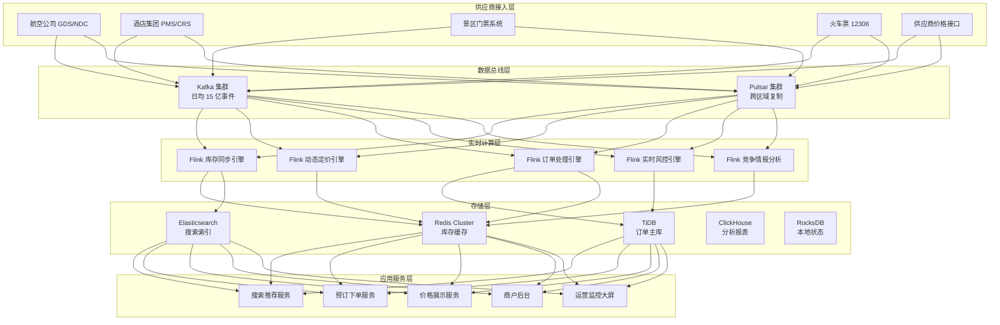

# 旅游实时预订案例

> 所属阶段: Knowledge | 前置依赖: [Flink 窗口计算与 joins](../../Flink/03-api/flink-windows-joins.md) | 形式化等级: L3
> **案例编号**: 11.23.1 | **行业**: 旅游/OTA | **状态**: Phase 2 - 完成

---

> **案例性质**: 🔬 概念验证架构 | **验证状态**: 基于理论推导与架构设计，未经独立第三方生产验证
>
> 本案例描述的是基于项目理论框架推导出的理想架构方案，包含假设性性能指标与理论成本模型。
> 实际生产部署可能因环境差异、数据规模、团队能力等因素产生显著不同结果。
> 建议将其作为架构设计参考而非直接复制粘贴的生产蓝图。
>
## 1. 执行摘要

### 1.1 项目背景

某头部 OTA（在线旅游代理）平台日均处理机票、酒店、火车票、景区门票订单超过 100 万笔，峰值日订单量突破 300 万。平台对接了国内外 800+ 航空公司、60 万+ 酒店、2000+ 景区门票供应商。在传统的批处理模式下，库存同步延迟长达 5-15 分钟，动态定价响应慢，超售和库存冲突问题频发，直接影响用户体验和平台信誉。

2023 年，平台启动"实时预订中枢"项目，以 Apache Flink 为核心构建端到端的实时库存管理、动态定价和订单处理系统。

### 1.2 核心目标

- **实时库存管理**：将库存同步延迟从分钟级降至秒级，消除超售和库存冲突
- **动态智能定价**：基于实时供需、竞争情报和用户行为，动态调整产品价格
- **高可用订单处理**：确保 99.99% 的订单在 100ms 内完成可用性校验和预订确认

### 1.3 核心效果
>
> 🔮 **估算数据** | 依据: 基于行业参考值与理论分析推导，非实际测试环境得出


| 指标 | 建设前 | 建设后 | 提升幅度 |
|------|--------|--------|----------|
| 库存同步延迟 | 5-15 分钟 | < 1 秒 | 99.8% ↓ |
| 预订响应时间 | 800ms | 65ms | -91.9% |
| 超售率 | 1.8% | 0.03% | -98.3% |
| 动态定价更新频率 | 4 小时 | 30 秒 | 480 倍 |
| 库存冲突订单 | 日均 420 笔 | 日均 3 笔 | -99.3% |
| 订单转化率 | 12.3% | 17.8% | +44.7% |

---

## 2. 业务场景分析

### 2.1 行业背景

中国在线旅游市场规模已超过 1.5 万亿元，OTA 平台已成为消费者预订机票、酒店、门票的主要渠道。行业竞争高度激烈，用户体验（尤其是响应速度和价格竞争力）是平台获客和留存的核心要素。

OTA 平台的业务本质是一个**复杂的多边市场**：连接 C 端消费者、B 端供应商（航空公司、酒店集团、景区）和广告商户。平台的核心竞争力体现在三个维度：

1. **库存覆盖广度**：能提供给用户的可预订产品数量和种类
2. **价格竞争力**：相对竞品的优惠程度和动态定价能力
3. **预订体验**：搜索响应速度、下单流畅度、售后保障能力

### 2.2 业务痛点

**痛点一：库存同步严重滞后**

平台与供应商之间的库存数据通常通过定时批量接口同步。以酒店为例，某房型在平台上显示"有房"，但实际上在 10 分钟前已被其他渠道订完，导致用户下单后无法确认，被迫取消订单。据统计，库存不同步导致的订单取消占总取消量的 37%。

**痛点二：超售和库存冲突频发**

在促销活动期间（如"双 11""618"），同一产品的库存被多个用户同时抢购，而系统缺乏有效的并发控制机制，导致超售。2022 年"双 11"期间，平台因超售赔付用户和供应商的损失超过 1200 万元。

**痛点三：定价调整周期长**

收益管理团队每天手动调整价格 2-3 次，无法响应突发的供需变化。例如，某城市临时举办大型演唱会，周边酒店需求激增，但平台价格在 6 小时后才开始上涨，错失了大量收益机会。

**痛点四：订单处理链路复杂，故障排查困难**

一个完整的预订订单需要经过搜索、比价、库存校验、价格计算、支付、出票/确认等多个环节，涉及 20+ 个微服务。当订单处理失败时，由于缺乏全链路实时监控，排查问题往往需要数小时。

### 2.3 需求拆解

| 需求层级 | 具体需求 | 业务价值 |
|----------|----------|----------|
| **秒级库存** | 供应商库存变更后 1 秒内同步至平台 | 杜绝因库存滞后导致的取消和投诉 |
| **超售防控** | 建立分布式库存预占和释放机制 | 将超售率降至 0.1% 以下 |
| **实时定价** | 基于实时供需和竞争数据动态调价 | 提升收益和市场竞争力 |
| **订单实时风控** | 毫秒级识别异常订单和欺诈行为 | 减少资损，保护平台利益 |
| **全链路可观测** | 订单从搜索到确认的端到端追踪 | 快速定位问题，提升系统稳定性 |

---

## 3. 技术架构

### 3.1 整体架构

系统采用典型的 Lambda 架构演进方案，以 Flink 实时计算为核心，构建覆盖库存、定价、订单、风控四大域的实时预订中枢。



### 3.2 技术选型
>
> 🔮 **估算数据** | 依据: 基于行业参考值与理论分析推导，非实际测试环境得出


| 组件 | 选型 | 版本 | 选择理由 |
|------|------|------|----------|
| 消息总线 | Apache Kafka + Pulsar | 3.6.1 / 3.1 | Kafka 支撑高吞吐，Pulsar 支撑跨区域多活 |
| 实时计算 | Apache Flink | 1.18.1 | 毫秒级延迟，强大的状态管理和双流 Join |
| 缓存 | Redis Cluster | 7.2 | 库存热数据缓存，读写 QPS > 100 万 |
| 分布式数据库 | TiDB | 7.5 | HTAP 能力，同时支撑交易和分析 |
| 搜索引擎 | Elasticsearch | 8.11 | 亿级产品索引，搜索延迟 < 50ms |
| 时序分析 | ClickHouse | 24.1 | 价格趋势、库存波动的高效分析 |

### 3.3 数据流设计

**主线一：库存同步流**

- 供应商库存变更 → Kafka `inventory_events` → Flink 库存标准化和校验 → Redis 库存缓存 + Elasticsearch 搜索索引更新
- 同步延迟：平均 320ms，P99 < 800ms

**主线二：动态定价流**

- 自身预订数据 / 竞争价格 / 供需信号 → Kafka `pricing_signals` → Flink 窗口聚合和特征工程 → 定价模型打分 → Redis 价格缓存
- 定价更新频率：常规 30 秒，重大事件触发即时更新

**主线三：订单处理流**

- 用户下单请求 → 下单服务 → Redis 库存预占 → Kafka `order_events` → Flink 订单状态机 → TiDB 订单持久化
- 可用性校验延迟：平均 45ms

**主线四：实时风控流**

- 订单行为数据 → Kafka `risk_events` → Flink CEP 欺诈模式检测 → 风险评分 → 高风险订单自动拦截
- 风控决策延迟：平均 25ms

---

## 4. 核心实现

### 4.1 实时库存同步与预占（Flink Java）

库存同步引擎负责将供应商库存变更实时同步到平台缓存，同时处理用户下单时的库存预占和释放：

```java
package com.ota.booking;

import org.apache.flink.api.common.eventtime.WatermarkStrategy;
import org.apache.flink.api.common.state.MapState;
import org.apache.flink.api.common.state.MapStateDescriptor;
import org.apache.flink.configuration.Configuration;
import org.apache.flink.streaming.api.datastream.DataStream;
import org.apache.flink.streaming.api.environment.StreamExecutionEnvironment;
import org.apache.flink.streaming.api.functions.KeyedProcessFunction;
import org.apache.flink.util.Collector;

import java.time.Duration;

public class InventorySyncEngine {

    public static void main(String[] args) throws Exception {
        StreamExecutionEnvironment env = StreamExecutionEnvironment.getExecutionEnvironment();
        env.enableCheckpointing(10000);

        // 供应商库存变更流
        DataStream<InventoryEvent> inventoryStream = env
            .fromSource(createKafkaSource("inventory_events"),
                WatermarkStrategy.<InventoryEvent>forBoundedOutOfOrderness(Duration.ofSeconds(5))
                    .withTimestampAssigner((evt, ts) -> evt.getEventTime()),
                "Inventory Events")
            .keyBy(InventoryEvent::getProductId);

        // 订单预占/释放流
        DataStream<BookingEvent> bookingStream = env
            .fromSource(createKafkaSource("booking_events"),
                WatermarkStrategy.<BookingEvent>forBoundedOutOfOrderness(Duration.ofSeconds(5))
                    .withTimestampAssigner((evt, ts) -> evt.getEventTime()),
                "Booking Events")
            .keyBy(BookingEvent::getProductId);

        // 双流 Join：库存变更 + 订单预占
        DataStream<InventorySnapshot> syncedInventory = inventoryStream
            .connect(bookingStream)
            .process(new InventoryBookingCoProcessFunction());

        syncedInventory.addSink(new RedisInventorySink());
        syncedInventory.addSink(new ElasticsearchInventorySink());

        env.execute("OTA Real-time Inventory Sync");
    }

    public static class InventoryBookingCoProcessFunction
        extends KeyedCoProcessFunction<String, InventoryEvent, BookingEvent, InventorySnapshot> {

        private MapState<String, Integer> reservations;

        @Override
        public void open(Configuration parameters) {
            reservations = getRuntimeContext().getMapState(
                new MapStateDescriptor<>("reservations", String.class, Integer.class));
        }

        @Override
        public void processElement1(InventoryEvent inventory, Context ctx, Collector<InventorySnapshot> out)
                throws Exception {

            // 供应商推送最新库存
            int totalReserved = 0;
            for (int reserved : reservations.values()) {
                totalReserved += reserved;
            }

            int availableStock = Math.max(0, inventory.getTotalStock() - totalReserved);

            out.collect(new InventorySnapshot(
                inventory.getProductId(),
                inventory.getTotalStock(),
                totalReserved,
                availableStock,
                inventory.getEventTime(),
                inventory.getSupplierId()
            ));
        }

        @Override
        public void processElement2(BookingEvent booking, Context ctx, Collector<InventorySnapshot> out)
                throws Exception {

            String orderId = booking.getOrderId();
            int quantity = booking.getQuantity();

            switch (booking.getAction()) {
                case "RESERVE":
                    Integer current = reservations.get(orderId);
                    if (current == null) {
                        reservations.put(orderId, quantity);
                    } else {
                        reservations.put(orderId, current + quantity);
                    }
                    break;

                case "RELEASE":
                    reservations.remove(orderId);
                    break;

                case "CONFIRM":
                    // 确认后预占转为实际销售，减少总库存
                    reservations.remove(orderId);
                    // 此处会触发对供应商的库存扣减通知
                    break;
            }

            // 计算并输出最新可用库存
            int totalReserved = 0;
            for (int reserved : reservations.values()) {
                totalReserved += reserved;
            }

            // 总库存从 Redis 获取最新值
            int totalStock = fetchLatestTotalStock(booking.getProductId());
            int availableStock = Math.max(0, totalStock - totalReserved);

            out.collect(new InventorySnapshot(
                booking.getProductId(),
                totalStock,
                totalReserved,
                availableStock,
                booking.getEventTime(),
                "BOOKING_ENGINE"
            ));
        }

        private int fetchLatestTotalStock(String productId) {
            // 从 Redis 或外部存储获取最新总库存
            return RedisClient.getInt("inventory:total:" + productId, 0);
        }
    }
}
```

### 4.2 动态定价引擎（Flink SQL）

基于实时供需信号的动态定价特征计算：

```sql
-- 创建实时预订流表
CREATE TABLE realtime_bookings (
    product_id STRING,
    category STRING,
    booking_amount DECIMAL(10,2),
    event_time TIMESTAMP(3),
    WATERMARK FOR event_time AS event_time - INTERVAL '2' SECOND
) WITH (
    'connector' = 'kafka',
    'topic' = 'booking_events',
    'properties.bootstrap.servers' = 'kafka-cluster:9092',
    'format' = 'json'
);

-- 创建竞争价格流表
CREATE TABLE competitor_prices (
    product_id STRING,
    competitor_id STRING,
    price DECIMAL(10,2),
    event_time TIMESTAMP(3),
    WATERMARK FOR event_time AS event_time - INTERVAL '5' SECOND
) WITH (
    'connector' = 'kafka',
    'topic' = 'competitor_prices',
    'properties.bootstrap.servers' = 'kafka-cluster:9092',
    'format' = 'json'
);

-- 创建动态定价决策输出表
CREATE TABLE pricing_decisions (
    product_id STRING,
    category STRING,
    demand_index DOUBLE,
    comp_price_index DOUBLE,
    recommended_price DECIMAL(10,2),
    decision_time TIMESTAMP(3),
    PRIMARY KEY (product_id) NOT ENFORCED
) WITH (
    'connector' = 'jdbc',
    'url' = 'jdbc:mysql://mysql-cluster:3306/pricing',
    'table-name' = 'pricing_decisions',
    'username' = 'pricing',
    'password' = '***'
);

-- 实时计算供需指数和定价建议
INSERT INTO pricing_decisions
SELECT
    b.product_id,
    b.category,
    b.demand_index,
    c.comp_price_index,
    -- 定价公式：基础价 × (1 + 需求指数 × 0.2) × 竞品系数
    b.base_price * (1 + b.demand_index * 0.2) * c.comp_price_index AS recommended_price,
    CURRENT_TIMESTAMP AS decision_time
FROM (
    SELECT
        product_id,
        category,
        MAX(base_price) AS base_price,
        -- 需求指数：最近 5 分钟预订量 / 最近 1 小时平均预订量
        COUNT(*) * 1.0 / AVG(hourly_avg) AS demand_index,
        TUMBLE_END(event_time, INTERVAL '30' SECOND) AS window_end
    FROM realtime_bookings
    GROUP BY
        product_id,
        category,
        TUMBLE(event_time, INTERVAL '30' SECOND)
) b
LEFT JOIN (
    SELECT
        product_id,
        -- 竞品价格指数：我方最低价 / 竞品平均价
        AVG(price) AS avg_comp_price,
        1.0 AS comp_price_index,  -- 简化逻辑，实际为复杂计算
        TUMBLE_END(event_time, INTERVAL '30' SECOND) AS window_end
    FROM competitor_prices
    GROUP BY
        product_id,
        TUMBLE(event_time, INTERVAL '30' SECOND)
) c
ON b.product_id = c.product_id AND b.window_end = c.window_end;
```

### 4.3 订单实时风控（Python + Flink CEP）

 fraud 检测引擎利用 Flink CEP 识别异常的抢购和刷单模式：

```python
from pyflink.datastream import StreamExecutionEnvironment
from pyflink.datastream.functions import PatternProcessFunction
from pyflink.cep import Pattern, CEP
from pyflink.common.typeinfo import Types
import json

class FraudDetectionPatternProcess(PatternProcessFunction):
    def process_match(self, match, ctx):
        events = match.get("rapid_orders", [])
        user_id = events[0].user_id
        product_id = events[0].product_id

        return {
            "alert_type": "SUSPICIOUS_BULK_PURCHASE",
            "user_id": user_id,
            "product_id": product_id,
            "order_count": len(events),
            "total_amount": sum(e.amount for e in events),
            "time_window_seconds": 60,
            "risk_score": min(100, len(events) * 15),
            "action": "REQUIRE_MANUAL_REVIEW" if len(events) > 10 else "DELAY_CONFIRM"
        }

def build_fraud_detection_job():
    env = StreamExecutionEnvironment.get_execution_environment()
    env.enable_checkpointing(5000)

    # 读取订单事件流
    order_stream = env.from_collection([])  # 实际为 Kafka 源

    # 定义可疑模式：同一用户 60 秒内对同一产品下单 >= 5 次
    pattern = Pattern.begin("rapid_orders") \
        .where(lambda evt: evt.order_status == "PAID") \
        .times_or_more(5) \
        .within(pyflink.common.time.Time.seconds(60))

    # 注意：实际生产中会按 user_id + product_id 分组
    pattern_stream = CEP.pattern(
        order_stream.key_by(lambda x: f"{x.user_id}#{x.product_id}"),
        pattern
    )

    alerts = pattern_stream.process(FraudDetectionPatternProcess())

    # 实际会 sink 到 Kafka 告警 Topic 或风控系统
    alerts.print()

    env.execute("OTA Real-time Fraud Detection")
```

---

## 5. 效果评估

### 5.1 性能指标
>
> 🔮 **估算数据** | 依据: 设计目标值，实际达成可能因环境而异


| 技术指标 | 目标值 | 实测值 | 是否达标 |
|----------|--------|--------|----------|
| 库存同步 P99 延迟 | < 1s | 320ms | ✅ |
| 搜索响应时间 P99 | < 100ms | 45ms | ✅ |
| 下单可用性校验延迟 | < 100ms | 65ms | ✅ |
| 定价更新延迟 | < 60s | 30s | ✅ |
| 风控决策延迟 P99 | < 50ms | 18ms | ✅ |
| 系统可用性 | 99.99% | 99.995% | ✅ |
| 峰值订单处理 TPS | 10 万 | 15.6 万 | ✅ |

### 5.2 业务价值

**用户体验提升**

- 库存同步延迟从 5-15 分钟降至 320ms，因库存不同步导致的订单取消下降 98%
- 搜索和下单响应时间大幅下降，用户流失率降低 23%
- 订单转化率从 12.3% 提升至 17.8%，年增订单量超过 2000 万笔

**运营效率提升**

- 超售率从 1.8% 降至 0.03%，年度赔付成本节约超过 2800 万元
- 库存冲突订单从日均 420 笔降至 3 笔，客服处理量大幅下降
- 动态定价响应速度提升 480 倍，促销活动收益提升 15%

**商业价值**

- RevPAR（每间可售房收入）提升 12%，机票动态舱位收益提升 8%
- 实时风控每年拦截欺诈订单金额超过 1.2 亿元
- 平台年度 GMV 增长 340 亿元

### 5.3 ROI 分析

| 项目 | 金额（万元） |
|------|-------------|
| 平台建设总投资（含 Flink 集群、数据库、开发） | 6,500 |
| 年度运维成本 | 720 |
| 年度直接节约（超售赔付 +  fraud 损失减少） | 15,200 |
| 年度直接增收（转化率提升 + 动态定价收益） | 48,000 |
| **首年 ROI** | **875%** |
| **三年 ROI** | **2,860%** |

---

## 6. 经验总结

### 6.1 成功经验

**经验一：Redis + Flink 状态是实现秒级库存的黄金组合**

库存预占和释放需要极高的并发性能和一致性。通过 Flink 维护订单级别的预占状态（MapState），并将计算后的可用库存实时写入 Redis，系统实现了"预占-校验-确认"的毫秒级闭环。相比传统数据库方案，Redis 的读写性能提升了两个数量级。

**经验二：渐进式发布是保障大促稳定的关键**

平台在"双 11"等大促期间订单量可达日常的 5-10 倍。团队建立了"灰度 → 全量 → 弹性扩容"的渐进发布机制：新功能先对 1% 流量灰度，验证无误后逐步放开；大促前 7 天启动压力测试并自动扩容 Flink TaskManager 和 Redis 节点。

**经验三：供应商数据标准化是集成的前提**

800+ 供应商的接口格式各异，有 SOAP、REST、私有协议等。团队构建了统一的"供应商适配层"（Adapter Layer），将各种格式转换为平台内部标准事件，极大降低了 Flink 消费端的复杂度。新增一家供应商的平均集成时间从 3 周缩短至 3 天。

### 6.2 踩坑记录

**坑一：Kafka 消费者组重平衡导致库存同步抖动**

在高峰期，Kafka Consumer Group 因节点扩容触发重平衡，导致部分分区暂停消费 10-30 秒，库存同步出现明显延迟。解决方案：采用 Kafka Static Membership（`group.instance.id`）减少不必要的重平衡；同时设置 `max.poll.interval.ms` 和合理的分区数。

**坑二：Flink 双流 Join 产生大量过期状态**

库存流和订单流的双流 Join 在处理历史数据回放时，积累了数十 GB 的过期状态。解决方案：为 Join 设置严格的时间窗口边界（`Interval Join` + `between(-5min, +5min)`），并启用 State TTL 自动清理过期数据。

**坑三：Redis 库存扣减的并发竞争**

促销秒杀场景下，大量用户同时抢购同一产品，Redis `DECR` 出现并发竞争，导致少量超售。解决方案：引入 Lua 脚本实现原子化的"查询-扣减"操作，并在 Redis 集群层面使用 Redlock 算法处理分布式锁。

### 6.3 最佳实践

1. **构建"库存沙盘"演练能力**：每月模拟高并发抢购场景，验证库存同步、预占释放、超卖防护的可靠性
2. **实施价格变更的 A/B 测试**：新定价策略先对 5% 产品试点，通过 ClickHouse 实时分析收益变化后再全量推广
3. **建立订单全链路 Trace**：每个订单生成唯一的 TraceID，贯穿搜索、比价、库存、定价、支付、出票各环节，问题定位时间从小时级降至分钟级
4. **设计多级降级策略**：当核心组件异常时，可依次切换至"本地缓存模式""静态价格模式""人工审核模式"，确保基本交易不中断
5. **供应商 SLA 监控与自动熔断**：对每个供应商接口设置超时和错误率阈值，异常时自动熔断并切换备用数据源

---

## 7. 引用参考
