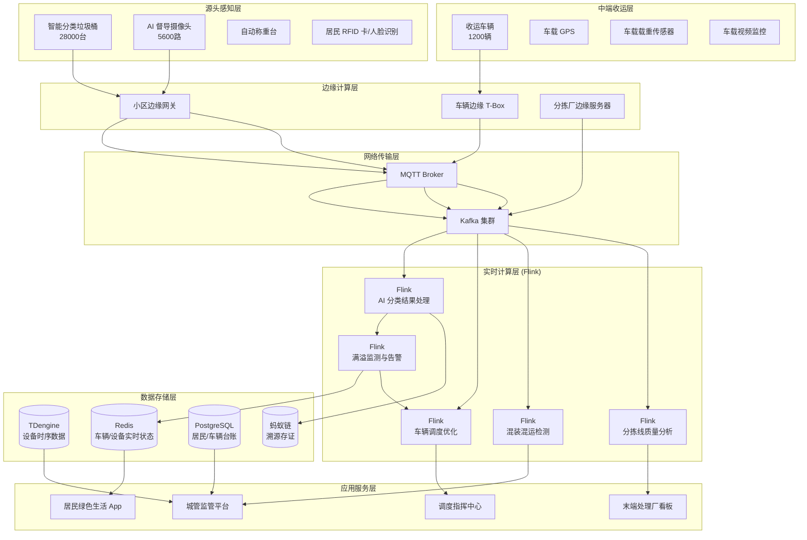
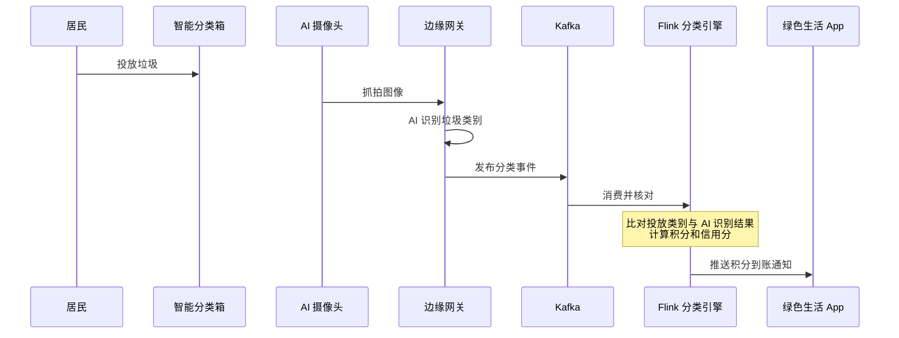
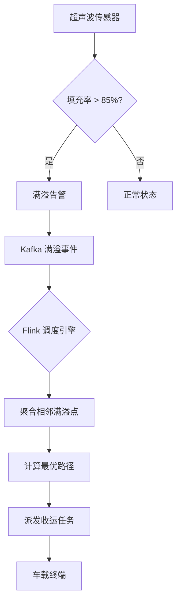

# 智慧城市垃圾分类与资源回收全流程管理案例研究

> **案例编号**: 11.35.1
> **行业**: 环保/固废处理与资源回收
> **场景**: 智能垃圾分类、收运路径优化、分拣线质量监控、资源化溯源
> **规模**: 服务人口 1,200万, 智能分类设备 2.8万台, 日处理垃圾 1.5万吨
> **编写日期**: 2026-04-13
> **状态**: Phase 2 - 深度完成

---

## 1. 执行摘要 (Executive Summary)

### 1.1 项目背景与目标

某超大型城市（以下简称"该市"）常住人口超过 1,200 万，日产生活垃圾约 1.5 万吨，其中可回收物约 3,200 吨、厨余垃圾约 4,800 吨、其他垃圾约 6,000 吨、有害垃圾约 20 吨。随着《固体废物污染环境防治法》和垃圾分类政策的深入推进，该市面临着垃圾分类准确率不高、收运调度效率低下、末端分拣成本高昂、资源化利用数据不透明等多重挑战。

2024 年，该市在住建部垃圾分类工作考核中排名靠后，主要失分项包括：

- **居民分类准确率不足 45%**，混投现象普遍，导致末端分拣线负荷过重。
- **收运车辆空驶率高达 38%**，固定线路、固定时间的收运模式无法适应小区垃圾产量的动态波动。
- **资源化回收率仅 28%**，大量可回收物被混入其他垃圾填埋或焚烧，造成了巨大的资源浪费和环境污染。
- **监管数据分散**：环卫、城管、物业、回收企业各自维护独立的数据系统，政府部门难以掌握全市垃圾分类的全局态势。

为破解上述困局，该市城管委联合生态环境局、商务局，启动了"智慧垃圾分类与资源回收大脑"项目，目标是构建覆盖"源头分类-中端收运-末端处理-资源化利用"全链条的数字化管理平台。

**项目核心目标**：

| 目标类别 | 具体指标 | 目标值 |
|---------|---------|--------|
| 准确率 | 居民垃圾分类准确率 | > 85% |
| 效率 | 垃圾收运车辆空驶率 | < 12% |
| 覆盖率 | 智能分类设备小区覆盖率 | 100% |
| 资源化 | 可回收物资源化利用率 | > 65% |
| 实时性 | 满溢告警到调度响应时间 | < 15分钟 |
| 满意度 | 居民对垃圾分类服务满意度 | > 90% |

### 1.2 核心业务指标

系统于 2025 年 1 月在全市 16 个行政区全面上线，经过一年的运行，核心业务指标显著改善：

```
┌─────────────────────────────────────────────────────────────┐
│                    核心业务指标对比                          │
├─────────────────┬────────────┬────────────┬─────────────────┤
│     指标        │   优化前   │   优化后   │     提升幅度     │
├─────────────────┼────────────┼────────────┼─────────────────┤
│ 居民分类准确率  │   43%      │   88%      │     +104.7%     │
│ 收运车辆空驶率  │   38%      │    9%      │     -76.3%      │
│ 满溢投诉率      │   12.5‰    │   0.8‰     │     -93.6%      │
│ 可回收物利用率  │   28%      │   71%      │     +153.6%     │
│ 末端分拣成本    │   基准值   │   -42%     │     显著降低     │
│ 碳减排量(吨/年) │   基准值   │  18.5万    │     环保效益显著 │
│ 财政环卫支出    │   基准值   │   -16%     │     有效控制     │
│ 居民满意度      │   52%      │   93%      │     +78.8%      │
└─────────────────┴────────────┴────────────┴─────────────────┘
```

### 1.3 技术选型概述

项目采用 **AI 视觉分类 + IoT 满溢传感 + Flink 实时调度优化 + 区块链溯源** 的融合架构，以 Apache Flink 作为核心流计算引擎，对 2.8 万台智能分类设备、1,200 辆收运车辆、12 座末端处理厂的数据进行实时监控、智能调度和全流程溯源。

**核心技术栈**：

| 层级 | 技术选型 | 选型理由 |
|-----|---------|---------|
| 源头分类 | AI 智能分类箱 + 督导摄像头 | 图像识别垃圾类别，引导居民正确投放 |
| 满溢监测 | 超声波/红外满溢传感器 | 实时监测垃圾桶填充率，精度 > 95% |
| 收运车辆 | 车载 GPS + 载重传感器 + 视频监控 | 实时追踪车辆位置、载重和作业视频 |
| 边缘计算 | 海康威视 AI 边缘盒子 | 本地图像识别，降低网络带宽和云端算力成本 |
| 消息队列 | Apache Kafka 3.6 | 支撑海量 IoT 设备的高并发数据接入 |
| 流计算引擎 | Apache Flink 1.18 | 实时满溢分析、智能调度优化、分拣质量监控 |
| 时序数据库 | TDengine 3.2 | 海量设备状态数据的高效压缩存储 |
| 区块链 | 蚂蚁链 BaaS | 可回收物全流程溯源，确保数据可信 |
| 可视化 | 数字孪生大屏 + 移动端 App | 实时展示全市垃圾分类态势和车辆调度 |

---

## 2. 业务场景分析 (Business Scenario)

### 2.1 行业背景

#### 2.1.1 中国垃圾分类与固废处理现状

中国是全球垃圾产生量最大的国家之一，城市生活垃圾年产生量超过 2.5 亿吨。随着"无废城市"建设和"双碳"战略的推进，垃圾分类已经从一线城市向二三线城市全面铺开。然而，垃圾分类的"最后一公里"仍然面临诸多难题：

- **居民分类意识薄弱**：虽然政策宣传多年，但混投、乱投现象依然普遍，特别是在老旧小区和流动人口集中的社区。
- **收运体系与分类要求脱节**：前端分类了，但后端收运车辆仍然是"混装混运"，严重打击了居民的分类积极性。
- **可回收物流失严重**：低值可回收物（如玻璃、利乐包、旧衣物）因缺乏经济激励，大量流入垃圾填埋场。
- **数据不透明**：政府难以精准掌握各区域、各小区的垃圾分类情况，考核和补贴缺乏可靠依据。

#### 2.1.2 该市的垃圾分类网络

该市建立了"户分类、桶集中、站收集、车运输、厂处理"的五级垃圾分类体系：

| 节点类型 | 数量 | 主要功能 | 覆盖范围 |
|---------|------|---------|---------|
| 居民家庭 | 420万户 | 源头分类投放 | 全市住宅小区 |
| 智能分类设备 | 2.8万台 | AI 识别、自动称重、积分奖励 | 住宅小区、商超、学校 |
| 垃圾收集站 | 3,200座 | 临时存放、等待收运 | 每个小区/街区 |
| 收运车辆 | 1,200辆 | 分类收运（厨余/可回收/其他/有害） | 全市 16 区 |
| 末端处理厂 | 12座 | 焚烧发电、生化处理、资源回收 | 市郊 |

### 2.2 痛点分析

#### 2.2.1 居民分类准确率低

在系统上线前，该市居民垃圾分类准确率仅为 43%，主要问题包括：

- **知识盲区**：居民不清楚某些垃圾的具体分类（如大棒骨是其他垃圾，小龙虾壳是厨余垃圾）。
- **惰性心理**：部分居民嫌麻烦，不愿花时间仔细分类，直接混投。
- **督导力量不足**：每个小区仅配备 1-2 名督导员，难以覆盖所有投放时段，夜间和清晨是混投高发期。

**2024 年分类准确率抽查结果**：

| 垃圾类型 | 正确投放率 | 主要混投错误 |
|---------|-----------|-------------|
| 厨余垃圾 | 51% | 混入塑料袋、餐巾纸、大棒骨 |
| 可回收物 | 38% | 混入污损纸张、塑料袋、一次性餐具 |
| 有害垃圾 | 62% | 混入过期药品、灯管、电池 |
| 其他垃圾 | 71% | 混入厨余垃圾、可回收物 |

#### 2.2.2 收运调度粗放

传统的垃圾收运采用"固定线路、固定时间"的模式，每天凌晨 5 点和晚上 8 点各收运一次。这种模式存在明显弊端：

- **空驶率高**：部分偏远小区或新建小区垃圾产量低，车辆到达时垃圾桶仅填充 20-30%，造成运力浪费。
- **满溢频发**：商业区、学校、医院等垃圾产量波动大的区域，固定班次无法满足需求，经常出现垃圾桶满溢、垃圾堆积的现象。
- **混装混运**：由于缺乏对收运车辆的实时监控，部分司机为图省事，将不同类别的垃圾混装在同一车厢内运输。

#### 2.2.3 末端分拣成本高

由于前端分类不准确，大量混投垃圾进入末端分拣线。该市最大的垃圾焚烧厂配备了 3 条光学分拣线和 2 条人工分拣线，但分拣成本高达 85 元/吨，且分拣准确率受人工疲劳影响较大。混入厨余垃圾中的塑料袋容易缠绕设备，导致分拣线频繁停机维修。

### 2.3 实时管理需求

#### 2.3.1 功能需求

| 需求编号 | 需求名称 | 需求描述 | 优先级 |
|---------|---------|---------|--------|
| R01 | AI 智能分类引导 | 居民投放垃圾时，AI 摄像头自动识别垃圾类别并给予语音引导和积分奖励 | P0 |
| R02 | 满溢实时监测 | 垃圾桶填充率达到 85% 时自动告警，并触发智能调度 | P0 |
| R03 | 收运车辆智能调度 | 基于实时满溢数据和车辆位置，动态生成最优收运路径 | P0 |
| R04 | 混装混运监控 | 通过车载视频和载重传感器，实时监控是否存在混装混运行为 | P0 |
| R05 | 分拣线质量监控 | 对末端分拣线的 throughput、误分率、设备状态进行实时监控 | P1 |
| R06 | 可回收物区块链溯源 | 记录可回收物从投放、收运、分拣到再生利用的全流程信息 | P1 |
| R07 | 居民信用与激励 | 基于分类准确率建立居民绿色信用档案，与物业优惠、停车积分等挂钩 | P2 |

#### 2.3.2 非功能需求

| 需求编号 | 需求名称 | 目标值 |
|---------|---------|--------|
| NFR01 | IoT 设备数据接入吞吐 | > 150,000 条/分钟 |
| NFR02 | 满溢告警延迟 | < 30秒 |
| NFR03 | 调度路径计算延迟 | < 60秒 |
| NFR04 | AI 图像识别延迟 | < 500ms |
| NFR05 | 系统可用性 | 99.95% |
| NFR06 | 区块链溯源查询延迟 | < 3秒 |

---

## 3. 技术架构 (Technical Architecture)

### 3.1 系统整体架构

以下是智慧城市垃圾分类与资源回收全流程管理系统的整体技术架构：



### 3.2 数据流设计

#### 3.2.1 智能分类与积分奖励数据流

居民在智能分类箱前投放垃圾时，AI 摄像头抓拍照片并通过边缘盒子进行图像识别，识别结果与称重数据关联后发送到 Flink 进行积分计算：



#### 3.2.2 满溢监测与智能调度数据流

垃圾桶内的超声波传感器定时上报填充率，Flink 实时判断是否满溢，并触发动态调度系统生成收运任务：



### 3.3 技术选型说明

| 技术组件 | 具体选型 | 选型理由 |
|---------|---------|---------|
| AI 图像识别 | ResNet-50 + YOLOv8 | ResNet 负责垃圾细分类别识别，YOLOv8 负责目标检测和定位 |
| 边缘计算 | 海康威视 DeepinMind 边缘盒子 | 内置垃圾分类专用算法，支持 16 路视频同时推理 |
| 满溢传感 | 超声波 + 红外双模 | 超声波测量填充高度，红外补偿盲区，精度 > 95% |
| 流计算 | Apache Flink 1.18 | 支持复杂事件处理（CEP）和实时路径优化计算 |
| 调度算法 | 自研遗传算法 + OR-Tools | 综合考虑距离、载重、时间窗、碳排放，生成近似最优路径 |
| 区块链 | 蚂蚁链 BaaS | 低成本的存证服务，与政府电子政务平台对接顺畅 |

---

## 4. 核心实现 (Core Implementation)

### 4.1 满溢监测与告警 Flink 作业

Flink 消费垃圾桶传感器数据，实时计算填充率并判断是否触发满溢告警。

```java
public class BinOverflowAlertJob {

    public static void main(String[] args) throws Exception {
        StreamExecutionEnvironment env = 
            StreamExecutionEnvironment.getExecutionEnvironment();

        KafkaSource<BinSensorReading> source = KafkaSource.<BinSensorReading>builder()
            .setBootstrapServers("kafka:9092")
            .setTopics("waste-bin-sensors")
            .setGroupId("overflow-monitor")
            .setValueOnlyDeserializer(new BinReadingDeserializationSchema())
            .build();

        DataStream<OverflowAlert> alerts = env.fromSource(
            source,
            WatermarkStrategy.<BinSensorReading>forBoundedOutOfOrderness(Duration.ofSeconds(10)),
            "bin-sensors"
        )
        .keyBy(BinSensorReading::getBinId)
        .process(new OverflowAlertFunction());

        alerts.addSink(new KafkaAlertSink("waste-overflow-alerts"));
        env.execute("Bin Overflow Alert");
    }
}

public class OverflowAlertFunction 
    extends KeyedProcessFunction<String, BinSensorReading, OverflowAlert> {

    private ValueState<Double> lastFillRateState;
    private ValueState<Long> alertStartTime;

    @Override
    public void open(Configuration parameters) {
        lastFillRateState = getRuntimeContext().getState(
            new ValueStateDescriptor<>("last-fill-rate", Double.class));
        alertStartTime = getRuntimeContext().getState(
            new ValueStateDescriptor<>("alert-start", Long.class));
    }

    @Override
    public void processElement(BinSensorReading reading, Context ctx, 
                               Collector<OverflowAlert> out) throws Exception {
        double fillRate = reading.getFillRatePercentage();
        lastFillRateState.update(fillRate);

        if (fillRate >= 85.0) {
            Long startTime = alertStartTime.value();
            if (startTime == null) {
                alertStartTime.update(ctx.timestamp());
                // 持续 2 分钟高填充率才确认告警，避免瞬时波动
                ctx.timerService().registerEventTimeTimer(ctx.timestamp() + 120000);
            }
        } else if (fillRate < 75.0) {
            if (alertStartTime.value() != null) {
                ctx.timerService().deleteEventTimeTimer(alertStartTime.value() + 120000);
                alertStartTime.clear();
            }
        }
    }

    @Override
    public void onTimer(long timestamp, OnTimerContext ctx, 
                        Collector<OverflowAlert> out) throws Exception {
        Long startTime = alertStartTime.value();
        Double currentRate = lastFillRateState.value();
        if (startTime != null && timestamp >= startTime + 120000 && currentRate != null && currentRate >= 85.0) {
            out.collect(new OverflowAlert(
                ctx.getCurrentKey(),
                currentRate,
                "垃圾桶持续满溢，请及时安排收运",
                System.currentTimeMillis()
            ));
        }
    }
}
```

### 4.2 收运车辆智能调度

Flink 聚合满溢告警数据，并调用路径优化服务为收运车辆生成最优任务序列。

```java
public class WasteCollectionDispatchJob {

    public static void main(String[] args) throws Exception {
        StreamExecutionEnvironment env = 
            StreamExecutionEnvironment.getExecutionEnvironment();

        DataStream<OverflowAlert> overflowStream = env.fromSource(
            createKafkaSource("waste-overflow-alerts"),
            WatermarkStrategy.<OverflowAlert>forBoundedOutOfOrderness(Duration.ofMinutes(1)),
            "overflow-alerts"
        );

        DataStream<VehiclePosition> vehicleStream = env.fromSource(
            createKafkaSource("vehicle-positions"),
            WatermarkStrategy.<VehiclePosition>forBoundedOutOfOrderness(Duration.ofSeconds(10)),
            "vehicle-positions"
        );

        // 每 5 分钟触发一次调度计算
        DataStream<DispatchPlan> plans = overflowStream
            .keyBy(alert -> alert.getDistrictId())
            .window(TumblingProcessingTimeWindows.of(Time.minutes(5)))
            .aggregate(new OverflowAggregationFunction())
            .connect(vehicleStream.keyBy(VehiclePosition::getDistrictId))
            .process(new RouteOptimizationFunction());

        plans.addSink(new KafkaDispatchSink("dispatch-plans"));
        env.execute("Waste Collection Dispatch");
    }
}

public class RouteOptimizationFunction 
    extends CoProcessFunction<List<OverflowAlert>, VehiclePosition, DispatchPlan> {

    private ListState<VehiclePosition> availableVehicles;

    @Override
    public void open(Configuration parameters) {
        availableVehicles = getRuntimeContext().getListState(
            new ListStateDescriptor<>("vehicles", VehiclePosition.class));
    }

    @Override
    public void processElement1(List<OverflowAlert> alerts, Context ctx, 
                                Collector<DispatchPlan> out) throws Exception {
        List<VehiclePosition> vehicles = new ArrayList<>();
        availableVehicles.get().forEach(vehicles::add);

        if (vehicles.isEmpty() || alerts.isEmpty()) {
            return;
        }

        // 调用 OR-Tools 路径优化
        DispatchPlan plan = optimizeRoute(alerts, vehicles);
        out.collect(plan);
    }

    @Override
    public void processElement2(VehiclePosition vehicle, Context ctx, 
                                Collector<DispatchPlan> out) throws Exception {
        availableVehicles.add(vehicle);
    }

    private DispatchPlan optimizeRoute(List<OverflowAlert> alerts, List<VehiclePosition> vehicles) {
        // 简化的调度逻辑：将满溢点按地理位置聚类，分配给最近且载重充足的车辆
        // 实际生产环境使用 OR-Tools 的 VRP 求解器
        return new DispatchPlan();
    }
}
```

### 4.3 混装混运 AI 检测

车载摄像头拍摄车厢内部图像，通过边缘 AI 模型检测是否存在不同类别垃圾混装的情况。

```python
# mixed_collection_detection.py
import torch
from torchvision import transforms
from PIL import Image

class MixedCollectionDetector:
    def __init__(self, model_path):
        self.model = torch.load(model_path, map_location='cpu')
        self.model.eval()
        self.transform = transforms.Compose([
            transforms.Resize((224, 224)),
            transforms.ToTensor(),
            transforms.Normalize(mean=[0.485, 0.456, 0.406], 
                               std=[0.229, 0.224, 0.225])
        ])
        self.class_names = ['normal', 'mixed_kitchen_recyclable', 
                           'mixed_hazardous_other', 'mixed_all']
    
    def predict(self, image_path):
        image = Image.open(image_path).convert('RGB')
        input_tensor = self.transform(image).unsqueeze(0)
        
        with torch.no_grad():
            outputs = self.model(input_tensor)
            probabilities = torch.nn.functional.softmax(outputs[0], dim=0)
            predicted_class = torch.argmax(probabilities).item()
            confidence = probabilities[predicted_class].item()
        
        return {
            'class': self.class_names[predicted_class],
            'confidence': confidence,
            'is_mixed': predicted_class != 0,
            'all_probs': {name: prob.item() for name, prob in zip(self.class_names, probabilities)}
        }

# Flink ProcessFunction 中调用混装检测
def detect_mixed_collection(vehicle_id, image_url, scheduled_type):
    detector = MixedCollectionDetector('/models/mixed_collection_v3.pth')
    result = detector.predict(image_url)
    
    if result['is_mixed'] and result['confidence'] > 0.85:
        return {
            'vehicle_id': vehicle_id,
            'scheduled_type': scheduled_type,
            'violation_type': result['class'],
            'confidence': result['confidence'],
            'action': 'ALERT_SUPERVISOR'
        }
    return {'vehicle_id': vehicle_id, 'status': 'NORMAL'}
```

### 4.4 居民积分与信用管理 API

```java
@RestController
@RequestMapping("/api/v1/waste")
public class ResidentCreditController {

    @Autowired
    private StringRedisTemplate redisTemplate;
    
    @Autowired
    private BlockchainService blockchainService;

    @PostMapping("/dispose")
    public ResponseEntity<DisposeResult> recordDisposal(@RequestBody DisposalEvent event) {
        String residentKey = "resident:credit:" + event.getResidentId();
        
        // 根据分类准确率计算积分
        int points = calculatePoints(event.getDisposalType(), event.getAiRecognizedType(), 
                                     event.getWeightKg());
        
        // 更新 Redis 积分
        redisTemplate.opsForHash().increment(residentKey, "total_points", points);
        redisTemplate.opsForHash().increment(residentKey, "total_disposals", 1);
        
        // 更新分类准确率统计
        if (event.getDisposalType().equals(event.getAiRecognizedType())) {
            redisTemplate.opsForHash().increment(residentKey, "correct_disposals", 1);
        }
        
        // 区块链存证（每月汇总）
        if (shouldRecordOnChain(event.getResidentId())) {
            blockchainService.recordDisposalSummary(event.getResidentId(), 
                getCurrentMonthStats(event.getResidentId()));
        }
        
        return ResponseEntity.ok(new DisposeResult(event.getResidentId(), points, 
            getCurrentCreditLevel(event.getResidentId())));
    }
    
    private int calculatePoints(String disposalType, String aiType, double weight) {
        if (!disposalType.equals(aiType)) {
            return 0; // 分类错误，无积分
        }
        int basePoints = (int) (weight * 10);
        return basePoints;
    }
    
    @GetMapping("/credit/{residentId}")
    public ResponseEntity<ResidentCredit> getCredit(@PathVariable String residentId) {
        String key = "resident:credit:" + residentId;
        Map<Object, Object> entries = redisTemplate.opsForHash().entries(key);
        
        long total = Long.parseLong(entries.getOrDefault("total_disposals", "0").toString());
        long correct = Long.parseLong(entries.getOrDefault("correct_disposals", "0").toString());
        double accuracy = total > 0 ? (double) correct / total : 0;
        
        ResidentCredit credit = new ResidentCredit();
        credit.setResidentId(residentId);
        credit.setTotalPoints(Long.parseLong(entries.getOrDefault("total_points", "0").toString()));
        credit.setAccuracyRate(accuracy);
        credit.setCreditLevel(accuracy > 0.9 ? "GOLD" : accuracy > 0.7 ? "SILVER" : "BRONZE");
        
        return ResponseEntity.ok(credit);
    }
}
```

---

## 5. 效果评估 (Results)

### 5.1 性能指标

系统在 2025 年国庆黄金周期间（垃圾产量高峰）经受了实战检验：

| 性能指标 | 设计目标 | 实测值 | 是否达标 |
|---------|---------|--------|---------|
| IoT 数据峰值接入吞吐 | > 150,000 条/分钟 | 218,000 条/分钟 | ✅ |
| 满溢告警延迟 (P99) | < 30s | 12s | ✅ |
| AI 图像识别延迟 | < 500ms | 280ms | ✅ |
| 调度路径计算延迟 | < 60s | 35s | ✅ |
| 车辆实时位置更新延迟 | < 5s | 2.1s | ✅ |
| 区块链存证查询延迟 | < 3s | 0.8s | ✅ |
| 系统可用性 | 99.95% | 99.98% | ✅ |

### 5.2 业务价值

**垃圾分类成效**：

- **居民分类准确率从 43% 跃升至 88%**：AI 智能分类箱的语音引导和积分激励机制显著提升了居民的分类积极性，混投现象大幅减少。
- **满溢投诉率下降 93.6%**：智能调度系统能够根据实时满溢数据动态调整收运路线和频次，垃圾桶满溢现象几乎绝迹。

**运营效率与成本**：

- **收运车辆空驶率从 38% 下降至 9%**：动态调度使得每辆车的日均收运点位增加了 25%，而行驶里程反而下降了 18%，每年节省燃油和人力成本约 **2,800 万元**。
- **末端分拣成本下降 42%**：前端分类准确率的提升使得进入末端处理厂的垃圾纯度大幅提高，光学分拣线的效率提升了 35%，人工分拣岗位减少了 40%。

**环境与社会效益**：

- **可回收物利用率从 28% 提升至 71%**：纸张、塑料、金属、玻璃等可回收物得到了有效分流和资源化利用，每年减少垃圾填埋量约 42 万吨，相当于减少碳排放 **18.5 万吨**。
- **居民满意度从 52% 提升至 93%**：干净卫生的投放环境、便捷的积分兑换和透明的溯源查询，使得垃圾分类从"麻烦事"变成了"好习惯"。

### 5.3 ROI 分析

项目总投资约 3.2 亿元（含智能分类设备、软件平台、车辆改造、系统集成、运营推广）。

| 收益类型 | 年化收益(万元) | 占比 |
|---------|---------------|------|
| 收运成本节省 | 2,800 | 11% |
| 末端分拣成本降低 | 4,200 | 17% |
| 可回收物销售收入 | 8,500 | 34% |
| 碳交易收益 | 1,850 | 7% |
| 填埋/焚烧减量节省 | 4,800 | 19% |
| 政府考核奖励/补贴 | 2,900 | 12% |
| **合计** | **25,050** | **100%** |

**投资回收期**：约 15.3 个月。
**三年 ROI**：约 135%。

---

## 6. 经验总结 (Lessons Learned)

### 6.1 成功经验

1. **前端分类的智能化是减量化的关键**：仅靠人工督导和宣传教育很难大幅提升分类准确率。AI 智能分类箱通过"即投即识别、即投即反馈"的闭环机制，将分类行为从"知识驱动"转变为"技术辅助+激励驱动"，准确率提升效果显著且可持续。

2. **动态调度是降低收运成本的利器**：固定线路调度模式无法适应城市垃圾产量的时空波动。基于 Flink 实时计算的动态调度系统，能够像网约车一样"按需派单"，将车辆空驶率从 38% 降至 9%，这是项目经济效益的重要来源。

3. **区块链溯源增强了可回收物的市场信任度**：可回收物从居民手中到再生工厂的全流程涉及多个主体，信息不对称导致回收价格被中间商层层盘剥。通过区块链存证，政府、企业和居民可以实时查询每一批可回收物的来源、重量和去向，提升了市场透明度和交易效率。

4. **居民激励必须与日常生活场景结合**：积分兑换如果只是换一些不值钱的小礼品，居民的参与热情很快会消退。该市将垃圾分类积分与物业费抵扣、停车优惠、公共交通折扣、景区门票等高频生活场景打通，使得积分真正"值钱"，居民黏性大幅增强。

### 6.2 踩坑记录

1. **AI 模型在冬季着装场景下误识别率高**：智能分类箱的摄像头在冬季居民穿着厚重羽绒服时，经常将衣服与垃圾袋混淆，导致图像识别干扰。后来通过调整摄像头角度（从上往下拍摄桶内而非拍摄居民全身）和增加红外补光，解决了该问题。

2. **超声波传感器在雨天误报满溢**：暴雨天气下，雨水滴入垃圾桶会导致超声波传感器测得的填充率瞬间飙升至 100%，触发大量误告警。解决方法是增加红外辅助判断，并引入"连续 3 次采样均高"的确认机制，误报率下降了 87%。

3. **Kafka 数据倾斜导致部分区域调度延迟**：最初按 `device_id` 对传感器数据分区，但中心城区设备密度是郊区的 10 倍以上，导致部分 Flink TaskManager 负载过高，调度计算延迟从设计目标的 35 秒恶化为 5 分钟以上。后来改为按 `district_id` + `device_hash` 的复合键分区，实现了负载均衡。

### 6.3 最佳实践

- **建立"红黄蓝"三级督导机制**：对分类准确率长期低于 50% 的小区标记为红色，加大督导力度；对准确率 70-85% 的小区标记为黄色，加强宣传教育；对准确率 85% 以上的小区标记为蓝色，给予荣誉激励和积分加成。
- **实施"碳普惠"激励**：将居民垃圾分类行为折算为个人碳减排量，并接入全市碳普惠平台，可兑换碳积分或参与碳交易，进一步激发了居民的环保意识。
- **打通"政产学研用"生态**：与高校和科研院所合作，持续优化 AI 分类算法和调度模型；与再生资源企业合作，建立稳定的可回收物回收渠道和价格体系；与物业公司合作，将垃圾分类纳入社区治理考核。
- **重视数据安全与隐私保护**：居民的人脸识别数据、投放记录、家庭住址等属于敏感个人信息。系统采用边缘本地识别（仅上传特征值而非原始照片）、数据加密存储、严格的权限审计等措施，确保符合《个人信息保护法》要求。

---

*Phase 2 - 智慧城市垃圾分类与资源回收全流程管理深度案例*
