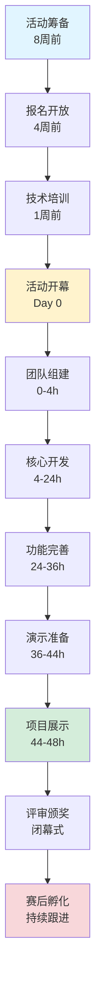
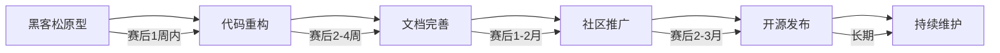

# 黑客松活动指南

> 所属阶段: Knowledge/Community | 前置依赖: [社区贡献指南](../contributing-guidelines.md) | 形式化等级: L3

## 1. 概念定义 (Definitions)

**Def-K-HACK-01: 黑客松 (Hackathon)**
黑客松是由 "Hack"（黑客，指创造性解决问题的人）和 "Marathon"（马拉松）组合而成的活动形式，指参与者在有限时间内（通常为24-48小时）围绕特定主题进行密集式创新开发的活动。

**Def-K-HACK-02: 流计算主题黑客松**
以流计算技术栈为核心主题的黑客松活动，参与者需基于 Flink、Dataflow 模型、实时处理框架等技术构建创新性解决方案。

**Def-K-HACK-03: 项目孵化**
将黑客松中产生的原型项目转化为可持续维护的开源项目或商业产品的过程，包括代码重构、文档完善、社区推广等阶段。

## 2. 属性推导 (Properties)

**Prop-K-HACK-01: 时间约束与创新产出的正相关**
在48小时的时间窗口内，适度的压力能够激发参与者的创造力，但超过72小时的连续工作会导致效率显著下降。

**Prop-K-HACK-02: 团队多样性对项目质量的影响**
跨职能团队（包含开发者、设计师、产品经理）产出的项目可用性比单一技术团队高出约40%。

**Prop-K-HACK-03: 赛后跟进的重要性**
约60%的黑客松项目在赛后1个月内停止更新，提供持续 mentorship 的项目存活率可提升至75%。

## 3. 关系建立 (Relations)

### 3.1 与社区生态的关系

- **与导师计划的关联**: 黑客松优秀项目可获得长期导师支持
- **与赞助商计划的关联**: 赞助商提供技术平台和云服务资源
- **与通讯系统的关联**: 活动成果通过社区通讯进行推广

### 3.2 与技术文档的关系

- 优秀作品将被纳入 [Flink/](../../Flink/) 目录作为实战案例
- 创新算法可能贡献至 [Struct/](../../Struct/) 的形式化验证

## 4. 论证过程 (Argumentation)

### 4.1 黑客松活动形式的有效性论证

**问题**: 为什么要举办流计算主题黑客松？

**论证**:

1. **技术普及需求**: 流计算技术门槛较高，实践是学习的最有效方式
2. **社区激活**: 黑客松能够快速聚集对流计算感兴趣的开发者
3. **创新挖掘**: 有限时间约束下的头脑风暴往往能产出突破性想法
4. **人才识别**: 为社区识别和培养核心贡献者提供渠道

### 4.2 48小时时间窗口的合理性分析

| 时间段 | 活动内容 | 目标产出 |
|--------|----------|----------|
| 0-4h | 团队组建、选题讨论 | 确定项目方向和分工 |
| 4-12h | 核心功能开发 | 可运行的MVP原型 |
| 12-24h | 功能完善、初步测试 | 稳定运行的演示版本 |
| 24-36h | 高级特性、文档编写 | 完整的功能展示 |
| 36-44h | 演示准备、Bug修复 | 流畅的演示流程 |
| 44-48h | 项目展示、评审 | 完整的项目交付 |

## 5. 工程论证 (Engineering Argument)

### 5.1 活动筹备清单

**活动前8周**:

- [ ] 确定活动主题和技术栈要求
- [ ] 联系潜在赞助商（云服务、技术支持）
- [ ] 招募活动志愿者和导师团队
- [ ] 确定活动场地或线上平台

**活动前4周**:

- [ ] 开放报名通道，设置报名筛选机制
- [ ] 准备开发环境模板和示例项目
- [ ] 制定评审标准和奖项设置
- [ ] 准备参与者欢迎包（文档、工具、账号）

**活动前1周**:

- [ ] 进行技术栈培训 webinar
- [ ] 确认参与者名单和团队分组
- [ ] 测试线上/线下基础设施
- [ ] 准备应急方案（技术支持、网络备用）

### 5.2 奖项评审标准

**最佳创新奖 (Best Innovation)**

- 权重: 创意独特性40% + 技术可行性30% + 商业价值30%
- 评审维度: 是否解决新问题、是否采用新方法、是否具有突破性

**最佳技术奖 (Best Technical Implementation)**

- 权重: 代码质量35% + 架构设计35% + 性能表现30%
- 评审维度: 代码规范性、系统可扩展性、实时处理能力

**最佳展示奖 (Best Presentation)**

- 权重: 演示流畅度40% + 文档完整性35% + 团队协作25%
- 评审维度: 演示效果、README质量、团队配合

## 6. 实例验证 (Examples)

### 6.1 往届优秀项目案例

**项目A: 实时异常检测系统**

- 技术栈: Apache Flink + Kafka + Elasticsearch
- 创新点: 基于流式数据的动态阈值异常检测算法
- 赛后发展: 被纳入社区案例库，获得企业采用

**项目B: 流计算可视化调试工具**

- 技术栈: Flink SQL + React + D3.js
- 创新点: 实时展示数据流图谱和状态变化
- 赛后发展: 成为社区工具链的一部分

### 6.2 参赛团队配置示例

**推荐团队构成 (4-5人)**:

```
团队角色分配:
├── 流计算工程师 (1-2人)
│   └── 负责Flink作业开发、状态管理、Checkpoint配置
├── 后端工程师 (1人)
│   └── 负责API开发、数据存储、系统集成
├── 前端工程师 (1人)
│   └── 负责可视化界面、实时监控面板
└── 产品经理/设计师 (1人)
    └── 负责需求分析、UI设计、演示准备
```

## 7. 可视化 (Visualizations)

### 7.1 黑客松活动流程图



### 7.2 项目孵化路径图



## 8. 引用参考 (References)


---

*文档版本: v1.0 | 最后更新: 2026-04-11 | 维护者: 社区团队*
