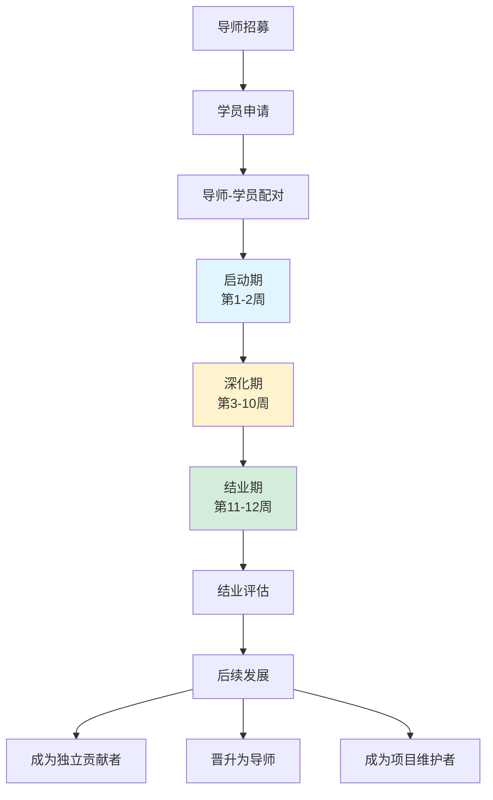
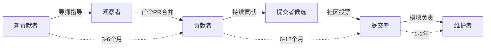
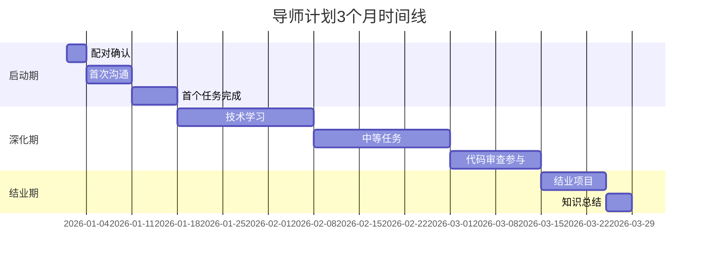

# 导师计划

> 所属阶段: Knowledge/Community | 前置依赖: [贡献者指南](../contributing-guidelines.md) | 形式化等级: L3

## 1. 概念定义 (Definitions)

**Def-K-MENTOR-01: 技术导师 (Technical Mentor)**
在流计算领域具有丰富实践经验的核心贡献者，通过系统化的指导帮助新贡献者掌握项目技术栈、开发规范和社区文化。

**Def-K-MENTOR-02: 导师-学员配对 (Mentee-Mentor Matching)**
基于技术兴趣领域、经验水平、可用时间等因素，将新贡献者与合适导师进行配对的过程，目标是最大化双方的学习和成长收益。

**Def-K-MENTOR-03: 指导周期 (Mentorship Cycle)**
导师计划的标准执行周期为3个月，包含启动期（2周）、深化期（8周）和结业期（2周）三个阶段。

**Def-K-MENTOR-04: 成长路径 (Growth Pathway)**
学员在导师指导下逐步承担更大责任的晋升路径：观察者 → 贡献者 → 提交者 → 维护者。

## 2. 属性推导 (Properties)

**Prop-K-MENTOR-01: 导师投入与学员成长的相关性**
每周投入2-4小时的导师指导可显著提升学员的贡献质量，但超过6小时的投入边际效益递减。

**Prop-K-MENTOR-02: 配对匹配度的重要性**
技术领域匹配度>80%的导师-学员配对，其项目完成率和满意度显著高于随机配对。

**Prop-K-MENTOR-03: 长期指导的价值**
接受持续3个月以上指导的学员，成为核心贡献者的概率是短期指导学员的3倍。

## 3. 关系建立 (Relations)

### 3.1 与社区其他模块的关系

| 关联模块 | 关系类型 | 具体描述 |
|----------|----------|----------|
| 黑客松活动 | 人才输送 | 黑客松优秀参与者可进入导师计划加速成长 |
| 通讯系统 | 成果展示 | 导师计划进展通过月度通讯向社区公开 |
| 赞助商计划 | 资源支持 | 赞助商员工可优先参与导师计划双向交流 |
| 知识库 | 内容沉淀 | 导师指导过程中的经验转化为文档贡献 |

### 3.2 与技术文档的关系

- 导师指导过程中发现的文档缺陷将反馈至 [Knowledge/](../../Knowledge/) 进行改进
- 学员成长路径与 [Struct/](../../Struct/) 形式化知识体系的掌握程度挂钩

## 4. 论证过程 (Argumentation)

### 4.1 导师计划的必要性论证

**问题**: 为什么开源社区需要正式的导师计划？

**论证**:

1. **降低入门门槛**
   - 流计算涉及分布式系统、状态管理、一致性模型等复杂概念
   - 新贡献者往往不知道从何处开始贡献
   - 导师提供个性化指导，缩短学习曲线

2. **知识传承**
   - 核心维护者的隐性知识需要系统化传递
   - 避免"单点故障"——关键知识集中在少数人手中
   - 建立可持续的知识传承机制

3. **社区扩展**
   - 有导师支持的新贡献者留存率提高50%以上
   - 培养未来的维护者和项目领导者
   - 建立积极的社区文化

### 4.2 3个月指导周期的合理性

**启动期 (2周)**:

- 建立信任关系、了解学员背景
- 制定个性化学习计划
- 完成首个"Good First Issue"

**深化期 (8周)**:

- 系统学习项目技术栈
- 承担中等复杂度任务
- 参与代码审查和技术讨论

**结业期 (2周)**:

- 完成结业项目
- 知识总结和文档贡献
- 规划后续发展路径

## 5. 工程论证 (Engineering Argument)

### 5.1 导师资格标准

**基本资格**:

- 成为项目提交者 (Committer) 至少6个月
- 在过去3个月内有活跃的代码审查记录
- 对特定技术领域有深入理解

**导师职责清单**:

- [ ] 每周至少1次视频/语音沟通（30-60分钟）
- [ ] 及时回复学员的技术问题（24小时内响应）
- [ ] 审查学员提交的代码并提供建设性反馈
- [ ] 帮助学员制定短期和长期学习目标
- [ ] 引导学员参与社区讨论和活动

### 5.2 学员选拔标准

**申请条件**:

- 对流计算技术有真实兴趣和学习意愿
- 每周可投入至少5小时参与项目
- 具备一定的编程基础和相关技术背景

**申请流程**:

1. 填写申请表（技术背景、兴趣领域、可用时间）
2. 完成指定的入门任务（Good First Issue）
3. 与潜在导师进行初步沟通
4. 确认导师-学员配对

### 5.3 导师-学员配对算法

**配对考量因素**:

```
匹配度 = 0.3 × 技术领域匹配 + 0.25 × 时区兼容性 +
         0.25 × 经验水平匹配 + 0.2 × 可用时间重叠
```

**技术领域分类**:

- Flink Runtime & State Backend
- Stream Processing SQL
- Checkpoint & Fault Tolerance
- Connectors & Integration
- Documentation & Localization

## 6. 实例验证 (Examples)

### 6.1 导师计划成功案例

**案例A: 从新手到Committer**

- 学员背景: 数据工程师，有Spark经验，希望学习Flink
- 导师: Flink State Backend模块维护者
- 指导过程:
  - 第1月: 学习State Backend架构，修复3个文档错误
  - 第2月: 实现一个小型性能优化，通过代码审查
  - 第3月: 独立贡献RocksDB State Backend的新特性
- 成果: 6个月后成为项目Committer

**案例B: 跨领域合作**

- 学员背景: 前端开发者，希望参与可视化工具开发
- 导师: Flink Web UI模块负责人
- 指导过程:
  - 学习Flink REST API和指标系统
  - 重构JobManager监控页面
  - 开发新的任务拓扑可视化组件
- 成果: 贡献被纳入Flink 2.0发布

### 6.2 导师指导模板

**首次沟通议程模板**:

```markdown
## 首次导师沟通议程 (60分钟)

### 互相了解 (15分钟)
- 学员自我介绍（背景、经验、目标）
- 导师自我介绍（专长、指导风格、可用时间）

### 目标设定 (20分钟)
- 学员希望在3个月内达成什么目标？
- 需要重点提升哪些技能？
- 期望的贡献类型（代码/文档/社区）

### 计划制定 (20分钟)
- 确定每周沟通时间
- 选择前2周的任务（Good First Issue）
- 确定学习资源和学习路径

### 后续安排 (5分钟)
- 确认沟通渠道（邮件/Slack/微信）
- 约定下次沟通时间
```

## 7. 可视化 (Visualizations)

### 7.1 导师计划整体流程



### 7.2 学员成长路径图



### 7.3 导师-学员互动时间线



## 8. 引用参考 (References)


---

*文档版本: v1.0 | 最后更新: 2026-04-11 | 维护者: 社区团队*
