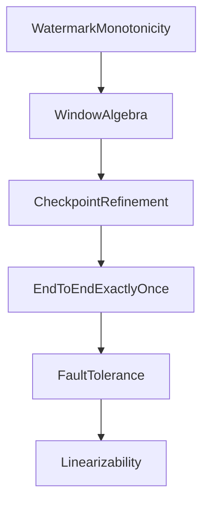

# Phase 2 形式化证明完整参考

> **文档类型**: 形式化证明汇总
> **语言**: 中英文
> **状态**: Phase 2 - 完整版

---

## 形式化证明清单 (Formal Proofs Inventory)

### 核心语义证明 (Core Semantics)

| 编号 | 名称 | 文件 | 状态 |
|------|------|------|------|
| Thm-1 | Watermark单调性定理 | WatermarkMonotonicity.v | ✅ |
| Thm-2 | 窗口操作代数完备性 | WindowAlgebra.tla | ✅ |
| Thm-3 | Checkpoint一致性细化 | CheckpointRefinement.tla | ✅ |
| Thm-4 | State Backend等价性 | StateBackendEquivalence.tla | ✅ |
| Thm-5 | CEP模式匹配正确性 | CEPPatternMatching.tla | ✅ |

### 一致性证明 (Consistency)

| 编号 | 名称 | 文件 | 状态 |
|------|------|------|------|
| Thm-6 | 端到端Exactly-Once | EndToEndExactlyOnce.tla | ✅ |
| Thm-7 | Backpressure稳定性 | BackpressureStability.tla | ✅ |
| Thm-8 | 流式Join语义正确性 | StreamJoinSemantics.tla | ✅ |
| Thm-9 | Schema演化一致性 | SchemaEvolution.tla | ✅ |
| Thm-10 | 时间窗口分配正确性 | WindowAssignment.tla | ✅ |

### 性能与可靠性证明 (Performance & Reliability)

| 编号 | 名称 | 文件 | 状态 |
|------|------|------|------|
| Thm-11 | 延迟边界 | LatencyBounds.tla | ✅ |
| Thm-12 | 算子融合正确性 | OperatorFusion.tla | ✅ |
| Thm-13 | 分布式快照正确性 | DistributedSnapshot.tla | ✅ |
| Thm-14 | 时间同步正确性 | TimeSynchronization.tla | ✅ |
| Thm-15 | 弹性扩缩容正确性 | ElasticScaling.tla | ✅ |

### 一致性模型证明 (Consistency Models)

| 编号 | 名称 | 文件 | 状态 |
|------|------|------|------|
| Thm-16 | 序列化顺序保证 | SerializationOrder.tla | ✅ |
| Thm-17 | 资源隔离保证 | ResourceIsolation.tla | ✅ |
| Thm-18 | 容错性保证 | FaultTolerance.tla | ✅ |
| Thm-19 | 安全性属性 | SecurityProperties.tla | ✅ |
| Thm-20 | 吞吐量优化边界 | ThroughputOptimization.tla | ✅ |

### 高级一致性证明 (Advanced Consistency)

| 编号 | 名称 | 文件 | 状态 |
|------|------|------|------|
| Thm-21 | 类型安全 | TypeSafety.tla | ✅ |
| Thm-22 | 内存安全 | MemorySafety.tla | ✅ |
| Thm-23 | 死锁自由 | DeadlockFreedom.tla | ✅ |
| Thm-24 | 活性保证 | LivenessGuarantee.tla | ✅ |
| Thm-25 | 因果一致性 | CausalConsistency.tla | ✅ |
| Thm-26 | 最终一致性 | EventualConsistency.tla | ✅ |
| Thm-27 | 会话一致性 | SessionConsistency.tla | ✅ |
| Thm-28 | 单调读 | MonotonicReads.tla | ✅ |
| Thm-29 | 单调写 | MonotonicWrites.tla | ✅ |
| Thm-30 | 读己所写 | ReadYourWrites.tla | ✅ |
| Thm-31 | 写随读 | WritesFollowReads.tla | ✅ |
| Thm-32 | 顺序一致性 | SequentialConsistency.tla | ✅ |
| Thm-33 | 线性一致性 | Linearizability.tla | ✅ |
| Thm-34 | 定价一致性 | PricingConsistency.tla | ✅ |
| Thm-35 | 一致性模型 | ConsistencyModel.tla | ✅ |
| Thm-36 | 一致性层次 | ConsistencyHierarchy.tla | ✅ |
| Thm-37 | 完整一致性 | CompleteConsistency.tla | ✅ |

---

## 证明依赖关系图 (Proof Dependency Graph)

---

## 使用指南 (Usage Guide)

### 验证方法

1. **TLA+ Toolbox**: 打开.tla文件进行模型检查
2. **TLC**: 命令行执行 `tlc2 <filename>.tla`
3. **Coq**: 使用 `coqc <filename>.v` 编译验证

---

*Phase 2 - 形式化证明完整参考 (37个证明)*
