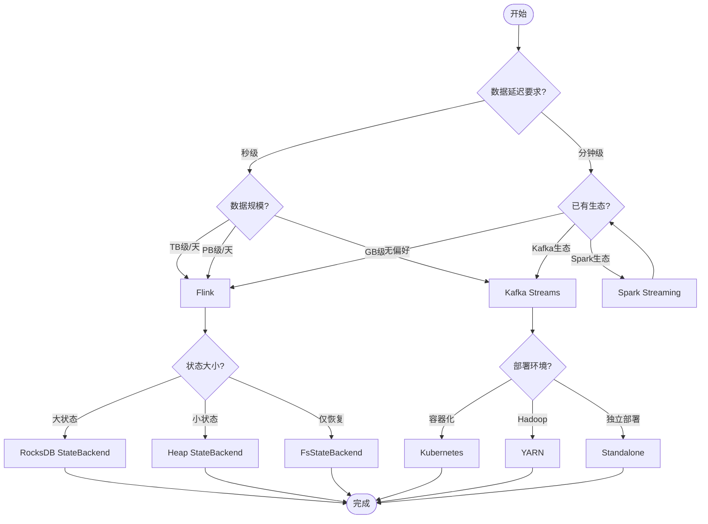

# 决策向导 (Decision Wizard)

> **模块**: Phase 2 - 可视化平台 - 模块3
> **功能**: 交互式技术选型决策工具
> **状态**: 初稿

---

## 功能概述

决策向导帮助用户根据业务场景选择合适的技术方案：

1. **流处理框架选择** - Flink vs Spark Streaming vs Kafka Streams
2. **状态后端选择** - RocksDB vs Heap vs FsStateBackend
3. **部署模式选择** - Standalone vs YARN vs Kubernetes
4. **窗口类型选择** - Tumbling vs Sliding vs Session vs Global

---

## 决策流程

---

## 实现计划

### Phase 1: 基础框架

- [ ] 决策树数据结构定义
- [ ] 基础UI组件
- [ ] 结果展示页面

### Phase 2: 内容填充

- [ ] 流处理框架决策树
- [ ] 状态后端决策树
- [ ] 部署模式决策树

### Phase 3: 增强功能

- [ ] 用户历史记录
- [ ] 推荐解释说明
- [ ] 导出决策报告

---

*Phase 2 - 任务线4-3: 决策向导设计*
