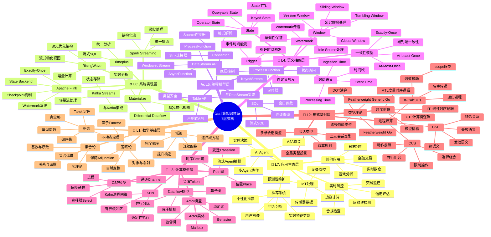
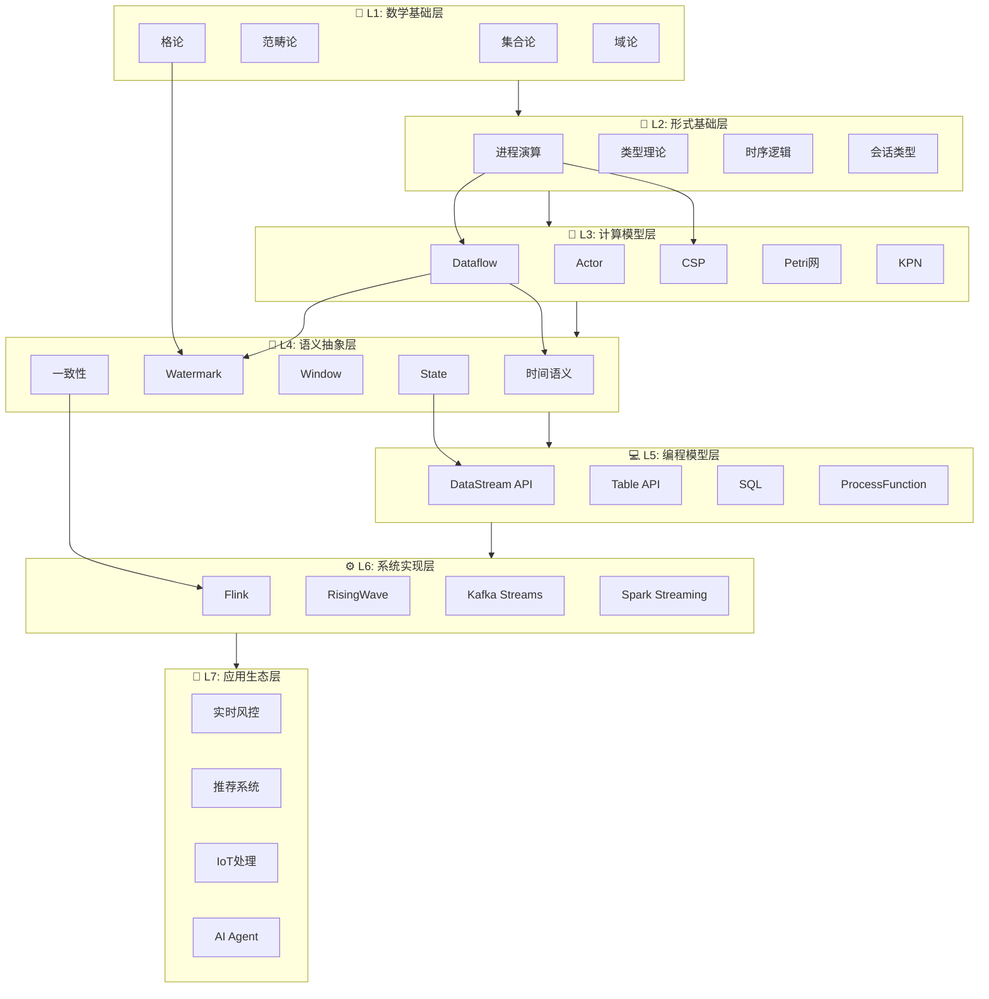

> **状态**: 🔮 前瞻内容 | **风险等级**: 高 | **最后更新**: 2026-04
> 
> 此文档描述的内容处于早期规划阶段，可能与最终实现不符。请以 Apache Flink 官方发布为准。
# 流计算7层架构思维导图

> **文档定位**: Phase 3 可视化文档 | **形式化等级**: L1-L7 全覆盖 | **版本**: 2026-04-09
> **描述**: 流计算知识体系七层架构的完整思维导图，展示从数学基础到应用生态的完整层次结构

---

## 目录

- [流计算7层架构思维导图](#流计算7层架构思维导图)
  - [目录](#目录)
  - [1. 架构概览](#1-架构概览)
  - [2. 完整思维导图](#2-完整思维导图)
  - [3. 分层详解](#3-分层详解)
    - [L1: 数学基础层](#l1-数学基础层)
    - [L2: 形式基础层](#l2-形式基础层)
    - [L3: 计算模型层](#l3-计算模型层)
    - [L4: 语义抽象层](#l4-语义抽象层)
    - [L5: 编程模型层](#l5-编程模型层)
    - [L6: 系统实现层](#l6-系统实现层)
    - [L7: 应用生态层](#l7-应用生态层)
  - [4. 层间依赖关系](#4-层间依赖关系)
  - [5. 关键洞察](#5-关键洞察)
    - [5.1 抽象层次与形式化等级的关系](#51-抽象层次与形式化等级的关系)
    - [5.2 跨层映射原则](#52-跨层映射原则)
    - [5.3 学习路径建议](#53-学习路径建议)

---

## 1. 架构概览

流计算知识体系采用**七层架构设计**，实现从数学基础到工程应用的完整知识图谱：

| 层次 | 名称 | 核心内容 | 形式化等级 | 代表概念 |
|------|------|----------|------------|----------|
| L7 | 应用生态层 | 业务场景、行业解决方案 | L1-L3 | 实时风控、推荐系统、IoT |
| L6 | 系统实现层 | 流处理引擎、存储系统 | L3-L4 | Flink、RisingWave、Kafka |
| L5 | 编程模型层 | API抽象、开发接口 | L3-L4 | DataStream API、SQL、Table API |
| L4 | 语义抽象层 | 时间语义、一致性模型 | L4-L5 | Event Time、Watermark、Window |
| L3 | 计算模型层 | 并发计算范式 | L4-L5 | Dataflow、Actor、CSP、Petri网 |
| L2 | 形式基础层 | 进程演算、类型理论 | L5-L6 | π-Calculus、CCS、CSP、Session Types |
| L1 | 数学基础层 | 集合论、范畴论、格论 | L6 | Set Theory、Category Theory、Lattice |

---

## 2. 完整思维导图



---

## 3. 分层详解

### L1: 数学基础层

**定位**: 整个知识体系的数学根基

| 概念 | 核心内容 | 在流计算中的应用 |
|------|----------|------------------|
| 集合论 | 集合运算、关系、函数 | 流作为元素集合的形式化定义 |
| 范畴论 | 函子、自然变换、伴随 | 不同计算模型间的结构映射 |
| 格论 | 偏序、完全格、不动点 | Watermark格结构、语义域定义 |
| 域论 | CPO、连续函数 | 指称语义、递归定义解释 |

### L2: 形式基础层

**定位**: 并发计算的形式化理论基础

| 概念 | 核心内容 | 表达能力 |
|------|----------|----------|
| CCS | 通信系统演算 | L3层，静态通道 |
| CSP | 通信顺序进程 | L3层，同步通信 |
| π-Calculus | 带名字传递的进程演算 | L4层，动态拓扑 |
| 类型理论 | FG/FGG/DOT | 静态类型安全保证 |
| 时序逻辑 | LTL/CTL/MTL | 性质规约与验证 |
| 会话类型 | Session Types | 协议合规性保证 |

### L3: 计算模型层

**定位**: 流计算的核心并发范式

| 模型 | 核心抽象 | 适用场景 | 表达能力 |
|------|----------|----------|----------|
| Dataflow | 算子、边、流 | 流处理引擎实现 | L4 |
| Actor | Actor、Mailbox、Behavior | 分布式系统、响应式 | L4 |
| CSP | 进程、Channel、Select | 同步并发、Go语言 | L3 |
| Petri网 | Place、Transition、Token | 工作流、协议分析 | L2-L4 |
| KPN | 确定性进程网络 | 信号处理、嵌入式 | L3 |

### L4: 语义抽象层

**定位**: 流计算的核心语义概念

| 概念 | 关键特性 | 形式化定义 |
|------|----------|------------|
| Event Time | 事件生成时间 | 偏序时间戳 |
| Watermark | 进度标记 | 单调递增函数 |
| Window | 时间/计数分组 | 区间划分函数 |
| Consistency | 一致性保证 | 序关系约束 |
| State | 有状态计算 | 键值映射 |
| Trigger | 窗口触发条件 | 谓词函数 |

### L5: 编程模型层

**定位**: 面向开发者的编程接口

| API类型 | 抽象级别 | 控制能力 | 适用用户 |
|---------|----------|----------|----------|
| SQL | 最高 | 最低 | 数据分析师 |
| Table API | 高 | 低 | 应用开发者 |
| DataStream API | 中 | 中 | 流处理工程师 |
| ProcessFunction | 低 | 高 | 高级开发者 |

### L6: 系统实现层

**定位**: 具体的流处理系统实现

| 系统 | 架构特点 | 核心优势 | 适用场景 |
|------|----------|----------|----------|
| Flink | 分布式流引擎 | Exactly-Once、低延迟 | 通用流处理 |
| RisingWave | 流数据库 | SQL优先、物化视图 | 实时分析 |
| Kafka Streams | 嵌入式库 | 轻量、与Kafka集成 | 事件驱动 |
| Spark Streaming | 微批处理 | 批流统一、生态丰富 | 混合工作负载 |
| Materialize | SQL流引擎 | 物化视图、一致性 | 实时报表 |

### L7: 应用生态层

**定位**: 行业应用场景与解决方案

| 领域 | 核心需求 | 典型应用 | 技术挑战 |
|------|----------|----------|----------|
| 金融科技 | 低延迟、一致性 | 风控、交易 | 延迟要求、正确性 |
| 互联网 | 大规模、实时性 | 推荐、广告 | 规模扩展、特征更新 |
| IoT | 边缘计算、连接数 | 设备监控 | 边缘资源、网络不稳定 |
| AI | 流式推理、Agent协作 | 实时决策 | 模型延迟、上下文管理 |

---

## 4. 层间依赖关系



---

## 5. 关键洞察

### 5.1 抽象层次与形式化等级的关系

| 层次 | 形式化等级 | 抽象特征 |
|------|------------|----------|
| L1-L2 | L5-L6 | 严格的数学定义与证明 |
| L3-L4 | L4-L5 | 形式化模型与语义 |
| L5-L6 | L3-L4 | 工程实现与API设计 |
| L7 | L1-L3 | 业务场景与应用模式 |

### 5.2 跨层映射原则

1. **向上依赖**: 上层概念依赖下层提供的形式化基础
2. **实现约束**: 系统实现(L6)受语义抽象(L4)约束
3. **正确性保证**: 数学基础(L1)为一致性(L4)提供证明手段
4. **工程权衡**: 编程模型(L5)在表达力与易用性间平衡

### 5.3 学习路径建议

```
入门路径: L7 → L6 → L5 (应用驱动)
理论路径: L1 → L2 → L3 (基础驱动)
完整路径: L1 → L2 → L3 → L4 → L5 → L6 → L7
```

---

> **关联文档**:
>
> - [MASTER-RECONSTRUCTION-PLAN.md](../../MASTER-RECONSTRUCTION-PLAN.md) - 重构计划与七层架构定义
> - [Struct/00-INDEX.md](../../Struct/00-INDEX.md) - 形式理论文档索引
> - [Knowledge/00-INDEX.md](../../Knowledge/00-INDEX.md) - 知识结构文档索引
> - [ARCHITECTURE.md](../../ARCHITECTURE.md) - 项目技术架构文档
