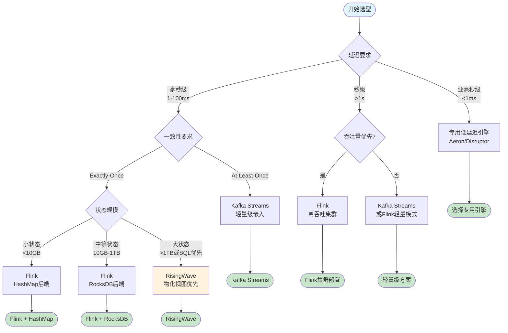
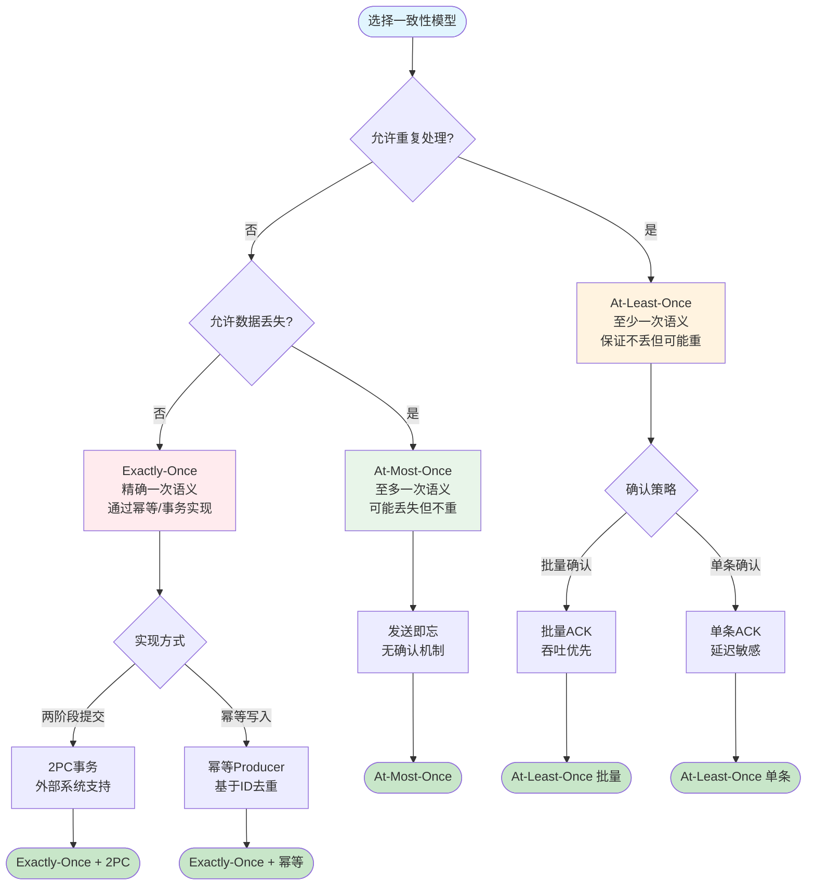
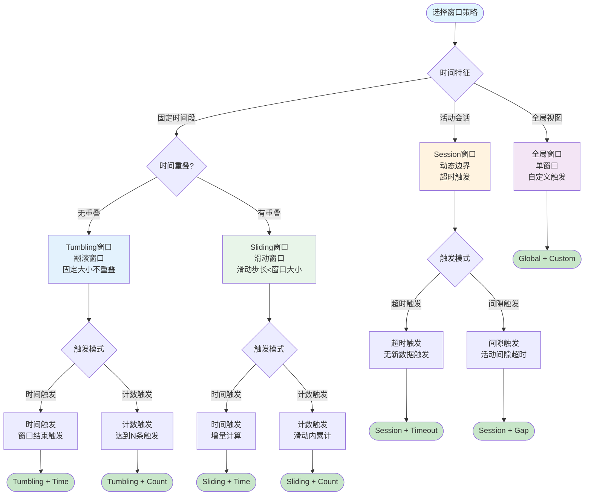
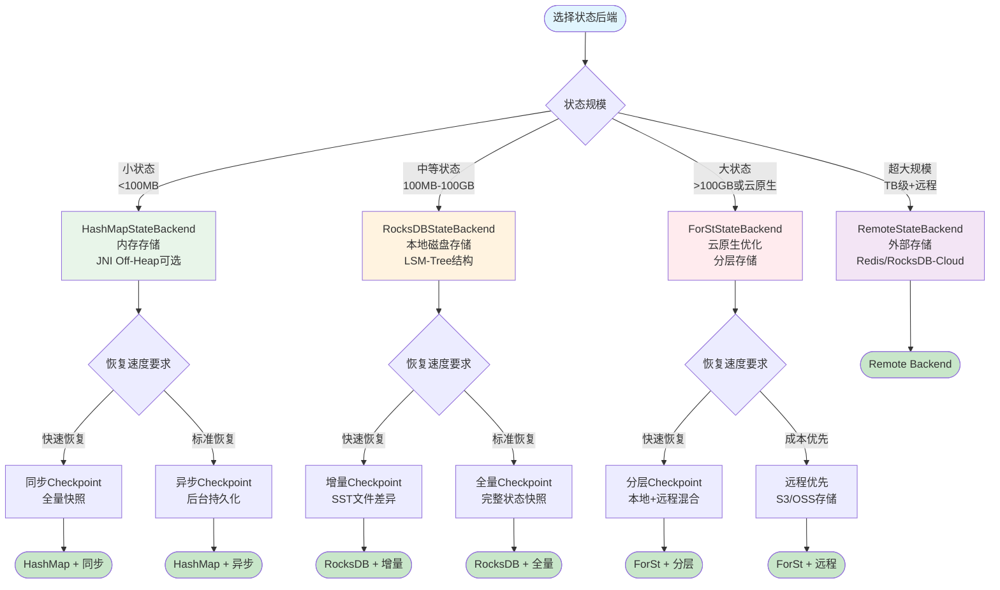
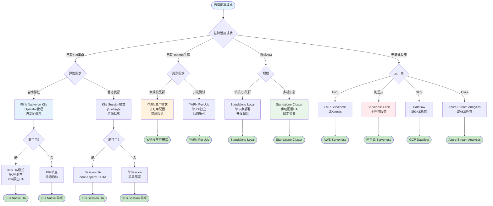

# 核心决策树可视化

> 所属阶段: Knowledge | 前置依赖: [流处理基础概念](../struct/01-stream-processing-basics.md) | 形式化等级: L3

## 1. 概念定义 (Definitions)

**Def-K-VIZ-02-01: 决策树 (Decision Tree)**
决策树是一种分层决策支持工具，通过一系列是非判断或特征选择，将复杂决策过程分解为可执行的推理路径。在流处理系统选型中，决策树将技术需求映射为具体的组件配置。

**Def-K-VIZ-02-02: 引擎选型维度 (Engine Selection Dimension)**
引擎选型的核心维度包括：延迟敏感度（Latency Sensitivity）、一致性保证级别（Consistency Level）、状态规模（State Scale）、吞吐量要求（Throughput Requirement）、以及生态兼容性（Ecosystem Compatibility）。

**Def-K-VIZ-02-03: 部署模式谱系 (Deployment Mode Spectrum)**
部署模式按照基础设施抽象层级分为：Standalone（进程级）、YARN（资源管理器级）、Kubernetes（容器编排级）、Serverless（函数级），各模式在运维复杂度与弹性能力之间存在权衡。

---

## 2. 属性推导 (Properties)

**Lemma-K-VIZ-02-01: 决策树完备性**
对于任意流处理需求，若其在五个维度（延迟、一致性、状态、窗口、部署）上的取值都在预定义范围内，则至少存在一条决策路径通向明确的技术选型推荐。

**Lemma-K-VIZ-02-02: 一致性级别蕴含关系**
Exactly-Once 语义在工程实现上蕴含 At-Least-Once 能力，但反之不成立。形式化表述为：

```
∀s ∈ StreamProcessor: ExactlyOnce(s) → AtLeastOnce(s)
∃s ∈ StreamProcessor: AtLeastOnce(s) ∧ ¬ExactlyOnce(s)
```

**Lemma-K-VIZ-02-03: 状态后端选择边界**
状态后端的选择遵循内存-性能权衡定律：HashMap 提供最优访问延迟但受限于堆内存；RocksDB/ForSt 支持TB级状态但引入序列化开销和磁盘I/O延迟。

---

## 3. 关系建立 (Relations)

### 3.1 决策维度与引擎能力映射

| 决策维度 | Flink | RisingWave | Kafka Streams |
|---------|-------|------------|---------------|
| 延迟要求(<100ms) | 支持 | 支持 | 支持 |
| 延迟要求(<10ms) | 有限支持 | 支持 | 有限支持 |
| Exactly-Once | 原生支持 | 原生支持 | 需外部协调 |
| TB级状态 | RocksDB/ForSt | 内置存储 | 需外部存储 |
| SQL支持 | Table API/SQL | 原生SQL | KSQL |

### 3.2 部署模式与弹性能力关系

```
Standalone → 手动扩缩容 → 低运维复杂度，低弹性
YARN       → 资源级弹性 → 中等运维，中等弹性
Kubernetes → 容器级弹性 → 较高运维，高弹性
Serverless → 函数级弹性 → 低运维，自动弹性
```

---

## 4. 论证过程 (Argumentation)

### 4.1 引擎选型决策的边界条件

**反例分析**: 当需求同时要求亚毫秒级延迟（<1ms）和TB级状态时，当前主流流处理引擎均无法单一满足。此类场景需采用分层架构：

- 热路径：专用低延迟引擎（如 Aeron, Disruptor）
- 冷路径：标准流处理引擎处理状态管理

### 4.2 窗口策略与时间语义耦合

窗口策略的选择与时间语义（Processing Time vs Event Time）存在强耦合：

- **Processing Time**: 适合 Tumbling/Sliding 窗口，简单但无法处理乱序
- **Event Time**: 必须配合 Watermark 机制，Session 窗口在此模式下才有意义

---

## 5. 形式证明 / 工程论证 (Proof / Engineering Argument)

### 5.1 状态后端选择的工程论证

**场景假设**: 状态规模 S，访问频率 F，可用内存 M

**决策规则**:

1. 若 S ≤ 0.3M 且 F > 10⁴ ops/s → 选择 HashMapStateBackend
2. 若 S > M 或需增量 Checkpoint → 选择 RocksDBStateBackend/ForStStateBackend
3. 若 S > 10TB 或需远程恢复 → 选择 ForStStateBackend（云原生优化）

**论证**: HashMap 提供 O(1) 访问复杂度，但受限于 JVM 堆内存和 GC 压力。RocksDB 通过 LSM-Tree 结构实现写优化，牺牲部分读性能换取水平扩展能力。ForSt 针对云存储（S3/OSS）优化，通过分层存储实现成本-性能平衡。

---

## 6. 实例验证 (Examples)

### 6.1 实时风控系统选型案例

**需求特征**:

- 延迟要求: <500ms
- 一致性: Exactly-Once（资金相关）
- 状态规模: 用户行为画像，约 100GB
- 窗口: 5分钟滑动窗口检测异常模式

**决策路径**:

1. 延迟 < 1s → 进入流处理引擎对比
2. Exactly-Once → Flink/RisingWave
3. 状态 100GB → RocksDB 后端
4. 滑动窗口 + 模式触发 → Flink CEP

**结论**: Apache Flink + RocksDB State Backend

### 6.2 日志聚合分析选型案例

**需求特征**:

- 延迟要求: <30s 可接受
- 一致性: At-Least-Once（允许少量重复）
- 状态规模: 无状态聚合
- 部署: 已有 K8s 集群

**决策路径**:

1. 延迟 > 1s → 批处理或轻量流处理均可
2. At-Least-Once → Kafka Streams 可选
3. K8s 部署 → Flink on K8s 或 Kafka Streams

**结论**: Kafka Streams（简化运维）或 Flink（未来扩展性）

---

## 7. 可视化 (Visualizations)

### 7.1 流处理引擎选型决策树

流处理引擎选型需要综合评估延迟、一致性、状态规模和SQL需求四个核心维度。



---

### 7.2 一致性模型选型决策树

一致性模型的选择取决于业务对重复处理和数据丢失的容忍度。



---

### 7.3 窗口策略选型决策树

窗口策略的选择取决于时间特征、触发模式和业务语义需求。



---

### 7.4 状态后端选型决策树

状态后端的选择取决于状态规模、访问模式和恢复速度要求。



---

### 7.5 部署模式选型决策树

部署模式的选择取决于基础设施现状、弹性需求和运维能力。



---

## 8. 引用参考 (References)
