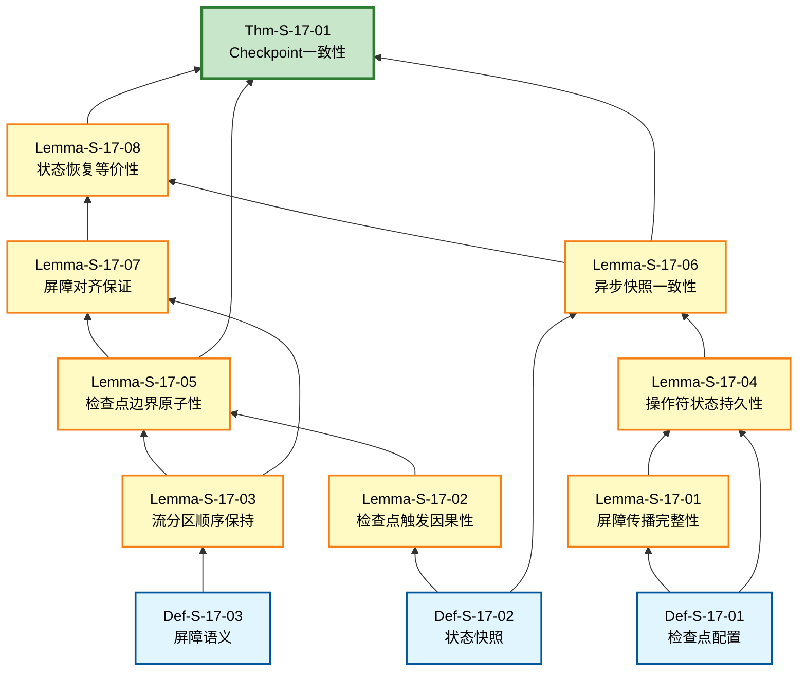
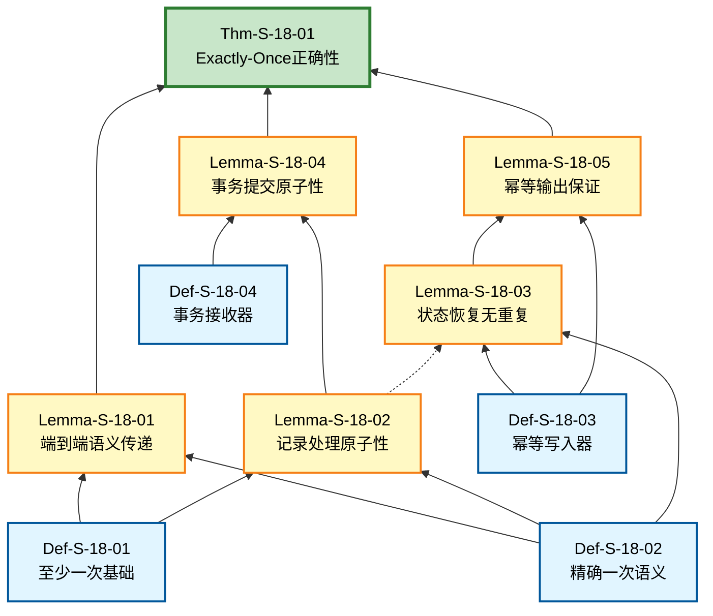
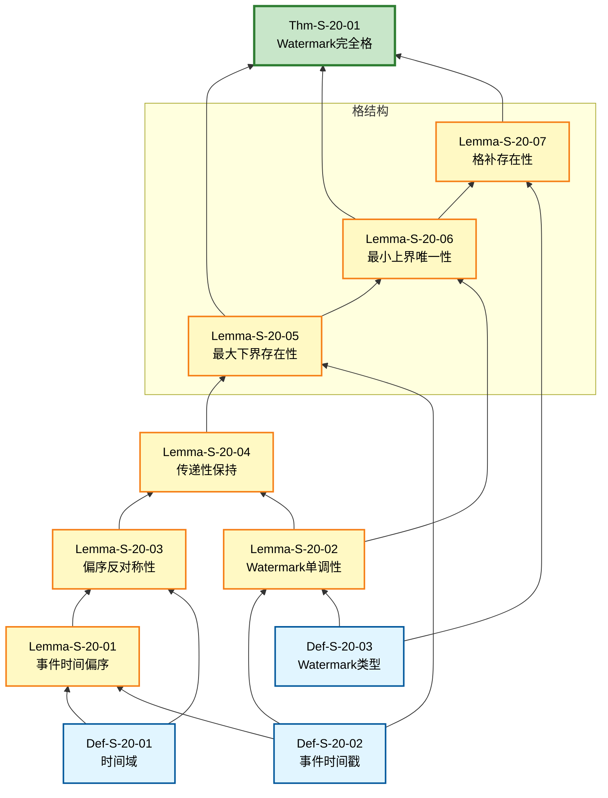
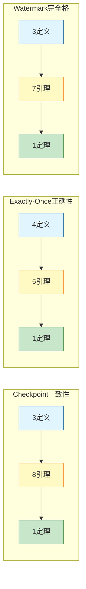

# 核心定理推理树可视化

> 所属阶段: Struct/ | 前置依赖: [S-17-Checkpoint一致性定理](../S-17-Checkpoint一致性定理.md), [S-18-Exactly-Once语义定理](../S-18-Exactly-Once语义定理.md), [S-20-Watermark理论定理](../S-20-Watermark理论定理.md) | 形式化等级: L3

本文档展示三个核心定理的完整公理-定理推理树，使用Mermaid graph BT（自底向上）格式呈现从基础定义到定理的推导路径。

---

## 1. Checkpoint一致性推理树

**定理**: Thm-S-17-01 (Checkpoint一致性)

**结构说明**: 从基础定义出发，通过8个引理逐步推导，最终建立Checkpoint一致性定理。



**推导路径说明**:

| 层级 | 节点类型 | 编号 | 名称 | 直接后继 |
|------|----------|------|------|----------|
| 1 | 定义 | Def-S-17-01 | 检查点配置 | Lemma-S-17-01, Lemma-S-17-04 |
| 1 | 定义 | Def-S-17-02 | 状态快照 | Lemma-S-17-02, Lemma-S-17-06 |
| 1 | 定义 | Def-S-17-03 | 屏障语义 | Lemma-S-17-03 |
| 2 | 引理 | Lemma-S-17-01 | 屏障传播完整性 | Lemma-S-17-04 |
| 2 | 引理 | Lemma-S-17-02 | 检查点触发因果性 | Lemma-S-17-05 |
| 2 | 引理 | Lemma-S-17-03 | 流分区顺序保持 | Lemma-S-17-05, Lemma-S-17-07 |
| 2 | 引理 | Lemma-S-17-04 | 操作符状态持久性 | Lemma-S-17-06 |
| 3 | 引理 | Lemma-S-17-05 | 检查点边界原子性 | Lemma-S-17-07, Thm-S-17-01 |
| 3 | 引理 | Lemma-S-17-06 | 异步快照一致性 | Lemma-S-17-08, Thm-S-17-01 |
| 4 | 引理 | Lemma-S-17-07 | 屏障对齐保证 | Lemma-S-17-08 |
| 4 | 引理 | Lemma-S-17-08 | 状态恢复等价性 | Thm-S-17-01 |
| 5 | 定理 | Thm-S-17-01 | Checkpoint一致性 | - |

---

## 2. Exactly-Once正确性推理树

**定理**: Thm-S-18-01 (Exactly-Once正确性)

**结构说明**: 从4个基础定义出发，通过5个引理建立Exactly-Once正确性保证。



**推导路径说明**:

| 层级 | 节点类型 | 编号 | 名称 | 直接后继 |
|------|----------|------|------|----------|
| 1 | 定义 | Def-S-18-01 | 至少一次基础 | Lemma-S-18-01, Lemma-S-18-02 |
| 1 | 定义 | Def-S-18-02 | 精确一次语义 | Lemma-S-18-01, Lemma-S-18-02, Lemma-S-18-03 |
| 1 | 定义 | Def-S-18-03 | 幂等写入器 | Lemma-S-18-03, Lemma-S-18-05 |
| 1 | 定义 | Def-S-18-04 | 事务接收器 | Lemma-S-18-04 |
| 2 | 引理 | Lemma-S-18-01 | 端到端语义传递 | Thm-S-18-01 |
| 2 | 引理 | Lemma-S-18-02 | 记录处理原子性 | Lemma-S-18-04, Lemma-S-18-03 |
| 2 | 引理 | Lemma-S-18-03 | 状态恢复无重复 | Lemma-S-18-05 |
| 2 | 引理 | Lemma-S-18-04 | 事务提交原子性 | Thm-S-18-01 |
| 2 | 引理 | Lemma-S-18-05 | 幂等输出保证 | Thm-S-18-01 |
| 3 | 定理 | Thm-S-18-01 | Exactly-Once正确性 | - |

**关键依赖说明**: 虚线连接 `L2 -.-> L3` 表示记录处理原子性是状态恢复无重复的前提条件。

---

## 3. Watermark完全格推理树

**定理**: Thm-S-20-01 (Watermark完全格)

**结构说明**: 从时间语义和偏序关系的定义出发，建立Watermark的完全格结构。



**推导路径说明**:

| 层级 | 节点类型 | 编号 | 名称 | 直接后继 |
|------|----------|------|------|----------|
| 1 | 定义 | Def-S-20-01 | 时间域 | Lemma-S-20-01, Lemma-S-20-03 |
| 1 | 定义 | Def-S-20-02 | 事件时间戳 | Lemma-S-20-01, Lemma-S-20-02, Lemma-S-20-05 |
| 1 | 定义 | Def-S-20-03 | Watermark类型 | Lemma-S-20-02, Lemma-S-20-07 |
| 2 | 引理 | Lemma-S-20-01 | 事件时间偏序 | Lemma-S-20-03 |
| 2 | 引理 | Lemma-S-20-02 | Watermark单调性 | Lemma-S-20-04, Lemma-S-20-06 |
| 2 | 引理 | Lemma-S-20-03 | 偏序反对称性 | Lemma-S-20-04 |
| 3 | 引理 | Lemma-S-20-04 | 传递性保持 | Lemma-S-20-05 |
| 3 | 引理 | Lemma-S-20-05 | 最大下界存在性 | Thm-S-20-01, Lemma-S-20-06 |
| 4 | 引理 | Lemma-S-20-06 | 最小上界唯一性 | Thm-S-20-01, Lemma-S-20-07 |
| 4 | 引理 | Lemma-S-20-07 | 格补存在性 | Thm-S-20-01 |
| 5 | 定理 | Thm-S-20-01 | Watermark完全格 | - |

---

## 4. 推理树对比总览

### 4.1 结构复杂度对比

| 定理 | 定义数 | 引理数 | 最大深度 | 关键路径 |
|------|--------|--------|----------|----------|
| Checkpoint一致性 | 3 | 8 | 5 | D1→L1→L4→L6→L8→Thm |
| Exactly-Once正确性 | 4 | 5 | 3 | D2→L3→L5→Thm |
| Watermark完全格 | 3 | 7 | 5 | D1→L1→L3→L4→L5→L6→L7→Thm |

### 4.2 依赖关系密度



### 4.3 颜色图例

| 颜色 | 节点类型 | 说明 |
|------|----------|------|
| 🟦 蓝色 (#e1f5ff) | 定义 (Definition) | 形式化基础概念，作为推理起点 |
| 🟨 黄色 (#fff9c4) | 引理 (Lemma) | 中间推导步骤，连接定义与定理 |
| 🟩 绿色 (#c8e6c9) | 定理 (Theorem) | 最终结论，代表完整的理论成果 |

---

## 5. 可视化使用说明

### 5.1 阅读顺序

1. **自底向上**: 从蓝色定义节点开始，沿箭头方向向上追溯推导路径
2. **关键路径**: 关注从任意定义到定理的最长路径，理解核心依赖链
3. **并行分支**: 识别独立的引理链，理解模块化证明结构

### 5.2 Mermaid渲染兼容性

- **支持平台**: GitHub、GitLab、Typora、VS Code (Mermaid插件)
- **推荐工具**: Mermaid Live Editor (<https://mermaid.live>)
- **导出格式**: 支持导出为PNG/SVG/PDF

### 5.3 扩展指南

如需添加新的推理树，请遵循以下模板：

```mermaid
graph BT
    classDef definition fill:#e1f5ff,stroke:#01579b,stroke-width:2px,color:#000
    classDef lemma fill:#fff9c4,stroke:#f57f17,stroke-width:2px,color:#000
    classDef theorem fill:#c8e6c9,stroke:#2e7d32,stroke-width:3px,color:#000

    %% 定理
    Thm[Thm-S-XX-XX<br/>定理名称]:::theorem

    %% 引理（按层级排列）
    L[N][Lemma-S-XX-XX<br/>引理名称]:::lemma

    %% 定义
    D[N][Def-S-XX-XX<br/>定义名称]:::definition

    %% 依赖边
    D --> L
    L --> Thm
```

---

## 6. 引用参考
