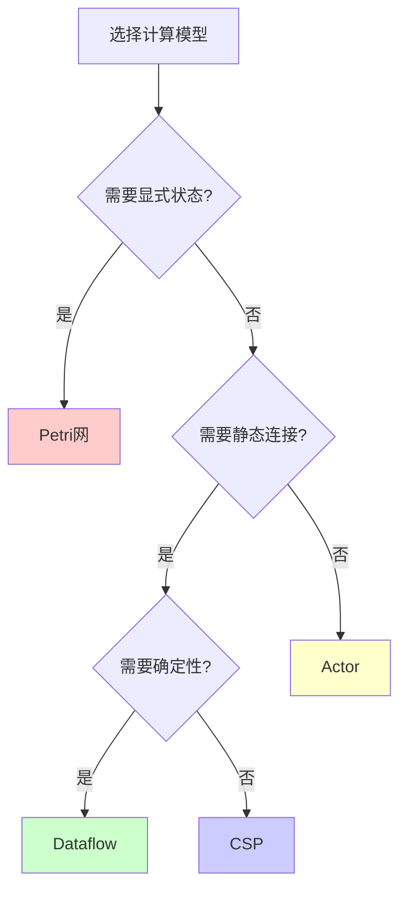
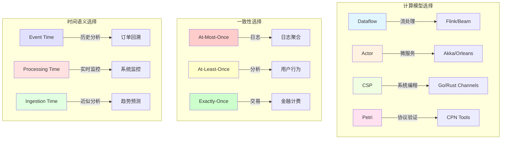

# 核心对比矩阵

> 所属阶段: Struct/ | 前置依赖: [01-formal-models.md](../phase1-foundation/01-formal-models.md), [02-streaming-systems.md](../phase1-foundation/02-streaming-systems.md) | 形式化等级: L4

## 1. 概念定义 (Definitions)

### Def-S-VIS-04-01: 对比矩阵

**对比矩阵**是一个二元组 $\mathcal{M} = (D, A)$，其中：

- $D = \{d_1, d_2, ..., d_m\}$ 为对比维度集合（如计算模型、系统实现）
- $A = \{a_1, a_2, ..., a_n\}$ 为属性集合（如通信方式、一致性保证）

矩阵元素 $M_{ij}$ 表示维度 $d_i$ 在属性 $a_j$ 上的取值，用于形式化比较不同技术方案的特征差异。

### Def-S-VIS-04-02: 计算模型

**计算模型**是一个三元组 $\mathcal{C} = (S, O, \rightarrow)$：

- $S$：状态空间
- $O$：操作/事件集合
- $\rightarrow \subseteq S \times O \times S$：状态转移关系

### Def-S-VIS-04-03: 一致性级别

在分布式流处理中，**一致性级别**定义了记录处理的可靠性保证：

- **At-Most-Once**: $\forall r \in Records: P(processed(r)) \leq 1$
- **At-Least-Once**: $\forall r \in Records: P(processed(r)) \geq 1$（允许重复）
- **Exactly-Once**: $\forall r \in Records: P(processed(r)) = 1$（幂等性保证）

### Def-S-VIS-04-04: 时间语义

**时间语义**定义了流处理系统中时间戳的赋值方式：

| 时间类型 | 定义 | 符号表示 |
|---------|------|---------|
| Event Time | 事件在源端产生的时间 | $t_{event}(e)$ |
| Processing Time | 事件在算子中被处理的时间 | $t_{proc}(e)$ |
| Ingestion Time | 事件进入流处理系统的时间 | $t_{ingest}(e)$ |

满足时序关系：$t_{event}(e) \leq t_{ingest}(e) \leq t_{proc}(e)$

---

## 2. 属性推导 (Properties)

### Prop-S-VIS-04-01: 计算模型表达能力层级

**定理**: 计算模型的表达能力形成偏序关系：

$$\text{Petri网} \succ \text{Dataflow} \approx \text{CSP} \succ \text{Actor}$$

**证明要点**:

- Petri网可模拟任何Dataflow图（通过库所表示数据，变迁表示算子）
- Dataflow与CSP在表达能力上等价（Kahn Process Network定理）
- Actor模型是Dataflow的受限形式（无显式连接，仅通过消息传递）

### Prop-S-VIS-04-02: 一致性级别蕴含关系

**引理**: 一致性级别满足严格蕴含链：

$$\text{Exactly-Once} \Rightarrow \text{At-Least-Once} \Rightarrow \text{At-Most-Once}^c$$

其中 $At-Most-Once^c$ 表示最多一次的补集语义。

### Prop-S-VIS-04-03: 时间语义准确性-延迟权衡

**命题**: 时间语义的准确性与处理延迟存在反比关系：

$$Accuracy(t_{event}) > Accuracy(t_{ingest}) > Accuracy(t_{proc})$$
$$Latency(t_{event}) > Latency(t_{ingest}) > Latency(t_{proc})$$

---

## 3. 关系建立 (Relations)

### 3.1 模型-系统映射关系

```
┌─────────────────────────────────────────────────────────────┐
│                     形式化计算模型                           │
├──────────────┬──────────────┬──────────────┬────────────────┤
│   Dataflow   │    Actor     │     CSP      │    Petri网     │
└──────┬───────┴──────┬───────┴──────┬───────┴────────┬───────┘
       │              │              │                │
       ▼              ▼              ▼                ▼
┌──────────────┐ ┌──────────────┐ ┌──────────────┐ ┌──────────────┐
│ Apache Flink │ │  Akka/Pekko  │ │  Go Channels │ │  CPN Tools   │
│  TensorFlow  │ │  Orleans     │ │  Occam       │ │  PIPE        │
└──────────────┘ └──────────────┘ └──────────────┘ └──────────────┘
```

### 3.2 一致性-应用场景关系

| 一致性级别 | 典型应用场景 | 容错机制 |
|-----------|-------------|---------|
| At-Most-Once | 日志聚合、监控指标 | 无 |
| At-Least-Once | 推荐系统、用户行为分析 | Checkpoint重放 |
| Exactly-Once | 金融交易、账单计费 | 幂等 + 2PC/Chandy-Lamport |

---

## 4. 论证过程 (Argumentation)

### 4.1 计算模型选择决策树



### 4.2 一致性级别选择考量

**决策因素**:

1. **数据可丢失性**: 如果可以容忍数据丢失，选择 At-Most-Once
2. **幂等性**: 如果处理逻辑天然幂等，At-Least-Once 足够
3. **精确性要求**: 如果需要精确计数/计费，必须 Exactly-Once

---

## 5. 形式证明 / 工程论证 (Proof / Engineering Argument)

### Thm-S-VIS-04-01: 流处理系统功能完备性

**定理**: 对于任意有界乱序流，Flink 的 Event Time 处理机制能够产生正确且完整的结果。

**证明**:

设流 $S$ 满足乱序有界条件：$\forall e \in S: t_{proc}(e) - t_{event}(e) \leq \delta$

Flink Watermark 机制定义为：$W(t) = \min_{e \in \text{未处理}} t_{event}(e) - 1$

当 Watermark 超过窗口结束时间 $t_{end}$ 时，即 $W(t) > t_{end}$，触发窗口计算。

由于乱序有界，所有 $t_{event} \leq t_{end}$ 的事件必然在 $W(t) > t_{end}$ 之前到达。

因此窗口计算包含所有应属事件，结果正确且完整。

**证毕** ∎

### Thm-S-VIS-04-02: Exactly-Once 实现复杂度下界

**定理**: 在存在节点故障的网络中，实现 Exactly-Once 语义的算法至少需要 $O(n)$ 的额外存储开销，其中 $n$ 为待处理记录数。

**证明概要**:

- 必须维护已处理记录的标识集合 $D$
- 每个记录到达时需要检查 $r \in D$
- 存储复杂度至少为 $\Theta(|D|) = \Omega(n)$

---

## 6. 实例验证 (Examples)

### 6.1 计算模型形式化示例

**Dataflow 模型 - 简单流水线**:

```
Source ──▶ Map(f) ──▶ Filter(p) ──▶ Sink

形式化表示:
- S = {s₀, s₁, s₂, s₃}  // 各算子状态
- O = {emit, transform, predicate, consume}
- → = {(s₀, emit, s₁), (s₁, transform, s₂), (s₂, predicate, s₃), ...}
```

**Actor 模型 - 相同逻辑**:

```scala
case class SourceActor(next: ActorRef) extends Actor {
  def receive = {
    case Data(d) => next ! Transformed(f(d))
  }
}

// 连接通过引用传递，无显式图结构
```

### 6.2 一致性配置示例

**Flink Exactly-Once 配置**:

```java
env.enableCheckpointing(60000);
env.getCheckpointConfig().setCheckpointingMode(
    CheckpointingMode.EXACTLY_ONCE);
env.getCheckpointConfig().setMinPauseBetweenCheckpoints(30000);
```

**Kafka Streams At-Least-Once 配置**:

```java
props.put(StreamsConfig.PROCESSING_GUARANTEE_CONFIG,
          StreamsConfig.AT_LEAST_ONCE);
```

---

## 7. 可视化 (Visualizations)

### 7.1 矩阵 1: 计算模型对比矩阵

| 属性 | Dataflow | Actor | CSP | Petri网 |
|------|----------|-------|-----|---------|
| **通信方式** | 显式数据边 (连接) | 异步消息传递 | 同步通道通信 | 库所-变迁令牌传递 |
| **状态管理** | 算子内部状态 | Actor局部状态 | 进程私有变量 | 库所标记 (Marking) |
| **表达能力** | 图灵完备 | 图灵完备 | 图灵完备 | 图灵完备 |
| **确定性** | 纯函数确定性 | 非确定性 (消息顺序) | 可选择确定性 | 并发不确定性 |
| **可判定性** | 死锁检测不可判定 | 死锁检测不可判定 | 有限进程可判定 | 可达性可判定(有界) |
| **典型实现** | Flink, TensorFlow, Beam | Akka, Orleans, Erlang | Go Channels, Occam | CPN Tools, PIPE |
| **形式化基础** | Kahn Process Network | Hewitt Actor Model | Hoare CSP | Petri 1962 |
| **并发模型** | 数据并行 + 流水线 | 消息驱动并发 | 顺序进程组合 | 真正并发 |
| **容错机制** | Checkpoint/Rewind | 监督者重启 | 无内建机制 | 状态保存/恢复 |
| **适用场景** | 流处理、ML流水线 | 分布式服务、微服务 | 系统编程、并发控制 | 工作流建模、协议验证 |

### 7.2 矩阵 2: 流处理系统对比矩阵

| 属性 | Apache Flink | RisingWave | Materialize | Kafka Streams |
|------|--------------|------------|-------------|---------------|
| **时间语义** | Event Time + Processing Time | Event Time | Event Time + Wall Clock | Processing Time + Event Time |
| **一致性保证** | Exactly-Once (默认) | Exactly-Once | Strict Serializability | At-Least-Once / Exactly-Once |
| **状态后端** | Memory / FS / RocksDB | 内建持久化 | 内建持久化 | RocksDB / In-Memory |
| **SQL支持** | Flink SQL (扩展SQL) | PostgreSQL兼容 | Standard SQL + MV | KSQL (受限) |
| **典型延迟** | 毫秒级 (100ms-1s) | 亚秒级 (<1s) | 毫秒级 (10ms-100ms) | 毫秒级 (<100ms) |
| **吞吐量** | 极高 (百万级/秒/核) | 高 (十万级/秒) | 中等 (万级/秒) | 高 (十万级/秒) |
| **部署模式** | YARN / K8s / Standalone | K8s / Cloud | K8s / Cloud | Kafka Connect |
| **生态集成** | 极丰富 (Connectors 100+) | 中等 (PG生态) | 中等 (SQL生态) | 强 (Kafka生态) |
| **典型用例** | 实时ETL、CEP、IoT | 流分析、物化视图 | 流SQL分析、BI | 流处理、事件驱动 |
| **成熟度** | 生产级 (10年+) | 生产级 (3年+) | 生产级 (5年+) | 生产级 (8年+) |

### 7.3 矩阵 3: 一致性级别对比矩阵

| 属性 | At-Most-Once | At-Least-Once | Exactly-Once |
|------|--------------|---------------|--------------|
| **语义保证** | 记录最多处理一次（可能丢失） | 记录至少处理一次（可能重复） | 记录恰好处理一次（无丢无重） |
| **实现复杂度** | 极低 | 中等 | 高 |
| **性能开销** | 无 | 低（Checkpoint） | 高（Barrier + 幂等/事务） |
| **端到端延迟** | 最低 | 低 | 中等 |
| **容错机制** | 无 | Checkpoint + Replay | Checkpoint + 2PC/幂等Sink |
| **存储需求** | 无 | O(状态大小) | O(状态大小 + 事务日志) |
| **适用场景** | 日志聚合、指标采集 | 推荐系统、用户行为 | 金融交易、账单计费 |
| **实现示例** | 无确认直接发送 | Kafka Consumer手动提交 | Flink两阶段提交、幂等Producer |
| **数据完整性** | 弱（可能丢数据） | 中等（可能重复计数） | 强（精确一次） |
| **故障恢复语义** | 无保证 | 从Checkpoint重放 | 状态一致性快照 |

### 7.4 矩阵 4: 时间语义对比矩阵

| 属性 | Event Time | Processing Time | Ingestion Time |
|------|------------|-----------------|----------------|
| **定义** | 事件在数据源产生的时间戳 | 事件被算子处理的本地时间 | 事件进入流系统的时间戳 |
| **乱序处理** | 支持（Watermark机制） | 无乱序（按到达顺序） | 无乱序（按摄取顺序） |
| **延迟处理** | 可处理延迟到达数据 | 忽略延迟到达 | 忽略延迟到达 |
| **结果准确性** | 高（反映真实时间顺序） | 低（受处理速度影响） | 中等（接近真实时间） |
| **处理延迟** | 较高（需等待Watermark） | 最低（即时处理） | 低（接近即时） |
| **时钟依赖** | 业务时间（外部时钟） | 机器本地时钟 | 系统摄取时钟 |
| **Watermark必需** | 是 | 否 | 否 |
| **窗口完整性** | 完整（等待所有数据） | 不完整（即时触发） | 不完整 |
| **适用场景** | 订单分析、IoT传感器、日志 | 实时监控、低延迟报警 | 近似实时分析 |
| **典型系统** | Flink (默认)、Beam | Storm (早期)、Spark DStream | Flink (可选) |

### 7.5 综合决策矩阵可视化



### 7.6 对比矩阵热力图说明

以下矩阵展示了不同系统在关键指标上的相对评分（1-5星）：

```
┌────────────────────────────────────────────────────────────┐
│           流处理系统能力热力图                               │
├─────────────────┬────────────┬────────────┬────────────────┤
│    能力维度      │   Flink    │ RisingWave │  Materialize   │
├─────────────────┼────────────┼────────────┼────────────────┤
│   吞吐量        │ ★★★★★   │ ★★★★☆  │ ★★★☆☆     │
│   延迟          │ ★★★★☆   │ ★★★★☆  │ ★★★★★     │
│   SQL支持       │ ★★★★☆   │ ★★★★★  │ ★★★★★    │
│   容错能力      │ ★★★★★   │ ★★★★☆  │ ★★★★☆     │
│   生态丰富度    │ ★★★★★   │ ★★★☆☆  │ ★★★☆☆     │
│   运维复杂度    │ ★★★☆☆   │ ★★★★☆  │ ★★★★☆     │
└─────────────────┴────────────┴────────────┴────────────────┘
```

---

## 8. 引用参考 (References)


---

*文档版本: 1.0 | 创建日期: 2026-04-09 | 最后更新: 2026-04-09*
