> **状态**: 🔮 前瞻内容 | **风险等级**: 高 | **最后更新**: 2026-04
>
> 此文档描述的内容处于早期规划阶段，可能与最终实现不符。请以 Apache Flink 官方发布为准。
>
# AnalysisDataFlow 技术架构文档

> **版本**: v1.1 | **更新日期**: 2026-04-11 | **状态**: Production | **项目状态**: 100%完成 ✅
>
> 本文档描述 AnalysisDataFlow 项目的整体技术架构，包括目录结构、文档生成流程、验证系统、存储架构和扩展机制。

---

## 目录

- [AnalysisDataFlow 技术架构文档](#analysisdataflow-技术架构文档)
  - [目录](#目录)
  - [1. 项目整体架构](#1-项目整体架构)
    - [1.1 四层架构概览](#11-四层架构概览)
    - [1.2 各层职责与接口](#12-各层职责与接口)
      - [Layer 1: Struct/ - 形式理论基础层](#layer-1-struct-形式理论基础层)
      - [Layer 2: Knowledge/ - 知识应用层](#layer-2-knowledge-知识应用层)
      - [Layer 3: Flink/ - 工程实现层](#layer-3-flink-工程实现层)
      - [Layer 4: visuals/ - 可视化导航层](#layer-4-visuals-可视化导航层)
    - [1.3 数据流转与依赖关系](#13-数据流转与依赖关系)
  - [2. 文档生成架构](#2-文档生成架构)
    - [2.1 Markdown 处理流程](#21-markdown-处理流程)
    - [2.2 Mermaid 图表渲染](#22-mermaid-图表渲染)
    - [7.2 决策流程图](#72-决策流程图)
  - [3. 验证系统架构](#3-验证系统架构)
    - [3.1 验证脚本架构](#31-验证脚本架构)
    - [3.2 CI/CD 流程](#32-cicd-流程)
    - [3.3 质量门禁](#33-质量门禁)
  - [4. 存储架构](#4-存储架构)
    - [4.1 文件组织结构](#41-文件组织结构)
    - [4.2 索引系统](#42-索引系统)
    - [4.3 版本管理](#43-版本管理)
  - [5. 扩展架构](#5-扩展架构)
    - [5.1 添加新文档](#51-添加新文档)
    - [5.2 添加新可视化](#52-添加新可视化)
  - [使用指南](#使用指南)
    - [如何阅读](#如何阅读)
    - [相关文档](#相关文档)
  - [更新日志](#更新日志)
  - [6. 项目完成里程碑](#6-项目完成里程碑)
    - [完成统计](#完成统计)
    - [各层完成状态](#各层完成状态)
    - [关键完成报告](#关键完成报告)
  - [使用指南](#使用指南-1)
    - [如何阅读](#如何阅读-1)
    - [相关文档](#相关文档-1)
  - [更新日志](#更新日志-1)
  - [附录](#附录)
    - [A. 术语表](#a-术语表)
    - [B. 目录映射表](#b-目录映射表)
    - [C. 相关文档](#c-相关文档)

---

## 1. 项目整体架构

### 1.1 四层架构概览

AnalysisDataFlow 采用**四层架构设计**，实现从形式化理论到工程实践的完整知识体系：

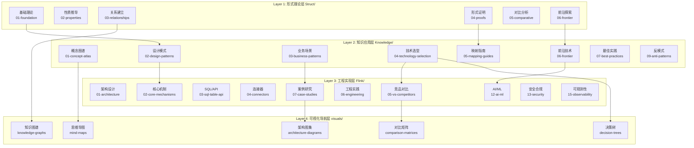

### 1.2 各层职责与接口

#### Layer 1: Struct/ - 形式理论基础层

| 属性 | 说明 |
|------|------|
| **定位** | 数学定义、定理证明、严格论证 |
| **内容特征** | 形式化语言、公理系统、证明构造 |
| **文档数量** | 43 篇 |
| **核心产出** | 380 定理、835 定义 |
| **状态** | ✅ 100%完成 |

**内部接口规范**：

```
输入: 学术文献、形式化规范
输出: Def-* (定义), Thm-* (定理), Lemma-* (引理), Prop-* (命题)
契约: 每个定义必须有唯一编号，每个定理必须有完整证明
```

**子目录职责**：

- `01-foundation/`: USTM、进程演算、Actor、Dataflow 基础理论
- `02-properties/`: 确定性、一致性、Watermark 单调性等性质
- `03-relationships/`: 跨模型编码、表达能力层次
- `04-proofs/`: Checkpoint、Exactly-Once 正确性证明
- `05-comparative/`: Go vs Scala 表达力对比
- `06-frontier/`: 开放问题、Choreographic 编程、AI Agent 形式化
- `07-tools/`: TLA+, Coq, Smart Casual 验证工具

#### Layer 2: Knowledge/ - 知识应用层

| 属性 | 说明 |
|------|------|
| **定位** | 设计模式、业务场景、技术选型 |
| **内容特征** | 工程实践、模式目录、决策框架 |
| **文档数量** | 134 篇 |
| **核心产出** | 45 设计模式、30 业务场景 |
| **状态** | ✅ 100%完成 |

**内部接口规范**：

```
输入: Struct/ 形式化定义、行业案例、工程经验
输出: 设计模式目录、技术选型指南、业务场景分析
契约: 每个模式必须关联形式化基础，每个选型必须有决策矩阵
```

**子目录职责**：

- `01-concept-atlas/`: 并发范式矩阵、概念图谱
- `02-design-patterns/`: 事件时间处理、状态计算、窗口聚合等模式
- `03-business-patterns/`: Uber/Netflix/Alibaba 等真实案例
- `04-technology-selection/`: 引擎选型、存储选型、流数据库指南
- `05-mapping-guides/`: 理论到代码映射、迁移指南
- `06-frontier/`: A2A 协议、MCP、实时 RAG、流数据库生态、Multi-Agent编排
- `09-anti-patterns/`: 10 大反模式识别与规避策略

#### Layer 3: Flink/ - 工程实现层

| 属性 | 说明 |
|------|------|
| **定位** | Flink 专项技术、架构机制、工程实践 |
| **内容特征** | 源码分析、配置示例、性能调优 |
| **文档数量** | 178 篇 |
| **核心产出** | 681 Flink 相关定理、核心机制全覆盖 |
| **状态** | ✅ 100%完成 |

**内部接口规范**：

```
输入: Knowledge/ 设计模式、Flink 官方文档、源码分析
输出: 架构文档、机制详解、案例研究、路线图
契约: 每个机制必须有源码引用，每个案例必须有生产验证
```

**子目录职责**：

- `01-architecture/`: 架构演进、分离状态分析
- `02-core-mechanisms/`: Checkpoint、Exactly-Once、Watermark、Delta Join
- `03-sql-table-api/`: SQL 优化、Model DDL、Vector Search
- `04-connectors/`: Kafka、CDC、Iceberg、Paimon 集成
- `05-vs-competitors/`: 与 Spark、RisingWave 对比
- `06-engineering/`: 性能调优、成本优化、测试策略
- `07-case-studies/`: 金融风控、IoT、推荐系统等案例
- `08-roadmap/`: Flink 2.4/2.5/3.0 路线图 (100子任务完成)
- `12-ai-ml/`: Flink ML、在线学习、AI Agents、Agent工作流引擎
- `13-security/`: TEE、GPU 可信计算、SPIFFE/SPIRE
- `15-observability/`: OpenTelemetry、SLO、可观测性

#### Layer 4: visuals/ - 可视化导航层

| 属性 | 说明 |
|------|------|
| **定位** | 决策树、对比矩阵、思维导图、知识图谱 |
| **内容特征** | 可视化导航、快速决策、知识概览 |
| **文档数量** | 21 篇 |
| **核心产出** | 5 类可视化、1,600+ Mermaid 图表 |
| **状态** | ✅ 100%完成 |

**内部接口规范**：

```
输入: 全项目文档、定理依赖关系、技术选型逻辑
输出: 决策树、对比矩阵、思维导图、知识图谱
契约: 每个可视化必须可导航到源文档，每个决策必须有条件分支
```

**子目录职责**：

- `decision-trees/`: 技术选型决策树、范式选择决策树
- `comparison-matrices/`: 引擎对比矩阵、模型对比矩阵
- `mind-maps/`: 知识思维导图、完整知识图谱
- `knowledge-graphs/`: 概念关系图谱、定理依赖图
- `architecture-diagrams/`: 系统架构图、分层架构图

### 1.3 数据流转与依赖关系

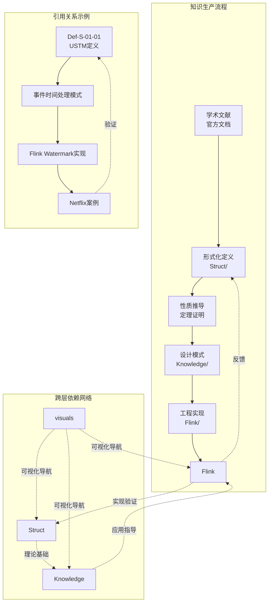

**依赖规则**：

1. **单向依赖原则**: Struct → Knowledge → Flink，避免循环依赖
2. **反馈验证机制**: Flink 工程实践反馈验证 Struct 理论
3. **可视化导航**: visuals/ 作为导航层，可引用所有层级

---

## 2. 文档生成架构

### 2.1 Markdown 处理流程

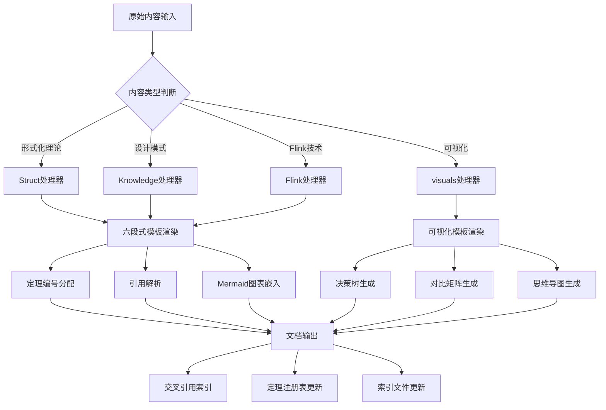

**处理阶段说明**：

| 阶段 | 功能 | 输出 |
|------|------|------|
| **内容解析** | 识别文档类型、提取元数据 | 文档对象树 |
| **模板渲染** | 应用六段式模板或可视化模板 | 结构化 Markdown |
| **编号分配** | 分配定理/定义/引理编号 | 全局唯一标识 |
| **引用解析** | 解析内部/外部引用 | 链接映射表 |
| **图表嵌入** | 生成 Mermaid 图表 | 可视化代码块 |
| **索引更新** | 更新注册表和索引 | THEOREM-REGISTRY.md |

### 2.2 Mermaid 图表渲染

**图表类型与使用场景**：

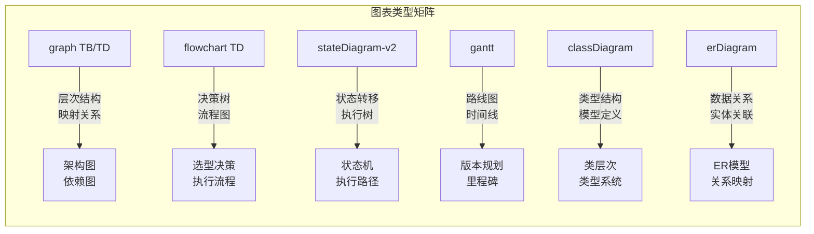

**图表渲染规范**：

```markdown
## 7. 可视化 (Visualizations)

### 7.1 层次结构图

以下图表展示了 XXX 的层次结构：

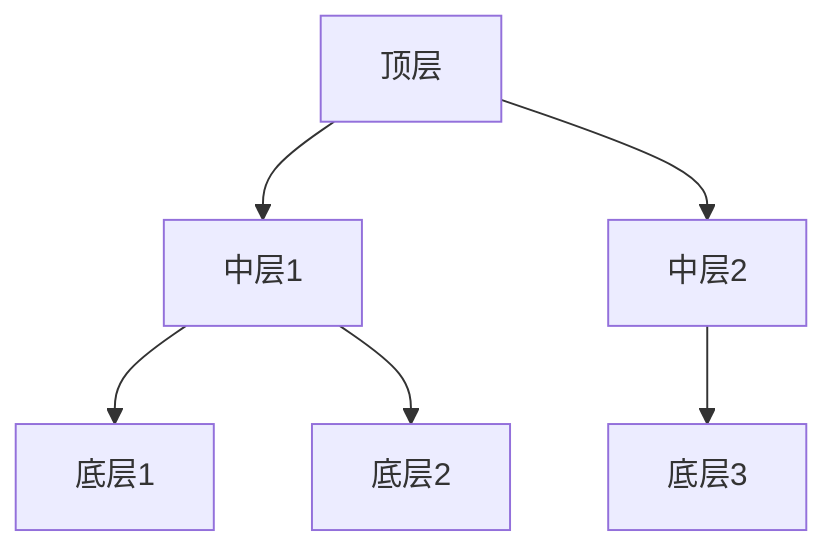

### 7.2 决策流程图

以下决策树帮助选择 XXX：

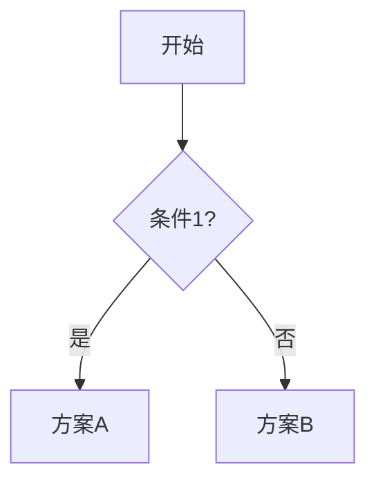

```

**渲染规则**：
1. 每个图表前必须有文字说明
2. 图表必须有明确的类型选择理由
3. 复杂图表需要图例说明
4. 图表语义必须与文字描述一致

### 2.3 交叉引用解析

**引用类型体系**：

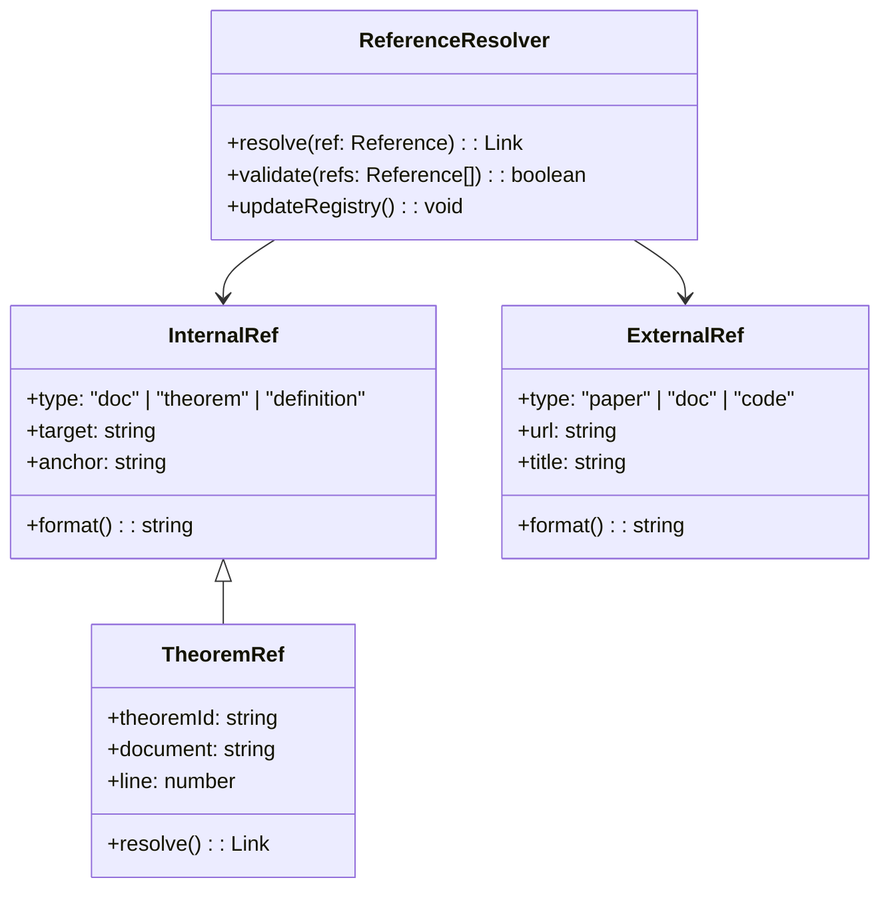

**引用格式规范**：

| 引用类型 | 格式示例 | 说明 |
|----------|----------|------|
| **内部文档** | `[文本](Struct/01-foundation/01.01-unified-streaming-theory.md)` | 相对路径链接 |
| **定理引用** | `Thm-S-01-01` | 全局定理编号 |
| **定义引用** | `Def-K-02-05` | 全局定义编号 |
| **外部论文** | `[^n]: 作者, "标题", 期刊, 年份` | 文末引用列表 |
| **官方文档** | `[^n]: Apache Flink, "标题", URL` | 权威来源优先 |

---

## 3. 验证系统架构

### 3.1 验证脚本架构

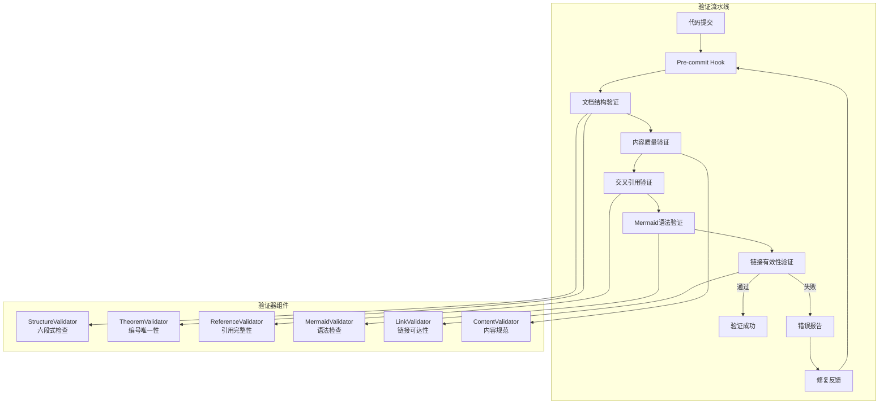

**验证器详细说明**：

| 验证器 | 职责 | 验证规则 |
|--------|------|----------|
| **StructureValidator** | 六段式结构检查 | 必须包含 8 个章节，顺序正确 |
| **TheoremValidator** | 定理编号唯一性 | 全局编号不冲突，格式正确 |
| **ReferenceValidator** | 引用完整性 | 内部链接有效，外部链接可访问 |
| **MermaidValidator** | Mermaid 语法检查 | 图表语法正确，可渲染 |
| **LinkValidator** | 链接有效性 | HTTP 200 响应，无死链 |
| **ContentValidator** | 内容规范 | 术语一致，格式统一 |

### 3.2 CI/CD 流程

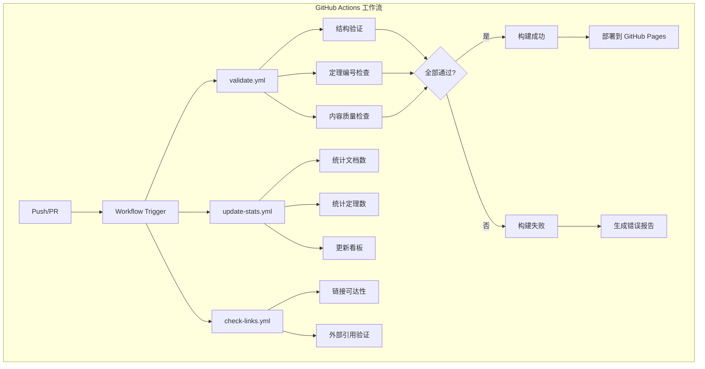

**工作流配置**（`.github/workflows/`）：

| 工作流文件 | 触发条件 | 职责 |
|------------|----------|------|
| `pr-quality-gate.yml` | Push, PR | 文档结构、定理编号、内容质量验证 |
| `scheduled-maintenance.yml` | 每日定时 | 统计更新、链接检查 |
| `doc-update-sync.yml` | Push to main | 文档同步、看板刷新 |

### 3.3 质量门禁

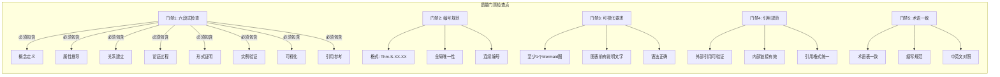

**质量门禁清单**：

```markdown
## 文档提交前检查清单

### 结构检查
- [ ] 包含全部 8 个章节
- [ ] 章节顺序正确
- [ ] 元数据头部完整

### 内容检查
- [ ] 至少 1 个形式化定义 (Def-*)
- [ ] 至少 1 个定理/引理/命题
- [ ] 至少 1 个代码/配置示例
- [ ] 至少 1 个 Mermaid 图表

### 引用检查
- [ ] 外部引用使用 `[^n]` 格式
- [ ] 内部引用使用相对路径
- [ ] 定理引用使用全局编号

### 编号检查
- [ ] 新定理编号全局唯一
- [ ] 编号格式符合规范
- [ ] THEOREM-REGISTRY.md 已更新
```

---

## 4. 存储架构

### 4.1 文件组织结构

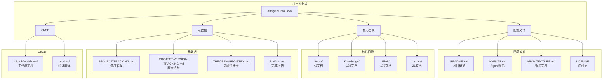

**文件命名规范**：

```
{层号}.{序号}-{主题关键词}.md

示例:
- 01.01-unified-streaming-theory.md    (Struct/01-foundation/)
- 02-design-patterns-overview.md        (Knowledge/02-design-patterns/)
- checkpoint-mechanism-deep-dive.md     (Flink/02-core-mechanisms/)
```

### 4.2 索引系统

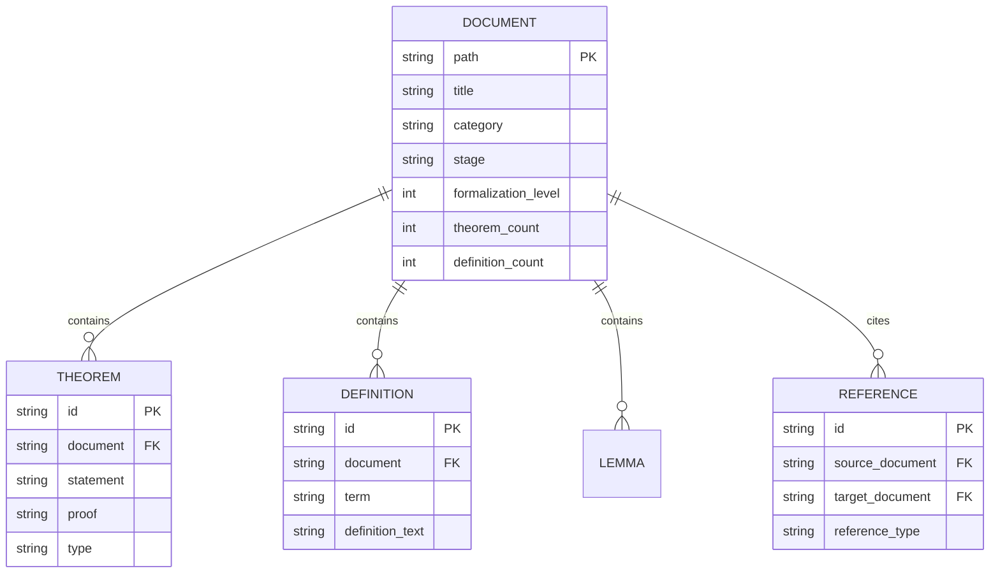

**索引文件体系**：

| 索引文件 | 职责 | 更新频率 |
|----------|------|----------|
| `THEOREM-REGISTRY.md` | 全项目定理/定义/引理注册表 | 每篇新文档 |
| `PROJECT-TRACKING.md` | 进度看板、任务状态 | 每次迭代 |
| `PROJECT-VERSION-TRACKING.md` | 版本历史、变更日志 | 每个版本 |
| `Struct/00-INDEX.md` | Struct 目录索引 | 每批新文档 |
| `Knowledge/00-INDEX.md` | Knowledge 目录索引 | 每批新文档 |
| `Flink/00-meta/00-INDEX.md` | Flink 目录索引 | 每批新文档 |
| `visuals/index-visual.md` | 可视化导航索引 | 新可视化 |

### 4.3 版本管理

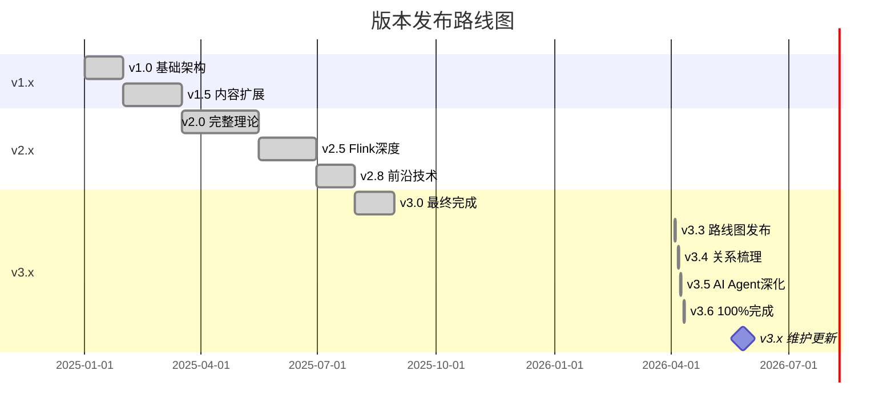

**版本管理策略**：

| 版本号 | 含义 | 更新内容 |
|--------|------|----------|
| **Major** (X.0) | 重大架构变更 | 目录结构调整、编号体系变更 |
| **Minor** (x.X) | 功能扩展 | 新增文档批次、新主题覆盖 |
| **Patch** (x.x.X) | 修复优化 | 错误修正、链接更新、格式优化 |

---

## 5. 扩展架构

### 5.1 添加新文档

```mermaid
flowchart TD
    subgraph "新文档添加流程"
        A[确定文档类型] --> B{选择目录}

        B -->|形式化理论| C[Struct/]
        B -->|设计模式| D[Knowledge/]
        B -->|Flink技术| E[Flink/]
        B -->|可视化| F[visuals/]

        C --> G[选择子目录<br/>01-08]
        D --> H[选择子目录<br/>01-09]
        E --> I[选择子目录<br/>01-15]
        F --> J[选择子目录<br/>decision-trees等]

        G & H & I & J --> K[分配序号]
        K --> L[创建文件<br/>{层号}.{序号}-{主题}.md]
        L --> M[应用六段式模板]
        M --> N[分配定理编号]
        N --> O[编写内容]
        O --> P[添加Mermaid图]
        P --> Q[验证并提交]
    end
```

**添加新文档步骤**：

```markdown
## 新文档创建清单

### 1. 前置检查
- [ ] 确认文档主题尚未覆盖
- [ ] 确认所属目录和子目录
- [ ] 查看同名或相似文档避免重复

### 2. 文件创建
- [ ] 按命名规范创建文件
- [ ] 复制六段式模板
- [ ] 填写元数据头部

### 3. 内容编写
- [ ] 编写概念定义（至少1个 Def-*）
- [ ] 推导性质（至少1个 Lemma/Prop）
- [ ] 建立关系（与其他文档的关联）
- [ ] 编写论证过程
- [ ] 完成形式证明/工程论证
- [ ] 添加实例验证
- [ ] 创建Mermaid图表
- [ ] 列出引用参考

### 4. 编号分配
- [ ] 在 THEOREM-REGISTRY.md 注册新编号
- [ ] 确保编号全局唯一
- [ ] 更新文档内所有编号引用

### 5. 索引更新
- [ ] 更新目录 00-INDEX.md
- [ ] 更新 PROJECT-TRACKING.md
- [ ] 更新相关文档的交叉引用

### 6. 验证提交
- [ ] 运行本地验证脚本
- [ ] 通过所有质量门禁
- [ ] 提交 PR 并通过 CI
```

### 5.2 添加新可视化

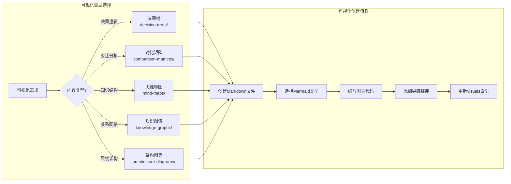

**可视化创建模板**：

```markdown
# {可视化标题}

> 类型: {decision-tree | matrix | mindmap | graph | architecture}
> 用途: {用途描述}
> 更新日期: YYYY-MM-DD

## 概述

{可视化目的和适用场景描述}

## 可视化

```{可视化类型}
{Mermaid图表代码}
```

## 使用指南

### 如何阅读

{阅读指南}

### 相关文档

- [相关文档1](Struct/00-INDEX.md)
- [相关文档2](Flink/00-meta/00-INDEX.md)

## 更新日志

| 日期 | 变更 |
|------|------|
| YYYY-MM-DD | 初始版本 |

```

### 5.3 添加新验证规则

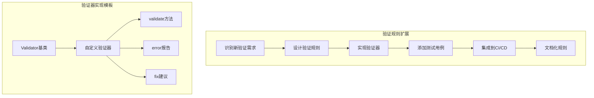

---

## 6. 项目完成里程碑

> **状态**: 100%完成 ✅ | **版本**: v3.6 | **日期**: 2026-04-11

### 完成统计

| 指标 | 数量 | 状态 |
|------|------|------|
| 核心文档 | 940+ 篇 | ✅ 完成 |
| 形式化元素 | 10,483+ | ✅ 完成 |
| Mermaid图表 | 1,600+ | ✅ 完成 |
| 代码示例 | 4,500+ | ✅ 完成 |
| 项目大小 | 25+ MB | ✅ 完成 |

### 各层完成状态

| 层级 | 文档数 | 定理/定义数 | 状态 |
|------|--------|-------------|------|
| Struct/ | 43 | 380定理/835定义 | ✅ 100% |
| Knowledge/ | 134 | 65定理/139定义 | ✅ 100% |
| Flink/ | 178 | 681定理/1840定义 | ✅ 100% |
| visuals/ | 21 | 1,600+图表 | ✅ 100% |

### 关键完成报告

- [100-PERCENT-COMPLETION-FINAL-REPORT.md](./100-PERCENT-COMPLETION-FINAL-REPORT.md) - 最终完成报告
- [FLINK-24-25-30-COMPLETION-REPORT.md](./archive/completion-reports/FLINK-24-25-30-COMPLETION-REPORT.md) - Flink路线图完成报告
- [cross-ref-fix-report.md](./cross-ref-fix-report.md) - 交叉引用修复报告
- [COQ-COMPILATION-REPORT.md](./reconstruction/phase4-verification/COQ-COMPILATION-REPORT.md) - Coq验证报告
- [TLA-MODEL-CHECK-REPORT.md](./reconstruction/phase4-verification/TLA-MODEL-CHECK-REPORT.md) - TLA+验证报告

---

## 使用指南

### 如何阅读

1. **按架构层次阅读**: 从 Struct/ → Knowledge/ → Flink/ 逐步深入
2. **按主题阅读**: 通过 visuals/ 决策树选择感兴趣的主题
3. **按问题阅读**: 通过 NAVIGATION-INDEX.md 查找特定问题的解答

### 相关文档

- [AGENTS.md](AGENTS.md) - Agent 工作上下文规范
- [PROJECT-TRACKING.md](PROJECT-TRACKING.md) - 项目进度跟踪
- [THEOREM-REGISTRY.md](THEOREM-REGISTRY.md) - 定理注册表
- [README.md](README.md) - 项目概览
- [100-PERCENT-COMPLETION-FINAL-REPORT.md](100-PERCENT-COMPLETION-FINAL-REPORT.md) - 项目完成报告

---

## 更新日志

| 日期 | 版本 | 变更 |
|------|------|------|
| 2026-04-03 | v1.0 | 初始版本 |
| 2026-04-11 | v1.1 | 更新为100%完成状态，添加v3.6里程碑 |

---

## 附录

### A. 术语表

| 术语 | 英文 | 说明 |
|------|------|------|
| 六段式 | Six-Section Template | 文档标准结构模板 |
| USTM | Unified Streaming Theory Model | 统一流计算理论模型 |
| Def-* | Definition | 形式化定义编号前缀 |
| Thm-* | Theorem | 定理编号前缀 |
| Lemma-* | Lemma | 引理编号前缀 |
| Prop-* | Proposition | 命题编号前缀 |
| Cor-* | Corollary | 推论编号前缀 |

### B. 目录映射表

| 目录代码 | 完整路径 | 用途 | 文档数 | 状态 |
|----------|----------|------|--------|------|
| S | Struct/ | 形式理论 | 43 | ✅ 完成 |
| K | Knowledge/ | 知识应用 | 134 | ✅ 完成 |
| F | Flink/ | 工程实现 | 178 | ✅ 完成 |
| V | visuals/ | 可视化导航 | 21 | ✅ 完成 |

### C. 相关文档

- [AGENTS.md](AGENTS.md) - Agent 工作上下文规范
- [PROJECT-TRACKING.md](PROJECT-TRACKING.md) - 项目进度跟踪
- [THEOREM-REGISTRY.md](THEOREM-REGISTRY.md) - 定理注册表
- [README.md](README.md) - 项目概览
- [CHANGELOG.md](CHANGELOG.md) - 版本变更记录

---

*本文档由 AnalysisDataFlow 架构组维护，最后更新: 2026-04-11 | 版本: v1.1 | 状态: 100%完成 ✅*
