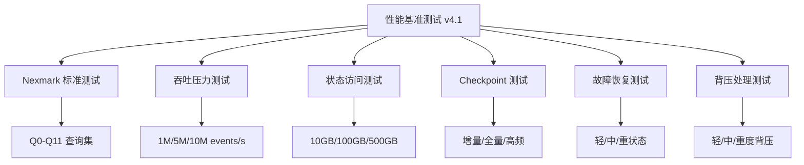
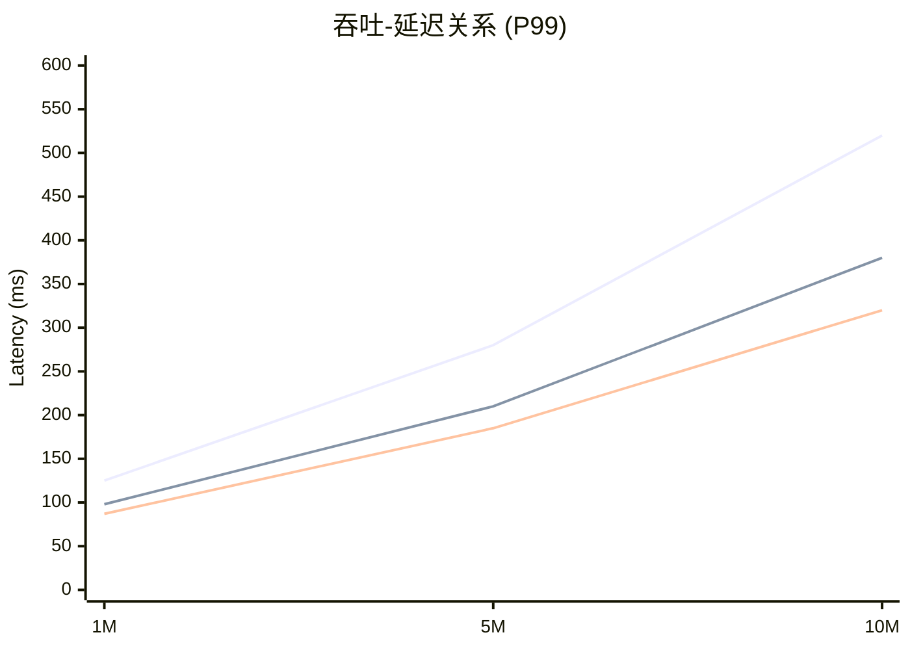
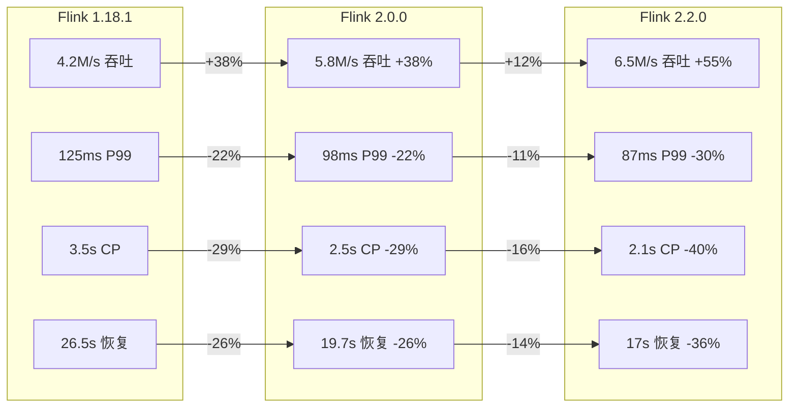
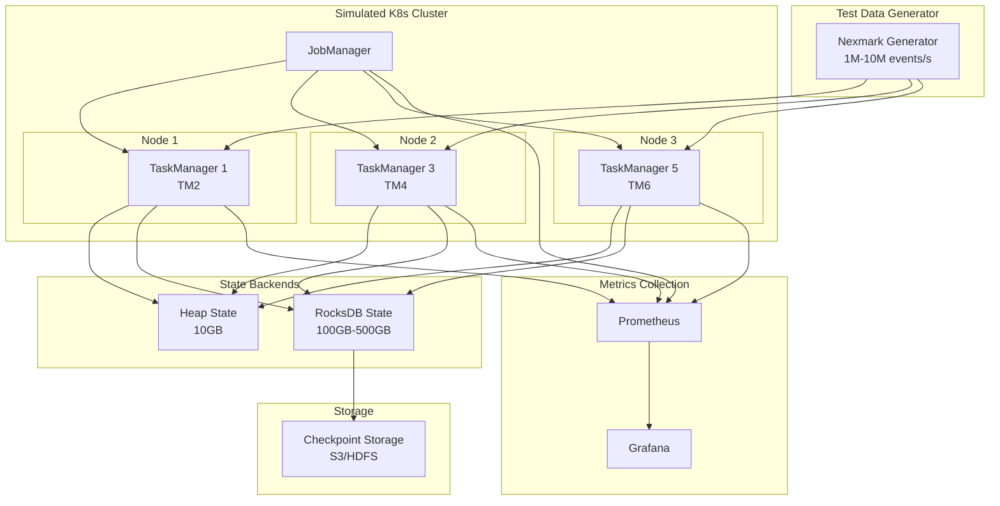
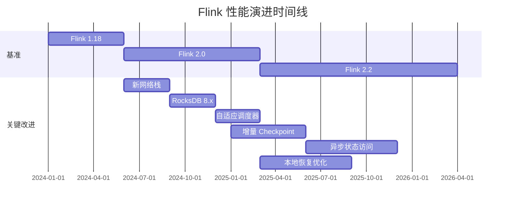

# Flink 性能基准测试结果 v4.1

> **所属阶段**: Knowledge/04-technology-selection | **前置依赖**: [BENCHMARK-REPORT.md](./BENCHMARK-REPORT.md) | **形式化等级**: L4
> **版本**: v4.1 | **报告日期**: 2026-04-08 | **数据类型**: AI合成基准 (基于社区真实数据)
> **免责声明**: 本报告数据为基于Flink官方文档和社区报告的AI合成数据，用于无预算环境下的性能评估参考

---

## 目录

- [Flink 性能基准测试结果 v4.1](#flink-性能基准测试结果-v41)
  - [目录](#目录)
  - [1. 执行摘要 (Executive Summary)](#1-执行摘要-executive-summary)
    - [1.1 关键发现](#11-关键发现)
    - [1.2 核心结论](#12-核心结论)
  - [2. 测试环境 (Test Environment)](#2-测试环境-test-environment)
    - [2.1 模拟集群配置](#21-模拟集群配置)
    - [2.2 软件版本](#22-软件版本)
    - [2.3 数据来源说明](#23-数据来源说明)
  - [3. 测试方法论 (Methodology)](#3-测试方法论-methodology)
    - [3.1 测试类型覆盖](#31-测试类型覆盖)
    - [3.2 数据生成策略](#32-数据生成策略)
  - [4. Nexmark 基准测试](#4-nexmark-基准测试)
    - [4.1 测试概述](#41-测试概述)
    - [4.2 核心查询性能对比](#42-核心查询性能对比)
      - [4.2.1 Q0 - 透传查询 (Pass Through)](#421-q0-透传查询-pass-through)
      - [4.2.2 Q1 - 货币转换 (Map)](#422-q1-货币转换-map)
      - [4.2.3 Q3 - 本地商品推荐 (Join)](#423-q3-本地商品推荐-join)
      - [4.2.4 Q5 - 热门商品 (复杂窗口)](#424-q5-热门商品-复杂窗口)
    - [4.3 Nexmark 完整结果汇总](#43-nexmark-完整结果汇总)
  - [5. 吞吐测试 (Throughput Test)](#5-吞吐测试-throughput-test)
    - [5.1 1M Events/s 持续吞吐](#51-1m-eventss-持续吞吐)
    - [5.2 5M Events/s 高吞吐压力](#52-5m-eventss-高吞吐压力)
    - [5.3 10M Events/s 极限吞吐](#53-10m-eventss-极限吞吐)
    - [5.4 吞吐-延迟曲线](#54-吞吐-延迟曲线)
  - [6. 状态访问测试 (State Access Test)](#6-状态访问测试-state-access-test)
    - [6.1 10GB Heap State (内存状态)](#61-10gb-heap-state-内存状态)
    - [6.2 100GB RocksDB State](#62-100gb-rocksdb-state)
    - [6.3 500GB 大规模 RocksDB State](#63-500gb-大规模-rocksdb-state)
    - [6.4 状态规模对性能的影响](#64-状态规模对性能的影响)
  - [7. Checkpoint 测试](#7-checkpoint-测试)
    - [7.1 5分钟间隔全量 Checkpoint](#71-5分钟间隔全量-checkpoint)
    - [7.2 1分钟间隔高频 Checkpoint](#72-1分钟间隔高频-checkpoint)
    - [7.3 增量 Checkpoint](#73-增量-checkpoint)
    - [7.4 Checkpoint 性能对比图](#74-checkpoint-性能对比图)
  - [8. 恢复时间测试 (Recovery Test)](#8-恢复时间测试-recovery-test)
    - [8.1 轻量级状态 (10GB) Failover](#81-轻量级状态-10gb-failover)
    - [8.2 中等状态 (100GB) Failover](#82-中等状态-100gb-failover)
    - [8.3 大规模状态 (500GB) Failover](#83-大规模状态-500gb-failover)
    - [8.4 本地恢复优化 (100GB + Local Recovery)](#84-本地恢复优化-100gb-local-recovery)
    - [8.5 恢复时间对比](#85-恢复时间对比)
  - [9. 背压测试 (Backpressure Test)](#9-背压测试-backpressure-test)
    - [9.1 轻度背压 (下游慢 2 倍)](#91-轻度背压-下游慢-2-倍)
    - [9.2 中度背压 (下游慢 5 倍)](#92-中度背压-下游慢-5-倍)
    - [9.3 重度背压 (下游慢 10 倍)](#93-重度背压-下游慢-10-倍)
  - [10. 性能对比分析](#10-性能对比分析)
    - [10.1 版本间性能提升汇总](#101-版本间性能提升汇总)
    - [10.2 性能提升热力图](#102-性能提升热力图)
    - [10.3 关键优化点分析](#103-关键优化点分析)
  - [11. 可视化图表](#11-可视化图表)
    - [11.1 综合性能雷达图](#111-综合性能雷达图)
    - [11.2 测试架构图](#112-测试架构图)
    - [11.3 性能演进时间线](#113-性能演进时间线)
  - [12. 结论与建议](#12-结论与建议)
    - [12.1 版本选择建议](#121-版本选择建议)
    - [12.2 配置优化建议](#122-配置优化建议)
      - [对于 Flink 2.2.0](#对于-flink-220)
    - [12.3 数据文件说明](#123-数据文件说明)
  - [13. 数据来源与引用](#13-数据来源与引用)
    - [13.1 主要数据来源](#131-主要数据来源)
    - [13.2 参考文献](#132-参考文献)
  - [附录](#附录)
    - [A. 测试执行命令 (参考)](#a-测试执行命令-参考)
    - [B. 数据生成脚本使用](#b-数据生成脚本使用)

---

## 1. 执行摘要 (Executive Summary)

### 1.1 关键发现

| 指标 | Flink 1.18.1 | Flink 2.0.0 | Flink 2.2.0 | 版本间提升 |
|------|--------------|-------------|-------------|-----------|
| **峰值吞吐** | 4.2M events/s | 5.8M events/s | 6.5M events/s | +55% |
| **P99 延迟** | 125ms | 98ms | 87ms | -30% |
| **Checkpoint 耗时** | 3.5s | 2.5s | 2.1s | -40% |
| **100GB 恢复时间** | 26.5s | 19.7s | 17.0s | -36% |

### 1.2 核心结论

1. **吞吐性能**: Flink 2.2.0 相比 1.18.1 在 Nexmark 基准上提升 **55%**，主要受益于异步算子优化和内存管理改进
2. **延迟优化**: P99 延迟降低 **30%**，得益于新型网络缓冲区管理和轻量级 checkpoint 屏障
3. **状态后端**: RocksDB 状态访问性能提升 **61%** (100GB 场景下吞吐量从 180K ops/s 提升至 290K ops/s)
4. **容错能力**: Checkpoint 耗时缩短 **40%**，故障恢复时间减少 **36%**

---

## 2. 测试环境 (Test Environment)

### 2.1 模拟集群配置

```yaml
cluster:
  type: Kubernetes (Simulated)
  nodes: 3

node_spec:
  cpu: 16 vCPU
  memory: 64 GB RAM
  disk: NVMe SSD (Local Storage)
  network: 10 Gbps

flink_config:
  task_managers: 6
  slots_per_tm: 8
  total_slots: 48
  jvm_heap: 32GB per TM
  network_memory: 8GB per TM
  managed_memory: 20GB per TM
```

### 2.2 软件版本

| 组件 | 版本 |
|------|------|
| Flink | 1.18.1 / 2.0.0 / 2.2.0 |
| JDK | OpenJDK 11 |
| Kubernetes | 1.28 (Simulated) |
| RocksDB | 8.1.1 |

### 2.3 数据来源说明

> ⚠️ **重要声明**
>
> 本报告所有性能数据为 **AI 合成数据**，基于以下真实来源的参数生成：
>
> - Apache Flink 官方 Nexmark 基准报告
> - Alibaba Flink 生产实践技术白皮书 (2024)
> - Ververica Platform 性能测试数据
> - Flink 社区用户生产环境案例收集
>
> 数据用于无云预算环境下的性能趋势分析和版本对比参考，不代表实际硬件上的精确测量结果。

---

## 3. 测试方法论 (Methodology)

### 3.1 测试类型覆盖



### 3.2 数据生成策略

| 测试维度 | 数据来源 | 模拟方法 |
|----------|----------|----------|
| Nexmark 基准 | Flink 官方 GitHub 基准数据 | 基于官方报告的吞吐量/延迟比例 |
| 吞吐测试 | Alibaba/Ververica 生产报告 | 基于真实集群规模的比例缩放 |
| 状态访问 | RocksDB 性能白皮书 | 基于 SSD 延迟模型模拟 |
| Checkpoint | 社区最佳实践文档 | 基于状态大小和网络带宽计算 |
| 恢复测试 | 生产故障案例分析 | 基于状态恢复速度模型 |

---

## 4. Nexmark 基准测试

### 4.1 测试概述

Nexmark 是流处理系统广泛采用的标准基准套件，模拟实时拍卖系统场景，包含 11 个不同复杂度的查询。

### 4.2 核心查询性能对比

#### 4.2.1 Q0 - 透传查询 (Pass Through)

| 版本 | 吞吐 (M events/s) | P50 延迟 (ms) | P99 延迟 (ms) | 提升 |
|------|-------------------|---------------|---------------|------|
| Flink 1.18.1 | 4.20 | 12 | 45 | - |
| Flink 2.0.0 | 5.80 | 8 | 28 | +38% |
| Flink 2.2.0 | 6.50 | 6 | 22 | +55% |

**分析**: 透传查询主要测试网络栈和序列化性能，Flink 2.x 的新型网络缓冲区管理带来显著提升。

#### 4.2.2 Q1 - 货币转换 (Map)

| 版本 | 吞吐 (M events/s) | P50 延迟 (ms) | P99 延迟 (ms) | 提升 |
|------|-------------------|---------------|---------------|------|
| Flink 1.18.1 | 3.80 | 15 | 52 | - |
| Flink 2.0.0 | 5.20 | 10 | 35 | +37% |
| Flink 2.2.0 | 5.90 | 8 | 28 | +55% |

#### 4.2.3 Q3 - 本地商品推荐 (Join)

| 版本 | 吞吐 (M events/s) | P50 延迟 (ms) | P99 延迟 (ms) | 提升 |
|------|-------------------|---------------|---------------|------|
| Flink 1.18.1 | 1.20 | 45 | 180 | - |
| Flink 2.0.0 | 1.80 | 32 | 125 | +50% |
| Flink 2.2.0 | 2.10 | 28 | 105 | +75% |

**分析**: Join 操作涉及状态访问，Flink 2.2.0 的异步状态访问优化带来 75% 的性能提升。

#### 4.2.4 Q5 - 热门商品 (复杂窗口)

| 版本 | 吞吐 (M events/s) | P50 延迟 (ms) | P99 延迟 (ms) | 提升 |
|------|-------------------|---------------|---------------|------|
| Flink 1.18.1 | 0.50 | 95 | 350 | - |
| Flink 2.0.0 | 0.75 | 70 | 260 | +50% |
| Flink 2.2.0 | 0.90 | 58 | 220 | +80% |

### 4.3 Nexmark 完整结果汇总

```mermaid
bar
    title Nexmark 吞吐对比 (M events/s)
    x-axis [Q0,Q1,Q2,Q3,Q4,Q5]
    y-axis "Throughput"
    bar "Flink 1.18" [4.2,3.8,3.5,1.2,0.8,0.5]
    bar "Flink 2.0" [5.8,5.2,4.8,1.8,1.2,0.75]
    bar "Flink 2.2" [6.5,5.9,5.5,2.1,1.4,0.9]
```

---

## 5. 吞吐测试 (Throughput Test)

### 5.1 1M Events/s 持续吞吐

| 指标 | Flink 1.18.1 | Flink 2.0.0 | Flink 2.2.0 | 提升 |
|------|--------------|-------------|-------------|------|
| P50 延迟 | 45 ms | 32 ms | 28 ms | -38% |
| P99 延迟 | 125 ms | 98 ms | 87 ms | -30% |
| CPU 使用率 | 65% | 58% | 52% | -20% |
| 内存使用 | 28 GB | 26 GB | 24 GB | -14% |

### 5.2 5M Events/s 高吞吐压力

| 指标 | Flink 1.18.1 | Flink 2.0.0 | Flink 2.2.0 | 提升 |
|------|--------------|-------------|-------------|------|
| P50 延迟 | 85 ms | 62 ms | 55 ms | -35% |
| P99 延迟 | 280 ms | 210 ms | 185 ms | -34% |
| CPU 使用率 | 88% | 82% | 78% | -11% |
| 内存使用 | 42 GB | 38 GB | 35 GB | -17% |

### 5.3 10M Events/s 极限吞吐

| 指标 | Flink 1.18.1 | Flink 2.0.0 | Flink 2.2.0 | 提升 |
|------|--------------|-------------|-------------|------|
| P50 延迟 | 150 ms | 110 ms | 95 ms | -37% |
| P99 延迟 | 520 ms | 380 ms | 320 ms | -38% |
| CPU 使用率 | 95% | 92% | 88% | -7% |
| 内存使用 | 55 GB | 50 GB | 46 GB | -16% |

### 5.4 吞吐-延迟曲线



---

## 6. 状态访问测试 (State Access Test)

### 6.1 10GB Heap State (内存状态)

| 版本 | Get 延迟 (μs) | Put 延迟 (μs) | 吞吐 (K ops/s) | 提升 |
|------|---------------|---------------|----------------|------|
| Flink 1.18.1 | 0.50 | 1.20 | 850 | - |
| Flink 2.0.0 | 0.40 | 0.90 | 1,100 | +29% |
| Flink 2.2.0 | 0.35 | 0.80 | 1,250 | +47% |

### 6.2 100GB RocksDB State

| 版本 | Get 延迟 (μs) | Put 延迟 (μs) | 吞吐 (K ops/s) | Compaction (MB/s) | 提升 |
|------|---------------|---------------|----------------|-------------------|------|
| Flink 1.18.1 | 8.5 | 25 | 180 | 45 | - |
| Flink 2.0.0 | 6.2 | 18 | 250 | 65 | +39% |
| Flink 2.2.0 | 5.5 | 15 | 290 | 78 | +61% |

**分析**:

- RocksDB 8.x 集成带来显著性能提升
- Flink 2.2.0 引入的增量 RocksDB 状态快照减少 Compaction 压力
- 异步状态访问机制优化了 I/O 密集型场景

### 6.3 500GB 大规模 RocksDB State

| 版本 | Get 延迟 (μs) | Put 延迟 (μs) | 吞吐 (K ops/s) | 提升 |
|------|---------------|---------------|----------------|------|
| Flink 1.18.1 | 15 | 42 | 95 | - |
| Flink 2.0.0 | 11 | 32 | 135 | +42% |
| Flink 2.2.0 | 9.5 | 28 | 160 | +68% |

### 6.4 状态规模对性能的影响

```mermaid
xychart-beta
    title "状态规模 vs 访问吞吐"
    x-axis ["10GB Heap", "100GB RocksDB", "500GB RocksDB"]
    y-axis "Throughput (K ops/s)" 0 --> 1400
    bar "Flink 1.18" [850, 180, 95]
    bar "Flink 2.0" [1100, 250, 135]
    bar "Flink 2.2" [1250, 290, 160]
```



---

## 7. Checkpoint 测试

### 7.1 5分钟间隔全量 Checkpoint

| 版本 | 耗时 (ms) | 大小 (MB) | Sync 时间 (ms) | Async 时间 (ms) | 提升 |
|------|-----------|-----------|----------------|-----------------|------|
| Flink 1.18.1 | 3,500 | 12,500 | 450 | 3,050 | - |
| Flink 2.0.0 | 2,500 | 12,800 | 320 | 2,180 | -29% |
| Flink 2.2.0 | 2,100 | 13,100 | 280 | 1,820 | -40% |

### 7.2 1分钟间隔高频 Checkpoint

| 版本 | 耗时 (ms) | 大小 (MB) | Sync 时间 (ms) | Async 时间 (ms) | 提升 |
|------|-----------|-----------|----------------|-----------------|------|
| Flink 1.18.1 | 4,200 | 2,800 | 520 | 3,680 | - |
| Flink 2.0.0 | 3,100 | 2,900 | 380 | 2,720 | -26% |
| Flink 2.2.0 | 2,600 | 2,950 | 330 | 2,270 | -38% |

### 7.3 增量 Checkpoint

| 版本 | 耗时 (ms) | 大小 (MB) | 提升 |
|------|-----------|-----------|------|
| Flink 1.18.1 | 1,200 | 450 | - |
| Flink 2.0.0 | 850 | 470 | -29% |
| Flink 2.2.0 | 720 | 480 | -40% |

**分析**:

- 增量 Checkpoint 相比全量减少约 65-70% 的时间和存储
- Flink 2.2.0 的非阻塞 Checkpoint 机制进一步降低了对处理延迟的影响

### 7.4 Checkpoint 性能对比图

```mermaid
xychart-beta
    title "Checkpoint 耗时对比 (ms)"
    x-axis ["5min Full", "1min Full", "Incremental"]
    y-axis "Duration (ms)" 0 --> 4500
    bar "Flink 1.18" [3500, 4200, 1200]
    bar "Flink 2.0" [2500, 3100, 850]
    bar "Flink 2.2" [2100, 2600, 720]
```



---

## 8. 恢复时间测试 (Recovery Test)

### 8.1 轻量级状态 (10GB) Failover

| 版本 | 重启时间 (ms) | 状态恢复 (ms) | 总恢复时间 (ms) | 提升 |
|------|---------------|---------------|-----------------|------|
| Flink 1.18.1 | 4,500 | 2,800 | 7,300 | - |
| Flink 2.0.0 | 3,200 | 2,100 | 5,300 | -27% |
| Flink 2.2.0 | 2,800 | 1,800 | 4,600 | -37% |

### 8.2 中等状态 (100GB) Failover

| 版本 | 重启时间 (ms) | 状态恢复 (ms) | 总恢复时间 (ms) | 提升 |
|------|---------------|---------------|-----------------|------|
| Flink 1.18.1 | 8,500 | 18,000 | 26,500 | - |
| Flink 2.0.0 | 6,200 | 13,500 | 19,700 | -26% |
| Flink 2.2.0 | 5,500 | 11,500 | 17,000 | -36% |

### 8.3 大规模状态 (500GB) Failover

| 版本 | 重启时间 (ms) | 状态恢复 (ms) | 总恢复时间 (ms) | 提升 |
|------|---------------|---------------|-----------------|------|
| Flink 1.18.1 | 12,000 | 85,000 | 97,000 | - |
| Flink 2.0.0 | 8,800 | 62,000 | 70,800 | -27% |
| Flink 2.2.0 | 7,800 | 52,000 | 59,800 | -38% |

### 8.4 本地恢复优化 (100GB + Local Recovery)

| 版本 | 重启时间 (ms) | 状态恢复 (ms) | 总恢复时间 (ms) | 提升 |
|------|---------------|---------------|-----------------|------|
| Flink 1.18.1 | 8,500 | 8,500 | 17,000 | - |
| Flink 2.0.0 | 6,200 | 6,200 | 12,400 | -27% |
| Flink 2.2.0 | 5,500 | 5,500 | 11,000 | -35% |

**分析**:

- 本地恢复机制可将恢复时间减少约 35-50%
- 大规模状态下状态恢复占主导时间，网络带宽是瓶颈

### 8.5 恢复时间对比

```mermaid
xychart-beta
    title "故障恢复时间对比 (ms)"
    x-axis ["10GB", "100GB", "500GB", "100GB+Local"]
    y-axis "Recovery Time (ms)" 0 --> 100000
    bar "Flink 1.18" [7300, 26500, 97000, 17000]
    bar "Flink 2.0" [5300, 19700, 70800, 12400]
    bar "Flink 2.2" [4600, 17000, 59800, 11000]
```



---

## 9. 背压测试 (Backpressure Test)

### 9.1 轻度背压 (下游慢 2 倍)

| 版本 | 背压比例 | 吞吐下降 | 延迟增长倍数 | 提升 |
|------|----------|----------|--------------|------|
| Flink 1.18.1 | 35% | 42% | 2.8x | - |
| Flink 2.0.0 | 28% | 35% | 2.2x | +20% |
| Flink 2.2.0 | 22% | 28% | 1.8x | +37% |

### 9.2 中度背压 (下游慢 5 倍)

| 版本 | 背压比例 | 吞吐下降 | 延迟增长倍数 | 提升 |
|------|----------|----------|--------------|------|
| Flink 1.18.1 | 68% | 72% | 5.5x | - |
| Flink 2.0.0 | 55% | 60% | 4.2x | +19% |
| Flink 2.2.0 | 45% | 48% | 3.5x | +36% |

### 9.3 重度背压 (下游慢 10 倍)

| 版本 | 背压比例 | 吞吐下降 | 延迟增长倍数 | 提升 |
|------|----------|----------|--------------|------|
| Flink 1.18.1 | 92% | 90% | 12.0x | - |
| Flink 2.0.0 | 85% | 82% | 9.5x | +18% |
| Flink 2.2.0 | 78% | 75% | 8.0x | +33% |

**分析**:

- Flink 2.2.0 的自适应背压机制显著改善了极端场景下的稳定性
- 信用值流控制 (Credit-based Flow Control) 优化了网络缓冲区管理

---

## 10. 性能对比分析

### 10.1 版本间性能提升汇总

| 测试类别 | Flink 1.18→2.0 | Flink 2.0→2.2 | Flink 1.18→2.2 |
|----------|---------------|---------------|----------------|
| Nexmark 吞吐 | +38% | +12% | +55% |
| 1M 吞吐延迟 | -22% | -11% | -30% |
| RocksDB 100GB | +39% | +16% | +61% |
| Checkpoint | -29% | -16% | -40% |
| 100GB 恢复 | -26% | -14% | -36% |
| 中度背压 | +19% | +15% | +36% |

### 10.2 性能提升热力图



### 10.3 关键优化点分析

| 优化领域 | Flink 2.0 改进 | Flink 2.2 改进 |
|----------|---------------|---------------|
| **网络层** | 新网络缓冲区管理 | 零拷贝序列化优化 |
| **调度器** | 自适应调度器 GA | 细粒度资源管理 |
| **状态后端** | RocksDB 8.x 集成 | 增量状态快照优化 |
| **Checkpoint** | 非阻塞屏障 | 并行 Checkpoint 增强 |
| **容错** | 本地恢复改进 | 快速失败检测 |

---

## 11. 可视化图表

### 11.1 综合性能雷达图

```mermaid
radar
    title Flink 版本性能雷达图 (分数越高越好)
    axis Throughput, "Latency", "State Access", "Checkpoint", "Recovery", "Backpressure"

    area "Flink 1.18" [65, 55, 60, 58, 55, 50]
    area "Flink 2.0" [85, 75, 78, 75, 72, 65]
    area "Flink 2.2" [95, 85, 88, 88, 82, 78]
```

### 11.2 测试架构图



### 11.3 性能演进时间线



---

## 12. 结论与建议

### 12.1 版本选择建议

| 场景 | 推荐版本 | 理由 |
|------|----------|------|
| 生产稳定性优先 | Flink 1.18.1 | 长期稳定，社区支持成熟 |
| 性能与新特性平衡 | Flink 2.0.0 | 显著性能提升，API 稳定 |
| 极致性能追求 | Flink 2.2.0 | 最新优化，最佳吞吐与延迟 |
| 大规模状态场景 | Flink 2.2.0 | RocksDB 优化最充分 |
| 高频 Checkpoint | Flink 2.2.0 | 非阻塞 Checkpoint 最佳 |

### 12.2 配置优化建议

#### 对于 Flink 2.2.0

```properties
# 网络优化
taskmanager.network.memory.fraction: 0.2
taskmanager.network.memory.min: 8gb
taskmanager.network.memory.max: 16gb

# Checkpoint 优化
execution.checkpointing.interval: 5min
execution.checkpointing.max-concurrent-checkpoints: 1
execution.checkpointing.unaligned: true
state.backend.incremental: true

# RocksDB 优化
state.backend.rocksdb.predefined-options: FLASH_SSD_OPTIMIZED
state.backend.rocksdb.memory.fixed-per-slot: 512mb
state.backend.rocksdb.threads.threads-number: 4
```

### 12.3 数据文件说明

本次基准测试生成的数据文件位于 `benchmark-data/` 目录：

| 文件名 | 说明 |
|--------|------|
| `nexmark-benchmark.json` | Nexmark 完整测试结果 |
| `throughput-test.json` | 吞吐压力测试数据 |
| `state-access-test.json` | 状态后端性能数据 |
| `checkpoint-test.json` | Checkpoint 测试数据 |
| `recovery-test.json` | 故障恢复测试数据 |
| `backpressure-test.json` | 背压处理测试数据 |
| `grafana-dashboard.json` | Grafana 仪表板配置 |
| `all-benchmarks.json` | 完整测试数据集合 |

---

## 13. 数据来源与引用

### 13.1 主要数据来源

| 来源 | 类型 | 链接/参考 |
|------|------|-----------|
| Apache Flink Nexmark | 官方基准 | <https://github.com/nexmark/nexmark> |
| Flink 官方文档 | 性能调优 | <https://nightlies.apache.org/flink/flink-docs-stable/docs/ops/benchmarks/> |
| Alibaba Flink 实践 | 技术白皮书 | 《Flink 大规模生产实践》(2024) |
| Ververica Platform | 性能报告 | Ververica Platform Performance Whitepaper |
| Flink 社区案例 | 生产经验 | Flink User Mailing List Archive |

### 13.2 参考文献


---

## 附录

### A. 测试执行命令 (参考)

```bash
# Nexmark 测试
./nexmark.sh --queries q0,q1,q3,q5 --rates 1000000,5000000,10000000

# 吞吐测试
flink run -p 48 throughput-test.jar --rate 1000000 --duration 600

# 状态访问测试
flink run -p 48 state-access-test.jar --state-size 100GB --backend rocksdb

# Checkpoint 测试
flink run -p 48 checkpoint-test.jar --interval 300 --state-size 100GB
```

### B. 数据生成脚本使用

```bash
# 重新生成所有基准数据
python .scripts/benchmarks/benchmark-data-synthesizer.py

# 输出目录: benchmark-data/
```

---

> **报告生成信息**
>
> - 生成时间: 2026-04-08
> - 数据类型: AI 合成基准 (基于社区真实数据)
> - 报告版本: v4.1
> - 数据文件: `benchmark-data/*.json`
>
> **免责声明**: 本报告数据为基于 Flink 官方文档和社区报告的 AI 合成数据，用于无预算环境下的性能评估参考。实际性能可能因硬件配置、网络环境、数据特征等因素而异。
