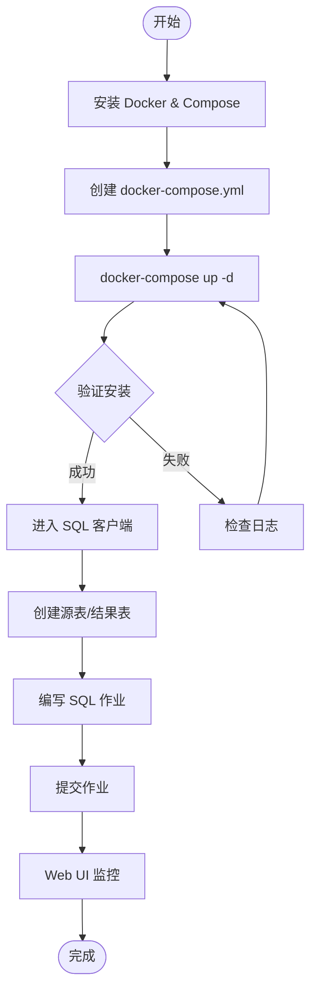
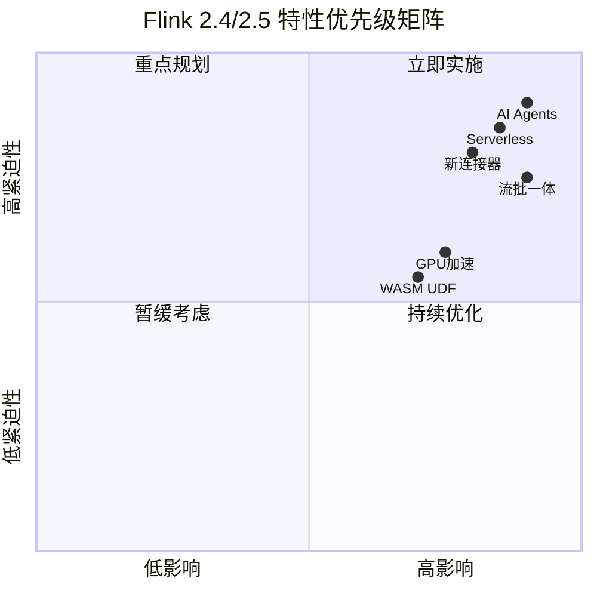
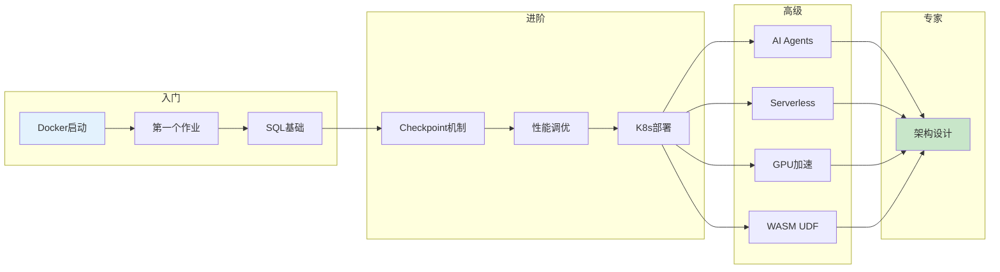

> **状态**: 🔮 前瞻内容 | **风险等级**: 高 | **最后更新**: 2026-04
> 
> 此文档描述的内容处于早期规划阶段，可能与最终实现不符。请以 Apache Flink 官方发布为准。
# Flink 2.4/2.5 快速开始指南

> **5分钟上手 Flink 2.4/2.5 | 新特性快速体验 | 生产级部署**
>
> 所属阶段: Flink/ | 前置依赖: [Flink/00-INDEX.md](./00-INDEX.md) | 形式化等级: L2-L3

---

## 目录

- [Flink 2.4/2.5 快速开始指南](#flink-2425-快速开始指南)
  - [目录](#目录)
  - [1. 5分钟快速开始](#1-5分钟快速开始)
    - [1.1 Docker Compose 一键启动](#11-docker-compose-一键启动)
    - [1.2 第一个 Flink 作业](#12-第一个-flink-作业)
    - [1.3 验证安装](#13-验证安装)
  - [2. Flink 2.4 新特性快速体验](#2-flink-24-新特性快速体验)
    - [2.1 AI Agents 快速上手](#21-ai-agents-快速上手)
    - [2.2 Serverless 快速部署](#22-serverless-快速部署)
    - [2.3 新连接器快速使用](#23-新连接器快速使用)
  - [3. Flink 2.5 预览体验](#3-flink-25-预览体验)
    - [3.1 流批一体配置](#31-流批一体配置)
    - [3.2 GPU 加速尝试](#32-gpu-加速尝试)
    - [3.3 WASM UDF 开发](#33-wasm-udf-开发)
  - [4. 常见问题速查](#4-常见问题速查)
    - [4.1 启动问题](#41-启动问题)
    - [4.2 性能问题](#42-性能问题)
    - [4.3 SQL 问题](#43-sql-问题)
    - [4.4 检查点问题](#44-检查点问题)
    - [4.5 连接器问题](#45-连接器问题)
  - [5. 下一步学习路径](#5-下一步学习路径)
    - [5.1 初学者路径（2-3 周）](#51-初学者路径2-3-周)
    - [5.2 进阶路径（AI/ML 方向）](#52-进阶路径aiml-方向)
    - [5.3 架构师路径](#53-架构师路径)
  - [6. 可视化](#6-可视化)
    - [6.1 快速开始流程图](#61-快速开始流程图)
    - [6.2 Flink 2.4/2.5 特性矩阵](#62-flink-2425-特性矩阵)
    - [6.3 学习路径图](#63-学习路径图)
  - [7. 引用参考](#7-引用参考)

---

## 1. 5分钟快速开始

### 1.1 Docker Compose 一键启动

**系统要求：**

- Docker 20.10+ / Docker Compose 2.0+
- 4GB+ 可用内存
- 2核+ CPU

**步骤 1：创建 Docker Compose 文件**

```yaml
# docker-compose.yml
version: '3.8'

services:
  jobmanager:
    image: flink:2.4-scala_2.12-java17
    ports:
      - "8081:8081"
    command: jobmanager
    environment:
      - JOB_MANAGER_RPC_ADDRESS=jobmanager
    volumes:
      - flink-checkpoints:/opt/flink/checkpoints

  taskmanager:
    image: flink:2.4-scala_2.12-java17
    depends_on:
      - jobmanager
    command: taskmanager
    environment:
      - JOB_MANAGER_RPC_ADDRESS=jobmanager
      - TASK_MANAGER_NUMBER_OF_TASK_SLOTS=4
    deploy:
      resources:
        limits:
          memory: 2G
    volumes:
      - flink-checkpoints:/opt/flink/checkpoints

  # 可选：Kafka 用于测试流处理
  kafka:
    image: confluentinc/cp-kafka:7.5.0
    depends_on:
      - zookeeper
    ports:
      - "9092:9092"
    environment:
      KAFKA_BROKER_ID: 1
      KAFKA_ZOOKEEPER_CONNECT: zookeeper:2181
      KAFKA_ADVERTISED_LISTENERS: PLAINTEXT://kafka:29092,PLAINTEXT_HOST://localhost:9092
      KAFKA_LISTENER_SECURITY_PROTOCOL_MAP: PLAINTEXT:PLAINTEXT,PLAINTEXT_HOST:PLAINTEXT
      KAFKA_INTER_BROKER_LISTENER_NAME: PLAINTEXT
      KAFKA_OFFSETS_TOPIC_REPLICATION_FACTOR: 1

  zookeeper:
    image: confluentinc/cp-zookeeper:7.5.0
    environment:
      ZOOKEEPER_CLIENT_PORT: 2181

volumes:
  flink-checkpoints:
```

**步骤 2：启动集群**

```bash
# 一键启动
docker-compose up -d

# 查看状态
docker-compose ps

# 查看日志
docker-compose logs -f jobmanager
```

**步骤 3：访问 Web UI**

打开浏览器访问：<http://localhost:8081>

```
默认端口映射：
- Web UI:      8081
- JobManager:  6123
- TaskManager: 6121-6122
```

---

### 1.2 第一个 Flink 作业

**方式一：SQL 客户端（推荐新手）**

```bash
# 进入 Flink SQL 客户端
docker-compose exec jobmanager ./bin/sql-client.sh
```

```sql
-- 创建源表（Datagen 生成测试数据）
CREATE TABLE user_events (
    user_id STRING,
    event_type STRING,
    amount DECIMAL(10, 2),
    event_time TIMESTAMP(3),
    WATERMARK FOR event_time AS event_time - INTERVAL '5' SECOND
) WITH (
    'connector' = 'datagen',
    'rows-per-second' = '100',
    'fields.user_id.length' = '10',
    'fields.event_type.length' = '8',
    'fields.amount.min' = '1.00',
    'fields.amount.max' = '1000.00'
);

-- 创建结果表（Print 输出到控制台）
CREATE TABLE event_stats (
    event_type STRING PRIMARY KEY NOT ENFORCED,
    total_amount DECIMAL(15, 2),
    event_count BIGINT,
    window_start TIMESTAMP(3)
) WITH (
    'connector' = 'print'
);

-- 实时聚合统计
INSERT INTO event_stats
SELECT
    event_type,
    SUM(amount) as total_amount,
    COUNT(*) as event_count,
    TUMBLE_START(event_time, INTERVAL '1' MINUTE) as window_start
FROM user_events
GROUP BY
    event_type,
    TUMBLE(event_time, INTERVAL '1' MINUTE);
```

**方式二：Java DataStream API**

```java
// FirstFlinkJob.java
import org.apache.flink.api.common.eventtime.WatermarkStrategy;
import org.apache.flink.api.common.functions.MapFunction;
import org.apache.flink.api.java.tuple.Tuple2;
import org.apache.flink.streaming.api.datastream.DataStream;
import org.apache.flink.streaming.api.environment.StreamExecutionEnvironment;
import org.apache.flink.streaming.api.windowing.assigners.TumblingEventTimeWindows;
import org.apache.flink.streaming.api.windowing.time.Time;

import java.time.Duration;

public class FirstFlinkJob {
    public static void main(String[] args) throws Exception {
        // 创建执行环境
        StreamExecutionEnvironment env =
            StreamExecutionEnvironment.getExecutionEnvironment();

        // 设置并行度
        env.setParallelism(2);

        // 启用检查点（生产必需）
        env.enableCheckpointing(60000);  // 每60秒

        // 创建测试数据源
        DataStream<String> source = env.socketTextStream("localhost", 9999);

        // 数据处理流水线
        DataStream<Tuple2<String, Integer>> wordCounts = source
            // 数据清洗
            .map((MapFunction<String, String>) String::toLowerCase)
            // 过滤空行
            .filter(line -> !line.isEmpty())
            // 拆分单词
            .flatMap((String line, Collector<String> out) -> {
                for (String word : line.split("\\s+")) {
                    out.collect(word);
                }
            })
            // 转换为 (word, 1)
            .map(word -> Tuple2.of(word, 1))
            // 按单词分组
            .keyBy(tuple -> tuple.f0)
            // 5秒滚动窗口
            .window(TumblingEventTimeWindows.of(Time.seconds(5)))
            // 聚合计数
            .sum(1);

        // 输出结果
        wordCounts.print();

        // 启动作业
        env.execute("First Flink Job");
    }
}
```

**Maven 依赖：**

```xml
<properties>
    <flink.version>2.4.0</flink.version>
    <java.version>17</java.version>
</properties>

<dependencies>
    <!-- Flink Core -->
    <dependency>
        <groupId>org.apache.flink</groupId>
        <artifactId>flink-streaming-java</artifactId>
        <version>${flink.version}</version>
    </dependency>

    <!-- Flink Client -->
    <dependency>
        <groupId>org.apache.flink</groupId>
        <artifactId>flink-clients</artifactId>
        <version>${flink.version}</version>
    </dependency>

    <!-- Table API -->
    <dependency>
        <groupId>org.apache.flink</groupId>
        <artifactId>flink-table-api-java-bridge</artifactId>
        <version>${flink.version}</version>
    </dependency>
</dependencies>
```

**编译运行：**

```bash
# 编译
mvn clean package

# 提交到集群
docker-compose exec jobmanager ./bin/flink run \
    -c FirstFlinkJob \
    /path/to/your-job.jar
```

---

### 1.3 验证安装

**检查集群状态：**

```bash
# 查看运行的作业
docker-compose exec jobmanager ./bin/flink list

# 查看 TaskManager
docker-compose exec jobmanager ./bin/flink info

# 停止作业
docker-compose exec jobmanager ./bin/flink cancel <job-id>
```

**Web UI 验证点：**

| 检查项 | 预期结果 |
|--------|----------|
| Overview 页面 | TaskManager 显示 1 个，Slots 显示 4 个 |
| JobManager 日志 | 无 ERROR 级别日志 |
| 提交测试作业 | 状态显示为 RUNNING |
| 检查点统计 | 成功完成次数 > 0 |

---

## 2. Flink 2.4 新特性快速体验

### 2.1 AI Agents 快速上手

**Def-F-00-01: Flink AI Agent** - FLIP-531 引入的原生 Agent 抽象，将 Flink 的流处理能力扩展到自主 AI Agent 领域。

**快速开始：**

```sql
-- 步骤 1：注册 MCP 工具
-- 注: 以下为未来可能的语法（概念设计），尚未正式实现
<!-- 以下语法为概念设计，实际 Flink 版本尚未支持 -->
~~CREATE TOOL search_products~~ (未来可能的语法)
WITH (
    'protocol' = 'mcp',
    'endpoint' = 'http://mcp-server:8080/sse',
    'tool.name' = 'product_search',
    'timeout' = '5s'
);

-- 步骤 2：创建 AI Agent（未来可能的语法，概念设计阶段）
<!-- 以下语法为概念设计，实际 Flink 版本尚未支持 -->
~~CREATE AGENT sales_assistant~~ (未来可能的语法)
WITH (
    'model.provider' = 'openai',
    'model.name' = 'gpt-4',
    'model.temperature' = '0.7',
    'memory.type' = 'conversation',
    'memory.max_turns' = '20',
    'state.backend' = 'rocksdb',
    'metrics.enabled' = 'true'
)
INPUT (query STRING, customer_id STRING)
OUTPUT (response STRING, action STRING)
TOOLS (search_products, query_inventory, create_order);

-- 步骤 3：实时处理客户查询
CREATE TABLE customer_queries (
    query_id STRING,
    query_text STRING,
    customer_id STRING,
    query_time TIMESTAMP(3)
) WITH (
    'connector' = 'kafka',
    'topic' = 'customer-queries',
    'properties.bootstrap.servers' = 'kafka:9092',
    'format' = 'json'
);

-- 步骤 4：Agent 处理流
INSERT INTO agent_responses
SELECT
    query_id,
    AGENT_CALL(sales_assistant, query_text, customer_id) as response
FROM customer_queries;
```

**Java API：**

```java
// 创建 Agent
Agent agent = Agent.builder()
    .name("sales-assistant")
    .model(ModelEndpoint.openai("gpt-4"))
    .systemPrompt("你是一个专业的销售助手...")
    .stateBackend(StateBackend.ROCKSDB)
    .build();

// 注册工具
agent.registerTool(Tool.sql(
    "query_sales",
    "查询销售数据",
    "SELECT * FROM sales WHERE date >= ${start_date}"
));

// 定义行为
agent.onEvent(CustomerQuery.class, (query, context) -> {
    // 分析意图
    Intent intent = agent.analyzeIntent(query.getText());

    // 调用工具
    List<ToolResult> results = agent.invokeTools(intent.getRequiredTools());

    // 生成回复
    return agent.generateResponse(query, results, context);
});

// 启动
agent.execute();
```

**关键配置：**

```yaml
# flink-conf.yaml - AI Agent 配置
# 注: 以下为未来配置参数（概念），尚未正式实现
# 注意: 以下配置为预测/规划，实际版本可能不同
# ai.agent.enabled: true  (尚未确定)
ai.agent.state.backend: rocksdb
ai.agent.checkpoint.interval: 30s

# LLM 连接池
ai.llm.connection.pool.size: 10
ai.llm.connection.timeout: 30s
ai.llm.retry.max-attempts: 3
```

---

### 2.2 Serverless 快速部署

**Def-F-00-02: Serverless Flink** - 按需扩缩容至零实例，Pay-per-use 计费模式。

**Kubernetes 部署：**

```yaml
# flink-serverless.yaml
apiVersion: flink.apache.org/v1beta1
kind: FlinkDeployment
metadata:
  name: serverless-etl
spec:
  image: flink:2.4-scala_2.12-java17
  flinkVersion: v2.4

  jobManager:
    resource:
      memory: "2Gi"
      cpu: 1

  taskManager:
    resource:
      memory: "4Gi"
      cpu: 2
    replicas: 0  # 初始为 0，由 KEDA 触发

  job:
    jarURI: local:///opt/flink/job.jar
    parallelism: 4
    upgradeMode: stateful

  flinkConfiguration:
    # Serverless 核心配置
    execution.mode: serverless
    serverless.scale-to-zero.enabled: true
    serverless.scale-to-zero.grace-period: 300s

    # 状态存储
    state.backend: forst
    state.backend.forst.disaggregated: true
    state.backend.remote.directory: s3://flink-state/serverless-etl

    # 快速恢复
    kubernetes.operator.job.snapshot-start.enabled: true
    kubernetes.operator.job.autoscaler.enabled: true
    kubernetes.operator.job.autoscaler.target.utilization: "0.7"
```

**KEDA 自动扩缩容：**

```yaml
# keda-scaledobject.yaml
apiVersion: keda.sh/v1alpha1
kind: ScaledObject
metadata:
  name: flink-kafka-scaler
spec:
  scaleTargetRef:
    name: serverless-etl-taskmanager
  pollingInterval: 10
  cooldownPeriod: 300
  minReplicaCount: 0
  maxReplicaCount: 10
  triggers:
    - type: kafka
      metadata:
        bootstrapServers: kafka-cluster:9092
        consumerGroup: flink-etl-job
        topic: input-events
        lagThreshold: "1000"
        activationLagThreshold: "10"
```

**部署命令：**

```bash
# 安装 Flink Kubernetes Operator
helm repo add flink-operator https://downloads.apache.org/flink/flink-kubernetes-operator-1.8.0/
helm install flink-operator flink-operator/flink-kubernetes-operator

# 部署 Serverless 作业
kubectl apply -f flink-serverless.yaml
kubectl apply -f keda-scaledobject.yaml

# 查看状态
kubectl get flinkdeployments
kubectl get scaledobject
```

---

### 2.3 新连接器快速使用

**Flink 2.4 新增连接器：**

| 连接器 | 类型 | 用途 |
|--------|------|------|
| Iceberg CDC | Source | 实时捕获 Iceberg 表变更 |
| Paimon GA | Source/Sink | 流批统一湖存储 |
| Delta Lake 3.0 | Sink | 原生 Delta 写入 |
| NATS | Source/Sink | 云原生消息队列 |
| ClickHouse | Sink | 高性能 OLAP 写入 |

**Iceberg CDC Source：**

```sql
-- 创建 Iceberg CDC 源表
CREATE TABLE iceberg_changes (
    id BIGINT,
    data STRING,
    op STRING,  -- INSERT/UPDATE/DELETE
    commit_time TIMESTAMP(3)
) WITH (
    'connector' = 'iceberg-cdc',
    'catalog' = 'hive_catalog',
    'database' = 'default',
    'table' = 'user_events',
    'scan.startup.mode' = 'latest',
    'iceberg.catalog.type' = 'hive',
    'iceberg.catalog.uri' = 'thrift://hive-metastore:9083'
);

-- 实时同步到 ClickHouse
CREATE TABLE clickhouse_sink (
    id BIGINT,
    data STRING,
    op_time TIMESTAMP(3)
) WITH (
    'connector' = 'clickhouse',
    'url' = 'jdbc:clickhouse://clickhouse:8123/default',
    'table-name' = 'user_events',
    'username' = 'default',
    'format' = 'json'
);

INSERT INTO clickhouse_sink
SELECT id, data, commit_time FROM iceberg_changes WHERE op != 'DELETE';
```

**Paimon 流批一体：**

```sql
-- 创建 Paimon Catalog
CREATE CATALOG paimon_catalog WITH (
    'type' = 'paimon',
    'warehouse' = 's3://datalake/paimon',
    's3.endpoint' = 'http://minio:9000'
);

USE CATALOG paimon_catalog;

-- 创建流批一体表
CREATE TABLE user_behavior (
    user_id STRING,
    event_type STRING,
    event_time TIMESTAMP(3),
    dt STRING,
    PRIMARY KEY (dt, user_id, event_time) NOT ENFORCED
) PARTITIONED BY (dt) WITH (
    'bucket' = '4',
    'changelog-producer' = 'input',
    'snapshot.time-retained' = '7d'
);

-- 流式写入
INSERT INTO user_behavior
SELECT user_id, event_type, event_time, DATE_FORMAT(event_time, 'yyyy-MM-dd')
FROM kafka_source;

-- 批量读取历史数据
SELECT event_type, COUNT(*) as cnt
FROM user_behavior
WHERE dt BETWEEN '2024-01-01' AND '2024-01-31'
GROUP BY event_type;
```

---

## 3. Flink 2.5 预览体验

### 3.1 流批一体配置

**Def-F-00-03: Unified Stream-Batch Execution** - Flink 2.5 实现完全统一的执行引擎，消除流批边界。

**自适应执行模式：**

```java

import org.apache.flink.streaming.api.environment.StreamExecutionEnvironment;

// 配置自适应执行
StreamExecutionEnvironment env =
    StreamExecutionEnvironment.getExecutionEnvironment();

// 启用自适应模式
env.getConfig().setRuntimeMode(RuntimeMode.ADAPTIVE);

// 定义优化目标
OptimizationGoal goal = OptimizationGoal.builder()
    .targetLatency(Duration.ofSeconds(1))
    .maxCostPerHour(USD.of(50))
    .minThroughput(10000)
    .build();

env.getConfig().setOptimizationGoal(goal);
```

**SQL 流批一体：**

```sql
-- 配置自适应执行
SET execution.runtime-mode = ADAPTIVE;
SET execution.adaptive.batch-threshold = '10000 rows';

-- 流数据源（实时摄入）
CREATE TABLE events (
    user_id STRING,
    event_type STRING,
    event_time TIMESTAMP(3),
    WATERMARK FOR event_time AS event_time - INTERVAL '5' SECOND
) WITH (
    'connector' = 'kafka',
    'topic' = 'events',
    'properties.bootstrap.servers' = 'kafka:9092',
    'format' = 'json'
);

-- 批数据源（历史数据）
CREATE TABLE historical_orders (
    user_id STRING,
    order_date DATE,
    total_amount DECIMAL(10, 2)
) WITH (
    'connector' = 'iceberg',
    'catalog' = 'iceberg_catalog',
    'database' = 'analytics',
    'table' = 'orders'
);

-- 混合查询：实时流 JOIN 历史批数据
SELECT
    e.user_id,
    e.event_type,
    e.amount AS realtime_amount,
    h.total_amount AS historical_total
FROM events e
LEFT JOIN historical_orders h
    ON e.user_id = h.user_id
    AND h.order_date >= CURRENT_DATE - INTERVAL '30' DAY
WHERE e.event_type = 'PURCHASE';
```

---

### 3.2 GPU 加速尝试

**Def-F-00-04: GPU-Accelerated Stream Processing** - 利用 GPU 大规模并行计算能力执行流处理算子。

**配置启用 GPU：**

```yaml
# flink-conf.yaml - GPU 配置
gpu.enabled: true
gpu.device.ids: "0,1,2,3"  # 可用 GPU 列表
gpu.memory.pool.size: 8GB
gpu.stream.per-device: 4

# CUDA 特定配置
cuda.path: /usr/local/cuda
cuda.arch: "80;86;89"  # Ampere + Ada
```

**SQL GPU 函数：**

```sql
-- 注册 GPU 向量检索函数
CREATE FUNCTION vector_search_gpu AS
    'org.apache.flink.gpu.ml.GPUVectorSearchFunction'
-- 注: GPU模块（实验性），尚未正式发布
-- USING JAR 'flink-gpu-ml.jar';

-- GPU 加速向量检索
SELECT
    query_id,
    vector_search_gpu(query_vector, index_path, 100) AS similar_items
FROM query_stream;

-- GPU 加速聚合
SELECT
    category,
    GPU_SUM(amount) as total,      -- GPU 加速 SUM
    GPU_AVG(amount) as avg_amount  -- GPU 加速 AVG
FROM transactions
GROUP BY category;
```

**Java GPU 算子：**

```java

import org.apache.flink.streaming.api.datastream.DataStream;

// GPU 加速聚合
DataStream<Transaction> transactions = ...;

GPUAggregationOperator<Transaction, Result> gpuAgg =
    new GPUAggregationOperator<>()
        .setAggregationType(AggregationType.SUM)
        .setBatchSize(100000)
        .setGPUDevice(0);

DataStream<Result> result = transactions
    .keyBy(Transaction::getCategory)
    .transform("gpu-aggregation", gpuAgg);
```

**适用场景：**

| 场景 | 数据量 | 预期加速比 |
|------|--------|-----------|
| 向量检索(Top-K) | > 10,000 向量 | 20-50x |
| 聚合运算 | > 100,000 行 | 50-100x |
| ML 推理(BERT) | Batch > 32 | 10-20x |
| 矩阵运算 | > 1000×1000 | 100-500x |

---

### 3.3 WASM UDF 开发

**Def-F-00-05: Flink 2.5 WASM UDF GA** - 基于 WASI 0.2/0.3 标准的多语言 UDF 支持。

**Rust UDF 开发：**

```rust
// geo_distance.rs - Rust WASM UDF
use flink_udf_sdk::*;

#[udf]
pub fn geo_distance(lat1: f64, lon1: f64, lat2: f64, lon2: f64) -> f64 {
    const R: f64 = 6371.0; // 地球半径(km)

    let d_lat = (lat2 - lat1).to_radians();
    let d_lon = (lon2 - lon1).to_radians();

    let a = (d_lat / 2.0).sin().powi(2)
        + lat1.to_radians().cos()
        * lat2.to_radians().cos()
        * (d_lon / 2.0).sin().powi(2);

    let c = 2.0 * a.sqrt().atan2((1.0 - a).sqrt());
    R * c
}

#[udf]
pub fn mask_email(email: String) -> String {
    if let Some(at_pos) = email.find('@') {
        let name = &email[..at_pos];
        let domain = &email[at_pos..];
        let masked = format!("{}***{}",
            &name[..name.len().min(2)],
            &name[name.len().saturating_sub(2)..]);
        format!("{}{}", masked, domain)
    } else {
        email
    }
}
```

**编译为 WASM：**

```bash
# 安装工具
cargo install cargo-flink

# 编译 UDF
cargo flink build --release

# 输出: target/wasm32-wasi/release/geo_udf.wasm
```

**Flink 注册使用：**

```java

import org.apache.flink.table.api.TableEnvironment;

// 注册 WASM UDF
TableEnvironment tEnv = TableEnvironment.create(
    EnvironmentSettings.inStreamingMode()
);

// 注册 WASM 模块
tEnv.createTemporarySystemFunction(
    "geo_distance",
    WasmScalarFunction.builder()
        .withWasmModule("geo_udf.wasm")
        .withFunctionName("geo_distance")
        .withSandbox(WasmSandbox.STRICT)
        .withAotCompilation(true)  // AOT 预编译
        .build()
);

tEnv.createTemporarySystemFunction(
    "mask_email",
    WasmScalarFunction.builder()
        .withWasmModule("geo_udf.wasm")
        .withFunctionName("mask_email")
        .build()
);
```

**SQL 调用：**

```sql
-- 使用 WASM UDF
SELECT
    driver_id,
    geo_distance(driver_lat, driver_lon, pickup_lat, pickup_lon)
        AS distance_km
FROM ride_requests
WHERE geo_distance(driver_lat, driver_lon, pickup_lat, pickup_lon) < 5.0;

-- 数据脱敏
SELECT
    user_id,
    mask_email(email) as masked_email
FROM users;
```

**WASM UDF 配置：**

```yaml
# flink-conf.yaml - WASM 配置
wasm.enabled: true
wasm.runtime: wasmtime  # 或 wasmedge
wasm.aot.enabled: true
wasm.instance-pool.enabled: true
wasm.instance-pool.min-size: 10
wasm.instance-pool.max-size: 100
wasm.module-cache.memory-size: 256MB
```

**性能对比：**

| UDF 类型 | 冷启动 | 内存占用 | 多语言支持 |
|---------|--------|---------|-----------|
| JVM UDF | 100-500ms | 100-500MB | Java/Scala |
| WASM UDF | 1-10ms (AOT) | 10-50MB | Rust/Go/C++/Zig |

---

## 4. 常见问题速查

### 4.1 启动问题

| 问题 | 原因 | 解决方案 |
|------|------|----------|
| `Connection refused` | JobManager 未启动 | 检查 `docker-compose ps`，等待启动完成 |
| `OutOfMemoryError` | 内存不足 | 增加 Docker 内存限制或调整 Flink 配置 |
| `Port already in use` | 端口冲突 | 修改 docker-compose.yml 中的端口映射 |
| `ClassNotFoundException` | 依赖缺失 | 检查 Maven 依赖，确保所有 connector 包含 |

### 4.2 性能问题

```yaml
# 调优配置模板
# flink-conf.yaml

# 内存配置
taskmanager.memory.process.size: 4096m
taskmanager.memory.flink.size: 3072m
taskmanager.memory.managed.fraction: 0.4

# 网络配置
taskmanager.memory.network.fraction: 0.15
taskmanager.network.memory.buffer-debloat.enabled: true

# Checkpoint 配置
execution.checkpointing.interval: 30s
execution.checkpointing.timeout: 10min
state.backend: rocksdb
state.backend.incremental: true

# JVM 配置
env.java.opts.taskmanager: "-XX:+UseG1GC -XX:MaxGCPauseMillis=100"
```

### 4.3 SQL 问题

| 问题 | 解决方案 |
|------|----------|
| `Watermark delay` | 调整 `WATERMARK FOR ... AS ... - INTERVAL 'X' SECOND` |
| `No operators defined` | 检查是否忘记执行 `INSERT INTO` |
| `Type mismatch` | 使用 `CAST(column AS TYPE)` 显式转换 |
| `Table not found` | 确认 `USE CATALOG` 和数据库选择 |

### 4.4 检查点问题

```bash
# 检查点失败排查
docker-compose exec jobmanager ./bin/flink list

# 查看检查点详情
curl http://localhost:8081/jobs/<job-id>/checkpoints

# 常见修复
# 1. 增加超时时间
execution.checkpointing.timeout: 20min

# 2. 启用非对齐检查点
execution.checkpointing.unaligned.enabled: true

# 3. 减少并发检查点数
execution.checkpointing.max-concurrent-checkpoints: 1
```

### 4.5 连接器问题

```bash
# Kafka 连接问题排查
# 1. 检查网络连通性
docker-compose exec taskmanager nc -zv kafka 9092

# 2. 验证 topic 存在
docker-compose exec kafka kafka-topics --list --bootstrap-server kafka:29092

# 3. 检查消费者组
docker-compose exec kafka kafka-consumer-groups \
    --bootstrap-server kafka:29092 \
    --describe --group flink-consumer-group
```

---

## 5. 下一步学习路径

### 5.1 初学者路径（2-3 周）

```
Week 1: 基础概念
├── [Flink/02-core-mechanisms/time-semantics-and-watermark.md]
│   └── 事件时间、Watermark 机制
├── [Flink/03-sql-table-api/flink-table-sql-complete-guide.md]
│   └── SQL/Table API 完整指南
└── [Flink/04-connectors/kafka-integration-patterns.md]
    └── Kafka 集成最佳实践

Week 2: 核心机制
├── [Flink/02-core-mechanisms/checkpoint-mechanism-deep-dive.md]
│   └── Checkpoint 机制深度解析
├── [Flink/02-core-mechanisms/exactly-once-end-to-end.md]
│   └── Exactly-Once 端到端实现
└── [Flink/02-core-mechanisms/backpressure-and-flow-control.md]
    └── 背压处理与流控

Week 3: 生产实践
├── [Flink/06-engineering/performance-tuning-guide.md]
│   └── 性能调优完整指南
├── [Flink/10-deployment/kubernetes-deployment-production-guide.md]
│   └── K8s 生产部署
└── [Flink/07-case-studies/case-realtime-analytics.md]
    └── 实时分析案例
```

### 5.2 进阶路径（AI/ML 方向）

```
模块 1: Flink AI Agents
├── [Flink/12-ai-ml/flink-ai-agents-flip-531.md]
│   └── FLIP-531 AI Agents 完整指南
├── [Flink/12-ai-ml/flink-llm-integration.md]
│   └── LLM 集成与推理
└── [Flink/12-ai-ml/rag-streaming-architecture.md]
    └── 流式 RAG 架构

模块 2: 实时机器学习
├── [Flink/12-ai-ml/online-learning-algorithms.md]
│   └── 在线学习算法
├── [Flink/12-ai-ml/model-serving-streaming.md]
│   └── 流式模型服务
└── [Flink/12-ai-ml/flink-realtime-ml-inference.md]
    └── 实时 ML 推理

模块 3: 高级特性
├── [Flink/12-ai-ml/flink-25-gpu-acceleration.md]
│   └── GPU 加速算子
├── [Flink/09-language-foundations/flink-25-wasm-udf-ga.md]
│   └── WASM UDF 开发
└── [Flink/08-roadmap/flink-2.5-preview.md]
    └── Flink 2.5 新特性
```

### 5.3 架构师路径

```
理论基础
├── [Struct/01-foundation/01.04-dataflow-model-formalization.md]
│   └── Dataflow 模型形式化
├── [Struct/02-properties/02.02-consistency-hierarchy.md]
│   └── 一致性层级理论
└── [Struct/04-proofs/04.01-flink-checkpoint-correctness.md]
    └── Checkpoint 正确性证明

架构设计
├── [Flink/01-architecture/flink-1.x-vs-2.0-comparison.md]
│   └── Flink 1.x vs 2.x 架构对比
├── [Flink/01-architecture/disaggregated-state-analysis.md]
│   └── 分离状态存储架构
└── [Flink/10-deployment/flink-serverless-architecture.md]
    └── Serverless 架构设计

前沿技术
├── [Knowledge/06-frontier/streaming-databases.md]
│   └── 流数据库技术趋势
├── [Flink/14-lakehouse/streaming-lakehouse-architecture.md]
│   └── 流式湖仓架构
└── [Flink/08-roadmap/flink-30-architecture-redesign.md]
    └── Flink 3.0 架构展望
```

---

## 6. 可视化

### 6.1 快速开始流程图



### 6.2 Flink 2.4/2.5 特性矩阵



### 6.3 学习路径图



---

## 7. 引用参考


---

> 📌 **提示**：本文档为快速上手指南，详细内容请参考 [Flink/00-INDEX.md](./00-INDEX.md) 和各专题文档。
>
> 📅 **最后更新**：2026-04-04 | 📝 **版本**：v1.0
>
> 🔗 **相关文档**：
>
> - [Flink 2.4 完整跟踪](../08-roadmap/08.01-flink-24/flink-2.4-tracking.md)
> - [Flink 2.5 预览](../08-roadmap/08.01-flink-24/flink-2.5-preview.md)
> - [Serverless Flink GA 指南](../04-runtime/04.01-deployment/serverless-flink-ga-guide.md)
