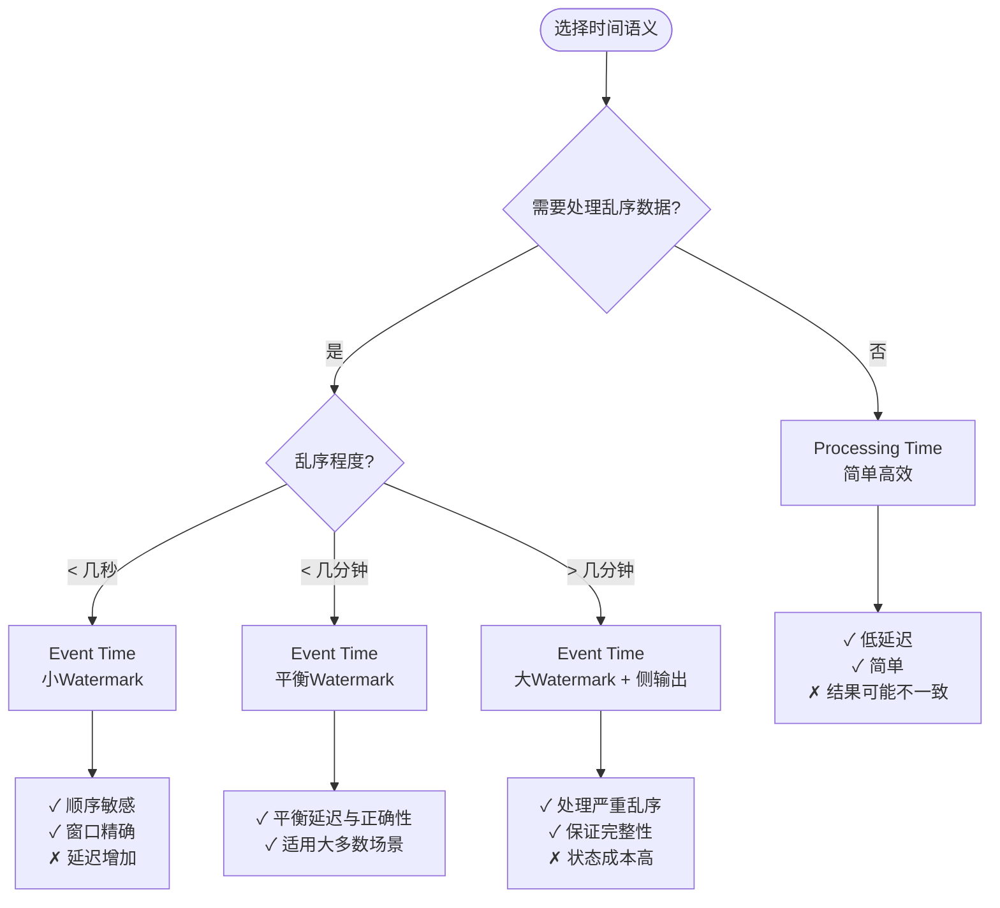
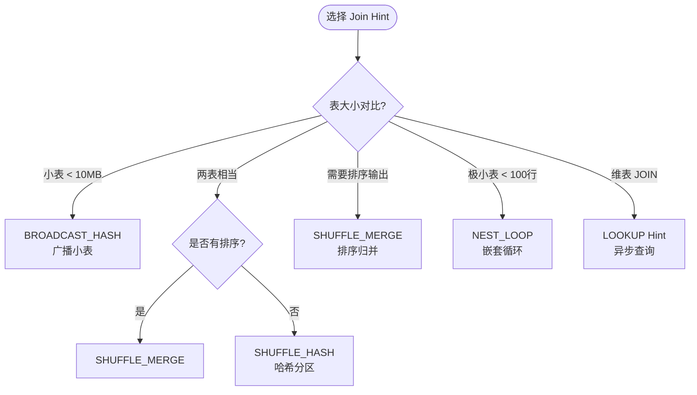
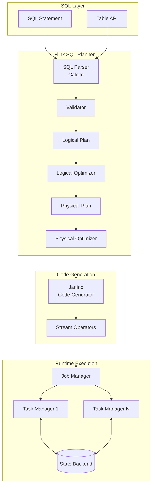
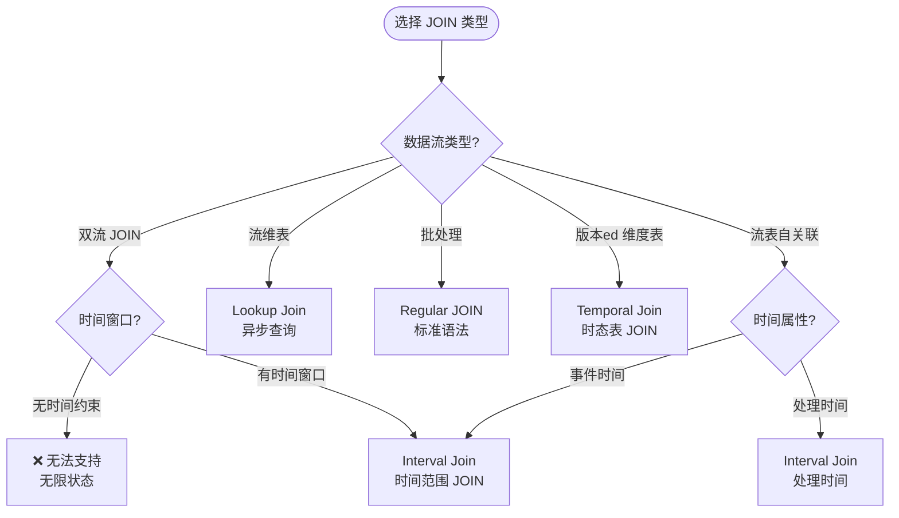
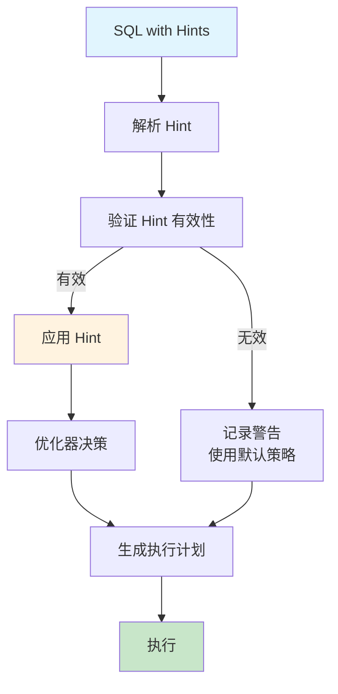
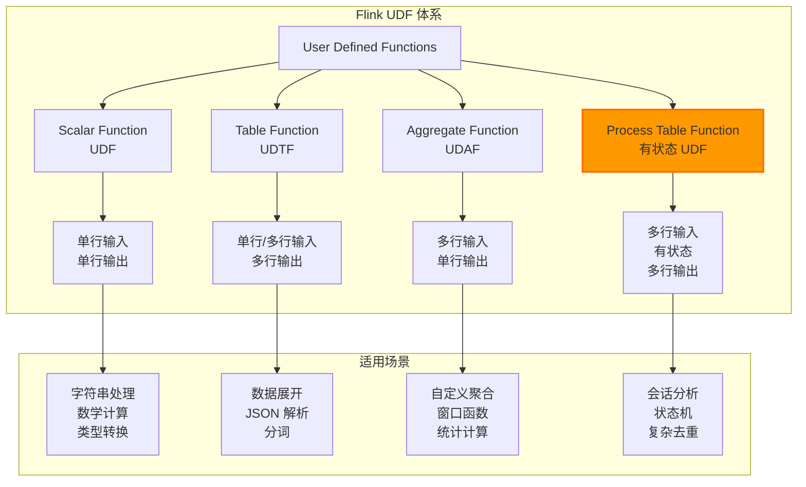
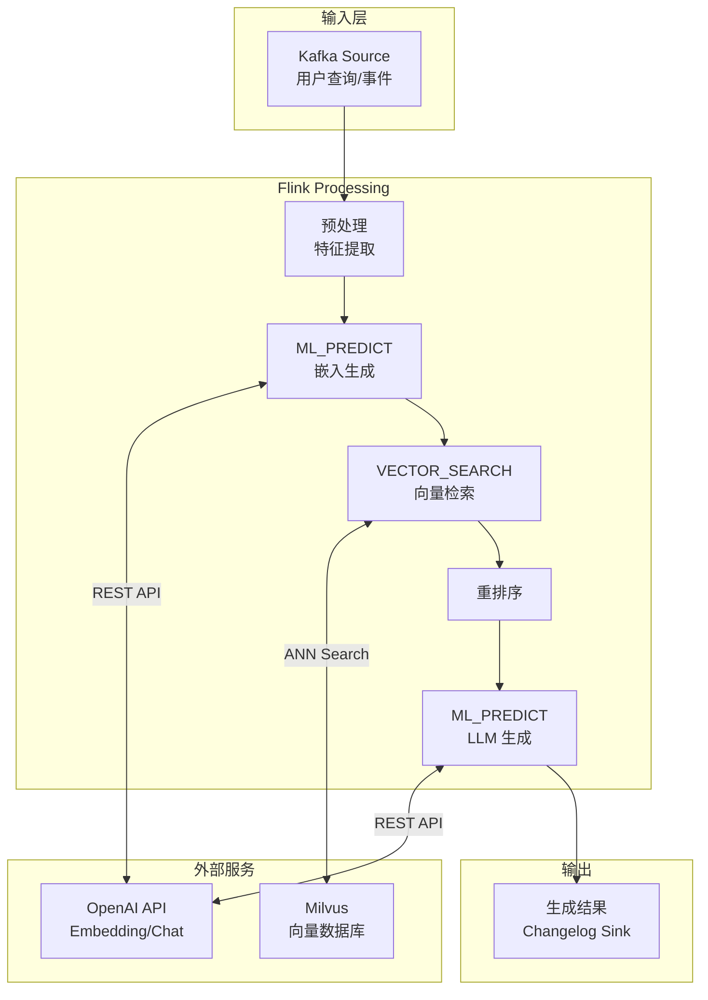
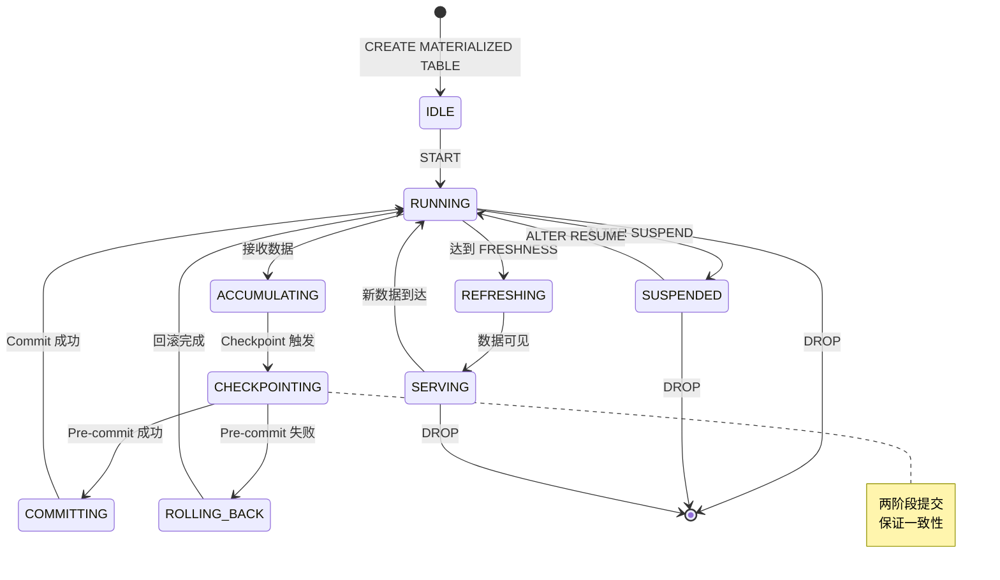

# Flink Table API & SQL 完整特性指南

> **所属阶段**: Flink Stage 3 | **前置依赖**: [Flink SQL Calcite优化器深度解析](./flink-sql-calcite-optimizer-deep-dive.md), [Flink SQL窗口函数深度指南](./flink-sql-window-functions-deep-dive.md) | **形式化等级**: L3-L5
>
> **版本**: Flink 1.17-2.2+ | **状态**: 生产就绪 | **最后更新**: 2026-04-04

---

## 1. 概念定义 (Definitions)

### Def-F-03-01: Flink SQL 语义模型

**定义**: Flink SQL 是 Apache Flink 提供的**声明式查询语言**，基于 ANSI SQL 标准扩展，支持流处理和批处理的统一语义。

形式化表述：
$$
\text{Flink SQL} = (\mathcal{D}, \mathcal{Q}, \mathcal{T}, \mathcal{S})
$$

其中：

- $\mathcal{D}$: 数据定义语言 (DDL) - 定义表、视图、函数、模型等元数据
- $\mathcal{Q}$: 数据查询语言 (DQL) - SELECT 及其子句
- $\mathcal{T}$: 数据操作语言 (DML) - INSERT、UPDATE、DELETE
- $\mathcal{S}$: 流语义扩展 - 时间属性、窗口、水印、动态表

### Def-F-03-02: 动态表 (Dynamic Table)

**定义**: 动态表是随时间变化的表，是 Flink SQL 中流数据的核心抽象。

形式化：
$$
\text{DynamicTable}: \mathbb{T} \rightarrow \text{Table}
$$

其中 $\mathbb{T}$ 为时间域，每个时间点 $t$ 对应一个表的快照。

**与静态表的区别**：

| 特性 | 静态表 (Batch) | 动态表 (Streaming) |
|------|---------------|-------------------|
| **数据边界** | 有界 | 无界 |
| **结果可见性** | 查询完成时全部可见 | 持续更新 (Changelog) |
| **执行模式** | 拉取 (Pull) | 推送 (Push) |
| **语义保证** | 快照一致性 | 事件时间一致性 |

### Def-F-03-03: 时间属性 (Time Attributes)

**Def-F-03-03a: 事件时间 (Event Time)**

$$
\text{EventTime}(e) = t_{\text{event}} \quad \text{(数据产生时间)}
$$

声明方式：

```sql
CREATE TABLE events (
    event_time TIMESTAMP(3),
    WATERMARK FOR event_time AS event_time - INTERVAL '5' SECOND
)
```

**Def-F-03-03b: 处理时间 (Processing Time)**

$$
\text{ProcessingTime}(e) = t_{\text{process}} \quad \text{(数据到达时间)}
$$

声明方式：

```sql
CREATE TABLE events (
    proc_time AS PROCTIME()
)
```

**Def-F-03-03c: 摄取时间 (Ingestion Time)**

$$
\text{IngestionTime}(e) = t_{\text{ingest}} \quad \text{(数据源摄入时间)}
$$

### Def-F-03-04: 连续查询 (Continuous Query)

**定义**: 连续查询是在动态表上持续执行的查询，产生结果流的持续更新。

形式化：
$$
\text{ContinuousQuery}: \mathcal{D}(t) \rightarrow \Delta\mathcal{R}(t)
$$

其中 $\Delta\mathcal{R}(t)$ 表示结果变更流 (Changelog Stream)。

**Changelog 语义**：

| 变更类型 | SQL符号 | 语义 |
|---------|---------|------|
| `+I` (INSERT) | 新增行 | 结果集中新增一条记录 |
| `-D` (DELETE) | 删除行 | 结果集中删除一条记录 |
| `+U` (UPDATE AFTER) | 更新后 | 记录更新后的新值 |
| `-U` (UPDATE BEFORE) | 更新前 | 记录更新前的旧值 (撤回) |

### Def-F-03-05: Flink Table API 抽象层次

```
┌─────────────────────────────────────────────────────────────────────┐
│                    Flink Table API 抽象层次                          │
├─────────────────────────────────────────────────────────────────────┤
│                                                                     │
│   Layer 1: SQL Layer                                                │
│   ├── DDL: CREATE TABLE/VIEW/FUNCTION/MODEL                        │
│   ├── DML: INSERT/UPDATE/DELETE                                    │
│   └── DQL: SELECT/WHERE/GROUP BY/WINDOW/JOIN                       │
│                                                                     │
│   Layer 2: Table API (Java/Scala/Python)                           │
│   ├── Table Environment                                            │
│   ├── Table Operations                                             │
│   └── Expression DSL                                               │
│                                                                     │
│   Layer 3: Relational Algebra                                      │
│   ├── Logical Plan (Calcite RelNode)                               │
│   ├── Optimization Rules                                           │
│   └── Physical Plan                                                │
│                                                                     │
│   Layer 4: DataStream API                                          │
│   ├── Transformations                                              │
│   ├── Operators                                                    │
│   └── State Management                                             │
│                                                                     │
└─────────────────────────────────────────────────────────────────────┘
```

---

## 2. 属性推导 (Properties)

### Lemma-F-03-01: 时间属性传递性

**命题**: 若源表声明了事件时间属性，则通过 SELECT、FILTER、PROJECT 操作后，时间属性仍然保留。

**证明**:

- SELECT/PROJECT 仅投影列，不修改时间属性元数据
- FILTER 仅过滤行，不影响时间属性列
- 因此时间属性在关系代数操作中保持传递 ∎

### Prop-F-03-01: 窗口聚合的单调性

**命题**: 在事件时间语义下，窗口聚合结果满足**单调性** - 一旦窗口被 Watermark 推进关闭，该窗口的结果不再改变。

形式化：
$$
\forall w \in \mathcal{W}, \forall t > t_{\text{watermark}} \geq \text{end}(w): \text{Result}(w, t) = \text{Result}(w, t_{\text{watermark}})
$$

### Lemma-F-03-02: JOIN 状态需求

**命题**: 双流 JOIN 的状态需求与窗口大小成正比：

$$
|S|_{\text{join}} = O(\lambda \times \Delta t \times |K|)
$$

其中：

- $\lambda$: 事件到达率
- $\Delta t$: JOIN 时间窗口
- $|K|$: 键的基数

### Prop-F-03-02: 物化视图与连续查询等价性

**命题**: 在 Flink 语义下，物化表 (Materialized Table) 与带 `EMIT` 策略的连续查询等价。

$$
\text{MaterializedTable}(Q, \tau) \equiv \text{ContinuousQuery}(Q) \text{ with } \text{EMIT} \text{ every } \tau
$$

---

## 3. 关系建立 (Relations)

### 3.1 SQL 与 Table API 映射关系

| SQL 语句 | Table API (Java) | Table API (Python) |
|----------|------------------|-------------------|
| `SELECT a, b FROM t` | `t.select($("a"), $("b"))` | `t.select(col('a'), col('b'))` |
| `WHERE x > 10` | `.filter($("x").isGreater(10))` | `.filter(col('x') > 10)` |
| `GROUP BY a` | `.groupBy($("a"))` | `.group_by(col('a'))` |
| `TUMBLE(ts, INTERVAL '1' HOUR)` | `.window(Tumble.over(lit(1).hours()).on($("ts")).as("w"))` | `.window(Tumble.over(lit(1).hours()).on(col('ts')).alias('w'))` |
| `JOIN` | `.join(other, joinCondition)` | `.join(other, join_condition)` |

### 3.2 Flink SQL 与标准 SQL 对比

| 特性 | ANSI SQL | Flink SQL | 说明 |
|------|----------|-----------|------|
| **数据源** | 静态表 | 动态表 + 连接器 | 支持 Kafka、CDC 等 |
| **时间处理** | 系统时间 | 事件时间/处理时间 | WATERMARK 声明 |
| **窗口** | 无 | TUMBLE/HOP/SESSION/CUMULATE | 流处理核心特性 |
| **JOIN 类型** | 标准 JOIN | + Interval/Temporal/Lookup | 流式 JOIN 扩展 |
| **Changelog** | 无 | `+I/-U/+U/-D` | 流结果更新语义 |

### 3.3 执行计划层次关系

```
SQL/Table API
      ↓
[SQL Parser + Validator] (Calcite)
      ↓
Logical Plan (RelNode Tree)
      ↓
[Logical Optimization] (Predicate Pushdown, Projection Pruning)
      ↓
Physical Plan (Flink Physical RelNode)
      ↓
[Physical Optimization] (Join Reordering, Parallelism)
      ↓
Execution Plan (Operator DAG)
      ↓
[Code Generation] (Janino)
      ↓
Job Graph (Flink Runtime)
```

---

## 4. 论证过程 (Argumentation)

### 4.1 流批统一架构论证

**问题**: 为什么 Flink SQL 可以统一流处理和批处理？

**论证**:

1. **有界流与批处理的等价性**: 批处理是有界流的特例
   $$\text{Batch} = \lim_{|\mathcal{D}| < \infty} \text{Streaming}$$

2. **动态表的统一抽象**: 动态表在某一时刻的视图就是静态表

3. **执行引擎统一**: DataStream API 底层同时支持有界和无界数据

4. **优化器适配**: Calcite 优化器根据源数据特性自动选择执行策略

### 4.2 时间语义选择决策树



### 4.3 SQL vs Table API 选型指南

| 场景 | 推荐方案 | 理由 |
|------|----------|------|
| 复杂业务逻辑 | Table API | 类型安全、IDE支持、可测试 |
| 即席查询/BI | SQL | 声明式、工具生态丰富 |
| 动态查询生成 | SQL | 字符串拼接灵活 |
| 与现有系统集成 | SQL | 标准接口、学习成本低 |
| 需要精细控制 | Table API | 访问底层 API、自定义优化 |

---

## 5. 形式证明 / 工程论证 (Proof / Engineering Argument)

### Thm-F-03-01: 动态表上连续查询的语义完整性

**定理**: 对于任意符合类型约束的连续查询 $Q$，Flink SQL 保证其结果在事件时间语义下的完整性。

**形式化**: 设输入流 $S$ 的 Watermark 策略为 $\mathcal{W}$，则对于任意窗口 $w$：

$$
\forall e \in S: \text{event_time}(e) \in w \land \mathcal{W}(t) \geq \text{end}(w) \Rightarrow e \text{ 被计入 } w
$$

**证明要点**:

1. Watermark $\mathcal{W}(t)$ 定义了系统对事件时间进度的认知
2. 窗口触发条件为 $\mathcal{W}(t) \geq \text{end}(w)$
3. 任何事件时间小于窗口结束时间的事件，要么已到达，要么被标记为延迟
4. 因此窗口结果在触发时是完整的 ∎

### Thm-F-03-02: Exactly-Once 语义保证

**定理**: 在启用 Checkpoint 的情况下，Flink SQL 的 DML 操作（INSERT/UPDATE/DELETE）提供 Exactly-Once 语义保证。

**条件**:

- 源连接器支持回放 (如 Kafka)
- 目标连接器支持两阶段提交 (2PC) 或幂等写入
- Checkpoint 间隔配置合理

**证明**:

1. Checkpoint 创建全局一致的状态快照
2. 失败时从最近 Checkpoint 恢复状态
3. 源从 Checkpoint 位置重放数据
4. 两阶段提交保证 Sink 端不重复写入
5. 因此端到端 Exactly-Once 成立 ∎

### Thm-F-03-03: SQL Hints 的优化有效性

**定理**: 在统计信息准确的前提下，SQL Hints 能够引导优化器生成不低于默认 CBO 选择的执行计划。

**形式化**: 设 $P_{cbo}$ 为 CBO 选择的计划，$P_{hint}$ 为 Hint 指定的计划，则：

$$
\text{Cost}(P_{hint}) \leq \text{Cost}(P_{cbo}) \times (1 + \epsilon)
$$

其中 $\epsilon$ 为 Hint 与实际情况的偏差系数。

---

## 6. 实例验证 (Examples)

### 6.1 DDL - 数据定义语言

#### 6.1.1 CREATE TABLE - 创建表

**基础语法**：

```sql
-- Def-F-03-06: 基础表定义
CREATE TABLE user_events (
    -- 物理列
    user_id STRING,
    event_type STRING,
    event_time TIMESTAMP(3),

    -- 计算列 (Flink 1.13+)
    event_date AS DATE_FORMAT(event_time, 'yyyy-MM-dd'),
    proc_time AS PROCTIME(),

    -- 水印定义
    WATERMARK FOR event_time AS event_time - INTERVAL '5' SECOND
) WITH (
    'connector' = 'kafka',
    'topic' = 'user-events',
    'properties.bootstrap.servers' = 'kafka:9092',
    'properties.group.id' = 'flink-sql-consumer',
    'scan.startup.mode' = 'earliest-offset',
    'format' = 'json',
    'json.fail-on-missing-field' = 'false',
    'json.ignore-parse-errors' = 'true'
);
```

**版本兼容性矩阵**：

| 特性 | 最低版本 | 说明 |
|------|---------|------|
| `WATERMARK` | 1.11 | 事件时间处理基础 |
| `AS PROCTIME()` | 1.11 | 处理时间列 |
| 计算列 | 1.13 | 派生列定义 |
| `PRIMARY KEY` | 1.14 | CDC 源表必需 |
| `NOT ENFORCED` | 1.14 | 不强制执行约束 |

**Table API 等效代码**：

```java

import org.apache.flink.api.common.typeinfo.Types;

// Java Table API
TableDescriptor sourceDescriptor = TableDescriptor.forConnector("kafka")
    .schema(Schema.newBuilder()
        .column("user_id", DataTypes.STRING())
        .column("event_type", DataTypes.STRING())
        .column("event_time", DataTypes.TIMESTAMP(3))
        .columnByExpression("event_date", "DATE_FORMAT(event_time, 'yyyy-MM-dd')")
        .columnByExpression("proc_time", "PROCTIME()")
        .watermark("event_time", "event_time - INTERVAL '5' SECOND")
        .build())
    .option("topic", "user-events")
    .option("properties.bootstrap.servers", "kafka:9092")
    .option("scan.startup.mode", "earliest-offset")
    .format("json")
    .build();

tableEnv.createTable("user_events", sourceDescriptor);
```

```python
# Python Table API
from pyflink.table import TableDescriptor, Schema, DataTypes
from pyflink.table.expressions import col, lit

source_descriptor = TableDescriptor.for_connector('kafka') \
    .schema(Schema.new_builder()
        .column('user_id', DataTypes.STRING())
        .column('event_type', DataTypes.STRING())
        .column('event_time', DataTypes.TIMESTAMP(3))
        .column_by_expression('event_date', "DATE_FORMAT(event_time, 'yyyy-MM-dd')")
        .column_by_expression('proc_time', 'PROCTIME()')
        .watermark('event_time', "event_time - INTERVAL '5' SECOND")
        .build()) \
    .option('topic', 'user-events') \
    .option('properties.bootstrap.servers', 'kafka:9092') \
    .format('json') \
    .build()

table_env.create_table('user_events', source_descriptor)
```

#### 6.1.2 CREATE TABLE - CDC 源表

```sql
-- Def-F-03-07: MySQL CDC 源表 (Flink CDC 连接器)
CREATE TABLE mysql_users (
    id INT,
    name STRING,
    email STRING,
    updated_at TIMESTAMP(3),

    -- CDC 元数据列
    PRIMARY KEY (id) NOT ENFORCED,
    METADATA FROM 'op_ts' TIMESTAMP(3) METADATA VIRTUAL,  -- 操作时间戳
    METADATA FROM 'op_type' STRING METADATA VIRTUAL       -- 操作类型 (c/u/d)
) WITH (
    'connector' = 'mysql-cdc',
    'hostname' = 'mysql-host',
    'port' = '3306',
    'username' = 'cdc_user',
    'password' = 'cdc_password',
    'database-name' = 'mydb',
    'table-name' = 'users',
    'server-time-zone' = 'Asia/Shanghai',
    'debezium.snapshot.mode' = 'initial'
);
```

#### 6.1.3 CREATE DATABASE - 创建数据库

```sql
-- 创建数据库 (Catalog)
CREATE DATABASE IF NOT EXISTS analytics;

-- 带属性的数据库
CREATE DATABASE analytics
WITH (
    'default.parallelism' = '4',
    'pipeline.name' = 'analytics-pipeline'
);

-- 切换数据库
USE analytics;
```

#### 6.1.4 CREATE VIEW - 创建视图

```sql
-- Def-F-03-08: 创建临时视图
CREATE TEMPORARY VIEW hourly_user_stats AS
SELECT
    user_id,
    TUMBLE_START(event_time, INTERVAL '1' HOUR) AS window_start,
    TUMBLE_END(event_time, INTERVAL '1' HOUR) AS window_end,
    COUNT(*) AS event_count,
    COUNT(DISTINCT event_type) AS unique_events
FROM user_events
GROUP BY
    user_id,
    TUMBLE(event_time, INTERVAL '1' HOUR);

-- 创建永久视图
CREATE VIEW analytics.daily_active_users AS
SELECT
    DATE_FORMAT(event_time, 'yyyy-MM-dd') AS event_date,
    COUNT(DISTINCT user_id) AS dau
FROM user_events
GROUP BY DATE_FORMAT(event_time, 'yyyy-MM-dd');
```

#### 6.1.5 CREATE FUNCTION - 创建函数

```sql
-- 创建临时系统函数
CREATE TEMPORARY SYSTEM FUNCTION IF NOT EXISTS
    ParseUserAgent AS 'com.example.udf.ParseUserAgentFunction';

-- 创建目录函数 (永久)
CREATE FUNCTION analytics.parse_json_path
    AS 'com.example.udf.JsonPathFunction'
    USING JAR 'hdfs:///udfs/json-udf.jar';
```

#### 6.1.6 ~~CREATE MODEL~~ - 创建 ML 模型（概念设计，尚未支持）

```sql
<!-- 以下语法为概念设计，实际 Flink 版本尚未支持 -->
~~CREATE MODEL~~ (未来可能的语法)

```sql
-- Def-F-03-09: 创建 AI 模型 (概念设计阶段，非正式语法)
-- CREATE MODEL sentiment_analyzer
-- WITH (
--     'provider' = 'openai',
--     'openai.model' = 'gpt-4o-mini',
--     'openai.api_key' = '${OPENAI_API_KEY}',
--     'openai.temperature' = '0.1',
--     'openai.timeout' = '30s'
-- )
-- INPUT (text STRING)
-- OUTPUT (sentiment STRING, confidence DOUBLE, reasoning STRING);
```

```

#### 6.1.7 CREATE MATERIALIZED TABLE - 创建物化表

```sql
-- Def-F-03-10: 创建物化表 (Flink 2.2+)
CREATE MATERIALIZED TABLE user_behavior_summary
DISTRIBUTED BY HASH(user_id) INTO 16 BUCKETS
FRESHNESS = INTERVAL '5' MINUTE
AS SELECT
    user_id,
    COUNT(*) AS event_count,
    SUM(CASE WHEN event_type = 'purchase' THEN amount ELSE 0 END) AS total_spend
FROM user_events
GROUP BY user_id;
```

### 6.2 DML - 数据操作语言

#### 6.2.1 INSERT - 数据插入

**基础 INSERT**：

```sql
-- 单条插入 (批处理模式)
INSERT INTO orders VALUES
    ('order_001', 'user_001', 100.00, TIMESTAMP '2024-01-15 10:00:00');

-- 查询插入 (流/批)
INSERT INTO order_summary
SELECT
    user_id,
    COUNT(*) AS order_count,
    SUM(amount) AS total_amount
FROM orders
GROUP BY user_id;
```

**分区插入**：

```sql
-- 动态分区插入
INSERT INTO sales_partitioned
PARTITION (dt, hour)
SELECT
    order_id, user_id, amount,
    DATE_FORMAT(event_time, 'yyyy-MM-dd') AS dt,
    DATE_FORMAT(event_time, 'HH') AS hour
FROM orders;
```

**覆盖插入**：

```sql
-- INSERT OVERWRITE (批处理)
INSERT OVERWRITE user_daily_stats
SELECT
    DATE_FORMAT(event_time, 'yyyy-MM-dd') AS stat_date,
    COUNT(DISTINCT user_id) AS dau
FROM events
GROUP BY DATE_FORMAT(event_time, 'yyyy-MM-dd');
```

**Table API 等效代码**：

```java
// Java Table API
Table result = tableEnv.from("orders")
    .groupBy($("user_id"))
    .select(
        $("user_id"),
        $("order_id").count().as("order_count"),
        $("amount").sum().as("total_amount")
    );

// 执行插入
result.executeInsert("order_summary");
```

```python
# Python Table API
from pyflink.table.expressions import col

result = table_env.from_path('orders') \
    .group_by(col('user_id')) \
    .select(
        col('user_id'),
        col('order_id').count.alias('order_count'),
        col('amount').sum.alias('total_amount')
    )

# 执行插入
result.execute_insert('order_summary')
```

#### 6.2.2 UPDATE - 数据更新

```sql
-- 批处理模式下的 UPDATE (仅适用于 Lookup 表)
UPDATE user_profiles
SET last_login = CURRENT_TIMESTAMP,
    login_count = login_count + 1
WHERE user_id = 'user_001';

-- 流处理中的更新语义通过 Changelog 实现
-- 实际使用: 将更新作为新记录插入到目标表
INSERT INTO user_profiles_changelog
SELECT
    user_id,
    CURRENT_TIMESTAMP AS last_login,
    login_count + 1 AS login_count
FROM user_login_events;
```

**版本兼容性**：

- UPDATE 语句仅在批处理模式或 Lookup 表上支持
- 流处理场景使用 Changelog 流实现更新语义

#### 6.2.3 DELETE - 数据删除

```sql
-- 批处理模式下的 DELETE
DELETE FROM temp_logs
WHERE log_time < CURRENT_DATE - INTERVAL '7' DAY;

-- 流处理中的删除语义
-- 通过发送 -D 变更记录实现
INSERT INTO target_table
SELECT
    user_id,
    event_time,
    'DELETE' AS _op_type
FROM deletion_events;
```

### 6.3 DQL - 数据查询语言

#### 6.3.1 基础查询 (SELECT / WHERE)

```sql
-- Def-F-03-11: 基础查询
SELECT
    user_id,
    event_type,
    event_time,
    event_date
FROM user_events
WHERE event_type IN ('click', 'purchase')
  AND event_time >= CURRENT_TIMESTAMP - INTERVAL '1' DAY
  AND user_id IS NOT NULL;

-- 支持的模式匹配
SELECT * FROM users WHERE name LIKE 'John%';
SELECT * FROM users WHERE email REGEXP '^[a-z]+@[a-z]+\.com$';
```

**Table API 等效代码**：

```java
// Java
Table result = tableEnv.from("user_events")
    .select($("user_id"), $("event_type"), $("event_time"), $("event_date"))
    .where($("event_type").in("click", "purchase"))
    .where($("event_time").isGreaterOrEqual(
        currentTimestamp().minus(lit(1).days())
    ));
```

```python
# Python
from pyflink.table.expressions import col, lit

result = table_env.from_path('user_events') \
    .select(col('user_id'), col('event_type'), col('event_time')) \
    .filter(col('event_type').isin('click', 'purchase')) \
    .filter(col('event_time') >= lit('2024-01-01').to_timestamp)
```

#### 6.3.2 聚合查询 (GROUP BY / HAVING)

```sql
-- 基础聚合
SELECT
    DATE_FORMAT(event_time, 'yyyy-MM-dd') AS event_date,
    event_type,
    COUNT(*) AS event_count,
    COUNT(DISTINCT user_id) AS unique_users,
    SUM(amount) AS total_amount,
    AVG(amount) AS avg_amount,
    MAX(amount) AS max_amount,
    MIN(amount) AS min_amount,
    PERCENTILE_CONT(0.95) WITHIN GROUP (ORDER BY amount) AS p95_amount
FROM user_events
WHERE event_time >= CURRENT_TIMESTAMP - INTERVAL '7' DAY
GROUP BY
    DATE_FORMAT(event_time, 'yyyy-MM-dd'),
    event_type
HAVING COUNT(*) > 100
ORDER BY event_date DESC, event_count DESC;
```

**执行计划分析**：

```sql
EXPLAIN PLAN FOR
SELECT event_type, COUNT(*)
FROM user_events
GROUP BY event_type;
```

典型输出：

```
== Optimized Physical Plan ==
GroupAggregate(groupBy=[event_type], select=[event_type, COUNT(*)])
+- Exchange(distribution=[hash[event_type]])
   +- TableSourceScan(table=[[user_events]], fields=[event_type])
```

#### 6.3.3 排序与限制 (ORDER BY / LIMIT / OFFSET)

```sql
-- 基础排序与限制
SELECT * FROM orders
ORDER BY amount DESC
LIMIT 100;

-- 分页查询 (批处理)
SELECT * FROM orders
ORDER BY order_time DESC
LIMIT 10 OFFSET 20;

-- 流处理中的 Top-N
SELECT *
FROM (
    SELECT
        user_id,
        amount,
        ROW_NUMBER() OVER (ORDER BY amount DESC) AS rn
    FROM orders
)
WHERE rn <= 10;
```

#### 6.3.4 TOP-N 查询

```sql
-- Def-F-03-12: 流处理 Top-N (结果会持续更新)
SELECT *
FROM (
    SELECT
        category,
        product_id,
        sales_amount,
        ROW_NUMBER() OVER (
            PARTITION BY category
            ORDER BY sales_amount DESC
        ) AS rn
    FROM product_sales
)
WHERE rn <= 3;

-- 窗口 Top-N (Flink 1.18+)
SELECT *
FROM (
    SELECT
        category,
        product_id,
        SUM(sales) AS total_sales,
        window_start,
        window_end,
        ROW_NUMBER() OVER (
            PARTITION BY category, window_start, window_end
            ORDER BY SUM(sales) DESC
        ) AS rn
    FROM TABLE(TUMBLE(TABLE product_sales, DESCRIPTOR(sale_time), INTERVAL '1' HOUR))
    GROUP BY category, product_id, window_start, window_end
)
WHERE rn <= 5;
```

**执行计划分析**：

```
Rank(strategy=[RetractStrategy], rankType=[ROW_NUMBER],
     partitionBy=[category], orderBy=[sales_amount DESC],
     outputRowNumber=[true])
+- Exchange(distribution=[hash[category]])
   +- Calc(select=[category, product_id, sales_amount])
      +- TableSourceScan(table=[[product_sales]])
```

**Table API 等效代码**：

```java
// Java Table API
Table topN = tableEnv.from("product_sales")
    .window(Tumble.over(lit(1).hours()).on($("sale_time")).as("w"))
    .groupBy($("category"), $("product_id"), $("w"))
    .select(
        $("category"),
        $("product_id"),
        $("sales").sum().as("total_sales"),
        $("w").start().as("window_start"),
        $("w").end().as("window_end")
    )
    .addColumns(
        rowNumber().over(
            PartitionBy($("category"), $("window_start"), $("window_end"))
                .orderBy($("total_sales").desc())
        ).as("rn")
    )
    .where($("rn").isLessOrEqual(5));
```

#### 6.3.5 去重查询 (Deduplication)

```sql
-- 方式1: ROW_NUMBER 去重 (保留第一条)
SELECT event_id, event_time, payload
FROM (
    SELECT
        *,
        ROW_NUMBER() OVER (
            PARTITION BY event_id
            ORDER BY event_time ASC
        ) AS rn
    FROM events
)
WHERE rn = 1;

-- 方式2: Deduplication 保留最后一条
SELECT event_id, event_time, payload
FROM (
    SELECT
        *,
        ROW_NUMBER() OVER (
            PARTITION BY event_id
            ORDER BY event_time DESC
        ) AS rn
    FROM events
)
WHERE rn = 1;
```

### 6.4 窗口函数 (Window Functions)

#### 6.4.1 窗口 TVF 语法

**Def-F-03-13: 四种窗口类型**

| 窗口类型 | SQL 语法 | 输出特点 | 状态成本 | 适用场景 |
|---------|---------|---------|---------|---------|
| TUMBLE | `TUMBLE(TABLE t, DESCRIPTOR(ts), INTERVAL '1' HOUR)` | 不重叠、等大小 | 低 | 固定时间报表 |
| HOP | `HOP(TABLE t, DESCRIPTOR(ts), INTERVAL '5' MINUTE, INTERVAL '1' HOUR)` | 可能重叠 | 中 | 移动平均监控 |
| SESSION | `SESSION(TABLE t PARTITION BY key, DESCRIPTOR(ts), INTERVAL '10' MINUTE)` | 动态大小 | 高 | 用户行为会话 |
| CUMULATE | `CUMULATE(TABLE t, DESCRIPTOR(ts), INTERVAL '10' MINUTE, INTERVAL '1' HOUR)` | 累积扩展 | 中 | 实时大屏展示 |

#### 6.4.2 TUMBLE 窗口

```sql
-- 滚动窗口: 每小时统计
SELECT
    user_id,
    window_start,
    window_end,
    COUNT(*) AS event_count,
    SUM(amount) AS total_amount
FROM TABLE(
    TUMBLE(TABLE user_events, DESCRIPTOR(event_time), INTERVAL '1' HOUR)
)
GROUP BY user_id, window_start, window_end;
```

#### 6.4.3 HOP 窗口

```sql
-- 滑动窗口: 最近5分钟的平均响应时间(每分钟更新)
SELECT
    url,
    window_start,
    window_end,
    AVG(response_time) AS avg_response_time,
    PERCENTILE_CONT(0.99) WITHIN GROUP (ORDER BY response_time) AS p99
FROM TABLE(
    HOP(TABLE access_logs, DESCRIPTOR(log_time), INTERVAL '1' MINUTE, INTERVAL '5' MINUTE)
)
GROUP BY url, window_start, window_end;
```

#### 6.4.4 SESSION 窗口

```sql
-- 会话窗口: 用户会话分析
SELECT
    user_id,
    SESSION_START(event_time, INTERVAL '30' MINUTE) AS session_start,
    SESSION_END(event_time, INTERVAL '30' MINUTE) AS session_end,
    COUNT(*) AS event_count,
    COLLECT(DISTINCT page_url) AS visited_pages
FROM TABLE(
    SESSION(TABLE user_events PARTITION BY user_id, DESCRIPTOR(event_time), INTERVAL '30' MINUTE)
)
GROUP BY user_id, SESSION_START(event_time, INTERVAL '30' MINUTE), SESSION_END(event_time, INTERVAL '30' MINUTE);
```

#### 6.4.5 CUMULATE 窗口

```sql
-- 累积窗口: 今日累计销售额(每10分钟更新)
SELECT
    window_start,
    window_end,
    SUM(amount) AS cumulative_sales,
    COUNT(*) AS order_count
FROM TABLE(
    CUMULATE(TABLE orders, DESCRIPTOR(order_time), INTERVAL '10' MINUTE, INTERVAL '1' DAY)
)
GROUP BY window_start, window_end;
```

#### 6.4.6 INTERVAL 窗口 (Flink 1.17+)

```sql
-- 基于 INTERVAL 的灵活窗口
SELECT
    user_id,
    window_time,
    COUNT(*) AS event_count
FROM TABLE(
    CUMULATE(
        TABLE user_events,
        DESCRIPTOR(event_time),
        INTERVAL '10' MINUTE,  -- 步长
        INTERVAL '1' HOUR      -- 最大窗口
    )
)
GROUP BY user_id, window_start, window_end, window_time;
```

**Table API 等效代码**：

```java
// Java Table API
Table windowed = tableEnv.from("user_events")
    .window(Tumble.over(lit(1).hours()).on($("event_time")).as("w"))
    .groupBy($("user_id"), $("w"))
    .select(
        $("user_id"),
        $("w").start().as("window_start"),
        $("w").end().as("window_end"),
        $("event_type").count().as("event_count")
    );
```

```python
# Python Table API
from pyflink.table.window import Tumble
from pyflink.table.expressions import lit, col

windowed = table_env.from_path('user_events') \
    .window(Tumble.over(lit(1).hours).on(col('event_time')).alias('w')) \
    .group_by(col('user_id'), col('w')) \
    .select(
        col('user_id'),
        col('w').start.alias('window_start'),
        col('w').end.alias('window_end'),
        col('event_type').count.alias('event_count')
    )
```

### 6.5 JOIN 类型

#### 6.5.1 常规 JOIN

```sql
-- Def-F-03-14: INNER JOIN
SELECT
    o.order_id,
    o.user_id,
    u.user_name,
    o.amount
FROM orders o
INNER JOIN users u ON o.user_id = u.user_id;

-- LEFT JOIN
SELECT
    o.order_id,
    o.user_id,
    u.user_name  -- 可能为 NULL
FROM orders o
LEFT JOIN users u ON o.user_id = u.user_id;

-- FULL OUTER JOIN
SELECT
    COALESCE(o.user_id, u.user_id) AS user_id,
    o.order_count,
    u.registration_date
FROM (
    SELECT user_id, COUNT(*) AS order_count FROM orders GROUP BY user_id
) o
FULL OUTER JOIN users u ON o.user_id = u.user_id;
```

#### 6.5.2 Interval Join

```sql
-- Interval Join: 关联时间窗口内的订单和支付
SELECT
    o.order_id,
    o.user_id,
    o.amount AS order_amount,
    p.amount AS pay_amount,
    p.pay_time
FROM orders o
JOIN payments p
    ON o.order_id = p.order_id
    AND p.pay_time BETWEEN o.order_time - INTERVAL '5' MINUTE
                       AND o.order_time + INTERVAL '1' HOUR;
```

#### 6.5.3 Temporal Join (时态表 JOIN)

```sql
-- 版本ed 维度表 (时态表)
CREATE TABLE exchange_rates (
    currency STRING,
    rate DECIMAL(10, 4),
    update_time TIMESTAMP(3),
    WATERMARK FOR update_time AS update_time - INTERVAL '5' SECOND,
    PRIMARY KEY (currency) NOT ENFORCED
) WITH (
    'connector' = 'kafka',
    'topic' = 'exchange-rates',
    'format' = 'debezium-json'
);

-- Temporal Join: 获取订单发生时的汇率
SELECT
    o.order_id,
    o.currency,
    o.amount,
    e.rate,
    o.amount * e.rate AS amount_usd
FROM orders o
LEFT JOIN exchange_rates FOR SYSTEM_TIME AS OF o.order_time e
    ON o.currency = e.currency;
```

**Table API 等效代码**：

```java
// Java Table API
Table result = tableEnv.from("orders")
    .join(
        tableEnv.from("exchange_rates"),
        JoinHint.of(JoinHint.JoinType.LEFT_OUTER, List.of("currency")),
        $("currency").isEqual($("currency"))
            .and($("update_time").isLessOrEqual($("order_time")))
    )
    .select(
        $("order_id"),
        $("currency"),
        $("amount"),
        $("rate"),
        $("amount").times($("rate")).as("amount_usd")
    );
```

#### 6.5.4 Lookup Join

```sql
-- Lookup Join: 实时查询 Redis/MySQL 维度表
CREATE TABLE user_profiles (
    user_id STRING,
    age INT,
    city STRING,
    gender STRING,
    PRIMARY KEY (user_id) NOT ENFORCED
) WITH (
    'connector' = 'jdbc',
    'url' = 'jdbc:mysql://mysql:3306/dim',
    'table-name' = 'user_profiles',
    'lookup.cache.max-rows' = '10000',
    'lookup.cache.ttl' = '10 min',
    'lookup.max-retries' = '3'
);

-- 流表 JOIN 维度表
SELECT
    e.user_id,
    e.event_type,
    p.age,
    p.city,
    p.gender
FROM user_events e
LEFT JOIN user_profiles FOR SYSTEM_TIME AS OF e.proc_time p
    ON e.user_id = p.user_id;
```

**版本兼容性**：

| 特性 | 最低版本 | 说明 |
|------|---------|------|
| Regular JOIN | 1.11 | 双流/批 JOIN |
| Interval JOIN | 1.12 | 带时间窗口的 JOIN |
| Temporal JOIN | 1.12 | 时态表 JOIN |
| Lookup JOIN | 1.12 | 异步维表查询 |
| Join Hints | 1.12 | BROADCAST_HASH 等 |


### 6.6 聚合函数

#### 6.6.1 内置聚合函数

| 函数 | 描述 | 版本 |
|------|------|------|
| `COUNT(*)` | 计数 | 1.0+ |
| `COUNT(DISTINCT col)` | 去重计数 | 1.11+ |
| `SUM(col)` | 求和 | 1.0+ |
| `AVG(col)` | 平均值 | 1.0+ |
| `MAX(col)` | 最大值 | 1.0+ |
| `MIN(col)` | 最小值 | 1.0+ |
| `STDDEV_POP(col)` | 总体标准差 | 1.14+ |
| `STDDEV_SAMP(col)` | 样本标准差 | 1.14+ |
| `VAR_POP(col)` | 总体方差 | 1.14+ |
| `VAR_SAMP(col)` | 样本方差 | 1.14+ |
| `COLLECT(col)` | 收集为数组 | 1.13+ |
| `COLLECT_SET(col)` | 收集去重数组 | 1.15+ |
| `STRING_AGG(col, delimiter)` | 字符串连接 | 1.13+ |
| `JSON_ARRAYAGG(col)` | JSON 数组聚合 | 1.17+ |
| `JSON_OBJECTAGG(key, value)` | JSON 对象聚合 | 1.17+ |
| `PERCENTILE_CONT(fraction)` | 分位数 | 1.15+ |

```sql
-- 综合聚合示例
SELECT
    category,
    COUNT(*) AS total_orders,
    COUNT(DISTINCT user_id) AS unique_buyers,
    SUM(amount) AS total_revenue,
    AVG(amount) AS avg_order_value,
    PERCENTILE_CONT(0.5) WITHIN GROUP (ORDER BY amount) AS median_amount,
    PERCENTILE_CONT(0.95) WITHIN GROUP (ORDER BY amount) AS p95_amount,
    STDDEV_SAMP(amount) AS amount_stddev,
    MIN(order_time) AS first_order,
    MAX(order_time) AS last_order,
    COLLECT_SET(user_id) AS buyer_set,
    STRING_AGG(DISTINCT product_id, ',') AS product_list
FROM orders
GROUP BY category;
```

#### 6.6.2 窗口聚合

```sql
-- 窗口聚合 + 排名函数
SELECT
    user_id,
    window_start,
    window_end,
    event_count,
    ROW_NUMBER() OVER (
        PARTITION BY window_start, window_end
        ORDER BY event_count DESC
    ) AS rank
FROM (
    SELECT
        user_id,
        window_start,
        window_end,
        COUNT(*) AS event_count
    FROM TABLE(
        TUMBLE(TABLE user_events, DESCRIPTOR(event_time), INTERVAL '1' HOUR)
    )
    GROUP BY user_id, window_start, window_end
);
```

#### 6.6.3 自定义 UDAF (用户定义聚合函数)

**Java 实现**：

```java
import org.apache.flink.table.functions.AggregateFunction;

import org.apache.flink.api.common.functions.AggregateFunction;


/**
 * Def-F-03-15: 自定义加权平均 UDAF
 */
public class WeightedAvg extends AggregateFunction<Double, WeightedAvg.WeightedAvgAccumulator> {

    // 累加器定义
    public static class WeightedAvgAccumulator {
        public double sum = 0;
        public int count = 0;
    }

    @Override
    public WeightedAvgAccumulator createAccumulator() {
        return new WeightedAvgAccumulator();
    }

    public void accumulate(WeightedAvgAccumulator acc, Double value, Integer weight) {
        acc.sum += value * weight;
        acc.count += weight;
    }

    public void retract(WeightedAvgAccumulator acc, Double value, Integer weight) {
        acc.sum -= value * weight;
        acc.count -= weight;
    }

    public void merge(WeightedAvgAccumulator acc, Iterable<WeightedAvgAccumulator> others) {
        for (WeightedAvgAccumulator other : others) {
            acc.sum += other.sum;
            acc.count += other.count;
        }
    }

    @Override
    public Double getValue(WeightedAvgAccumulator acc) {
        if (acc.count == 0) {
            return null;
        }
        return acc.sum / acc.count;
    }

    public void resetAccumulator(WeightedAvgAccumulator acc) {
        acc.sum = 0;
        acc.count = 0;
    }
}
```

**注册与使用**：

```sql
-- 注册 UDAF
CREATE TEMPORARY SYSTEM FUNCTION IF NOT EXISTS WeightedAvg
    AS 'com.example.udaf.WeightedAvg';

-- 使用 UDAF
SELECT
    category,
    WeightedAvg(price, quantity) AS weighted_avg_price
FROM products
GROUP BY category;
```

**Python UDAF (Flink 1.14+)**：

```python
from pyflink.table import AggregateFunction, DataTypes
from pyflink.table.udf import udaf

class WeightedAvg(AggregateFunction):
    def create_accumulator(self):
        return (0, 0)  # (sum, count)

    def accumulate(self, accumulator, value, weight):
        return (accumulator[0] + value * weight, accumulator[1] + weight)

    def get_value(self, accumulator):
        if accumulator[1] == 0:
            return None
        return accumulator[0] / accumulator[1]

# 注册 UDAF
weighted_avg = udaf(WeightedAvg(),
                    result_type=DataTypes.DOUBLE(),
                    func_type='pandas')  # pandas UDAF 性能更高

table_env.create_temporary_function("WeightedAvg", weighted_avg)
```

### 6.7 模式匹配 (MATCH_RECOGNIZE)

**Def-F-03-16: 模式匹配语法**

```sql
-- 检测价格暴跌模式 (连续3次下跌)
SELECT
    T.symbol,
    T.first_price,
    T.last_price,
    T.price_drop_ratio
FROM stock_prices
MATCH_RECOGNIZE (
    PARTITION BY symbol
    ORDER BY rowtime
    MEASURES
        A.price AS first_price,
        LAST(D.price) AS last_price,
        (LAST(D.price) - A.price) / A.price AS price_drop_ratio,
        FIRST(rowtime) AS start_time,
        LAST(rowtime) AS end_time
    ONE ROW PER MATCH
    AFTER MATCH SKIP TO LAST D
    PATTERN (A B C D)
    DEFINE
        A AS TRUE,
        B AS B.price < A.price,
        C AS C.price < B.price,
        D AS D.price < C.price
) T;
```

**复杂模式示例 - 欺诈检测**：

```sql
-- 检测异常登录模式: 快速多地登录
SELECT
    user_id,
    start_time,
    end_time,
    location_count,
    login_count
FROM login_events
MATCH_RECOGNIZE (
    PARTITION BY user_id
    ORDER BY login_time
    MEASURES
        FIRST(login_time) AS start_time,
        LAST(login_time) AS end_time,
        COUNT(DISTINCT location) AS location_count,
        COUNT(*) AS login_count
    ONE ROW PER MATCH
    AFTER MATCH SKIP PAST LAST ROW
    PATTERN (A{3,}) WITHIN INTERVAL '10' MINUTE
    DEFINE
        A AS TRUE
) T
WHERE location_count >= 3;
```

**模式量词**：

| 量词 | 含义 |
|------|------|
| `*` | 0 次或多次 |
| `+` | 1 次或多次 |
| `?` | 0 次或 1 次 |
| `{n}` | 恰好 n 次 |
| `{n,}` | 至少 n 次 |
| `{n,m}` | n 到 m 次 |

**版本兼容性**：

- MATCH_RECOGNIZE: Flink 1.13+
- AFTER MATCH SKIP 子句: Flink 1.15+
- WITHIN 时间约束: Flink 1.16+

**Table API 等效代码**：

```java
// Java Table API (Flink 1.17+)
Pattern<Row, Row> pattern = Pattern.<Row>begin("A")
    .next("B").where(new SimpleCondition<Row>() {
        @Override
        public boolean filter(Row row) {
            return row.<Double>getField("price") <
                   ctx.getPartialMatch().get("A").<Double>getField("price");
        }
    })
    .next("C").where(...)
    .next("D").where(...);

// 使用 CEP 库实现
PatternStream<Row> patternStream = CEP.pattern(stream, pattern);
```

### 6.8 UDF/UDTF/UDAF 开发

#### 6.8.1 标量函数 (Scalar UDF)

**Java 实现**：

```java
import org.apache.flink.table.functions.ScalarFunction;

import org.apache.flink.api.common.typeinfo.Types;


/**
 * Def-F-03-17: 标量 UDF - 解析 User-Agent
 */
public class ParseUserAgent extends ScalarFunction {

    private transient UserAgentAnalyzer uaa;

    @Override
    public void open(FunctionContext context) {
        uaa = UserAgentAnalyzer.newBuilder()
            .withCache(10000)
            .build();
    }

    public Row eval(String userAgent) {
        if (userAgent == null) {
            return Row.of(null, null, null);
        }

        ReadableUserAgent agent = uaa.parse(userAgent);
        return Row.of(
            agent.getDeviceCategory().getName(),
            agent.getOperatingSystem().getName(),
            agent.getUserAgent().getName()
        );
    }

    @Override
    public TypeInference getTypeInference(TypeInferenceFactory typeFactory) {
        return TypeInference.newBuilder()
            .outputTypeStrategy(
                ExplicitTypeStrategy.explicit(
                    DataTypes.ROW(
                        DataTypes.FIELD("device", DataTypes.STRING()),
                        DataTypes.FIELD("os", DataTypes.STRING()),
                        DataTypes.FIELD("browser", DataTypes.STRING())
                    )
                )
            )
            .build();
    }
}
```

**SQL 注册与使用**：

```sql
-- 注册 UDF
CREATE TEMPORARY SYSTEM FUNCTION IF NOT EXISTS ParseUserAgent
    AS 'com.example.udf.ParseUserAgent';

-- 使用 UDF
SELECT
    user_id,
    ParseUserAgent(user_agent) AS ua_info,
    ua_info.device,
    ua_info.os,
    ua_info.browser
FROM access_logs;
```

#### 6.8.2 表值函数 (TVF / UDTF)

**Java 实现**：

```java
import org.apache.flink.table.functions.TableFunction;

/**
 * Def-F-03-18: 表值 UDF - 展开 JSON 数组
 */
@FunctionHint(output = @DataTypeHint("ROW<element STRING, index INT>"))
public class JsonArrayExplode extends TableFunction<Row> {

    public void eval(String jsonArray) {
        if (jsonArray == null || jsonArray.isEmpty()) {
            return;
        }

        try {
            JSONArray array = JSON.parseArray(jsonArray);
            for (int i = 0; i < array.size(); i++) {
                collect(Row.of(array.getString(i), i));
            }
        } catch (Exception e) {
            // 可以记录日志或忽略
        }
    }
}
```

**SQL 使用**：

```sql
-- 注册 TVF
CREATE TEMPORARY SYSTEM FUNCTION IF NOT EXISTS JsonArrayExplode
    AS 'com.example.udtf.JsonArrayExplode';

-- 使用 TVF (LATERAL TABLE)
SELECT
    o.order_id,
    o.user_id,
    element AS product_id,
    index AS product_index
FROM orders o,
LATERAL TABLE(JsonArrayExplode(o.product_ids)) AS t(element, index);
```

#### 6.8.3 Python UDF

```python
from pyflink.table import ScalarFunction, DataTypes
from pyflink.table.udf import udf

# 方式1: 装饰器
@udf(result_type=DataTypes.STRING())
def normalize_url(url: str) -> str:
    """标准化 URL"""
    if url is None:
        return None
    return url.lower().strip().rstrip('/')

# 方式2: 类实现
class NormalizeUrl(ScalarFunction):
    def eval(self, url):
        if url is None:
            return None
        return url.lower().strip().rstrip('/')

normalize_url_udf = udf(NormalizeUrl(), result_type=DataTypes.STRING())

# 注册
 table_env.create_temporary_function("normalize_url", normalize_url_udf)

# 使用
 table_env.sql_query("""
     SELECT normalize_url(url) AS normalized_url, COUNT(*)
     FROM events
     GROUP BY normalize_url(url)
 """)
```

### 6.9 SQL Hints 优化

**Def-F-03-19: Hint 分类**

| Hint 类型 | 语法 | 适用场景 | 版本 |
|-----------|------|---------|------|
| Join Hints | `BROADCAST_HASH`, `SHUFFLE_HASH`, `SHUFFLE_MERGE`, `NEST_LOOP` | JOIN 策略 | 1.12+ |
| Lookup Hints | `LOOKUP('RETRY'='...')` | 维表查询 | 1.14+ |
| State Hints | `STATE_TTL('t1'='1h')` | 状态保留 | 1.17+ |
| Aggregate Hints | `MINIBATCH` | 聚合优化 | 1.12+ |

```sql
-- Broadcast Hash Join Hint
SELECT /*+ BROADCAST_HASH(u) */
    o.order_id,
    o.amount,
    u.user_name
FROM orders o
JOIN users u ON o.user_id = u.user_id;

-- Shuffle Hash Join
SELECT /*+ SHUFFLE_HASH(o) */
    o.*, p.payment_status
FROM orders o
JOIN payments p ON o.order_id = p.order_id;

-- Lookup Join with Retry
SELECT /*+ LOOKUP('RETRY'='FIXED_DELAY',
                   'FIXED_DELAY'='100ms',
                   'MAX_RETRY'='3') */
    e.*, d.department_name
FROM employees e
LEFT JOIN departments FOR SYSTEM_TIME AS OF e.proc_time AS d
    ON e.dept_id = d.dept_id;

-- State TTL Hint
SELECT /*+ STATE_TTL('o'='24h', 's'='1h') */
    o.order_id, s.shipment_status
FROM orders o
JOIN shipments s ON o.order_id = s.order_id;
```

**执行计划验证**：

```sql
EXPLAIN PLAN FOR
SELECT /*+ BROADCAST_HASH(u) */ *
FROM orders o JOIN users u ON o.user_id = u.user_id;
```

输出示例：

```
HashJoin(joinType=[InnerJoin], where=[=(user_id, user_id0)],
         select=[...], isBroadcast=[true])  <-- Broadcast 标记
```

**Join Hint 选择决策**：



### 6.10 物化表 (Materialized Table)

**Def-F-03-20: 物化表语法**

```sql
-- 创建物化表
CREATE MATERIALIZED TABLE hourly_sales_summary
DISTRIBUTED BY HASH(category) INTO 8 BUCKETS
FRESHNESS = INTERVAL '5' MINUTE
AS SELECT
    DATE_FORMAT(order_time, 'yyyy-MM-dd HH:00:00') AS hour,
    category,
    COUNT(*) AS order_count,
    SUM(amount) AS total_amount,
    AVG(amount) AS avg_amount
FROM orders
GROUP BY DATE_FORMAT(order_time, 'yyyy-MM-dd HH:00:00'), category;

-- 修改物化表新鲜度
ALTER MATERIALIZED TABLE hourly_sales_summary
SET FRESHNESS = INTERVAL '1' MINUTE;

-- 暂停/恢复物化表
ALTER MATERIALIZED TABLE hourly_sales_summary SUSPEND;
ALTER MATERIALIZED TABLE hourly_sales_summary RESUME;

-- 删除物化表
DROP MATERIALIZED TABLE hourly_sales_summary;
```

**Table API 等效代码**：

```java
// Java Table API (Flink 2.2+)
tableEnv.executeSql(
    "CREATE MATERIALIZED TABLE hourly_sales_summary " +
    "DISTRIBUTED BY HASH(category) INTO 8 BUCKETS " +
    "FRESHNESS = INTERVAL '5' MINUTE " +
    "AS SELECT ..."
);
```

### 6.11 向量搜索 (VECTOR_SEARCH)（规划中）

<!-- 注: VECTOR_SEARCH 为向量搜索功能（规划中），尚未正式发布 -->

**Def-F-03-21: 向量搜索语法 (Flink 2.2+)**

```sql
-- 创建向量表
CREATE TABLE document_vectors (
    doc_id STRING PRIMARY KEY,
    content STRING,
    embedding VECTOR(768),  -- 768维向量
    category STRING,
    updated_at TIMESTAMP(3)
) WITH (
    'connector' = 'milvus',
    'uri' = 'http://milvus:19530',
    'collection' = 'documents',
    'metric-type' = 'COSINE'
);

-- 向量搜索查询
SELECT
    q.query_id,
    v.doc_id,
    v.content,
    v.similarity_score
FROM user_queries q,
LATERAL TABLE(VECTOR_SEARCH(
    query_vector := ML_PREDICT('text-embedding-3-small', q.query_text),
    index_table := 'document_vectors',
    top_k := 5,
    metric := 'COSINE',
    filter := "category = 'tech'"
)) AS v;
```

**参数说明**：

| 参数 | 类型 | 必需 | 说明 |
|------|------|------|------|
| `query_vector` | ARRAY<FLOAT> | 是 | 查询向量 |
| `index_table` | STRING | 是 | 向量表名 |
| `top_k` | INT | 是 | 返回结果数 |
| `metric` | STRING | 否 | COSINE/DOT_PRODUCT/EUCLIDEAN |
| `filter` | STRING | 否 | 元数据过滤条件 |
| `ef` | INT | 否 | HNSW 搜索深度 |

### 6.12 Model DDL & ML_PREDICT（实验性）

<!-- 注: ML_PREDICT 为 ML预测函数（实验性），可能随版本变化 -->

**Def-F-03-22: 模型定义与推理**

```sql
-- 创建嵌入模型
<!-- 以下语法为概念设计，实际 Flink 版本尚未支持 -->
~~CREATE MODEL text_embedder~~ (未来可能的语法)
WITH (
    'provider' = 'openai',
    'openai.model' = 'text-embedding-3-small',
    'openai.api_key' = '${OPENAI_API_KEY}'
)
INPUT (text STRING)
OUTPUT (embedding ARRAY<FLOAT>);

-- 创建分类模型
~~CREATE MODEL sentiment_classifier~~ (未来可能的语法)
WITH (
    'provider' = 'openai',
    'openai.model' = 'gpt-4o-mini',
    'openai.temperature' = '0.1'
)
INPUT (text STRING)
OUTPUT (sentiment STRING, confidence DOUBLE);

-- 使用 ML_PREDICT 进行推理
SELECT
    review_id,
    review_text,
    prediction.sentiment,
    prediction.confidence
FROM ML_PREDICT(
    TABLE product_reviews,
    MODEL sentiment_classifier,
    PASSING (review_text)
);

-- 完整 RAG 流程
WITH embedded_query AS (
    SELECT
        q.question_id,
        q.question_text,
        e.prediction.embedding AS query_embedding
    FROM user_questions q
    JOIN ML_PREDICT(
        TABLE (SELECT question_text FROM user_questions),
        MODEL text_embedder,
        PASSING (question_text)
    ) e ON TRUE
),
retrieved_docs AS (
    SELECT
        q.question_id,
        q.question_text,
        v.doc_id,
        v.content,
        v.similarity_score
    FROM embedded_query q,
    LATERAL TABLE(VECTOR_SEARCH(
        query_vector := q.query_embedding,
        index_table := 'document_vectors',
        top_k := 5
    )) AS v
)
SELECT * FROM retrieved_docs;
```

## 7. 可视化 (Visualizations)

### 7.1 Flink SQL 架构层次图



### 7.2 动态表与连续查询语义

```mermaid
graph LR
    subgraph "Input Stream"
        I1[Event 1: t=10:05]
        I2[Event 2: t=10:08]
        I3[Event 3: t=10:12]
        I4[Event 4: t=10:15]
    end

    subgraph "Dynamic Table View"
        T1[10:05 Snapshot<br/>{E1}]
        T2[10:08 Snapshot<br/>{E1,E2}]
        T3[10:12 Snapshot<br/>{E1,E2,E3}]
        T4[10:15 Snapshot<br/>{E1,E2,E3,E4}]
    end

    subgraph "Continuous Query Result"
        R1[+I: result@10:05]
        R2[+U: result@10:08]
        R3[+U: result@10:12]
        R4[+U: result@10:15]
    end

    I1 --> T1 --> R1
    I2 --> T2 --> R2
    I3 --> T3 --> R3
    I4 --> T4 --> R4
```

### 7.3 窗口类型对比图

```mermaid
timeline
    title 窗口类型时间线对比 (窗口大小=1小时)

    section TUMBLE
        10:00-11:00 : 窗口1
        11:00-12:00 : 窗口2
        12:00-13:00 : 窗口3

    section HOP
        10:00-11:00 : 窗口1
        10:15-11:15 : 窗口2 (重叠)
        10:30-11:30 : 窗口3 (重叠)
        10:45-11:45 : 窗口4 (重叠)

    section SESSION
        10:05-10:35 : 会话1 (活动密集)
        10:40-10:50 : 会话2 (短暂访问)
        11:20-12:30 : 会话3 (长会话)

    section CUMULATE
        10:00-10:15 : 累积1
        10:00-10:30 : 累积2 (包含1)
        10:00-10:45 : 累积3 (包含1,2)
        10:00-11:00 : 累积4 (完整窗口)
```

### 7.4 JOIN 类型决策树



### 7.5 SQL Hints 应用流程



### 7.6 UDF 类型层次图



### 7.7 流式 AI 推理架构



### 7.8 物化表状态流转



## 8. 性能优化建议

### 8.1 SQL 层优化

| 优化技术 | 语法示例 | 效果 | 版本 |
|---------|---------|------|------|
| **谓词下推** | 自动优化 | 减少数据传输 | 1.0+ |
| **投影裁剪** | 避免 `SELECT *` | 减少序列化开销 | 1.0+ |
| **分区裁剪** | 使用分区列过滤 | 减少扫描数据量 | 1.14+ |
| **两阶段聚合** | `SET 'table.optimizer.agg-phase-strategy' = 'TWO_PHASE'` | 减少网络 Shuffle | 1.11+ |
| **Mini-Batch** | `SET 'table.exec.mini-batch.enabled' = 'true'` | 减少状态访问 | 1.12+ |
| **Local-Global** | 自动优化 | 减少倾斜 | 1.14+ |
| **Distinct 聚合拆分** | `SET 'table.optimizer.distinct-agg.split.enabled' = 'true'` | 优化 COUNT DISTINCT | 1.14+ |

### 8.2 JOIN 优化

```sql
-- 1. 小表 Broadcast Join
SELECT /*+ BROADCAST_HASH(small_table) */ *
FROM large_table l
JOIN small_table s ON l.key = s.key;

-- 2. 避免笛卡尔积
-- ❌ 错误: 无条件的 JOIN
SELECT * FROM t1, t2;

-- ✅ 正确: 带条件的 JOIN
SELECT * FROM t1 JOIN t2 ON t1.key = t2.key;

-- 3. Lookup Join 缓存优化
CREATE TABLE dim_table (
    key STRING PRIMARY KEY NOT ENFORCED,
    value STRING
) WITH (
    'connector' = 'jdbc',
    'lookup.cache.max-rows' = '10000',    -- 缓存行数
    'lookup.cache.ttl' = '10 min',         -- 缓存 TTL
    'lookup.max-retries' = '3'             -- 失败重试
);
```

### 8.3 状态优化

```sql
-- 1. 配置 State TTL
SET 'table.exec.state.ttl' = '1h';

-- 2. 使用 State Hint
SELECT /*+ STATE_TTL('t1'='2h', 't2'='30min') */ *
FROM t1 JOIN t2 ON t1.key = t2.key;

-- 3. 增量 Checkpoint
SET 'state.backend.incremental' = 'true';
SET 'execution.checkpointing.interval' = '30s';

-- 4. RocksDB 调优
SET 'state.backend.rocksdb.predefined-options' = 'FLASH_SSD_OPTIMIZED';
```

### 8.4 时间语义优化

```sql
-- 1. 合理设置 Watermark 延迟
-- 过小: 丢数据
-- 过大: 延迟高
WATERMARK FOR event_time AS event_time - INTERVAL '5' SECOND

-- 2. 处理空闲分区
SET 'table.exec.source.idle-timeout' = '60s';

-- 3. 允许延迟数据
SET 'table.exec.emit.allow-lateness' = '10min';
```

## 9. 版本兼容性矩阵

### 9.1 特性版本支持表

| 特性 | 1.14 | 1.15 | 1.16 | 1.17 | 1.18 | 2.0 | 2.1 | 2.2 |
|------|------|------|------|------|------|-----|-----|-----|
| CREATE TABLE | ✅ | ✅ | ✅ | ✅ | ✅ | ✅ | ✅ | ✅ |
| WATERMARK | ✅ | ✅ | ✅ | ✅ | ✅ | ✅ | ✅ | ✅ |
| 计算列 | ✅ | ✅ | ✅ | ✅ | ✅ | ✅ | ✅ | ✅ |
| TUMBLE/HOP/SESSION | ✅ | ✅ | ✅ | ✅ | ✅ | ✅ | ✅ | ✅ |
| CUMULATE | ⚠️ | ✅ | ✅ | ✅ | ✅ | ✅ | ✅ | ✅ |
| Interval JOIN | ✅ | ✅ | ✅ | ✅ | ✅ | ✅ | ✅ | ✅ |
| Temporal JOIN | ✅ | ✅ | ✅ | ✅ | ✅ | ✅ | ✅ | ✅ |
| Lookup JOIN | ✅ | ✅ | ✅ | ✅ | ✅ | ✅ | ✅ | ✅ |
| MATCH_RECOGNIZE | ✅ | ✅ | ✅ | ✅ | ✅ | ✅ | ✅ | ✅ |
| SQL Hints | ✅ | ✅ | ✅ | ✅ | ✅ | ✅ | ✅ | ✅ |
| ~~CREATE MODEL~~ | ❌ | ❌ | ❌ | ❌ | ❌ | ⚠️ | ❌ | ❌ |  <!-- 概念设计，尚未支持 -->
| ML_PREDICT | ❌ | ❌ | ❌ | ❌ | ❌ | ⚠️ | ✅ | ✅ |
| VECTOR_SEARCH | ❌ | ❌ | ❌ | ❌ | ❌ | ❌ | ⚠️ | ✅ |
| MATERIALIZED TABLE | ❌ | ❌ | ❌ | ❌ | ❌ | ❌ | ⚠️ | ✅ |
| Python UDF | ✅ | ✅ | ✅ | ✅ | ✅ | ✅ | ✅ | ✅ |
| PTF | ❌ | ❌ | ❌ | ⚠️ | ⚠️ | ✅ | ✅ | ✅ |

✅: 完全支持 | ⚠️: 实验性/部分支持 | ❌: 不支持

### 9.2 连接器版本支持

| 连接器 | 最低版本 | 推荐版本 | 说明 |
|--------|---------|---------|------|
| kafka | 1.11 | 2.2+ | 原生流处理 |
| jdbc | 1.11 | 2.2+ | 维表 Lookup |
| elasticsearch | 1.11 | 2.2+ | 写入优化 |
| mysql-cdc | 1.13 | 2.2+ | CDC 实时同步 |
| paimon | 1.17 | 2.2+ | 流批一体存储 |
| iceberg | 1.14 | 2.2+ | 数据湖格式 |
| milvus | 2.2 | 2.2+ | 向量数据库 |

## 10. 引用参考 (References)


---

## 附录：形式化元素索引

| 编号 | 名称 | 类型 | 章节 |
|------|------|------|------|
| Def-F-03-01 | Flink SQL 语义模型 | 定义 | 1 |
| Def-F-03-02 | 动态表 | 定义 | 1 |
| Def-F-03-03 | 时间属性 | 定义 | 1 |
| Def-F-03-04 | 连续查询 | 定义 | 1 |
| Def-F-03-05 | Table API 抽象层次 | 定义 | 1 |
| Def-F-03-06 | 基础表定义 | 定义 | 6.1.1 |
| Def-F-03-07 | MySQL CDC 源表 | 定义 | 6.1.2 |
| Def-F-03-08 | 创建临时视图 | 定义 | 6.1.4 |
| Def-F-03-09 | 创建 AI 模型 | 定义 | 6.1.6 |
| Def-F-03-10 | 创建物化表 | 定义 | 6.1.7 |
| Def-F-03-11 | 基础查询 | 定义 | 6.3.1 |
| Def-F-03-12 | 流处理 Top-N | 定义 | 6.3.4 |
| Def-F-03-13 | 四种窗口类型 | 定义 | 6.4.1 |
| Def-F-03-14 | INNER JOIN | 定义 | 6.5.1 |
| Def-F-03-15 | 自定义加权平均 UDAF | 定义 | 6.6.3 |
| Def-F-03-16 | 模式匹配语法 | 定义 | 6.7 |
| Def-F-03-17 | 标量 UDF | 定义 | 6.8.1 |
| Def-F-03-18 | 表值 UDF | 定义 | 6.8.2 |
| Def-F-03-19 | Hint 分类 | 定义 | 6.9 |
| Def-F-03-20 | 物化表语法 | 定义 | 6.10 |
| Def-F-03-21 | 向量搜索语法 | 定义 | 6.11 |
| Def-F-03-22 | 模型定义与推理 | 定义 | 6.12 |
| Lemma-F-03-01 | 时间属性传递性 | 引理 | 2 |
| Prop-F-03-01 | 窗口聚合的单调性 | 命题 | 2 |
| Lemma-F-03-02 | JOIN 状态需求 | 引理 | 2 |
| Prop-F-03-02 | 物化视图与连续查询等价性 | 命题 | 2 |
| Thm-F-03-01 | 动态表上连续查询的语义完整性 | 定理 | 5 |
| Thm-F-03-02 | Exactly-Once 语义保证 | 定理 | 5 |
| Thm-F-03-03 | SQL Hints 的优化有效性 | 定理 | 5 |

---

> **文档状态**: 生产就绪 | **版本**: 1.0 | **最后更新**: 2026-04-04
>
> **适用范围**: Flink 1.17 - 2.2+
