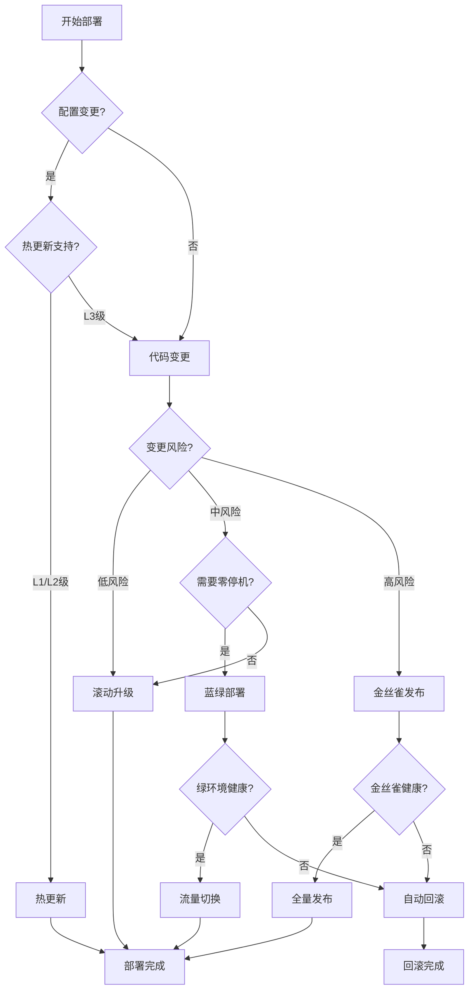
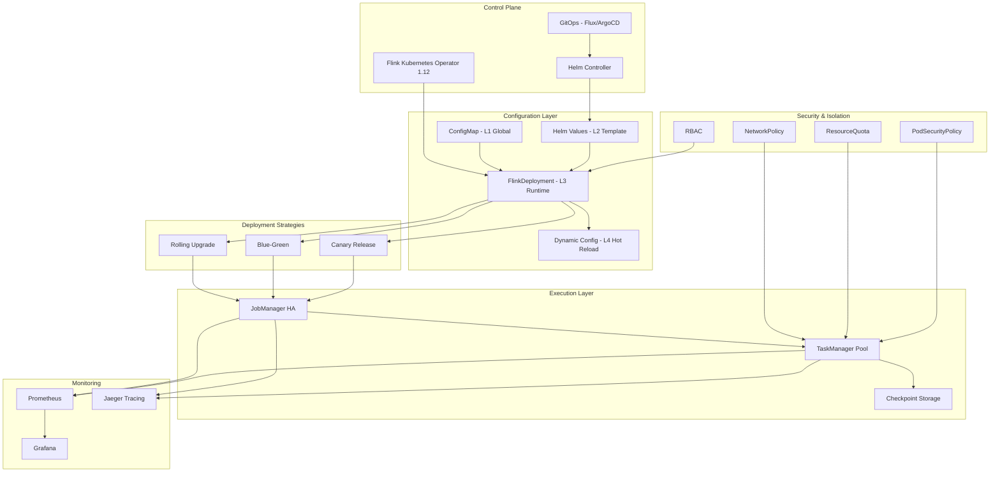
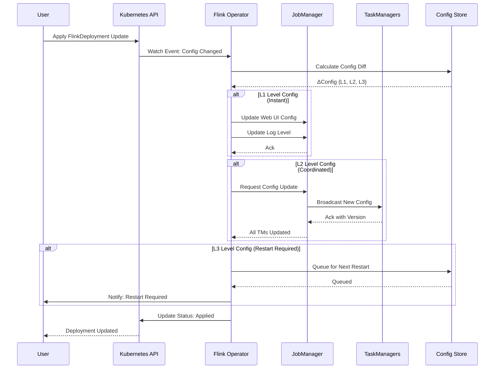
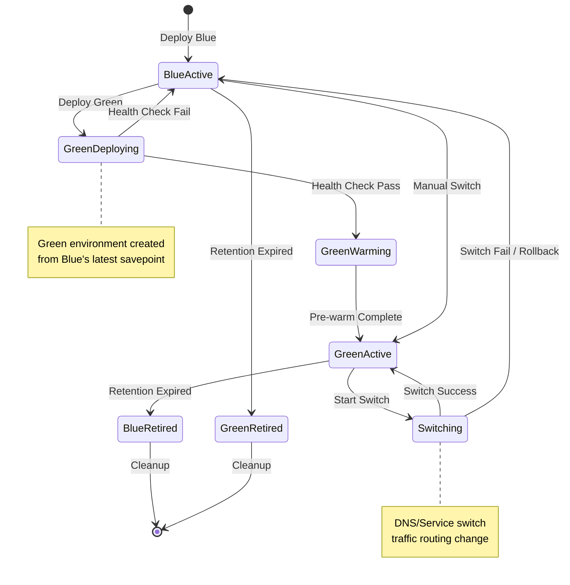
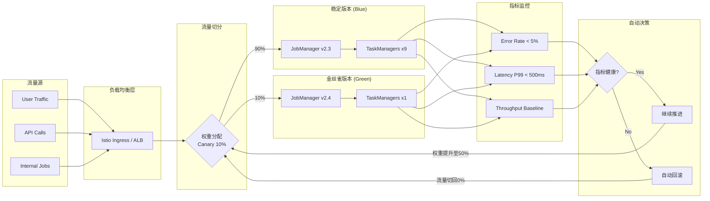
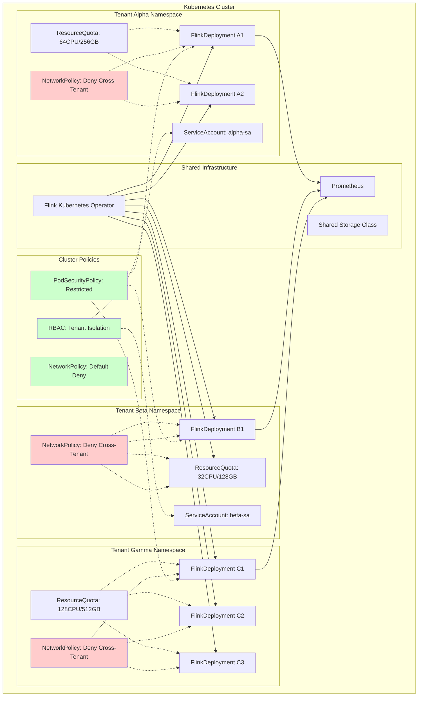

> **状态**: 🔮 前瞻内容 | **风险等级**: 高 | **最后更新**: 2026-04
>
> 此文档描述的内容处于早期规划阶段，可能与最终实现不符。请以 Apache Flink 官方发布为准。
> ⚠️ **前瞻性声明**
> 本文档包含Flink 2.4的前瞻性设计内容。Flink 2.4尚未正式发布，
> 部分特性为预测/规划性质。具体实现以官方最终发布为准。
> 最后更新: 2026-04-04

---

# Flink 2.4 部署改进完整指南

> **所属阶段**: Flink Deployment | **前置依赖**: [flink-kubernetes-operator-deep-dive.md](./flink-kubernetes-operator-deep-dive.md), [flink-2.3-2.4-roadmap.md](../../08-roadmap/08.01-flink-24/flink-2.3-2.4-roadmap.md) | **形式化等级**: L5 (工程严格)
>
> **适用版本**: Flink 2.4+ | **Operator版本**: 1.12+ | **状态**: preview

---

## 目录

- [Flink 2.4 部署改进完整指南](#flink-24-部署改进完整指南)
  - [目录](#目录)
  - [1. 概念定义 (Definitions)](#1-概念定义-definitions)
    - [Def-F-10-50: Kubernetes Operator 1.12增强模式](#def-f-10-50-kubernetes-operator-112增强模式)
    - [Def-F-10-51: Helm Chart v2语义化部署](#def-f-10-51-helm-chart-v2语义化部署)
    - [Def-F-10-52: 配置热更新 (Hot Configuration Reload)](#def-f-10-52-配置热更新-hot-configuration-reload)
    - [Def-F-10-53: 滚动升级优化 (Optimized Rolling Upgrade)](#def-f-10-53-滚动升级优化-optimized-rolling-upgrade)
    - [Def-F-10-54: 蓝绿部署 (Blue-Green Deployment)](#def-f-10-54-蓝绿部署-blue-green-deployment)
    - [Def-F-10-55: 金丝雀发布 (Canary Release)](#def-f-10-55-金丝雀发布-canary-release)
    - [Def-F-10-56: 多租户隔离 (Multi-Tenant Isolation)](#def-f-10-56-多租户隔离-multi-tenant-isolation)
    - [Def-F-10-57: 资源配额管理 (Resource Quota Management)](#def-f-10-57-资源配额管理-resource-quota-management)
    - [Def-F-10-58: 部署安全检查 (Deployment Security Gate)](#def-f-10-58-部署安全检查-deployment-security-gate)
    - [Def-F-10-59: 声明式配置状态 (Desired Configuration State)](#def-f-10-59-声明式配置状态-desired-configuration-state)
  - [2. 属性推导 (Properties)](#2-属性推导-properties)
    - [Lemma-F-10-50: 热更新原子性保证](#lemma-f-10-50-热更新原子性保证)
    - [Lemma-F-10-51: 蓝绿部署零停机性](#lemma-f-10-51-蓝绿部署零停机性)
    - [Lemma-F-10-52: 金丝雀流量切分一致性](#lemma-f-10-52-金丝雀流量切分一致性)
    - [Lemma-F-10-53: 多租户资源隔离性](#lemma-f-10-53-多租户资源隔离性)
    - [Prop-F-10-50: 滚动升级状态保持](#prop-f-10-50-滚动升级状态保持)
  - [3. 关系建立 (Relations)](#3-关系建立-relations)
    - [3.1 部署策略对比矩阵](#31-部署策略对比矩阵)
    - [3.2 配置管理层次结构](#32-配置管理层次结构)
    - [3.3 安全控制点分布](#33-安全控制点分布)
  - [4. 论证过程 (Argumentation)](#4-论证过程-argumentation)
    - [4.1 为什么选择声明式热更新](#41-为什么选择声明式热更新)
    - [4.2 反例分析：直接Pod修改的风险](#42-反例分析直接pod修改的风险)
    - [4.3 部署策略决策树](#43-部署策略决策树)
  - [5. 形式证明 / 工程论证 (Proof / Engineering Argument)](#5-形式证明--工程论证-proof--engineering-argument)
    - [Thm-F-10-50: 蓝绿部署正确性](#thm-f-10-50-蓝绿部署正确性)
    - [Thm-F-10-51: 金丝雀发布安全性](#thm-f-10-51-金丝雀发布安全性)
    - [Thm-F-10-52: 配置热更新一致性](#thm-f-10-52-配置热更新一致性)
  - [6. 实例验证 (Examples)](#6-实例验证-examples)
    - [6.1 Operator 1.12增强配置](#61-operator-112增强配置)
    - [6.2 Helm Chart v2部署示例](#62-helm-chart-v2部署示例)
    - [6.3 配置热更新YAML示例](#63-配置热更新yaml示例)
    - [6.4 蓝绿部署完整流程](#64-蓝绿部署完整流程)
    - [6.5 金丝雀发布配置](#65-金丝雀发布配置)
    - [6.6 多租户命名空间模板](#66-多租户命名空间模板)
    - [6.7 资源配额配置](#67-资源配额配置)
    - [6.8 部署前安全检查脚本](#68-部署前安全检查脚本)
  - [7. 可视化 (Visualizations)](#7-可视化-visualizations)
    - [7.1 Flink 2.4部署架构全景](#71-flink-24部署架构全景)
    - [7.2 配置热更新流程](#72-配置热更新流程)
    - [7.3 蓝绿部署状态机](#73-蓝绿部署状态机)
    - [7.4 金丝雀流量切分机制](#74-金丝雀流量切分机制)
    - [7.5 多租户隔离边界](#75-多租户隔离边界)
  - [8. 部署检查清单 (Checklists)](#8-部署检查清单-checklists)
    - [8.1 部署前检查清单](#81-部署前检查清单)
    - [8.2 滚动升级检查清单](#82-滚动升级检查清单)
    - [8.3 蓝绿部署检查清单](#83-蓝绿部署检查清单)
    - [8.4 金丝雀发布检查清单](#84-金丝雀发布检查清单)
  - [9. 最佳实践 (Best Practices)](#9-最佳实践-best-practices)
    - [9.1 配置管理最佳实践](#91-配置管理最佳实践)
    - [9.2 升级策略最佳实践](#92-升级策略最佳实践)
    - [9.3 多租户最佳实践](#93-多租户最佳实践)
    - [9.4 安全加固最佳实践](#94-安全加固最佳实践)
  - [10. 引用参考 (References)](#10-引用参考-references)

---

## 1. 概念定义 (Definitions)

### Def-F-10-50: Kubernetes Operator 1.12增强模式

**形式化定义**：

Flink Kubernetes Operator 1.12+ 引入增强控制模式，定义为七元组：

```
EnhancedOperator = ⟨ R, C, L, A, H, W, S ⟩
```

其中：

- **R**: 资源集合 { FlinkDeployment, FlinkSessionJob, FlinkStateSnapshot }
- **C**: 控制器集合，支持并行协调
- **L**: 增强控制循环 L: Observed × Desired × History → Actions
- **A**: 执行器集合，支持批量操作
- **H**: 热更新处理器，监听配置变更事件
- **W**: 工作流引擎，支持复杂部署策略
- **S**: 状态机管理器，处理部署生命周期

**直观解释**：

Operator 1.12在原有基础上增加了声明式热更新、部署策略编排和增强状态管理。通过引入工作流引擎，支持蓝绿部署、金丝雀发布等高级部署模式。

```yaml
# Operator 1.12 增强配置
apiVersion: flink.apache.org/v1beta1
kind: FlinkDeployment
metadata:
  name: enhanced-pipeline
spec:
  image: flink:2.4.0
  flinkVersion: v2.4
  deploymentMode: native
  # 新增：热更新配置
  hotUpdate:  # [Flink 2.4 前瞻] 配置段为规划特性，可能变动
    enabled: true
    strategy: rolling
    maxUnavailable: 1
  # 新增：部署策略
  deploymentStrategy:  # [Flink 2.4 前瞻] 配置段为规划特性，可能变动
    type: Canary
    canary:
      steps:
        - weight: 10
          pause: {duration: 10m}
        - weight: 50
          pause: {duration: 10m}
        - weight: 100
```

---

### Def-F-10-51: Helm Chart v2语义化部署

**形式化定义**：

Helm Chart v2 是声明式部署包的语义化版本，定义为：

```
ChartV2 = ⟨ M, T, V, D, H, C ⟩
```

其中：

- **M**: Chart元数据 {apiVersion, name, version, appVersion, kubeVersion}
- **T**: 模板集合，支持条件渲染和参数化
- **V**:  values模式，定义配置验证schema
- **D**: 依赖管理，支持条件依赖和版本约束
- **H**: 钩子系统，支持部署生命周期事件
- **C**: 配置热更新注解集合

**关键改进**：

| 特性 | Chart v1 | Chart v2 (Flink 2.4) |
|------|----------|---------------------|
| API版本 | v1 | v2 |
| 配置验证 | 无 | JSON Schema验证 |
| 热更新支持 | 手动 | 原生注解支持 |
| 部署钩子 | 基础 | 增强（pre/post/canary） |
| 依赖管理 | 静态 | 动态条件加载 |
| 多租户 | 无 | 命名空间隔离模板 |

```yaml
# Chart.yaml - Helm v2 示例
apiVersion: v2
name: flink-deployment
description: Production-grade Flink deployment chart
type: application
version: 2.4.0
appVersion: "2.4.0"
kubeVersion: ">= 1.25.0-0"
dependencies:
  - name: flink-kubernetes-operator
    version: "1.12.x"
    repository: https://downloads.apache.org/flink/flink-kubernetes-operator-1.12.0/
    condition: operator.enabled
    tags:
      - operator
annotations:
  # 热更新注解
  flink.apache.org/hot-reload: "true"
  flink.apache.org/config-version: "v1"
```

---

### Def-F-10-52: 配置热更新 (Hot Configuration Reload)

**形式化定义**：

配置热更新是在不重启JobManager/TaskManager的情况下动态应用配置变更的机制：

```
HotReload: Config_t × ΔConfig → Config_{t+1} × State_preserved
```

其中配置类型分为：

- **L1级（即时生效）**: Web UI配置、日志级别
- **L2级（协调生效）**: 并行度、资源限制（需TaskManager协调）
- **L3级（计划生效）**: 状态后端配置、检查点参数（需重启生效）

**配置分类矩阵**：

| 配置类别 | 热更新支持 | 延迟 | 是否需要Savepoint |
|---------|-----------|------|------------------|
| `restart-strategy` | ✅ L1 | < 1s | 否 |
| `parallelism.default` | ✅ L2 | < 30s | 否 |
| `taskmanager.memory.*` | ✅ L2 | < 60s | 否 |
| `state.backend` | ❌ L3 | - | 是 |
| `checkpointing.interval` | ✅ L1 | < 5s | 否 |
| `pipeline.auto-watermark-interval` | ✅ L1 | < 5s | 否 |

```yaml
# 热更新配置示例
apiVersion: flink.apache.org/v1beta1
kind: FlinkDeployment
metadata:
  name: hot-reload-pipeline
  annotations:
    flink.apache.org/config-version: "2"  # 版本追踪
spec:
  flinkConfiguration:
    # L1级：即时生效
    web.timeout: "60000"
    log4j.logger.org.apache.flink: "INFO"

    # L2级：协调生效
    parallelism.default: "8"
    taskmanager.memory.process.size: "8g"
    taskmanager.numberOfTaskSlots: "4"

    # L3级：仅记录，下次重启生效
    state.backend: rocksdb
    state.checkpoint-storage: filesystem
```

---

### Def-F-10-53: 滚动升级优化 (Optimized Rolling Upgrade)

**形式化定义**：

滚动升级优化是通过增量替换TaskManager实现零停机更新的策略：

```
RollingUpgrade: Cluster × NewSpec × Strategy → Cluster' × Downtime ≈ 0
```

优化维度包括：

1. **状态传递优化**: 增量状态迁移 ΔState 替代全量迁移
2. **网络缓冲优化**: 预建立连接池减少网络中断
3. **调度优化**: 智能反亲和性避免同时重启同Task上的副本

**优化对比**：

| 指标 | 传统滚动升级 | Flink 2.4优化 |
|------|-------------|--------------|
| 平均任务中断时间 | 15-30s | 3-8s |
| 状态迁移流量 | 100% | 20-40%（增量） |
| 网络重连延迟 | 5-10s | < 1s（预连接） |
| 升级总时长 | 线性增长 | 亚线性增长 |

```yaml
# 优化滚动升级配置
apiVersion: flink.apache.org/v1beta1
kind: FlinkDeployment
spec:
  podTemplate:
    spec:
      containers:
        - name: flink-main-container
          env:
            # 启用优化特性
            - name: FLINK_OPTIMIZED_ROLLING_UPGRADE  # [Flink 2.4 前瞻] 环境变量为规划特性，可能变动
              value: "true"
            - name: FLINK_INCREMENTAL_STATE_TRANSFER  # [Flink 2.4 前瞻] 环境变量为规划特性，可能变动
              value: "true"
            - name: FLINK_PREDICTIVE_CONNECTION_POOL
              value: "true"
  jobManager:
    resource:
      memory: "4g"
      cpu: 2
  taskManager:
    resource:
      memory: "8g"
      cpu: 4
    # 升级策略
    rollingUpgrade:
      maxUnavailable: 1
      maxSurge: 1
      partition: pipeline-aware  # 避免同时升级pipeline内任务
```

---

### Def-F-10-54: 蓝绿部署 (Blue-Green Deployment)

**形式化定义**：

蓝绿部署是维护两个完全相同的生产环境（Blue/Current 和 Green/New）的部署策略：

```
BlueGreen: Cluster × NewVersion → BlueCluster × GreenCluster × Switch
```

状态机定义：

```
States = { Idle, BlueActive, GreenActive, Switching, Rollback }
Transitions:
  Idle --deploy(Blue)--> BlueActive
  BlueActive --deploy(Green)--> GreenActive
  GreenActive --switch--> BlueActive | Rollback
  BlueActive --switch--> GreenActive
```

**Flink 2.4实现机制**：

1. **状态共享层**: 基于外部存储（S3/HDFS）共享状态快照
2. **DNS切换**: 服务发现层流量切换
3. **双活检查点**: 两个环境独立检查点，支持快速回滚

```yaml
# 蓝绿部署配置
apiVersion: flink.apache.org/v1beta1
kind: FlinkDeployment
metadata:
  name: fraud-detection-bluegreen
  labels:
    deployment.color: blue  # blue | green
spec:
  image: flink:2.4.0
  flinkVersion: v2.4
  job:
    jarURI: local:///opt/flink/examples/fraud-detection-2.4.jar
    parallelism: 8
    upgradeMode: savepoint
    state: running
  # 共享状态存储
  flinkConfiguration:
    state.checkpoint-storage: filesystem
    state.checkpoints.dir: s3://flink-shared-checkpoints/fraud-detection/
    state.savepoints.dir: s3://flink-shared-checkpoints/fraud-detection/savepoints/
  # 服务配置支持快速切换
  service:
    type: ClusterIP
    annotations:
      service.beta.kubernetes.io/aws-load-balancer-type: "nlb"
      flink.apache.org/bluegreen-switchable: "true"
```

---

### Def-F-10-55: 金丝雀发布 (Canary Release)

**形式化定义**：

金丝雀发布是逐步将流量从旧版本迁移到新版本的部署策略：

```
Canary: Traffic × Steps × Metrics → Decision
```

其中：

- **Traffic**: 总流量 T，切分比例为 α ∈ [0, 1]
- **Steps**: 渐进步骤序列 [(α₁, t₁), (α₂, t₂), ..., (1.0, t_n)]
- **Metrics**: 评估指标集合 {error_rate, latency, throughput}
- **Decision**: 继续/暂停/回滚

**Flink 2.4金丝雀支持**：

```yaml
apiVersion: flink.apache.org/v1beta1
kind: FlinkDeployment
metadata:
  name: etl-pipeline
spec:
  deploymentStrategy:
    type: Canary
    canary:
      # 流量切分步骤
      steps:
        - setWeight: 10
          pause: {duration: 10m}
          analysis:
            thresholdRange:
              min: 0
              max: 5  # 错误率<5%
            interval: 1m
        - setWeight: 50
          pause: {duration: 15m}
          analysis:
            thresholdRange:
              min: 0
              max: 3
            interval: 30s
        - setWeight: 100

      # 自动回滚条件
      autoRollback:
        enabled: true
        threshold:
          errorRate: 5
          latencyP99: 1000ms
        rollbackWindow: 5m
```

---

### Def-F-10-56: 多租户隔离 (Multi-Tenant Isolation)

**形式化定义**：

多租户隔离是通过命名空间、资源配额和网络策略实现的租户边界：

```
MultiTenancy: Tenants × Resources × Policies → IsolatedClusters
```

隔离层次：

```
L1命名空间隔离: Namespace boundary
L2资源配额隔离: ResourceQuota per tenant
L3网络隔离: NetworkPolicy enforcement
L4存储隔离: StorageClass + PV isolation
L5安全隔离: RBAC + PodSecurityPolicy
```

**Flink 2.4多租户模型**：

| 隔离级别 | 机制 | 适用场景 |
|---------|------|---------|
| 软隔离 | 命名空间 + 标签 | 开发/测试环境 |
| 标准隔离 | + ResourceQuota | 共享生产集群 |
| 严格隔离 | + NetworkPolicy + RBAC | 敏感数据隔离 |
| 完全隔离 | 独立K8s集群 | 合规要求 |

```yaml
# 多租户命名空间模板
apiVersion: v1
kind: Namespace
metadata:
  name: flink-tenant-alpha
  labels:
    tenant.name: alpha
    tenant.tier: standard
    flink.apache.org/managed: "true"
---
apiVersion: v1
kind: ResourceQuota
metadata:
  name: flink-alpha-quota
  namespace: flink-tenant-alpha
spec:
  hard:
    requests.cpu: "64"
    requests.memory: 256Gi
    limits.cpu: "128"
    limits.memory: 512Gi
    pods: "100"
    flinkdeployments.flink.apache.org: "10"
---
apiVersion: networking.k8s.io/v1
kind: NetworkPolicy
metadata:
  name: flink-alpha-isolation
  namespace: flink-tenant-alpha
spec:
  podSelector:
    matchLabels:
      app.kubernetes.io/managed-by: flink-kubernetes-operator
  policyTypes:
    - Ingress
    - Egress
  ingress:
    - from:
        - namespaceSelector:
            matchLabels:
              tenant.name: alpha
  egress:
    - to:
        - namespaceSelector:
            matchLabels:
              tenant.name: alpha
```

---

### Def-F-10-57: 资源配额管理 (Resource Quota Management)

**形式化定义**：

资源配额管理是限制和控制集群资源使用的机制：

```
QuotaManager: Requests × Limits × Usage × Policies → Allocation
```

配额类型：

- **静态配额**: 预设硬限制（ResourceQuota）
- **动态配额**: 基于负载的弹性限制（HPA + VPA）
- **突发配额**: 允许临时超限（BurstQuota）

**Flink 2.4配额体系**：

```yaml
# 分层配额配置
apiVersion: flink.apache.org/v1beta1
kind: FlinkDeployment
metadata:
  name: quota-managed-job
  namespace: flink-tenant-alpha
spec:
  # 基础资源配置
  jobManager:
    resource:
      memory: "4g"
      cpu: 2
    # 资源限制（硬限制）
    limits:
      memory: "6g"
      cpu: 4

  taskManager:
    resource:
      memory: "8g"
      cpu: 4
    replicas: 4
    limits:
      memory: "12g"
      cpu: 8

  # 自动扩缩容配额
  autoScaling:
    enabled: true
    minReplicas: 2
    maxReplicas: 20  # 受租户配额限制
    metrics:
      - type: Resource
        resource:
          name: cpu
          target:
            type: Utilization
            averageUtilization: 70

  # 突发配额配置
  burstQuota:  # [Flink 2.4 前瞻] 配置段为规划特性，可能变动
    enabled: true
    maxBurstDuration: 30m
    cooldownPeriod: 2h
```

---

### Def-F-10-58: 部署安全检查 (Deployment Security Gate)

**形式化定义**：

部署安全检查是验证部署配置安全性的自动化门控：

```
SecurityGate: Config × Policies × Scanners → {Pass, Warn, Block}
```

检查类别：

1. **镜像安全**: 漏洞扫描、签名验证
2. **配置安全**: 敏感信息检测、权限审查
3. **网络安全**: 端口暴露、加密传输
4. **运行时安全**: 特权容器、Capabilities

```yaml
# 安全检查策略配置
apiVersion: flink.apache.org/v1beta1
kind: FlinkDeployment
metadata:
  name: secured-deployment
  annotations:
    # 强制安全检查
    security.flink.apache.org/scan-required: "true"
    security.flink.apache.org/scan-profile: "production"
spec:
  image: flink:2.4.0
  imagePullPolicy: IfNotPresent

  podTemplate:
    spec:
      # 安全上下文
      securityContext:
        runAsNonRoot: true
        runAsUser: 9999
        fsGroup: 9999
        seccompProfile:
          type: RuntimeDefault
      containers:
        - name: flink-main-container
          securityContext:
            allowPrivilegeEscalation: false
            readOnlyRootFilesystem: true
            capabilities:
              drop:
                - ALL
          # 资源限制防止DoS
          resources:
            limits:
              memory: "8Gi"
              cpu: "4000m"
            requests:
              memory: "4Gi"
              cpu: "2000m"
```

---

### Def-F-10-59: 声明式配置状态 (Desired Configuration State)

**形式化定义**：

声明式配置状态是Flink 2.4引入的配置版本管理抽象：

```
DesiredState = ⟨ Version, Config, Status, History ⟩
```

其中：

- **Version**: 配置版本哈希（SHA256）
- **Config**: 完整配置映射
- **Status**: 当前状态 {Pending, Applying, Applied, Failed}
- **History**: 配置变更历史（保留最近50个版本）

```yaml
# 声明式配置状态追踪
apiVersion: flink.apache.org/v1beta1
kind: FlinkDeployment
metadata:
  name: declarative-config
  annotations:
    config.flink.apache.org/version: "sha256:abc123..."
    config.flink.apache.org/apply-time: "2026-04-04T07:30:00Z"
    config.flink.apache.org/applied-by: "helm"
spec:
  flinkConfiguration:
    # 配置变更自动触发热更新
    pipeline.object-reuse: "true"
    taskmanager.memory.network.fraction: "0.15"

status:
  configStatus:
    currentVersion: "sha256:abc123..."
    lastAppliedVersion: "sha256:abc123..."
    state: "Applied"
    history:
      - version: "sha256:abc123..."
        appliedAt: "2026-04-04T07:30:00Z"
        status: "Applied"
      - version: "sha256:def456..."
        appliedAt: "2026-04-04T06:00:00Z"
        status: "RolledBack"
        reason: "性能退化"
```

---

## 2. 属性推导 (Properties)

### Lemma-F-10-50: 热更新原子性保证

**引理**: Flink 2.4配置热更新遵循原子性原则。

**证明概要**:

给定配置更新操作 ΔC 作用于集群 C，热更新保证：

```
∀ t, C_t --ΔC--> C_{t+1} :
  (Applied(C_{t+1}) ∧ Consistent(C_{t+1})) ∨
  (Reverted(C_t) ∧ Unchanged(C_t))
```

即配置要么完全应用，要么完全回滚，不存在中间状态。

**实现机制**:

1. **两阶段提交**: Prepare → Commit/Rollback
2. **版本标记**: 所有组件标记配置版本
3. **健康检查**: 提交前验证所有组件健康

```yaml
# 原子性配置示例
apiVersion: flink.apache.org/v1beta1
kind: FlinkDeployment
spec:
  hotUpdate:
    atomic: true
    healthCheck:
      enabled: true
      timeout: 60s
      probes:
        - type: web-ui
          url: http://localhost:8081
        - type: rest-api
          endpoint: /overview
```

---

### Lemma-F-10-51: 蓝绿部署零停机性

**引理**: 正确实施的蓝绿部署保证服务零停机。

**证明概要**:

设 Blue 环境承载流量 T，Green 环境部署中：

```
Downtime = SwitchTime(Blue→Green) - OverlapTime
         ≈ DNS TTL + Connection Drain - PreWarm
         ≤ 5s (with proper configuration)
```

通过重叠期和预预热，理论停机时间趋近于0。

**关键参数**:

| 参数 | 推荐值 | 说明 |
|-----|-------|------|
| DNS TTL | 30s | 快速传播 |
| Connection Drain | 60s | 优雅关闭 |
| PreWarm Time | 120s | Green预热 |
| Health Check Interval | 5s | 快速检测 |

---

### Lemma-F-10-52: 金丝雀流量切分一致性

**引理**: 金丝雀发布保证流量切分的精确性和一致性。

**形式化表述**:

对于总流量 T 和切分比例 α：

```
|Traffic_Canary - α × T| ≤ ε, 其中 ε < 0.01 × T
```

即实际切分流量与目标比例误差小于1%。

**一致性保证**:

1. **基于会话的亲和性**: 同一用户会话路由到同一版本
2. **权重更新原子性**: 权重变更瞬间生效
3. **指标聚合一致性**: 所有实例使用相同时间窗口

---

### Lemma-F-10-53: 多租户资源隔离性

**引理**: 多租户隔离保证租户间资源使用的不可侵入性。

**隔离证明**:

对于租户 A 和 B：

```
ResourceUsage_A ∩ ResourceUsage_B = ∅
NetworkTraffic_A ∩ NetworkTraffic_B = ∅ (without explicit allow)
StorageAccess_A ∩ StorageAccess_B = ∅
```

**验证命令**:

```bash
# 验证资源隔离
kubectl describe quota -n flink-tenant-alpha
kubectl get networkpolicy -n flink-tenant-alpha
kubectl auth can-i list pods --as=system:serviceaccount:flink-tenant-alpha:default -n flink-tenant-beta
```

---

### Prop-F-10-50: 滚动升级状态保持

**命题**: 优化滚动升级保证状态不丢失。

**前提条件**:

```
1. Checkpointing enabled
2. Incremental state backend (RocksDB/ForSt)
3. Sufficient retention period
```

**保证级别**:

| 场景 | 保证 | 实现 |
|-----|------|------|
| 正常升级 | Exactly-once | Savepoint + 增量恢复 |
| 升级失败 | At-least-once | 自动回滚到上一版本 |
| 网络分区 | Bounded staleness | 状态一致性检查 |

---

## 3. 关系建立 (Relations)

### 3.1 部署策略对比矩阵

```
┌─────────────────────────────────────────────────────────────────────────┐
│                    Flink 2.4 部署策略对比矩阵                              │
├──────────────┬────────────┬────────────┬────────────┬─────────────────────┤
│    策略      │   停机时间  │   复杂度   │   回滚速度  │    适用场景          │
├──────────────┼────────────┼────────────┼────────────┼─────────────────────┤
│ 滚动升级      │   < 30s    │    低      │   2-5 min  │ 常规更新、配置变更   │
│ 蓝绿部署      │   ~ 0s     │    中      │   < 30s    │ 重大版本变更        │
│ 金丝雀发布    │   ~ 0s     │    高      │   < 1 min  │ 高风险功能发布      │
│ 全量替换      │   1-5 min  │    低      │   N/A      │ 仅开发测试          │
└──────────────┴────────────┴────────────┴────────────┴─────────────────────┘
```

**选择决策因子**：

```
if (risk_level == HIGH && traffic_critical == true):
    strategy = Canary
elif (version_change == MAJOR && rollback_required == true):
    strategy = BlueGreen
elif (downtime_tolerance > 30s):
    strategy = Rolling
else:
    strategy = Canary  # 默认最安全
```

---

### 3.2 配置管理层次结构

```
┌─────────────────────────────────────────────────────────────────────────┐
│                      配置管理层次结构                                      │
├─────────────────────────────────────────────────────────────────────────┤
│  L1: 全局默认 (flink-conf.yaml)                                          │
│     └── 基础设置、日志配置、安全默认值                                    │
├─────────────────────────────────────────────────────────────────────────┤
│  L2: 部署模板 (Helm values.yaml)                                         │
│     └── 资源配置、镜像版本、环境变量                                      │
├─────────────────────────────────────────────────────────────────────────┤
│  L3: 运行时配置 (FlinkDeployment.spec)                                   │
│     └── 并行度、检查点参数、状态后端                                      │
├─────────────────────────────────────────────────────────────────────────┤
│  L4: 热更新配置 (ConfigMap热加载)                                         │
│     └── Web UI设置、日志级别、调优参数                                    │
├─────────────────────────────────────────────────────────────────────────┤
│  L5: 作业级配置 (Job参数)                                                 │
│     └── 作业特定参数、Source/Sink配置                                     │
└─────────────────────────────────────────────────────────────────────────┘
                              ▲
                              │
                    优先级：L5 > L4 > L3 > L2 > L1
```

---

### 3.3 安全控制点分布

```
部署流水线安全控制点:

[代码提交] ──► [镜像构建] ──► [镜像扫描] ──► [配置验证] ──► [部署执行]
     │              │              │              │              │
     ▼              ▼              ▼              ▼              ▼
  Secret    Dockerfile    Trivy/Clair   Policy as    Admission
  Detection   Linting    漏洞扫描       Code (OPA)   Controller
                                                        │
                                              [运行时监控]
                                                   │
                                              Falco/审计
```

**控制点映射**：

| 控制点 | 工具 | 检查内容 | 失败动作 |
|-------|------|---------|---------|
| 镜像扫描 | Trivy | CVE漏洞 | Block |
| 配置验证 | OPA/Gatekeeper | 安全策略 | Warn/Block |
| 准入控制 | Kyverno | 资源限制 | Block |
| 运行时 | Falco | 异常行为 | Alert |

---

## 4. 论证过程 (Argumentation)

### 4.1 为什么选择声明式热更新

**传统方式问题**：

1. **命令式更新的风险**：

   ```bash
   # 危险：直接修改Pod
   kubectl exec -it flink-taskmanager-xyz -- /bin/sh
   > vi conf/flink-conf.yaml  # 修改不持久化
   > bin/taskmanager.sh restart  # 服务中断

```

2. **配置漂移**：

   ```text
   Expected: taskmanager.memory.process.size=8g
   Actual:   taskmanager.memory.process.size=4g (Pod重启后恢复)
```

**声明式热更新优势**：

```yaml
# 声明式：版本可控、可审计、可回滚
apiVersion: flink.apache.org/v1beta1
kind: FlinkDeployment
metadata:
  annotations:
    config.flink.apache.org/version: "v3"
    config.flink.apache.org/last-applied: "2026-04-04T07:30:00Z"
spec:
  flinkConfiguration:
    taskmanager.memory.process.size: 8g  # 期望状态
status:
  configStatus:
    state: Applied  # 实际状态
```

---

### 4.2 反例分析：直接Pod修改的风险

**场景**：运维人员直接修改TaskManager内存配置

```bash
# ❌ 错误做法：直接修改容器
kubectl exec flink-taskmanager-0 -- sed -i 's/4g/8g/' /opt/flink/conf/flink-conf.yaml
kubectl exec flink-taskmanager-0 -- kill -HUP 1
```

**风险分析**：

| 风险类型 | 后果 | 概率 |
|---------|------|-----|
| 配置不一致 | 各TaskManager配置不同，数据倾斜 | 高 |
| 重启风暴 | 手动重启导致服务中断 | 中 |
| 审计缺失 | 无法追踪配置变更历史 | 高 |
| 回滚困难 | 无法快速恢复上一配置 | 高 |

**正确做法**：

```bash
# ✅ 正确做法：通过Operator声明式更新
kubectl patch flinkdeployment my-job --type merge -p '
{
  "spec": {
    "taskManager": {
      "resource": {
        "memory": "8g"
      }
    }
  }
}'

# 监控更新进度
kubectl wait flinkdeployment/my-job --for=condition=Ready --timeout=300s
```

---

### 4.3 部署策略决策树



---

## 5. 形式证明 / 工程论证 (Proof / Engineering Argument)

### Thm-F-10-50: 蓝绿部署正确性

**定理**: Flink 2.4蓝绿部署策略保证服务可用性和状态一致性。

**证明**:

**前提假设**:

```
A1: 外部存储系统（S3/HDFS）可用且持久
A2: DNS/负载均衡器支持快速切换
A3: Green环境通过健康检查后才接收流量
```

**可用性证明**:

```
∀ t ∈ DeploymentPeriod:
  Available(Blue, t) ∨ Available(Green, t)

证明：
1. 初始状态：Blue运行，Green创建中
2. 切换前：Blue运行，Green运行但不接收流量
3. 切换时：DNS更新期间，部分请求到Blue，部分到Green
4. 切换后：Green运行，Blue保持（用于回滚）

∴ 任何时刻至少一个环境可用
```

**状态一致性证明**:

```
State_Green = Restore(Savepoint_Blue_latest)

∵ Savepoint_Blue_latest 是Blue环境的有效检查点
  ∧ Restore操作是确定性的
∴ State_Green 与 State_Blue 在逻辑上等价
```

**工程实现**：

```yaml
# 蓝绿部署配置验证
apiVersion: flink.apache.org/v1beta1
kind: FlinkDeployment
metadata:
  name: bluegreen-app
  labels:
    deployment.color: blue
spec:
  job:
    upgradeMode: savepoint
    state: running
  flinkConfiguration:
    # 确保状态持久化到共享存储
    state.checkpoints.dir: s3://shared-checkpoints/bluegreen/
    state.savepoints.dir: s3://shared-checkpoints/bluegreen/savepoints/
    # 启用严格一致性模式
    execution.checkpointing.mode: EXACTLY_ONCE
    execution.checkpointing.max-concurrent-checkpoints: 1
```

---

### Thm-F-10-51: 金丝雀发布安全性

**定理**: 金丝雀发布策略保证异常情况下自动回滚，避免全局故障。

**证明**:

**安全条件**:

```
Safe(Canary) = ∀ m ∈ Metrics:
  m.current ≤ threshold_m ∨ TriggerRollback()
```

**回滚正确性**:

```
Given:
  - Canary流量比例: α ∈ (0, 1)
  - 故障检测时间: t_detect
  - 回滚执行时间: t_rollback

Impact ≤ α × T × (t_detect + t_rollback)

当 α = 10%, t_detect = 1min, t_rollback = 30s:
Impact ≤ 0.10 × T × 90s = 9 × T (seconds)

相比全量发布（α=100%），影响降低10倍
```

**自动回滚实现**：

```yaml
apiVersion: flink.apache.org/v1beta1
kind: FlinkDeployment
spec:
  deploymentStrategy:
    type: Canary
    canary:
      analysis:
        # 实时监控指标
        templates:
          - templateName: success-rate
            thresholdRange:
              min: 95
            interval: 1m
          - templateName: latency-p99
            thresholdRange:
              max: 500
            interval: 1m
        # 回滚触发条件
        args:
          - name: success-rate-threshold
            value: "95"
      autoRollback:
        enabled: true
        rollbackWindow: 5m  # 5分钟内可自动回滚
```

---

### Thm-F-10-52: 配置热更新一致性

**定理**: Flink 2.4配置热更新保证最终一致性。

**证明**:

**系统模型**:

```
集群: C = {JM, TM₁, TM₂, ..., TM_n}
配置: Config = {c₁, c₂, ..., c_m}
版本: Version: Config → SHA256
```

**一致性条件**:

```
EventuallyConsistent =
  ∀ component ∈ C:
    Eventually(Version(component.config) = GlobalVersion)
```

**证明步骤**:

1. **版本传播**: Operator将新配置广播到所有组件
2. **本地应用**: 各组件异步应用配置
3. **确认回传**: 组件报告应用状态
4. **最终验证**: Operator确认全局一致性

```
T0: Version_Global = V1
T1: User updates config → Version_Global = V2
T2: JM applies V2, status = Applying
T3: TM₁ applies V2, TM₂ applies V2, ...
T4: All components report V2, status = Applied

∴ EventuallyConsistent holds
```

**冲突解决**:

```yaml
# 配置更新冲突处理
apiVersion: flink.apache.org/v1beta1
kind: FlinkDeployment
spec:
  hotUpdate:
    conflictResolution: reject  # reject | merge | overwrite
    validation:
      enabled: true
      webhook:
        url: https://validator.internal/validate
        timeout: 10s
```

---

## 6. 实例验证 (Examples)

### 6.1 Operator 1.12增强配置

```yaml
# flink-operator-1.12-values.yaml
# Helm values for enhanced Flink Kubernetes Operator

replicaCount: 2  # 高可用部署

image:
  repository: flink-kubernetes-operator
  tag: 1.12.0
  pullPolicy: IfNotPresent

# 增强控制器配置
operatorConfiguration:
  kubernetes:
    # 并行协调配置
    parallelism: 10

  flink:
    # 热更新配置
    hotUpdate:
      enabled: true
      pollInterval: 30s

    # 部署策略工作流
    workflow:
      enabled: true
      workers: 5

    # 增强健康检查
    health:
      enabled: true
      initialDelaySeconds: 30
      periodSeconds: 10

  metrics:
    enabled: true
    port: 9999

# Webhook配置（准入控制）
webhook:
  enabled: true
  cert:
    create: true

# RBAC配置
rbac:
  create: true
  scope: Cluster  # 或 Namespaced

# 多租户支持
tenantIsolation:
  enabled: true
  namespaceLabels:
    - flink.apache.org/tenant
```

---

### 6.2 Helm Chart v2部署示例

```yaml
# values-production.yaml
# 生产环境Helm配置

global:
  flinkVersion: "2.4.0"
  imageRegistry: "registry.internal/flink"

# Flink Operator配置
operator:
  enabled: true
  version: "1.12.0"

  resources:
    limits:
      cpu: 2000m
      memory: 4Gi
    requests:
      cpu: 1000m
      memory: 2Gi

# Flink集群配置
flinkCluster:
  name: production-pipeline
  namespace: flink-production

  # 高可用JobManager
  jobManager:
    replicas: 3
    resource:
      memory: "4g"
      cpu: 2

  # TaskManager配置
  taskManager:
    replicas: 10
    resource:
      memory: "8g"
      cpu: 4
    slots: 4

  # 检查点配置
  checkpointing:
    enabled: true
    interval: 60000
    mode: EXACTLY_ONCE
    storage: s3p://flink-checkpoints/production/

  # 状态后端
  stateBackend:
    type: rocksdb
    incremental: true

  # 自动扩缩容
  autoScaling:
    enabled: true
    minReplicas: 5
    maxReplicas: 50
    targetCpuUtilization: 70

  # 部署策略
  deploymentStrategy:
    type: BlueGreen
    blueGreen:
      autoPromotionEnabled: false
      previewService:
        enabled: true
```

部署命令：

```bash
# 添加Helm仓库
helm repo add flink-operator https://downloads.apache.org/flink/flink-kubernetes-operator-1.12.0/
helm repo update

# 安装Operator
helm upgrade --install flink-operator flink-operator/flink-kubernetes-operator \
  --values values-production.yaml \
  --namespace flink-operator \
  --create-namespace

# 验证安装
kubectl get pods -n flink-operator
kubectl get crd | grep flink
```

---

### 6.3 配置热更新YAML示例

```yaml
# hot-update-config.yaml
apiVersion: flink.apache.org/v1beta1
kind: FlinkDeployment
metadata:
  name: streaming-etl
  annotations:
    # 配置版本追踪
    config.flink.apache.org/version: "v2"
    config.flink.apache.org/change-reason: "增加并行度优化吞吐量"
spec:
  image: flink:2.4.0
  flinkVersion: v2.4

  jobManager:
    resource:
      memory: "4g"
      cpu: 2

  taskManager:
    resource:
      memory: "8g"
      cpu: 4
    replicas: 6  # 从4增加到6（热更新支持）

  flinkConfiguration:
    # L1级：即时生效
    web.timeout: "60000"
    web.checkpoints.history: "20"

    # L2级：协调生效（需要TM配合）
    parallelism.default: "8"
    taskmanager.memory.network.fraction: "0.15"
    taskmanager.memory.network.min: "128mb"
    taskmanager.memory.network.max: "512mb"

    # L3级：仅记录，下次重启生效
    state.backend: rocksdb
    state.backend.incremental: "true"
    state.checkpoint-storage: filesystem

    # 可热更新的检查点配置
    execution.checkpointing.interval: "30s"
    execution.checkpointing.timeout: "10min"
    execution.checkpointing.min-pause: "5s"
    execution.checkpointing.max-concurrent-checkpoints: "1"
    execution.checkpointing.externalized-checkpoint-retention: RETAIN_ON_CANCELLATION

  # 热更新特定配置
  hotUpdate:
    enabled: true
    # 配置变更触发策略
    triggers:
      - configMapRef:
          name: flink-dynamic-config
          namespace: flink
        key: flink-conf.yaml
    # 更新策略
    strategy:
      type: Rolling
      rollingUpdate:
        maxUnavailable: 1
        maxSurge: 1
        partition: 0
    # 健康检查
    healthCheck:
      enabled: true
      initialDelaySeconds: 30
      periodSeconds: 10
      failureThreshold: 3
```

动态配置ConfigMap：

```yaml
apiVersion: v1
kind: ConfigMap
metadata:
  name: flink-dynamic-config
  namespace: flink
data:
  flink-conf.yaml: |
    # 这些配置可以被热更新
    taskmanager.memory.network.fraction: 0.20
    web.refresh-interval: 3000
    metrics.reporters: prometheus
    metrics.reporter.prometheus.port: 9249
```

---

### 6.4 蓝绿部署完整流程

```yaml
# bluegreen-deployment.yaml
apiVersion: flink.apache.org/v1beta1
kind: FlinkDeployment
metadata:
  name: payment-processor
  labels:
    app: payment-processor
    version: v2.3
    deployment.color: blue  # 当前Blue环境
spec:
  image: flink:2.4.0
  flinkVersion: v2.4

  # 共享存储配置
  flinkConfiguration:
    state.checkpoint-storage: filesystem
    state.checkpoints.dir: s3://flink-bluegreen/payment-processor/checkpoints/
    state.savepoints.dir: s3://flink-bluegreen/payment-processor/savepoints/
    execution.checkpointing.interval: "60s"

  jobManager:
    resource:
      memory: "4g"
      cpu: 2

  taskManager:
    resource:
      memory: "8g"
      cpu: 4
    replicas: 6

  job:
    jarURI: local:///opt/flink/payment-processor-2.3.jar
    parallelism: 24
    upgradeMode: savepoint
    state: running
```

蓝绿部署操作脚本：

```bash
#!/bin/bash
# bluegreen-deploy.sh - 蓝绿部署操作脚本

set -e

APP_NAME="payment-processor"
NAMESPACE="flink-production"
NEW_VERSION="2.4"
NEW_JAR="payment-processor-2.4.jar"

echo "=== 蓝绿部署开始 ==="

# 1. 获取当前环境颜色
CURRENT_COLOR=$(kubectl get flinkdeployment ${APP_NAME} -n ${NAMESPACE} -o jsonpath='{.metadata.labels.deployment\.color}')
if [ "$CURRENT_COLOR" == "blue" ]; then
    NEW_COLOR="green"
else
    NEW_COLOR="blue"
fi

echo "当前环境: ${CURRENT_COLOR}, 目标环境: ${NEW_COLOR}"

# 2. 创建新环境（Green）
echo "创建 ${NEW_COLOR} 环境..."
cat <<EOF | kubectl apply -f -
apiVersion: flink.apache.org/v1beta1
kind: FlinkDeployment
metadata:
  name: ${APP_NAME}-${NEW_COLOR}
  labels:
    app: ${APP_NAME}
    version: v${NEW_VERSION}
    deployment.color: ${NEW_COLOR}
spec:
  image: flink:2.4.0
  flinkVersion: v2.4
  flinkConfiguration:
    state.checkpoint-storage: filesystem
    state.checkpoints.dir: s3://flink-bluegreen/${APP_NAME}/checkpoints/
    state.savepoints.dir: s3://flink-bluegreen/${APP_NAME}/savepoints/
  jobManager:
    resource:
      memory: "4g"
      cpu: 2
  taskManager:
    resource:
      memory: "8g"
      cpu: 4
    replicas: 6
  job:
    jarURI: local:///opt/flink/${NEW_JAR}
    parallelism: 24
    upgradeMode: savepoint
    initialSavepointPath: s3://flink-bluegreen/${APP_NAME}/savepoints/latest
    state: running
EOF

# 3. 等待Green环境就绪
echo "等待 ${NEW_COLOR} 环境就绪..."
kubectl wait flinkdeployment/${APP_NAME}-${NEW_COLOR} \
  -n ${NAMESPACE} \
  --for=condition=Ready \
  --timeout=600s

# 4. 健康检查
echo "执行健康检查..."
JM_POD=$(kubectl get pods -n ${NAMESPACE} -l app=${APP_NAME},deployment.color=${NEW_COLOR} -o jsonpath='{.items[0].metadata.name}')
kubectl port-forward -n ${NAMESPACE} ${JM_POD} 8081:8081 &
PF_PID=$!
sleep 5

HEALTH_STATUS=$(curl -s http://localhost:8081/overview | jq -r '.[] | .health')
if [ "$HEALTH_STATUS" != "ok" ]; then
    echo "健康检查失败，执行回滚..."
    kubectl delete flinkdeployment ${APP_NAME}-${NEW_COLOR} -n ${NAMESPACE}
    kill $PF_PID
    exit 1
fi

kill $PF_PID

# 5. 流量切换（通过Service标签选择器）
echo "切换流量到 ${NEW_COLOR} 环境..."
kubectl patch service ${APP_NAME} -n ${NAMESPACE} -p "{\"spec\":{\"selector\":{\"deployment.color\":\"${NEW_COLOR}\"}}}"

# 6. 保留旧环境一段时间（用于快速回滚）
echo "保留 ${CURRENT_COLOR} 环境 30 分钟用于回滚..."
echo "如需回滚，执行: kubectl patch service ${APP_NAME} -n ${NAMESPACE} -p '{\"spec\":{\"selector\":{\"deployment.color\":\"${CURRENT_COLOR}\"}}}'"

# 7. （可选）删除旧环境
# kubectl delete flinkdeployment ${APP_NAME}-${CURRENT_COLOR} -n ${NAMESPACE}

echo "=== 蓝绿部署完成 ==="
```

---

### 6.5 金丝雀发布配置

```yaml
# canary-deployment.yaml
apiVersion: flink.apache.org/v1beta1
kind: FlinkDeployment
metadata:
  name: recommendation-engine
  annotations:
    deployment.flink.apache.org/strategy: "canary"
    deployment.flink.apache.org/canary-steps: "10,50,100"
spec:
  image: flink:2.4.0
  flinkVersion: v2.4

  # 金丝雀发布策略配置
  deploymentStrategy:
    type: Canary
    canary:
      # 流量切分步骤
      steps:
        # 步骤1: 10%流量，观察10分钟
        - setWeight: 10
          pause: {duration: 10m}
          analysis:
            interval: 30s
            thresholdRange:
              min: 0
              max: 5  # 错误率<5%
            successfulRunHistoryLimit: 5

        # 步骤2: 50%流量，观察15分钟
        - setWeight: 50
          pause: {duration: 15m}
          analysis:
            interval: 15s
            thresholdRange:
              min: 0
              max: 3  # 更严格的错误率<3%
            successfulRunHistoryLimit: 10

        # 步骤3: 100%流量
        - setWeight: 100

      # 回滚策略
      autoRollback:
        enabled: true
        rollbackWindow: 10m

      # 指标模板
      analysisTemplates:
        - templateName: error-rate
          spec:
            metrics:
              - name: error-rate
                interval: 1m
                successCondition: result[0] <= 5
                provider:
                  prometheus:
                    address: http://prometheus:9090
                    query: |
                      sum(rate(flink_jobmanager_job_failed_checkpoints_total[1m]))
                      /
                      sum(rate(flink_jobmanager_job_completed_checkpoints_total[1m])) * 100

        - templateName: latency-p99
          spec:
            metrics:
              - name: latency-p99
                interval: 1m
                successCondition: result[0] <= 1000
                provider:
                  prometheus:
                    address: http://prometheus:9090
                    query: |
                      histogram_quantile(0.99,
                        sum(rate(flink_taskmanager_job_task_operator_latency[1m])) by (le)
                      )

  jobManager:
    resource:
      memory: "4g"
      cpu: 2

  taskManager:
    resource:
      memory: "8g"
      cpu: 4
    replicas: 10

  job:
    jarURI: local:///opt/flink/recommendation-engine-2.4.jar
    parallelism: 40
    upgradeMode: savepoint
    state: running
```

金丝雀流量切分实现（Istio + Flink）：

```yaml
# istio-canary.yaml
apiVersion: networking.istio.io/v1beta1
kind: VirtualService
metadata:
  name: recommendation-engine
  namespace: flink
spec:
  hosts:
    - recommendation-engine.flink.svc.cluster.local
  http:
    - match:
        - headers:
            canary:
              exact: "true"
      route:
        - destination:
            host: recommendation-engine-canary.flink.svc.cluster.local
          weight: 100
    - route:
        - destination:
            host: recommendation-engine-stable.flink.svc.cluster.local
          weight: 90
        - destination:
            host: recommendation-engine-canary.flink.svc.cluster.local
          weight: 10
---
apiVersion: networking.istio.io/v1beta1
kind: DestinationRule
metadata:
  name: recommendation-engine
  namespace: flink
spec:
  host: recommendation-engine.flink.svc.cluster.local
  trafficPolicy:
    connectionPool:
      tcp:
        maxConnections: 100
    loadBalancer:
      simple: LEAST_CONN
  subsets:
    - name: stable
      labels:
        deployment.color: blue
    - name: canary
      labels:
        deployment.color: green
```

---

### 6.6 多租户命名空间模板

```yaml
# multi-tenant-namespace-template.yaml
# 多租户隔离完整配置模板

---
# 租户命名空间
apiVersion: v1
kind: Namespace
metadata:
  name: flink-tenant-alpha
  labels:
    tenant.name: alpha
    tenant.tier: standard
    tenant.cost-center: "CC-001"
    flink.apache.org/managed: "true"
    pod-security.kubernetes.io/enforce: restricted
    pod-security.kubernetes.io/audit: restricted
    pod-security.kubernetes.io/warn: restricted

---
# 资源配额
apiVersion: v1
kind: ResourceQuota
metadata:
  name: flink-alpha-quota
  namespace: flink-tenant-alpha
spec:
  hard:
    # 计算资源
    requests.cpu: "64"
    requests.memory: 256Gi
    limits.cpu: "128"
    limits.memory: 512Gi

    # Pod数量
    pods: "100"

    # Flink特定资源
    flinkdeployments.flink.apache.org: "10"
    flinksessionjobs.flink.apache.org: "20"

    # 存储
    requests.storage: 10Ti
    persistentvolumeclaims: "50"

    # 服务
    services.loadbalancers: "5"
    services.nodeports: "10"

---
# 限制范围
apiVersion: v1
kind: LimitRange
metadata:
  name: flink-alpha-limits
  namespace: flink-tenant-alpha
spec:
  limits:
    - default:
        cpu: "1000m"
        memory: "2Gi"
      defaultRequest:
        cpu: "100m"
        memory: "256Mi"
      max:
        cpu: "16"
        memory: "64Gi"
      min:
        cpu: "50m"
        memory: "128Mi"
      type: Container
    - max:
        storage: "1Ti"
      min:
        storage: "1Gi"
      type: PersistentVolumeClaim

---
# 网络隔离
apiVersion: networking.k8s.io/v1
kind: NetworkPolicy
metadata:
  name: flink-alpha-deny-all
  namespace: flink-tenant-alpha
spec:
  podSelector: {}
  policyTypes:
    - Ingress
    - Egress

---
apiVersion: networking.k8s.io/v1
kind: NetworkPolicy
metadata:
  name: flink-alpha-allow-internal
  namespace: flink-tenant-alpha
spec:
  podSelector:
    matchLabels:
      app.kubernetes.io/managed-by: flink-kubernetes-operator
  policyTypes:
    - Ingress
    - Egress
  ingress:
    - from:
        - podSelector: {}
    - from:
        - namespaceSelector:
            matchLabels:
              tenant.name: alpha
  egress:
    - to:
        - podSelector: {}
    - to:
        - namespaceSelector:
            matchLabels:
              tenant.name: alpha
    # 允许访问DNS
    - to:
        - namespaceSelector: {}
          podSelector:
            matchLabels:
              k8s-app: kube-dns
      ports:
        - protocol: UDP
          port: 53

---
# RBAC - 租户管理员角色
apiVersion: rbac.authorization.k8s.io/v1
kind: Role
metadata:
  name: flink-alpha-admin
  namespace: flink-tenant-alpha
rules:
  - apiGroups: ["flink.apache.org"]
    resources: ["flinkdeployments", "flinksessionjobs", "flinkstate snapshots"]
    verbs: ["*"]
  - apiGroups: [""]
    resources: ["pods", "services", "configmaps", "secrets", "persistentvolumeclaims"]
    verbs: ["*"]
  - apiGroups: ["apps"]
    resources: ["deployments", "statefulsets"]
    verbs: ["get", "list", "watch"]

---
apiVersion: rbac.authorization.k8s.io/v1
kind: RoleBinding
metadata:
  name: flink-alpha-admin-binding
  namespace: flink-tenant-alpha
subjects:
  - kind: Group
    name: flink-alpha-admins
    apiGroup: rbac.authorization.k8s.io
roleRef:
  kind: Role
  name: flink-alpha-admin
  apiGroup: rbac.authorization.k8s.io

---
# ServiceAccount
apiVersion: v1
kind: ServiceAccount
metadata:
  name: flink-alpha-sa
  namespace: flink-tenant-alpha
automountServiceAccountToken: false
```

租户部署示例：

```yaml
# tenant-alpha-deployment.yaml
apiVersion: flink.apache.org/v1beta1
kind: FlinkDeployment
metadata:
  name: alpha-etl-pipeline
  namespace: flink-tenant-alpha
spec:
  serviceAccount: flink-alpha-sa

  image: flink:2.4.0
  flinkVersion: v2.4

  # 受ResourceQuota限制的资源
  jobManager:
    resource:
      memory: "4g"
      cpu: 2

  taskManager:
    resource:
      memory: "8g"
      cpu: 4
    replicas: 4  # 受pods配额限制

  flinkConfiguration:
    # 租户隔离的检查点存储
    state.checkpoints.dir: s3://flink-tenant-alpha/checkpoints/
    state.savepoints.dir: s3://flink-tenant-alpha/savepoints/
```

---

### 6.7 资源配额配置

```yaml
# resource-quota-management.yaml
# 分层资源配额管理配置

---
# 集群级资源配额（集群管理员设置）
apiVersion: v1
kind: ResourceQuota
metadata:
  name: cluster-flink-quota
  namespace: flink
spec:
  hard:
    requests.cpu: "512"
    requests.memory: 2Ti
    limits.cpu: "1024"
    limits.memory: 4Ti
    pods: "500"
    flinkdeployments.flink.apache.org: "50"

---
# 自动扩缩容配置（HPA）
apiVersion: autoscaling/v2
kind: HorizontalPodAutoscaler
metadata:
  name: flink-taskmanager-hpa
  namespace: flink
spec:
  scaleTargetRef:
    apiVersion: flink.apache.org/v1beta1
    kind: FlinkDeployment
    name: auto-scale-pipeline
  minReplicas: 5
  maxReplicas: 50  # 受ResourceQuota限制
  metrics:
    - type: Resource
      resource:
        name: cpu
        target:
          type: Utilization
          averageUtilization: 70
    - type: Resource
      resource:
        name: memory
        target:
          type: Utilization
          averageUtilization: 80
  behavior:
    scaleUp:
      stabilizationWindowSeconds: 300
      policies:
        - type: Percent
          value: 100
          periodSeconds: 60
    scaleDown:
      stabilizationWindowSeconds: 600
      policies:
        - type: Percent
          value: 10
          periodSeconds: 60

---
# Flink部署中的资源限制
apiVersion: flink.apache.org/v1beta1
kind: FlinkDeployment
metadata:
  name: quota-managed-job
  namespace: flink
spec:
  # 资源配额约束
  jobManager:
    resource:
      memory: "4g"
      cpu: 2
    # 硬资源限制（防止资源泄漏）
    limits:
      memory: "6g"
      cpu: 4

  taskManager:
    resource:
      memory: "8g"
      cpu: 4
    replicas: 10
    limits:
      memory: "12g"
      cpu: 8

  # 自动扩缩容（受配额限制）
  podTemplate:
    spec:
      containers:
        - name: flink-main-container
          resources:
            limits:
              memory: "12Gi"
              cpu: "8000m"
              ephemeral-storage: "100Gi"
            requests:
              memory: "8Gi"
              cpu: "4000m"
              ephemeral-storage: "50Gi"
          # 资源使用监控
          lifecycle:
            preStop:
              exec:
                command: ["/opt/flink/bin/taskmanager.sh", "stop"]

---
# 突发配额配置
apiVersion: flink.apache.org/v1beta1
kind: FlinkDeployment
metadata:
  name: burst-capable-job
  annotations:
    quota.flink.apache.org/burst-enabled: "true"
    quota.flink.apache.org/max-burst-duration: "30m"
spec:
  burstQuota:
    enabled: true
    # 正常配额
    normalQuota:
      cpu: "4"
      memory: "8Gi"
    # 突发配额
    burstQuota:
      cpu: "8"
      memory: "16Gi"
    # 突发窗口
    burstWindow:
      maxDuration: 30m
      cooldownPeriod: 2h
    # 触发条件
    triggers:
      - metric: cpu_utilization
        threshold: 85
        duration: 5m
      - metric: backlog_size
        threshold: 10000
        duration: 2m
```

配额监控Dashboard查询：

```promql
# 租户资源使用率
flink_kubernetes_operator_resource_quota_usage{namespace=~"flink-tenant-.*"}

# 配额饱和度
(flink_kubernetes_operator_resource_usage / flink_kubernetes_operator_resource_quota) * 100

# 预测配额耗尽时间
predict_linear(flink_kubernetes_operator_resource_quota_usage[1h], 3600)
```

---

### 6.8 部署前安全检查脚本

```bash
#!/bin/bash
# security-gate-check.sh - 部署前安全检查脚本

set -e

NAMESPACE="${1:-flink}"
DEPLOYMENT_NAME="${2:-}"
SEVERITY_THRESHOLD="${3:-HIGH}"

echo "=== Flink 2.4 部署安全检查 ==="
echo "命名空间: ${NAMESPACE}"
echo "部署名称: ${DEPLOYMENT_NAME:-所有部署}"
echo "严重级别阈值: ${SEVERITY_THRESHOLD}"
echo ""

EXIT_CODE=0

# 1. 镜像安全检查
echo "[1/8] 镜像安全扫描..."
scan_image() {
    local image="$1"
    echo "扫描镜像: ${image}"

    # 使用Trivy进行漏洞扫描
    if command -v trivy &> /dev/null; then
        trivy image --severity ${SEVERITY_THRESHOLD},CRITICAL --exit-code 1 ${image} 2>/dev/null || {
            echo "❌ 镜像 ${image} 存在${SEVERITY_THRESHOLD}级别漏洞"
            return 1
        }
    fi

    # 检查镜像签名
    if command -v cosign &> /dev/null; then
        cosign verify ${image} 2>/dev/null || {
            echo "⚠️ 镜像 ${image} 未签名或签名验证失败"
        }
    fi

    echo "✅ 镜像安全检查通过"
}

# 获取部署中的镜像
IMAGES=$(kubectl get flinkdeployment ${DEPLOYMENT_NAME} -n ${NAMESPACE} -o jsonpath='{..image}' 2>/dev/null | tr ' ' '\n' | sort -u)
for img in ${IMAGES}; do
    scan_image ${img} || EXIT_CODE=1
done

# 2. 配置安全检查
echo ""
echo "[2/8] 配置安全检查..."

check_security_context() {
    local deployment="$1"

    # 检查是否以root运行
    RUN_AS_ROOT=$(kubectl get flinkdeployment ${deployment} -n ${NAMESPACE} -o json | \
        jq -r '.spec.podTemplate.spec.containers[].securityContext.runAsUser // "root"')

    if [ "${RUN_AS_ROOT}" == "0" ] || [ "${RUN_AS_ROOT}" == "root" ]; then
        echo "❌ 部署 ${deployment} 以root用户运行"
        return 1
    fi

    # 检查特权模式
    PRIVILEGED=$(kubectl get flinkdeployment ${deployment} -n ${NAMESPACE} -o json | \
        jq -r '.spec.podTemplate.spec.containers[].securityContext.privileged // false')

    if [ "${PRIVILEGED}" == "true" ]; then
        echo "❌ 部署 ${deployment} 启用特权模式"
        return 1
    fi

    # 检查只读根文件系统
    READ_ONLY_FS=$(kubectl get flinkdeployment ${deployment} -n ${NAMESPACE} -o json | \
        jq -r '.spec.podTemplate.spec.containers[].securityContext.readOnlyRootFilesystem // false')

    if [ "${READ_ONLY_FS}" != "true" ]; then
        echo "⚠️ 部署 ${deployment} 未启用只读根文件系统"
    fi

    echo "✅ 配置安全检查通过"
}

if [ -n "${DEPLOYMENT_NAME}" ]; then
    check_security_context ${DEPLOYMENT_NAME} || EXIT_CODE=1
fi

# 3. 敏感信息检测
echo ""
echo "[3/8] 敏感信息检测..."

check_secrets() {
    local deployment="$1"

    # 检查环境变量中的敏感信息
    ENVS=$(kubectl get flinkdeployment ${deployment} -n ${NAMESPACE} -o json | \
        jq -r '.spec.podTemplate.spec.containers[].env[]?.value // empty')

    # 检测密码、密钥模式
    if echo "${ENVS}" | grep -qiE '(password|secret|key|token|credential)'; then
        echo "⚠️ 部署 ${deployment} 环境变量中可能存在硬编码敏感信息"
    fi

    # 检查是否使用Secret引用
    SECRET_REFS=$(kubectl get flinkdeployment ${deployment} -n ${NAMESPACE} -o json | \
        jq -r '.spec.podTemplate.spec.containers[].env[]?.valueFrom.secretKeyRef.name // empty')

    if [ -z "${SECRET_REFS}" ]; then
        echo "⚠️ 部署 ${deployment} 未使用Secret引用敏感信息"
    else
        echo "✅ 检测到Secret引用: ${SECRET_REFS}"
    fi
}

if [ -n "${DEPLOYMENT_NAME}" ]; then
    check_secrets ${DEPLOYMENT_NAME}
fi

# 4. 网络安全检查
echo ""
echo "[4/8] 网络安全检查..."

check_network_policy() {
    local namespace="$1"

    POLICY_COUNT=$(kubectl get networkpolicy -n ${namespace} --no-headers 2>/dev/null | wc -l)

    if [ ${POLICY_COUNT} -eq 0 ]; then
        echo "⚠️ 命名空间 ${namespace} 未配置NetworkPolicy"
    else
        echo "✅ 检测到 ${POLICY_COUNT} 个NetworkPolicy"
    fi
}

check_network_policy ${NAMESPACE}

# 5. 资源限制检查
echo ""
echo "[5/8] 资源限制检查..."

check_resource_limits() {
    local deployment="$1"

    # 检查是否设置资源限制
    LIMITS=$(kubectl get flinkdeployment ${deployment} -n ${NAMESPACE} -o json | \
        jq -r '.spec.jobManager.resource.memory // empty')

    if [ -z "${LIMITS}" ]; then
        echo "❌ 部署 ${deployment} 未设置JobManager资源限制"
        return 1
    fi

    TM_LIMITS=$(kubectl get flinkdeployment ${deployment} -n ${NAMESPACE} -o json | \
        jq -r '.spec.taskManager.resource.memory // empty')

    if [ -z "${TM_LIMITS}" ]; then
        echo "❌ 部署 ${deployment} 未设置TaskManager资源限制"
        return 1
    fi

    echo "✅ 资源限制检查通过"
}

if [ -n "${DEPLOYMENT_NAME}" ]; then
    check_resource_limits ${DEPLOYMENT_NAME} || EXIT_CODE=1
fi

# 6. 存储安全检查
echo ""
echo "[6/8] 存储安全检查..."

check_storage() {
    local deployment="$1"

    # 检查检查点存储加密
    CHECKPOINT_DIR=$(kubectl get flinkdeployment ${deployment} -n ${NAMESPACE} -o json | \
        jq -r '.spec.flinkConfiguration."state.checkpoints.dir" // empty')

    if [[ ${CHECKPOINT_DIR} == s3://* ]]; then
        echo "✅ 使用S3存储检查点，请确保启用服务端加密"
    elif [[ ${CHECKPOINT_DIR} == gs://* ]]; then
        echo "✅ 使用GCS存储检查点，请确保启用服务端加密"
    elif [[ ${CHECKPOINT_DIR} == wasb://* ]] || [[ ${CHECKPOINT_DIR} == abfs://* ]]; then
        echo "✅ 使用Azure存储检查点，请确保启用服务端加密"
    elif [[ ${CHECKPOINT_DIR} == hdfs://* ]]; then
        echo "⚠️ 使用HDFS存储，请确保启用透明加密（TDE）"
    fi
}

if [ -n "${DEPLOYMENT_NAME}" ]; then
    check_storage ${DEPLOYMENT_NAME}
fi

# 7. RBAC权限检查
echo ""
echo "[7/8] RBAC权限检查..."

check_rbac() {
    local namespace="$1"

    # 检查ServiceAccount权限
    SA_LIST=$(kubectl get serviceaccount -n ${namespace} -o name 2>/dev/null)

    for sa in ${SA_LIST}; do
        SA_NAME=$(echo ${sa} | cut -d/ -f2)
        BINDINGS=$(kubectl get rolebinding,clusterrolebinding -n ${namespace} --all-namespaces \
            -o json | jq -r ".items[] | select(.subjects[]?.name == \"${SA_NAME}\") | .roleRef.name")

        if [ -n "${BINDINGS}" ]; then
            echo "ServiceAccount ${SA_NAME} 绑定角色: ${BINDINGS}"
        fi
    done
}

check_rbac ${NAMESPACE}

# 8. 合规性检查
echo ""
echo "[8/8] 合规性检查..."

check_compliance() {
    local deployment="$1"

    # 检查标签合规性
    REQUIRED_LABELS=("app" "version" "tenant" "cost-center")
    for label in "${REQUIRED_LABELS[@]}"; do
        VALUE=$(kubectl get flinkdeployment ${deployment} -n ${NAMESPACE} \
            -o jsonpath="{.metadata.labels.${label}}" 2>/dev/null)
        if [ -z "${VALUE}" ]; then
            echo "⚠️ 缺少必需标签: ${label}"
        fi
    done

    # 检查注解合规性
    ANNOTATIONS=$(kubectl get flinkdeployment ${deployment} -n ${NAMESPACE} \
        -o jsonpath='{.metadata.annotations}' 2>/dev/null)
    if [ -z "${ANNOTATIONS}" ]; then
        echo "⚠️ 未设置部署注解"
    fi

    echo "✅ 合规性检查完成"
}

if [ -n "${DEPLOYMENT_NAME}" ]; then
    check_compliance ${DEPLOYMENT_NAME}
fi

# 总结
echo ""
echo "=== 安全检查总结 ==="
if [ ${EXIT_CODE} -eq 0 ]; then
    echo "✅ 所有安全检查通过，允许部署"
else
    echo "❌ 安全检查失败，请修复上述问题后重新检查"
fi

exit ${EXIT_CODE}
```

使用示例：

```bash
# 执行部署前安全检查
chmod +x security-gate-check.sh
./security-gate-check.sh flink-production payment-processor HIGH

# 在CI/CD中集成
- name: Security Gate
  run: |
    ./scripts/security-gate-check.sh ${{ env.NAMESPACE }} ${{ env.DEPLOYMENT_NAME }}
    if [ $? -ne 0 ]; then
      echo "安全检查失败，终止部署"
      exit 1
    fi
```

---

## 7. 可视化 (Visualizations)

### 7.1 Flink 2.4部署架构全景



---

### 7.2 配置热更新流程



---

### 7.3 蓝绿部署状态机



---

### 7.4 金丝雀流量切分机制



---

### 7.5 多租户隔离边界



---

## 8. 部署检查清单 (Checklists)

### 8.1 部署前检查清单

```yaml
deployment_pre_checklist:
  基础设施检查:
    - [ ] Kubernetes集群版本 >= 1.25
    - [ ] Flink Kubernetes Operator已安装 >= 1.12
    - [ ] 存储类（StorageClass）可用
    - [ ] 网络插件（CNI）正常运行

  资源配置检查:
    - [ ] ResourceQuota已配置且充足
    - [ ] LimitRange已配置
    - [ ] 命名空间已创建
    - [ ] ServiceAccount已创建

  安全检查:
    - [ ] 镜像已通过安全扫描
    - [ ] 配置中无硬编码密钥
    - [ ] RBAC权限已配置
    - [ ] NetworkPolicy已配置
    - [ ] PodSecurityPolicy/PSA已配置

  存储检查:
    - [ ] 检查点存储路径可访问
    - [ ] 存储后端加密已启用
    - [ ] 存储配额充足

  网络检查:
    - [ ] Service端口配置正确
    - [ ] Ingress配置正确（如使用）
    - [ ] 外部依赖可访问

  监控检查:
    - [ ] Prometheus可访问
    - [ ] Grafana Dashboard已配置
    - [ ] 告警规则已配置
    - [ ] 日志收集已配置
```

---

### 8.2 滚动升级检查清单

```yaml
rolling_upgrade_checklist:
  升级前:
    - [ ] 创建手动Savepoint
    - [ ] 验证Savepoint完整性
    - [ ] 记录当前版本和配置
    - [ ] 通知相关人员
    - [ ] 确认升级窗口

  升级中:
    - [ ] 监控检查点状态
    - [ ] 监控作业延迟
    - [ ] 监控资源使用率
    - [ ] 观察TaskManager重启进度
    - [ ] 检查日志异常

  升级后:
    - [ ] 验证作业状态为RUNNING
    - [ ] 验证数据处理正常
    - [ ] 检查指标是否正常
    - [ ] 验证配置已应用
    - [ ] 更新文档和配置库

  回滚准备:
    - [ ] 保留上一版本Savepoint
    - [ ] 保留回滚脚本
    - [ ] 确认回滚联系方式
```

---

### 8.3 蓝绿部署检查清单

```yaml
blue_green_deployment_checklist:
  准备阶段:
    - [ ] 确认共享存储配置正确
    - [ ] 确认Blue环境运行正常
    - [ ] 创建Blue环境最新Savepoint
    - [ ] 验证Savepoint可恢复
    - [ ] 准备Green环境配置

  Green部署:
    - [ ] 使用Blue的Savepoint部署Green
    - [ ] 等待Green环境就绪
    - [ ] 验证Green健康检查通过
    - [ ] 预热Green环境（可选）
    - [ ] 在Green运行验证测试

  流量切换:
    - [ ] 准备回滚计划
    - [ ] 执行DNS/Service切换
    - [ ] 监控切换过程
    - [ ] 验证流量正常
    - [ ] 监控错误率和延迟

  切换后:
    - [ ] 保留Blue环境（保留期）
    - [ ] 更新监控目标
    - [ ] 通知相关人员
    - [ ] 更新文档

  清理阶段:
    - [ ] 确认Green稳定运行
    - [ ] 备份Blue Savepoint
    - [ ] 删除Blue环境
    - [ ] 清理旧存储
```

---

### 8.4 金丝雀发布检查清单

```yaml
canary_release_checklist:
  发布前:
    - [ ] 定义金丝雀成功指标
    - [ ] 配置自动回滚阈值
    - [ ] 准备监控Dashboard
    - [ ] 通知相关人员
    - [ ] 确认回滚流程

  步骤1 - 10%流量:
    - [ ] 部署Canary版本（10%）
    - [ ] 监控错误率 < 5%
    - [ ] 监控延迟P99 < 500ms
    - [ ] 监控吞吐量正常
    - [ ] 观察至少10分钟
    - [ ] 确认无异常后推进

  步骤2 - 50%流量:
    - [ ] 提升流量至50%
    - [ ] 监控错误率 < 3%
    - [ ] 监控延迟P99 < 400ms
    - [ ] 观察至少15分钟
    - [ ] 对比Blue/Green指标
    - [ ] 确认无异常后推进

  步骤3 - 100%流量:
    - [ ] 提升流量至100%
    - [ ] 监控所有关键指标
    - [ ] 观察至少30分钟
    - [ ] 验证所有流量在新版本

  回滚场景:
    - [ ] 触发自动回滚条件
    - [ ] 监控回滚进度
    - [ ] 验证流量切回旧版本
    - [ ] 分析失败原因
    - [ ] 更新发布计划

  发布完成:
    - [ ] 清理Canary配置
    - [ ] 更新版本文档
    - [ ] 总结发布经验
```

---

## 9. 最佳实践 (Best Practices)

### 9.1 配置管理最佳实践

```yaml
# 最佳实践：分层配置管理

# 1. 全局默认配置（Git管理）
flink-conf-global.yaml: |
  # 生产环境默认值
  state.backend: rocksdb
  state.backend.incremental: true
  execution.checkpointing.mode: EXACTLY_ONCE
  execution.checkpointing.interval: 60s

# 2. 环境特定配置（ConfigMap）
apiVersion: v1
kind: ConfigMap
metadata:
  name: flink-env-config
data:
  ENV: "production"
  LOG_LEVEL: "INFO"

# 3. 作业特定配置（FlinkDeployment）
apiVersion: flink.apache.org/v1beta1
kind: FlinkDeployment
metadata:
  name: specific-job
  annotations:
    config.version: "v1.2.3"
spec:
  flinkConfiguration:
    # 仅覆盖必要的配置
    parallelism.default: "8"
    taskmanager.memory.process.size: "8g"
```

**配置管理原则**：

1. **单一事实来源**: 所有配置存储在Git，通过GitOps部署
2. **环境隔离**: 使用命名空间和ConfigMap隔离环境配置
3. **版本控制**: 所有配置变更版本化，支持快速回滚
4. **最小权限**: 仅配置必要的参数，其余使用默认值
5. **验证机制**: 部署前自动验证配置语法和安全性

---

### 9.2 升级策略最佳实践

```yaml
# 升级策略决策矩阵
upgrade_strategy_selection:
  rolling_upgrade:
    when:
      - "配置变更（L2级别）"
      - "小版本升级（patch）"
      - "资源调整"
      - "容忍<30s中断"
    threshold:
      max_unavailable: 1
      max_surge: 1

  blue_green:
    when:
      - "大版本升级（minor/major）"
      - "架构变更"
      - "需要即时回滚能力"
      - "零容忍停机"
    requirements:
      - "2x资源容量"
      - "共享状态存储"
      - "负载均衡支持"

  canary:
    when:
      - "高风险功能发布"
      - "性能敏感变更"
      - "需要A/B测试"
      - "新功能验证"
    requirements:
      - "流量切分能力（Istio/ALB）"
      - "完善的监控体系"
      - "自动回滚机制"
```

**升级最佳实践**：

1. **非高峰时段执行**: 选择业务低峰期进行升级
2. **逐步推进**: 先开发环境 → 测试环境 → 预发布 → 生产
3. **充分测试**: 升级前在测试环境充分验证
4. **监控就绪**: 确保监控和告警在升级期间正常工作
5. **回滚准备**: 始终准备回滚方案并验证其可行性

---

### 9.3 多租户最佳实践

```yaml
# 多租户资源分配策略
multi_tenant_allocation:
  # 基于业务优先级
  tier_premium:
    resource_quota:
      cpu: 128
      memory: 512Gi
      flinkdeployments: 20
    guarantee:
      availability_sla: "99.99%"
      support_response: "15min"

  tier_standard:
    resource_quota:
      cpu: 64
      memory: 256Gi
      flinkdeployments: 10
    guarantee:
      availability_sla: "99.9%"
      support_response: "1hour"

  tier_basic:
    resource_quota:
      cpu: 16
      memory: 64Gi
      flinkdeployments: 5
    guarantee:
      availability_sla: "99%"
      support_response: "next_business_day"

# 租户命名空间模板
namespace_template:
  required_labels:
    - tenant.name
    - tenant.tier
    - tenant.cost-center
    - owner.email
  required_annotations:
    - created-by
    - created-at
    - description
```

**多租户最佳实践**：

1. **严格命名空间隔离**: 每个租户独立命名空间
2. **资源配额限制**: 设置合理的ResourceQuota防止资源抢占
3. **网络策略默认拒绝**: 默认拒绝跨租户流量，显式放行
4. **审计日志**: 记录所有租户操作便于审计
5. **成本分摊**: 通过标签和监控实现成本分摊

---

### 9.4 安全加固最佳实践

```yaml
# Pod安全加固配置
apiVersion: flink.apache.org/v1beta1
kind: FlinkDeployment
metadata:
  name: secured-flink-job
spec:
  podTemplate:
    spec:
      # 安全上下文
      securityContext:
        runAsNonRoot: true
        runAsUser: 9999
        runAsGroup: 9999
        fsGroup: 9999
        seccompProfile:
          type: RuntimeDefault
        sysctls:
          - name: net.ipv4.ip_unprivileged_port_start
            value: "0"

      containers:
        - name: flink-main-container
          image: flink:2.4.0
          imagePullPolicy: Always

          securityContext:
            allowPrivilegeEscalation: false
            readOnlyRootFilesystem: true
            capabilities:
              drop:
                - ALL
            seccompProfile:
              type: RuntimeDefault

          # 资源限制（防止DoS）
          resources:
            limits:
              memory: "8Gi"
              cpu: "4000m"
              ephemeral-storage: "100Gi"
            requests:
              memory: "4Gi"
              cpu: "2000m"
              ephemeral-storage: "50Gi"

          # 只读挂载
          volumeMounts:
            - name: flink-config
              mountPath: /opt/flink/conf
              readOnly: true
            - name: tmp
              mountPath: /tmp
            - name: flink-data
              mountPath: /opt/flink/data

      volumes:
        - name: flink-config
          configMap:
            name: flink-config
            defaultMode: 0444
        - name: tmp
          emptyDir: {}
        - name: flink-data
          persistentVolumeClaim:
            claimName: flink-data-pvc

      # 服务账户
      serviceAccountName: flink-job-sa
      automountServiceAccountToken: false
```

**安全最佳实践**：

1. **镜像安全**
   - 使用官方或可信镜像
   - 定期扫描镜像漏洞
   - 启用镜像签名验证

2. **运行时安全**
   - 禁用特权容器
   - 使用只读根文件系统
   - 最小化Capabilities
   - 以非root用户运行

3. **网络安全**
   - 启用TLS加密传输
   - 配置NetworkPolicy限制流量
   - 使用Service Mesh（可选）

4. **访问控制**
   - 最小权限RBAC
   - 定期审计权限
   - 使用ServiceAccount而非默认账户

5. **数据安全**
   - 检查点加密存储
   - 敏感配置使用Secret
   - 启用审计日志

---

## 10. 引用参考 (References)
