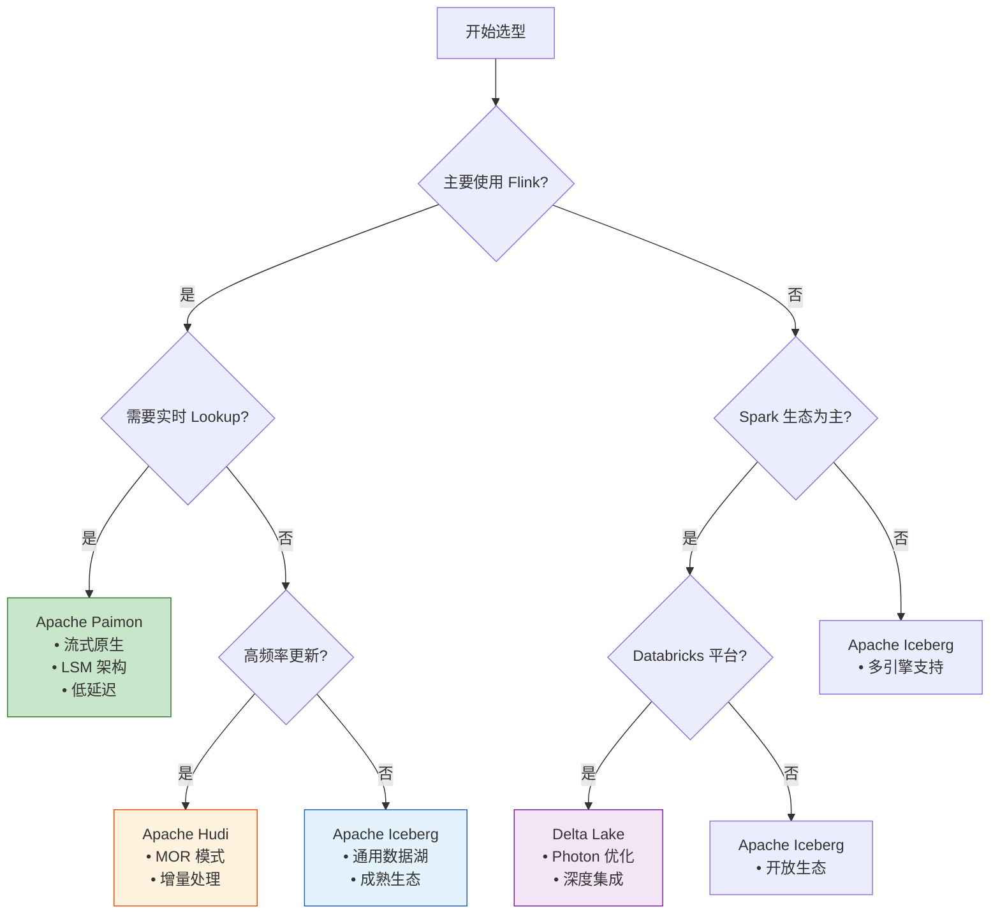
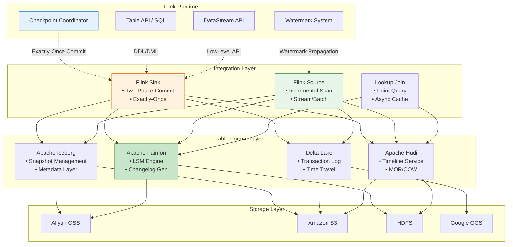
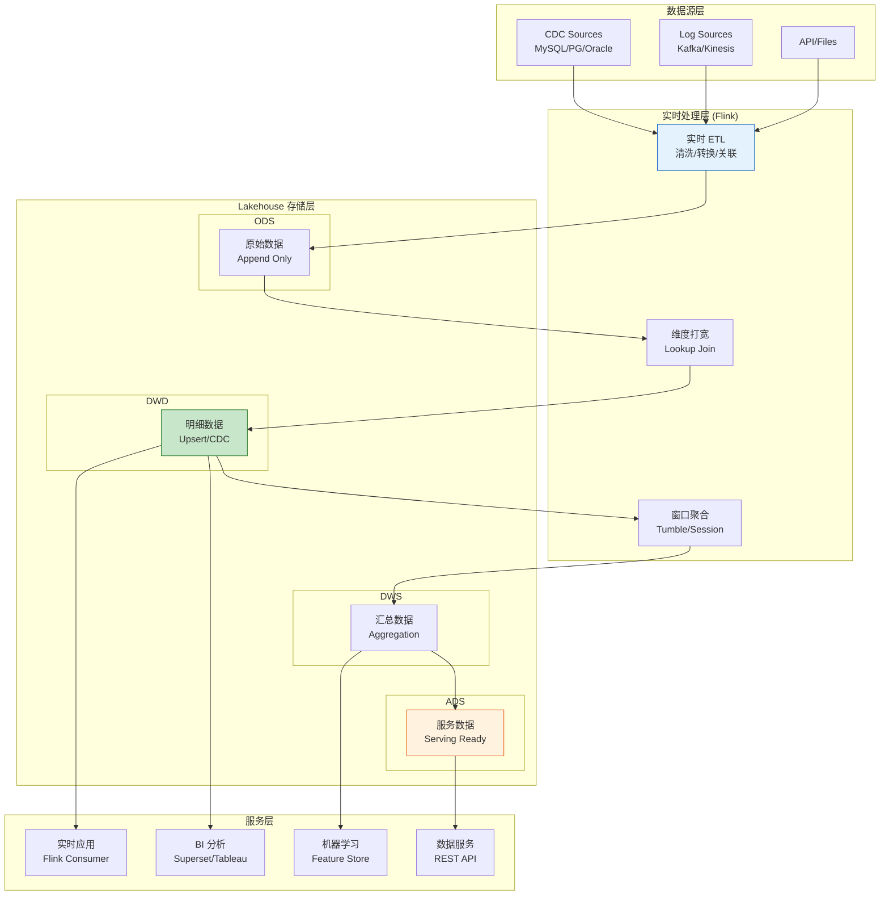
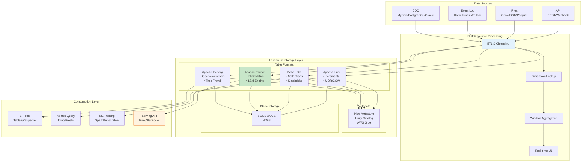
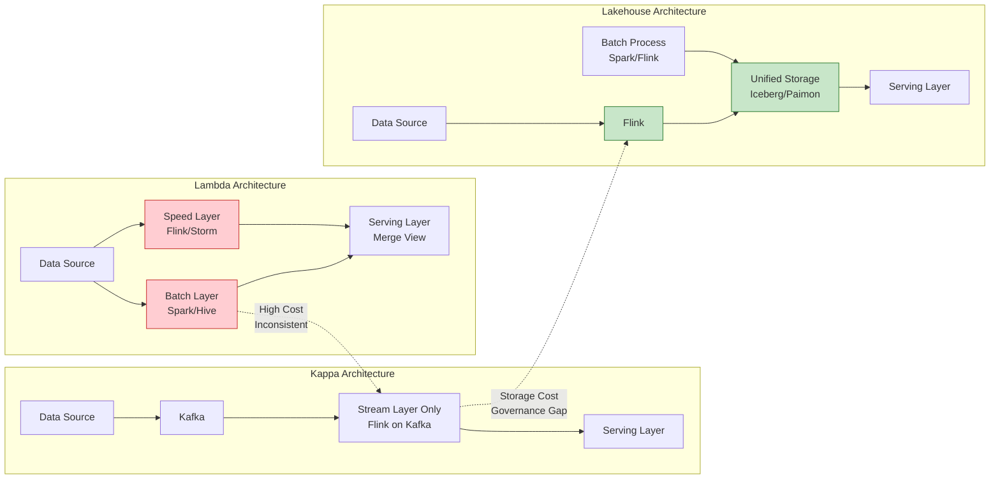
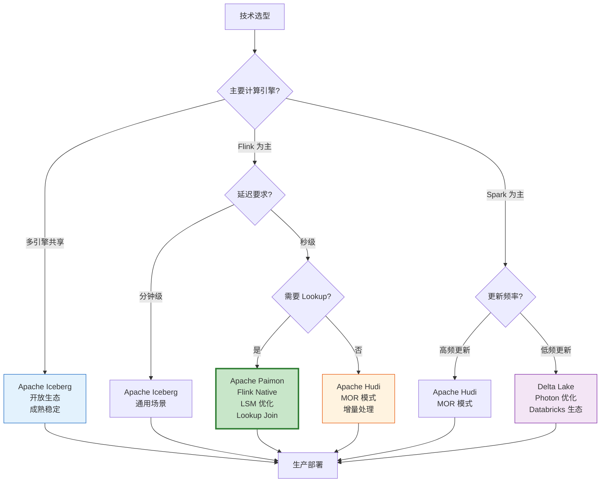
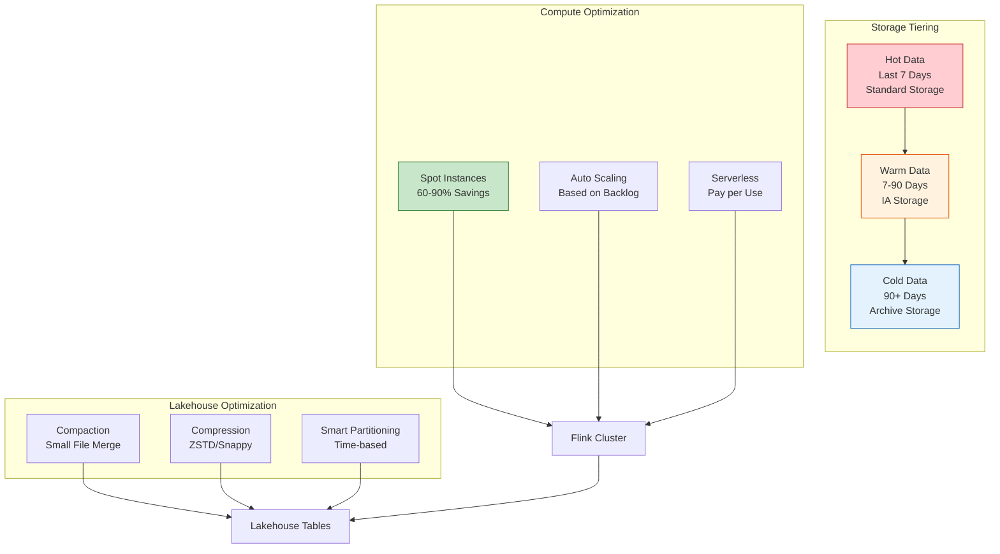

# Streaming Lakehouse Architecture - 流式湖仓架构设计与实践

> **所属阶段**: Flink/14-lakehouse/ | **前置依赖**: [Flink/14-lakehouse/flink-iceberg-integration.md](./flink-iceberg-integration.md), [Flink/14-lakehouse/flink-paimon-integration.md](./flink-paimon-integration.md), [Flink/09-language-foundations/04-streaming-lakehouse.md](../../03-api/09-language-foundations/04-streaming-lakehouse.md) | **形式化等级**: L4-L5 | **版本**: Flink 1.18+

---

## 1. 概念定义 (Definitions)

### Def-F-14-05: 流式湖仓架构 (Streaming Lakehouse Architecture)

**定义**: 流式湖仓架构是一种将实时流处理能力与湖仓存储（Lakehouse）深度融合的数据架构范式，通过统一存储层支持流批一体的数据处理、分析和 serving。

**形式化结构**:

```
StreamingLakehouseArchitecture = ⟨StorageLayer, TableFormat, ProcessingEngine, ServingLayer, Governance⟩

其中:
- StorageLayer: 对象存储系统 (S3/OSS/GCS/HDFS)
- TableFormat: 开放表格式 (Iceberg/Hudi/Delta/Paimon)
- ProcessingEngine: 流批统一计算引擎 (Flink/Spark)
- ServingLayer: 数据服务层 (查询引擎/API/BI)
- Governance: 数据治理体系 (血缘/质量/安全)
```

**核心特征矩阵**:

| 特征维度 | 传统数据湖 | 传统数仓 | 流式湖仓 |
|----------|-----------|----------|----------|
| **存储成本** | 低 | 高 | 低 |
| **实时性** | 批处理 | 批处理 | 秒级延迟 |
| **Schema 管理** | 弱 | 强 | 强 |
| **并发更新** | 弱 | 强 | 强 |
| **时间旅行** | 无 | 有限 | 完整支持 |
| **开放格式** | 是 | 否 | 是 |

---

### Def-F-14-06: Apache Iceberg 流式集成语义

**定义**: Apache Iceberg 通过**不可变快照**和**增量扫描**机制实现流式数据的可靠存储与消费。

**形式化模型**:

```
IcebergStreamModel = ⟨SnapshotSequence, IncrementalScan, WatermarkAlignment⟩

快照序列:
  S = {s_1, s_2, ..., s_n} 其中 ∀i: s_i.timestamp < s_{i+1}.timestamp

增量扫描算子:
  Δ(s_i, s_j) = {f | f ∈ s_j.files ∧ f ∉ s_i.files}

水印对齐条件:
  ∀checkpoint c: watermark(c) ≤ snapshot(c).commit_time + ε
```

**与 Flink 的集成点**:

| 集成维度 | Flink 机制 | Iceberg 对应 | 协同语义 |
|----------|-----------|--------------|----------|
| **容错** | Checkpoint | 快照提交 | 两阶段提交 |
| **时间语义** | Watermark | 快照时间戳 | 对齐触发 |
| **增量消费** | 流式 Source | 快照差分 | 变更捕获 |
| **Schema 演进** | TypeInference | Schema 版本 | 自动同步 |

---

### Def-F-14-07: Apache Paimon LSM-Tree 流批模型

**定义**: Apache Paimon 基于**日志结构合并树 (LSM-Tree)** 实现流批统一的存储引擎，通过分层存储和异步合并优化读写性能。

**形式化结构**:

```
PaimonLSM = ⟨MemTable, L0, {L_i}_{i=1..k}, CompactionPolicy, ChangelogGen⟩

MemTable: 内存缓冲区 (有序跳表)
  - 写入 WAL 保证持久性
  - Flush 触发: 容量阈值 | 时间阈值 | Checkpoint

L0 (Level 0): 增量文件层
  - 文件间无序，可重叠
  - 支持实时增量消费

L_i (i≥1): 合并排序层
  - 文件按 Key 范围有序分区
  - 层间大小比例因子通常 10

变更日志生成:
  Changelog(snap_t) = gen_log(L0_t, L0_{t-1})
```

**流批访问模式**:

```
流式写入路径:
  Flink Source → MemTable → WAL → L0 Files → Snapshot Commit

批式查询路径:
  Query Planner → Snapshot Selection → L0∪L1∪...∪Lk Scan → Merge Sort

增量消费路径:
  Consumer → Snapshot Poll → ΔL0 Detection → Changelog Stream
```

---

### Def-F-14-08: Delta Lake 流式架构

**定义**: Delta Lake 是一种基于**事务日志 (Transaction Log)** 的开放存储格式，通过乐观并发控制实现 ACID 事务和流批统一访问。

**核心架构形式化**:

```
DeltaLake = ⟨ParquetFiles, TransactionLog, Checkpoints, Metadata⟩

事务日志结构:
  _delta_log/
  ├── 00000000000000000000.json  (初始提交)
  ├── 00000000000000000001.json  (数据追加)
  ├── 00000000000000000002.json  (元数据更新)
  ├── ...
  └── _checkpoints/
      └── 00000000000000000010.checkpoint.parquet

提交原子性保证:
  commit(action_list) → atomic_write(_delta_log/{version+1}.json)

乐观并发控制:
  read(version) → compute(actions) → write_if_version_unchanged(version)
```

**Structured Streaming 集成**:

| 模式 | 语义 | 适用场景 |
|------|------|----------|
| **Append** | 仅追加新数据 | 事件流、日志数据 |
| **Complete** | 全量结果重写 | 聚合结果、小数据集 |
| **Update** | 增量更新 | CDC、状态变更 |

---

### Def-F-14-09: 统一批流处理语义

**定义**: 统一批流处理 (Unified Batch-Stream Processing) 是指同一套代码/逻辑在批模式和流模式下产生一致结果的处理范式。

**形式化一致性条件**:

```
设:
- 批处理结果: R_batch = Process(D_full, BatchMode)
- 流处理结果: R_stream = Process(D_incremental, StreamMode)
- 其中 D_full = ∪_{t=0}^{T} D_t

一致性条件:
  ∀ query Q: Q(R_batch) = accumulate(Q(R_stream))

即: 批处理的全量结果 = 流处理增量结果的累积
```

**Flink 的批流统一实现**:

```
Flink 执行模式:
┌─────────────────────────────────────────────────────────────┐
│                     Table API / SQL                          │
│  SELECT user_id, COUNT(*) FROM events GROUP BY user_id      │
└──────────────────────────┬──────────────────────────────────┘
                           │ 统一语义解析
                           ▼
┌─────────────────────────────────────────────────────────────┐
│                  Logical Plan (统一逻辑计划)                  │
└──────────────────────────┬──────────────────────────────────┘
                           │ 模式特定优化
           ┌───────────────┴───────────────┐
           ▼                               ▼
┌─────────────────────┐         ┌─────────────────────┐
│   Batch Physical    │         │  Stream Physical    │
│   - Sort-Merge Join │         │  - Stream Join      │
│   - Hash Aggregate  │         │  - Window Aggregate │
└─────────────────────┘         └─────────────────────┘
```

---

## 2. 属性推导 (Properties)

### Lemma-F-14-03: 湖仓格式的时间旅行完备性

**引理**: 主流开放表格式（Iceberg/Hudi/Delta/Paimon）均支持基于快照/版本的时间旅行查询，且语义等价。

**证明概要**:

```
时间旅行语义:
  ∀ format F ∈ {Iceberg, Hudi, Delta, Paimon}:
    ∃ function QueryAt(table, timestamp) → snapshot

Iceberg:
  QueryAt(T, ts) = argmax{s ∈ T.snapshots | s.timestamp ≤ ts}

Hudi:
  QueryAt(T, ts) = T.timeline.getInstant(ts).commit

Delta:
  QueryAt(T, ts) = T.history.getVersionAt(ts)

Paimon:
  QueryAt(T, ts) = argmax{s ∈ T.snapshots | s.create_time ≤ ts}

完备性保证:
  1. 单调递增的版本序列
  2. 不可变的历史状态存储
  3. 基于时间戳的索引检索
```

---

### Lemma-F-14-04: 流式写入的幂等性

**引理**: 在 Flink Checkpoint 失败重启场景下，湖仓 Sink 的写入操作具有幂等性。

**证明**:

```
场景设定:
- Checkpoint N 触发，Sink 进入 preCommit 阶段
- 数据文件已写入存储，待提交元数据
- Checkpoint N 失败，作业从 Checkpoint N-1 恢复

幂等性保证:
  1. 重启后数据重新处理，生成新数据文件 (UUID 命名)
  2. Checkpoint N' (重试) 成功，提交新快照
  3. 旧 pending 数据文件无快照引用，成为孤儿文件
  4. 孤儿文件清理作业定期回收

结论: 无论 Checkpoint 失败多少次，最终数据不重复 ∎
```

---

### Prop-F-14-03: 增量消费的有序性保证

**命题**: 从湖仓格式的增量消费保持数据产生的时间序。

**形式化表述**:

```
设:
- 快照序列: S = [s_1, s_2, ..., s_n]
- 增量批次: Δ_i = scan_incremental(s_i, s_{i+1})
- 记录时间戳: ts(r) = r.event_time

有序性条件:
  ∀ r_a ∈ Δ_i, r_b ∈ Δ_j: i < j ⇒ ts(r_a) ≤ ts(r_b) + ε

证明:
  1. 快照按 commit_time 排序: s_i.commit_time < s_{j}.commit_time (i < j)
  2. 数据文件的可见性与快照提交时间一致
  3. 消费者按快照 ID 顺序消费
  ∴ 消费序列保持时间序 ∎
```

---

### Prop-F-14-04: 存储成本优化边界

**命题**: 流式湖仓相比传统 Lambda 架构可降低 40-60% 存储成本。

**成本模型推导**:

```
Lambda 架构成本:
  Storage_λ = Storage_batch + Storage_stream
            = D × R_batch + D × R_stream × T_retention
            ≈ 2.5D (假设流存储保留 7 天，批存储全量)

Lakehouse 成本:
  Storage_LH = D × R_parquet × (1 + R_metadata)
             ≈ 1.2D (Parquet 压缩率 0.8，元数据开销 10%)

成本比:
  CostRatio = Storage_LH / Storage_λ ≈ 0.48

其中:
  D: 原始数据量
  R_batch: 批存储压缩率 (Parquet ≈ 0.3)
  R_stream: 流存储开销 (Kafka 副本因子 3)
  R_metadata: 元数据存储占比 (~10%)
```

---

## 3. 关系建立 (Relations)

### 3.1 四大湖仓格式对比关系

**功能特性矩阵**:

| 维度 | Apache Iceberg | Apache Hudi | Delta Lake | Apache Paimon |
|------|---------------|-------------|------------|---------------|
| **存储格式** | Parquet/ORC/Avro | Parquet/ORC | Parquet | Parquet/ORC/Avro |
| **事务模型** | 乐观并发控制 | MVCC | 乐观并发控制 | LSM Tree |
| **更新模式** | Copy-on-Write | MOR/COW | Copy-on-Write | LSM + Compaction |
| **流式延迟** | 分钟级 | 秒级-分钟级 | 分钟级 | 秒级 |
| **增量消费** | 增量扫描 | 时间线服务 | Change Data Feed | LSM Snapshot |
| **Flink 集成** | ⭐⭐⭐⭐ | ⭐⭐⭐⭐ | ⭐⭐⭐ | ⭐⭐⭐⭐⭐ |
| **Spark 集成** | ⭐⭐⭐⭐⭐ | ⭐⭐⭐⭐⭐ | ⭐⭐⭐⭐⭐ | ⭐⭐⭐⭐ |
| **生态广度** | ⭐⭐⭐⭐⭐ | ⭐⭐⭐⭐ | ⭐⭐⭐⭐ | ⭐⭐⭐ |
| **小文件管理** | 外部调度 | 自动 | 自动 | 原生异步 |
| **Lookup Join** | 有限 | 支持 | 支持 | 原生支持 |

**选型决策树**:



---

### 3.2 Flink 与湖仓格式的集成架构



---

### 3.3 Kappa + Lakehouse 融合架构



---

## 4. 论证过程 (Argumentation)

### 4.1 为何需要 Kappa + Lakehouse 融合架构

**传统 Lambda 架构的局限性**:

```
Lambda 架构痛点:
┌─────────────────────────────────────────────────────────────┐
│  Speed Layer (流处理)                                        │
│  ├── 低延迟但成本高 (内存/SSD)                               │
│  ├── 存储保留期短 (天级)                                     │
│  └── 计算结果与批层不一致                                    │
│                                                             │
│  Batch Layer (批处理)                                        │
│  ├── 高吞吐但延迟高 (小时级)                                 │
│  ├── 存储成本低 (对象存储)                                   │
│  └── T+1 结果与实时结果矛盾                                  │
│                                                             │
│  核心问题:                                                   │
│  1. 数据冗余: 同一份数据存储两份                             │
│  2. 逻辑重复: ETL 代码维护两套                               │
│  3. 结果不一致: 让用户困惑 "哪个数字是对的?"                 │
│  4. 运维复杂: 两套系统，双倍运维成本                         │
└─────────────────────────────────────────────────────────────┘
```

**Kappa 架构的演进**:

```
Kappa Architecture:
┌─────────────────────────────────────────────────────────────┐
│  统一处理层: 仅使用流处理 (Flink on Kafka)                   │
│  ├── 所有数据通过 Kafka 流入                                 │
│  ├── 流处理引擎处理所有场景                                  │
│  └── 重放能力支持历史数据处理                                │
│                                                             │
│  改进:                                                       │
│  ✓ 单一代码路径，逻辑统一                                    │
│  ✓ 实时性与吞吐兼顾                                          │
│                                                             │
│  仍有问题:                                                   │
│  ✗ Kafka 存储成本高，不适合长期保留                          │
│  ✗ 复杂分析 (Ad-hoc) 性能差                                  │
│  ✗ 数据治理能力不足 (血缘/质量)                              │
└─────────────────────────────────────────────────────────────┘
```

**Kappa + Lakehouse 融合方案**:

```
融合架构优势:
┌─────────────────────────────────────────────────────────────┐
│  统一存储层: Lakehouse (Iceberg/Paimon on S3)               │
│  ├── 低成本对象存储支持长期保留 (年级)                       │
│  ├── 开放格式支持多引擎访问 (Flink/Spark/Trino)             │
│  ├── 实时写入 + 批式查询统一                                 │
│  └── 完整数据治理能力                                        │
│                                                             │
│  统一处理层: Flink SQL                                       │
│  ├── 流批统一语义，一套代码                                  │
│  ├── 实时增量写入 Lakehouse                                  │
│  ├── 批模式历史数据处理                                      │
│  └── 增量消费支持流式 Pipeline                               │
│                                                             │
│  核心价值:                                                   │
│  ✓ 单一真相源 (Single Source of Truth)                       │
│  ✓ 流批结果一致                                              │
│  ✓ 存储成本降低 50%+                                         │
│  ✓ 运维复杂度降低                                            │
└─────────────────────────────────────────────────────────────┘
```

---

### 4.2 Delta Lake 流式处理工程权衡

**Structured Streaming 集成深度分析**:

| 特性 | Delta Lake + Spark | Delta Lake + Flink | 影响分析 |
|------|-------------------|-------------------|----------|
| **原生集成** | ⭐⭐⭐⭐⭐ | ⭐⭐⭐ | Spark 是 Databricks 出品 |
| **自动优化** | 深度集成 (OPTIMIZE) | 需外部调度 | 影响小文件合并 |
| **CDC 输出** | 原生 CDF | 需连接器支持 | 影响增量消费 |
| **Schema 演进** | 完整支持 | 部分支持 | 影响兼容性 |
| **时间旅行** | 完整支持 | 完整支持 | 功能对等 |

**Flink 读取 Delta Lake 的实现路径**:

```
方案 1: Delta Standalone 连接器
┌─────────────────────────────────────────────────────────────┐
│  Flink Source → Delta Standalone Reader → Parquet Files     │
│  • 支持批式读取                                               │
│  • 支持增量扫描 (基于版本号)                                   │
│  • 不支持流式持续消费                                         │
│  • 社区维护，更新较慢                                         │
└─────────────────────────────────────────────────────────────┘

方案 2: Delta + Kafka 中转
┌─────────────────────────────────────────────────────────────┐
│  Delta Lake → CDC → Kafka → Flink Consumer                  │
│  • 实时性高                                                   │
│  • 架构复杂，引入额外组件                                      │
│  • 适合已使用 Kafka 的场景                                    │
└─────────────────────────────────────────────────────────────┘

方案 3: 统一使用 Paimon/Iceberg
┌─────────────────────────────────────────────────────────────┐
│  若 Flink 为主引擎，建议直接使用 Paimon/Iceberg               │
│  • 原生流批支持                                               │
│  • 无需额外连接器                                             │
│  • 更好的 Flink 集成体验                                      │
└─────────────────────────────────────────────────────────────┘
```

---

### 4.3 成本优化策略边界分析

**存储层成本优化**:

```
策略 1: 智能分层存储
┌─────────────────────────────────────────────────────────────┐
│  热数据 (最近 7 天) → 标准存储 (Standard)                    │
│  温数据 (7-90 天) → 低频访问 (IA)                            │
│  冷数据 (90 天+) → 归档存储 (Archive)                        │
│                                                             │
│  Lakehouse 配合:                                            │
│  - 按时间分区 (dt=yyyy-MM-dd)                               │
│  - 生命周期策略自动迁移                                      │
│  - 元数据层保持访问透明                                      │
└─────────────────────────────────────────────────────────────┘

策略 2: 压缩与编码优化
┌─────────────────────────────────────────────────────────────┐
│  Parquet 配置:                                              │
│  - 列式存储 + Snappy/ZSTD 压缩                               │
│  - ZSTD 级别 3-5 平衡压缩率与速度                            │
│  - 字典编码字符串列                                          │
│                                                             │
│  典型压缩比:                                                 │
│  - 日志数据: 10:1 ~ 20:1                                     │
│  - 业务数据: 3:1 ~ 5:1                                       │
└─────────────────────────────────────────────────────────────┘

策略 3: 小文件合并策略
┌─────────────────────────────────────────────────────────────┐
│  问题: 高频流式写入产生大量小文件                             │
│  - 元数据压力大                                              │
│  - 查询性能下降                                              │
│                                                             │
│  解决方案:                                                   │
│  - Iceberg: 定期 Spark/Flink Compaction 作业                │
│  - Paimon: 原生异步 Compaction，无需外部调度                 │
│  - 目标文件大小: 128MB ~ 256MB                               │
└─────────────────────────────────────────────────────────────┘
```

**计算层成本优化**:

```
策略 1: 存算分离架构
┌─────────────────────────────────────────────────────────────┐
│  传统架构: 计算与存储绑定 (HDFS)                             │
│  - 扩容需同时扩计算和存储                                    │
│  - 资源利用率低                                              │
│                                                             │
│  存算分离: 对象存储 + 弹性计算 (Flink on K8s)                │
│  - 存储独立扩缩容                                            │
│  - 计算按需弹性                                              │
│  - 成本节省 30-50%                                           │
└─────────────────────────────────────────────────────────────┘

策略 2: 自动扩缩容
┌─────────────────────────────────────────────────────────────┐
│  Flink Autoscaler:                                          │
│  - 基于积压 (Backlog) 自动扩缩容                             │
│  - 低峰期缩减资源，高峰期自动扩容                            │
│  - 结合 Spot 实例进一步降低成本                              │
│                                                             │
│  配置示例:                                                   │
│  pipeline.autoscaler.enabled: true                          │
│  pipeline.autoscaler.target.utilization: 0.7                │
└─────────────────────────────────────────────────────────────┘
```

---

## 5. 形式证明 / 工程论证 (Proof / Engineering Argument)

### Thm-F-14-04: 统一批流结果一致性定理

**定理**: 在 Streaming Lakehouse 架构中，同一 Flink SQL 查询在批模式和流模式下产生一致的结果。

**形式化表述**:

```
设:
- 输入数据集 D = {d_1, d_2, ..., d_n}
- 批模式结果: R_batch = Flink_SQL(D, BATCH_MODE)
- 流模式结果: R_stream = accumulate(Flink_SQL(ΔD, STREAM_MODE))

一致性条件:
  R_batch ≡ R_stream

其中 ΔD 是 D 的增量划分: D = ∪_{i} ΔD_i
```

**证明**:

```
前提条件:
  P1: Flink Table API 提供统一的逻辑计划生成
  P2: 湖仓格式 (Paimon/Iceberg) 保证快照隔离
  P3: 批扫描与增量扫描访问相同数据文件集合

证明步骤:

Step 1: 逻辑计划等价性
  对于查询 Q: SELECT f(c1, c2) FROM T WHERE condition

  批模式逻辑计划:
    BatchScan(T) → Filter(condition) → Project(f(c1, c2))

  流模式逻辑计划:
    StreamScan(T) → Filter(condition) → Project(f(c1, c2))

  逻辑计划树结构相同，仅物理执行策略不同。

Step 2: 数据可见性等价
  批模式读取快照 S(t):
    Data_Batch = ∪_{f ∈ S(t).files} read(f)

  流模式读取增量 Δ = S(t) - S(t_0):
    Data_Stream = ∪_{f ∈ Δ.files} read(f)
    累积结果 = accumulate(Data_Stream over time)

  当流处理完成所有增量后:
    accumulate(Data_Stream) = Data_Batch

Step 3: 执行语义等价
  对于确定性操作 (Filter, Project, Aggregation):
    f(Data_Batch) = accumulate(f(Data_Stream))

  由于操作的确定性，批处理全量计算结果 =
  流处理增量结果累积

结论: 结果一致性得证 ∎
```

---

### Thm-F-14-05: 湖仓格式端到端 Exactly-Once 语义定理

**定理**: Flink 通过两阶段提交协议与湖仓格式的事务机制，可以保证流写入的端到端 Exactly-Once 语义。

**证明**:

```
前提条件:
  P1: Flink Checkpoint 提供作业级别的 Exactly-Once 保证
  P2: 湖仓格式 (Iceberg/Paimon/Delta) 提供存储级事务支持
  P3: 两阶段提交协议协调 Checkpoint 与存储事务

两阶段提交流程:
┌────────────────────────────────────────────────────────────────────┐
│ Phase 1: Pre-commit                                               │
│ ───────────────────────────────────────────────────────────────── │
│ 1. Checkpoint 触发，Sink 算子冻结状态                              │
│ 2. 将缓冲数据写入数据文件 (Parquet)                                │
│    - Iceberg: 写入临时位置，生成 pending snapshot                  │
│    - Paimon: 写入 LSM L0，准备 commit                              │
│    - Delta: 准备 actions list                                     │
│ 3. 向 Checkpoint Coordinator 汇报预提交信息                        │
│                                                                  │
│ 不变式 I1: 数据文件已持久化，但未对查询可见                        │
└────────────────────────────────────────────────────────────────────┘

┌────────────────────────────────────────────────────────────────────┐
│ Phase 2: Commit                                                   │
│ ───────────────────────────────────────────────────────────────── │
│ 触发: 所有算子成功完成 preCommit                                  │
│                                                                  │
│ 操作:                                                             │
│ 1. Coordinator 广播 Checkpoint ACK                                │
│ 2. Sink 收到 ACK 后执行 commit:                                   │
│    - Iceberg: commitSnapshot() → 原子更新 metadata                │
│    - Paimon: commit() → 更新 Snapshot 指针                        │
│    - Delta: 写入 _delta_log/{version}.json                        │
│ 3. 新数据立即可见                                                 │
│                                                                  │
│ 不变式 I2: 事务原子性保证，要么全部可见，要么全部不可见            │
└────────────────────────────────────────────────────────────────────┘

故障恢复分析:
Case 1: Checkpoint 失败 (Phase 2 未执行)
  - pending 数据未提交
  - 作业从上一个成功 Checkpoint 恢复
  - 数据重新处理，生成新的数据文件
  - 旧 pending 文件成为孤儿文件，后续清理

Case 2: Commit 过程中失败
  - 部分提交可能成功
  - 恢复后重新执行 commit
  - 存储层的 CAS/幂等机制保证不重复

结论: 端到端 Exactly-Once 得证 ∎
```

---

### Thm-F-14-06: 增量消费完备性定理

**定理**: 湖仓格式的增量消费机制保证不遗漏、不重复地消费所有变更数据。

**证明**:

```
定义:
  - 快照序列: S = [s_1, s_2, ..., s_n]
  - 增量消费函数: IncrementalConsume(s_i, s_j) → Δ
  - 完备性条件:
    (1) 不遗漏: ∀ record r ∈ s_j \ s_i: r ∈ Δ
    (2) 不重复: ∀ record r ∈ Δ: count(r) = 1

证明 (以 Iceberg 为例):

Step 1: 快照不可变性
  Iceberg 快照一旦创建不可修改:
    ∀ s ∈ S: immutable(s.files)

  新快照通过引用现有文件 + 新增文件构成:
    s_{k+1}.files = s_k.files ∪ new_files

Step 2: 增量检测算法
  ΔFiles = s_{j}.manifests \ s_{i}.manifests

  由于 manifest 文件不可变:
    - s_j 引用的 manifest 集合是 s_i 的超集
    - 差集计算精确捕获新增文件

Step 3: 不遗漏证明
  ∀ file f ∈ s_j.files ∧ f ∉ s_i.files:
    f 必被某个 manifest m 引用
    m ∈ s_j.manifests ∧ m ∉ s_i.manifests
    ∴ f ∈ ΔFiles

Step 4: 不重复证明
  ∀ file f ∈ s_i.files:
    f 被 manifest m 引用
    m ∈ s_i.manifests
    由于集合差运算: m ∉ ΔFiles
    ∴ f 不会被重复消费

结论: 增量消费完备性得证 ∎
```

---

## 6. 实例验证 (Examples)

### 6.1 Apache Iceberg + Flink 流式数仓

```sql
-- ============================================
-- 步骤 1: 创建 Iceberg Catalog
-- ============================================
CREATE CATALOG iceberg_catalog WITH (
    'type' = 'iceberg',
    'catalog-type' = 'hive',
    'uri' = 'thrift://hive-metastore:9083',
    'warehouse' = 'oss://my-bucket/iceberg-warehouse',
    'io-impl' = 'org.apache.iceberg.aliyun.oss.OSSFileIO'
);

USE CATALOG iceberg_catalog;
CREATE DATABASE IF NOT EXISTS realtime_dw;
USE realtime_dw;

-- ============================================
-- 步骤 2: 创建 ODS 层 - 原始事件表
-- ============================================
CREATE TABLE IF NOT EXISTS ods_events (
    event_id STRING,
    user_id STRING,
    event_type STRING,
    properties STRING,
    event_time TIMESTAMP(3),
    dt STRING  -- 分区字段
) PARTITIONED BY (dt, event_type) WITH (
    'write.format.default' = 'parquet',
    'write.parquet.compression-codec' = 'zstd',
    'write.target-file-size-bytes' = '134217728',
    'write.metadata.previous-versions-max' = '100',

    -- 流式读取配置
    'read.streaming.enabled' = 'true',
    'read.streaming.start-mode' = 'latest',
    'monitor-interval' = '30s',

    -- 快照保留策略
    'history.expire.max-snapshot-age-ms' = '604800000',
    'history.expire.min-snapshots-to-keep' = '5'
);

-- ============================================
-- 步骤 3: 从 Kafka 流式写入 Iceberg
-- ============================================
CREATE TABLE kafka_events (
    event_id STRING,
    user_id STRING,
    event_type STRING,
    properties STRING,
    event_time TIMESTAMP(3),
    WATERMARK FOR event_time AS event_time - INTERVAL '5' SECOND
) WITH (
    'connector' = 'kafka',
    'topic' = 'user-events',
    'properties.bootstrap.servers' = 'kafka:9092',
    'properties.group.id' = 'iceberg-sink-group',
    'format' = 'json',
    'json.ignore-parse-errors' = 'true'
);

-- 启动流式写入
INSERT INTO ods_events
SELECT
    event_id,
    user_id,
    event_type,
    properties,
    event_time,
    DATE_FORMAT(event_time, 'yyyy-MM-dd') AS dt
FROM kafka_events;

-- ============================================
-- 步骤 4: 创建 DWD 层 - 明细表
-- ============================================
CREATE TABLE IF NOT EXISTS dwd_user_events (
    event_id STRING,
    user_id STRING,
    event_type STRING,
    page_id STRING,
    duration_ms INT,
    event_time TIMESTAMP(3),
    dt STRING,
    PRIMARY KEY (event_id) NOT ENFORCED
) PARTITIONED BY (dt) WITH (
    'write.format.default' = 'parquet',
    'write.distribution-mode' = 'hash',
    'write.metadata.compression-codec' = 'gzip'
);

-- 数据清洗与打宽
INSERT INTO dwd_user_events
SELECT
    event_id,
    user_id,
    event_type,
    JSON_VALUE(properties, '$.page_id') AS page_id,
    CAST(JSON_VALUE(properties, '$.duration') AS INT) AS duration_ms,
    event_time,
    DATE_FORMAT(event_time, 'yyyy-MM-dd') AS dt
FROM ods_events
WHERE event_type IN ('page_view', 'click', 'purchase');

-- ============================================
-- 步骤 5: 增量消费 Iceberg 数据
-- ============================================
SET 'execution.runtime-mode' = 'streaming';

-- 消费 Iceberg 变更数据
CREATE TABLE iceberg_changes (
    event_id STRING,
    user_id STRING,
    event_type STRING,
    page_id STRING,
    _change_type STRING,  -- INSERT, UPDATE_AFTER, DELETE
    _change_timestamp TIMESTAMP(3)
) WITH (
    'connector' = 'iceberg',
    'catalog-name' = 'iceberg_catalog',
    'catalog-database' = 'realtime_dw',
    'catalog-table' = 'dwd_user_events',
    'streaming' = 'true',
    'streaming-scheme' = 'incremental-snapshot',
    'monitor-interval' = '10s'
);

-- 将变更数据写入下游 Kafka
INSERT INTO kafka_analytics_events
SELECT
    event_id,
    user_id,
    event_type,
    page_id,
    CASE _change_type
        WHEN 'INSERT' THEN 'CREATED'
        WHEN 'UPDATE_AFTER' THEN 'UPDATED'
        WHEN 'DELETE' THEN 'DELETED'
    END AS event_action,
    _change_timestamp
FROM iceberg_changes;

-- ============================================
-- 步骤 6: Time Travel 查询示例
-- ============================================
-- 查询 7 天前的数据状态
SELECT
    event_type,
    COUNT(*) AS event_count
FROM dwd_user_events
FOR SYSTEM_TIME AS OF TIMESTAMP '2026-04-02 00:00:00' - INTERVAL '7' DAY
WHERE dt = '2026-03-26'
GROUP BY event_type;

-- 基于特定快照 ID 查询
SELECT * FROM dwd_user_events FOR SYSTEM_VERSION AS OF 1234567890123;
```

---

### 6.2 Apache Paimon + Flink 实时数仓

```sql
-- ============================================
-- 步骤 1: 创建 Paimon Catalog
-- ============================================
CREATE CATALOG paimon_catalog WITH (
    'type' = 'paimon',
    'warehouse' = 'oss://my-bucket/paimon-warehouse',
    'metastore' = 'hive',
    'uri' = 'thrift://hive-metastore:9083',

    -- 快照管理
    'snapshot.num-retained.min' = '10',
    'snapshot.num-retained.max' = '200',
    'snapshot.time-retained' = '24h'
);

USE CATALOG paimon_catalog;

-- ============================================
-- 步骤 2: CDC 实时入湖 - MySQL 到 Paimon
-- ============================================
-- MySQL CDC Source
CREATE TABLE mysql_orders (
    order_id STRING,
    user_id STRING,
    product_id STRING,
    amount DECIMAL(18,2),
    status STRING,
    created_at TIMESTAMP(3),
    updated_at TIMESTAMP(3),
    PRIMARY KEY (order_id) NOT ENFORCED
) WITH (
    'connector' = 'mysql-cdc',
    'hostname' = 'mysql.internal',
    'port' = '3306',
    'username' = '${MYSQL_USER}',
    'password' = '${MYSQL_PASSWORD}',
    'database-name' = 'ecommerce',
    'table-name' = 'orders',
    'server-time-zone' = 'Asia/Shanghai',
    'scan.incremental.snapshot.enabled' = 'true'
);

-- Paimon 目标表 (主键表支持 Upsert)
CREATE TABLE paimon_orders (
    order_id STRING,
    user_id STRING,
    product_id STRING,
    amount DECIMAL(18,2),
    status STRING,
    created_at TIMESTAMP(3),
    updated_at TIMESTAMP(3),
    dt STRING,
    PRIMARY KEY (order_id, dt) NOT ENFORCED
) PARTITIONED BY (dt) WITH (
    -- 基础配置
    'bucket' = '16',
    'bucket-key' = 'order_id',

    -- 变更日志生成 (input 模式，上游 CDC 已含完整变更类型)
    'changelog-producer' = 'input',

    -- 文件格式
    'file.format' = 'parquet',
    'file.compression' = 'zstd',

    -- Compaction 配置
    'compaction.min.file-num' = '5',
    'compaction.max.file-num' = '50',
    'num-sorted-run.compaction-trigger' = '5',
    'compaction.async' = 'true',

    -- 分区配置
    'partition.timestamp-formatter' = 'yyyy-MM-dd',
    'partition.timestamp-pattern' = '$updated_at'
);

-- 启动 CDC 同步
INSERT INTO paimon_orders
SELECT
    order_id,
    user_id,
    product_id,
    amount,
    status,
    created_at,
    updated_at,
    DATE_FORMAT(updated_at, 'yyyy-MM-dd') AS dt
FROM mysql_orders;

-- ============================================
-- 步骤 3: Lookup Join 维度关联
-- ============================================
-- 用户维度表 (Paimon 支持高效 Lookup)
CREATE TABLE dim_users (
    user_id STRING PRIMARY KEY NOT ENFORCED,
    user_name STRING,
    age INT,
    gender STRING,
    city STRING,
    register_date DATE
) WITH (
    'bucket' = '8',
    'changelog-producer' = 'lookup'
);

-- 产品维度表
CREATE TABLE dim_products (
    product_id STRING PRIMARY KEY NOT ENFORCED,
    product_name STRING,
    category STRING,
    brand STRING,
    price DECIMAL(18,2)
) WITH (
    'bucket' = '8',
    'changelog-producer' = 'lookup'
);

-- 订单明细宽表
CREATE TABLE dwd_order_detail (
    order_id STRING,
    user_id STRING,
    user_name STRING,
    age INT,
    city STRING,
    product_id STRING,
    product_name STRING,
    category STRING,
    brand STRING,
    amount DECIMAL(18,2),
    status STRING,
    created_at TIMESTAMP(3),
    dt STRING,
    PRIMARY KEY (order_id, dt) NOT ENFORCED
) PARTITIONED BY (dt) WITH (
    'bucket' = '32',
    'changelog-producer' = 'lookup'
);

-- 流式 Join 维度表
INSERT INTO dwd_order_detail
SELECT
    o.order_id,
    o.user_id,
    u.user_name,
    u.age,
    u.city,
    o.product_id,
    p.product_name,
    p.category,
    p.brand,
    o.amount,
    o.status,
    o.created_at,
    o.dt
FROM paimon_orders o
LEFT JOIN dim_users FOR SYSTEM_TIME AS OF o.proc_time AS u
    ON o.user_id = u.user_id
LEFT JOIN dim_products FOR SYSTEM_TIME AS OF o.proc_time AS p
    ON o.product_id = p.product_id;

-- ============================================
-- 步骤 4: 窗口聚合 (DWS 层)
-- ============================================
CREATE TABLE dws_category_stats_5min (
    window_start TIMESTAMP(3),
    window_end TIMESTAMP(3),
    category STRING,
    brand STRING,
    gmv DECIMAL(38,2),
    order_count BIGINT,
    PRIMARY KEY (window_start, category, brand) NOT ENFORCED
) WITH (
    'bucket' = '16',
    'changelog-producer' = 'input'
);

-- 滚动窗口聚合
INSERT INTO dws_category_stats_5min
SELECT
    TUMBLE_START(created_at, INTERVAL '5' MINUTE) AS window_start,
    TUMBLE_END(created_at, INTERVAL '5' MINUTE) AS window_end,
    category,
    brand,
    SUM(amount) AS gmv,
    COUNT(*) AS order_count
FROM dwd_order_detail
GROUP BY
    TUMBLE(created_at, INTERVAL '5' MINUTE),
    category,
    brand;

-- ============================================
-- 步骤 5: 物化表实时报表 (ADS 层)
-- ============================================
CREATE MATERIALIZED TABLE ads_realtime_dashboard
REFRESH MODE AUTO
WITH (
    'refresh-interval' = '1min'
)
AS
SELECT
    DATE_FORMAT(window_start, 'yyyy-MM-dd HH:mm') AS time_slot,
    category,
    brand,
    gmv,
    order_count,
    NOW() AS update_time
FROM dws_category_stats_5min;
```

---

### 6.3 Delta Lake + Flink 集成示例

```java
/**
 * Delta Lake 与 Flink 集成示例
 * 使用 delta-flink 连接器
 */

import org.apache.flink.streaming.api.environment.StreamExecutionEnvironment;
import org.apache.flink.table.api.TableEnvironment;

public class DeltaLakeFlinkIntegration {

    public static void main(String[] args) throws Exception {
        StreamExecutionEnvironment env =
            StreamExecutionEnvironment.getExecutionEnvironment();
        env.enableCheckpointing(60000);

        StreamTableEnvironment tEnv = StreamTableEnvironment.create(env);

        // ============================================
        // 1. 创建 Delta Lake Catalog
        // ============================================
        tEnv.executeSql("""
            CREATE CATALOG delta_catalog WITH (
                'type' = 'delta',
                'warehouse' = 's3://my-bucket/delta-warehouse'
            )
        """);

        tEnv.useCatalog("delta_catalog");

        // ============================================
        // 2. 创建 Delta Lake 表
        // ============================================
        tEnv.executeSql("""
            CREATE TABLE IF NOT EXISTS delta_events (
                event_id STRING,
                user_id STRING,
                event_type STRING,
                event_time TIMESTAMP(3),
                dt STRING
            ) PARTITIONED BY (dt) WITH (
                'connector' = 'delta',
                'table-path' = 's3://my-bucket/delta-warehouse/events'
            )
        """);

        // ============================================
        // 3. 流式写入 Delta Lake
        // ============================================
        tEnv.executeSql("""
            CREATE TABLE kafka_source (
                event_id STRING,
                user_id STRING,
                event_type STRING,
                event_time TIMESTAMP(3)
            ) WITH (
                'connector' = 'kafka',
                'topic' = 'events',
                'properties.bootstrap.servers' = 'kafka:9092',
                'format' = 'json'
            )
        """);

        // 写入 Delta Lake
        tEnv.executeSql("""
            INSERT INTO delta_events
            SELECT
                event_id,
                user_id,
                event_type,
                event_time,
                DATE_FORMAT(event_time, 'yyyy-MM-dd') AS dt
            FROM kafka_source
        """);

        // ============================================
        // 4. 批式读取 Delta Lake (Time Travel)
        // ============================================
        // 查询特定版本
        Table result = tEnv.sqlQuery("""
            SELECT * FROM delta_events VERSION AS OF 12345
            WHERE dt = '2026-04-01'
        """);

        // 查询特定时间
        Table timeTravelResult = tEnv.sqlQuery("""
            SELECT * FROM delta_events TIMESTAMP AS OF '2026-04-01T00:00:00Z'
        """);

        // ============================================
        // 5. Delta Lake + Structured Streaming 风格
        // ============================================
        // 读取变更数据 (Change Data Feed)
        tEnv.executeSql("""
            CREATE TABLE delta_cdf (
                event_id STRING,
                user_id STRING,
                event_type STRING,
                _change_type STRING,  -- insert, update, delete
                _commit_version BIGINT,
                _commit_timestamp TIMESTAMP(3)
            ) WITH (
                'connector' = 'delta',
                'table-path' = 's3://my-bucket/delta-warehouse/events',
                'read-change-feed' = 'true',
                'starting-version' = '0'
            )
        """);

        // 处理变更数据
        tEnv.executeSql("""
            INSERT INTO kafka_change_stream
            SELECT
                event_id,
                user_id,
                event_type,
                _change_type,
                _commit_timestamp
            FROM delta_cdf
        """);
    }
}
```

---

### 6.4 分层实时数仓完整 Pipeline

```sql
-- ============================================
-- 完整分层实时数仓 Pipeline
-- 使用 Paimon 作为统一存储
-- ============================================

-- 1. ODS 层: 原始数据接入
CREATE TABLE ods_kafka_raw (
    raw_data STRING,
    ingest_time TIMESTAMP(3),
    dt STRING
) PARTITIONED BY (dt) WITH (
    'bucket' = '8',
    'write-mode' = 'append-only'
);

-- 2. DWD 层: 数据清洗与标准化
CREATE TABLE dwd_cleaned_events (
    event_id STRING,
    user_id STRING,
    session_id STRING,
    event_type STRING,
    page_id STRING,
    referrer STRING,
    device_type STRING,
    os STRING,
    browser STRING,
    event_time TIMESTAMP(3),
    dt STRING,
    PRIMARY KEY (event_id, dt) NOT ENFORCED
) PARTITIONED BY (dt) WITH (
    'bucket' = '32',
    'changelog-producer' = 'input'
);

INSERT INTO dwd_cleaned_events
SELECT
    JSON_VALUE(raw_data, '$.event_id') AS event_id,
    JSON_VALUE(raw_data, '$.user_id') AS user_id,
    JSON_VALUE(raw_data, '$.session_id') AS session_id,
    JSON_VALUE(raw_data, '$.event_type') AS event_type,
    JSON_VALUE(raw_data, '$.page_id') AS page_id,
    JSON_VALUE(raw_data, '$.referrer') AS referrer,
    JSON_VALUE(raw_data, '$.device.type') AS device_type,
    JSON_VALUE(raw_data, '$.device.os') AS os,
    JSON_VALUE(raw_data, '$.device.browser') AS browser,
    TO_TIMESTAMP(JSON_VALUE(raw_data, '$.timestamp')) AS event_time,
    DATE_FORMAT(ingest_time, 'yyyy-MM-dd') AS dt
FROM ods_kafka_raw
WHERE raw_data IS NOT NULL;

-- 3. DWS 层: 多维度聚合
-- 3.1 用户行为统计
CREATE TABLE dws_user_behavior_1h (
    window_start TIMESTAMP(3),
    window_end TIMESTAMP(3),
    user_id STRING,
    session_count BIGINT,
    page_view_count BIGINT,
    click_count BIGINT,
    PRIMARY KEY (window_start, user_id) NOT ENFORCED
) WITH (
    'bucket' = '16',
    'changelog-producer' = 'input'
);

INSERT INTO dws_user_behavior_1h
SELECT
    TUMBLE_START(event_time, INTERVAL '1' HOUR) AS window_start,
    TUMBLE_END(event_time, INTERVAL '1' HOUR) AS window_end,
    user_id,
    COUNT(DISTINCT session_id) AS session_count,
    COUNT(*) FILTER (WHERE event_type = 'page_view') AS page_view_count,
    COUNT(*) FILTER (WHERE event_type = 'click') AS click_count
FROM dwd_cleaned_events
GROUP BY
    TUMBLE(event_time, INTERVAL '1' HOUR),
    user_id;

-- 3.2 页面访问统计
CREATE TABLE dws_page_stats_10min (
    window_start TIMESTAMP(3),
    window_end TIMESTAMP(3),
    page_id STRING,
    uv BIGINT,
    pv BIGINT,
    avg_duration_ms BIGINT,
    PRIMARY KEY (window_start, page_id) NOT ENFORCED
) WITH (
    'bucket' = '16',
    'changelog-producer' = 'input'
);

INSERT INTO dws_page_stats_10min
SELECT
    TUMBLE_START(event_time, INTERVAL '10' MINUTE) AS window_start,
    TUMBLE_END(event_time, INTERVAL '10' MINUTE) AS window_end,
    page_id,
    COUNT(DISTINCT user_id) AS uv,
    COUNT(*) AS pv,
    AVG(duration_ms) AS avg_duration_ms
FROM dwd_cleaned_events
WHERE event_type = 'page_view'
GROUP BY
    TUMBLE(event_time, INTERVAL '10' MINUTE),
    page_id;

-- 4. ADS 层: 应用服务数据
CREATE TABLE ads_user_realtime_profile (
    user_id STRING PRIMARY KEY NOT ENFORCED,
    total_sessions BIGINT,
    total_page_views BIGINT,
    last_active_time TIMESTAMP(3),
    favorite_category STRING,
    user_segment STRING,
    update_time TIMESTAMP(3)
) WITH (
    'bucket' = '32',
    'changelog-producer' = 'lookup'
);

INSERT INTO ads_user_realtime_profile
SELECT
    user_id,
    SUM(session_count) AS total_sessions,
    SUM(page_view_count) AS total_page_views,
    MAX(window_end) AS last_active_time,
    'TBD' AS favorite_category,
    CASE
        WHEN SUM(page_view_count) > 100 THEN 'high_active'
        WHEN SUM(page_view_count) > 10 THEN 'medium_active'
        ELSE 'low_active'
    END AS user_segment,
    NOW() AS update_time
FROM dws_user_behavior_1h
GROUP BY user_id;
```

---

## 7. 可视化 (Visualizations)

### 7.1 Streaming Lakehouse 架构全景图



---

### 7.2 统一批流处理架构对比



---

### 7.3 湖仓格式技术选型决策树



---

### 7.4 流式湖仓成本优化架构



---

## 8. 引用参考 (References)
