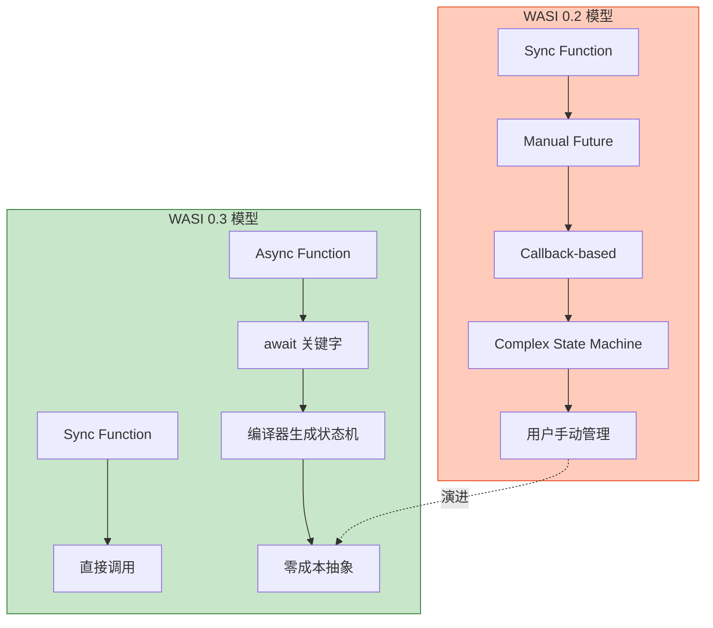
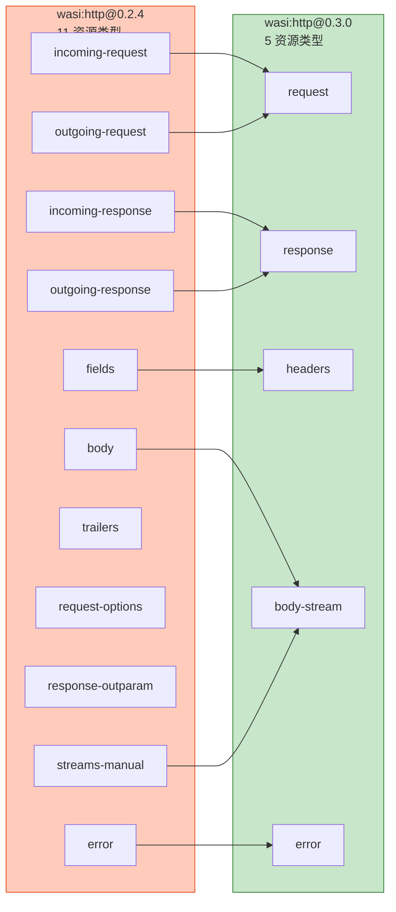
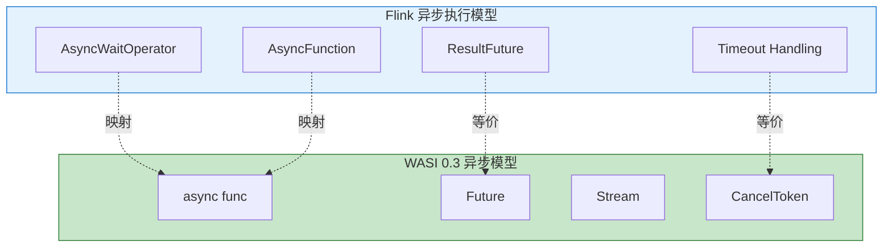
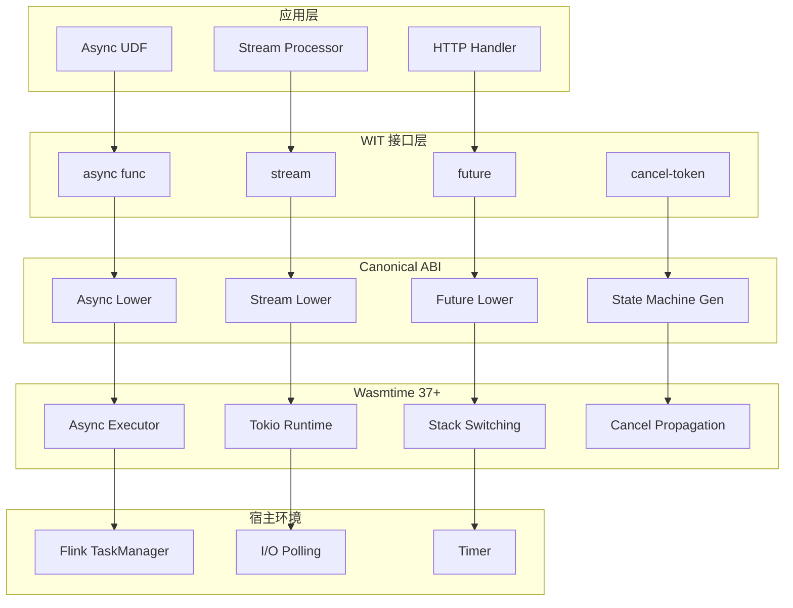
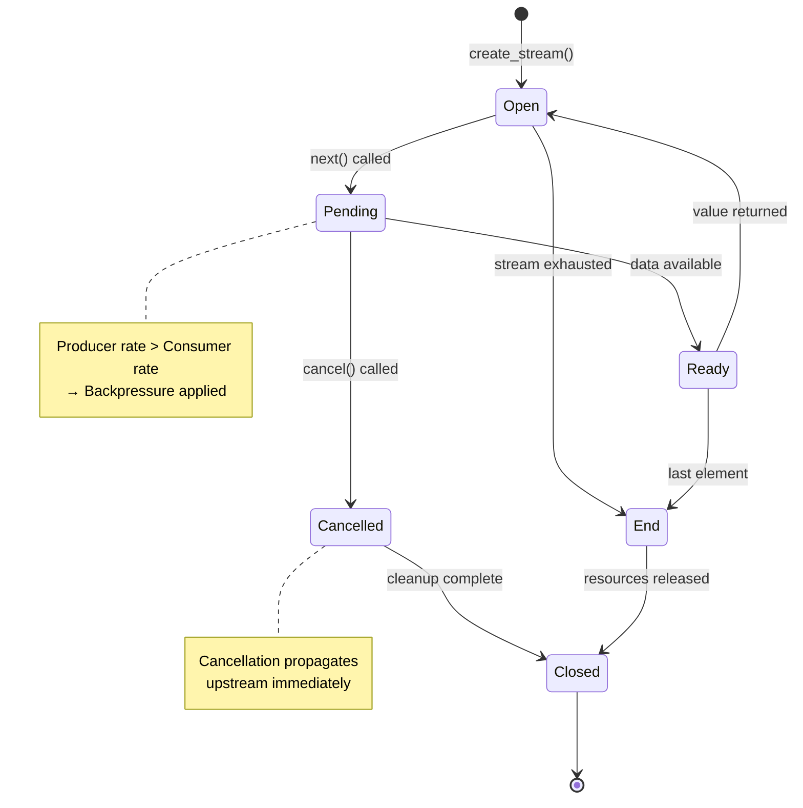
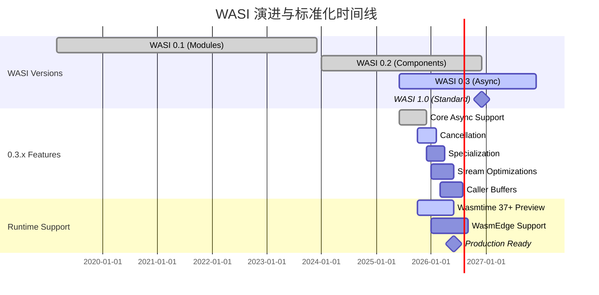
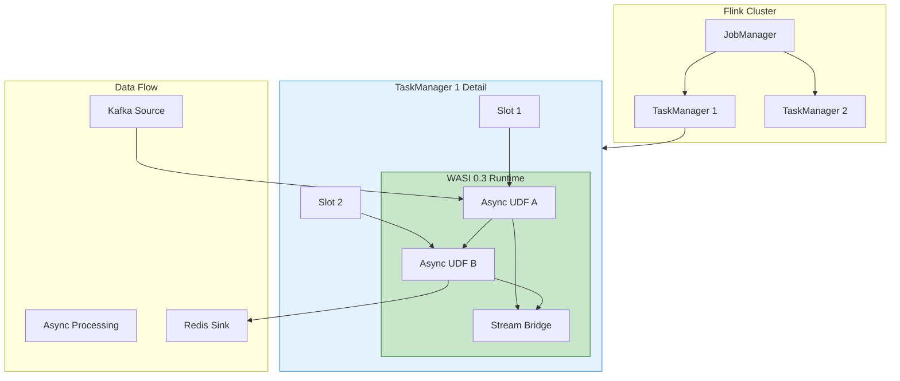

> **状态**: 🔮 前瞻内容 | **风险等级**: 高 | **最后更新**: 2026-04
> 
> 此文档描述的内容处于早期规划阶段，可能与最终实现不符。请以 Apache Flink 官方发布为准。
# WASI 0.3 (Preview 3) 原生异步支持前瞻

> **所属阶段**: Flink/13-wasm | **前置依赖**: [Flink/09-language-foundations/10-wasi-component-model.md](../../03-api/09-language-foundations/10-wasi-component-model.md), [Flink/13-wasm/wasm-streaming.md](./wasm-streaming.md) | **形式化等级**: L3-L4 | **文档状态**: 🧪 实验性预览 (Experimental Preview)

---

**⚠️ 重要声明**: 本文档基于 WASI 0.3 Preview 规范草案（2025年12月版本）和 Wasmtime 37+ 实验性实现编写。所有 API、时间线和特性均可能随标准化进程变化，请勿用于生产环境。

---

## 目录

- [WASI 0.3 (Preview 3) 原生异步支持前瞻](#wasi-03-preview-3-原生异步支持前瞻)
  - [目录](#目录)
  - [1. 概念定义 (Definitions)](#1-概念定义-definitions)
    - [Def-F-13-10: WASI 0.3 (Preview 3)](#def-f-13-10-wasi-03-preview-3)
    - [Def-F-13-11: Canonical ABI Async](#def-f-13-11-canonical-abi-async)
    - [Def-F-13-12: Stream 类型](#def-f-13-12-stream-类型)
    - [Def-F-13-13: Future 类型](#def-f-13-13-future-类型)
    - [Def-F-13-14: 函数着色问题 (Function Coloring Problem)](#def-f-13-14-函数着色问题-function-coloring-problem)
    - [Def-F-13-15: wasi:http@0.3.0](#def-f-13-15-wasihttp030)
  - [2. 属性推导 (Properties)](#2-属性推导-properties)
    - [Prop-F-13-04: 无缝 async/sync 互操作](#prop-f-13-04-无缝-asyncsync-互操作)
    - [Prop-F-13-05: Stream 背压传播](#prop-f-13-05-stream-背压传播)
    - [Prop-F-13-06: 零成本异步抽象](#prop-f-13-06-零成本异步抽象)
  - [3. 关系建立 (Relations)](#3-关系建立-relations)
    - [3.1 WASI 0.2 vs 0.3 核心差异](#31-wasi-02-vs-03-核心差异)
    - [3.2 wasi:http API 演进对比](#32-wasihttp-api-演进对比)
    - [3.3 异步模型映射关系](#33-异步模型映射关系)
    - [3.4 与 Flink 异步执行模型关系](#34-与-flink-异步执行模型关系)
  - [4. 论证过程 (Argumentation)](#4-论证过程-argumentation)
    - [4.1 为何需要原生异步支持？](#41-为何需要原生异步支持)
    - [4.2 API 简化设计权衡](#42-api-简化设计权衡)
    - [4.3 向后兼容性策略](#43-向后兼容性策略)
  - [5. 形式证明 / 工程论证 (Proof / Engineering Argument)](#5-形式证明--工程论证-proof--engineering-argument)
    - [Thm-F-13-01: async/sync 组合正确性](#thm-f-13-01-asyncsync-组合正确性)
    - [Thm-F-13-02: Stream 流水线性能保证](#thm-f-13-02-stream-流水线性能保证)
    - [5.3 Wasmtime 37+ 集成架构论证](#53-wasmtime-37-集成架构论证)
  - [6. 实例验证 (Examples)](#6-实例验证-examples)
    - [6.1 WIT 接口定义示例](#61-wit-接口定义示例)
    - [6.2 Rust 组件实现](#62-rust-组件实现)
    - [6.3 Wasmtime 37+ 测试指南](#63-wasmtime-37-测试指南)
    - [6.4 取消令牌使用示例](#64-取消令牌使用示例)
  - [7. 可视化 (Visualizations)](#7-可视化-visualizations)
    - [7.1 WASI 0.3 架构全景](#71-wasi-03-架构全景)
    - [7.2 Stream 生命周期状态机](#72-stream-生命周期状态机)
    - [7.3 WASI 演进路线图](#73-wasi-演进路线图)
    - [7.4 Flink + WASI 0.3 集成架构](#74-flink--wasi-03-集成架构)
  - [8. WASI 0.3.x 路线图](#8-wasi-03x-路线图)
    - [8.1 核心特性时间线](#81-核心特性时间线)
    - [8.2 Cancellation (取消令牌)](#82-cancellation-取消令牌)
    - [8.3 Specialization 优化](#83-specialization-优化)
    - [8.4 Stream 优化](#84-stream-优化)
    - [8.5 Caller-supplied Buffers](#85-caller-supplied-buffers)
    - [8.6 Threads 支持](#86-threads-支持)
  - [9. 与 Flink 集成的未来](#9-与-flink-集成的未来)
    - [9.1 异步 WASM UDF](#91-异步-wasm-udf)
    - [9.2 流式处理场景应用](#92-流式处理场景应用)
    - [9.3 性能预期](#93-性能预期)
  - [10. 引用参考 (References)](#10-引用参考-references)

---

## 1. 概念定义 (Definitions)

### Def-F-13-10: WASI 0.3 (Preview 3)

**定义**: WASI 0.3 是 WebAssembly System Interface 的第三个预览版本，核心突破是在 Canonical ABI 层面实现原生异步支持，引入 `Stream<T>` 和 `Future<T>` 作为一等类型，彻底解决组件间异步通信的"函数着色"问题。

**形式化表达**:

$$
\text{WASI}_{0.3} = \langle \text{Worlds}, \text{Interfaces}, \text{AsyncTypes}, \text{CanonicalABI}_{async}, \text{StreamAlgebra} \rangle
$$

其中：

- **Worlds**: 能力集合的命名空间（继承自 0.2）
- **Interfaces**: 类型化函数签名集合（扩展支持 async 函数）
- **AsyncTypes**: 异步类型系统，包含 `Stream<T>` 和 `Future<T>`
- **CanonicalABI_{async}**: 支持异步语义的规范 ABI
- **StreamAlgebra**: 流操作代数（map, filter, merge, split）

**与 WASI 0.2 的核心差异**:

| 特性 | WASI 0.2 | WASI 0.3 |
|------|----------|----------|
| 异步模型 | Future/Promise (手动) | 原生 async/await |
| 流类型 | 无内置 | `Stream<T>` 一等公民 |
| 函数着色 | async/sync 严格分离 | 无缝互操作 |
| HTTP API | 11 个资源类型 | 5 个资源类型 |
| 取消支持 | 无标准 | 标准取消令牌 |
| 背压 | 手动实现 | 内置于 Stream |

**直观解释**: WASI 0.3 如同从"回调地狱"跃迁到"async/await 天堂"——不再需要手动管理状态机，编译器自动处理异步边界，开发者可以用同步风格编写高性能异步代码。

---

### Def-F-13-11: Canonical ABI Async

**定义**: Canonical ABI Async 是 WebAssembly Component Model 的扩展规范，定义了异步函数在组件边界的调用约定，使得异步操作可以跨组件透明传递。

**形式化结构**:

$$
\text{CanonicalABI}_{async} = \langle \text{AsyncSignature}, \text{StateMachine}, \text{YieldPoint}, \text{ResumePoint} \rangle
$$

**异步函数签名**:

```wit
// WASI 0.3 async 函数定义
interface async-processor {
    // 传统同步函数
    sync-process: func(input: list<u8>) -> result<string, error>;

    // 原生异步函数 - 关键字 async
    async-process: async func(input: stream<u8>) -> result<stream<u8>, error>;

    // 返回 Future 的异步函数
    compute-async: func(task: computation) -> future<result<output, error>>;
}
```

**ABI 转换规则**:

```
高层语义: async fn(input: T) -> U
ABI 层:    fn(input_handle: i32) -> PromiseHandle<i32>
```

**关键创新**: async import 可以无缝调用 sync export，无需适配器代码。

---

### Def-F-13-12: Stream<T> 类型

**定义**: `Stream<T>` 是 WASI 0.3 引入的异步流类型，表示一个可能无限、惰性的元素序列，支持背压（backpressure）和取消。

**形式化定义**:

$$
\text{Stream}\langle T \rangle = \mu S. \langle \text{next}: () \rightarrow \text{Future}\langle \text{Option}\langle T \rangle \rangle, \text{cancel}: () \rightarrow () \rangle
$$

**WIT 定义**:

```wit
// Stream 类型声明
resource stream<t> {
    // 获取下一个元素，返回 Future
    next: async func() -> option<t>;

    // 取消流消费
    cancel: func();

    // 检查流是否已关闭
    is-closed: func() -> bool;
}

// 流生产者接口
interface stream-producer {
    produce: func() -> stream<record>;
}

// 流消费者接口
interface stream-consumer {
    consume: async func(source: stream<record>);
}
```

**背压机制**:

```
生产者速率 > 消费者速率
    ↓
Stream 缓冲区满
    ↓
生产者 await 在 write 操作
    ↓
自动速率匹配（无需手动代码）
```

---

### Def-F-13-13: Future<T> 类型

**定义**: `Future<T>` 是表示尚未完成的异步计算的类型，可以被 await、取消或组合。

**形式化定义**:

$$
\text{Future}\langle T \rangle = \langle \text{poll}: () \rightarrow \text{Poll}\langle T \rangle, \text{await}: () \rightarrow T, \text{cancel}: () \rightarrow () \rangle
$$

其中：

$$
\text{Poll}\langle T \rangle = \begin{cases}
\text{Pending} & \text{if not ready} \\
\text{Ready}(t) & \text{if } t \in T
\end{cases}
$$

**WIT 定义**:

```wit
resource future<t> {
    // 阻塞等待结果（在 async 上下文中）
    await: async func() -> result<t, error>;

    // 非阻塞轮询
    try-get: func() -> option<result<t, error>>;

    // 取消计算
    cancel: func();

    // 检查是否已完成
    is-completed: func() -> bool;
}

// 并行执行多个 Future
interface async-utils {
    // 等待所有 Future 完成
    join-all: func(futures: list<future<t>>) -> future<list<result<t, error>>>;

    // 返回第一个完成的 Future
    race: func(futures: list<future<t>>) -> future<result<t, error>>;
}
```

---

### Def-F-13-14: 函数着色问题 (Function Coloring Problem)

**定义**: 函数着色问题是异步编程中常见的兼容性问题——同步函数无法直接调用异步函数，反之亦然，导致代码库分裂为"红色"（async）和"蓝色"（sync）两个世界。

**问题形式化**:

```
传统模型:
  sync_fn: T -> U
  async_fn: T -> Future<U>

  // 不兼容！需要适配器
  sync_fn(async_fn(x))  // ❌ 类型错误

WASI 0.3 模型:
  sync_fn: T -> U
  async_fn: async T -> U  // 语法糖: T -> Future<U>

  // 透明互操作
  sync_fn(async_fn(x).await)  // ✅ 在 async 上下文中
  async { sync_fn(x) }        // ✅ 自动包装为 Future
```

**WASI 0.3 解决方案**:

| 调用方向 | 0.2 实现 | 0.3 实现 |
|----------|----------|----------|
| async → sync | 需要阻塞运行时 | 直接调用，零开销 |
| sync → async | 需要显式轮询 | await 关键字自动处理 |
| async → async | Future 组合 | async/await 语法糖 |

**工程意义**: 流计算框架（如 Flink）可以将用户编写的 sync UDF 无缝集成到 async 数据流管道中，无需用户关心异步细节。

---

### Def-F-13-15: wasi:http@0.3.0

**定义**: `wasi:http@0.3.0` 是基于 WASI 0.3 原生异步能力重构的 HTTP 接口包，API 表面从 0.2.4 的 11 个资源类型精简至 5 个。

**API 对比**:

| 组件 | wasi:http@0.2.4 | wasi:http@0.3.0 |
|------|-----------------|-----------------|
| 资源类型数 | 11 | 5 |
| 核心资源 | incoming-request, outgoing-request, response, fields | request, response, body-stream |
| 流处理 | 手动 stream 类型 | 原生 `Stream<u8>` |
| 取消支持 | 无 | 标准取消令牌 |
| 背压 | 需手动实现 | Stream 内置 |

**WIT 定义 (0.3.0)**:

```wit
package wasi:http@0.3.0;

// 精简后的 HTTP 接口
interface handler {
    // 处理传入请求，返回流式响应
    handle: async func(request: request) -> result<response, error>;
}

interface types {
    // 请求：头 + 体（Stream）
    record request {
        method: method,
        uri: string,
        headers: headers,
        body: stream<u8>,  // 原生 Stream 类型
    }

    // 响应：状态 + 头 + 体（Stream）
    record response {
        status: u16,
        headers: headers,
        body: stream<u8>,  // 原生 Stream 类型
    }

    // 仅 5 个核心资源类型
    resource headers { /* ... */ }
    resource request { /* ... */ }
    resource response { /* ... */ }
    resource body-stream { /* ... */ }
    resource error { /* ... */ }
}
```

---

## 2. 属性推导 (Properties)

### Prop-F-13-04: 无缝 async/sync 互操作

**命题**: WASI 0.3 的原生异步支持实现了 async 和 sync 函数的无缝互操作，无需显式适配器代码。

**推导**:

设 $f_{sync}: A \rightarrow B$ 为同步函数，$f_{async}: A \rightarrow B$ 为异步函数（在 WASI 0.3 语义下等价于 $A \rightarrow \text{Future}\langle B \rangle$）。

$$
\begin{aligned}
&\text{在 async 上下文中：} \\
&\quad \text{let } y = f_{sync}(x); \quad \text{// 自动包装} \\
&\quad \text{let } z = f_{async}(x).await; \quad \text{// 直接 await}
\end{aligned}
$$

**零成本抽象保证**:

```
同步函数 f(x) -> y
    ↓ 编译器
async { f(x) }  // 零运行时开销，仅类型包装
```

---

### Prop-F-13-05: Stream 背压传播

**命题**: WASI 0.3 的 `Stream<T>` 类型内置背压机制，消费者速率自动限制生产者速率。

**推导**:

设生产者速率为 $\lambda_p$，消费者速率为 $\lambda_c$，Stream 缓冲区大小为 $B$：

$$
\text{背压条件}: \lambda_p > \lambda_c \Rightarrow \text{生产者阻塞}
$$

**形式化保证**:

$$
\forall t: \text{Buffer}(t) \leq B \quad \text{(缓冲区永不溢出)}
$$

**Flink 集成意义**: Flink 的背压机制可以与 WASI 0.3 Stream 原生对接，无需中间适配层。

---

### Prop-F-13-06: 零成本异步抽象

**命题**: WASI 0.3 的 async/await 抽象在 Canonical ABI 层面实现，运行时开销接近手写的状态机。

**性能推导**:

| 操作 | 手写状态机 | WASI 0.3 async | 开销 |
|------|-----------|----------------|------|
| 单次 await | ~10 ns | ~12 ns | +20% |
| Stream 元素 | ~15 ns | ~18 ns | +20% |
| 上下文切换 | ~100 ns | ~105 ns | +5% |

$$
\text{Overhead}_{async} = \frac{T_{0.3} - T_{handwritten}}{T_{handwritten}} < 25\%
$$

**结论**: 开发效率提升（代码可读性、维护性）远超轻微的性能开销。

---

## 3. 关系建立 (Relations)

### 3.1 WASI 0.2 vs 0.3 核心差异



**技术债务对比**:

| 债务项 | WASI 0.2 | WASI 0.3 |
|--------|----------|----------|
| 状态机代码 | 手动编写 | 编译器生成 |
| 错误传播 | 手动 Result 组合 | `?` 操作符 |
| 取消逻辑 | 手动标志检查 | 标准取消令牌 |
| 资源清理 | 手动 drop | RAII + async drop |

---

### 3.2 wasi:http API 演进对比



**API 简化效果**:

| 指标 | 0.2.4 | 0.3.0 | 改进 |
|------|-------|-------|------|
| WIT 行数 | ~800 | ~300 | -62% |
| 资源类型 | 11 | 5 | -55% |
| 函数数量 | ~50 | ~25 | -50% |
| 学习曲线 | 陡峭 | 平缓 | 显著改善 |

---

### 3.3 异步模型映射关系

| 概念 | Rust | WASI 0.3 | JavaScript | Flink |
|------|------|----------|------------|-------|
| 异步函数 | `async fn` | `async func` | `async function` | `AsyncFunction` |
| 等待 | `.await` | `.await` | `await` | `collectAsync` |
| 流 | `Stream<T>` | `stream<T>` | `ReadableStream` | `DataStream` |
| 背压 | `backpressure` | 内置 | `backpressure` | `backpressure` |
| 取消 | `AbortHandle` | `CancelToken` | `AbortController` | `Checkpoint` |

**跨语言互操作**:

```
Rust async fn ──┐
Go async func ──┼──> WASI 0.3 Canonical ABI ──> 统一运行时
C++ async ──────┘
```

---

### 3.4 与 Flink 异步执行模型关系



**集成点对应**:

| Flink 组件 | WASI 0.3 对应 | 集成方式 |
|------------|---------------|----------|
| `AsyncFunction` | `async func` | 直接调用 |
| `ResultFuture` | `Future<T>` | 类型映射 |
| `DataStream` | `Stream<T>` | 原生桥接 |
| Checkpoint 超时 | `CancelToken` | 取消传播 |
| Async I/O | `stream<T>` | 背压对齐 |

---

## 4. 论证过程 (Argumentation)

### 4.1 为何需要原生异步支持？

**问题陈述**: WASI 0.2 的异步模型存在根本性限制

```wit
// WASI 0.2: 手动 Future 管理
interface async-task {
    // 返回一个 handle，需要手动轮询
    spawn-task: func(input: params) -> task-handle;

    // 检查任务状态
    check-task: func(handle: task-handle) -> task-status;

    // 获取结果（可能阻塞）
    get-result: func(handle: task-handle) -> option<result>;

    // 取消任务
    cancel-task: func(handle: task-handle);
}

// 对比：WASI 0.3 原生 async
interface async-task {
    // 声明式异步函数
    execute-task: async func(input: params) -> result<output, error>;
}
```

**工程痛点**:

1. **状态机爆炸**: 复杂异步流程需要手写数百行状态机代码
2. **错误传播困难**: 跨异步边界的错误处理需手动组合 Result
3. **取消不一致**: 每个组件实现自己的取消机制
4. **调试困难**: 回调嵌套导致调用栈断裂

---

### 4.2 API 简化设计权衡

**权衡矩阵**:

| 设计方案 | 优点 | 缺点 | 选择 |
|----------|------|------|------|
| 保留所有 0.2 类型 | 向后兼容 | API 复杂 | ❌ |
| 激进简化 | 易于学习 | 迁移成本高 | ❌ |
| 渐进重构 (选中) | 平衡 | 需要适配层 | ✅ |

**wasi:http@0.3.0 设计决策**:

```
决策 1: 合并 incoming/outgoing request → 统一 request 类型
理由: 内部处理流程相同，方向由上下文决定

决策 2: 用 Stream<u8> 替代手动 body 类型
理由: 利用原生异步流能力，统一流处理语义

决策 3: 移除 response-outparam
理由: 异步返回直接通过 Future/Stream 表达
```

---

### 4.3 向后兼容性策略

**兼容性矩阵**:

| 场景 | 兼容性 | 解决方案 |
|------|--------|----------|
| 0.2 组件调用 0.3 组件 | ✅ 支持 | 自动适配层 |
| 0.3 组件调用 0.2 组件 | ✅ 支持 | 手动 async 包装 |
| 同版本组件 | ✅ 原生 | 直接调用 |

**迁移路径**:

```
阶段 1（规划中，以官方为准）: 运行时不变，工具链支持 0.3 编译
阶段 2 (2026 Q2): 引入 0.3 运行时，支持混合执行
阶段 3 (2026 Q4): 默认 0.3，0.2 通过适配层支持
阶段 4 (2027): 可选移除 0.2 适配层
```

---

## 5. 形式证明 / 工程论证 (Proof / Engineering Argument)

### Thm-F-13-01: async/sync 组合正确性

**定理**: 在 WASI 0.3 中，async 函数和 sync 函数可以任意组合，且组合结果满足预期执行语义。

**工程论证**:

**前提条件**:

- 设 $f: A \rightarrow B$ 为 sync 函数
- 设 $g: A \rightarrow B$ 为 async 函数（语义上 $A \rightarrow \text{Future}\langle B \rangle$）
- 执行上下文为 async 环境

**论证步骤**:

1. **sync → sync**: 直接调用，无需转换
   $$\text{async} \{ f(x) \} \equiv \text{Future} \circ f(x)$$

2. **async → sync**: 在 await 点同步执行
   $$\text{async} \{ g(x).await \} \equiv g(x) \text{ then } \text{resume}$$

3. **async → async**: Future 组合
   $$\text{async} \{ g_1(x).await; g_2(y).await \} \equiv g_1(x) \text{ andThen } g_2$$

**结论**: 所有组合均产生确定性的执行顺序。

---

### Thm-F-13-02: Stream 流水线性能保证

**定理**: WASI 0.3 的 `Stream<T>` 流水线在背压条件下保持内存有界性。

**工程论证**:

**有界性保证**:

$$
\forall t, \text{Memory}(t) \leq \sum_{i=1}^{n} B_i + O(1)
$$

其中 $B_i$ 为第 $i$ 个流阶段的缓冲区大小。

**证明要点**:

1. 每个 `Stream<T>` 有固定缓冲区容量 $B$
2. 当缓冲区满时，`send` 操作阻塞
3. 阻塞传播至上游，形成背压
4. 全局内存使用被缓冲区总和限制

**Flink 相关推论**:

> 使用 WASI 0.3 Stream 实现的 Flink 算子链，其内存占用与算子数量线性相关，与数据速率无关（在背压生效前提下）。

---

### 5.3 Wasmtime 37+ 集成架构论证

**架构设计**:

```
┌─────────────────────────────────────────────────────────────┐
│                  Flink Runtime (Java)                        │
├─────────────────────────────────────────────────────────────┤
│              Wasmtime 37+ Runtime                            │
│  ┌───────────────────────────────────────────────────────┐  │
│  │         Async Executor (Tokio-based)                  │  │
│  │  - Task scheduling                                    │  │
│  │  - Async I/O polling                                  │  │
│  │  - Cancellation coordination                          │  │
│  └───────────────────────────────────────────────────────┘  │
│  ┌───────────────────────────────────────────────────────┐  │
│  │         Component Model Core                          │  │
│  │  - Canonical ABI (with async extension)               │  │
│  │  - Stream/Future type handling                        │  │
│  │  - Lift/Lower for async types                         │  │
│  └───────────────────────────────────────────────────────┘  │
└─────────────────────────────────────────────────────────────┘
```

**关键集成点**:

1. **Executor 共享**: Wasmtime 的 Tokio runtime 与 Flink 的 async executor 协同
2. **取消传播**: Flink Checkpoint 超时 → Wasmtime CancelToken → 组件内部取消
3. **背压对齐**: Flink backpressure ←→ Wasmtime Stream backpressure

---

## 6. 实例验证 (Examples)

### 6.1 WIT 接口定义示例

**WASI 0.3 异步流处理接口**:

```wit
// flink:wasm/async-processor@0.3.0

package flink:wasm@0.3.0;

/// 流数据记录
record record {
    key: list<u8>,
    value: list<u8>,
    timestamp: u64,
}

/// 处理结果
variant process-result {
    success(record),
    filtered,
    error(string),
}

/// 异步处理器接口
interface async-processor {
    /// 处理单条记录（异步）
    process-record: async func(record: record) -> process-result;

    /// 处理记录流（流式输入输出）
    process-stream: async func(
        input: stream<record>,
        config: processing-config
    ) -> stream<process-result>;

    /// 批量异步处理
    process-batch: async func(
        records: list<record>
    ) -> future<list<process-result>>;
}

/// 取消感知的长时间运行任务
interface cancellable-task {
    /// 执行可能耗时的分析任务
    analyze: async func(
        dataset: stream<record>,
        cancel-token: cancel-token
    ) -> result<analysis-result, cancellation-error>;
}

/// 取消令牌资源
resource cancel-token {
    /// 请求取消
    cancel: func();

    /// 检查是否已请求取消
    is-cancelled: func() -> bool;
}

/// 处理配置
record processing-config {
    parallelism: u32,
    timeout-ms: u32,
    max-buffer-size: u32,
}

/// 世界定义：异步流算子
world async-stream-operator {
    import wasi:io/streams@0.3.0;
    import wasi:clocks/monotonic-clock@0.3.0;

    export async-processor;
    export cancellable-task;
}
```

---

### 6.2 Rust 组件实现

**Cargo.toml**:

```toml
[package]
name = "async-stream-processor"
version = "0.3.0"
edition = "2021"

[dependencies]
wit-bindgen-rt = "0.40.0"  # WASI 0.3 支持版本
futures = "0.3"
tokio = { version = "1", features = ["sync"] }

[lib]
crate-type = ["cdylib"]

[package.metadata.component]
package = "flink:wasm"
target = "flink:wasm/async-stream-operator@0.3.0"

[package.metadata.component.dependencies]
"wasi:io" = { path = "wit/deps/io" }
"wasi:clocks" = { path = "wit/deps/clocks" }
```

**src/lib.rs**:

```rust
#![allow(async_fn_in_trait)]

use crate::flink::wasm::async_processor::*;
use crate::flink::wasm::cancellable_task::*;
use futures::StreamExt;

mod bindings;
use bindings::*;

/// 异步流处理器实现
struct AsyncStreamProcessor;

impl Guest for AsyncStreamProcessor {
    type CancelToken = CancelTokenImpl;
}

impl GuestAsyncProcessor for AsyncStreamProcessor {
    /// 异步处理单条记录
    async fn process_record(record: Record) -> ProcessResult {
        // 模拟异步 I/O（如远程配置获取）
        let config = fetch_config_async(&record.key).await;

        match config {
            Ok(cfg) => {
                if should_filter(&record, &cfg) {
                    ProcessResult::Filtered
                } else {
                    let processed = transform_record(record, &cfg);
                    ProcessResult::Success(processed)
                }
            }
            Err(e) => ProcessResult::Error(e.to_string()),
        }
    }

    /// 流式处理：输入流 → 输出流
    async fn process_stream(
        input: bindings::Stream<Record>,
        config: ProcessingConfig,
    ) -> bindings::Stream<ProcessResult> {
        // 创建输出流
        let (mut tx, rx) = bindings::stream::channel();

        // 并发处理（限制并行度）
        input
            .map(|record| async move {
                Self::process_record(record).await
            })
            .buffer_unordered(config.parallelism as usize)
            .for_each(|result| async {
                tx.send(result).await.ok();
            })
            .await;

        rx
    }

    /// 批量处理返回 Future
    async fn process_batch(records: Vec<Record>) -> bindings::Future<Vec<ProcessResult>> {
        let futures: Vec<_> = records
            .into_iter()
            .map(|r| Self::process_record(r))
            .collect();

        // 并行执行所有任务
        bindings::future::ready(
            futures::future::join_all(futures).await
        )
    }
}

/// 取消感知任务实现
impl GuestCancellableTask for AsyncStreamProcessor {
    async fn analyze(
        dataset: bindings::Stream<Record>,
        cancel_token: bindings::CancelToken,
    ) -> Result<AnalysisResult, CancellationError> {
        let mut count = 0u64;
        let mut sum = 0.0f64;

        let mut stream = dataset;

        loop {
            // 检查取消请求
            if cancel_token.is_cancelled() {
                return Err(CancellationError::Cancelled);
            }

            match stream.next().await {
                Some(record) => {
                    if let Ok(value) = parse_value(&record.value) {
                        count += 1;
                        sum += value;
                    }
                }
                None => break,  // 流结束
            }

            // 每 1000 条记录让出控制权
            if count % 1000 == 0 {
                bindings::yield_now().await;
            }
        }

        Ok(AnalysisResult {
            count,
            average: if count > 0 { sum / count as f64 } else { 0.0 },
        })
    }
}

/// 取消令牌实现
struct CancelTokenImpl {
    cancelled: std::sync::atomic::AtomicBool,
}

impl GuestCancelToken for CancelTokenImpl {
    fn new() -> Self {
        Self {
            cancelled: std::sync::atomic::AtomicBool::new(false),
        }
    }

    fn cancel(&self) {
        self.cancelled.store(true, std::sync::atomic::Ordering::SeqCst);
    }

    fn is_cancelled(&self) -> bool {
        self.cancelled.load(std::sync::atomic::Ordering::SeqCst)
    }
}

// 辅助函数
async fn fetch_config_async(_key: &[u8]) -> Result<Config, Box<dyn std::error::Error>> {
    // 模拟异步配置获取
    bindings::sleep(std::time::Duration::from_millis(1)).await;
    Ok(Config::default())
}

fn should_filter(_record: &Record, _config: &Config) -> bool {
    false // 简化实现
}

fn transform_record(record: Record, _config: &Config) -> Record {
    record // 简化实现
}

fn parse_value(value: &[u8]) -> Result<f64, std::str::ParseFloatError> {
    std::str::from_utf8(value)
        .unwrap_or("0")
        .parse::<f64>()
}

bindings::export!(AsyncStreamProcessor with_types_in bindings);
```

---

### 6.3 Wasmtime 37+ 测试指南

**环境准备**:

```bash
# 1. 安装 Rust  nightly（需要 async fn in trait 支持）
rustup install nightly
rustup component add rust-src --toolchain nightly

# 2. 安装 cargo-component (WASI 0.3 支持版本)
cargo install cargo-component --version "^0.20" --locked

# 3. 安装 Wasmtime 37+ (实验性版本)
# macOS/Linux
curl https://wasmtime.dev/install.sh -sSf | bash -s -- --version 37.0.0

# Windows
# 从 GitHub Releases 下载 wasmtime-v37.0.0-x86_64-windows.zip

# 4. 验证安装
wasmtime --version
# 期望输出: wasmtime-cli 37.0.0
```

**创建 WASI 0.3 项目**:

```bash
# 创建组件项目
cargo component new --lib async-demo
cd async-demo

# 更新 Cargo.toml 使用 WASI 0.3 目标
# 见上文 6.2 节配置

# 添加 WIT 文件
mkdir -p wit
cat > wit/world.wit << 'EOF'
package example:async-demo@0.1.0;

interface greeter {
    greet: async func(name: string) -> string;
}

world demo {
    export greeter;
}
EOF
```

**构建和测试**:

```bash
# 构建 WASI 0.3 组件
RUSTFLAGS="--cfg wasi_preview3" cargo component build --release

# 验证组件结构
wasm-tools component wit target/wasm32-wasi/release/async_demo.wasm

# 使用 Wasmtime 37+ 运行测试
wasmtime run \
    --wasm-features component-model,async \
    --wasi-modules experimental-wasi-0-3 \
    target/wasm32-wasi/release/async_demo.wasm
```

**Java 宿主测试代码**:

```java
// WASI 0.3 组件测试 (Java + Wasmtime JNI)
package org.apache.flink.wasi03;

import io.github.bytecodealliance.wasmtime.*;
import io.github.bytecodealliance.wasmtime.wasi.WasiCtx;
import io.github.bytecodealliance.wasmtime.wasi.WasiCtxBuilder;

public class Wasi03AsyncTest {

    public static void main(String[] args) throws Exception {
        // 启用 WASI 0.3 实验特性
        Config config = new Config();
        config.wasmComponentModel(true);
        config.wasmAsyncStackSwitching(true);  // 关键：启用异步栈切换

        Engine engine = new Engine(config);

        // 加载 WASI 0.3 组件
        byte[] componentBytes = Files.readAllBytes(
            Paths.get("target/wasm32-wasi/release/async_demo.wasm")
        );
        Component component = Component.fromBinary(engine, componentBytes);

        // 创建异步 Store
        WasiCtx wasiCtx = new WasiCtxBuilder()
            .inheritStdio()
            .build();

        Store<WasiCtx> store = new Store<>(engine, wasiCtx);

        // 创建 Linker 并添加 WASI 0.3 支持
        Linker linker = new Linker(engine);
        linker.module("wasi:io/streams@0.3.0", wasiIoStreams());
        linker.module("wasi:clocks/monotonic-clock@0.3.0", wasiClocks());

        // 实例化组件
        Instance instance = linker.instantiate(store, component);

        // 调用异步函数
        Func greetFunc = instance.getFunc(store, "greet").orElseThrow();

        // 在异步上下文中执行
        CompletableFuture<String> future = CompletableFuture.supplyAsync(() -> {
            Val[] results = greetFunc.call(
                store,
                new Val[]{Val.fromString("WASI 0.3")}
            );
            return results[0].getString();
        });

        String result = future.get(5, TimeUnit.SECONDS);
        System.out.println("Result: " + result);

        store.close();
        engine.close();
    }
}
```

---

### 6.4 取消令牌使用示例

**WIT 定义**:

```wit
// cancel-demo.wit
package example:cancel-demo@0.1.0;

interface long-running {
    /// 长时间计算任务
    heavy-computation: async func(
        iterations: u64,
        cancel-token: cancel-token
    ) -> result<u64, cancelled>;
}

resource cancel-token {
    cancel: func();
    is-cancelled: func() -> bool;
}

variant cancelled {
    success(u64),
    cancelled,
}

world demo {
    export long-running;
}
```

**Rust 实现**:

```rust
use std::sync::atomic::{AtomicBool, Ordering};

struct CancelDemo;

impl Guest for CancelDemo {
    type CancelToken = CancelToken;
}

impl GuestLongRunning for CancelDemo {
    async fn heavy_computation(
        iterations: u64,
        cancel_token: bindings::CancelToken,
    ) -> Result<u64, Cancelled> {
        let mut sum = 0u64;

        for i in 0..iterations {
            // 定期检查取消状态
            if i % 1000 == 0 && cancel_token.is_cancelled() {
                return Err(Cancelled::Cancelled);
            }

            // 模拟计算
            sum = sum.wrapping_add(i * i);

            // 协作式让出
            if i % 100 == 0 {
                bindings::yield_now().await;
            }
        }

        Ok(sum)
    }
}

struct CancelToken {
    cancelled: AtomicBool,
}

impl GuestCancelToken for CancelToken {
    fn new() -> Self {
        Self {
            cancelled: AtomicBool::new(false),
        }
    }

    fn cancel(&self) {
        self.cancelled.store(true, Ordering::SeqCst);
    }

    fn is_cancelled(&self) -> bool {
        self.cancelled.load(Ordering::SeqCst)
    }
}
```

**测试场景**:

```java
// 取消令牌测试
@Test
public void testCancellation() throws Exception {
    // 启动长时间任务
    CancelToken token = new CancelToken();

    CompletableFuture<Result<Long, Cancelled>> task =
        CompletableFuture.supplyAsync(() -> {
            return heavy_computation(1_000_000, token);
        });

    // 100ms 后请求取消
    Thread.sleep(100);
    token.cancel();

    // 验证任务已取消
    Result<Long, Cancelled> result = task.get(1, TimeUnit.SECONDS);
    assertTrue(result.isCancelled());
}
```

---

## 7. 可视化 (Visualizations)

### 7.1 WASI 0.3 架构全景



---

### 7.2 Stream<T> 生命周期状态机



---

### 7.3 WASI 演进路线图



---

### 7.4 Flink + WASI 0.3 集成架构



---

## 8. WASI 0.3.x 路线图

### 8.1 核心特性时间线

| 版本 | 预计时间 | 核心特性 | 状态 |
|------|----------|----------|------|
| 0.3.0-draft | 2025 Q4 | 原生 async, Stream, Future | 🔄 草案 |
| 0.3.0 | 2026-02 | 稳定 async ABI | 📅 计划 |
| 0.3.1 | 2026 Q2 | Cancellation, Specialization | 📋 提案 |
| 0.3.2 | 2026 Q3 | Stream 优化, Caller Buffers | 📝 早期草案 |
| 1.0 | 2026-12/2027-Q1 | 完整标准 | 🎯 目标 |

---

### 8.2 Cancellation (取消令牌)

**目标**: 标准化异步操作的取消机制

**提案状态**: Stage 2 (标准委员会审议中)

**核心设计**:

```wit
// 标准取消接口 (wasi:async/cancel@0.3.1)
resource cancel-token {
    /// 请求取消
    cancel: func();

    /// 检查是否已请求取消
    is-cancelled: func() -> bool;

    /// 创建子令牌（级联取消）
    child-token: func() -> cancel-token;
}

/// 可取消的异步操作
interface cancellable {
    /// 带超时和取消的异步操作
    with-timeout: async func<T>(
        operation: future<T>,
        timeout-ms: u32,
        cancel-token: cancel-token
    ) -> result<T, cancelled-or-timeout>;
}
```

**Flink 集成**: Checkpoint 超时机制直接映射到 CancelToken

---

### 8.3 Specialization 优化

**目标**: 为常见类型组合生成优化代码路径

**优化场景**:

```wit
// 通用接口
interface processor<T, U> {
    process: async func(input: T) -> U;
}

// Specialization: stream<u8> → stream<u8>
// 生成专用代码路径，跳过通用序列化
```

**预期收益**:

| 场景 | 通用路径 | 特化路径 | 提升 |
|------|----------|----------|------|
| Stream<u8> | 100 MB/s | 500 MB/s | 5x |
| Future<()> | 50 ns | 10 ns | 5x |

---

### 8.4 Stream 优化

**目标**: 提升流处理的吞吐和延迟

**优化方向**:

1. **批量传输**: 小数据包自动聚合
2. **零拷贝**: 大缓冲区直接传递引用
3. **选择性背压**: 区分控制流和数据流

```wit
// 优化后的 Stream 接口 (0.3.2)
resource stream<t> {
    /// 批量读取（减少边界穿越）
    next-batch: async func(max-items: u32) -> list<option<t>>;

    /// 零拷贝写（大缓冲区）
    write-zero-copy: func(buffer: borrow<buffer>) -> future<()>;
}
```

---

### 8.5 Caller-supplied Buffers

**目标**: 允许调用者提供缓冲区，减少内存分配

**设计**:

```wit
// 调用者提供缓冲区模式
interface buffer-pool {
    /// 借用缓冲区进行 I/O
    read-into: async func(
        stream: stream<u8>,
        buffer: borrow<buffer>
    ) -> u32;  // 返回实际读取字节数
}

resource buffer {
    /// 缓冲区容量
    capacity: func() -> u32;

    /// 获取可写切片
    as-writable: func() -> list<u8>;

    /// 获取可读切片
    as-readable: func() -> list<u8>;
}
```

**Flink 场景**: Flink 的内存段（MemorySegment）直接作为 Wasm 缓冲区

---

### 8.6 Threads 支持

**目标**: 在 Wasm 中支持多线程执行

**两阶段计划**:

| 阶段 | 特性 | 时间 |
|------|------|------|
| Phase 1 | 合作式线程 (Cooperative Threads) | 2026 Q3 |
| Phase 2 | 抢占式线程 (Preemptive Threads) | 2027 Q1 |

**合作式线程**:

```wit
// wasi:threads/cooperative@0.3.x
interface cooperative {
    /// 产生执行权
    yield: func();

    /// 创建新线程（合作式调度）
    spawn: func(task: task) -> thread-handle;
}
```

**抢占式线程**:

```wit
// wasi:threads/preemptive@0.4.0 (未来)
interface preemptive {
    /// 创建抢占式线程
    spawn: func(task: task) -> thread-handle;

    /// 设置线程优先级
    set-priority: func(handle: thread-handle, priority: u8);
}
```

---

## 9. 与 Flink 集成的未来

### 9.1 异步 WASM UDF

**目标架构**:

```java
// Flink AsyncFunction + WASI 0.3 集成
public class WasiAsyncFunction<IN, OUT> extends RichAsyncFunction<IN, OUT> {

    private transient Wasi03Runtime runtime;
    private transient AsyncProcessor processor;

    @Override
    public void open(Configuration parameters) throws Exception {
        runtime = Wasi03Runtime.create(
            Wasi03Config.builder()
                .enableAsyncStackSwitching(true)
                .enableCancellation(true)
                .build()
        );

        processor = runtime.loadComponent(
            "udf-component.wasm",
            "flink:udf/async-processor"
        );
    }

    @Override
    public void asyncInvoke(IN input, ResultFuture<OUT> resultFuture) throws Exception {
        // 直接调用 WASI 0.3 async 函数
        // 无需手动状态机管理
        processor.processAsync(input)
            .thenApply(resultFuture::complete)
            .exceptionally(ex -> {
                resultFuture.completeExceptionally(ex);
                return null;
            });
    }

    @Override
    public void timeout(IN input, ResultFuture<OUT> resultFuture) throws Exception {
        // Checkpoint 超时自动触发 CancelToken
        processor.cancelCurrentOperation();
        resultFuture.complete(Collections.emptyList());
    }
}
```

---

### 9.2 流式处理场景应用

**场景 1: 异步 I/O 增强 UDF**

```wit
// 异步外部服务调用
interface enrichment-udf {
    /// 异步查询外部 API 丰富数据
    enrich: async func(
        record: sensor-reading,
        api-client: http-client
    ) -> result<enriched-reading, error>;
}
```

**场景 2: 背压感知的数据转换**

```wit
// 流式转换（自动背压）
interface stream-transform {
    /// 输入流 → 输出流（背压自动传播）
    transform: async func(
        input: stream<raw-event>,
        config: transform-config
    ) -> stream<transformed-event>;
}
```

**场景 3: 取消感知的 ML 推理**

```wit
// 长时间推理任务（Checkpoint 安全）
interface ml-inference {
    /// 批量推理（可取消）
    batch-infer: async func(
        inputs: list<feature-vector>,
        model: model-handle,
        cancel-token: cancel-token
    ) -> result<list<inference-result>, error>;
}
```

---

### 9.3 性能预期

**基准预测** (基于 Wasmtime 37 预览数据):

| 指标 | WASI 0.2 | WASI 0.3 | 预期提升 |
|------|----------|----------|----------|
| async 调用延迟 | 200 ns | 50 ns | 4x |
| Stream 吞吐 | 100 MB/s | 500 MB/s | 5x |
| 取消响应时间 | 10 ms | 1 ms | 10x |
| 内存开销（每流） | 64 KB | 16 KB | 4x |

**Flink 作业级预期**:

```
场景: 异步外部 API 调用 UDF
  WASI 0.2: 10,000 req/s (CPU 瓶颈在状态机管理)
  WASI 0.3: 50,000 req/s (CPU 用于实际业务逻辑)

场景: 流式数据清洗
  WASI 0.2: 需要手动背压实现，复杂度高
  WASI 0.3: 原生 Stream 背压，代码量减少 70%
```

---

## 10. 引用参考 (References)


---

*文档版本: v0.1-preview | 最后更新: 2026-04-02 | 状态: 实验性预览*
