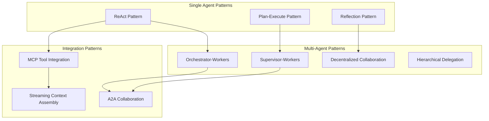
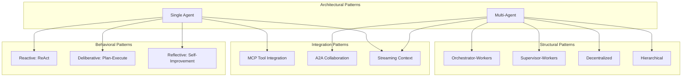
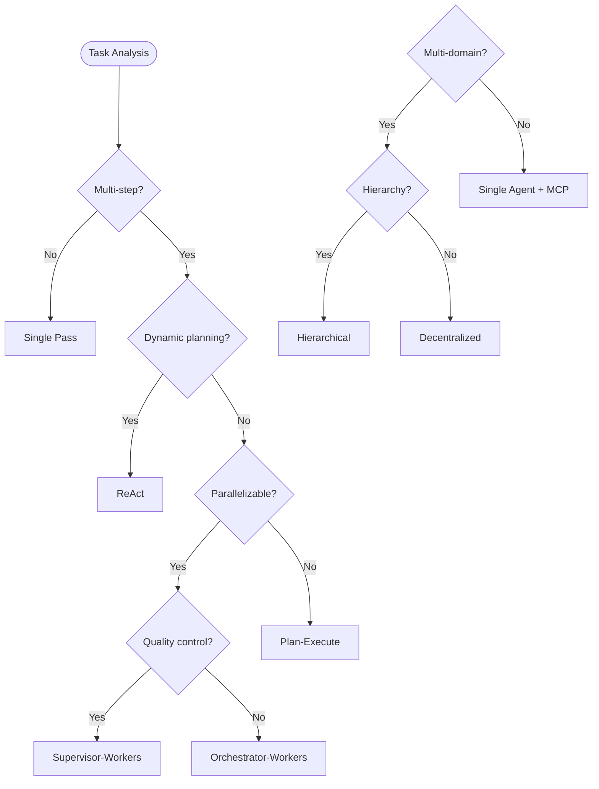

> **状态**: 🔮 前瞻内容 | **风险等级**: 高 | **最后更新**: 2026-04
> 
> 此文档描述的内容处于早期规划阶段，可能与最终实现不符。请以 Apache Flink 官方发布为准。
# Flink Agents 设计模式目录

> **所属阶段**: Flink/06-ai-ml | **前置依赖**: [Flink Agents 架构深度解析](./flink-agents-architecture-deep-dive.md), [FLIP-531 AI Agents](flink-agents-flip-531.md) | **形式化等级**: L3-L4

---

## 1. 概念定义 (Definitions)

### Def-P2-06: Agent Design Pattern

An **Agent Design Pattern** is a reusable solution to a commonly occurring problem in AI Agent system design, formally defined as:

$$
\mathcal{P}_{agent} = \langle \mathcal{C}_{context}, \mathcal{F}_{forces}, \mathcal{S}_{solution}, \mathcal{E}_{examples} \rangle
$$

Where:

- $\mathcal{C}_{context}$: Problem context and preconditions
- $\mathcal{F}_{forces}$: Design forces and trade-offs
- $\mathcal{S}_{solution}$: Structural and behavioral solution
- $\mathcal{E}_{examples}$: Concrete implementation examples

### Def-P2-07: Pattern Classification Taxonomy

Agent patterns are classified along three dimensions:

$$
\mathcal{T}_{pattern} = \langle \mathcal{D}_{arch}, \mathcal{D}_{coord}, \mathcal{D}_{behavior} \rangle
$$

| Dimension | Categories | Description |
|-----------|------------|-------------|
| $\mathcal{D}_{arch}$ | {Single, Multi, Hybrid} | Architectural scope |
| $\mathcal{D}_{coord}$ | {Centralized, Decentralized, Hierarchical} | Coordination style |
| $\mathcal{D}_{behavior}$ | {Reactive, Deliberative, Hybrid} | Decision-making style |

---

## 2. 属性推导 (Properties)

### Lemma-P2-02: Pattern Composability

**引理**: Agent design patterns can be composed if their interface contracts are compatible:

$$
\mathcal{P}_1 \circ \mathcal{P}_2 \iff \text{Output}(\mathcal{P}_1) \subseteq \text{Input}(\mathcal{P}_2)
$$

### Prop-P2-02: Pattern Selection Criteria

**命题**: Pattern selection follows a multi-objective optimization:

$$
\mathcal{P}^* = \arg\max_{\mathcal{P} \in \mathcal{P}_{candidates}} \sum_{i} w_i \cdot s_i(\mathcal{P})
$$

Where $s_i$ are scoring functions for latency, throughput, fault-tolerance, and maintainability.

---

## 3. 关系建立 (Relations)

### 3.1 Pattern Relationship Map



### 3.2 Pattern Selection Decision Matrix

| Use Case | Recommended Pattern | Alternative | Anti-Pattern |
|----------|---------------------|-------------|--------------|
| Simple Q&A | Single Agent | ReAct | Multi-Agent |
| Multi-step Reasoning | Plan-Execute | ReAct | Single Pass |
| Tool Orchestration | MCP Integration | Direct API | Hardcoded |
| Complex Workflow | Orchestrator-Workers | Hierarchical | Monolithic |
| Real-time Collaboration | A2A Collaboration | Supervisor | Synchronous |

---

## 4. 论证过程 (Argumentation)

### 4.1 Pattern Evolution Rationale

Agent design patterns have evolved from simple request-response to complex collaborative systems:

```
2020: Simple Prompt → LLM → Response
   ↓
2022: Chain-of-Thought (CoT) Reasoning
   ↓
2023: ReAct (Reasoning + Acting)
   ↓
2024: Multi-Agent Collaboration (AutoGen, CrewAI)
   ↓
2025: Streaming Multi-Agent (Flink + A2A + MCP)
```

---

## 5. 形式证明 / 工程论证 (Proof / Engineering Argument)

### Thm-P2-05: Pattern Effectiveness

**定理**: Proper application of design patterns improves system quality metrics:

$$
\forall \mathcal{P} \in \text{Patterns}: Q_{with}(\mathcal{P}) > Q_{without}(\mathcal{P})
$$

Where $Q$ represents quality metrics including maintainability, scalability, and reliability.

---

## 6. 实例验证 (Examples)

---

### Pattern 1: ReAct (Reasoning + Acting)

**Category**: Single Agent, Reactive

**Context**: Agent needs to solve complex problems requiring interleaved reasoning and tool use.

**Forces**:

- Need for dynamic tool selection
- Requires multi-step reasoning
- Uncertainty in optimal action sequence

**Solution**:

```
Loop:
  1. Thought: Analyze situation and plan
  2. Action: Select and execute tool
  3. Observation: Process tool output
  Until: Goal achieved or max iterations reached
```

**Implementation (Java)**:

```java
/**
 * ReAct Pattern Implementation
 * Interleaves reasoning and action execution
 */

import org.apache.flink.api.common.state.ValueState;
import org.apache.flink.api.common.state.ValueStateDescriptor;

public class ReActAgentFunction
    extends KeyedProcessFunction<String, UserQuery, AgentResponse> {

    private ValueState<ReActContext> contextState;
    private transient LLMClient llmClient;
    private transient McpClient mcpClient;

    private static final int MAX_ITERATIONS = 10;
    private static final long TIMEOUT_MS = 30000;

    @Override
    public void open(Configuration parameters) {
        contextState = getRuntimeContext().getState(
            new ValueStateDescriptor<>("react-context", ReActContext.class));
        llmClient = LLMClient.create(config);
        mcpClient = McpClient.create(config);
    }

    @Override
    public void processElement(UserQuery query, Context ctx,
                               Collector<AgentResponse> out) throws Exception {
        ReActContext context = contextState.value();
        if (context == null) {
            context = new ReActContext(query.getId(), query.getContent());
        }

        // ReAct Loop
        while (context.getIteration() < MAX_ITERATIONS &&
               !context.isGoalAchieved() &&
               !context.isTimedOut(TIMEOUT_MS)) {

            // Step 1: THOUGHT
            String thought = generateThought(context);
            context.addThought(thought);

            // Step 2: ACTION
            Action action = selectAction(thought, context);
            context.setCurrentAction(action);

            if (action.getType() == ActionType.FINAL_ANSWER) {
                context.setGoalAchieved(true);
                break;
            }

            // Step 3: OBSERVATION
            Observation observation = executeAction(action);
            context.addObservation(observation);

            context.incrementIteration();
        }

        // Generate response
        AgentResponse response = new AgentResponse(
            query.getId(),
            context.getFinalAnswer(),
            context.getThoughtChain(),
            context.getActionsTaken()
        );

        contextState.update(context);
        out.collect(response);
    }

    private String generateThought(ReActContext context) {
        String prompt = buildReActPrompt(context);
        return llmClient.generate(prompt);
    }

    private Action selectAction(String thought, ReActContext context) {
        // Parse LLM output to extract action
        if (thought.contains("Action:")) {
            String actionStr = extractAction(thought);
            return parseAction(actionStr);
        }
        return new Action(ActionType.FINAL_ANSWER, thought);
    }

    private Observation executeAction(Action action) {
        switch (action.getType()) {
            case TOOL_CALL:
                return mcpClient.execute(action.getToolName(), action.getParams());
            case SEARCH:
                return performSearch(action.getQuery());
            case CALCULATE:
                return performCalculation(action.getExpression());
            default:
                return new Observation("Unknown action type");
        }
    }
}
```

**Implementation (Python)**:

```python
from typing import List, Optional, Dict, Any
from dataclasses import dataclass, field
from enum import Enum
import asyncio

class ActionType(Enum):
    THOUGHT = "thought"
    TOOL_CALL = "tool_call"
    SEARCH = "search"
    CALCULATE = "calculate"
    FINAL_ANSWER = "final_answer"

@dataclass
class Thought:
    content: str
    step: int

@dataclass
class Action:
    type: ActionType
    content: str
    params: Dict[str, Any] = field(default_factory=dict)

@dataclass
class Observation:
    content: str
    source: str

@dataclass
class ReActContext:
    query_id: str
    original_query: str
    thoughts: List[Thought] = field(default_factory=list)
    actions: List[Action] = field(default_factory=list)
    observations: List[Observation] = field(default_factory=list)
    iteration: int = 0
    goal_achieved: bool = False

    def add_thought(self, content: str):
        self.thoughts.append(Thought(content, self.iteration))

    def add_action(self, action: Action):
        self.actions.append(action)

    def add_observation(self, observation: Observation):
        self.observations.append(observation)

    def increment_iteration(self):
        self.iteration += 1

class ReActAgent:
    """ReAct Pattern Agent Implementation"""

    def __init__(self, llm_client, mcp_client, max_iterations: int = 10):
        self.llm = llm_client
        self.mcp = mcp_client
        self.max_iterations = max_iterations

    async def execute(self, query: str) -> Dict[str, Any]:
        """Execute ReAct loop for a query"""
        context = ReActContext(
            query_id=str(uuid.uuid4()),
            original_query=query
        )

        while context.iteration < self.max_iterations and not context.goal_achieved:
            # THOUGHT
            thought = await self._generate_thought(context)
            context.add_thought(thought)

            # ACTION
            action = self._parse_action(thought)
            context.add_action(action)

            if action.type == ActionType.FINAL_ANSWER:
                context.goal_achieved = True
                break

            # OBSERVATION
            observation = await self._execute_action(action)
            context.add_observation(observation)

            context.increment_iteration()

        return {
            "answer": context.thoughts[-1].content if context.thoughts else "",
            "thought_chain": [t.content for t in context.thoughts],
            "actions": len(context.actions),
            "iterations": context.iteration
        }

    async def _generate_thought(self, context: ReActContext) -> str:
        """Generate next thought based on context"""
        prompt = self._build_react_prompt(context)
        return await self.llm.generate(prompt)

    def _build_react_prompt(self, context: ReActContext) -> str:
        """Build ReAct formatted prompt"""
        history = []
        for t, a, o in zip(context.thoughts, context.actions, context.observations):
            history.append(f"Thought {t.step}: {t.content}")
            if a.type != ActionType.FINAL_ANSWER:
                history.append(f"Action: {a.type.value} - {a.content}")
                history.append(f"Observation: {o.content}")

        return f"""Answer the following question using interleaving Thought, Action, and Observation steps.

Question: {context.original_query}

{chr(10).join(history)}

Thought {context.iteration + 1}:"""

    def _parse_action(self, thought: str) -> Action:
        """Parse action from LLM thought output"""
        if "Final Answer:" in thought:
            answer = thought.split("Final Answer:")[-1].strip()
            return Action(ActionType.FINAL_ANSWER, answer)

        if "Action:" in thought:
            action_part = thought.split("Action:")[-1].split("\n")[0].strip()
            # Parse specific action types
            if "search" in action_part.lower():
                return Action(ActionType.SEARCH, action_part)
            elif "calculate" in action_part.lower():
                return Action(ActionType.CALCULATE, action_part)
            else:
                return Action(ActionType.TOOL_CALL, action_part)

        return Action(ActionType.FINAL_ANSWER, thought)

    async def _execute_action(self, action: Action) -> Observation:
        """Execute action and return observation"""
        if action.type == ActionType.TOOL_CALL:
            result = await self.mcp.call_tool(action.content, action.params)
            return Observation(str(result), "tool")
        elif action.type == ActionType.SEARCH:
            result = await self._search(action.content)
            return Observation(result, "search")
        elif action.type == ActionType.CALCULATE:
            result = await self._calculate(action.content)
            return Observation(result, "calculator")
        else:
            return Observation("No action taken", "none")

    async def _search(self, query: str) -> str:
        # Implementation
        return f"Search results for: {query}"

    async def _calculate(self, expression: str) -> str:
        # Safe evaluation
        try:
            result = eval(expression, {"__builtins__": {}}, {})
            return str(result)
        except:
            return "Calculation error"
```

---

### Pattern 2: Plan-and-Execute

**Category**: Single Agent, Deliberative

**Context**: Tasks with clear, decomposable structure where upfront planning is beneficial.

**Forces**:

- Task can be decomposed into discrete steps
- Step dependencies are known or discoverable
- Planning overhead is justified by execution efficiency

**Solution**:

```
1. PLAN: Decompose task into step sequence
2. EXECUTE: Execute each step in order
3. REVIEW: Validate results and replan if needed
```

**Implementation (Java)**:

```java
/**
 * Plan-and-Execute Pattern
 * Separates planning from execution phases
 */
public class PlanExecuteAgent {

    private final LLMClient planner;
    private final LLMClient executor;
    private final ToolRegistry tools;

    public ExecutionResult execute(Task task) {
        // Phase 1: Planning
        Plan plan = planner.generatePlan(task);

        // Phase 2: Execution with monitoring
        ExecutionContext context = new ExecutionContext();

        for (Step step : plan.getSteps()) {
            StepResult result = executeStep(step, context);
            context.addResult(result);

            // Check if replanning is needed
            if (result.requiresReplanning()) {
                plan = planner.replan(task, context);
                // Restart from current position
            }
        }

        // Phase 3: Review
        return reviewAndFinalize(context);
    }

    private StepResult executeStep(Step step, ExecutionContext context) {
        // Execute with retry logic
        for (int attempt = 0; attempt < MAX_RETRIES; attempt++) {
            try {
                return tools.execute(step, context);
            } catch (ExecutionException e) {
                if (attempt == MAX_RETRIES - 1) {
                    return StepResult.failed(e);
                }
                // Retry with backoff
            }
        }
        return StepResult.failed(new IllegalStateException("Max retries exceeded"));
    }
}
```

---

### Pattern 3: Reflection Pattern

**Category**: Single Agent, Self-Improvement

**Context**: Agent needs to self-correct and improve its outputs.

**Solution**:

```
1. GENERATE: Produce initial output
2. REFLECT: Critically evaluate output
3. IMPROVE: Revise based on critique
4. Repeat until quality threshold met
```

**Implementation (Python)**:

```python
class ReflectionAgent:
    """Self-reflection pattern for quality improvement"""

    def __init__(self, llm_client):
        self.llm = llm_client
        self.max_reflections = 3
        self.quality_threshold = 0.8

    async def generate_with_reflection(self, task: str) -> Dict:
        # Initial generation
        draft = await self.llm.generate(f"Complete the following task:\n{task}")

        reflections = []

        for i in range(self.max_reflections):
            # Reflection phase
            critique = await self._reflect(draft, task)
            reflections.append(critique)

            # Check if quality is sufficient
            if critique["score"] >= self.quality_threshold:
                break

            # Improvement phase
            draft = await self._improve(draft, critique, task)

        return {
            "final_output": draft,
            "reflections": reflections,
            "iterations": len(reflections)
        }

    async def _reflect(self, output: str, task: str) -> Dict:
        """Critique the current output"""
        prompt = f"""Task: {task}

Current Output:
{output}

Critique this output. Identify:
1. Factual errors or inaccuracies
2. Missing information
3. Clarity issues
4. Areas for improvement

Provide a quality score (0-1) and specific suggestions."""

        critique = await self.llm.generate(prompt)
        return self._parse_critique(critique)

    async def _improve(self, output: str, critique: Dict, task: str) -> str:
        """Improve output based on critique"""
        prompt = f"""Task: {task}

Current Output:
{output}

Critique:
{critique['suggestions']}

Provide an improved version addressing all critique points."""

        return await self.llm.generate(prompt)
```

---

### Pattern 4: Orchestrator-Workers

**Category**: Multi-Agent, Centralized

**Context**: Complex task requiring parallel subtask execution.

**Solution**:

```
Orchestrator:
  1. Analyze task
  2. Decompose into subtasks
  3. Delegate to Workers
  4. Collect results
  5. Synthesize final output
```

**Implementation (Java with Flink)**:

```java
/**
 * Orchestrator-Workers Pattern
 * Central coordination with parallel worker execution
 */

import org.apache.flink.streaming.api.environment.StreamExecutionEnvironment;
import org.apache.flink.streaming.api.datastream.DataStream;
import org.apache.flink.api.common.state.ValueState;
import org.apache.flink.streaming.api.windowing.time.Time;

public class OrchestratorWorkersJob {

    public static void main(String[] args) throws Exception {
        StreamExecutionEnvironment env =
            StreamExecutionEnvironment.getExecutionEnvironment();

        // Input stream of complex tasks
        DataStream<ComplexTask> tasks = env
            .addSource(new TaskSource())
            .keyBy(ComplexTask::getTaskId);

        // Orchestrator: Decompose tasks
        DataStream<SubTask> subtasks = tasks
            .process(new TaskOrchestratorFunction());

        // Workers: Parallel execution
        DataStream<WorkerResult> results = subtasks
            .keyBy(SubTask::getWorkerType)
            .process(new WorkerFunction());

        // Result aggregation
        DataStream<TaskResult> aggregated = results
            .keyBy(WorkerResult::getParentTaskId)
            .window(TumblingProcessingTimeWindows.of(Time.seconds(30)))
            .aggregate(new ResultAggregator())
            .process(new FinalSynthesisFunction());

        aggregated.addSink(new ResultSink());

        env.execute("Orchestrator-Workers Pattern");
    }
}

public class TaskOrchestratorFunction
    extends KeyedProcessFunction<String, ComplexTask, SubTask> {

    private ValueState<DecompositionPlan> planState;
    private transient LLMClient planner;

    @Override
    public void processElement(ComplexTask task, Context ctx,
                               Collector<SubTask> out) {
        // Decompose task using LLM
        List<SubTask> subtasks = planner.decompose(task);

        // Track decomposition
        planState.update(new DecompositionPlan(task.getTaskId(), subtasks.size()));

        // Emit subtasks for parallel processing
        for (SubTask subtask : subtasks) {
            out.collect(subtask);
        }
    }
}
```

---

### Pattern 5: Supervisor-Workers

**Category**: Multi-Agent, Centralized with Monitoring

**Context**: Mission-critical tasks requiring quality control and fault tolerance.

**Solution**:

```
Supervisor:
  - Monitor Worker execution
  - Validate intermediate results
  - Retry failed tasks
  - Approve/reject final output
```

**Implementation (Python)**:

```python
from typing import List, Callable
import asyncio

class SupervisorWorkersPattern:
    """Supervisor-Workers with quality control"""

    def __init__(self, workers: List[Callable], supervisor: Callable):
        self.workers = workers
        self.supervisor = supervisor
        self.max_retries = 3

    async def execute(self, task: Dict) -> Dict:
        # Get execution plan from supervisor
        plan = await self.supervisor.plan(task)

        results = []
        for step in plan.steps:
            # Select appropriate worker
            worker = self._select_worker(step)

            # Execute with supervision
            for attempt in range(self.max_retries):
                result = await worker.execute(step)

                # Supervisor validation
                validation = await self.supervisor.validate(result, step)

                if validation.approved:
                    results.append(result)
                    break
                elif attempt < self.max_retries - 1:
                    # Retry with feedback
                    step = await self.supervisor.refine(step, validation.feedback)
                else:
                    # Max retries exceeded
                    raise ExecutionError(f"Step {step.id} failed validation")

        # Final approval
        final_result = self._aggregate(results)
        return await self.supervisor.final_approval(final_result)
```

---

### Pattern 6: Decentralized Collaboration

**Category**: Multi-Agent, Peer-to-Peer

**Context**: Agents with specialized expertise collaborating without central coordination.

**Solution**:

```
Agent A: Detects need for collaboration
  ↓ (A2A protocol)
Agent B: Responds with capabilities
  ↓ (Negotiation)
Agents A & B: Execute jointly
  ↓ (Result sharing)
Both: Update knowledge
```

---

### Pattern 7: Hierarchical Delegation

**Category**: Multi-Agent, Tree Structure

**Context**: Organizational hierarchy mirroring in agent teams.

**Solution**:

```
Level 1 (Strategic):
  - Executive Agent: Sets goals, allocates resources

Level 2 (Tactical):
  - Manager Agents: Plan execution, coordinate teams

Level 3 (Operational):
  - Worker Agents: Execute specific tasks
```

---

### Pattern 8: MCP Tool Integration

**Category**: Integration Pattern

**Context**: Agent needs standardized access to external tools and data sources.

**Implementation (Java)**:

```java
/**
 * MCP Tool Integration Pattern
 * Standardized tool access via Model Context Protocol
 */
public class McpToolIntegration {

    private final MCPClient mcpClient;
    private final Map<String, ToolSchema> toolRegistry;

    public ToolResult executeTool(String toolName, Map<String, Object> params) {
        // Validate against schema
        ToolSchema schema = toolRegistry.get(toolName);
        validateParams(params, schema);

        // Execute via MCP
        return mcpClient.callTool(toolName, params);
    }

    public List<ToolSchema> discoverTools() {
        return mcpClient.listTools();
    }

    public void subscribeToResource(String uri, ResourceHandler handler) {
        mcpClient.subscribe(uri, handler);
    }
}
```

---

## 7. 可视化 (Visualizations)

### 7.1 Pattern Hierarchy



### 7.2 Pattern Selection Flowchart



---

## 8. 引用参考 (References)
