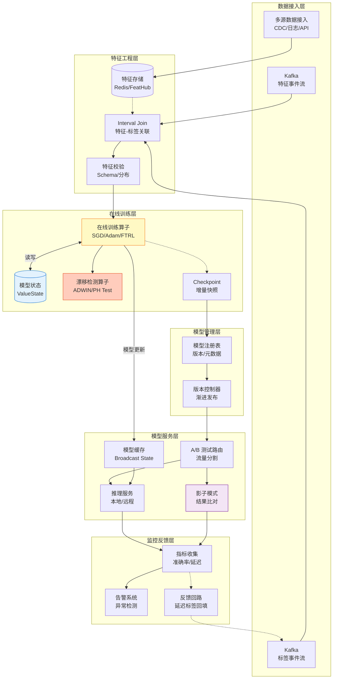
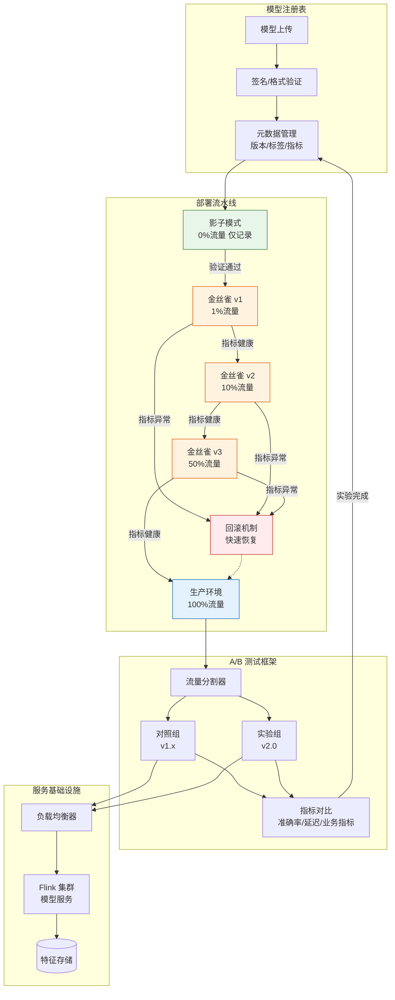
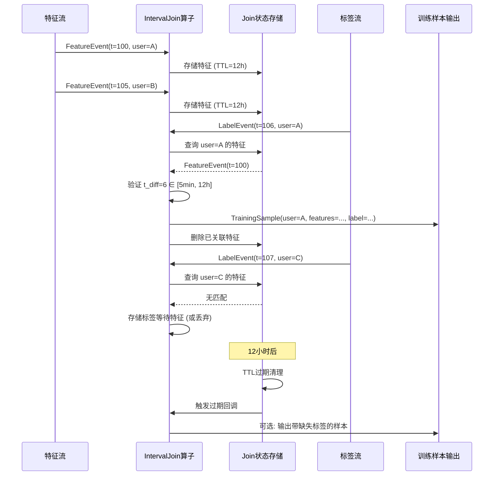
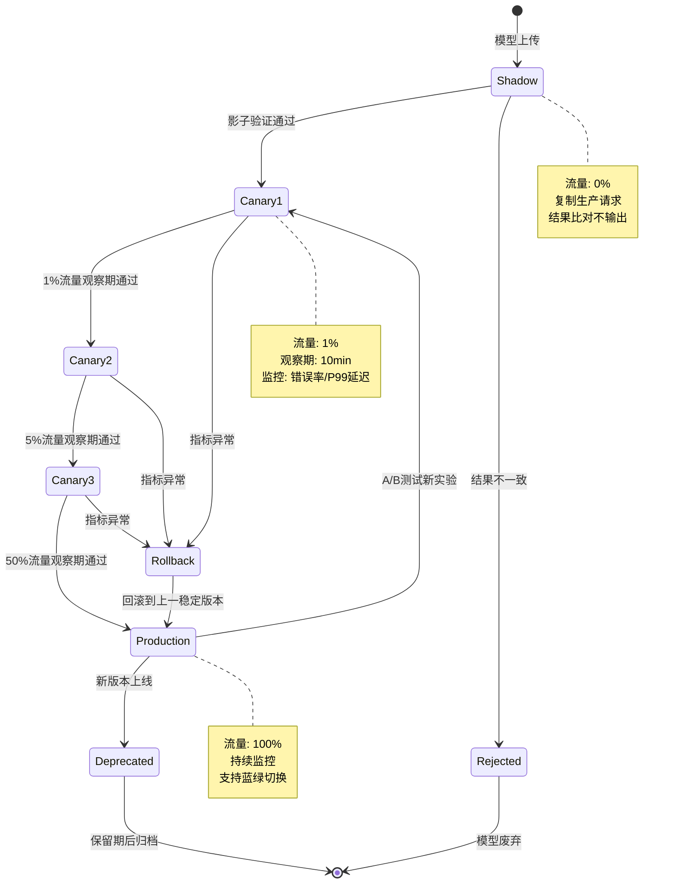
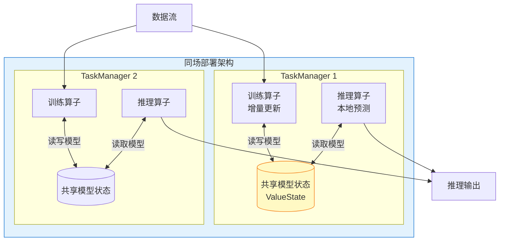
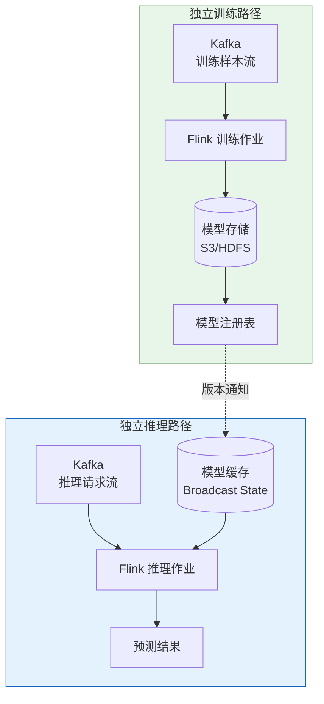
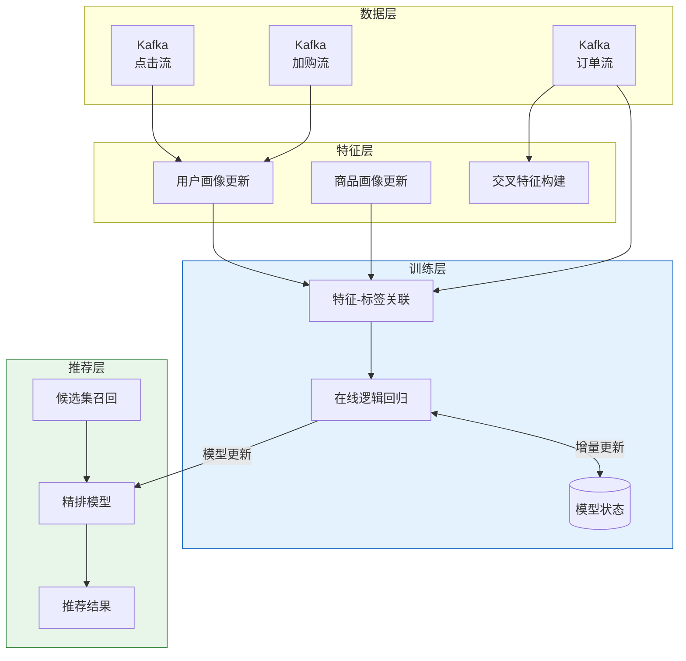
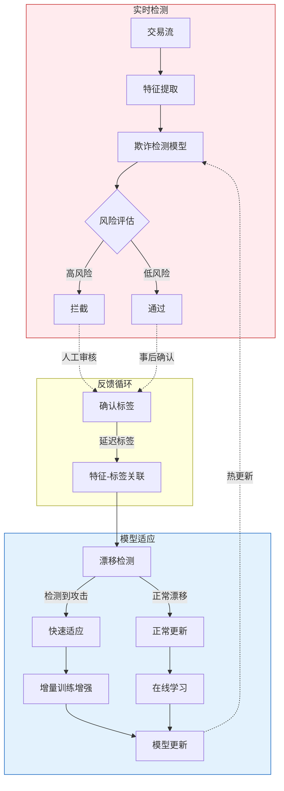
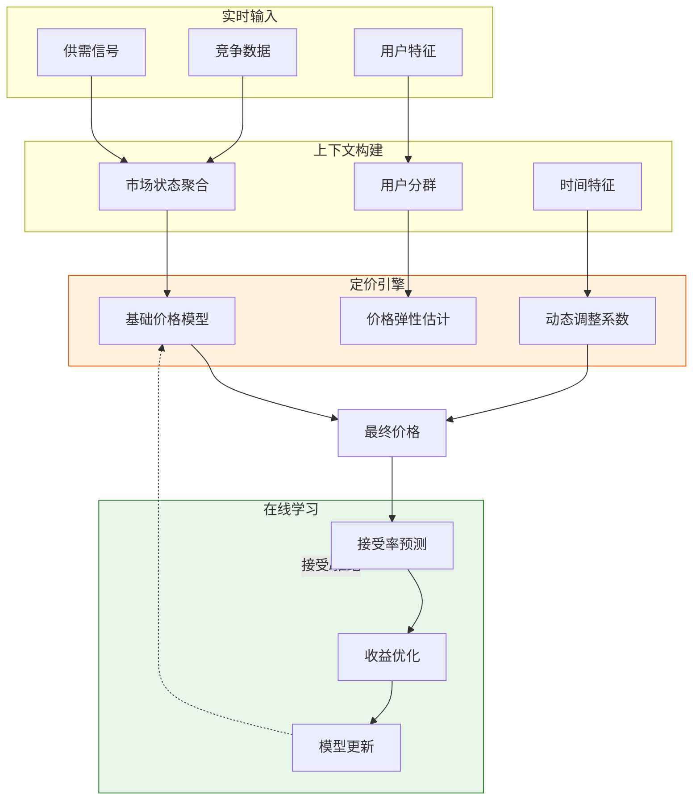

# 在线学习生产实践 - 流式ML系统构建指南

> 所属阶段: Flink/12-ai-ml | 前置依赖: [online-learning-algorithms.md](./online-learning-algorithms.md), [model-serving-streaming.md](./model-serving-streaming.md) | 形式化等级: L4

---

## 1. 概念定义 (Definitions)

### Def-F-12-10: 在线学习范式 (Online Learning Paradigm)

**在线学习**是一种模型随数据流持续更新的机器学习范式，与批量学习形成对比。形式化定义为四元组：

$$
\mathcal{OL} = \langle \mathcal{D}_{stream}, \mathcal{U}_{incremental}, \Theta_t, \mathcal{C}_{drift} \rangle
$$

其中：

- $\mathcal{D}_{stream} = \{(x_t, y_t)\}_{t=1}^{\infty}$：无限数据流，$x_t \in \mathcal{X}$ 为特征，$y_t \in \mathcal{Y}$ 为标签
- $\mathcal{U}_{incremental}: \Theta \times (\mathcal{X} \times \mathcal{Y}) \to \Theta$：增量更新算子，$\theta_{t+1} = \mathcal{U}(\theta_t, (x_t, y_t))$
- $\Theta_t$：$t$ 时刻的模型参数空间
- $\mathcal{C}_{drift}$：概念漂移处理组件

**在线学习协议**：

```
初始化: θ₀ ← 随机初始化或预训练模型
对于每个时间步 t = 1, 2, ...:
    接收样本: (xₜ, yₜ) ← Stream.next()
    预测: ŷₜ = f(θₜ₋₁; xₜ)
    计算损失: ℓₜ = L(ŷₜ, yₜ)
    增量更新: θₜ = U(θₜ₋₁, (xₜ, yₜ), ηₜ)
    可选: 持久化 checkpoint(θₜ)
```

---

### Def-F-12-11: 增量学习 vs 批量学习 (Incremental vs Batch Learning)

**增量学习 (Incremental Learning)** 与 **批量学习 (Batch Learning)** 的本质区别：

| 维度 | 批量学习 $\mathcal{L}_{batch}$ | 增量学习 $\mathcal{L}_{incremental}$ |
|------|-------------------------------|-------------------------------------|
| **数据假设** | 固定数据集 $D = \{(x_i, y_i)\}_{i=1}^N$ | 数据流 $\mathcal{D}_{stream}$，$N \to \infty$ |
| **更新触发** | 显式训练阶段，周期调度 | 每个样本到达即时更新 |
| **计算复杂度** | $O(N \cdot T_{epoch})$ | $O(1)$ 每样本 |
| **内存需求** | 需存储完整数据集 | 仅需维护模型参数 |
| **适应性** | 无法适应分布变化 | 实时适应概念漂移 |
| **灾难性遗忘** | 不涉及 | 需显式处理 |

**形式化对比**：

**批量学习优化目标**：
$$
\theta^* = \arg\min_{\theta} \frac{1}{N} \sum_{i=1}^{N} \mathcal{L}(f(\theta; x_i), y_i)
$$

**在线学习优化目标**（后悔最小化）：
$$
\min_{\theta_1, ..., \theta_T} \sum_{t=1}^{T} \mathcal{L}(f(\theta_t; x_t), y_t) - \min_{\theta} \sum_{t=1}^{T} \mathcal{L}(f(\theta; x_t), y_t)
$$

---

### Def-F-12-12: 模型持续训练架构 (Continuous Training Architecture)

**持续训练架构**是在线学习系统的核心工程实现，定义为六元组：

$$
\mathcal{A}_{CT} = \langle \mathcal{P}_{ingest}, \mathcal{P}_{feature}, \mathcal{P}_{train}, \mathcal{P}_{serve}, \mathcal{S}_{state}, \mathcal{M}_{version} \rangle
$$

其中：

- $\mathcal{P}_{ingest}$：数据接入管道，支持多源异构数据流
- $\mathcal{P}_{feature}$：实时特征工程管道，保证训练-推理特征一致性
- $\mathcal{P}_{train}$：在线训练管道，执行增量更新算法
- $\mathcal{P}_{serve}$：模型服务管道，提供低延迟推理
- $\mathcal{S}_{state}$：分布式状态存储，持久化模型参数与优化器状态
- $\mathcal{M}_{version}$：模型版本管理系统

**架构拓扑约束**：
$$
\mathcal{P}_{train} \cap \mathcal{P}_{serve} \neq \emptyset \quad \text{(共享模型状态)}
$$

---

### Def-F-12-13: 实时特征-标签关联 (Real-time Feature-Label Join)

**特征-标签关联**是构建训练样本的关键操作，定义为时序窗口连接：

$$
\mathcal{J}_{FL}: \mathcal{D}_{feature} \times \mathcal{D}_{label} \times \Delta T \to \mathcal{D}_{training}
$$

其中：

- $\mathcal{D}_{feature} = \{(t_i, x_i)\}$：带时间戳的特征流
- $\mathcal{D}_{label} = \{(t_j, y_j)\}$：带时间戳的标签流
- $\Delta T = [T_{min}, T_{max}]$：标签延迟容忍窗口

**关联语义**：
$$
(x, y) \in \mathcal{D}_{training} \iff \exists (t_x, x) \in \mathcal{D}_{feature}, (t_y, y) \in \mathcal{D}_{label}: t_y - t_x \in \Delta T \land \text{key}(x) = \text{key}(y)
$$

**延迟标签问题 (Delayed Labels)**：

实际系统中标签到达存在延迟 $\delta$，需设计等待策略：

| 策略 | 描述 | 适用场景 |
|------|------|----------|
| **固定窗口等待** | 等待固定时长 $W$ 后无标签则丢弃 | 延迟稳定 |
| **预测填充** | 用模型预测作为伪标签 | 冷启动阶段 |
| **延迟样本重放** | 标签到达后重放历史特征 | 延迟波动大 |

---

### Def-F-12-14: 模型版本管理与 A/B 测试 (Model Versioning & A/B Testing)

**模型版本空间**定义为带版本标识的模型集合：

$$
\mathcal{M} = \{M^{(v)} | v = (major, minor, patch, timestamp, git_commit)\}
$$

**版本生命周期状态机**：

$$
\mathcal{S}_{lifecycle} = \{Development, Staging, Canary, Production, Deprecated, Archived\}
$$

状态转移：
$$
\delta_{lifecycle}: \mathcal{S}_{lifecycle} \times \mathcal{E}_{trigger} \to \mathcal{S}_{lifecycle}
$$

**A/B 测试路由策略**：

$$
\pi_{AB}: Request \times \mathcal{M} \to M^{(v)}
$$

常见策略：

- **均匀随机**: $\pi_{AB}(r) = M^{(v_i)}$ with $P(v_i) = w_i$
- **一致性哈希**: $\pi_{AB}(r) = M^{(v_{hash(user\_id) \% n})}$
- **上下文感知**: $\pi_{AB}(r) = \arg\max_{v} p(v | context(r))$

---

### Def-F-12-15: 影子模式与渐进发布 (Shadow Mode & Progressive Rollout)

**影子模式 (Shadow Mode)** 是一种零风险验证新模型的部署策略：

$$
\mathcal{Shadow} = \langle M_{production}, M_{candidate}, \mathcal{D}_{shadow}, \mathcal{C}_{compare} \rangle
$$

其中：

- $M_{production}$：生产环境主模型，响应实际请求
- $M_{candidate}$：候选模型，接收流量复制但不输出
- $\mathcal{D}_{shadow}$：影子流量，$\mathcal{D}_{shadow} = \{(x, y_{prod}, y_{cand})\}$
- $\mathcal{C}_{compare}$：结果比对组件

**渐进发布 (Progressive Rollout)** 是流量从旧版本向新版本逐步迁移的过程：

$$
\mathcal{R}(t): [0, T] \to [0, 1], \quad \mathcal{R}(t) = \text{Traffic}_{M_{new}}(t)
$$

常见发布曲线：

- **线性增长**: $\mathcal{R}(t) = \frac{t}{T}$
- **阶梯发布**: $\mathcal{R}(t) = \sum_{i} \alpha_i \cdot \mathbb{1}_{[t_i, t_{i+1})}(t)$
- **基于置信度**: $\mathcal{R}(t) = \sigma(\text{metrics}(t))$

---

## 2. 属性推导 (Properties)

### Lemma-F-12-05: 特征-标签关联完备性边界

**引理**: 设特征流到达率为 $\lambda_f$，标签流到达率为 $\lambda_l$，关联窗口为 $\Delta T$，则成功关联率为：

$$
P_{join} = \frac{\lambda_l}{\lambda_f} \cdot (1 - e^{-\lambda_f \cdot \Delta T})
$$

**工程含义**：

- 当 $\lambda_f >> \lambda_l$ 时，需增大 $\Delta T$ 或采用特征缓存
- 关联失败率随窗口线性增长，但计算成本也随之增加

---

### Lemma-F-12-06: 影子模式无偏性保证

**引理**: 在影子模式下，候选模型 $M_{candidate}$ 的评估指标是无偏的，当且仅当：

$$
\mathbb{E}_{\mathcal{D}_{shadow}}[\mathcal{L}(M_{candidate}(x), y)] = \mathbb{E}_{\mathcal{D}_{production}}[\mathcal{L}(M_{candidate}(x), y)]
$$

**充分条件**：

1. 影子流量是生产流量的完美复制
2. 候选模型不改变下游系统行为（不输出到生产）
3. 特征提取逻辑一致

---

### Prop-F-12-05: 渐进发布风险边界

**命题**: 设新版本模型 $M_{new}$ 存在缺陷概率为 $p_{defect}$，缺陷损失为 $L_{defect}$，则在渐进发布策略 $\mathcal{R}(t)$ 下的期望风险为：

$$
\mathbb{E}[Risk(t)] = \mathcal{R}(t) \cdot p_{defect} \cdot L_{defect}
$$

**最优发布时间**: 若持续监控指标 $m(t)$，当检测到异常立即回滚，则最优发布速率为：

$$
\frac{d\mathcal{R}}{dt} = \frac{\epsilon_{alert}}{|\frac{\partial m}{\partial t}|}
$$

其中 $\epsilon_{alert}$ 为告警阈值。

---

## 3. 关系建立 (Relations)

### 关系 1: 持续训练 ⟺ 在线学习算法

持续训练架构实现在线学习算法的工程化部署：

```
在线学习算法 (理论)          持续训练架构 (工程)
─────────────────────────────────────────────────────────
增量更新 U(θ, (x,y))    →   带 Checkpoint 的状态更新算子
损失函数 L(ŷ, y)        →   训练指标流 + 监控告警
学习率调度 ηₜ           →   动态超参调整服务
概念漂移处理 C_drift    →   漂移检测算子 + 模型重置策略
```

### 关系 2: 特征-标签关联 ⟺ Flink Interval Join

实时特征-标签关联可直接映射为 Flink 的 Interval Join 操作：

```java

import org.apache.flink.streaming.api.datastream.DataStream;
import org.apache.flink.streaming.api.windowing.time.Time;

DataStream<Sample> trainingSamples = featureStream
    .keyBy(FeatureEvent::getUserId)
    .intervalJoin(labelStream.keyBy(LabelEvent::getUserId))
    .between(Time.minutes(5), Time.hours(24))  // ΔT 窗口
    .process(new SampleBuilder());
```

### 关系 3: A/B 测试 ⟺ Flink Broadcast State

模型版本路由可利用 Flink 的 Broadcast State 机制实现动态流量切换：

```
控制流 (模型版本配置) ──► Broadcast Stream
                                   │
                                   ▼
数据流 ──► KeyBy ──► ProcessFunction (ReadOnlyContext)
                         │
                         ▼
                    根据 Broadcast State
                    选择模型版本执行推理
```

---

## 4. 论证过程 (Argumentation)

### 4.1 持续训练架构设计决策

**决策 1: 训练-推理一体化 vs 分离**

| 方案 | 延迟 | 资源隔离 | 复杂度 | 适用场景 |
|------|------|----------|--------|----------|
| **一体化** | 极低 (<10ms) | 低 | 低 | 小型模型、实时性要求极高 |
| **分离 (同集群)** | 中 (10-50ms) | 中 | 中 | 中等规模模型、需独立扩缩容 |
| **分离 (异构集群)** | 高 (50ms+) | 高 | 高 | 大型深度学习模型、GPU 需求 |

**推荐架构**: 混合模式 —— 简单模型（线性、树模型）采用一体化，复杂模型（深度神经网络）采用分离部署。

**决策 2: 同步训练 vs 异步训练**

- **同步训练**: 训练与推理串行，模型更新立即生效
  - 优点：一致性简单
  - 缺点：训练阻塞推理，无法独立扩缩容

- **异步训练**: 训练与推理解耦，通过模型版本同步
  - 优点：独立扩缩容，训练失败不影响推理
  - 缺点：模型版本滞后，需处理版本一致性

**推荐**: 生产环境采用异步训练，通过版本广播实现模型热更新。

### 4.2 特征-标签关联策略选择

**场景分析**:

| 业务场景 | 标签延迟 | 推荐策略 | 技术实现 |
|----------|----------|----------|----------|
| 点击率预测 | 数秒 | 固定窗口等待 | Interval Join |
| 欺诈检测 | 数分钟-数小时 | 延迟样本重放 | Pattern + State |
| 用户留存 | 数天 | 离线回填 + 在线预测填充 | Lambda 架构 |
| 推荐转化 | 数小时-数天 | 多阶段标签聚合 | CEP + Temporal Table |

### 4.3 影子模式设计要点

**关键考量**:

1. **流量复制开销**: 100% 流量复制意味着双倍计算，需评估成本收益
2. **延迟一致性**: 影子模型响应不应影响生产请求的超时判定
3. **结果比对延迟**: 允许影子模型慢于生产模型，但需设置上限
4. **数据隔离**: 影子请求不应写入生产存储或触发副作用

**优化策略**: 采样复制（如 10% 流量）而非全量复制，保持统计显著性同时降低成本。

---

## 5. 形式证明 / 工程论证 (Proof / Engineering Argument)

### Thm-F-12-03: 持续训练系统收敛性保证

**定理**: 在以下条件下，基于 Flink 的持续训练系统保证在线学习收敛：

1. **状态持久化**: Checkpoint 间隔 $I$ 满足 $I < \frac{\epsilon_{recovery}}{\lambda_{update}}$，其中 $\epsilon_{recovery}$ 为可接受的状态回滚量
2. **标签完备性**: 特征-标签关联率 $P_{join} > 1 - \delta$，$\delta$ 为可接受的数据损失率
3. **资源充足性**: 训练算子并行度 $P$ 满足 $P \geq \frac{\lambda_{data}}{\mu_{update}}$，其中 $\mu_{update}$ 为单线程更新吞吐

**证明概要**:

设 $t_k$ 为第 $k$ 次 Checkpoint 时刻，$\theta_{t_k}$ 为持久化状态。故障恢复后：

$$
\theta_{recovered} = \theta_{t_k} + \sum_{i=t_k+1}^{t_{failure}} \Delta\theta_i \cdot \mathbb{1}_{[sample\,i\,joined]}
$$

期望偏差：

$$
\mathbb{E}[\|\theta_{recovered} - \theta_{actual}\|] \leq (t_{failure} - t_k) \cdot \eta_{max} \cdot G_{max} \cdot (1 - P_{join})
$$

在条件 1-3 保证下，偏差可控，收敛性得以保持。

---

### Thm-F-12-04: A/B 测试统计有效性保证

**定理**: 为保证 A/B 测试的统计显著性（统计功效 $1-\beta = 0.8$，显著性水平 $\alpha = 0.05$），所需最小样本量为：

$$
n_{min} = \frac{2\sigma^2(z_{1-\alpha/2} + z_{1-\beta})^2}{\Delta^2}
$$

其中 $\sigma^2$ 为指标方差，$\Delta$ 为期望检测的最小效应量。

**工程约束推导**:

设流量分配比例为 $\gamma$ 流向实验组，则达到最小样本量所需时间：

$$
T_{test} = \frac{n_{min}}{\gamma \cdot \lambda_{daily}} \text{ days}
$$

**业务权衡**:

- $\gamma$ 过大 → 风险暴露增加
- $\gamma$ 过小 → 测试周期延长

最优分配需满足：$\gamma^* = \arg\min_{\gamma} (T_{test} \cdot Risk_{exposure})$

---

## 6. 实例验证 (Examples)

### 6.1 完整持续训练 Pipeline

```java

import org.apache.flink.streaming.api.environment.StreamExecutionEnvironment;
import org.apache.flink.streaming.api.datastream.DataStream;
import org.apache.flink.streaming.api.windowing.time.Time;

public class ContinuousTrainingPipeline {

    public static void main(String[] args) throws Exception {
        StreamExecutionEnvironment env =
            StreamExecutionEnvironment.getExecutionEnvironment();
        env.enableCheckpointing(60000);

        // 1. 数据接入层
        DataStream<FeatureEvent> features = env
            .addSource(new KafkaSource<>("features-topic"))
            .map(new FeatureExtractor());

        DataStream<LabelEvent> labels = env
            .addSource(new KafkaSource<>("labels-topic"))
            .map(new LabelExtractor());

        // 2. 特征-标签关联 (Interval Join)
        DataStream<TrainingSample> samples = features
            .keyBy(FeatureEvent::getUserId)
            .intervalJoin(labels.keyBy(LabelEvent::getUserId))
            .between(Time.minutes(5), Time.hours(12))
            .process(new SampleJoinFunction());

        // 3. 在线训练 (带状态管理)
        SingleOutputStreamOperator<ModelUpdate> modelUpdates = samples
            .keyBy(TrainingSample::getModelKey)
            .process(new OnlineTrainer(
                new OnlineLogisticRegression()
                    .setLearningRate(0.01)
                    .setRegularization(0.1)
            ));

        // 4. 模型版本广播
        BroadcastStream<ModelVersion> modelVersions = modelUpdates
            .broadcast(ModelVersion.STATE_DESCRIPTOR);

        // 5. 推理服务 (读取 Broadcast State)
        DataStream<Prediction> predictions = env
            .addSource(new InferenceRequestSource())
            .keyBy(InferenceRequest::getUserId)
            .connect(modelVersions)
            .process(new ModelServingFunction());

        // 6. 结果输出
        predictions.addSink(new KafkaSink<>("predictions-topic"));

        env.execute("Continuous Training Pipeline");
    }
}
```

### 6.2 在线训练算子实现

```java

import org.apache.flink.api.common.state.ValueState;
import org.apache.flink.api.common.state.ValueStateDescriptor;
import org.apache.flink.streaming.api.windowing.time.Time;

public class OnlineTrainer extends KeyedProcessFunction<String,
        TrainingSample, ModelUpdate> {

    // 模型参数状态
    private ValueState<DenseVector> weightsState;
    private ValueState<Double> biasState;
    private ValueState<Long> iterationState;

    // 优化器状态 (Adam)
    private ValueState<DenseVector> mState;
    private ValueState<DenseVector> vState;

    // 训练指标
    private ListState<TrainingMetric> metricBuffer;

    private final OnlineLearningAlgorithm algorithm;
    private final double learningRate = 0.001;
    private final double beta1 = 0.9, beta2 = 0.999;

    @Override
    public void open(Configuration parameters) {
        StateTtlConfig ttlConfig = StateTtlConfig
            .newBuilder(Time.hours(24))
            .setUpdateType(StateTtlConfig.UpdateType.OnCreateAndWrite)
            .setStateVisibility(StateTtlConfig.StateVisibility.NeverReturnExpired)
            .build();

        weightsState = getRuntimeContext().getState(
            new ValueStateDescriptor<>("weights", DenseVector.class));
        biasState = getRuntimeContext().getState(
            new ValueStateDescriptor<>("bias", Double.class));
        iterationState = getRuntimeContext().getState(
            new ValueStateDescriptor<>("iter", Long.class));
        mState = getRuntimeContext().getState(
            new ValueStateDescriptor<>("m", DenseVector.class));
        vState = getRuntimeContext().getState(
            new ValueStateDescriptor<>("v", DenseVector.class));

        ValueStateDescriptor<TrainingMetric> metricDesc =
            new ValueStateDescriptor<>("metrics", TrainingMetric.class);
        metricDesc.enableTimeToLive(ttlConfig);
    }

    @Override
    public void processElement(TrainingSample sample, Context ctx,
            Collector<ModelUpdate> out) throws Exception {

        DenseVector w = weightsState.value();
        double b = biasState.value();
        long t = iterationState.value() + 1;

        // 前向传播
        double z = w.dot(sample.getFeatures()) + b;
        double pred = sigmoid(z);

        // 计算梯度
        double error = pred - sample.getLabel();
        DenseVector gradW = sample.getFeatures().scale(error);

        // Adam 更新
        DenseVector m = mState.value().scale(beta1).add(gradW.scale(1 - beta1));
        DenseVector v = vState.value().scale(beta2).add(
            gradW.hadamard(gradW).scale(1 - beta2));

        DenseVector mHat = m.scale(1.0 / (1 - Math.pow(beta1, t)));
        DenseVector vHat = v.scale(1.0 / (1 - Math.pow(beta2, t)));

        // 更新参数
        for (int i = 0; i < w.size(); i++) {
            double update = learningRate * mHat.get(i) /
                (Math.sqrt(vHat.get(i)) + 1e-8);
            w.set(i, w.get(i) - update);
        }

        // 保存状态
        weightsState.update(w);
        biasState.update(b);
        iterationState.update(t);
        mState.update(m);
        vState.update(v);

        // 定期输出模型更新 (用于广播到推理节点)
        if (t % 1000 == 0) {
            out.collect(new ModelUpdate(t, w, b, computeLoss(pred, sample.getLabel())));
        }
    }
}
```

### 6.3 A/B 测试与流量路由

```java

import org.apache.flink.api.common.state.ValueState;
import org.apache.flink.api.common.state.ValueStateDescriptor;

public class ABTestRouter extends BroadcastProcessFunction<InferenceRequest,
        ModelVersion, Prediction> {

    private MapState<String, ModelVersion> activeVersions;
    private ValueState<Random> randomState;

    // 实验配置
    private static final double CANARY_TRAFFIC = 0.1;
    private static final double SHADOW_TRAFFIC = 0.05;

    @Override
    public void open(Configuration parameters) {
        activeVersions = getRuntimeContext().getMapState(
            new MapStateDescriptor<>("versions", String.class, ModelVersion.class));
        randomState = getRuntimeContext().getState(
            new ValueStateDescriptor<>("random", Random.class));
    }

    @Override
    public void processElement(InferenceRequest request, ReadOnlyContext ctx,
            Collector<Prediction> out) throws Exception {

        ModelVersion production = activeVersions.get("production");
        ModelVersion canary = activeVersions.get("canary");
        ModelVersion shadow = activeVersions.get("shadow");

        // 一致性哈希确保用户始终路由到同一版本
        int userHash = Math.abs(request.getUserId().hashCode()) % 100;

        // 选择模型版本
        ModelVersion selectedVersion;
        boolean isShadow = false;

        if (shadow != null && userHash < SHADOW_TRAFFIC * 100) {
            // 影子流量：同时执行生产模型和影子模型
            selectedVersion = shadow;
            isShadow = true;

            // 生产模型结果输出
            Prediction prodPred = production.predict(request);
            out.collect(prodPred);
        } else if (canary != null && userHash < (CANARY_TRAFFIC + SHADOW_TRAFFIC) * 100) {
            // 金丝雀流量
            selectedVersion = canary;
        } else {
            // 生产流量
            selectedVersion = production;
        }

        // 执行推理
        Prediction pred = selectedVersion.predict(request);
        pred.setModelVersion(selectedVersion.getId());
        pred.setIsShadow(isShadow);

        // 输出指标 (用于对比分析)
        ctx.output(metricsTag, new InferenceMetric(
            request.getUserId(),
            selectedVersion.getId(),
            pred.getScore(),
            System.currentTimeMillis(),
            isShadow
        ));

        if (!isShadow) {
            out.collect(pred);
        }
    }

    @Override
    public void processBroadcastElement(ModelVersion version, Context ctx,
            Collector<Prediction> out) throws Exception {
        // 更新版本配置
        activeVersions.put(version.getRole(), version);
    }
}
```

### 6.4 渐进发布控制器

```java
public class ProgressiveRolloutController {

    private final ModelVersion candidate;
    private final ModelVersion current;
    private final RolloutConfig config;

    private double currentTraffic = 0.0;
    private final List<RolloutStage> stages = Arrays.asList(
        new RolloutStage(0.01, Duration.ofMinutes(10)),   // 1% 观察 10 分钟
        new RolloutStage(0.05, Duration.ofMinutes(30)),   // 5% 观察 30 分钟
        new RolloutStage(0.20, Duration.ofHours(1)),      // 20% 观察 1 小时
        new RolloutStage(0.50, Duration.ofHours(2)),      // 50% 观察 2 小时
        new RolloutStage(1.00, Duration.ofHours(4))       // 100% 观察 4 小时
    );

    public RolloutDecision evaluate(MetricsSnapshot metrics) {
        // 检查当前阶段的健康指标
        if (metrics.getErrorRate() > config.getErrorThreshold() ||
            metrics.getLatencyP99() > config.getLatencyThreshold()) {
            return RolloutDecision.ROLLBACK;
        }

        // 检查当前阶段是否已稳定
        RolloutStage currentStage = getCurrentStage();
        if (metrics.getStageDuration().compareTo(currentStage.getDuration()) > 0 &&
            metrics.isStable()) {

            // 推进到下一阶段
            int nextStageIdx = stages.indexOf(currentStage) + 1;
            if (nextStageIdx < stages.size()) {
                currentTraffic = stages.get(nextStageIdx).getTrafficPercentage();
                return RolloutDecision.ADVANCE;
            } else {
                return RolloutDecision.COMPLETE;
            }
        }

        return RolloutDecision.HOLD;
    }

    public void executeRollout() {
        // 更新流量路由配置
        updateTrafficSplit(current, candidate, currentTraffic);
    }
}
```

---

## 7. 可视化 (Visualizations)

### 7.1 持续训练流水线架构图

持续训练流水线将数据接入、特征工程、在线训练、模型服务和监控反馈串联为闭环系统。特征存储和模型注册表作为共享基础设施，保证训练-推理一致性。



### 7.2 模型部署架构图

模型部署架构展示了从模型注册表到生产环境的完整流程。金丝雀发布逐步扩大流量比例，影子模式并行验证，A/B 测试支持多版本对比，回滚机制保障系统稳定性。



### 7.3 特征-标签关联时序图

特征-标签关联处理标签延迟到达问题。特征到达后进入等待窗口，标签在窗口内到达则成功关联，超时则触发回填策略或丢弃。



### 7.4 渐进发布状态机

渐进发布通过多个阶段逐步增加新版本流量比例，每个阶段有观察期和健康检查，任一阶段失败触发回滚。



---

## 8. 引用参考 (References)


---

*文档版本: v1.0 | 创建日期: 2026-04-02 | 形式化等级: L4*


---

## 8. 补充论述：生产级机器学习系统

### 8.1 在线学习基础完整论述

#### 增量模型更新 (Incremental Model Updates)

**定义 (Def-F-12-16)：增量更新协议**

增量更新是在线学习的核心机制，定义为：

$$
\theta_{t+1} = \theta_t + \Delta\theta_t, \quad \text{where } \Delta\theta_t = -\eta_t \cdot \nabla_{\theta}\mathcal{L}(\theta_t; (x_t, y_t))
$$

**增量更新类型对比：**

| 更新类型 | 计算复杂度 | 状态需求 | 适用场景 | Flink 实现 |
|----------|------------|----------|----------|-------------|
| **单样本 (SGD)** | $O(d)$ | $\theta$ | 实时性要求极高 | `processElement` 逐条处理 |
| **小批量 (Mini-batch)** | $O(B \cdot d)$ | $\theta, t$ | 平衡收敛与稳定性 | `ListState` 缓冲累积 |
| **简洁梯度 (Sparse SGD)** | $O(k), k \ll d$ | $\theta$ | 高维稀疏特征 | `MapState<String, Double>` |
| **随机梯度 (SAGA/SVRG)** | $O(d)$ | $\theta, \{\nabla_i\}$ | 加速收敛 | `ListState` 存储历史梯度 |

**增量更新的 Flink 实现模式：**

```java
// 模式 1: 单样本即时更新

import org.apache.flink.api.common.state.ValueState;

public class SingleSampleUpdater extends KeyedProcessFunction<String, Sample, ModelUpdate> {
    private ValueState<Vector> weightsState;

    @Override
    public void processElement(Sample sample, Context ctx, Collector<ModelUpdate> out) {
        Vector w = weightsState.value();
        Vector grad = computeGradient(w, sample);
        w = w.subtract(grad.scale(learningRate));
        weightsState.update(w);  // 状态立即持久化
    }
}

// 模式 2: 微批量累积更新
public class MiniBatchUpdater extends KeyedProcessFunction<String, Sample, ModelUpdate> {
    private ListState<Sample> bufferState;
    private ValueState<Long> countState;
    private static final int BATCH_SIZE = 32;

    @Override
    public void processElement(Sample sample, Context ctx, Collector<ModelUpdate> out) {
        bufferState.add(sample);
        long count = countState.value() + 1;

        if (count >= BATCH_SIZE) {
            Vector w = weightsState.value();
            Iterable<Sample> batch = bufferState.get();
            Vector avgGrad = computeAverageGradient(w, batch);
            w = w.subtract(avgGrad.scale(learningRate));
            weightsState.update(w);

            bufferState.clear();
            count = 0;
        }
        countState.update(count);
    }
}
```

---

#### 流式特征工程 (Streaming Feature Engineering)

**定义 (Def-F-12-17)：流式特征空间**

流式特征工程将原始事件流转换为机器学习特征向量，形式化为：

$$
\Phi_{stream}: \mathcal{D}_{raw} \times \mathcal{H}_{state} \to \mathcal{D}_{feature}
$$

其中 $\mathcal{H}_{state}$ 为需要维护的状态化特征统计信息。

**流式特征类型与实现：**

```java
// 1. 增量统计特征 (均值/方差)

import org.apache.flink.api.common.state.ValueState;

public class IncrementalStatsFeature extends KeyedProcessFunction<String, Event, Features> {
    private ValueState<RunningStats> statsState;

    @Override
    public void processElement(Event event, Context ctx, Collector<Features> out) {
        RunningStats stats = statsState.value();
        stats.add(event.getValue());
        statsState.update(stats);

        // 输出标准化特征
        double normalized = (event.getValue() - stats.getMean()) / stats.getStdDev();
        out.collect(new Features(event.getUserId(), normalized, stats.getCount()));
    }
}

// 2. 时间窗口特征 (最近 N 次行为)
public class WindowedSequenceFeature extends KeyedProcessFunction<String, Event, Features> {
    private ListState<Event> recentEventsState;
    private static final int WINDOW_SIZE = 10;

    @Override
    public void processElement(Event event, Context ctx, Collector<Features> out) {
        recentEventsState.add(event);

        // 维护有界窗口
        Iterable<Event> events = recentEventsState.get();
        List<Event> buffer = new ArrayList<>();
        events.forEach(buffer::add);

        if (buffer.size() > WINDOW_SIZE) {
            recentEventsState.clear();
            // 保留最近的 WINDOW_SIZE 个事件
            for (int i = buffer.size() - WINDOW_SIZE; i < buffer.size(); i++) {
                recentEventsState.add(buffer.get(i));
            }
        }

        // 构建序列特征
        Features features = extractSequenceFeatures(buffer);
        out.collect(features);
    }
}

// 3. 交叉特征 (用户-物品交互)
public class CrossFeatureJoin extends KeyedCoProcessFunction<String, UserEvent, ItemEvent, Features> {
    private MapState<String, ItemProfile> itemProfileState;
    private MapState<String, UserProfile> userProfileState;

    @Override
    public void processElement1(UserEvent userEvent, Context ctx, Collector<Features> out) {
        // 更新用户画像
        userProfileState.put(userEvent.getUserId(), userEvent.getProfile());

        // 查询物品画像构建交叉特征
        ItemProfile item = itemProfileState.get(userEvent.getItemId());
        if (item != null) {
            Features crossFeatures = buildCrossFeatures(userEvent.getProfile(), item);
            out.collect(crossFeatures);
        }
    }

    @Override
    public void processElement2(ItemEvent itemEvent, Context ctx, Collector<Features> out) {
        itemProfileState.put(itemEvent.getItemId(), itemEvent.getProfile());
    }
}
```

---

#### 概念漂移检测 (Concept Drift Detection)

**定义 (Def-F-12-18)：概念漂移检测器**

概念漂移检测是监控数据分布变化并触发模型适应的机制：

$$
\mathcal{D}_{detector}: \mathcal{D}_{stream} \times \mathcal{H}_{window} \to \{Drift, NoDrift\} \times \mathbb{R}^{confidence}
$$

**Flink 集成的漂移检测算法实现：**

```java

import org.apache.flink.api.common.state.ValueState;

public class FlinkDriftDetector extends KeyedProcessFunction<String, PredictionResult, DriftAlert> {

    // ADWIN (Adaptive Windowing) 实现
    private ListState<Double> referenceWindow;
    private ListState<Double> detectionWindow;
    private ValueState<Double> meanRefState;
    private ValueState<Double> meanDetState;

    private static final int REF_SIZE = 1000;
    private static final int DET_SIZE = 500;
    private static final double DELTA = 0.002;

    @Override
    public void processElement(PredictionResult result, Context ctx, Collector<DriftAlert> out) {
        // 填充参考窗口
        if (getWindowSize(referenceWindow) < REF_SIZE) {
            referenceWindow.add(result.getError());
            return;
        }

        // 填充检测窗口
        detectionWindow.add(result.getError());

        if (getWindowSize(detectionWindow) >= DET_SIZE) {
            double meanRef = computeMean(referenceWindow);
            double meanDet = computeMean(detectionWindow);

            // ADWIN 统计检测
            double epsilon = computeAdwinBound(REF_SIZE, DET_SIZE, DELTA);

            if (Math.abs(meanRef - meanDet) > epsilon) {
                out.collect(new DriftAlert(
                    ctx.timestamp(),
                    DriftType.SUDDEN,
                    Math.abs(meanRef - meanDet),
                    meanRef,
                    meanDet
                ));

                // 重置参考窗口
                referenceWindow.clear();
                referenceWindow.addAll(detectionWindow.get());
                detectionWindow.clear();
            }
        }
    }

    private double computeAdwinBound(int n1, int n2, double delta) {
        double m = 1.0 / (1.0/n1 + 1.0/n2);
        double deltaPrime = delta / Math.log(Math.max(n1, n2));
        return Math.sqrt(2.0 / m * Math.log(2.0 / deltaPrime));
    }
}
```

---

#### 模型启动策略：Warm-Start vs Cold-Start

**定义 (Def-F-12-19)：模型启动策略**

| 策略 | 定义 | 适用场景 | 优缺点 |
|------|------|----------|--------|
| **Warm-Start** | 使用预训练模型初始化 $\theta_0$ | 有历史数据积累的场景 | 收敛快，但可能携带历史偏差 |
| **Cold-Start** | 随机初始化 $\theta_0 \sim \mathcal{N}(0, \sigma^2)$ | 新业务/新用户 | 无先验假设，但需更多样本收敛 |
| **Transfer-Start** | $\theta_0 = \theta_{source} + \epsilon$ | 相似业务迁移 | 利用相关领域知识 |
| **Hybrid-Start** | 分层初始化：部分 Warm，部分 Cold | 细粒度场景 | 平衡遏制性与灵活性 |

**Flink 启动策略实现：**

```java

import org.apache.flink.api.common.state.ValueState;
import org.apache.flink.api.common.state.ValueStateDescriptor;

public class ModelInitializer extends RichMapFunction<Sample, Sample> {
    private ValueState<Vector> weightsState;
    private ValueState<Boolean> initializedState;
    private final String pretrainedModelPath;

    @Override
    public void open(Configuration parameters) throws Exception {
        weightsState = getRuntimeContext().getState(
            new ValueStateDescriptor<>("weights", Vector.class));
        initializedState = getRuntimeContext().getState(
            new ValueStateDescriptor<>("initialized", Boolean.class));

        // 仅在无状态时执行初始化
        if (initializedState.value() == null || !initializedState.value()) {
            initializeWeights();
            initializedState.update(true);
        }
    }

    private void initializeWeights() throws Exception {
        Vector initialWeights;

        // 尝试加载预训练模型 (Warm-Start)
        if (pretrainedModelPath != null && !pretrainedModelPath.isEmpty()) {
            try {
                initialWeights = loadPretrainedModel(pretrainedModelPath);
                getRuntimeContext().getMetricGroup().counter("warm_start_count").inc();
            } catch (Exception e) {
                // 回退到 Cold-Start
                initialWeights = randomInitialize(featureDim, 0.01);
                getRuntimeContext().getMetricGroup().counter("cold_start_count").inc();
            }
        } else {
            // Cold-Start
            initialWeights = randomInitialize(featureDim, 0.01);
        }

        weightsState.update(initialWeights);
    }
}
```

---

### 8.2 Flink ML 集成完整论述

#### Flink ML 库架构

**架构组件：**

```
┌─────────────────────────────────────────────────────────────────┐
│                    Flink ML Architecture                        │
├─────────────────────────────────────────────────────────────────┤
│                                                                 │
│  ┌────────────────────┐  ┌────────────────────┐  ┌─────────────┐│
│  │   API Layer        │  │  Algorithm Lib     │  │   Runtime   ││
│  │   - Estimator      │  │  - Alink           │  │   - Iteration││
│  │   - Transformer    │  │  - Built-in        │  │   - PS      ││
│  │   - Model          │  │  - Online LR       │  │   - State   ││
│  └────────────────────┘  └────────────────────┘  └─────────────┘│
│           │                     │                       │       │
│           └─────────────────────┼───────────────────────┘       │
│                                 │                               │
│  Integration: TensorFlow ───────┼─────── PyTorch ─── ONNX       │
│                                                                 │
└─────────────────────────────────────────────────────────────────┘
```

---

#### TensorFlow/PyTorch 集成

**外部模型集成架构：**

```java
// TensorFlow Serving 集成
public class TFServingIntegration extends RichAsyncFunction<Features, Prediction> {
    private transient ManagedChannel channel;
    private transient PredictionServiceGrpc.PredictionServiceBlockingStub stub;
    private final String modelName;
    private final long modelVersion;

    @Override
    public void open(Configuration parameters) {
        channel = ManagedChannelBuilder
            .forAddress("tf-serving", 8501)
            .usePlaintext()
            .maxRetryAttempts(3)
            .build();
        stub = PredictionServiceGrpc.newBlockingStub(channel)
            .withDeadlineAfter(100, TimeUnit.MILLISECONDS);
    }

    @Override
    public void asyncInvoke(Features features, ResultFuture<Prediction> resultFuture) {
        CompletableFuture.supplyAsync(() -> {
            ModelSpec modelSpec = ModelSpec.newBuilder()
                .setName(modelName)
                .setVersion(Long.toString(modelVersion))
                .build();

            PredictRequest request = buildRequest(features, modelSpec);
            return stub.predict(request);
        }).thenAccept(response -> {
            Prediction pred = parseResponse(response);
            resultFuture.complete(Collections.singletonList(pred));
        }).exceptionally(ex -> {
            resultFuture.completeExceptionally(ex);
            return null;
        });
    }
}

// PyTorch TorchServe 集成
public class TorchServeIntegration extends ProcessFunction<Features, Prediction> {
    private transient HttpClient httpClient;
    private final String inferenceUrl;

    @Override
    public void open(Configuration parameters) {
        httpClient = HttpClient.newBuilder()
            .connectTimeout(Duration.ofMillis(50))
            .build();
    }

    @Override
    public void processElement(Features features, Context ctx, Collector<Prediction> out) {
        HttpRequest request = HttpRequest.newBuilder()
            .uri(URI.create(inferenceUrl))
            .header("Content-Type", "application/json")
            .POST(BodyPublishers.ofString(toJson(features)))
            .build();

        try {
            HttpResponse<String> response = httpClient.send(
                request, BodyHandlers.ofString());
            Prediction pred = parseJson(response.body());
            out.collect(pred);
        } catch (Exception e) {
            // 降级策略：使用备选模型
            out.collect(fallbackPrediction(features));
        }
    }
}
```

---

#### 状态中的模型版本管理

**版本管理状态机：**

```java

import org.apache.flink.api.common.state.ValueState;
import org.apache.flink.api.common.state.ValueStateDescriptor;

public class VersionedModelState extends KeyedProcessFunction<String, Sample, Prediction> {

    // 版本状态
    private ValueState<ModelVersion> currentVersionState;
    private MapState<Long, Vector> modelVersionsState;  // 版本号 -> 参数
    private MapState<Long, OptimizerState> optimizerVersionsState;

    // 版本元数据
    private ValueState<VersionMetadata> metadataState;

    @Override
    public void open(Configuration parameters) {
        currentVersionState = getRuntimeContext().getState(
            new ValueStateDescriptor<>("current_version", ModelVersion.class));
        modelVersionsState = getRuntimeContext().getMapState(
            new MapStateDescriptor<>("model_versions", Long.class, Vector.class));
        optimizerVersionsState = getRuntimeContext().getMapState(
            new MapStateDescriptor<>("optimizer_states", Long.class, OptimizerState.class));
        metadataState = getRuntimeContext().getState(
            new ValueStateDescriptor<>("metadata", VersionMetadata.class));
    }

    @Override
    public void processElement(Sample sample, Context ctx, Collector<Prediction> out) {
        if (sample.isControlMessage()) {
            handleVersionControl(sample);
            return;
        }

        ModelVersion currentVersion = currentVersionState.value();
        Vector weights = modelVersionsState.get(currentVersion.getVersionId());

        // 执行推理或训练
        if (sample.isTraining()) {
            Vector newWeights = updateWeights(weights, sample);
            long newVersionId = currentVersion.getVersionId() + 1;

            // 保存新版本
            modelVersionsState.put(newVersionId, newWeights);
            currentVersionState.update(new ModelVersion(newVersionId, System.currentTimeMillis()));

            // 清理旧版本 (保留最近 N 个)
            cleanupOldVersions(newVersionId, 5);
        } else {
            Prediction pred = predict(weights, sample);
            pred.setModelVersion(currentVersion.getVersionId());
            out.collect(pred);
        }
    }

    private void handleVersionControl(Sample controlMsg) {
        switch (controlMsg.getCommand()) {
            case "ROLLBACK":
                long targetVersion = controlMsg.getTargetVersion();
                if (modelVersionsState.contains(targetVersion)) {
                    currentVersionState.update(new ModelVersion(targetVersion, System.currentTimeMillis()));
                }
                break;
            case "SNAPSHOT":
                // 触发 Checkpoint 保存当前版本
                break;
        }
    }

    private void cleanupOldVersions(long currentVersion, int keepCount) {
        // 清理过期版本，保持状态窄化
    }
}
```

---

#### A/B 测试框架

**A/B 测试完整实现：**

```java
public class ABTestingFramework extends BroadcastProcessFunction<Request, ModelConfig, Prediction> {

    // 广播状态：实验配置
    private MapState<String, Experiment> experimentsState;

    // 用户分流策略
    private final TrafficRouter router;

    @Override
    public void processElement(Request request, ReadOnlyContext ctx, Collector<Prediction> out) {
        // 确定用户所属实验
        String userId = request.getUserId();
        Experiment experiment = assignExperiment(userId);

        if (experiment == null) {
            // 控制组：使用基线模型
            Prediction pred = baselineModel.predict(request);
            pred.setExperimentGroup("control");
            out.collect(pred);
        } else {
            // 实验组：使用实验模型
            ModelVersion model = loadModel(experiment.getModelVersion());
            Prediction pred = model.predict(request);
            pred.setExperimentGroup(experiment.getName());
            pred.setModelVersion(experiment.getModelVersion());
            out.collect(pred);

            // 输出实验指标
            ctx.output(experimentMetricsTag, new ExperimentMetric(
                experiment.getName(),
                userId,
                pred.getScore(),
                System.currentTimeMillis()
            ));
        }
    }

    private Experiment assignExperiment(String userId) {
        // 一致性哈希确保同一用户始终分配到相同组
        int hash = Math.abs(userId.hashCode()) % 100;

        for (Experiment exp : getActiveExperiments()) {
            if (hash < exp.getTrafficAllocation()) {
                return exp;
            }
            hash -= exp.getTrafficAllocation();
        }
        return null;  // 控制组
    }

    @Override
    public void processBroadcastElement(ModelConfig config, Context ctx, Collector<Prediction> out) {
        // 更新实验配置
        experimentsState.put(config.getExperimentName(), config.toExperiment());
    }
}
```

---

### 8.3 架构模式完整论述

#### 训练-推理同场部署 (Training-Inference Co-location)

**架构特点：**



**适用场景与实现：**

```java

import org.apache.flink.api.common.state.ValueState;

public class ColocatedTrainingInference extends KeyedProcessFunction<String, Event, Prediction> {

    private ValueState<ModelParams> modelState;
    private ValueState<TrainingStats> statsState;

    // 同场部署配置
    private static final boolean ENABLE_TRAINING = true;
    private static final boolean ENABLE_INFERENCE = true;
    private static final int UPDATE_INTERVAL = 100;

    @Override
    public void processElement(Event event, Context ctx, Collector<Prediction> out) {
        ModelParams model = modelState.value();

        if (event.hasLabel() && ENABLE_TRAINING) {
            // 训练路径：有标签则更新模型
            TrainingSample sample = createSample(event);
            ModelParams updatedModel = trainStep(model, sample);
            modelState.update(updatedModel);

            // 输出训练指标
            if (statsState.value().getIteration() % UPDATE_INTERVAL == 0) {
                ctx.output(trainingMetricsTag, computeMetrics(updatedModel));
            }
        }

        if (event.needsPrediction() && ENABLE_INFERENCE) {
            // 推理路径：执行预测
            Prediction pred = model.predict(event.getFeatures());
            pred.setModelVersion(getCurrentVersion());
            out.collect(pred);
        }
    }
}
```

---

#### 分离训练与服务路径 (Separate Training & Serving Paths)

**架构特点：**



**实现示例：**

```java
// 训练作业：专注于模型更新

import org.apache.flink.streaming.api.environment.StreamExecutionEnvironment;
import org.apache.flink.streaming.api.datastream.DataStream;

public class TrainingJob {
    public static void main(String[] args) throws Exception {
        StreamExecutionEnvironment env = StreamExecutionEnvironment.getExecutionEnvironment();

        DataStream<TrainingSample> samples = env
            .addSource(new KafkaSource<>("training-samples"))
            .map(new SampleExtractor());

        // 训练算子
        SingleOutputStreamOperator<ModelUpdate> updates = samples
            .keyBy(TrainingSample::getModelKey)
            .process(new OnlineTrainer(new AdamOptimizer(0.001)));

        // 定期导出模型到存储
        updates
            .filter(update -> update.getIteration() % 1000 == 0)
            .addSink(new ModelExportSink("s3://models/checkpoints/"));

        env.execute("Training Job");
    }
}

// 推理作业：专注于低延迟服务
public class ServingJob {
    public static void main(String[] args) throws Exception {
        StreamExecutionEnvironment env = StreamExecutionEnvironment.getExecutionEnvironment();

        // 模型更新流（广播流）
        BroadcastStream<ModelVersion> modelUpdates = env
            .addSource(new ModelRegistrySource("s3://models/checkpoints/"))
            .broadcast(ModelVersion.STATE_DESCRIPTOR);

        // 推理请求流
        DataStream<InferenceRequest> requests = env
            .addSource(new KafkaSource<>("inference-requests"));

        // 连接并处理
        DataStream<Prediction> predictions = requests
            .keyBy(InferenceRequest::getUserId)
            .connect(modelUpdates)
            .process(new ModelServingFunction());

        predictions.addSink(new KafkaSink<>("predictions"));
        env.execute("Serving Job");
    }
}
```

---

#### 反馈循环实现 (Feedback Loop Implementation)

**反馈循环架构：**

```java

import org.apache.flink.streaming.api.environment.StreamExecutionEnvironment;
import org.apache.flink.streaming.api.datastream.DataStream;
import org.apache.flink.streaming.api.windowing.time.Time;

public class FeedbackLoopJob {
    public static void main(String[] args) throws Exception {
        StreamExecutionEnvironment env = StreamExecutionEnvironment.getExecutionEnvironment();

        // 预测流：记录预测结果
        DataStream<Prediction> predictions = env
            .addSource(new KafkaSource<>("predictions"));

        // 实际结果流：用户行为/标签
        DataStream<UserAction> actions = env
            .addSource(new KafkaSource<>("user-actions"));

        // 实时特征-标签关联
        DataStream<TrainingSample> feedbackSamples = predictions
            .keyBy(Prediction::getRequestId)
            .intervalJoin(actions.keyBy(UserAction::getRequestId))
            .between(Time.milliseconds(0), Time.hours(24))
            .process(new PredictionFeedbackJoin());

        // 基于反馈的在线学习
        feedbackSamples
            .keyBy(TrainingSample::getModelKey)
            .process(new OnlineTrainer())
            .addSink(new ModelUpdateSink());

        env.execute("Feedback Loop");
    }
}

// 预测-反馈关联函数
public class PredictionFeedbackJoin extends ProcessJoinFunction<
        Prediction, UserAction, TrainingSample> {

    @Override
    public void processElement(Prediction pred, UserAction action,
            Context ctx, Collector<TrainingSample> out) {

        // 计算损失：预测 vs 实际
        double loss = computeLoss(pred.getScore(), action.getOutcome());

        // 构建训练样本
        TrainingSample sample = new TrainingSample(
            pred.getFeatures(),
            action.getOutcome(),
            loss,
            ctx.getTimestamp()
        );

        out.collect(sample);
    }
}
```

---

#### 模型影子部署 (Model Shadow Deployment)

**影子模式实现：**

```java

import org.apache.flink.api.common.state.ValueState;
import org.apache.flink.api.common.state.ValueStateDescriptor;

public class ShadowDeployment extends ProcessFunction<Request, Prediction> {

    private transient Model productionModel;
    private transient Model shadowModel;

    private ValueState<ShadowMetrics> shadowMetricsState;
    private static final double SHADOW_TRAFFIC_RATIO = 0.1;  // 10% 影子流量

    @Override
    public void open(Configuration parameters) {
        productionModel = loadModel("production");
        shadowModel = loadModel("shadow-candidate");

        shadowMetricsState = getRuntimeContext().getState(
            new ValueStateDescriptor<>("shadow_metrics", ShadowMetrics.class));
    }

    @Override
    public void processElement(Request request, Context ctx, Collector<Prediction> out) {
        // 生产模型推理 (始终执行)
        Prediction prodPrediction = productionModel.predict(request);
        prodPrediction.setModelType("production");
        out.collect(prodPrediction);

        // 影子模型推理 (采样执行，结果不输出到业务)
        if (isShadowTraffic(request.getUserId())) {
            Prediction shadowPrediction = shadowModel.predict(request);
            shadowPrediction.setModelType("shadow");

            // 记录比对结果用于分析
            ShadowMetrics metrics = shadowMetricsState.value();
            metrics.addComparison(
                request.getRequestId(),
                prodPrediction.getScore(),
                shadowPrediction.getScore()
            );
            shadowMetricsState.update(metrics);

            // 输出到影子比对流 (不影响业务)
            ctx.output(shadowComparisonTag, new ShadowComparison(
                request,
                prodPrediction,
                shadowPrediction
            ));
        }
    }

    private boolean isShadowTraffic(String userId) {
        int hash = Math.abs(userId.hashCode()) % 1000;
        return hash < (SHADOW_TRAFFIC_RATIO * 1000);
    }
}
```

---

### 8.4 生产考虑完整论述

#### 并行度间的模型一致性 (Model Consistency Across Parallelism)

**问题分析：**

在多并行度训练中，各 subtask 独立更新本地模型副本，可能导致：

1. 推理结果不一致（同一请求路由到不同 subtask 得到不同预测）
2. 全局模型拖后于本地更新

**解决方案：**

```java
// 方案 1: 定期全局同步 (参数服务器模式)

import org.apache.flink.api.common.state.ValueState;

public class ParameterServerSync extends RichFlatMapFunction<Gradient, ModelUpdate> {

    private transient ParameterServerClient psClient;
    private ListState<Gradient> localBuffer;
    private static final int SYNC_INTERVAL = 100;

    @Override
    public void flatMap(Gradient grad, Collector<ModelUpdate> out) {
        localBuffer.add(grad);

        if (getBufferSize() >= SYNC_INTERVAL) {
            // 汇总本地梯度
            Gradient aggregated = aggregateGradients(localBuffer.get());

            // 推送到参数服务器
            psClient.push(aggregated);

            // 拉取全局最新参数
            ModelParams globalParams = psClient.pull();

            out.collect(new ModelUpdate(globalParams, getRuntimeContext().getIndexOfThisSubtask()));
            localBuffer.clear();
        }
    }
}

// 方案 2: 模型版本广播同步
public class ModelVersionSync extends BroadcastProcessFunction<Request, ModelUpdate, Prediction> {

    private ValueState<ModelParams> localModelState;
    private long localVersion = 0;

    @Override
    public void processElement(Request request, ReadOnlyContext ctx, Collector<Prediction> out) {
        ModelParams model = localModelState.value();
        Prediction pred = model.predict(request);
        pred.setModelVersion(localVersion);
        out.collect(pred);
    }

    @Override
    public void processBroadcastElement(ModelUpdate update, Context ctx, Collector<Prediction> out) {
        // 广播更新全部 subtask
        localModelState.update(update.getParams());
        localVersion = update.getVersion();
    }
}
```

---

#### 模型状态的 Checkpoint 策略

**检查点优化配置：**

```java

import org.apache.flink.streaming.api.environment.StreamExecutionEnvironment;

public class OptimizedCheckpointConfig {

    public static void configureCheckpointing(StreamExecutionEnvironment env) {
        // 增量 Checkpoint 配置
        CheckpointConfig checkpointConfig = new CheckpointConfig();

        // 启用增量 Checkpoint (大模型必备)
        checkpointConfig.enableUnalignedCheckpoints();

        // 增量状态后端
        env.setStateBackend(new IncrementalRocksDBStateBackend("file:///checkpoints"));

        // 增量 Checkpoint 间隔
        env.enableCheckpointing(60000);  // 60秒

        // 设置最小间隔 (避免颇繁 checkpoint)
        checkpointConfig.setMinPauseBetweenCheckpoints(30000);

        // 设置 checkpoint 超时
        checkpointConfig.setCheckpointTimeout(600000);  // 10分钟

        // 同时进行的 checkpoint 数量
        checkpointConfig.setMaxConcurrentCheckpoints(1);

        // 启用外部化的 checkpoint 清理
        checkpointConfig.enableExternalizedCheckpoints(
            ExternalizedCheckpointCleanup.RETAIN_ON_CANCELLATION
        );
    }
}

// 模型状态的 TTL 配置
public class ModelStateTTLConfig {

    public StateTtlConfig createTTLConfig() {
        return StateTtlConfig
            .newBuilder(Time.days(7))
            .setUpdateType(StateTtlConfig.UpdateType.OnCreateAndWrite)
            .setStateVisibility(StateTtlConfig.StateVisibility.ReturnExpiredIfNotCleanedUp)
            .cleanupFullSnapshot()
            .build();
    }
}
```

---

#### 回滚策略 (Rollback Strategies)

**回滚策略分类：**

```java

import org.apache.flink.api.common.state.ValueState;

public class RollbackManager {

    public enum RollbackTrigger {
        ACCURACY_DROP,      // 准确率下降
        LATENCY_SPIKE,      // 延迟飙升
        ERROR_RATE_SPIKE,   // 错误率飙升
        DRIFT_DETECTED,     // 概念漂移
        MANUAL              // 人工触发
    }

    public enum RollbackStrategy {
        IMMEDIATE,          // 立即回滚
        GRADUAL,            // 逐步回滚
        CANARY_ROLLBACK     // 先回滚金丝雀
    }

    // 自动回滚判断逻辑
    public RollbackDecision evaluateRollback(MetricsSnapshot current, MetricsSnapshot baseline) {
        // 严重异常：立即回滚
        if (current.getErrorRate() > baseline.getErrorRate() * 2.0 ||
            current.getErrorRate() > 0.1) {  // 错误率超过 10%
            return new RollbackDecision(RollbackStrategy.IMMEDIATE, "Critical error rate");
        }

        // 准确率严重下降
        if (current.getAccuracy() < baseline.getAccuracy() * 0.9) {
            return new RollbackDecision(RollbackStrategy.GRADUAL, "Accuracy degradation");
        }

        // 延迟 P99 超过阈值
        if (current.getLatencyP99() > 100) {  // 100ms
            return new RollbackDecision(RollbackStrategy.CANARY_ROLLBACK, "Latency violation");
        }

        return null;  // 无需回滚
    }
}

// Flink 集成回滚
public class RollbackAwareModelServing extends BroadcastProcessFunction<Request, RollbackCommand, Prediction> {

    private MapState<Long, ModelParams> versionHistory;
    private ValueState<Long> currentVersionState;
    private static final int MAX_VERSION_HISTORY = 10;

    @Override
    public void processBroadcastElement(RollbackCommand cmd, Context ctx, Collector<Prediction> out) {
        switch (cmd.getType()) {
            case ROLLBACK_TO_VERSION:
                long targetVersion = cmd.getTargetVersion();
                if (versionHistory.contains(targetVersion)) {
                    ModelParams targetModel = versionHistory.get(targetVersion);
                    currentVersionState.update(targetVersion);
                    // 广播回滚命令到所有 subtask
                    ctx.output(rollbackNotificationTag, new RollbackNotification(targetVersion));
                }
                break;

            case EMERGENCY_STOP:
                // 紧急停止使用当前模型，切换到默认模型
                currentVersionState.update(0L);  // 默认版本
                break;
        }
    }
}
```

---

#### 模型性能监控 (Monitoring Model Performance)

**监控指标体系：**

```java

import org.apache.flink.api.common.state.ValueState;
import org.apache.flink.api.common.state.ValueStateDescriptor;

public class ModelPerformanceMonitor extends ProcessFunction<Prediction, EnrichedPrediction> {

    private transient Meter predictionRate;
    private transient Histogram predictionLatency;
    private transient Counter errorCounter;
    private transient Gauge modelVersionGauge;

    // 滑动窗口统计
    private ValueState<SlidingWindowStats> accuracyWindowState;
    private static final int WINDOW_SIZE = 1000;

    @Override
    public void open(Configuration parameters) {
        // 注册指标
        MetricGroup metrics = getRuntimeContext().getMetricGroup();
        predictionRate = metrics.meter("predictionRate", new MeterView(60));
        predictionLatency = metrics.histogram("predictionLatency", new DropwizardHistogramWrapper(
            new com.codahale.metrics.Histogram(new SlidingWindowReservoir(500))
        ));
        errorCounter = metrics.counter("predictionErrors");
        modelVersionGauge = metrics.gauge("modelVersion", () -> currentVersion);

        accuracyWindowState = getRuntimeContext().getState(
            new ValueStateDescriptor<>("accuracy_window", SlidingWindowStats.class));
    }

    @Override
    public void processElement(Prediction pred, Context ctx, Collector<EnrichedPrediction> out) {
        long startTime = System.currentTimeMillis();

        try {
            // 更新预测速率
            predictionRate.markEvent();

            // 更新准确率窗口 (如果有标签)
            if (pred.hasGroundTruth()) {
                boolean correct = isCorrect(pred);
                SlidingWindowStats stats = accuracyWindowState.value();
                stats.add(correct);
                accuracyWindowState.update(stats);

                // 检查准确率下降
                if (stats.getAccuracy() < ACCURACY_THRESHOLD) {
                    ctx.output(alertTag, new AccuracyAlert(stats.getAccuracy(), ctx.timestamp()));
                }
            }

            // 计算延迟
            long latency = System.currentTimeMillis() - startTime;
            predictionLatency.update(latency);

            // 延迟超时检测
            if (latency > LATENCY_THRESHOLD) {
                ctx.output(alertTag, new LatencyAlert(latency, ctx.timestamp()));
            }

            out.collect(new EnrichedPrediction(pred, latency));

        } catch (Exception e) {
            errorCounter.inc();
            ctx.output(errorTag, new PredictionError(e.getMessage(), ctx.timestamp()));
        }
    }

    private boolean isCorrect(Prediction pred) {
        // 实际业务逻辑
        return Math.abs(pred.getScore() - pred.getGroundTruth()) < 0.5;
    }
}
```

---

### 8.5 案例分析完整论述

#### 案例 1: 实时推荐模型更新

**业务场景：**

- 电商平台实时推荐系统
- 需要根据用户实时行为（点击/加购/购买）更新推荐模型

**架构设计：**



**核心代码：**

```java

import org.apache.flink.streaming.api.environment.StreamExecutionEnvironment;
import org.apache.flink.streaming.api.datastream.DataStream;
import org.apache.flink.streaming.api.windowing.time.Time;

public class RealtimeRecommendationSystem {

    public static void main(String[] args) throws Exception {
        StreamExecutionEnvironment env = StreamExecutionEnvironment.getExecutionEnvironment();

        // 1. 多源行为流整合
        DataStream<UserBehavior> behaviors = env
            .addSource(new FlinkKafkaConsumer<>("clicks", new ClickSchema(), props))
            .union(env.addSource(new FlinkKafkaConsumer<>("orders", new OrderSchema(), props)));

        // 2. 实时用户画像更新
        DataStream<UserProfile> profiles = behaviors
            .keyBy(UserBehavior::getUserId)
            .process(new UserProfileUpdater());

        // 3. 特征-标签关联 (5分钟窗口)
        DataStream<TrainingSample> samples = behaviors
            .keyBy(UserBehavior::getUserId)
            .intervalJoin(profiles.keyBy(UserProfile::getUserId))
            .between(Time.minutes(0), Time.minutes(5))
            .process(new BehaviorProfileJoin());

        // 4. 在线学习管道
        SingleOutputStreamOperator<ModelUpdate> modelUpdates = samples
            .keyBy(TrainingSample::getModelKey)
            .process(new OnlineFTRLTrainer(0.1, 0.01));  // FTRL 适合高维稀疏特征

        // 5. 模型广播到推荐服务
        BroadcastStream<ModelUpdate> modelBroadcast = modelUpdates
            .broadcast(ModelUpdate.STATE_DESCRIPTOR);

        // 6. 推荐服务
        DataStream<Recommendation> recommendations = env
            .addSource(new RecommendationRequestSource())
            .keyBy(RecRequest::getUserId)
            .connect(modelBroadcast)
            .process(new RealtimeRanker());

        recommendations.addSink(new KafkaSink<>("recommendations"));
        env.execute("Realtime Recommendation");
    }
}

// FTRL-Proximal 在线训练算子
public class OnlineFTRLTrainer extends KeyedProcessFunction<String, TrainingSample, ModelUpdate> {

    private MapState<String, Double> zState;  // 累计梯度
    private MapState<String, Double> nState;  // 累计梯度平方

    private final double alpha;  // 学习率
    private final double beta;   // 正则化
    private final double lambda1;  // L1 正则
    private final double lambda2;  // L2 正则

    @Override
    public void processElement(TrainingSample sample, Context ctx, Collector<ModelUpdate> out) {
        // 针对每个特征维度独立更新
        for (Feature feature : sample.getFeatures()) {
            String key = feature.getName();
            double x = feature.getValue();
            double y = sample.getLabel();

            // 计算预测
            double w = getWeight(key);
            double p = sigmoid(w * x);

            // 计算梯度
            double g = (p - y) * x;

            // 更新 FTRL 状态
            double n = nState.getOrDefault(key, 0.0);
            double z = zState.getOrDefault(key, 0.0);

            double sigma = (Math.sqrt(n + g * g) - Math.sqrt(n)) / alpha;
            z += g - sigma * w;
            n += g * g;

            zState.put(key, z);
            nState.put(key, n);
        }

        // 定期输出模型更新
        if (ctx.timestamp() % 60000 == 0) {
            out.collect(exportModelUpdate());
        }
    }

    private double getWeight(String key) {
        double z = zState.getOrDefault(key, 0.0);
        double n = nState.getOrDefault(key, 0.0);

        if (Math.abs(z) <= lambda1) {
            return 0.0;  // L1 稀疏性
        }
        return -(z - Math.signum(z) * lambda1) /
               ((beta + Math.sqrt(n)) / alpha + lambda2);
    }
}
```

---

#### 案例 2: 欺诈检测模型适应

**业务场景：**

- 金融支付欺诈检测
- 欺诈模式快速演变，需要模型快速适应新攻击手段

**架构设计：**



**核心代码：**

```java

import org.apache.flink.streaming.api.environment.StreamExecutionEnvironment;
import org.apache.flink.streaming.api.datastream.DataStream;
import org.apache.flink.api.common.state.ValueState;
import org.apache.flink.streaming.api.windowing.time.Time;

public class FraudDetectionAdaptationSystem {

    public static void main(String[] args) throws Exception {
        StreamExecutionEnvironment env = StreamExecutionEnvironment.getExecutionEnvironment();

        // 交易流
        DataStream<Transaction> transactions = env
            .addSource(new KafkaSource<>("transactions"));

        // 1. 实时检测管道
        DataStream<FraudScore> scores = transactions
            .keyBy(Transaction::getUserId)
            .process(new RealtimeFraudDetector());

        // 2. 风控决策 (拦截/通过)
        DataStream<Decision> decisions = scores
            .process(new RiskDecisionEngine());

        // 3. 延迟标签流 (人工审核/事后确认)
        DataStream<ConfirmedLabel> labels = env
            .addSource(new KafkaSource<>("fraud-labels"));

        // 4. 特征-标签关联 (延迟可能数小时到数天)
        DataStream<LabeledSample> labeledSamples = transactions
            .keyBy(Transaction::getTransactionId)
            .intervalJoin(labels.keyBy(ConfirmedLabel::getTransactionId))
            .between(Time.minutes(0), Time.hours(72))
            .process(new TransactionLabelJoin());

        // 5. 概念漂移检测与快速适应
        SingleOutputStreamOperator<ModelUpdate> updates = labeledSamples
            .keyBy(LabeledSample::getFraudPattern)
            .process(new AdaptiveFraudTrainer());

        // 将模型更新广播到检测节点
        updates.broadcast(ModelUpdate.STATE_DESCRIPTOR)
            .connect(transactions)
            .process(new ModelHotSwap());

        env.execute("Fraud Detection Adaptation");
    }
}

// 带漂移检测的适应性训练器
public class AdaptiveFraudTrainer extends KeyedProcessFunction<String, LabeledSample, ModelUpdate> {

    private ValueState<FraudModel> modelState;
    private ListState<Double> errorHistory;
    private ValueState<DriftStatus> driftStatus;

    // 漂移检测参数
    private static final double DRIFT_THRESHOLD = 0.15;
    private static final int WINDOW_SIZE = 500;

    @Override
    public void processElement(LabeledSample sample, Context ctx, Collector<ModelUpdate> out) {
        FraudModel model = modelState.value();

        // 计算预测误差
        double pred = model.predict(sample.getFeatures());
        double error = Math.abs(pred - sample.getLabel());
        errorHistory.add(error);

        // 检查是否漂移
        if (getErrorHistorySize() >= WINDOW_SIZE) {
            double recentError = computeRecentError(WINDOW_SIZE);
            double baselineError = computeBaselineError();

            if (recentError > baselineError * (1 + DRIFT_THRESHOLD)) {
                // 检测到漂移，触发快速适应
                handleDriftDetected(ctx);

                // 增大学习率快速适应
                model.setLearningRate(model.getBaseLearningRate() * 3);
                driftStatus.update(DriftStatus.ADAPTIVE);
            } else {
                // 恢复正常学习率
                model.setLearningRate(model.getBaseLearningRate());
                driftStatus.update(DriftStatus.NORMAL);
            }

            // 滑动窗口：移除旧数据
            trimErrorHistory(WINDOW_SIZE / 2);
        }

        // 执行增量更新
        model.update(sample);
        modelState.update(model);

        // 定期输出模型
        if (shouldExportModel()) {
            out.collect(model.exportUpdate());
        }
    }

    private void handleDriftDetected(Context ctx) {
        // 发送漂移告警
        ctx.output(driftAlertTag, new DriftAlert(
            ctx.timestamp(),
            getCurrentKey(),
            computeRecentError(WINDOW_SIZE)
        ));
    }
}
```

---

#### 案例 3: 动态定价模型

**业务场景：**

- 网约车/外卖平台动态定价
- 根据实时供需、竞争环境、用户弹性动态调整价格

**架构设计：**



**核心代码：**

```java

import org.apache.flink.streaming.api.environment.StreamExecutionEnvironment;
import org.apache.flink.streaming.api.datastream.DataStream;
import org.apache.flink.api.common.state.ValueState;
import org.apache.flink.streaming.api.windowing.time.Time;

public class DynamicPricingEngine {

    public static void main(String[] args) throws Exception {
        StreamExecutionEnvironment env = StreamExecutionEnvironment.getExecutionEnvironment();

        // 多源数据流
        DataStream<DemandSignal> demand = env
            .addSource(new KafkaSource<>("demand"));
        DataStream<CompetitorPrice> competitor = env
            .addSource(new KafkaSource<>("competitor-prices"));
        DataStream<UserRequest> requests = env
            .addSource(new KafkaSource<>("pricing-requests"));

        // 1. 市场状态聚合
        DataStream<MarketContext> marketContext = demand
            .keyBy(DemandSignal::getRegion)
            .window(SlidingEventTimeWindows.of(Time.minutes(5), Time.minutes(1)))
            .aggregate(new DemandAggregator())
            .connect(competitor.keyBy(CompetitorPrice::getRegion))
            .process(new MarketContextMerger());

        // 2. 实时定价计算
        DataStream<PriceQuote> quotes = requests
            .keyBy(UserRequest::getUserSegment)
            .connect(marketContext.broadcast())
            .process(new DynamicPriceCalculator());

        // 3. 定价反馈循环
        DataStream<PricingOutcome> outcomes = env
            .addSource(new KafkaSource<>("pricing-outcomes"));

        DataStream<PriceUpdate> updates = quotes
            .keyBy(PriceQuote::getQuoteId)
            .intervalJoin(outcomes.keyBy(PricingOutcome::getQuoteId))
            .between(Time.milliseconds(0), Time.minutes(30))
            .process(new QuoteOutcomeJoin())
            .keyBy(PriceUpdate::getSegment)
            .process(new PricingModelTrainer());

        // 广播模型更新
        updates.broadcast(PriceUpdate.STATE_DESCRIPTOR)
            .connect(quotes)
            .process(new PriceModelUpdater());

        env.execute("Dynamic Pricing");
    }
}

// 动态定价计算器
public class DynamicPriceCalculator extends KeyedCoProcessFunction<
        String, UserRequest, MarketContext, PriceQuote> {

    private ValueState<PricingModel> modelState;
    private ValueState<MarketContext> contextState;

    @Override
    public void processElement1(UserRequest request, Context ctx, Collector<PriceQuote> out) {
        PricingModel model = modelState.value();
        MarketContext context = contextState.value();

        // 基础价格 (成本 + 合理利润)
        double basePrice = model.calculateBasePrice(request, context);

        // 动态调整系数
        double demandMultiplier = calculateDemandMultiplier(context.getDemandLevel());
        double timeMultiplier = calculateTimeMultiplier(ctx.timestamp());
        double segmentMultiplier = calculateSegmentMultiplier(request.getUserSegment());

        // 价格弹性估计约束
        double elasticity = model.getPriceElasticity(request.getUserSegment());
        double optimalPrice = optimizePrice(
            basePrice, demandMultiplier, timeMultiplier, segmentMultiplier, elasticity
        );

        // 价格边界约束
        double finalPrice = applyConstraints(optimalPrice, context);

        out.collect(new PriceQuote(
            request.getRequestId(),
            finalPrice,
            basePrice,
            Arrays.asList(demandMultiplier, timeMultiplier, segmentMultiplier),
            ctx.timestamp()
        ));
    }

    private double optimizePrice(double base, double dMult, double tMult, double sMult, double elasticity) {
        // 基于收益最大化的价格优化
        // Revenue = Price * Demand(Price)
        // Demand(Price) = BaseDemand * exp(-elasticity * ln(Price/BasePrice))
        double adjustedPrice = base * dMult * tMult * sMult;

        // 如果弹性高，降低价格以提高量
        // 如果弹性低，提高价格以提高利润
        if (elasticity > 1.5) {
            return adjustedPrice * 0.95;
        } else if (elasticity < 0.5) {
            return adjustedPrice * 1.05;
        }
        return adjustedPrice;
    }
}

// 在线定价模型训练
public class PricingModelTrainer extends KeyedProcessFunction<String, PriceUpdate, ModelUpdate> {

    private ValueState<PricingModel> modelState;
    private ValueState<RevenueStats> revenueStats;

    @Override
    public void processElement(PriceUpdate update, Context ctx, Collector<ModelUpdate> out) {
        PricingModel model = modelState.value();
        RevenueStats stats = revenueStats.value();

        // 更新收益统计
        stats.addOutcome(update.getPrice(), update.isAccepted(), update.getRevenue());

        // 计算接受率
        double acceptanceRate = stats.getAcceptanceRate();

        // 更新价格弹性估计
        // 弹性 = %变化需求 / %变化价格
        double elasticity = estimateElasticity(stats);
        model.updateElasticity(ctx.getCurrentKey(), elasticity);

        // 如果接受率过低/过高，调整基础定价策略
        if (acceptanceRate < 0.3) {
            model.adjustBasePriceMultiplier(ctx.getCurrentKey(), 0.95);
        } else if (acceptanceRate > 0.8) {
            model.adjustBasePriceMultiplier(ctx.getCurrentKey(), 1.05);
        }

        modelState.update(model);
        revenueStats.update(stats);

        // 定期输出模型更新
        if (stats.getSampleCount() % 100 == 0) {
            out.collect(model.exportUpdate());
        }
    }
}
```

---

## 9. 引用参考 (References)


---

*文档版本: v1.1 | 创建日期: 2026-04-02 | 更新日期: 2026-04-02 | 形式化等级: L4*
