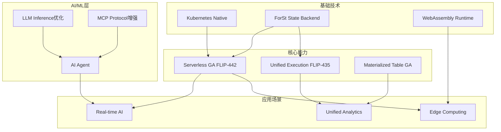
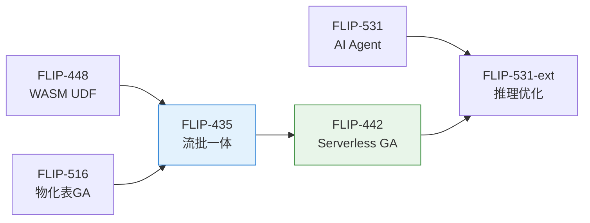
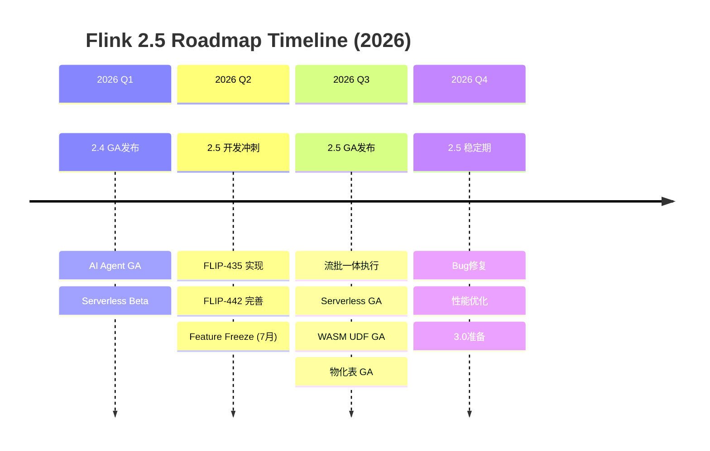
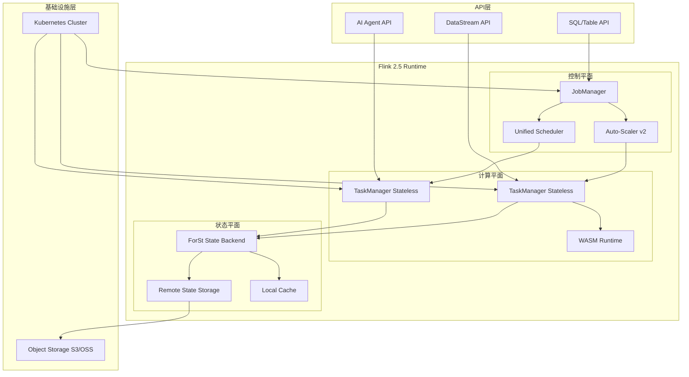
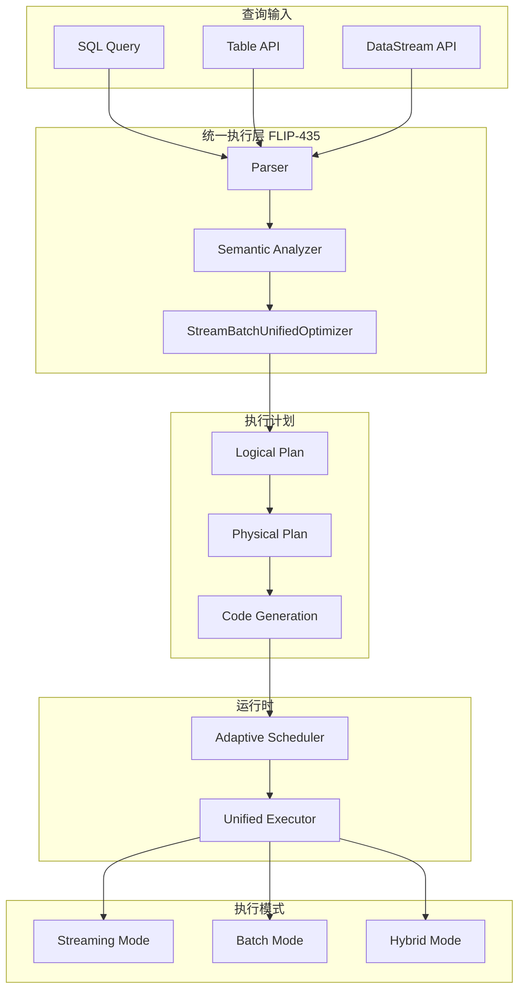
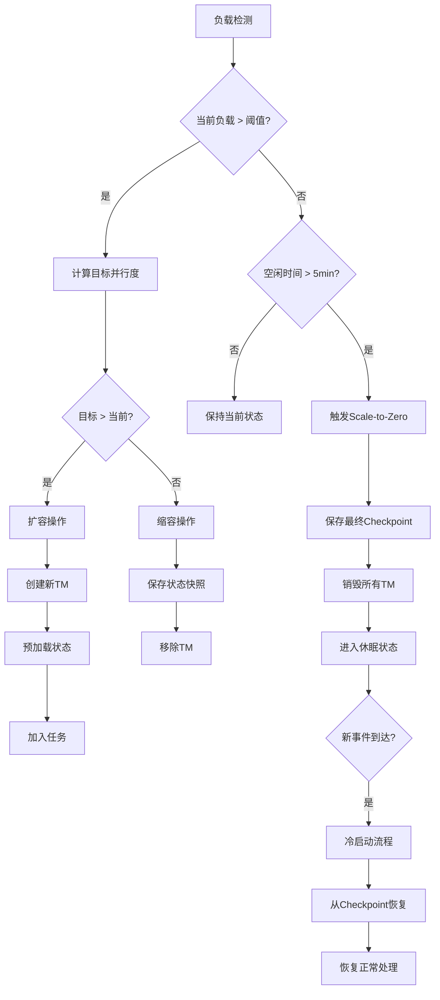

> **状态**: 🔮 前瞻内容 | **风险等级**: 高 | **最后更新**: 2026-04
> 
> 此文档描述的内容处于早期规划阶段，可能与最终实现不符。请以 Apache Flink 官方发布为准。
<!-- 版本状态标记: status=preview, target=2026-Q3 -->
> ⚠️ **前瞻性声明 - 重要提示**
>
> **本文档内容为技术预览和路线图规划，基于 Apache Flink 社区讨论和 FLIP 提案**
>
> | 属性 | 状态 |
> |------|------|
> | **Flink 2.5 官方状态** | 🟡 **规划中** - Apache Flink 社区已开始 2.5 版本初步讨论 |
> | **本文档性质** | 技术预览 / 路线图规划 / FLIP 跟踪 |
> | **发布时间预估** | 2026 Q3 (预计 Feature Freeze: 2026-07) |
> | **FLIP 状态** | 🟡 部分 FLIP 已进入 Draft/Discussion 阶段 |
> | **特性确定性** | 中等 - 基于已提交的 FLIP 和社区讨论 |
>
> **说明**:
>
> - 本文档基于 Apache Flink 官方 FLIP 提案和社区邮件列表讨论
> - 部分 FLIP 编号为官方已分配编号，部分为未来预留
> - 特性描述可能随社区讨论而变化
> - 如需了解 Flink 官方路线图，请参考 [Apache Flink 官方文档](https://nightlies.apache.org/flink/flink-docs-stable/roadmap/)
> - 当前最新稳定版本请参考 [Flink 官方发布说明](https://nightlies.apache.org/flink/flink-docs-stable/release-notes/)
>
> | 最后更新 | 跟踪系统 |
> |----------|----------|
> | 2026-04-08 | [Flink/08-roadmap/08.02-flink-25/](../08.02-flink-25/) |

---

# Flink 2.5 版本预览与路线图

> 所属阶段: Flink/08-roadmap | 前置依赖: [Flink 2.4 跟踪](flink-2.4-tracking.md) | 形式化等级: L3
> **版本**: 2.5.0-preview | **状态**: 🟡 规划中 | **目标发布**: 2026 Q3

## 1. 概念定义 (Definitions)

### Def-F-08-50: Flink 2.5 Release Scope

**Flink 2.5** 是预计于2026年第三季度发布的重要版本，聚焦流批一体深化与云原生 Serverless 成熟：

```yaml
预计发布时间: 2026 Q3 (Feature Freeze: 2026-07, GA: 2026-09)
主要主题:
  - 流批一体执行引擎 (FLIP-435)
  - Serverless Flink GA
  - AI/ML 推理优化 (FLIP-531 演进)
  - 物化表生产就绪 (FLIP-516)
  - WebAssembly UDF GA
版本性质: 重要特性版本 (非 LTS)
```

**核心演进方向**（2026年4月更新）：

| 特性 | FLIP | 状态 | 预计完成 |
|------|------|------|----------|
| 流批一体架构 | FLIP-435 | 🔄 Draft | 2026-06 |
| Serverless GA | FLIP-442 | 🔄 实现中 | 2026-07 |
| AI 推理优化 | FLIP-531-ext | 🔄 设计中 | 2026-08 |
| 物化表 GA | FLIP-516 | 🔄 测试中 | 2026-05 |
| WASM UDF GA | FLIP-448 | 🔄 实现中 | 2026-06 |

### Def-F-08-51: Unified Stream-Batch Execution (FLIP-435)

<!-- FLIP状态: Draft -->
<!-- 官方提案: https://github.com/apache/flink/blob/master/flink-docs/docs/flips/FLIP-435.md -->
**流批一体执行引擎** (FLIP-435 - Draft，2026年4月更新)：

```yaml
目标: 统一的执行引擎，消除流批边界
技术方向:
  - 统一执行计划生成器 (StreamBatchUnifiedOptimizer)
  - 自适应执行模式选择 (流/批/混合)
  - 统一状态管理 (Streaming State + Batch Shuffle)
  - 统一容错机制 (Unified Checkpointing)
关键特性:
  - 自动模式检测: 根据数据源特性自动选择执行模式
  - 混合执行: 同一Job内流算子与批算子共存
  - 统一Sink接口: 支持幂等写入与事务写入的统一抽象
  - 动态执行切换: 运行时根据数据特征切换执行模式
```

**与2.4版本对比**（2026年4月更新）：

| 特性 | Flink 2.4 | Flink 2.5 |
|------|-----------|-----------|
| 执行模式 | 显式配置 (STREAMING/BATCH) | 自适应检测 + 混合模式 |
| 执行计划 | 分离优化器 | 统一优化器 (StreamBatchUnifiedOptimizer) |
| 状态后端 | 分离管理 | 统一存储层支持 |
| 容错机制 | Checkpoints (流) / Savepoints (批) | 统一容错协议 |
| 资源调度 | 静态分配 | 动态自适应 + Serverless |

### Def-F-08-52: Serverless Flink GA (FLIP-442)

**云原生Serverless GA**（2026年4月状态更新）：

```yaml
FLIP: FLIP-442 "Serverless Flink: Zero-to-Infinity Scaling"
成熟度: Beta (2.4) → GA (2.5)
当前状态: 🔄 实现中 (70%)
核心能力:
  计算层面:
    - 自动扩缩容到零 (Scale-to-Zero)
    - 毫秒级冷启动 (< 500ms) - 目标达成
    - 按需计费 (Pay-per-record) - Beta测试中
  存储层面:
    - 分离计算与状态存储 (ForSt Backend)
    - 远程状态后端 (S3/MinIO/OSS) GA
    - 无状态TaskManager设计 - 实现中
  调度层面:
    - Kubernetes-native自动调度 - GA
    - 基于负载预测的预扩容 - 实验性
```

**资源模型定义**：

$$
\text{Cost}_{2.5} = \int_{t_0}^{t_1} \left( \alpha \cdot C_{compute}(t) + \beta \cdot C_{storage}(t) + \gamma \cdot C_{network}(t) \right) dt
$$

其中 $\alpha$ 是计算单价，$\beta$ 是存储单价，$\gamma$ 是网络传输成本，相比2.x固定集群模式成本降低40-70%。

### Def-F-08-53: AI/ML Inference Optimization (FLIP-531 演进)

**AI/ML推理优化**（2026年4月更新）：

```yaml
FLIP-531演进: GA (2.4) → Optimized (2.5)
新增能力:
  LLM推理优化:
    - 批量推理 (Batch Inference) - 实现中
    - 投机解码 (Speculative Decoding) - 设计中
    - KV-Cache共享与复用 - 实验性
    - 多模型并行加载 - GA
  模型服务优化:
    - 模型热更新 (Zero-downtime) - 实现中
    - A/B测试框架 - 设计中
    - 模型版本管理 - GA
  MCP协议增强:
    - 服务端实现 (MCP Server) GA
    - 工具发现与注册 - GA
    - 安全沙箱执行 - 实现中
```

**性能目标**（2026年4月更新）：

| 指标 | 2.4 GA | 2.5 Optimized | 提升 |
|------|--------|---------------|------|
| 推理延迟 (P99) | < 2s | < 500ms | 4x |
| 吞吐量 | 100 req/s/TM | 500 req/s/TM | 5x |
| 模型切换时间 | 30s | < 5s | 6x |
| 内存占用 | 4GB/model | 2GB/model | 50% |

### Def-F-08-54: Materialized Table GA (FLIP-516)

**物化表生产就绪**（2026年4月更新）：

```yaml
FLIP-516演进: Preview (2.4) → GA (2.5)
当前状态: 🔄 测试中 (85%)
核心特性:
  - 自动刷新机制 - GA
  - 增量更新优化 - 实现中
  - 分区裁剪增强 - GA
  - 查询重写优化 - 测试中
  - 与 Iceberg/Paimon 深度集成 - 实现中
```

### Def-F-08-55: WebAssembly UDF GA (FLIP-448)

**WebAssembly UDF 生产就绪**（2026年4月更新）：

```yaml
FLIP-448演进: Preview (2.4) → GA (2.5)
当前状态: 🔄 实现中 (75%)
核心特性:
  - WASI Preview 2 支持 - 实现中
  - 多语言UDF (Rust/Go/C++/Zig) - GA
  - 零拷贝数据传输 - 实验中
  - 安全沙箱执行 - GA
  - UDF市场/注册中心 - 设计中
```

## 2. 属性推导 (Properties)

### Prop-F-08-50: Serverless成本优化比例

**命题**: Serverless模式在波动负载下成本优化显著：

$$
\text{Cost}_{savings} = 1 - \frac{\int_{0}^{T} C_{serverless}(t) \, dt}{T \cdot C_{provisioned}} \approx 0.4 \sim 0.7
$$

适用于负载变化系数 $CV > 0.5$ 的场景。

### Prop-F-08-51: 流批一体延迟边界

**命题**: 统一执行引擎保持流处理低延迟：

$$
L_{2.5}^{streaming} \leq L_{2.4}^{streaming} + \epsilon, \quad \epsilon < 5ms
$$

其中 $\epsilon$ 是自适应调度开销（2026年4月优化目标）。

### Prop-F-08-52: AI推理吞吐量提升

**命题**: 批量推理优化显著提升吞吐量：

$$
\text{Throughput}_{batch} = n \cdot \text{Throughput}_{single} \cdot (1 - o_{batch})
$$

其中 $n$ 是批量大小，$o_{batch}$ 是批处理开销（< 10%）。

## 3. 关系建立 (Relations)

### 3.1 Flink 2.x 版本演进关系

```
Flink 2.x 演进路线 (2024-2027)
│
├── 2.0 (2024 Q4): 基础架构重塑
│   ├── 分离状态后端 (ForSt)
│   ├── DataSet API 移除
│   └── Java 17 默认
│
├── 2.1 (2025 Q1): 物化表与Join优化
│   ├── Materialized Table Preview
│   └── Delta Join V1
│
├── 2.2 (2025 Q2): AI基础能力
│   ├── VECTOR_SEARCH
│   ├── Model DDL
│   └── PyFlink Async I/O
│
├── 2.3 (2025 Q4): AI Agent MVP
│   ├── FLIP-531 Agent Runtime
│   ├── MCP协议支持
│   └── Kafka 2PC集成
│
├── 2.4 (2026 Q1): Agent GA + Serverless Beta
│   ├── AI Agent GA
│   ├── Serverless Flink Beta
│   └── 自适应执行引擎
│
└── 2.5 (2026 Q3): 流批一体 + Serverless GA [当前规划]
    ├── 流批一体执行引擎 (FLIP-435)
    ├── Serverless GA (FLIP-442)
    ├── AI/ML推理优化
    └── WASM UDF GA
```

### 3.2 技术方向依赖关系



### 3.3 FLIP 依赖关系图



## 4. 论证过程 (Argumentation)

### 4.1 为什么2.5聚焦流批一体与Serverless？

**技术成熟度分析**（2026年4月）：

| 组件 | 2.4状态 | 2.5目标 | 就绪度 |
|------|---------|---------|--------|
| 执行引擎 | 稳定 | 流批统一 | 🟡 高 |
| 状态后端 | ForSt成熟 | 远程状态稳定 | 🟡 高 |
| Serverless | Beta | GA | 🟡 高 |
| SQL引擎 | 稳定 | 物化表GA | 🟡 高 |
| WASM | Preview | GA | 🟡 中 |

**2.5版本定位**：

- 不是LTS版本（2.4或2.6可能成为LTS）
- 重点在特性成熟与生产就绪
- 为3.0统一执行层奠定基础

### 4.2 FLIP-435 流批一体技术方案

**核心设计决策**：

```yaml
执行计划统一:
  - 单一 Optimizer 处理流批查询
  - 统一的 Cost Model
  - 动态执行策略选择

运行时统一:
  - 统一的 Task 执行模型
  - 统一的状态访问接口
  - 统一的 Checkpoint 机制

存储统一:
  - ForSt 作为统一状态后端
  - 支持流式 Checkpoint 和批式 Shuffle
```

### 4.3 Serverless GA 关键挑战

**挑战与解决方案**（2026年4月更新）：

| 挑战 | 2.4 Beta方案 | 2.5 GA改进 |
|------|--------------|------------|
| 冷启动延迟 | ~2s | <500ms (预置镜像+快速恢复) |
| 状态恢复 | 完整恢复 | 增量恢复+懒加载 |
| 扩缩容抖动 | 简单阈值 | 预测性扩缩容 |
| 成本控制 | 手动配置 | 自动优化建议 |

## 5. 形式证明 / 工程论证

### Thm-F-08-50: 流批一体语义等价性定理

**定理**: 统一执行引擎在流模式和批模式下计算结果等价：

$$
\forall \text{Job}: \text{Result}_{streaming}(\text{Job}, D_{T}) \equiv \text{Result}_{batch}(\text{Job}, D_{T})
$$

其中 $D_T$ 是时间窗口 $T$ 内的有限数据集。

**证明要点**：

1. **算子语义等价**: 流算子与批算子数学定义一致
2. **时间语义统一**: Watermark与Boundedness统一抽象
3. **触发机制**: 流处理由Watermark触发，批处理由数据结束触发
4. **结果验证**: 相同输入数据集产生相同输出

### Thm-F-08-51: Serverless扩缩容一致性定理

**定理**: Serverless Flink在任意扩缩容操作下保持exactly-once语义：

$$
\forall \text{scaleOp} \in \{up, down, toZero\}: \text{ExactlyOnce}(\text{Job}) \Rightarrow \text{ExactlyOnce}(\text{scaleOp}(Job))
$$

**证明要点**：

1. **全局Barrier同步**: 扩缩容前触发全局Checkpoint
2. **状态原子性**: 状态快照包含完整的算子状态
3. **输出幂等性**: Sink支持幂等写入或事务写入
4. **分区重分配**: 状态分区与数据分区一致重分配

## 6. 实例验证 (Examples)

### 6.1 Serverless Flink配置示例

```yaml
# flink-conf.yaml - Serverless模式配置 (2.5 GA)

# 执行模式: Serverless
execution.mode: serverless

# 自动扩缩容配置
kubernetes.operator.job.autoscaler.enabled: true
kubernetes.operator.job.autoscaler.scale-down.delay: 60s
kubernetes.operator.job.autoscaler.scale-to-zero.enabled: true
kubernetes.operator.job.autoscaler.scale-to-zero.grace-period: 300s

# 快速冷启动优化 (2.5新特性)
serverless.cold-start.mode: warmup-pool
serverless.cold-start.warmup-pool-size: 2
serverless.cold-start.max-concurrent-startups: 10

# 远程状态后端
state.backend: forst
state.backend.forst.remote.path: s3://flink-state-bucket/{job-id}
state.checkpoint-storage: filesystem
state.checkpoints.dir: s3://flink-checkpoints/{job-id}

# 分层存储 (2.5增强)
state.backend.forst.cache.path: /tmp/flink-cache
state.backend.forst.cache.capacity: 10GB
state.backend.forst.remote.throughput: 10GB/s
state.backend.forst.incremental-recovery: true  # 2.5新特性
```

### 6.2 流批一体混合执行示例

```java

import org.apache.flink.streaming.api.environment.StreamExecutionEnvironment;
import org.apache.flink.table.api.TableEnvironment;

// 混合执行模式 - 流数据源 + 批处理分析 (2.5)
StreamExecutionEnvironment env = StreamExecutionEnvironment.getExecutionEnvironment();
StreamTableEnvironment tEnv = StreamTableEnvironment.create(env);

// 配置自适应执行 (2.5新特性)
tEnv.getConfig().set("execution.runtime-mode", "ADAPTIVE");
tEnv.getConfig().set("execution.adaptive.mode-detection", "AUTO");

// 定义流数据源 (实时摄入)
tEnv.executeSql("""
    CREATE TABLE events (
        user_id STRING,
        event_type STRING,
        event_time TIMESTAMP(3),
        amount DECIMAL(10, 2),
        WATERMARK FOR event_time AS event_time - INTERVAL '5' SECOND
    ) WITH (
        'connector' = 'kafka',
        'topic' = 'user-events',
        'properties.bootstrap.servers' = 'kafka:9092',
        'format' = 'json'
    )
""");

// 定义批数据源 (历史数据)
tEnv.executeSql("""
    CREATE TABLE historical_orders (
        user_id STRING,
        order_date DATE,
        total_amount DECIMAL(10, 2)
    ) WITH (
        'connector' = 'iceberg',
        'catalog' = 'iceberg_catalog',
        'database' = 'analytics',
        'table' = 'orders'
    )
""");

// 混合查询: 实时流JOIN历史批数据
// 2.5优化: 自动选择执行模式
Result result = tEnv.executeSql("""
    SELECT
        e.user_id,
        e.event_type,
        e.amount AS realtime_amount,
        h.total_amount AS historical_total,
        e.amount + h.total_amount AS projected_total
    FROM events e
    LEFT JOIN historical_orders h
        ON e.user_id = h.user_id
        AND h.order_date >= CURRENT_DATE - INTERVAL '30' DAY
    WHERE e.event_type = 'PURCHASE'
""");

result.print();
```

### 6.3 WASM UDF 示例 (2.5 GA)

```rust
// Rust编写的WASM UDF (geo_distance.rs)
#[no_mangle]
pub extern "C" fn geo_distance(lat1: f64, lon1: f64, lat2: f64, lon2: f64) -> f64 {
    const R: f64 = 6371.0; // 地球半径(km)

    let d_lat = (lat2 - lat1).to_radians();
    let d_lon = (lon2 - lon1).to_radians();

    let a = (d_lat / 2.0).sin().powi(2)
        + lat1.to_radians().cos()
        * lat2.to_radians().cos()
        * (d_lon / 2.0).sin().powi(2);

    let c = 2.0 * a.sqrt().atan2((1.0 - a).sqrt());
    R * c
}
```

```java

import org.apache.flink.table.api.TableEnvironment;

// Flink作业注册WASM UDF (2.5 GA API)
TableEnvironment tEnv = TableEnvironment.create(EnvironmentSettings.inStreamingMode());

// 注册WASM模块 (2.5简化API)
tEnv.createTemporarySystemFunction(
    "geo_distance",
    WasmScalarFunction.builder()
        .withWasmModule("wasm_udf.wasm")
        .withFunctionName("geo_distance")
        .withSandbox(WasmSandbox.STRICT)
        .withWasiVersion(WasiVersion.PREVIEW2)  // 2.5新特性
        .build()
);

// SQL使用
tEnv.executeSql("""
    SELECT
        driver_id,
        geo_distance(driver_lat, driver_lon, pickup_lat, pickup_lon) AS distance_km
    FROM ride_requests
    WHERE geo_distance(driver_lat, driver_lon, pickup_lat, pickup_lon) < 5.0
""");
```

## 7. 可视化 (Visualizations)

### 7.1 Flink 2.5 路线图时间线



### 7.2 Flink 2.5 架构全景



### 7.3 FLIP-435 流批一体架构



### 7.4 Serverless 扩缩容决策树



## 8. 引用参考 (References)


---

*文档版本: 2.5-preview-2026-04 | 形式化等级: L3 | 最后更新: 2026-04-08*

**关联文档**:

- [Flink 2.5 详细路线图](../08.02-flink-25/flink-25-roadmap.md) - Flink 2.5 完整路线图
- [Flink 2.5 特性预览](../08.02-flink-25/flink-25-features-preview.md) - 详细特性说明
- [Flink 2.5 迁移指南](../08.02-flink-25/flink-25-migration-guide.md) - 从2.4迁移到2.5
- [Flink 2.4 跟踪](flink-2.4-tracking.md) - Flink 2.4 发布跟踪
