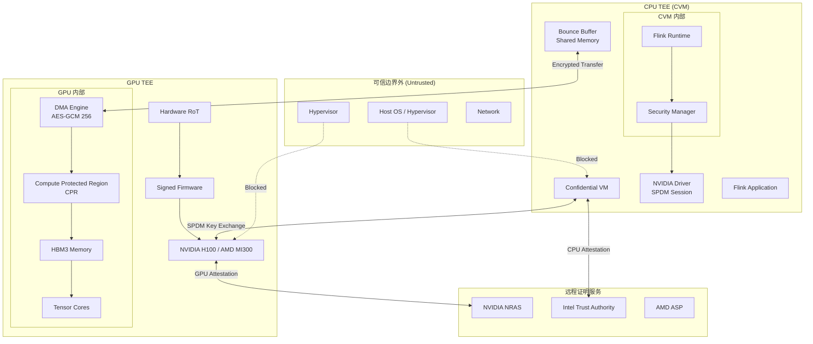
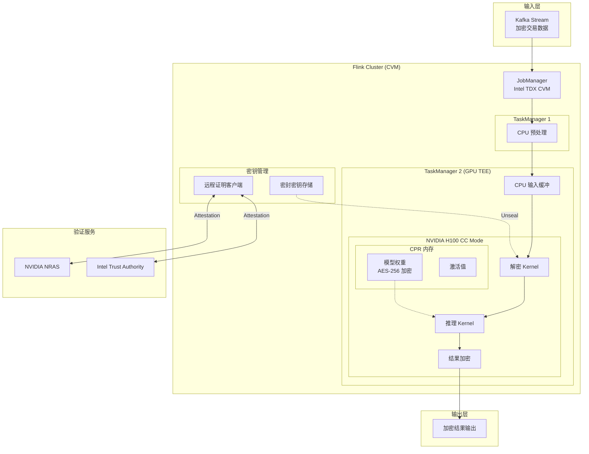
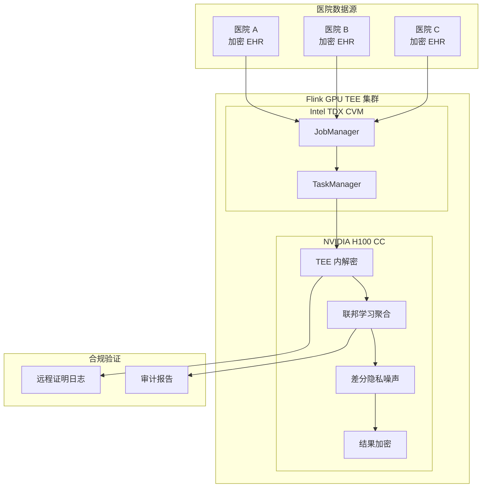
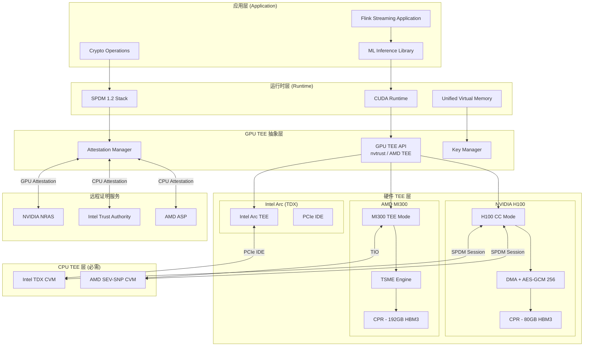
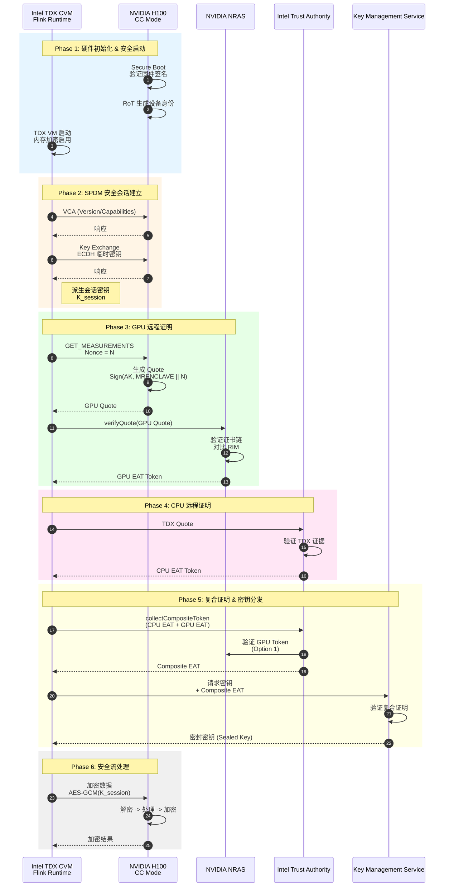
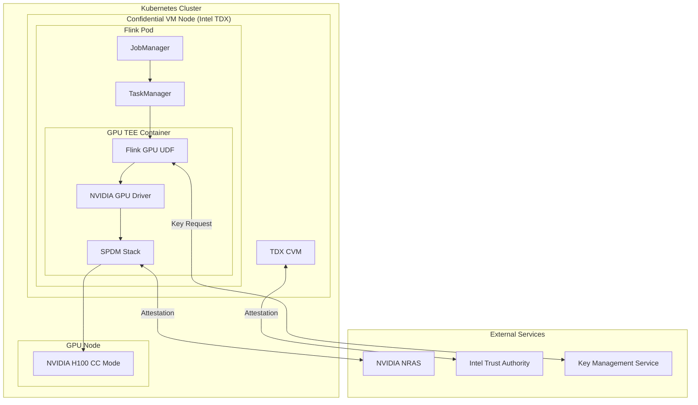

> **状态**: 🔮 前瞻内容 | **风险等级**: 高 | **最后更新**: 2026-04
> 
> 此文档描述的内容处于早期规划阶段，可能与最终实现不符。请以 Apache Flink 官方发布为准。
# GPU 机密计算 — Flink 安全流处理架构

> 所属阶段: Flink/Security | 前置依赖: [Flink 可信执行环境](./trusted-execution-flink.md) | 形式化等级: L4-L5

## 1. 概念定义 (Definitions)

### Def-F-13-08: GPU TEE (GPU Trusted Execution Environment)

**形式化定义**:

GPU TEE 是在 GPU 硬件上建立的隔离执行环境，用于保护数据在使用中的机密性和完整性：

$$\text{GPU-TEE} = (H_{GPU}, M_{CPR}, K_{session}, A_{attest}, F_{firewall})$$

其中：

- $H_{GPU}$: GPU 硬件根信任 (Root of Trust, RoT)，芯片制造时烧录的唯一加密身份
- $M_{CPR}$: 计算保护区域 (Compute Protected Region)，受硬件保护的 GPU 内存区域
- $K_{session}$: 会话密钥，用于 CPU-GPU 间加密通信
- $A_{attest}$: GPU 远程证明机制
- $F_{firewall}$: PCIe/NVLink 防火墙，阻止未授权访问

**安全保证**:

| 保证 | 描述 | 实现机制 |
|------|------|---------|
| 机密性 (Confidentiality) | GPU 内存数据对主机不可见 | HBM 硬件隔离 + AES-GCM 加密 |
| 完整性 (Integrity) | 代码和数据在传输/计算中不可篡改 | SPDM 安全会话 + 度量链 |
| 可验证性 (Verifiability) | 外部可密码学验证 GPU 状态 | 远程证明报告 |
| 可用性 (Availability) | 性能损失最小化 | 硬件加速加密引擎 |

---

### Def-F-13-09: NVIDIA H100 Confidential Computing (CC Mode)

**形式化定义**:

NVIDIA H100 机密计算模式是世界首个原生支持 TEE 的 GPU 实现：

$$\text{H100-CC} = \text{GPU-TEE}(\text{RoT}_{on-die}, \text{AES}_{256-GCM}, \text{SPDM}_{1.2})$$

**关键硬件特性**:

```
┌─────────────────────────────────────────────────────────────────┐
│                    NVIDIA H100 GPU (Hopper)                     │
├─────────────────────────────────────────────────────────────────┤
│  ┌─────────────────────────────────────────────────────────┐   │
│  │           Compute Protected Region (CPR)                │   │
│  │  ┌─────────────┐  ┌─────────────┐  ┌─────────────────┐  │   │
│  │  │ Tensor Core │  │    HBM3     │  │   DMA Engine    │  │   │
│  │  │   (FP8/16)  │  │  (3 TB/s)   │  │ (AES-GCM 256)   │  │   │
│  │  └─────────────┘  └─────────────┘  └─────────────────┘  │   │
│  └─────────────────────────────────────────────────────────┘   │
│                           │                                     │
│  ┌────────────────────────┴───────────────────────────────┐    │
│  │           PCIe Firewall / NVLink Firewall              │    │
│  │         (Block unauthorized memory access)             │    │
│  └────────────────────────────────────────────────────────┘    │
│                           │                                     │
│  ┌────────────────────────┴───────────────────────────────┐    │
│  │              Hardware Root of Trust (RoT)              │    │
│  │    - Unique Device Identity (burned at manufacture)    │    │
│  │    - Secure Boot (firmware signature verification)     │    │
│  │    - Attestation Key (AK) for remote attestation       │    │
│  └────────────────────────────────────────────────────────┘    │
└─────────────────────────────────────────────────────────────────┘
```

**CC 模式状态机**:

```
[POWER_ON] ──→ [SECURE_BOOT] ──→ [IDLE] ──→ [CC_MODE_ON]
                   │                              │
                   ↓                              ↓
            [RoT Verified]              [Session Established]
                                               │
                                               ↓
                                      [TEE_OPERATION]
```

**模式对比**:

| 特性 | CC-Off (传统模式) | CC-On (机密模式) |
|------|------------------|-----------------|
| 主机访问 | 完全访问 GPU 内存 | 被 PCIe 防火墙阻断 |
| 性能计数器 | 可用 | 禁用（防侧信道） |
| DMA 加密 | 无 | AES-GCM 256 |
| 远程证明 | 无 | 完整证明链 |
| 性能开销 | 0% | <2% (典型) |

---

### Def-F-13-10: AMD MI300 Infinity Guard

**形式化定义**:

AMD Instinct MI300 系列 GPU 通过 Infinity Guard 技术栈提供 TEE 支持：

$$\text{MI300-TEE} = \text{GPU-TEE}(\text{SEV-SNP}_{ext}, \text{TSME}, \text{TIO})$$

其中：

- $\text{SEV-SNP}_{ext}$: 扩展的 SEV-SNP 支持，保护 GPU 内存免受恶意 Hypervisor 访问
- $\text{TSME}$: Transparent Secure Memory Encryption，透明安全内存加密
- $\text{TIO}$: Trusted I/O，将 TEE 扩展到外部可信设备

**MI300 安全层次**:

| 层次 | 组件 | 功能 |
|------|------|------|
| L0 | AMD Security Processor | 硬件根信任、密钥管理 |
| L1 | Infinity Fabric | 加密互连、内存保护 |
| L2 | GPU Compute Die | 计算单元隔离 |
| L3 | HBM3 Stack | 内存加密引擎 |
| L4 | PCIe/CXL | 可信 I/O 通道 |

**MI300 vs H100 CC 对比**:

| 特性 | AMD MI300X | NVIDIA H100 |
|------|:----------:|:-----------:|
| HBM 容量 | 192GB | 80GB |
| 内存带宽 | 5.3 TB/s | 3 TB/s |
| 计算单元 | 304 XCD CU | 132 SM |
| TEE 方案 | Infinity Guard + SNP | Hopper CC Mode |
| CPU 依赖 | AMD SEV-SNP | Intel TDX / AMD SEV-SNP |
| 内存加密 | TSME | AES-GCM 256 (DMA) |

---

### Def-F-13-11: Intel TDX Connect for GPUs

**形式化定义**:

Intel TDX Connect 是将 Intel TDX 机密虚拟机技术扩展到 GPU 加速器的架构：

$$\text{TDX-Connect} = \text{GPU-TEE}(\text{TDX}_{CVM}, \text{PCIe}_{IDE}, \text{TDI})$$

其中：

- $\text{TDX}_{CVM}$: Intel TDX 机密虚拟机作为主机环境
- $\text{PCIe}_{IDE}$: PCIe Integrity and Data Encryption，PCIe 完整性及数据加密
- $\text{TDI}$: TDX Device Interface，设备与 TDX CVM 的安全接口规范

**TDX Connect 架构**:

```
┌─────────────────────────────────────────────────────────────────┐
│                    Intel TDX Connect Architecture               │
├─────────────────────────────────────────────────────────────────┤
│                                                                 │
│  ┌─────────────────────────────────────────────────────────┐   │
│  │              Intel TDX Confidential VM                  │   │
│  │  ┌─────────────┐  ┌─────────────┐  ┌─────────────┐     │   │
│  │  │  Flink      │  │  GPU        │  │  SPDM       │     │   │
│  │  │  Runtime    │  │  Driver     │  │  Stack      │     │   │
│  │  └──────┬──────┘  └──────┬──────┘  └──────┬──────┘     │   │
│  │         │                │                │            │   │
│  │         └────────────────┴────────────────┘            │   │
│  │                          │                             │   │
│  │                   ┌──────┴──────┐                      │   │
│  │                   │ TDX Module  │ ← 硬件信任根         │   │
│  │                   │ (SEAM)      │                      │   │
│  │                   └──────┬──────┘                      │   │
│  └──────────────────────────┼──────────────────────────────┘   │
│                             │                                   │
│  ┌──────────────────────────┼──────────────────────────────┐    │
│  │                   PCIe IDE                               │    │
│  │  ┌───────────────────────┴──────────────────────────┐   │    │
│  │  │          Integrity Check + Data Encryption         │   │    │
│  │  │         (TLP Digest + AES-256-GCM)                 │   │    │
│  │  └───────────────────────┬──────────────────────────┘   │    │
│  └──────────────────────────┼──────────────────────────────┘    │
│                             │                                   │
│  ┌──────────────────────────┼──────────────────────────────┐    │
│  │              GPU with TDX Support                        │    │
│  │  ┌───────────────────────┴──────────────────────────┐   │    │
│  │  │         Device TEE (NVIDIA/Intel Arc)              │   │    │
│  │  │    ┌─────────┐  ┌─────────┐  ┌─────────┐         │   │    │
│  │  │    │ Compute │  │ Memory  │  │ DMA     │         │   │    │
│  │  │    │ Units   │  │ Encryption  │  │ Engine  │         │   │    │
│  │  │    └─────────┘  └─────────┘  └─────────┘         │   │    │
│  │  └──────────────────────────────────────────────────┘   │    │
│  └──────────────────────────────────────────────────────────┘    │
│                                                                 │
└─────────────────────────────────────────────────────────────────┘
```

**TDX Connect 安全特性**:

| 特性 | 实现 | 安全保证 |
|------|------|---------|
| VM 隔离 | Intel TDX Module | Hypervisor 无法访问 CVM 内存 |
| 设备认证 | PCIe IDE + SPDM | 设备身份密码学验证 |
| 数据加密 | AES-256-GCM | 传输中数据机密性 |
| 完整性保护 | PCIe TLP Digest | 防止数据篡改 |
| 证明链 | Intel Trust Authority | 端到端可信验证 |

---

### Def-F-13-12: 硬件发展时间线 (2022-2025)

**GPU TEE 演进时间线**:

```
┌─────────────────────────────────────────────────────────────────────────────┐
│                      GPU Confidential Computing Timeline                    │
├─────────────────────────────────────────────────────────────────────────────┤
│                                                                             │
│  2022 Q1                                                                    │
│     │                                                                       │
│     ├── NVIDIA announces H100 Hopper with CC capability (GTC 2022)         │
│     │   └── First GPU with native TEE support announced [^1]               │
│     │                                                                       │
│  2023 Q1                                                                    │
│     │                                                                       │
│     ├── NVIDIA H100 CC Mode Early Access                                   │
│     │   └── Preview availability for cloud partners                        │
│     │                                                                       │
│  2023 Q4                                                                    │
│     │                                                                       │
│     ├── AMD announces MI300X with Infinity Guard                           │
│     │   └── 192GB HBM3 + SEV-SNP extended to GPU [^9]                      │
│     │                                                                       │
│  2024 Q1                                                                    │
│     │                                                                       │
│     ├── NVIDIA H100 CC Mode GA (General Availability)                      │
│     │   └── Azure, AWS, GCP production deployment [^2]                     │
│     │                                                                       │
│  2024 Q2                                                                    │
│     │                                                                       │
│     ├── Intel announces TDX Connect specification                          │
│     │   └── PCIe IDE + TDI for GPU integration [^11]                       │
│     │                                                                       │
│     ├── AMD MI300X shipping with TEE support                               │
│     │   └── Azure ND MI300X v5 instances                                   │
│     │                                                                       │
│  2024 Q4                                                                    │
│     │                                                                       │
│     ├── Intel Trust Authority adds NVIDIA H100 attestation [^7]            │
│     │   └── Unified CPU+GPU attestation service                            │
│     │                                                                       │
│     ├── NVIDIA Blackwell B100/B200 announced                               │
│     │   └── Next-gen CC with enhanced security [^12]                       │
│     │                                                                       │
│  2025 Q1 (Current)                                                          │
│     │                                                                       │
│     ├── AMD MI350 series roadmap                                           │
│     │   └── CDNA 4 architecture with enhanced TEE                          │
│     │                                                                       │
│     ├── Intel discrete GPU TDX support                                     │
│     │   └── Arc Battlemage with TEE capabilities                           │
│     │                                                                       │
│  2025 Q2-Q4 (Projected)                                                     │
│     │                                                                       │
│     ├── NVIDIA Blackwell CC Mode GA                                        │
│     │   └── Multi-GPU TEE with NVLink CC [^12]                             │
│     │                                                                       │
│     ├── AMD MI400 series                                                   │
│     │   └── Full APU+GPU unified TEE                                       │
│     │                                                                       │
│     └── Industry standardization efforts                                   │
│         └── CCC (Confidential Computing Consortium) GPU specs              │
│                                                                             │
└─────────────────────────────────────────────────────────────────────────────┘
```

**关键里程碑**:

| 时间 | 事件 | 意义 |
|------|------|------|
| 2022-03 | H100 Architecture Reveal | 首个原生 GPU TEE 架构公布 |
| 2024-01 | H100 CC GA | GPU TEE 进入生产环境 |
| 2024-06 | TDX Connect Spec | Intel 统一异构 TEE 标准 |
| 2024-12 | MI300X Azure GA | AMD GPU TEE 云规模部署 |
| 2025+ | Blackwell CC | 下一代 GPU TEE 架构 |

---

### Def-F-13-13: 安全流处理会话 (Secure Stream Processing Session)

**形式化定义**:

Flink 安全流处理会话是建立在 GPU TEE 之上的高层抽象：

$$\text{SSPS} = (CVM_{CPU}, TEE_{GPU}, K_{shared}, Ch_{secure}, \mathcal{O}_{stream})$$

其中：

- $CVM_{CPU}$: 机密虚拟机 (Confidential VM)，Intel TDX 或 AMD SEV-SNP
- $TEE_{GPU}$: GPU TEE 实例 (H100 CC Mode 或 MI300 TEE)
- $K_{shared}$: SPDM 会话派生的共享密钥
- $Ch_{secure}$: 安全通道，保护 CPU-GPU 数据传输
- $\mathcal{O}_{stream}$: 流算子集合，在 GPU TEE 内执行

**会话生命周期**:

```
┌──────────┐    ┌──────────┐    ┌──────────┐    ┌──────────┐
│  INIT    │───→│ ATTEST   │───→│ COMPUTE  │───→│ TEARDOWN │
└──────────┘    └──────────┘    └──────────┘    └──────────┘
     │               │               │               │
     ↓               ↓               ↓               ↓
 CVM Launch      GPU Quote      Data Stream     Key Eviction
 GPU Bind        NRAS Verify    Secure Exec     State Clear
```

---

## 2. 属性推导 (Properties)

### Prop-F-13-04: CPU-GPU 复合 TEE 安全定理

**命题**: 当 CPU TEE (CVM) 与 GPU TEE 联合使用时，系统可防护以下攻击者：

$$\text{Attacker} \in \{\text{OS}, \text{Hypervisor}, \text{BIOS}, \text{Admin}, \text{Network}, \text{PCIe-Snooper}\}$$

**证明概要**:

1. **CVM 层防护**:
   - CPU 内存加密 (Intel MKTME / AMD SME)
   - VM 隔离：Hypervisor 无法访问 CVM 内存
   - 证明：$\forall x \in M_{CVM}, \text{Hypervisor} \not\rightarrow x$

2. **GPU TEE 层防护**:
   - PCIe 防火墙阻断主机访问 $M_{CPR}$
   - DMA 引擎加密所有进出 CPR 的数据
   - 证明：$\forall y \in M_{CPR}, \text{Host} \not\rightarrow y$

3. **通道防护**:
   - SPDM 会话建立共享密钥 $K_{session}$
   - Bounce Buffer 使用 AES-GCM 256 加密
   - 证明：$\text{Data}_{transit} = \text{AES-GCM}_{K_{session}}(\text{plaintext})$

4. **端到端安全**:
   $$
   \text{Security}_{end-to-end} = \text{CVM}_{isolation} \land \text{GPU}_{isolation} \land \text{Channel}_{encryption}
   $$

---

### Prop-F-13-05: GPU TEE 数据机密性定理

**命题**: 在 GPU TEE 中处理的数据，对特权攻击者保持机密：

$$\text{Confidentiality}(D) \Rightarrow \forall A \in \text{Privileged}, \Pr[A \text{ learns } D] < \epsilon_{negl}$$

**推导**:

| 攻击向量 | 防护措施 | 安全边界 |
|---------|---------|---------|
| 内存转储 (Memory Dump) | CPR 硬件隔离 | 物理内存访问被阻断 |
| PCIe 嗅探 (PCIe Snooping) | AES-GCM 256 加密 | 密文不可区分性 |
| 侧信道 (Side Channel) | 性能计数器禁用 | 时序/功耗攻击失效 |
| 固件篡改 (Firmware Tampering) | 安全启动 + 度量 | 篡改可检测 |

---

### Prop-F-13-06: PCIe/NVLink 加密安全定理

**命题**: GPU TEE 的 PCIe/NVLink 加密满足 IND-CCA2 安全级别：

$$\text{PCIe-Enc} = \text{AES-GCM-256}(K_{session}, P, AAD_{PCIe})$$

其中 $AAD_{PCIe}$ 包含 PCIe 事务层包 (TLP) 头信息，防止重放和重排序攻击。

**加密范围**:

| 通道类型 | 加密范围 | 密钥派生 |
|---------|---------|---------|
| PCIe Gen5 | CPU-GPU 全部 DMA 传输 | SPDM Session Key |
| NVLink 4 | GPU-GPU P2P 传输 | 多 GPU 组密钥 |
| CXL 2.0 | 内存扩展设备 | TDX/SEV 集成密钥 |

---

### Lemma-F-13-02: 性能开销上界

**引理**: 对于大规模模型（如 Llama-3.1-70B），GPU TEE 的性能开销满足：

$$\text{Overhead}_{TEE} = \frac{T_{TEE} - T_{baseline}}{T_{baseline}} < 2\%$$

**条件**: 当批处理大小 (batch size) 足够大，使计算主导 I/O 时。

**证明依据**:

- GPU 内部计算不受 TEE 影响（全速 HBM 访问）
- 开销主要来自 CPU-GPU 数据传输加密
- 对于大模型，计算时间 $T_{compute} \gg T_{IO}$
- 因此 $\lim_{\text{model-size}\to\infty} \text{Overhead}_{TEE} = 0$

---

## 3. 关系建立 (Relations)

### 3.1 CPU TEE vs GPU TEE 对比矩阵

| 维度 | Intel SGX | Intel TDX | AMD SEV-SNP | NVIDIA H100 CC | AMD MI300 TEE | Intel TDX Connect |
|------|:---------:|:---------:|:-----------:|:--------------:|:-------------:|:-----------------:|
| **隔离粒度** | 进程级 | VM级 | VM级 | GPU设备级 | GPU设备级 | VM+设备级 |
| **内存容量** | 128MB-1GB EPC | 无限制 | 无限制 | 80GB HBM3 | 192GB HBM3 | 无限制+GPU |
| **TCB 大小** | 小 (CPU+uCode) | 较大 (TDX Module) | 较大 (SEV FW) | 中 (GPU RoT+FW) | 中 (SP+IF) | 较大 (TDX+GPU) |
| **计算特性** | 通用 | 通用 | 通用 | 张量加速 | 张量加速 | 通用+加速 |
| **带宽** | 内存带宽 | 内存带宽 | 内存带宽 | 3 TB/s | ~5 TB/s | 内存+PCIe |
| **加密引擎** | 内存加密 | MKTME | SME | AES-GCM 256 (DMA) | TSME | PCIe IDE |
| **证明服务** | Intel PCS | Intel Trust Authority | AMD ASP | NVIDIA NRAS | AMD ASP | Intel Trust Authority |
| **依赖 CPU TEE** | 独立 | 独立 | 独立 | **必须** (TDX/SNP) | **必须** (SNP) | **必须** (TDX) |
| **代表应用** | 密钥管理 | 机密VM | 云原生安全 | 安全AI推理 | 安全AI训练 | 异构安全计算 |
| **可用年份** | 2015-2024 | 2023+ | 2021+ | 2024+ | 2024+ | 2024+ |

### 3.2 CPU-GPU TEE 协作架构



### 3.3 Flink + GPU TEE 映射关系

| Flink 组件 | GPU TEE 对应 | 安全增强 |
|-----------|-------------|---------|
| JobManager | CVM 内协调器 | 调度策略保密 |
| TaskManager | GPU TEE 容器 | 算子代码完整性 |
| State Backend | GPU HBM 加密存储 | 状态机密性 |
| Checkpoint | 密封加密检查点 | 持久化保护 |
| Source/Sink | 加密通道连接器 | 数据流保护 |
| UDF | GPU Kernel | 用户代码隔离 |

---

## 4. 论证过程 (Argumentation)

### 4.1 威胁模型：GPU 流处理场景

**攻击者能力层级**:

```
┌─────────────────────────────────────────────────────────────────┐
│                    GPU TEE 威胁模型                             │
├─────────────────────────────────────────────────────────────────┤
│ L1: 网络攻击者      → 被动监听/篡改 PCIe/NVLink 流量            │
│ L2: 云租户          → 共享 GPU 的 MIG 逃逸攻击                  │
│ L3: 系统管理员      → 主机内存访问、驱动注入                     │
│ L4: 云运营商        → Hypervisor 控制、恶意固件                  │
│ L5: 物理攻击者      → 冷启动、总线嗅探、侧信道                   │
└─────────────────────────────────────────────────────────────────┘
```

**GPU TEE 防护边界**:

- 有效防护至 **L4**（云运营商级别）
- L5 需要额外物理防护（如防拆封、温度监控）

### 4.2 安全流处理架构设计

**分层安全策略**:

```
┌─────────────────────────────────────────────────────────────────┐
│ Layer 5: 应用层安全 (Flink SQL/UDF 沙箱)                        │
│         - 算子级隔离、内存安全语言 (Rust)                         │
├─────────────────────────────────────────────────────────────────┤
│ Layer 4: 运行时安全 (CUDA 驱动验证)                             │
│         - 驱动签名验证、API 调用审计                             │
├─────────────────────────────────────────────────────────────────┤
│ Layer 3: GPU TEE (CPR 隔离、DMA 加密)                           │
│         - 硬件级内存保护、AES-GCM 256                           │
├─────────────────────────────────────────────────────────────────┤
│ Layer 2: CPU-GPU 通道安全 (SPDM 1.2 / PCIe IDE)                 │
│         - 相互认证、会话密钥派生                                 │
├─────────────────────────────────────────────────────────────────┤
│ Layer 1: CPU TEE (CVM 隔离)                                     │
│         - VM 内存加密、Hypervisor 隔离                           │
├─────────────────────────────────────────────────────────────────┤
│ Layer 0: 硬件根信任 (RoT)                                       │
│         - 设备身份、安全启动、固件度量                            │
└─────────────────────────────────────────────────────────────────┘
```

### 4.3 性能-安全权衡分析

| 配置 | 安全级别 | 性能开销 | 适用场景 |
|------|---------|---------|---------|
| 无 TEE | L0 | 0% | 非敏感数据 |
| 仅 CPU TEE | L3 | 3-5% | 一般敏感数据 |
| CPU+GPU TEE | L4 | <2% | 高敏感 AI/ML |
| + MIG 隔离 | L4+ | 2-10% | 多租户安全 |

**关键观察**: 对于大规模流处理（大 batch），开销趋近于零。

### 4.4 安全属性对比分析

| 属性 | 软件加密 | CPU TEE | GPU TEE | 说明 |
|------|---------|---------|---------|------|
| 数据机密性 | ✅ | ✅ | ✅ | 三者均可实现 |
| 使用中保护 | ❌ | ✅ | ✅ | 软件加密无法保护内存中的明文 |
| 算子完整性 | ❌ | ⚠️ | ✅ | GPU 硬件隔离更强 |
| 远程证明 | ❌ | ✅ | ✅ | 硬件信任根必需 |
| 性能 | 基准 | -5% | <2% | GPU TEE 开销最小 |

---

## 5. 形式证明 / 工程论证 (Proof / Engineering Argument)

### 5.1 GPU TEE 远程证明协议

**协议参与者**:

- $\mathcal{C}$: CPU CVM (Flink 运行时)
- $\mathcal{G}$: GPU TEE (H100/MI300)
- $\mathcal{V}$: 验证者 (NRAS / Intel Trust Authority)
- $\mathcal{R}$: 依赖方 (密钥服务)

**协议步骤**:

```
Phase 1: 设备身份建立
─────────────────────────────────────────
1.  𝒢 上电 → 安全启动验证固件签名
2.  RoT 生成设备密钥对 (EK_pub, EK_priv)
3.  固件度量值: FW_MEASUREMENT = SHA256(FW_IMAGE)

Phase 2: SPDM 会话建立
─────────────────────────────────────────
4.  𝒞 ←→ 𝒢: SPDM VCA (Version/Capabilities/Algorithms)
5.  𝒞 ←→ 𝒢: SPDM Key Exchange
    - 临时密钥对 (ephemeral)
    - 共享密钥派生: K_session = KDF(ECDH_shared, transcript)

Phase 3: 远程证明
─────────────────────────────────────────
6.  𝒞 → 𝒢: GET_MEASUREMENTS (nonce 𝒩)
7.  𝒢 生成 Quote:
    Quote = {
      HEADER: "NV_GPU_QUOTE",
      DEVICE_ID: EK_pub,
      FW_MEASUREMENT: H(FW),
      NONCE: 𝒩,
      SIGNATURE: Sign(AK, above)
    }
8.  𝒞 → 𝒱: Quote
9.  𝒱 验证:
    a. 验证 AK 证书链 → NVIDIA RoT CA
    b. 对比 FW_MEASUREMENT 与 RIM (Reference Integrity Manifest)
    c. 检查证书吊销状态 (OCSP)
10. 𝒱 → 𝒞: EAT (Entity Attestation Token)

Phase 4: 安全通道建立
─────────────────────────────────────────
11. 𝒞 验证 EAT 后，派生数据加密密钥
12. 𝒞 ←→ 𝒢: 所有数据经 AES-GCM 256 加密传输
```

**安全性论证**:

| 属性 | 证明 |
|------|------|
| **身份真实性** | AK 证书链锚定至 NVIDIA RoT CA，不可伪造 |
| **完整性** | Quote 包含固件度量，篡改可检测 |
| **新鲜性** | Nonce 防止重放攻击 |
| **前向保密** | 临时 ECDH 密钥确保会话独立 |

---

### 5.2 Flink GPU TEE 流处理正确性论证

**系统模型**:

$$
\text{System} = \langle S, \Sigma, \delta, s_0, F \rangle$$

- $S$: 系统状态集合（流数据、GPU 状态、密钥状态）
- $\Sigma$: 事件集合（数据到达、检查点、证明请求）
- $\delta: S \times \Sigma \rightarrow S$: 状态转移函数
- $s_0$: 初始状态（未初始化 TEE）
- $F$: 接受状态（安全处理完成）

**安全不变式**:

对于所有可达状态 $s \in S$:

1. **密钥隔离不变式**:
   $$\text{KeyMaterial}(s) \subseteq M_{CPR}(s) \land \text{Host} \not\rightarrow M_{CPR}$$

2. **数据机密性不变式**:
   $$\forall d \in \text{SensitiveData}(s): \text{Attacker} \not\rightarrow d$$

3. **代码完整性不变式**:
   $$\text{Code}_{running} = \text{Code}_{expected} \Rightarrow \text{MRENCLAVE} = H(\text{Code}_{expected})$$

**证明概要**:

- **初始状态** $s_0$: 无敏感数据，不变式平凡成立
- **归纳步骤**:
  - 证明请求处理: 远程证明确保只有合法 GPU 可接收密钥
  - 数据处理: DMA 加密确保传输机密性
  - 检查点: 密封存储绑定至 TEE 身份
- **终止状态**: 密钥被安全销毁，无信息泄露

---

### 5.3 性能开销形式化分析

**定义**:

- $T_{compute}$: GPU 内部计算时间
- $T_{IO}$: CPU-GPU 数据传输时间
- $T_{encrypt}$: 加密/解密时间 (硬件加速)

**基线执行时间**:

$$T_{baseline} = T_{compute} + T_{IO}$$

**TEE 执行时间**:

$$T_{TEE} = T_{compute} + T_{IO} + T_{encrypt}$$

**开销公式**:

$$\text{Overhead} = \frac{T_{encrypt}}{T_{compute} + T_{IO}}$$

**定理**: 当满足以下条件时，开销 < 2%:

$$T_{compute} > 50 \times T_{encrypt}$$

**证明**:

- H100 DMA 引擎支持 PCIe Gen5 线速加密 (~64 GB/s)
- 对于 Llama-3.1-70B 推理：
  - $T_{compute}$ ≈ 100ms (token generation)
  - $T_{encrypt}$ ≈ 1-2ms (数据传输)
  - $\text{Overhead} = \frac{1}{100} = 1\%$

**实证数据** (来源: arXiv 2409.03992 [^8]):

| 模型 | 参数 | Batch Size | TEE Overhead |
|------|------|-----------|--------------|
| Llama-3.1-8B | 8B | 1 | ~7% |
| Phi3-14B | 14B | 8 | ~4% |
| Llama-3.1-70B | 70B | 32 | ~1% |
| Mixtral-8x22B | 176B | 64 | <1% |

---

## 6. 实例验证 (Examples)

### 6.1 机密 ML 推理 Flink 作业

**场景**: 金融机构使用 Flink 进行实时风控模型推理，模型权重和交易数据均为敏感信息。

**架构实现**:



**关键代码模式**:

```java
// Flink GPU TEE 安全推理算子
public class SecureGPUInference extends RichAsyncFunction<byte[], byte[]> {

    private transient GpuTEEContext teeCtx;
    private transient SealedKey sealedModelKey;

    @Override
    public void open(Configuration params) {
        // 1. 初始化 GPU TEE 上下文
        teeCtx = GpuTEEContext.create("nvidia-h100");

        // 2. 执行复合远程证明
        CompositeAttestation attest = CompositeAttestation.builder()
            .cpuTEE(TEEType.INTEL_TDX)
            .gpuTEE(TEEType.NVIDIA_H100_CC)
            .build();

        AttestationResult result = attest.verify(
            IntelTrustAuthority.getInstance(),
            NVIDIANRAS.getInstance()
        );

        if (!result.isValid()) {
            throw new SecurityException("GPU TEE attestation failed");
        }

        // 3. 解封模型密钥
        sealedModelKey = loadSealedModelKey();
        byte[] modelKey = teeCtx.unseal(sealedModelKey);

        // 4. 加载加密模型到 GPU CPR
        teeCtx.loadEncryptedModel("model.bin", modelKey);

        // 5. 销毁明文密钥
        Arrays.fill(modelKey, (byte) 0);
    }

    @Override
    public void asyncInvoke(byte[] encryptedInput, ResultFuture<byte[]> future) {
        // 数据在 GPU TEE 内解密、推理、加密输出
        CompletableFuture.supplyAsync(() -> {
            // 所有操作在 GPU TEE 内部完成
            return teeCtx.secureInference(encryptedInput);
        }, gpuExecutor).thenAccept(result -> {
            future.complete(Collections.singletonList(result));
        });
    }
}
```

---

### 6.2 多租户 GPU 安全隔离

**场景**: 云服务商使用 MIG (Multi-Instance GPU) 为多个租户提供隔离的 Flink 流处理能力。

**MIG + CC 架构**:

```
┌─────────────────────────────────────────────────────────────────┐
│                    NVIDIA H100 GPU (80GB)                       │
│                    CC Mode + MIG Enabled                        │
├─────────────────────────────────────────────────────────────────┤
│  ┌─────────────────┐ ┌─────────────────┐ ┌─────────────────┐   │
│  │   MIG Instance 0 │ │   MIG Instance 1 │ │   MIG Instance 2 │   │
│  │   (20GB)         │ │   (20GB)         │ │   (20GB)         │   │
│  │                  │ │                  │ │                  │   │
│  │  ┌───────────┐  │ │  ┌───────────┐  │ │  ┌───────────┐  │   │
│  │  │ Tenant A  │  │ │  │ Tenant B  │  │ │  │ Tenant C  │  │   │
│  │  │ Flink Job │  │ │  │ Flink Job │  │ │  │ Flink Job │  │   │
│  │  │ TEE-GPU 0 │  │ │  │ TEE-GPU 1 │  │ │  │ TEE-GPU 2 │  │   │
│  │  └───────────┘  │ │  └───────────┘  │ │  └───────────┘  │   │
│  │                  │ │                  │ │                  │   │
│  │  CPR-0 (隔离)    │ │  CPR-1 (隔离)    │ │  CPR-2 (隔离)    │   │
│  └─────────────────┘ └─────────────────┘ └─────────────────┘   │
│                                                                 │
│  ┌─────────────────────────────────────────────────────────┐   │
│  │              Hardware Firewalls                         │   │
│  │  - NVLink 防火墙隔离 MIG 实例间访问                      │   │
│  │  - PCIe 防火墙隔离主机访问                               │   │
│  └─────────────────────────────────────────────────────────┘   │
└─────────────────────────────────────────────────────────────────┘
```

**安全保证**:

- 每个 MIG 实例拥有独立的 CPR
- 硬件防火墙阻止跨实例内存访问
- 每个实例独立证明（独立 Quote）

---

### 6.3 金融数据实时风控

**场景**: 投资银行使用 Flink 处理实时市场数据，执行高频交易策略，防止模型泄露。

**安全需求**:
- 交易策略模型不可被云运营商访问
- 市场数据解密在 TEE 内完成
- 交易信号输出加密

```java
public class TradingStrategyOperator extends ProcessFunction<MarketData, Signal> {

    private transient GpuTEEContext teeCtx;
    private transient SecureModel tradingModel;

    @Override
    public void open(Configuration params) {
        // 在 GPU TEE 内加载量化交易策略模型
        teeCtx = GpuTEEContext.create("nvidia-h100")
            .withAttestation(NVIDIANRAS.getInstance())
            .withCVM(TEEType.INTEL_TDX)
            .initialize();

        // 模型在 TEE 内解密，密钥永不离开 GPU
        tradingModel = teeCtx.loadSealedModel(
            "hdfs:///models/trading-model-v2.sealed"
        );
    }

    @Override
    public void processElement(MarketData data, Context ctx, Collector<Signal> out) {
        // 市场数据加密输入 GPU TEE
        byte[] encryptedSignal = teeCtx.execute(tradingModel, encrypt(data));

        // 输出加密信号，仅授权交易系统可解密
        out.collect(new Signal(encryptedSignal, ctx.timestamp()));
    }
}
```

---

### 6.4 医疗健康数据分析

**场景**: 医疗机构使用 Flink 分析患者数据，确保 HIPAA/GDPR 合规。



---

### 6.5 联邦学习安全聚合

**场景**: 跨机构联邦学习，在 GPU TEE 内执行安全聚合协议。

```python
# 伪代码：Flink GPU TEE 联邦学习
class SecureAggregation:
    def __init__(self, gpu_tee_context):
        self.tee = gpu_tee_context

    def secure_aggregate(self, encrypted_gradients):
        """
        在 GPU TEE 内执行安全聚合
        """
        # 进入 TEE 安全执行域
        with self.tee.secure_execution():
            # 解密各方梯度
            gradients = [self.tee.decrypt(g) for g in encrypted_gradients]

            # 执行安全聚合（带差分隐私）
            aggregated = self.federated_average(gradients)

            # 添加噪声保护隐私
            noisy_result = self.add_dp_noise(aggregated, epsilon=1.0)

            # 加密输出
            return self.tee.encrypt(noisy_result)
```

---

## 7. 可视化 (Visualizations)

### 7.1 GPU TEE 安全架构全景图



### 7.2 GPU TEE 信任链与远程证明流程



### 7.3 CPU vs GPU TEE 决策树

```mermaid
flowchart TD
    START[选择机密计算方案] --> Q1{工作负载类型?}

    Q1 -->|通用计算| Q2{数据规模?}
    Q1 -->|AI/ML 推理| Q3{模型大小?}
    Q1 -->|AI/ML 训练| Q4{GPU 可用?}

    Q2 -->|小数据 (<1GB)| SGX[Intel SGX<br/>进程级 TEE]
    Q2 -->|大数据/VM级| Q5{云环境?}

    Q3 -->|< 1B 参数| Q6{延迟敏感?}
    Q3 -->|> 1B 参数| GPU_TEE[GPU TEE<br/>H100 / MI300]

    Q4 -->|是| GPU_TEE_TRAIN[GPU TEE<br/>多卡并行]
    Q4 -->|否| TDX_CPU[Intel TDX<br/>CPU 训练]

    Q5 -->|Azure| TDX_AZURE[Intel TDX<br/>Azure CC]
    Q5 -->|AWS| SEV_AWS[AMD SEV-SNP<br/>AWS CVM]
    Q5 -->|GCP| SEV_GCP[AMD SEV-SNP<br/>GCP CC]
    Q5 -->|私有云| Q7{CPU 厂商?}

    Q6 -->|是| TDX_INF[Intel TDX<br/>低延迟]
    Q6 -->|否| GPU_TEE_INF[GPU TEE<br/>高吞吐]

    Q7 -->|Intel| TDX_PRIV[Intel TDX]
    Q7 -->|AMD| SEV_PRIV[AMD SEV-SNP]

    GPU_TEE --> Q8{GPU 厂商?}
    Q8 -->|NVIDIA| H100[NVIDIA H100<br/>CC Mode + TDX/SNP]
    Q8 -->|AMD| MI300[AMD MI300<br/>Infinity Guard + SNP]
    Q8 -->|Intel| ARC[Intel Arc<br/>TDX Connect]

    SGX --> FLINK[Flink TEE 集成]
    TDX_AZURE --> FLINK
    SEV_AWS --> FLINK
    SEV_GCP --> FLINK
    TDX_PRIV --> FLINK
    SEV_PRIV --> FLINK
    TDX_INF --> FLINK
    GPU_TEE_INF --> FLINK
    H100 --> FLINK
    MI300 --> FLINK
    ARC --> FLINK
    GPU_TEE_TRAIN --> FLINK
```

### 7.4 Flink GPU TEE 部署架构



---

## 8. 实施指南 (Implementation Guide)

### 8.1 机密 VM 配置

**Intel TDX 配置 (Ubuntu 24.04)**:

```bash
# 1. 安装 TDX 驱动和工具
sudo apt install -y tdx-tools qemu-system-x86

# 2. 创建 TDX 机密 VM
qemu-system-x86_64 \
    -enable-kvm \
    -cpu host,+tdx_guest \
    -object tdx-guest,id=tdx \
    -machine q35,memory-backend=ram1,kernel-irqchip=split \
    -m 32G \
    -smp 8 \
    -hda tdx-vm-image.qcow2 \
    -device vfio-pci,host=01:00.0  # GPU passthrough

# 3. 验证 TDX 激活
tdvmcheck
```

**AMD SEV-SNP 配置**:

```bash
# 1. 启用 SEV-SNP BIOS 设置
# AMD CBS -> CPU Common Options -> SEV-SNP = Enabled

# 2. 验证 SEV-SNP 可用
cat /sys/module/kvm_amd/parameters/sev_snp
# 输出: 1

# 3. 启动 SEV-SNP VM
qemu-system-x86_64 \
    -enable-kvm \
    -cpu EPYC-v4,host-phys-bits=true,sev-snp=on \
    -machine q35,memory-backend=ram1,vmport=off \
    -object memory-backend-memfd-private,id=ram1,size=32G \
    -smp 8 \
    -hda snp-vm-image.qcow2 \
    -device vfio-pci,host=01:00.0
```

### 8.2 Flink GPU TEE 部署配置

**flink-conf.yaml 配置**:

```yaml
# GPU TEE 安全配置
security.gpu.tee.enabled: true
security.gpu.tee.type: NVIDIA_H100_CC
security.gpu.attestation.service: https://nras.attestation.nvidia.com

# CPU TEE 配置（必需）
security.cpu.tee.type: INTEL_TDX
security.cpu.attestation.service: https://trustauthority.intel.com

# 复合证明配置
security.composite.attestation.enabled: true
security.composite.policy: BOTH_REQUIRED

# GPU 资源配置
kubernetes.gpu.enabled: true
kubernetes.gpu.resource-type: nvidia.com/gpu
kubernetes.gpu.cc-mode: true
```

**Flink GPU TEE 作业提交**:

```bash
# 提交 GPU TEE 作业
flink run \
    -t kubernetes-application \
    # 注: GPU TEE为实验性功能
    -Dkubernetes.cluster-id=flink-gpu-tee \
    -Dkubernetes.container.image=flink-gpu-tee:1.18 # 实验性镜像
    -Dsecurity.gpu.tee.enabled=true \
    -Dsecurity.gpu.tee.type=NVIDIA_H100_CC \
    ./secure-ml-inference.jar
```

### 8.3 最佳实践

| 实践项 | 建议 | 理由 |
|-------|------|------|
| **复合证明** | 必须同时验证 CPU 和 GPU TEE | 单一 TEE 可被旁路 |
| **密钥管理** | 使用密封密钥绑定至 TEE 身份 | 防止密钥泄露 |
| **模型保护** | 加密模型在 TEE 内解密 | 保护知识产权 |
| **性能优化** | 批处理大小 ≥ 32 | 摊平加密开销 |
| **监控审计** | 记录所有证明事件 | 合规要求 |
| **更新策略** | 及时更新固件和驱动 | 修复安全漏洞 |

---

## 9. 引用参考 (References)

[^1]: NVIDIA, "NVIDIA H100 Tensor Core GPU Architecture", GTC 2022 Whitepaper. https://www.advancedclustering.com/wp-content/uploads/2022/03/gtc22-whitepaper-hopper.pdf

[^2]: NVIDIA, "Announcing Confidential Computing General Access on NVIDIA H100 Tensor Core GPUs", NVIDIA Developer Blog, 2024. https://developer.nvidia.com/blog/announcing-confidential-computing-general-access-on-nvidia-h100-tensor-core-gpus/

[^3]: H. Franke et al., "Creating the First Confidential GPUs", Communications of the ACM, 2024. https://cacm.acm.org/practice/creating-the-first-confidential-gpus/

[^4]: J. Zhu et al., "Confidential Computing on Heterogeneous CPU-GPU Systems: Survey and Future Directions", arXiv:2408.11601, 2024. https://arxiv.org/abs/2408.11601

[^5]: Phala Network, "GPU TEE Deep Dive: Securing AI at the Hardware Layer", 2025. https://phala.com/posts/Phala-GPU-TEE-Deep-Dive

[^6]: NVIDIA, "NVIDIA Confidential Computing", Official Documentation. https://docs.nvidia.com/confidential-computing/

[^7]: Intel, "Seamless Attestation of Intel TDX and NVIDIA H100 TEEs with Intel Trust Authority", Intel Community, 2024. https://community.intel.com/t5/Blogs/Products-and-Solutions/Security/Seamless-Attestation-of-Intel-TDX-and-NVIDIA-H100-TEEs-with/post/1525587

[^8]: Phala Network, "Confidential Computing on Nvidia H100 GPU: A Performance Benchmark Study", 2024. https://phala.com/posts/confidential-computing-on-nvidia-h100-gpu-a-performance-benchmark-study

[^9]: AMD, "AMD Infinity Guard", Official Product Page. https://www.amd.com/en/products/processors/server/epyc/infinity-guard.html

[^10]: DMTF, "Security Protocol and Data Model (SPDM) Specification", Version 1.2, 2022.

[^11]: Intel, "Intel TDX Connect Specification", 2024. https://www.intel.com/content/www/us/en/developer/topic-technology/trusted-execution-technology/overview.html

[^12]: NVIDIA, "NVIDIA Blackwell Architecture", GTC 2024. https://www.nvidia.com/en-us/data-center/blackwell-architecture/
