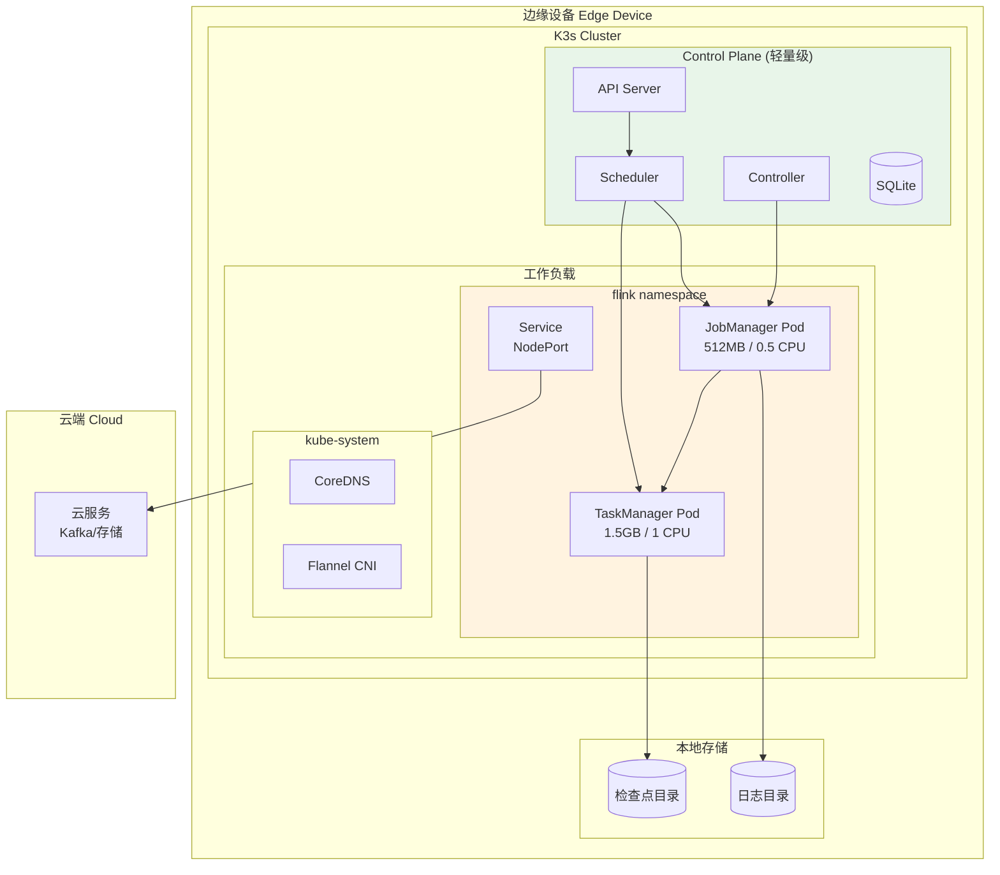
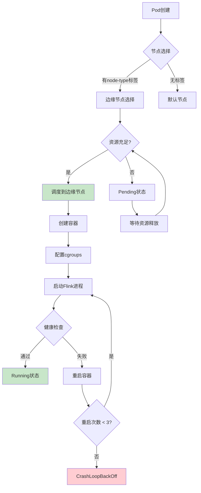
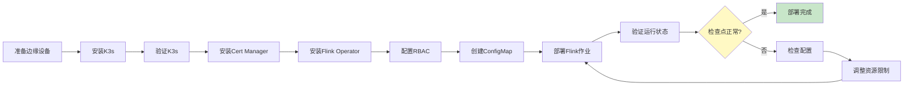

# Flink on K3s 边缘部署指南 (Flink Edge Kubernetes K3s Deployment)

> **所属阶段**: Flink/09-practices/09.05-edge | **前置依赖**: [Flink 边缘流处理完整指南](./flink-edge-streaming-guide.md), [K3s官方文档](https://docs.k3s.io/) | **形式化等级**: L3

---

## 目录

- [Flink on K3s 边缘部署指南 (Flink Edge Kubernetes K3s Deployment)](#flink-on-k3s-边缘部署指南-flink-edge-kubernetes-k3s-deployment)
  - [目录](#目录)
  - [1. 概念定义 (Definitions)](#1-概念定义-definitions)
    - [Def-F-09-05-05 (轻量级Kubernetes集群 Lightweight Kubernetes Cluster)](#def-f-09-05-05-轻量级kubernetes集群-lightweight-kubernetes-cluster)
    - [Def-F-09-05-06 (边缘K8s资源配额 Edge K8s Resource Quota)](#def-f-09-05-06-边缘k8s资源配额-edge-k8s-resource-quota)
    - [Def-F-09-05-07 (容器化流处理部署 Containerized Stream Processing Deployment)](#def-f-09-05-07-容器化流处理部署-containerized-stream-processing-deployment)
    - [Def-F-09-05-08 (节点亲和性调度 Node Affinity Scheduling)](#def-f-09-05-08-节点亲和性调度-node-affinity-scheduling)
  - [2. 属性推导 (Properties)](#2-属性推导-properties)
    - [Lemma-F-09-05-03 (K3s控制平面开销边界)](#lemma-f-09-05-03-k3s控制平面开销边界)
    - [Lemma-F-09-05-04 (Flink Operator资源收敛性)](#lemma-f-09-05-04-flink-operator资源收敛性)
    - [Prop-F-09-05-02 (Pod资源限制的传递性)](#prop-f-09-05-02-pod资源限制的传递性)
  - [3. 关系建立 (Relations)](#3-关系建立-relations)
    - [关系 1: K3s组件与资源占用的映射](#关系-1-k3s组件与资源占用的映射)
    - [关系 2: Flink部署模式与边缘场景的适配](#关系-2-flink部署模式与边缘场景的适配)
    - [关系 3: 资源配额与作业性能的量化关系](#关系-3-资源配额与作业性能的量化关系)
  - [4. 论证过程 (Argumentation)](#4-论证过程-argumentation)
    - [4.1 K3s架构的边缘适配设计](#41-k3s架构的边缘适配设计)
    - [4.2 Flink Kubernetes Operator部署模式](#42-flink-kubernetes-operator部署模式)
    - [4.3 资源限制下的调度优化](#43-资源限制下的调度优化)
    - [4.4 边缘场景的网络策略](#44-边缘场景的网络策略)
  - [5. 形式证明 / 工程论证 (Proof / Engineering Argument)](#5-形式证明--工程论证-proof--engineering-argument)
    - [Thm-F-09-05-02 (边缘K3s部署稳定性定理)](#thm-f-09-05-02-边缘k3s部署稳定性定理)
    - [工程推论 (Engineering Corollaries)](#工程推论-engineering-corollaries)
  - [6. 实例验证 (Examples)](#6-实例验证-examples)
    - [6.1 K3s集群搭建步骤](#61-k3s集群搭建步骤)
    - [6.2 Flink Kubernetes Operator部署](#62-flink-kubernetes-operator部署)
    - [6.3 FlinkDeployment CRD配置](#63-flinkdeployment-crd配置)
    - [6.4 资源限制调优实例](#64-资源限制调优实例)
    - [6.5 生产环境检查清单](#65-生产环境检查清单)
  - [7. 可视化 (Visualizations)](#7-可视化-visualizations)
    - [K3s+Flink边缘架构图](#k3sflink边缘架构图)
    - [Pod调度拓扑图](#pod调度拓扑图)
    - [部署流程图](#部署流程图)
  - [8. 引用参考 (References)](#8-引用参考-references)

---

## 1. 概念定义 (Definitions)

### Def-F-09-05-05 (轻量级Kubernetes集群 Lightweight Kubernetes Cluster)

**轻量级Kubernetes集群**（以K3s为代表）是专为资源受限环境设计的容器编排平台，形式化定义为：

$$
\mathcal{K}_{light} = (M_{control}, W_{node}, C_{container}, S_{storage}, N_{cni})
$$

| 组件 | K3s实现 | 资源占用 | 标准K8s对比 |
|------|---------|----------|-------------|
| $M_{control}$ | 集成控制平面 (API Server + Scheduler + Controller) | 512MB RAM, 1核CPU | ~2GB RAM |
| $W_{node}$ | Kubelet + Kube-proxy | 256MB RAM | ~500MB RAM |
| $C_{container}$ | containerd (默认) 或 Docker | 100MB基础 | 相同 |
| $S_{storage}$ | SQLite (默认) 或 etcd | 100MB | ~1GB |
| $N_{cni}$ | Flannel (默认) | 50MB | ~100MB |

**K3s资源占用汇总**：

| 部署模式 | 内存需求 | 存储需求 | 适用场景 |
|----------|----------|----------|----------|
| 单节点 (Server) | 512MB+ | 1GB+ | 边缘独立部署 |
| 单节点 + Agent | 1GB+ | 2GB+ | 多节点边缘集群 |
| 高可用 (HA) | 2GB+ | 4GB+ | 生产级边缘 [^1][^2] |

---

### Def-F-09-05-06 (边缘K8s资源配额 Edge K8s Resource Quota)

**边缘K8s资源配额**定义在资源受限节点上Pod的资源限制策略：

$$
\mathcal{Q}_{edge} = (R_{requests}, R_{limits}, R_{quota}, C_{priority}, A_{affinity})
$$

其中：

| 符号 | 语义 | 边缘推荐值 |
|------|------|-----------|
| $R_{requests}$ | 资源请求 (保证值) | CPU: 100m-500m, 内存: 256Mi-1Gi |
| $R_{limits}$ | 资源限制 (最大值) | CPU: 500m-2, 内存: 512Mi-4Gi |
| $R_{quota}$ | 命名空间配额 | 限制总资源消耗 |
| $C_{priority}$ | 优先级类 | system-node-critical > high > default |
| $A_{affinity}$ | 亲和性规则 | 节点选择、Pod反亲和 |

**资源计算公式**：

$$
R_{allocatable} = R_{total} - R_{system} - R_{k3s} - R_{reserved}
$$

其中边缘典型值：

- $R_{system}$: 操作系统占用 (约 512MB)
- $R_{k3s}$: K3s组件占用 (约 512MB)
- $R_{reserved}$: 系统保留 (约 256MB)

---

### Def-F-09-05-07 (容器化流处理部署 Containerized Stream Processing Deployment)

**容器化流处理部署**将Flink作业打包为容器镜像并在K8s上运行：

$$
\mathcal{D}_{container} = (I_{flink}, S_{pod}, V_{vol}, C_{config}, L_{lifecycle})
$$

| 组件 | 描述 | 边缘优化 |
|------|------|----------|
| $I_{flink}$ | Flink容器镜像 | 精简镜像，移除调试工具 |
| $S_{pod}$ | Pod规格定义 | 严格资源限制 |
| $V_{vol}$ | 存储卷配置 | hostPath本地存储 |
| $C_{config}$ | 配置管理 | ConfigMap + Secret |
| $L_{lifecycle}$ | 生命周期钩子 | 优雅关闭、健康检查 |

---

### Def-F-09-05-08 (节点亲和性调度 Node Affinity Scheduling)

**节点亲和性调度**根据节点标签将Pod调度到特定边缘节点：

$$
\mathcal{A}_{node} = (M_{required}, M_{preferred}, W_{weight}, T_{taint})
$$

**亲和性表达式**：

```yaml
affinity:
  nodeAffinity:
    requiredDuringSchedulingIgnoredDuringExecution:
      nodeSelectorTerms:
      - matchExpressions:
        - key: node-type
          operator: In
          values: ["edge-gateway"]
    preferredDuringSchedulingIgnoredDuringExecution:
    - weight: 100
      preference:
        matchExpressions:
        - key: hardware
          operator: In
          values: ["jetson", "rpi4"]
```

---

## 2. 属性推导 (Properties)

### Lemma-F-09-05-03 (K3s控制平面开销边界)

**陈述**：K3s单节点控制平面的资源开销存在上界：

$$
\begin{cases}
M_{k3s-server} \leq 512MB + n_{pods} \cdot 10MB \\
C_{k3s-server} \leq 0.5 + n_{pods} \cdot 0.01
\end{cases}
$$

其中 $n_{pods}$ 为节点上运行的Pod数量。

**实测数据** (Raspberry Pi 4, 4GB RAM)：

| Pod数量 | 内存占用 | CPU占用 | 响应延迟 |
|---------|----------|---------|----------|
| 0 (空载) | 380MB | 2% | <10ms |
| 5 | 450MB | 5% | <20ms |
| 10 | 520MB | 8% | <30ms |
| 20 | 680MB | 15% | <50ms |
| 30 | 850MB | 25% | <100ms |

---

### Lemma-F-09-05-04 (Flink Operator资源收敛性)

**陈述**：Flink Kubernetes Operator的资源消耗随管理的FlinkDeployment数量收敛：

$$
R_{operator}(n) = R_{base} + n \cdot R_{per-deployment}
$$

其中：

- $R_{base}$: 基础开销 (约 256MB 内存, 0.1 CPU)
- $R_{per-deployment}$: 每个FlinkDeployment开销 (约 50MB 内存, 0.02 CPU)

**收敛条件**：$n \leq \frac{R_{available} - R_{base}}{R_{per-deployment}}$

---

### Prop-F-09-05-02 (Pod资源限制的传递性)

**陈述**：Pod的资源限制会传递到容器进程，Flink进程需感知并适配：

$$
R_{flink-process} \leq R_{container-limit} \leq R_{pod-limit}
$$

**适配策略**：

| Flink组件 | 配置参数 | 与K8s限制关系 |
|-----------|----------|---------------|
| JobManager | jobmanager.memory.process.size | ≤ Pod内存限制 |
| TaskManager | taskmanager.memory.process.size | ≤ Pod内存限制 |
| 网络缓冲区 | taskmanager.memory.network.fraction | 按比例分配 |
| 托管内存 | taskmanager.memory.managed.fraction | 按比例分配 |

---

## 3. 关系建立 (Relations)

### 关系 1: K3s组件与资源占用的映射

| K3s组件 | 内存占用 | CPU占用 | 优化策略 |
|---------|----------|---------|----------|
| k3s-server | 300-500MB | 0.2-0.5核 | 单节点模式 |
| k3s-agent | 150-250MB | 0.1-0.3核 | 精简部署 |
| containerd | 100-200MB | 0.1-0.2核 | 使用默认配置 |
| flannel | 30-50MB | 0.05核 | VXLAN模式 |
| coredns | 50-100MB | 0.05核 | 缓存优化 |
| metrics-server | 50-100MB | 0.05核 | 可选禁用 |

### 关系 2: Flink部署模式与边缘场景的适配

| 部署模式 | 资源需求 | 适用边缘场景 | 限制 |
|----------|----------|--------------|------|
| **Application Mode** | 1 JobManager + N TaskManager | 常驻作业 | 资源消耗高 |
| **Session Mode** | 共享JobManager | 多小作业 | 隔离性弱 |
| **Per-Job Mode** | 独立集群 | 独立作业 | 启动慢(已废弃) |
| **Native K8s** | K8s集成 | 边缘推荐 | 需Operator |

### 关系 3: 资源配额与作业性能的量化关系

$$
T_{max} = f(C_{limit}, M_{limit}) = k \cdot \min\left(\frac{C_{limit}}{C_{per-task}}, \frac{M_{limit}}{M_{per-task}}\right)
$$

其中：

- $C_{per-task}$: 每个并行任务的CPU需求 (约 0.5核)
- $M_{per-task}$: 每个并行任务的内存需求 (约 1GB)
- $k$: 效率系数 (0.6-0.8)

---

## 4. 论证过程 (Argumentation)

### 4.1 K3s架构的边缘适配设计

**K3s vs 标准K8s 边缘适配对比**：

```
┌─────────────────────────────────────────────────────────────────┐
│  标准Kubernetes (资源消耗高，不适合边缘)                           │
│  ├─ etcd: 分布式键值存储 (~1GB内存)                               │
│  ├─ API Server: 独立进程 (~500MB内存)                             │
│  ├─ Controller Manager: 独立进程 (~300MB内存)                     │
│  ├─ Scheduler: 独立进程 (~200MB内存)                              │
│  ├─ kubelet: 节点代理 (~500MB内存)                                │
│  ├─ kube-proxy: 网络代理 (~200MB内存)                             │
│  └─ 总计: ~2.7GB内存                                              │
├─────────────────────────────────────────────────────────────────┤
│  K3s (轻量级，适合边缘)                                            │
│  ├─ 集成控制平面: 单进程 (API+Controller+Scheduler) (~300MB内存)   │
│  ├─ SQLite/etcd: 嵌入式存储 (~50MB内存)                           │
│  ├─ kubelet: 精简版 (~200MB内存)                                  │
│  ├─ kube-proxy: 简化版 (~100MB内存)                               │
│  ├─ containerd: 容器运行时 (~100MB内存)                           │
│  └─ 总计: ~750MB内存                                              │
└─────────────────────────────────────────────────────────────────┘
```

**K3s边缘优化特性**：

1. **单二进制文件**：所有组件打包为单个 <100MB 可执行文件
2. **SQLite支持**：默认使用SQLite替代etcd，降低存储开销
3. **内置组件**：Traefik ingress、CoreDNS、metrics-server内置
4. **ARM支持**：原生支持ARM64，适配Raspberry Pi、Jetson等

### 4.2 Flink Kubernetes Operator部署模式

**Flink on K8s 两种模式对比**：

| 特性 | Standalone模式 | Native K8s模式 |
|------|----------------|----------------|
| 部署复杂度 | 中 (手动管理Deployment) | 低 (Operator管理) |
| 资源效率 | 一般 | 高 (动态扩缩容) |
| 高可用性 | 需手动配置 | Operator自动处理 |
| 边缘适用性 | ✅ 简单场景 | ✅ 推荐 |
| 学习曲线 | 低 | 中 |

**Native K8s模式架构**：

```
┌─────────────────────────────────────────────┐
│         Flink Kubernetes Operator           │
│  ├─ 监听 FlinkDeployment CRD 变更           │
│  ├─ 创建/更新 JobManager Deployment         │
│  ├─ 创建/更新 TaskManager Deployment        │
│  ├─ 管理 ConfigMap (配置)                    │
│  ├─ 管理 Service (网络)                      │
│  └─ 管理 PVC (存储，可选)                     │
├─────────────────────────────────────────────┤
│           Kubernetes Cluster                │
│  ├─ JobManager Pod                          │
│  │   └─ Flink JobManager进程                │
│  ├─ TaskManager Pod(s)                      │
│  │   └─ Flink TaskManager进程               │
│  └─ Service (REST, JobManager RPC)          │
└─────────────────────────────────────────────┘
```

### 4.3 资源限制下的调度优化

**边缘节点资源规划示例** (4GB RAM, 4核CPU)：

```
总资源: 4GB RAM, 4核CPU
├─ 系统保留: 512MB, 0.5核
├─ K3s组件: 768MB, 1核
├─ 可用资源: 2.7GB, 2.5核
    ├─ Flink JobManager: 512MB, 0.5核
    ├─ Flink TaskManager: 1.5GB, 1.5核
    └─ 其他系统Pod: 700MB, 0.5核
```

**资源限制配置最佳实践**：

| 场景 | CPU限制 | 内存限制 | 说明 |
|------|---------|----------|------|
| 超轻量 | 500m | 1Gi | Raspberry Pi Zero |
| 轻量 | 1 | 2Gi | Raspberry Pi 4 |
| 标准 | 2 | 4Gi | NVIDIA Jetson Nano |
| 增强 | 4 | 8Gi | Intel NUC |

### 4.4 边缘场景的网络策略

**K3s网络模式选择**：

| 模式 | 资源占用 | 适用场景 | 边缘推荐 |
|------|----------|----------|----------|
| Flannel VXLAN | 低 | 通用 | ✅ 推荐 |
| Flannel host-gw | 最低 | 同网段 | ✅ 单节点 |
| Calico | 高 | 策略复杂 | ❌ 资源高 |
| Cilium | 高 | eBPF | ❌ 资源高 |

---

## 5. 形式证明 / 工程论证 (Proof / Engineering Argument)

### Thm-F-09-05-02 (边缘K3s部署稳定性定理)

**陈述**：在满足以下条件时，Flink on K3s边缘部署具有稳定性保证：

$$
\forall t \in [0, \infty):
\begin{cases}
\sum_{i} R_{pod_i}(t) \leq R_{allocatable} \\
R_{requests} \leq R_{limits} \cdot \alpha \quad (\alpha \leq 0.8) \\
\frac{dR_{usage}}{dt} \leq \beta \cdot R_{limits}
\end{cases}
$$

其中：

- $\alpha$: 资源利用率上限 (推荐 0.8)
- $\beta$: 资源增长速率限制

**证明**：

**步骤 1**: 建立资源模型

- K3s节点可分配资源 $R_{allocatable} = R_{total} - R_{system} - R_{k3s}$
- Pod资源请求 $R_{requests}$ 和限制 $R_{limits}$ 满足 $R_{requests} \leq R_{limits}$

**步骤 2**: 分析稳定性条件

- 当所有Pod的资源使用 $\sum R_{usage} \leq R_{allocatable}$ 时，系统不会触发OOM
- 设置 $R_{requests} \leq 0.8 \cdot R_{limits}$ 确保突发缓冲

**步骤 3**: 验证K8s调度保证

- K8s调度器保证已调度Pod的资源请求总和不超过节点容量
- 资源限制通过cgroups强制执行

**步骤 4**: 结论

- 满足上述条件时，Flink Pod不会抢占其他关键系统资源
- 即使Flink进程内存泄漏，也会被cgroups限制在 $R_{limits}$ 内
- 因此系统稳定 ∎

### 工程推论 (Engineering Corollaries)

**Cor-F-09-05-04 (边缘节点容量规划公式)**：

$$
N_{flink-pods} = \left\lfloor \frac{R_{node} - R_{system} - R_{k3s}}{R_{flink-pod}} \right\rfloor
$$

**Cor-F-09-05-05 (资源请求比例规则)**：

$$
R_{requests} = 0.6 \cdot R_{limits}, \quad \text{for edge deployments}
$$

**Cor-F-09-05-06 (检查点存储计算)**：

$$
V_{checkpoint} = \frac{S_{state} \cdot (1 + \delta_{incremental})}{N_{retain}}
$$

其中 $\delta_{incremental} = 0.2$ (增量检查点开销), $N_{retain} = 3$ (保留数量)

---

## 6. 实例验证 (Examples)

### 6.1 K3s集群搭建步骤

**步骤 1: 系统准备**

```bash
# 禁用swap (K3s要求)
sudo swapoff -a
sudo sed -i '/swap/d' /etc/fstab

# 配置内核参数
cat <<EOF | sudo tee /etc/sysctl.d/k3s.conf
net.bridge.bridge-nf-call-iptables = 1
net.ipv4.ip_forward = 1
EOF
sudo sysctl --system

# 安装必要工具
sudo apt-get update
sudo apt-get install -y curl
```

**步骤 2: 安装K3s Server (边缘主节点)**

```bash
# 单节点安装 (适合边缘独立部署)
curl -sfL https://get.k3s.io | \
  INSTALL_K3S_VERSION=v1.28.5+k3s1 \
  INSTALL_K3S_EXEC="server --disable traefik --write-kubeconfig-mode 644" \
  sh -

# 验证安装
sudo systemctl status k3s
sudo kubectl get nodes
sudo kubectl get pods -A

# 配置kubectl (非root用户)
mkdir -p ~/.kube
sudo cp /etc/rancher/k3s/k3s.yaml ~/.kube/config
sudo chown $(id -u):$(id -g) ~/.kube/config
export KUBECONFIG=~/.kube/config
```

**步骤 3: 添加K3s Agent (多节点场景)**

```bash
# 在主节点获取token
sudo cat /var/lib/rancher/k3s/server/node-token
# 输出示例: K10xxxxxxxxxxxxxxxxxxxxxxxxxxxxxxxxxxxxxxxxxxxxxxxxxx::server:xxxxxxxx

# 在Agent节点执行
export K3S_URL="https://<server-ip>:6443"
export K3S_TOKEN="<node-token>"
curl -sfL https://get.k3s.io | \
  INSTALL_K3S_VERSION=v1.28.5+k3s1 \
  sh -
```

**步骤 4: 边缘优化配置**

```bash
# 创建K3s配置文件
sudo mkdir -p /etc/rancher/k3s/
sudo tee /etc/rancher/k3s/config.yaml > /dev/null <<EOF
# 禁用不必要组件
disable:
  - traefik
  - metrics-server
  - servicelb

# 使用SQLite (默认) 或嵌入式etcd
tls-san:
  - edge-k3s-server.local

# 资源限制
kubelet-arg:
  - "eviction-hard=memory.available<100Mi"
  - "eviction-soft=memory.available<200Mi"
  - "eviction-soft-grace-period=memory.available=1m"
  - "system-reserved=cpu=500m,memory=512Mi"
  - "kube-reserved=cpu=500m,memory=512Mi"

# 日志轮转
log: /var/log/k3s.log
EOF

# 重启K3s
sudo systemctl restart k3s
```

### 6.2 Flink Kubernetes Operator部署

**步骤 1: 安装Cert Manager (依赖)**

```bash
# 安装cert-manager
kubectl apply -f https://github.com/cert-manager/cert-manager/releases/download/v1.13.0/cert-manager.yaml

# 等待就绪
kubectl wait --for=condition=ready pod -l app=cert-manager -n cert-manager --timeout=120s
```

**步骤 2: 安装Flink Kubernetes Operator**

```bash
# 添加Flink Helm仓库
helm repo add flink-operator-repo https://downloads.apache.org/flink/flink-kubernetes-operator-1.7.0/
helm repo update

# 创建命名空间
kubectl create namespace flink

# 安装Operator (边缘优化配置)
helm install flink-kubernetes-operator flink-operator-repo/flink-kubernetes-operator \
  --namespace flink \
  --set image.tag=1.7.0 \
  --set replicas=1 \
  --set resources.requests.cpu=200m \
  --set resources.requests.memory=256Mi \
  --set resources.limits.cpu=500m \
  --set resources.limits.memory=512Mi \
  --set defaultConfiguration.flink-conf."kubernetes.rest-service.exposed.type"=NodePort \
  --set defaultConfiguration.flink-conf."state.backend"=hashmap \
  --set defaultConfiguration.flink-conf."execution.checkpointing.interval"=60s

# 验证安装
kubectl get pods -n flink
kubectl get deployments -n flink
```

**步骤 3: 配置RBAC权限**

```yaml
# flink-rbac.yaml
apiVersion: v1
kind: ServiceAccount
metadata:
  name: flink-service-account
  namespace: flink
---
apiVersion: rbac.authorization.k8s.io/v1
kind: Role
metadata:
  name: flink-role
  namespace: flink
rules:
- apiGroups: [""]
  resources: ["pods", "configmaps", "services", "persistentvolumeclaims"]
  verbs: ["create", "delete", "get", "list", "patch", "update", "watch"]
- apiGroups: ["apps"]
  resources: ["deployments"]
  verbs: ["create", "delete", "get", "list", "patch", "update", "watch"]
---
apiVersion: rbac.authorization.k8s.io/v1
kind: RoleBinding
metadata:
  name: flink-role-binding
  namespace: flink
subjects:
- kind: ServiceAccount
  name: flink-service-account
  namespace: flink
roleRef:
  kind: Role
  name: flink-role
  apiGroup: rbac.authorization.k8s.io
```

```bash
kubectl apply -f flink-rbac.yaml
```

### 6.3 FlinkDeployment CRD配置

**边缘流处理作业部署配置**：

```yaml
# flink-edge-deployment.yaml
apiVersion: flink.apache.org/v1beta1
kind: FlinkDeployment
metadata:
  name: edge-iot-processor
  namespace: flink
spec:
  image: flink:1.18-scala_2.12
  flinkVersion: v1.18
  serviceAccount: flink-service-account

  # 作业模式: Application (推荐用于边缘)
  mode: native

  jobManager:
    resource:
      memory: "512m"
      cpu: 0.5
    replicas: 1
    # 边缘环境禁用高可用
    # 单点故障可接受

  taskManager:
    resource:
      memory: "1536m"
      cpu: 1.5
    replicas: 1

  podTemplate:
    spec:
      containers:
        - name: flink-main-container
          # 资源限制 (必须 >= resource配置)
          resources:
            requests:
              memory: "1536Mi"
              cpu: "1500m"
            limits:
              memory: "2Gi"
              cpu: "2"
          # 环境变量
          env:
            - name: TZ
              value: "Asia/Shanghai"
            - name: FLINK_ENV_JAVA_OPTS
              value: "-XX:+UseG1GC -XX:MaxRAMPercentage=75.0"
          # 本地存储卷 (用于检查点)
          volumeMounts:
            - name: checkpoint-volume
              mountPath: /opt/flink/checkpoints
            - name: flink-config
              mountPath: /opt/flink/conf
      volumes:
        - name: checkpoint-volume
          hostPath:
            path: /data/flink/checkpoints
            type: DirectoryOrCreate
        - name: flink-config
          configMap:
            name: flink-edge-config
      # 节点亲和性 (调度到边缘节点)
      affinity:
        nodeAffinity:
          requiredDuringSchedulingIgnoredDuringExecution:
            nodeSelectorTerms:
              - matchExpressions:
                  - key: node-type
                    operator: In
                    values:
                      - edge-gateway
      # 容忍边缘节点污点
      tolerations:
        - key: "edge"
          operator: "Equal"
          value: "true"
          effect: "NoSchedule"

  job:
    jarURI: local:///opt/flink/examples/streaming/StateMachineExample.jar
    parallelism: 2
    upgradeMode: savepoint
    state: running
```

**ConfigMap 配置**：

```yaml
# flink-edge-configmap.yaml
apiVersion: v1
kind: ConfigMap
metadata:
  name: flink-edge-config
  namespace: flink
data:
  flink-conf.yaml: |
    # =================================================================
    # Flink 边缘K8s部署配置
    # =================================================================

    # 基础配置
    jobmanager.rpc.address: localhost
    jobmanager.rpc.port: 6123
    jobmanager.memory.process.size: 512m
    taskmanager.memory.process.size: 1536m
    taskmanager.numberOfTaskSlots: 2
    parallelism.default: 2

    # 内存优化
    taskmanager.memory.managed.fraction: 0.2
    taskmanager.memory.network.fraction: 0.1
    taskmanager.memory.framework.heap.size: 128m
    taskmanager.memory.task.heap.size: 1024m

    # 检查点配置 (适应边缘存储)
    execution.checkpointing.interval: 60s
    execution.checkpointing.min-pause-between-checkpoints: 30s
    execution.checkpointing.max-concurrent-checkpoints: 1
    execution.checkpointing.externalized-checkpoint-retention: RETAIN_ON_CANCELLATION
    state.backend: hashmap
    state.checkpoints.dir: file:///opt/flink/checkpoints

    # 重启策略
    restart-strategy: fixed-delay
    restart-strategy.fixed-delay.attempts: 3
    restart-strategy.fixed-delay.delay: 10s

    # Kubernetes特定配置
    kubernetes.rest-service.exposed.type: NodePort
    kubernetes.pod-template-file: /opt/flink/conf/pod-template.yaml
    kubernetes.service-account: flink-service-account

    # 日志配置
    log4j.rootLogger: WARN, console
    log4j.logger.org.apache.flink: WARN
```

```bash
# 应用配置
kubectl apply -f flink-edge-configmap.yaml
kubectl apply -f flink-edge-deployment.yaml

# 查看部署状态
kubectl get flinkdeployments -n flink
kubectl get pods -n flink
kubectl logs -n flink deployment/edge-iot-processor
```

### 6.4 资源限制调优实例

**场景：Raspberry Pi 4 (4GB RAM) 边缘网关**

```yaml
# 节点资源规划
# 总内存: 4GB
# ├─ 系统: 512MB
# ├─ K3s: 768MB
# └─ Flink: 2GB
#     ├─ JobManager: 512MB
#     └─ TaskManager: 1.5GB

apiVersion: flink.apache.org/v1beta1
kind: FlinkDeployment
metadata:
  name: rpi4-edge-job
  namespace: flink
spec:
  image: flink:1.18-scala_2.12
  flinkVersion: v1.18
  mode: native

  jobManager:
    resource:
      memory: "512m"
      cpu: 0.5

  taskManager:
    resource:
      memory: "1536m"
      cpu: 1.0
    replicas: 1

  podTemplate:
    spec:
      containers:
        - name: flink-main-container
          resources:
            requests:
              memory: "512Mi"  # JM
              cpu: "500m"
            limits:
              memory: "2Gi"    # TM
              cpu: "1500m"
          env:
            - name: JAVA_OPTS
              value: "-XX:+UseG1GC -XX:MaxRAMPercentage=70"
```

**资源监控命令**：

```bash
# 查看Pod资源使用
kubectl top pods -n flink

# 查看节点资源
kubectl top nodes

# 查看Pod详细资源
kubectl describe pod -n flink -l app=edge-iot-processor

# 查看cgroups限制
docker stats $(docker ps -q --filter "name=k8s_flink")
```

### 6.5 生产环境检查清单

**K3s + Flink 边缘生产部署检查清单**：

| 类别 | 检查项 | 验收标准 | 检查命令 |
|------|--------|----------|----------|
| **K3s** | 单二进制运行 | `k3s`进程存在 | `ps aux \| grep k3s` |
| | 节点就绪 | Ready状态 | `kubectl get nodes` |
| | 系统Pod运行 | coredns等正常 | `kubectl get pods -n kube-system` |
| | 资源预留正确 | 可分配资源合理 | `kubectl describe node` |
| **Flink Operator** | Operator运行 | Pod状态Running | `kubectl get pods -n flink` |
| | CRD安装 | FlinkDeployment可用 | `kubectl get crd \| grep flink` |
| | Webhook配置 | 证书有效 | `kubectl get validatingwebhookconfiguration` |
| **Flink作业** | JobManager运行 | 1个Pod Running | `kubectl get pods -l component=jobmanager` |
| | TaskManager运行 | 指定数量Running | `kubectl get pods -l component=taskmanager` |
| | 服务暴露 | NodePort/SVC可访问 | `kubectl get svc -n flink` |
| | 检查点正常 | 最近检查点成功 | Flink Web UI |
| **资源** | CPU限制 | ≤ 节点70% | `kubectl top nodes` |
| | 内存限制 | ≤ 节点80% | `kubectl top pods` |
| | 磁盘空间 | 可用 ≥ 20% | `df -h` |
| | 网络带宽 | 延迟 < 100ms | `ping <cloud-server>` |
| **配置** | 检查点间隔 | 30s-5min | `flink-conf.yaml` |
| | 状态后端 | HashMap (小状态) | 配置确认 |
| | 重启策略 | 固定延迟3次 | 配置确认 |
| | 日志级别 | WARN | 配置确认 |
| **安全** | ServiceAccount | 已配置 | `kubectl get sa -n flink` |
| | RBAC权限 | 最小权限原则 | `kubectl get role -n flink` |
| | 非root运行 | securityContext配置 | Pod YAML |
| **监控** | 健康检查 | livenessProbe配置 | Pod YAML |
| | 指标暴露 | Prometheus端点 | `curl <pod>:9249/metrics` |
| | 告警规则 | CPU/内存告警 | PrometheusRule |

---

## 7. 可视化 (Visualizations)

### K3s+Flink边缘架构图



### Pod调度拓扑图



### 部署流程图



---

## 8. 引用参考 (References)

[^1]: Rancher Labs, "K3s Documentation", <https://docs.k3s.io/>

[^2]: Apache Flink, "Flink Kubernetes Operator", <https://nightlies.apache.org/flink/flink-kubernetes-operator-docs-stable/>
