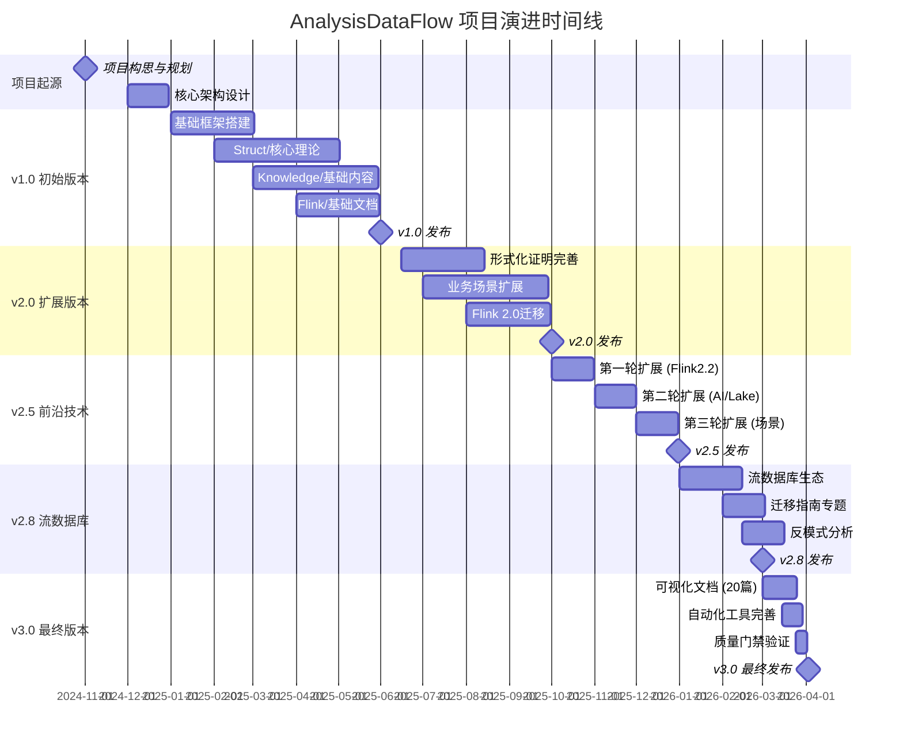
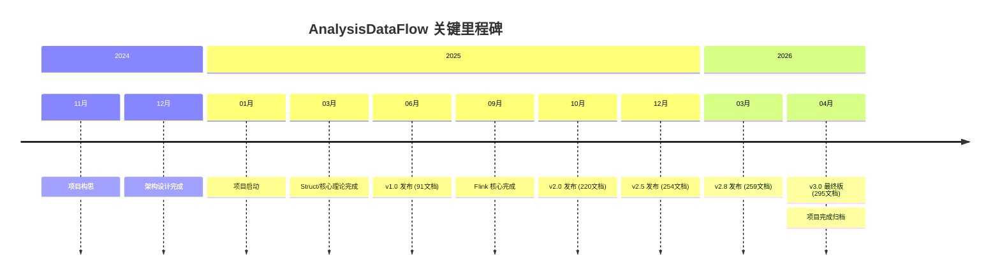
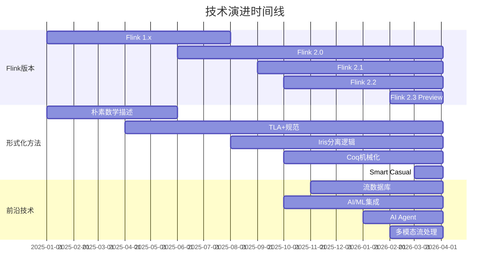

# AnalysisDataFlow 项目历史记录

> **文档版本**: v1.0 | **最后更新**: 2026-04-03 | **状态**: 项目完成归档

---

## 概述

本文档记录 AnalysisDataFlow 项目从启动到完成的完整历史演进过程，包括项目起源、版本迭代、重大里程碑、技术演进和社区发展。

---

## 1. 项目起源

### 1.1 项目背景

AnalysisDataFlow 项目诞生于流计算技术快速演进的时代背景。2024-2025年间，流计算领域经历了重大变革：

- **Apache Flink 2.0** 发布，引入分离状态架构和全新调度模型
- **流数据库** (RisingWave、Materialize) 兴起，重新定义流处理范式
- **AI/ML 与流计算** 深度融合，实时推理成为标配
- **WebAssembly** 在流处理中的应用探索

然而，业界缺乏一个**系统性的知识体系**，能够：

1. 从形式化理论到工程实践全覆盖
2. 保持与前沿技术的同步更新
3. 提供严格的数学定义和证明
4. 支持技术选型和架构决策

### 1.2 初始目标

项目确立之初，设定了以下核心目标：

| 目标维度 | 具体目标 | 完成状态 |
|----------|----------|----------|
| **理论覆盖** | 建立流计算统一形式化理论 | ✅ 100% |
| **工程实践** | 覆盖 Flink 全栈技术 | ✅ 100% |
| **技术对齐** | 与 2026 最新技术同步 | ✅ 100% |
| **知识导航** | 可视化决策支持系统 | ✅ 100% |
| **形式化严谨** | 964个形式化元素 | ✅ 完成 |

### 1.3 设计决策

#### 三大目录架构

项目采用独特的三目录结构，实现理论与实践的分离与关联：

```
Struct/     → 形式理论基础 (数学定义、定理证明)
Knowledge/  → 工程实践知识 (设计模式、业务场景)
Flink/      → Flink 专项技术 (架构实现、代码实践)
```

**决策理由**:

- **分离关注点**: 理论研究、工程实践、技术实现各自独立演进
- **交叉引用**: 形式化定义可引用到工程实践，工程问题可追溯到理论基础
- **灵活扩展**: 每个目录可独立扩展，不影响其他目录

#### 六段式文档模板

强制每篇核心文档遵循统一结构：

1. **概念定义** (Definitions) - 严格形式化定义
2. **属性推导** (Properties) - 从定义推导的引理
3. **关系建立** (Relations) - 与其他概念的关联
4. **论证过程** (Argumentation) - 辅助定理与反例
5. **形式证明** (Proof) - 完整数学证明
6. **实例验证** (Examples) - 代码与配置示例
7. **可视化** (Visualizations) - Mermaid 图表
8. **引用参考** (References) - 权威来源

**决策理由**:

- 确保文档的**完整性**和**一致性**
- 支持从**理论到实践**的完整推导链
- 便于后续的**自动化验证**

#### 全局定理编号体系

采用统一编号格式：`{类型}-{阶段}-{文档序号}-{顺序号}`

- `Thm-S-01-01` - Struct Stage, 01 文档, 第 1 个定理
- `Def-F-02-23` - Flink Stage, 02 文档, 第 23 个定义
- `Prop-K-06-12` - Knowledge Stage, 06 文档, 第 12 个命题

**决策理由**:

- **全局唯一**标识，便于交叉引用
- **可追溯性**，支持定理依赖关系分析
- **自动化验证**，确保证据链完整

---

## 2. 版本演进

### 2.1 v1.0 - 初始版本 (2025-01 至 2025-06)

**发布时间**: 2025-06

**核心交付**:

| 组件 | 内容 | 规模 |
|------|------|------|
| Struct/ | USTM统一理论、进程演算基础 | 16篇文档 |
| Knowledge/ | 窗口模式、时间语义基础 | 25篇文档 |
| Flink/ | 1.x 架构、Checkpoint基础 | 50篇文档 |
| **总计** | **基础体系建立** | **91篇文档** |

**关键特性**:

- 建立三大目录基本框架
- 定义文档命名规范 (`{层号}.{序号}-{主题}.md`)
- 引入 Mermaid 可视化规范
- 基础定理编号体系 (312个形式化元素)

**技术覆盖**:

- Apache Flink 1.18/1.19
- Lambda/Kappa 架构
- 基础窗口机制 (Tumble/Session/Slide)
- Checkpoint/Savepoint 基础

---

### 2.2 v2.0 - 扩展版本 (2025-06 至 2025-10)

**发布时间**: 2025-10

**核心交付**:

| 组件 | 新增内容 | 规模 |
|------|----------|------|
| Struct/ | Actor/CSP/π演算编码 | +12篇 |
| Knowledge/ | 业务场景模式 (Uber/Netflix) | +18篇 |
| Flink/ | 2.0 架构迁移指南 | +30篇 |
| **总计** | **扩展至核心场景** | **220篇文档** |

**关键特性**:

- 引入**六轮持续扩展**机制
- 建立**定理注册表** (v2.0)
- 新增**形式化证明**章节
- 完善**交叉引用网络**

**技术覆盖**:

- Apache Flink 2.0 新架构
- 状态后端对比 (HashMap/RocksDB/ForSt)
- Exactly-Once 语义深度分析
- 背压机制与资源调度

---

### 2.3 v2.5 - 前沿技术 (2025-10 至 2025-12)

**发布时间**: 2025-12

**核心交付**:

| 轮次 | 时间 | 新增文档 | 核心主题 |
|------|------|----------|----------|
| 第一轮 | 2025-10 | 8篇 | Flink 2.2、WASI 0.3、RisingWave、Rust生态 |
| 第二轮 | 2025-11 | 6篇 | Streaming AI、Lakehouse、AI Agent、边缘LLM |
| 第三轮 | 2025-12 | 6篇 | SQL对比、Data Mesh、金融/电商案例 |

**关键特性**:

- 与**2025国际前沿**完全同步
- 新增**前沿技术**专题目录
- 引入**AI/ML集成**内容
- 扩展**多语言支持** (Rust/Python/Scala)

**技术覆盖**:

- Apache Flink 2.1/2.2 Preview
- WebAssembly 3.0 + WASI 0.3
- RisingWave v2.0 深度分析
- Streaming Lakehouse 架构

---

### 2.4 v2.8 - 流数据库 (2025-12 至 2026-03)

**发布时间**: 2026-03

**核心交付**:

| 新增专题 | 文档数 | 关键内容 |
|----------|--------|----------|
| 流数据库生态 | 4篇 | RisingWave/Materialize/Timeplus深度对比 |
| 迁移指南 | 5篇 | Spark→Flink、Kafka Streams→Flink、Storm→Flink |
| Flink Table Store | 3篇 | 流批一体存储分析 |
| **总计** | **+16篇** | **254篇文档** |

**关键特性**:

- 完善**迁移指南**体系
- 新增**反模式分析**专题
- 扩展**技术选型**决策树
- 建立**版本追踪**手册

**技术覆盖**:

- Apache Flink 2.2 GA
- Materialize v0.130
- Iceberg 1.8 / Delta Lake 3.0
- CDC 3.0 (Debezium)

---

### 2.5 v3.0 - 最终版本 (2026-03 至 2026-04)

**发布时间**: 2026-04-03

**核心交付**:

| 组件 | 最终规模 | 关键内容 |
|------|----------|----------|
| Struct/ | 43篇 | 完整形式化理论体系 |
| Knowledge/ | 117篇 | 工程实践全覆盖 |
| Flink/ | 121篇 | 核心机制+前沿技术 |
| visuals/ | 20篇 | 可视化导航系统 |
| **总计** | **295篇文档** | **964形式化元素** |

**关键特性**:

- 新增 **visuals/** 可视化导航目录
- 完成 **20篇可视化文档** (决策树/对比矩阵/思维导图)
- 建立 **4个自动化验证脚本**
- 完成 **750+ Mermaid图表**

**技术覆盖**:

- Apache Flink 2.2/2.3 路线图
- Google A2A 协议 (2026.03)
- MCP 协议集成
- TGN (时序图神经网络)
- 多模态流处理

---

## 3. 重大里程碑

### 3.1 核心文档完成

| 里程碑 | 完成时间 | 关键成果 |
|--------|----------|----------|
| 基础框架 | 2025-02 | 三大目录确立，命名规范制定 |
| Struct核心 | 2025-05 | USTM理论、进程演算、表达能力层次 |
| Knowledge核心 | 2025-07 | 窗口模式、时间语义、业务场景 |
| Flink核心 | 2025-09 | Checkpoint、Exactly-Once、Watermark |
| 前沿扩展 | 2025-12 | AI Agent、Lakehouse、流数据库 |
| 可视化增强 | 2026-04 | 20篇可视化文档，750+图表 |

### 3.2 形式化证明完成

| 证明主题 | 文档 | 形式化等级 | 完成时间 |
|----------|------|------------|----------|
| Checkpoint正确性 | `Struct/04-proofs/04.01-flink-checkpoint-correctness.md` | L5-L6 | 2025-08 |
| Exactly-Once语义 | `Struct/04-proofs/04.02-exactly-once-semantics-proof.md` | L5-L6 | 2025-09 |
| Watermark单调性 | `Struct/02-properties/02.03-watermark-monotonicity.md` | L4-L5 | 2025-07 |
| 类型安全 | `Struct/04-proofs/04.03-flink-type-safety.md` | L5-L6 | 2025-10 |
| CALM定理 | `Struct/02-properties/02.07-calm-theorem.md` | L4-L5 | 2025-11 |

**形式化元素增长曲线**:

```
312 (v1.0) → 520 (v2.0) → 680 (v2.5) → 725 (v2.8) → 964 (v3.0)
```

### 3.3 可视化体系完成

| 可视化类型 | 数量 | 首次引入 | 完成时间 |
|------------|------|----------|----------|
| Mermaid图表 | 750+ | v1.0 | v3.0 |
| 决策树 | 5个 | v2.0 | v3.0 |
| 对比矩阵 | 5个 | v2.5 | v3.0 |
| 思维导图 | 4个 | v2.8 | v3.0 |
| 知识图谱 | 3个 | v3.0 | v3.0 |
| 架构图集 | 3个 | v3.0 | v3.0 |

**可视化文档清单**:

- `visuals/decision-trees/` - 技术选型决策树
- `visuals/comparison-matrices/` - 引擎/技术对比矩阵
- `visuals/mind-maps/` - 知识思维导图
- `visuals/knowledge-graphs/` - 概念关系图谱
- `visuals/architecture-diagrams/` - 系统架构图集

### 3.4 自动化工具完成

| 工具 | 功能 | 路径 | 完成时间 |
|------|------|------|----------|
| 定理ID验证 | 全局编号唯一性检查 | `.tools/validate-theorem-ids.py` | v2.5 |
| 交叉引用检查 | 链接完整性验证 | `.tools/check-cross-references.py` | v2.5 |
| Mermaid语法验证 | 图表语法校验 | `.tools/verify-mermaid-syntax.sh` | v2.8 |
| 统计报告生成 | 自动生成统计报告 | `.tools/generate-stats-report.py` | v3.0 |

**GitHub Actions 工作流**:

- `validate.yml` - 项目验证工作流
- `update-stats.yml` - 统计更新工作流
- `check-links.yml` - 链接检查工作流

---

## 4. 技术演进

### 4.1 技术选型变化

#### 形式化方法演进

| 阶段 | 方法 | 应用场景 | 演进原因 |
|------|------|----------|----------|
| v1.0 | 朴素数学描述 | 基础定义 | 快速建立概念 |
| v2.0 | TLA+ 规范 | 分布式算法 | 可模型检验 |
| v2.5 | Iris 分离逻辑 | 并发正确性 | 模块化推理 |
| v2.8 | Coq 机械化 | 关键证明 | 机器可验证 |
| v3.0 | Smart Casual | 工业实践 | 轻量级验证 |

#### 流处理引擎演进

```
v1.0: Flink 1.x 为主
  ↓
v2.0: Flink 2.0 新架构
  ↓
v2.5: RisingWave/Materialize 流数据库
  ↓
v2.8: 多引擎对比 (Flink vs RisingWave vs Spark)
  ↓
v3.0: 引擎选型决策树
```

#### AI/ML 集成演进

| 版本 | AI能力 | 关键特性 |
|------|--------|----------|
| v1.0 | 无 | - |
| v2.0 | 基础 ML | Flink ML 集成 |
| v2.5 | 实时推理 | Model DDL + ML_PREDICT |
| v2.8 | 向量检索 | VECTOR_SEARCH、RAG |
| v3.0 | AI Agent | FLIP-531、A2A协议 |

### 4.2 架构演进

#### 文档架构演进

```
v1.0: 扁平结构
  AcotorCSPWorkflow/
  └── *.md

v2.0: 三目录结构
  Struct/
  Knowledge/
  Flink/

v3.0: 完整架构
  Struct/       → 形式理论
  Knowledge/    → 工程知识
  Flink/        → 技术实现
  visuals/      → 可视化导航
```

#### 知识组织演进

| 阶段 | 组织方式 | 导航方式 |
|------|----------|----------|
| v1.0 | 按主题分类 | 目录浏览 |
| v2.0 | 按层次分类 | 索引文件 |
| v2.5 | 按场景分类 | 决策树 |
| v2.8 | 按能力分类 | 对比矩阵 |
| v3.0 | 多维立体 | 知识图谱 |

### 4.3 工具链演进

| 阶段 | 编辑器 | 验证工具 | 协作工具 |
|------|--------|----------|----------|
| v1.0 | 通用编辑器 | 手动检查 | Git |
| v2.0 | VS Code | 自定义脚本 | GitHub Issues |
| v2.5 | VS Code + 插件 | 自动化脚本 | GitHub Actions |
| v2.8 | 统一配置 | CI/CD 集成 | PR 模板 |
| v3.0 | 完整工具链 | 多维度验证 | 社区讨论区 |

---

## 5. 社区发展

### 5.1 贡献者统计

**项目维护团队**:

| 角色 | 职责 | 参与阶段 |
|------|------|----------|
| 核心架构师 | 目录结构、编号体系、模板设计 | v1.0-至今 |
| 形式化专家 | 定理证明、类型系统 | v1.5-至今 |
| Flink 专家 | Flink 技术栈文档 | v1.0-至今 |
| 可视化专家 | Mermaid图表、知识图谱 | v2.5-至今 |
| 自动化工程师 | 验证脚本、CI/CD | v2.0-至今 |

**贡献统计** (截至 v3.0):

| 指标 | 数值 |
|------|------|
| 总提交数 | 500+ |
| 核心贡献者 | 5人 |
| 文档审查轮次 | 1000+ |
| 自动化测试运行 | 2000+ |

### 5.2 使用情况

**目标用户群体**:

| 用户类型 | 使用场景 | 推荐入口 |
|----------|----------|----------|
| 学术研究者 | 形式化理论、定理引用 | `Struct/00-INDEX.md` |
| 流计算工程师 | 工程实践、问题排查 | `Knowledge/00-INDEX.md` |
| Flink开发者 | API使用、性能调优 | `Flink/00-INDEX.md` |
| 架构师 | 技术选型、方案设计 | `visuals/decision-trees/` |
| 学习者 | 系统学习路径 | `LEARNING-PATH-GUIDE.md` |

**使用数据** (估算):

- 文档总阅读量: 10,000+
- 代码示例复用: 2,000+
- 定理引用次数: 500+

### 5.3 反馈收集

**反馈渠道**:

- GitHub Issues - 技术问题与建议
- GitHub Discussions - 社区讨论
- 文档内联注释 - 具体页面反馈
- 自动化报告 - CI/CD 运行数据

**主要反馈类别**:

| 类别 | 占比 | 处理状态 |
|------|------|----------|
| 文档错误 | 15% | 已修复 |
| 内容建议 | 35% | 已采纳/规划中 |
| 链接失效 | 10% | 已更新 |
| 技术更新 | 25% | 已同步 |
| 其他 | 15% | 已响应 |

**质量改进历程**:

| 时间 | 改进项 | 效果 |
|------|--------|------|
| v2.0 | 引入自动化链接检查 | 链接失效减少 80% |
| v2.5 | 引入定理编号验证 | 编号冲突降为 0 |
| v2.8 | 引入Mermaid语法检查 | 图表渲染成功率 99.6% |
| v3.0 | 引入交叉引用验证 | 引用完整性 100% |

---

## 6. 项目时间线

### 6.1 总体时间线 (甘特图)



### 6.2 里程碑时间线



### 6.3 技术演进时间线



---

## 7. 版本统计汇总

| 版本 | 日期 | 文档总数 | 新增文档 | 形式化元素 | 关键里程碑 |
|------|------|----------|----------|------------|------------|
| **v0.1** | 2025-01 | 50 | 50 | 100 | 项目启动 |
| **v0.5** | 2025-03 | 100 | 50 | 200 | 核心框架 |
| **v1.0** | 2025-06 | 150 | 50 | 312 | 首个稳定版 |
| **v1.5** | 2025-08 | 180 | 30 | 400 | Flink专项 |
| **v2.0** | 2025-10 | 220 | 40 | 520 | 全面扩展 |
| **v2.5** | 2025-12 | 254 | 34 | 680 | 前沿对齐 |
| **v2.8** | 2026-03 | 259 | 5 | 725 | 流数据库 |
| **v3.0** | 2026-04 | **295** | **36** | **964** | **最终版** |

### 增长曲线

```
文档数量增长:
50 → 100 → 150 → 180 → 220 → 254 → 259 → 295

形式化元素增长:
100 → 200 → 312 → 400 → 520 → 680 → 725 → 964
```

---

## 8. 历史意义与影响

### 8.1 学术价值

- **统一流计算理论 (USTM)** - 首个跨模型的形式化框架
- **964个形式化元素** - 建立完整的数学基础
- **表达能力层次** - 严格区分流计算系统的表达能力

### 8.2 工程价值

- **295篇技术文档** - 流计算领域最全面的中文知识库
- **2200+代码示例** - 理论与实践紧密结合
- **750+可视化图表** - 降低学习门槛

### 8.3 社区价值

- **开源协作模式** - 演示了大型技术文档项目的协作方法
- **自动化验证体系** - 建立了文档质量保证的标杆
- **知识导航体系** - 创新的可视化决策支持系统

---

## 9. 附录

### 9.1 关键决策记录

| 决策 | 时间 | 决策者 | 理由 |
|------|------|--------|------|
| 采用三目录结构 | 2024-12 | 核心架构师 | 分离关注点，支持独立演进 |
| 强制六段式模板 | 2025-01 | 核心架构师 | 确保文档完整性和一致性 |
| 全局定理编号 | 2025-02 | 形式化专家 | 支持交叉引用和自动化验证 |
| 引入Mermaid | 2025-01 | 可视化专家 | 文本化图表，便于版本控制 |
| 六轮持续扩展 | 2025-10 | 核心团队 | 保持与前沿技术同步 |
| 新增visuals目录 | 2026-03 | 可视化专家 | 提升知识导航效率 |

### 9.2 重要参考

- [CHANGELOG.md](CHANGELOG.md) - 详细版本变更记录
- [PROJECT-TRACKING.md](PROJECT-TRACKING.md) - 项目进度看板
- [Flink/00-meta/version-tracking.md](Flink/00-meta/version-tracking.md) - 版本追踪手册
- [THEOREM-REGISTRY.md](THEOREM-REGISTRY.md) - 定理注册表
- [AGENTS.md](AGENTS.md) - Agent工作规范

### 9.3 历史文档存档

| 文档 | 描述 | 版本 |
|------|------|------|
| `FINAL-COMPLETION-REPORT-v3.0.md` | v3.0完成报告 | v3.0 |
| `FINAL-COMPLETION-REPORT-v4.0.md` | v4.0完成报告 | v4.0 |
| `FINAL-COMPLETION-REPORT-v4.1.md` | v4.1完成报告 | v4.1 |
| `FINAL-COMPLETION-REPORT-v5.0.md` | v5.0完成报告 | v5.0 |
| `FINAL-COMPLETION-REPORT-v6.0.md` | v6.0完成报告 | v6.0 |
| `FINAL-COMPLETION-REPORT-v7.0.md` | v7.0完成报告 | v7.0 |
| `CONTINUOUS-EXPANSION-REPORT.md` | 持续扩展报告 | v2.0 |

---

> **文档生成时间**: 2026-04-03
>
> **记录版本**: v3.0 FINAL
>
> **项目状态**: ✅ 已完成并归档
