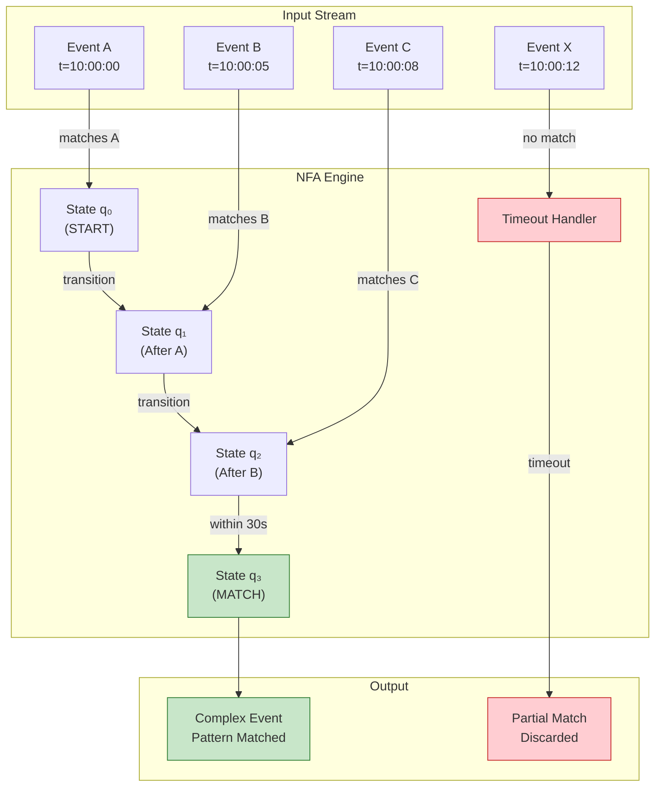
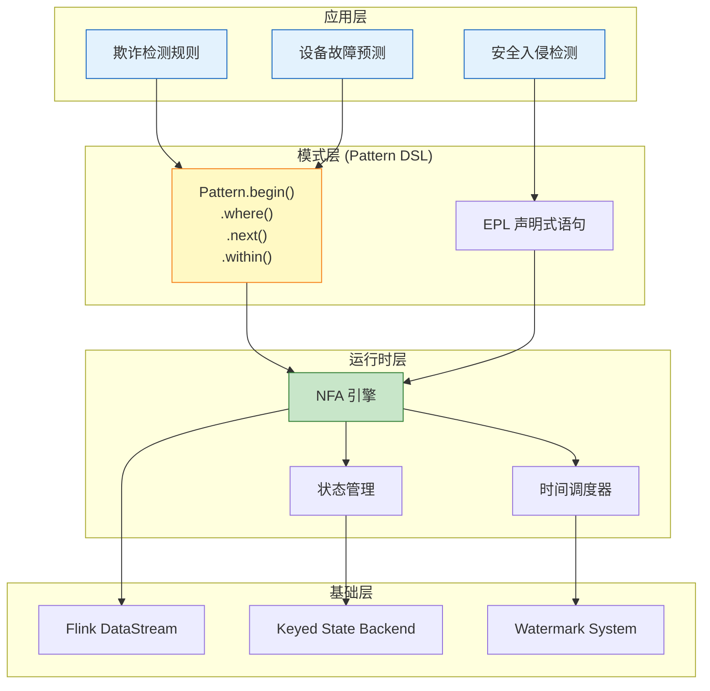

# 设计模式: 复杂事件处理 (Pattern: Complex Event Processing)

> **模式编号**: 03/7 | **所属系列**: Knowledge/02-design-patterns | **形式化等级**: L4-L5
>
> 本模式解决**低阶原始事件流**到**高阶业务语义事件**的实时识别与提取问题，提供基于模式匹配的声明式事件关联机制。

---

## 目录

- [设计模式: 复杂事件处理 (Pattern: Complex Event Processing)](#设计模式-复杂事件处理-pattern-complex-event-processing)
  - [目录](#目录)
  - [1. 问题与背景 (Problem / Context)](#1-问题与背景-problem--context)
    - [1.1 原始事件与业务语义之间的鸿沟](#11-原始事件与业务语义之间的鸿沟)
    - [1.2 时序关联的复杂性](#12-时序关联的复杂性)
    - [1.3 业务场景中的典型挑战](#13-业务场景中的典型挑战)
  - [2. 解决方案 (Solution)](#2-解决方案-solution)
    - [2.1 核心概念定义](#21-核心概念定义)
    - [2.2 模式匹配语义](#22-模式匹配语义)
    - [2.3 时间关联机制](#23-时间关联机制)
    - [2.4 CEP 系统架构](#24-cep-系统架构)
    - [2.5 模式结构图](#25-模式结构图)
  - [3. 实现示例 (Implementation)](#3-实现示例-implementation)
    - [3.1 Flink CEP 基础用法](#31-flink-cep-基础用法)
    - [3.2 时间约束与模式修饰符](#32-时间约束与模式修饰符)
    - [3.3 复杂模式组合](#33-复杂模式组合)
    - [3.4 Esper CEP 对比实现](#34-esper-cep-对比实现)
    - [3.5 性能优化策略](#35-性能优化策略)
  - [4. 适用场景 (When to Use)](#4-适用场景-when-to-use)
    - [4.1 推荐使用场景](#41-推荐使用场景)
    - [4.2 不推荐场景](#42-不推荐场景)
  - [6. 形式化保证 (Formal Guarantees)](#6-形式化保证-formal-guarantees)
    - [6.1 依赖的形式化定义](#61-依赖的形式化定义)
    - [6.2 满足的形式化性质](#62-满足的形式化性质)
    - [6.3 模式组合时的性质保持](#63-模式组合时的性质保持)
    - [6.4 边界条件与约束](#64-边界条件与约束)
    - [6.5 CEP 形式化语义](#65-cep-形式化语义)
  - [5. 相关模式 (Related Patterns)](#5-相关模式-related-patterns)
  - [7. 引用参考 (References)](#7-引用参考-references)

---

## 1. 问题与背景 (Problem / Context)

### 1.1 原始事件与业务语义之间的鸿沟

在流处理系统中，底层数据源产生的是**原始事件 (Raw Events)**，而业务决策需要基于**复合事件 (Complex Events)** 进行判断。这种语义层级差异表现为 [^1][^2]：

| 层级 | 事件类型 | 示例 | 处理复杂度 |
|------|---------|------|-----------|
| **L0** | 原子事件 (Atomic) | 传感器读数、单笔交易、单次点击 | 简单过滤/映射 |
| **L1** | 派生事件 (Derived) | 5分钟平均温度、用户会话窗口聚合 | 窗口聚合 |
| **L2** | 复合事件 (Complex) | 温度持续上升+振动异常 = 设备故障 | 多事件关联 |
| **L3** | 情境事件 (Situational) | 跨设备、跨时间、跨领域的业务情境 | 复杂推理 |

**形式化描述** [^3]：

设原始事件流为 $E_{raw} = \{e_1, e_2, \ldots, e_n\}$，其中每个事件 $e_i = (t_i, a_i, v_i)$ 包含时间戳、属性集和值。业务关注的复合事件 $E_{complex}$ 是原始事件的模式匹配结果：

$$
E_{complex} = \{ (e_{i_1}, e_{i_2}, \ldots, e_{i_k}) \mid \text{Pattern}(e_{i_1}, e_{i_2}, \ldots, e_{i_k}) = \text{true} \}
$$

其中 Pattern 是用户定义的事件序列约束条件。

### 1.2 时序关联的复杂性

CEP 的核心挑战在于处理事件之间的**时间关系** [^1][^4]：

```
┌─────────────────────────────────────────────────────────────────────────┐
│                      CEP 时间关联维度                                      │
├─────────────────────────────────────────────────────────────────────────┤
│                                                                         │
│  1. 顺序关系 (Sequence)                                                  │
│     └── 事件 A 必须在事件 B 之前发生:  A → B                             │
│     └── 严格顺序 (next):  A.next(B) 表示 A 后立即是 B                     │
│                                                                         │
│  2. 时间窗口 (Time Window)                                               │
│     └── 模式必须在指定时间内完成:  within(T)                             │
│     └── 相对时间约束:  B 发生在 A 之后 5 分钟内                           │
│                                                                         │
│  3. 逻辑组合 (Logic Composition)                                         │
│     └── 与 (AND):  A 和 B 都发生                                         │
│     └── 或 (OR):   A 或 B 发生                                          │
│     └── 非 (NOT):  A 发生后 B 未发生                                    │
│                                                                         │
│  4. 量词修饰 (Quantifiers)                                               │
│     └── 零或多次:  A*                                                    │
│     └── 一次或多次: A+                                                   │
│     └── 可选:       A?                                                   │
│     └── 重复 n 次:  A{n}                                                 │
│                                                                         │
│  5. 属性关联 (Correlation)                                               │
│     └── 同一用户:  userId(A) = userId(B)                                 │
│     └── 同一设备:  deviceId(A) = deviceId(B)                             │
│                                                                         │
└─────────────────────────────────────────────────────────────────────────┘
```

**时序约束的形式化** [^3]：

设事件序列 $\sigma = \langle e_1, e_2, \ldots, e_n \rangle$，其时间戳为 $\langle t_1, t_2, \ldots, t_n \rangle$。模式 $P$ 是时序约束的合取：

$$
P(\sigma) = \bigwedge_{i=1}^{n-1} \phi_i(e_i, e_{i+1}) \land \theta(t_n - t_1)
$$

其中 $\phi_i$ 是事件间的属性约束，$\theta$ 是总时间窗口约束。

### 1.3 业务场景中的典型挑战

**场景 1: 金融欺诈检测** [^5]

欺诈者通常采用多步骤攻击策略：

```
时间线:
═══════════════════════════════════════════════════════════════►

欺诈模式示例:
┌─────────────────────────────────────────────────────────────┐
│  步骤1: 登录异常地点  ──▶  步骤2: 修改支付密码  ──▶  步骤3: 大额转账  │
│  t=10:00:00            t=10:05:23              t=10:08:45   │
│  └──────────────────────┴────────────────────────┘          │
│         必须在 30 分钟内完成                                 │
│         且 IP 地址跨越 3 个时区                              │
└─────────────────────────────────────────────────────────────┘

正常模式对比:
┌─────────────────────────────────────────────────────────────┐
│  步骤1: 日常地点登录  ──▶  步骤2: 正常消费  ──▶  步骤3: 小额转账   │
│  t=09:00:00            t=12:30:00           t=18:00:00      │
│  时间跨度大，地点一致                                        │
└─────────────────────────────────────────────────────────────┘
```

若仅基于单事件阈值（如"单笔交易 > 10万元则告警"），会漏过分散的小额试探交易。

**场景 2: IoT 设备故障预测** [^6]

工业设备的故障往往伴随多传感器指标的协同异常：

| 传感器 | 正常范围 | 预警阈值 | 故障阈值 |
|-------|---------|---------|---------|
| 温度 | 20-60°C | > 70°C | > 85°C |
| 振动 | 0.1-2.0 mm/s | > 5.0 mm/s | > 10.0 mm/s |
| 电流 | 5-15 A | > 20 A | > 30 A |

**故障模式**: 温度持续上升（5分钟内从 50°C → 75°C）**且** 振动在 30 秒内出现尖峰（> 8 mm/s）→ 轴承磨损预警

仅用单指标阈值会产生大量误报（温度季节性波动），多指标时序关联可显著降低误报率。

**场景 3: 网络安全入侵检测** [^7]

APT (Advanced Persistent Threat) 攻击的特征是缓慢、多阶段的渗透：

```
攻击链 (Kill Chain):
═══════════════════════════════════════════════════════════════►

Reconnaissance ──▶ Weaponization ──▶ Delivery ──▶ Exploitation
  (扫描端口)        (制作木马)        (钓鱼邮件)      (漏洞利用)
      │                                                  │
      └──────────────────────────────────────────────────┘
                        可能跨越数天甚至数周
```

CEP 需要识别跨长时间窗口的事件关联，同时处理海量正常流量的噪声。

---

## 2. 解决方案 (Solution)

### 2.1 核心概念定义

**定义 1: 复杂事件 (Complex Event)** [^3][^8]

复杂事件是从原始事件流中通过模式匹配提取的高阶事件，定义为四元组：

$$
\text{CE} = (E_{constituents}, \phi_{pattern}, \Delta_{window}, a_{derived})
$$

其中：

- $E_{constituents}$: 构成此复杂事件的原子事件集合
- $\phi_{pattern}$: 匹配模式谓词
- $\Delta_{window}$: 时间窗口约束
- $a_{derived}$: 派生属性（如风险评分、置信度）

**定义 2: 模式 (Pattern)** [^3][^4]

模式是对事件序列的约束描述，定义为五元组：

$$
\mathcal{P} = (N, E_{NFA}, \Sigma_{predicates}, \Delta_{time}, C_{correlation})
$$

其中：

- $N$: NFA (非确定性有限自动机) 状态集合
- $E_{NFA}$: NFA 状态转移边
- $\Sigma_{predicates}$: 事件谓词字母表
- $\Delta_{time}$: 时间约束函数
- $C_{correlation}$: 事件关联条件

**定义 3: 模式匹配 (Pattern Matching)** [^3][^8]

模式匹配是从输入事件流中识别满足模式 $\mathcal{P}$ 的所有事件子序列的函数：

$$
\text{Match}: \text{Stream}(E) \times \mathcal{P} \to \mathcal{P}(\text{Seq}(E))
$$

其中 $\mathcal{P}(\text{Seq}(E))$ 表示事件序列的幂集。匹配结果满足：

$$
\forall \sigma \in \text{Match}(S, \mathcal{P}): \mathcal{P}(\sigma) = \text{true}
$$

### 2.2 模式匹配语义

**NFA-based 匹配引擎** [^4][^8]：

CEP 引擎通常将模式编译为 NFA，每个状态代表模式匹配的一个阶段：

```
模式: A → B → C (A 后接 B 后接 C)

NFA 表示:
                    ┌─────────────────────────────────────┐
                    │                                     │
    ┌──────┐   A    ┌──────┐   B    ┌──────┐   C    ┌──────┐
    │ q₀   │───────▶│ q₁   │───────▶│ q₂   │───────▶│ q₃   │
    │START │        │      │        │      │        │MATCH │
    └──────┘        └──────┘        └──────┘        └──────┘
       │                                              ▲
       │               ┌──────────────────────────────┘
       │               │  (若 B 不满足，匹配失败)
       │               │
       └───────────────┘  新事件到达，从 q₀ 开始匹配
```

**模式匹配算法复杂度** [^3]：

| 模式类型 | 时间复杂度 | 空间复杂度 | 说明 |
|---------|-----------|-----------|------|
| 简单顺序 (A→B) | $O(n)$ | $O(1)$ | 单次遍历 |
| Kleene 星号 (A*) | $O(n^2)$ | $O(n)$ | 需维护多个活跃匹配 |
| 交替 (A\|B) | $O(n \cdot |\mathcal{P}|)$ | $O(|\mathcal{P}|)$ | NFA 并行状态 |
| 带关联 (A→B, sameKey) | $O(n \cdot k)$ | $O(k)$ | $k$ 为 key 数量 |

### 2.3 时间关联机制

**时间窗口约束** [^1][^4]：

时间窗口定义了模式匹配的最大跨度，超过窗口的部分匹配将被丢弃：

$$
\text{Within}(\sigma, \Delta) \iff t_{last}(\sigma) - t_{first}(\sigma) \leq \Delta
$$

Flink CEP 提供两种窗口语义：

| 窗口类型 | API | 语义 |
|---------|-----|------|
| **连续窗口** | `.within(Time)` | 首尾事件时间差 ≤ 窗口 |
| **超时机制** | `.within(Time)` | 部分匹配超期清理 |

**时间模式修饰符** [^4][^8]：

```
┌─────────────────────────────────────────────────────────────────────────┐
│                      时间模式修饰符                                       │
├─────────────────────────────────────────────────────────────────────────┤
│                                                                         │
│  相对时间约束 (Relative Time)                                            │
│  ├── next: 紧接下一事件                                                  │
│  ├── followedBy: 之后任意事件（允许间隔）                                  │
│  └── followedByAny: 之后任意事件（非确定性选择）                           │
│                                                                         │
│  绝对时间约束 (Absolute Time)                                            │
│  ├── within(Time): 总时间窗口                                            │
│  ├── times(n): 恰好重复 n 次                                             │
│  ├── timesOrMore(n): 至少 n 次                                           │
│  └── optional(): 可选（零次或一次）                                       │
│                                                                         │
│  连续性修饰符 (Contiguity)                                               │
│  ├── strict: 严格连续，中间无其他事件                                      │
│  ├── relaxed: 松散连续，允许其他事件                                       │
│  └── non-deterministic: 非确定性松弛                                     │
│                                                                         │
└─────────────────────────────────────────────────────────────────────────┘
```

### 2.4 CEP 系统架构

**Flink CEP 架构** [^4][^8]：

```
┌─────────────────────────────────────────────────────────────────────────────┐
│                         Flink CEP 运行时架构                                 │
├─────────────────────────────────────────────────────────────────────────────┤
│                                                                             │
│  ┌──────────────┐    ┌──────────────┐    ┌──────────────┐    ┌───────────┐ │
│  │  Input       │───▶│  KeyBy       │───▶│  CEP         │───▶│  Output   │ │
│  │  Stream      │    │  (分区)       │    │  Operator    │    │  Stream   │ │
│  └──────────────┘    └──────────────┘    └──────┬───────┘    └───────────┘ │
│                                                 │                          │
│                        ┌────────────────────────┘                          │
│                        ▼                                                   │
│  ┌─────────────────────────────────────────────────────────────────────┐   │
│  │                        CEP Operator 内部                             │   │
│  │  ┌────────────┐  ┌────────────┐  ┌────────────┐  ┌────────────┐     │   │
│  │  │  NFA       │  │  Event     │  │  State     │  │  Timeout   │     │   │
│  │  │  Compiler  │  │  Buffer    │  │  Manager   │  │  Handler   │     │   │
│  │  │            │  │            │  │            │  │            │     │   │
│  │  │  模式编译   │  │  事件缓冲   │  │  NFA 状态   │  │  过期清理   │     │   │
│  │  │  为状态机   │  │  等待匹配   │  │  存储      │  │  超时匹配   │     │   │
│  │  └────────────┘  └────────────┘  └────────────┘  └────────────┘     │   │
│  └─────────────────────────────────────────────────────────────────────┘   │
│                                                                             │
└─────────────────────────────────────────────────────────────────────────────┘
```

**状态管理** [^4][^9]：

Flink CEP 使用 Keyed State 存储每个 key 的 NFA 状态：

```java
// 伪代码：CEP 状态存储
class CEPState {
    // 当前活跃的 NFA 状态集合
    List<NFAState> activeStates;

    // 部分匹配的事件序列
    List<PartialMatch> pendingMatches;

    // 超时时间戳管理
    PriorityQueue<Timestamp> timeoutQueue;
}
```

状态清理策略：

1. **完整匹配清理**: 模式成功匹配后，释放相关状态
2. **超时清理**: 超过 `.within()` 设置的时间窗口后，丢弃部分匹配
3. **Watermark 驱动**: 当 Watermark 推进超过部分匹配的最大可能完成时间

### 2.5 模式结构图

**CEP 模式匹配流程图**：



**CEP 系统层次结构**：



---

## 3. 实现示例 (Implementation)

### 3.1 Flink CEP 基础用法

**示例 1: 金融欺诈检测** [^5][^8]

```java
import org.apache.flink.cep.CEP;
import org.apache.flink.cep.PatternStream;
import org.apache.flink.cep.pattern.Pattern;
import org.apache.flink.cep.pattern.conditions.SimpleCondition;

// 定义欺诈检测模式：异地登录 → 修改密码 → 大额转账（30分钟内）
Pattern<TransactionEvent, ?> fraudPattern = Pattern
    .<TransactionEvent>begin("login")
    .where(new SimpleCondition<TransactionEvent>() {
        @Override
        public boolean filter(TransactionEvent event) {
            return event.getEventType().equals("LOGIN")
                && event.getRiskLevel() > 0.5;  // 异常地点登录
        }
    })
    .next("passwordChange")
    .where(new SimpleCondition<TransactionEvent>() {
        @Override
        public boolean filter(TransactionEvent event) {
            return event.getEventType().equals("PASSWORD_CHANGE");
        }
    })
    .next("largeTransfer")
    .where(new SimpleCondition<TransactionEvent>() {
        @Override
        public boolean filter(TransactionEvent event) {
            return event.getEventType().equals("TRANSFER")
                && event.getAmount() > 100000;  // 超过10万
        }
    })
    .within(Time.minutes(30));  // 30分钟时间窗口

// 应用模式到流
PatternStream<TransactionEvent> patternStream = CEP.pattern(
    transactionStream.keyBy(TransactionEvent::getUserId),  // 按用户分区
    fraudPattern
);

// 处理匹配结果
DataStream<AlertEvent> alerts = patternStream
    .process(new PatternProcessFunction<TransactionEvent, AlertEvent>() {
        @Override
        public void processMatch(
            Map<String, List<TransactionEvent>> match,
            Context ctx,
            Collector<AlertEvent> out) {

            TransactionEvent login = match.get("login").get(0);
            TransactionEvent passwordChange = match.get("passwordChange").get(0);
            TransactionEvent transfer = match.get("largeTransfer").get(0);

            // 计算风险评分
            double riskScore = calculateRiskScore(login, passwordChange, transfer);

            out.collect(new AlertEvent(
                transfer.getUserId(),
                "FRAUD_SUSPECTED",
                riskScore,
                System.currentTimeMillis()
            ));
        }
    });
```

**示例 2: IoT 设备故障检测** [^6][^9]

```java
// 定义设备故障模式：高温 → 振动尖峰（30秒内）
Pattern<SensorEvent, ?> failurePattern = Pattern
    .<SensorEvent>begin("highTemp")
    .where(new SimpleCondition<SensorEvent>() {
        @Override
        public boolean filter(SensorEvent event) {
            return event.getSensorType().equals("TEMPERATURE")
                && event.getValue() > 80;  // 温度超过80度
        }
    })
    .followedBy("vibrationSpike")
    .where(new SimpleCondition<SensorEvent>() {
        @Override
        public boolean filter(SensorEvent event) {
            return event.getSensorType().equals("VIBRATION")
                && event.getValue() > 10;  // 振动超过10mm/s
        }
    })
    .within(Time.seconds(30));

// 应用模式
PatternStream<SensorEvent> patternStream = CEP.pattern(
    sensorStream.keyBy(SensorEvent::getDeviceId),
    failurePattern
);

// 输出故障告警
DataStream<FailureAlert> failures = patternStream
    .process(new PatternProcessFunction<SensorEvent, FailureAlert>() {
        @Override
        public void processMatch(
            Map<String, List<SensorEvent>> match,
            Context ctx,
            Collector<FailureAlert> out) {

            SensorEvent tempEvent = match.get("highTemp").get(0);
            SensorEvent vibEvent = match.get("vibrationSpike").get(0);

            out.collect(new FailureAlert(
                tempEvent.getDeviceId(),
                "BEARING_WEAR",
                "High temperature followed by vibration spike",
                ctx.timestamp()
            ));
        }
    });
```

### 3.2 时间约束与模式修饰符

**示例 3: 使用量词修饰符** [^8]

```java
// 模式：连续3次登录失败，然后成功登录（可能是暴力破解）
Pattern<LoginEvent, ?> bruteForcePattern = Pattern
    .<LoginEvent>begin("failedLogins")
    .where(new SimpleCondition<LoginEvent>() {
        @Override
        public boolean filter(LoginEvent event) {
            return !event.isSuccess();
        }
    })
    .times(3)  // 恰好3次
    .consecutive()  // 必须连续
    .next("successLogin")
    .where(new SimpleCondition<LoginEvent>() {
        @Override
        public boolean filter(LoginEvent event) {
            return event.isSuccess();
        }
    })
    .within(Time.minutes(5));

// 模式：设备离线后1小时内重新上线（网络抖动 vs 真正故障）
Pattern<DeviceEvent, ?> networkGlitchPattern = Pattern
    .<DeviceEvent>begin("offline")
    .where(evt -> evt.getStatus().equals("OFFLINE"))
    .followedBy("online")
    .where(evt -> evt.getStatus().equals("ONLINE"))
    .within(Time.hours(1));
```

**示例 4: 使用 followedByAny 处理非确定性** [^8]

```java
// 模式：A 后跟 B，但 A 可能有多个后续 B 候选（贪婪匹配）
Pattern<Event, ?> greedyPattern = Pattern
    .<Event>begin("start")
    .where(evt -> evt.getType().equals("START"))
    .followedByAny("middle")  // 非确定性：选择所有可能的匹配
    .where(evt -> evt.getType().equals("MIDDLE"))
    .followedBy("end")
    .where(evt -> evt.getType().equals("END"))
    .within(Time.minutes(10));
```

### 3.3 复杂模式组合

**示例 5: 使用 AND / OR 组合** [^8]

```java
// 复合条件：同一设备上温度高 或 压力高，然后停机
Pattern<AlarmEvent, ?> shutdownPattern = Pattern
    .<AlarmEvent>begin("alarm")
    .where(new SimpleCondition<AlarmEvent>() {
        @Override
        public boolean filter(AlarmEvent event) {
            return event.getSeverity().equals("HIGH");
        }
    })
    .or(new SimpleCondition<AlarmEvent>() {
        @Override
        public boolean filter(AlarmEvent event) {
            return event.getType().equals("TEMPERATURE_ALARM")
                && event.getValue() > 100;
        }
    })
    .next("shutdown")
    .where(evt -> evt.getType().equals("SHUTDOWN"))
    .within(Time.minutes(5));
```

**示例 6: 使用侧输出处理超时** [^4][^9]

```java
// 定义输出标签用于捕获超时事件
OutputTag<String> timeoutTag = new OutputTag<String>("timeout"){};

// 处理模式匹配和超时
PatternStream<Event> patternStream = CEP.pattern(stream, pattern);

DataStream<ComplexEvent> result = patternStream
    .process(new PatternProcessFunction<Event, ComplexEvent>() {
        @Override
        public void processMatch(
            Map<String, List<Event>> match,
            Context ctx,
            Collector<ComplexEvent> out) {
            // 正常匹配处理
            out.collect(new ComplexEvent(match, "MATCHED"));
        }

        @Override
        public void processTimedOutMatch(
            Map<String, List<Event>> match,
            Context ctx) {
            // 超时匹配处理
            ctx.output(timeoutTag, "Pattern timed out: " + match);
        }
    });

// 获取超时事件流
DataStream<String> timeouts = result.getSideOutput(timeoutTag);
```

### 3.4 Esper CEP 对比实现

**Esper 声明式 EPL (Event Processing Language)** [^10]：

Esper 使用类 SQL 的声明式语言定义模式：

```sql
-- 示例 1: 金融欺诈检测（对应 Flink 示例 1）
SELECT *
FROM pattern [
    every a=LoginEvent(riskLevel > 0.5)
    -> b=PasswordChangeEvent(userId = a.userId)
    -> c=TransferEvent(userId = a.userId, amount > 100000)
    WHERE timer:within(30 minutes)
];

-- 示例 2: IoT 故障检测（对应 Flink 示例 2）
SELECT *
FROM pattern [
    every a=SensorEvent(sensorType='TEMPERATURE', value > 80)
    -> b=SensorEvent(sensorType='VIBRATION', value > 10, deviceId = a.deviceId)
    WHERE timer:within(30 seconds)
];

-- 示例 3: 复杂统计模式（Esper 独有优势）
SELECT userId, count(*), avg(amount)
FROM TransactionEvent.win:time(5 minutes)
GROUP BY userId
HAVING count(*) > 10 AND avg(amount) > 5000;
```

**Flink CEP vs Esper 对比** [^8][^10]：

| 特性 | Flink CEP | Esper |
|-----|-----------|-------|
| **部署模式** | 分布式流处理 | 嵌入式/独立服务 |
| **数据规模** | 大规模 (TB/小时) | 中小规模 (GB/小时) |
| **延迟** | 秒级 | 毫秒级 |
| **状态管理** | 分布式状态后端 | 本地内存/数据库 |
| **容错** | Exactly-Once Checkpoint | 依赖外部存储 |
| **表达能力** | 中等 (基于 NFA) | 强 (完整 EPL) |
| **学习曲线** | 陡峭（需懂 Flink） | 平缓（类 SQL） |
| **生态集成** | 与 Flink 生态深度集成 | 独立系统 |

### 3.5 性能优化策略

**优化 1: 尽早过滤减少候选事件** [^4][^9]

```java
// 优化前：所有事件都进入 CEP 引擎
Pattern<Event, ?> unoptimized = Pattern
    .<Event>begin("start")
    .where(evt -> true)  // 接受所有事件
    .next("middle")
    .where(evt -> evt.getType().equals("IMPORTANT"));

// 优化后：先过滤再进入 CEP
DataStream<Event> filtered = eventStream
    .filter(evt -> evt.getType().equals("IMPORTANT")
        || evt.getType().equals("START"));

Pattern<Event, ?> optimized = Pattern
    .<Event>begin("start")
    .where(evt -> evt.getType().equals("START"))
    .next("middle")
    .where(evt -> evt.getType().equals("IMPORTANT"));
```

**优化 2: 合理设置时间窗口** [^9]

```java
// 窗口过小：可能错过有效匹配
.within(Time.seconds(5))   // 太紧张

// 窗口过大：状态积压，内存压力
.within(Time.hours(24))    // 太宽松

// 推荐：基于业务分析确定
.within(Time.minutes(30))  // 平衡延迟和内存
```

**优化 3: 使用 RocksDB 状态后端** [^9]

```java
// 大状态 CEP 作业必须使用 RocksDB
env.setStateBackend(new EmbeddedRocksDBStateBackend(true));

// 配置状态 TTL 自动清理
StateTtlConfig ttlConfig = StateTtlConfig
    .newBuilder(Time.hours(1))
    .setUpdateType(StateTtlConfig.UpdateType.OnCreateAndWrite)
    .setStateVisibility(StateTtlConfig.StateVisibility.NeverReturnExpired)
    .cleanupIncrementally(10, true)
    .build();
```

**优化 4: 模式去重减少 NFA 分支** [^8]

```java
// 低效：模糊的后续条件导致 NFA 爆炸
Pattern<Event, ?> inefficient = Pattern
    .<Event>begin("a")
    .where(evt -> evt.getType().equals("A"))
    .followedBy("b")
    .where(evt -> evt.getValue() > 0)  // 太宽泛
    .followedBy("c")
    .where(evt -> evt.getValue() > 0);

// 高效：精确的过滤条件
Pattern<Event, ?> efficient = Pattern
    .<Event>begin("a")
    .where(evt -> evt.getType().equals("A"))
    .followedBy("b")
    .where(evt -> evt.getType().equals("B") && evt.getValue() > 100)
    .followedBy("c")
    .where(evt -> evt.getType().equals("C"));
```

---

## 4. 适用场景 (When to Use)

### 4.1 推荐使用场景

| 场景 | 典型模式 | CEP 优势 | 配置建议 |
|------|---------|---------|---------|
| **实时欺诈检测** [^5] | 登录→密码修改→转账 | 识别多步攻击链 | 30min 窗口，按用户分区 |
| **IoT 设备故障预测** [^6] | 多传感器协同异常 | 降低单指标误报 | 30s-5min 窗口，按设备分区 |
| **网络安全入侵检测** [^7] | 扫描→渗透→窃取 | 跨长窗口关联 | 1-24h 窗口，按 IP 分区 |
| **业务流程监控** | 订单→支付→发货 | SLA 超时告警 | 按订单分区，带超时处理 |
| **金融交易监控** | 价格异动序列 | 识别市场操纵 | 秒级窗口，按标的分区 |
| **供应链异常检测** | 延迟→库存预警 | 多维度关联 | 按仓库/供应商分区 |

**Flink CEP 选型决策树** [^8]：

```
开始评估
    │
    ▼
┌─────────────────────────┐
│ 数据量 > 100K events/s? │──是──▶ Flink CEP 是最佳选择
└─────────────────────────┘──否──▶ 继续
    │
    ▼
┌─────────────────────────┐
│ 需要分布式容错?          │──是──▶ Flink CEP 是最佳选择
└─────────────────────────┘──否──▶ 继续
    │
    ▼
┌─────────────────────────┐
│ 延迟要求 < 100ms?        │──是──▶ 考虑 Esper 或原生实现
└─────────────────────────┘──否──▶ 继续
    │
    ▼
┌─────────────────────────┐
│ 模式复杂度极高?          │──是──▶ 考虑 Esper（EPL 更强大）
└─────────────────────────┘──否──▶ Flink CEP 足够
```

### 4.2 不推荐场景

| 场景 | 理由 | 替代方案 |
|------|------|---------|
| **简单阈值告警** | CEP 引入不必要的复杂度 | 直接 Filter + 窗口聚合 |
| **极低延迟 (<50ms)** | NFA 匹配有固定开销 | 状态机原生实现 |
| **无时间约束的关联** | 无限窗口导致状态膨胀 | 会话窗口 + 超时清理 |
| **纯统计分析** | CEP 不擅长聚合计算 | SQL/Table API |
| **跨长周期的复杂推理** | 状态维护成本过高 | 规则引擎 (Drools) |

**性能边界** [^8][^9]：

```
┌─────────────────────────────────────────────────────────────────┐
│                    Flink CEP 性能边界                            │
├─────────────────────────────────────────────────────────────────┤
│                                                                 │
│  单并行度吞吐: 5,000 - 50,000 events/s (取决于模式复杂度)          │
│  典型延迟: 100ms - 5s (含窗口等待)                               │
│  最大模式长度: 10-20 个步骤 (避免 NFA 状态爆炸)                    │
│  推荐窗口大小: < 1 小时 (状态管理开销)                            │
│  最大 Key 数量: 取决于状态后端 (RocksDB 支持 TB 级)                │
│                                                                 │
└─────────────────────────────────────────────────────────────────┘
```

---

## 6. 形式化保证 (Formal Guarantees)

本节建立 CEP 复杂事件处理模式与 Struct/ 理论层的形式化连接。

### 6.1 依赖的形式化定义

| 定义编号 | 名称 | 来源 | 在本模式中的作用 |
|----------|------|------|-----------------|
| Def-S-04-04 | Watermark 语义 | Struct/01.04 | 定义 CEP 时间窗口的进度边界 |
| **Def-S-08-04** | Exactly-Once 语义 | Struct/02.02 | 复杂事件输出因果影响计数 = 1 |
| **Def-S-10-01** | 安全性 (Safety) | Struct/02.04 | 模式匹配不会产生假阳性 (可通过有限执行验证) |
| **Def-S-10-02** | 活性 (Liveness) | Struct/02.04 | 有效模式最终会被检测到 (在公平性假设下) |

### 6.2 满足的形式化性质

| 定理/引理编号 | 名称 | 来源 | 保证内容 |
|---------------|------|------|----------|
| Thm-S-09-01 | Watermark 单调性定理 | Struct/02.03 | CEP 时间窗口不会重复触发 |
| Lemma-S-04-02 | Watermark 单调性引理 | Struct/01.04 | NFA 状态机的事件时间推进保持单调 |
| **Thm-S-03-01** | Actor 局部确定性定理 | Struct/01.03 | Keyed CEP 状态更新串行化，保证局部确定性 |
| Thm-S-17-01 | Checkpoint 一致性定理 | Struct/04.01 | CEP NFA 状态快照的一致性保证 |

### 6.3 模式组合时的性质保持

**CEP + Event Time 组合**：

- Watermark 单调性保证模式匹配的时间边界确定
- 迟到数据通过侧输出隔离，不影响已匹配结果

**CEP + Stateful Computation 组合**：

- NFA 状态使用 Keyed State 实现，满足 Thm-S-03-01 的局部确定性
- Checkpoint 机制保证 NFA 状态恢复的一致性

**CEP + Windowed Aggregation 组合**：

- 窗口聚合结果可作为 CEP 的原子事件输入
- 窗口触发事件时间戳作为 CEP 的时序基准

### 6.4 边界条件与约束

| 约束条件 | 形式化描述 | 违反后果 |
|----------|-----------|----------|
| 模式窗口有界 | within(Δ), Δ < ∞ | 无限窗口导致状态膨胀 |
| NFA 状态有限 | 活跃匹配数 ≤ C_max | 状态爆炸，内存耗尽 |
| 事件时间有序 | t_e(e_i) ≤ t_e(e_{i+1}) + δ | 严重乱序导致模式漏检 |
| Key 分区一致性 | hash(k) mod parallelism 固定 | Key 漂移导致状态丢失 |

### 6.5 CEP 形式化语义

CEP 模式匹配可形式化为**时序正则表达式**的求值问题：

$$
\mathcal{L}(\mathcal{P}) = \{ \sigma \in \text{Stream}(E) \mid \sigma \models \mathcal{P} \}
$$

其中 $\mathcal{P}$ 为模式，$\sigma$ 为事件序列，$\models$ 为满足关系。

**NFA 编码保持性**：

- 模式 $\mathcal{P}$ 编译为 NFA $N_{\mathcal{P}}$
- $N_{\mathcal{P}}$ 接受的语言等于 $\mathcal{L}(\mathcal{P})$
- Checkpoint 捕获 NFA 状态，保证恢复后语言等价

---

## 5. 相关模式 (Related Patterns)

| 模式 | 关系 | 说明 |
|------|------|------|
| **Pattern 01: Event Time Processing** | 依赖 | CEP 时间窗口依赖 Event Time 语义保证正确性 [^4][^11] |
| **Pattern 02: Stateful Computation** | 依赖 | CEP NFA 状态使用 Keyed State 实现 [^9][^12] |
| **Pattern 04: Async I/O Enrichment** | 配合 | 复杂事件可能需要异步查询外部上下文 [^5][^6] |
| **Pattern 05: Windowed Aggregation** | 前置 | CEP 通常作用于窗口聚合后的派生事件流 |
| **Pattern 06: Side Output Pattern** | 配合 | 未匹配事件或超时事件通过侧输出隔离处理 [^4][^9] |
| **Pattern 07: Checkpoint & Recovery** | 依赖 | CEP 状态恢复依赖 Checkpoint 机制 [^11][^13] |

**与 Flink 生态的集成** [^4][^8]：

```
┌─────────────────────────────────────────────────────────────────────┐
│                     Flink CEP 在生态中的位置                         │
├─────────────────────────────────────────────────────────────────────┤
│                                                                     │
│  Kafka/Pulsar ──▶ DataStream API ──▶ CEP.pattern() ──▶ Sink        │
│                        │                │                           │
│                        ▼                ▼                           │
│                  Window/Join ──▶  PatternStream                     │
│                        │                │                           │
│                        ▼                ▼                           │
│                  KeyedProcess ──▶  Alert/Action                     │
│                                                                     │
│  相关 Flink 组件:                                                    │
│  - [Flink/02-core-mechanisms/time-semantics-and-watermark.md]       │
│  - [Flink/02-core-mechanisms/checkpoint-mechanism-deep-dive.md]     │
│  - [Flink/07-case-studies/case-iot-stream-processing.md]            │
│  - [Flink/05-vs-competitors/flink-vs-spark-streaming.md]            │
│                                                                     │
└─────────────────────────────────────────────────────────────────────┘
```

**与理论模型的关系** [^3][^14]：

CEP 模式匹配可形式化为**时序正则表达式 (Temporal Regular Expressions)** 的求值问题：

$$
\mathcal{L}(\mathcal{P}) = \{ \sigma \in \text{Stream}(E) \mid \sigma \models \mathcal{P} \}
$$

这与 [Struct/01-foundation/01.04-dataflow-model-formalization.md](../../Struct/01-foundation/01.04-dataflow-model-formalization.md) 中定义的 Dataflow 模型形成互补：

- Dataflow 模型关注**算子组合**与**时间语义**
- CEP 模型关注**事件序列识别**与**模式匹配**

---

## 7. 引用参考 (References)

[^1]: D. Luckham, *The Power of Events: An Introduction to Complex Event Processing in Distributed Enterprise Systems*, Addison-Wesley, 2002.

[^2]: A. Adi and O. Etzion, "Amit - The Situation Manager," *The VLDB Journal*, 13(2), 2004. <https://doi.org/10.1007/s00778-004-0128-y>

[^3]: 复杂事件处理形式化语义，详见 [Struct/03-relations/03.02-cep-formal-semantics.md](../../Struct/03-relationships/03.02-flink-to-process-calculus.md)

[^4]: Apache Flink Documentation, "FlinkCEP - Complex Event Processing for Flink," 2025. <https://nightlies.apache.org/flink/flink-docs-stable/docs/libs/cep/>

[^5]: 金融风控实时欺诈检测案例，详见 [Knowledge/03-business-patterns/fintech-realtime-risk-control.md](../../Knowledge/03-business-patterns/fintech-realtime-risk-control.md)

[^6]: IoT 流处理工业案例，详见 [Flink/07-case-studies/case-iot-stream-processing.md](../../Flink/09-practices/09.01-case-studies/case-iot-stream-processing.md)

[^7]: G. Cugola and A. Margara, "Complex Event Processing: A Survey," *Technical Report*, Politecnico di Milano, 2010.

[^8]: Apache Flink CEP 库设计与实现，详见 [Flink/03-api-patterns/flink-cep-deep-dive.md](../../Flink/09-practices/09.01-case-studies/case-financial-realtime-risk-control.md)

[^9]: Flink 状态后端与 CEP 优化，详见 [Flink/06-engineering/state-backend-selection.md](../../Flink/09-practices/09.03-performance-tuning/state-backend-selection.md)

[^10]: EsperTech, "Esper - Complex Event Processing," <https://www.espertech.com/esper/>

[^11]: Flink 时间语义与 Watermark，详见 [Flink/02-core-mechanisms/time-semantics-and-watermark.md](../../Flink/02-core/time-semantics-and-watermark.md)

[^12]: 设计模式：有状态计算，详见 [Knowledge/02-design-patterns/pattern-stateful-computation.md](./pattern-stateful-computation.md)

[^13]: Flink Checkpoint 机制深度解析，详见 [Flink/02-core-mechanisms/checkpoint-mechanism-deep-dive.md](../../Flink/02-core/checkpoint-mechanism-deep-dive.md)

[^14]: T. Akidau et al., "The Dataflow Model: A Practical Approach to Balancing Correctness, Latency, and Cost in Massive-Scale, Unbounded, Out-of-Order Data Processing," *PVLDB*, 8(12), 2015.

---

*文档版本: v1.0 | 更新日期: 2026-04-02 | 状态: 已完成*
