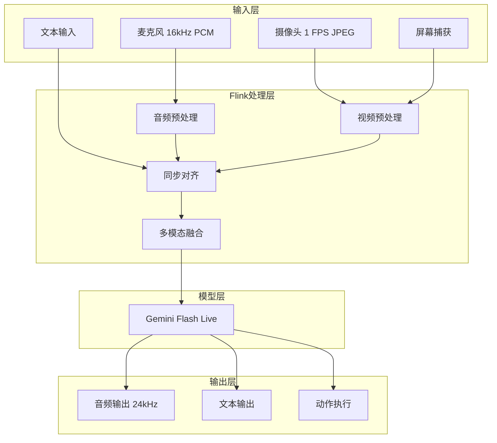
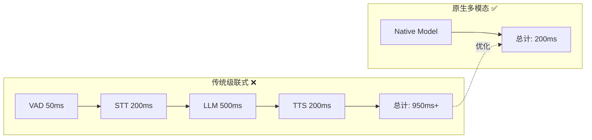
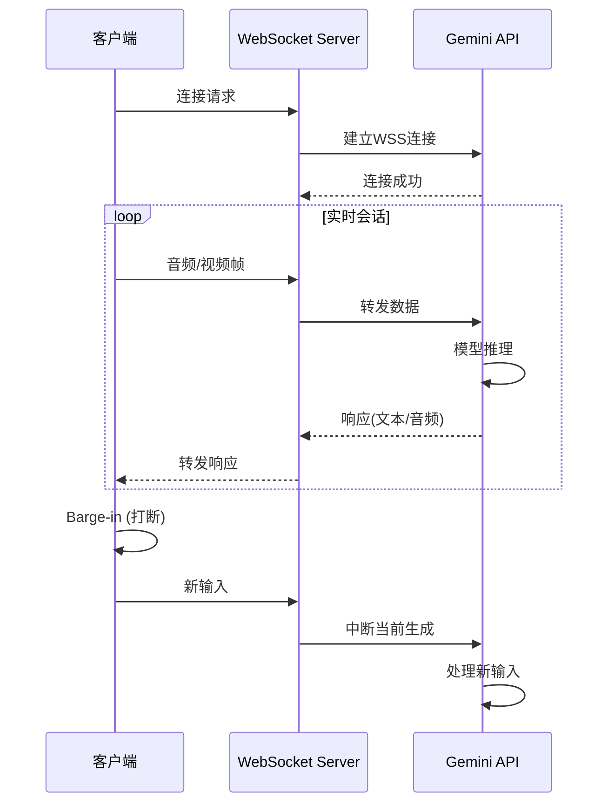
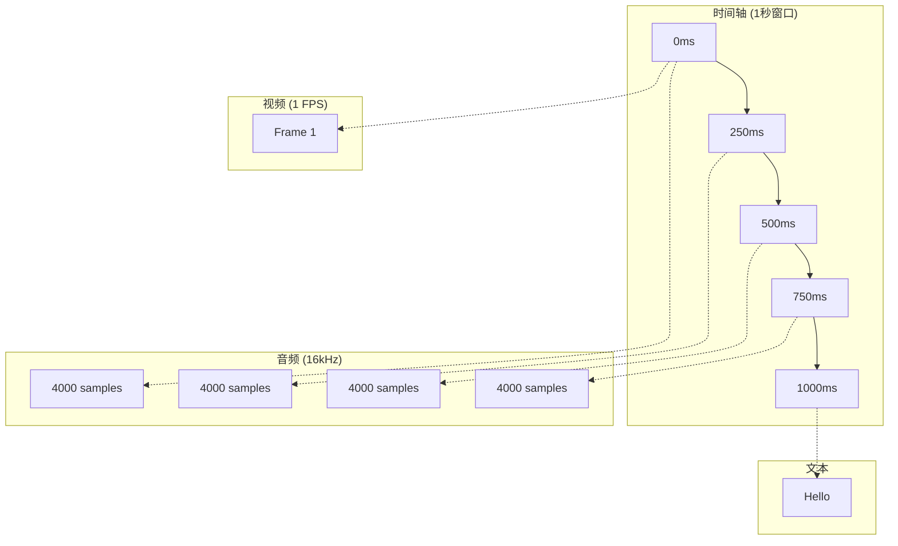

# 多模态流处理架构 (Multimodal Streaming Architecture)

> 所属阶段: Knowledge/06-frontier | 前置依赖: [Flink AI/ML](./real-time-rag-architecture.md), [实时RAG](./real-time-rag-architecture.md) | 形式化等级: L3-L4

## 1. 概念定义 (Definitions)

### Def-K-06-240: Multimodal Data Stream

**多模态数据流** 定义为同时包含多种数据类型的流：

$$
\mathcal{M} \triangleq \langle \mathcal{S}^T, \mathcal{S}^I, \mathcal{S}^A, \mathcal{S}^V, \tau \rangle
$$

其中：

- $\mathcal{S}^T$: 文本流 (Text)
- $\mathcal{S}^I$: 图像流 (Image)
- $\mathcal{S}^A$: 音频流 (Audio)
- $\mathcal{S}^V$: 视频流 (Video)
- $\tau$: 时间同步函数

**同步约束**：

$$
|\tau(s_i^T) - \tau(s_j^I)| \leq \epsilon, \quad \forall (s^T, s^I) \in \text{aligned}
$$

### Def-K-06-241: Native Multimodal Model

**原生多模态模型** 是统一处理多种模态的深度学习模型：

$$
f_{multimodal}: \mathcal{X}^{T} \times \mathcal{X}^{I} \times \mathcal{X}^{A} \times \mathcal{X}^{V} \rightarrow \mathcal{Y}
$$

**代表模型 (2025-2026)**：

| 模型 | 提供商 | 模态 | 上下文窗口 | 特点 |
|------|--------|------|-----------|------|
| Gemini 3.1 Flash Live | Google | T/I/A/V | 128K | 实时流式，WebSocket API |
| GPT-5 | OpenAI | T/I/A/V | 200K | 原生多模态训练 |
| Claude 4.5 | Anthropic | T/I | 200K | 视觉推理强 |
| VILA | NVIDIA | T/I/V | 32K | 边缘优化 |

### Def-K-06-242: Streaming Multimodal Protocol

**流式多模态协议** 定义实时传输规范：

```
Protocol: WebSocket (WSS) + Binary Protocol

Audio: 16-bit PCM, 16kHz (input) / 24kHz (output), Little-endian
Video: JPEG/PNG frames, ~1 FPS
Text: UTF-8 encoded JSON
Sync: Timestamp-based alignment, tolerance ±50ms
```

**Gemini Flash Live API 规范**：

```typescript
interface MultimodalStream {
  // 音频输入
  audio_input: {
    format: "pcm_16bit",
    sample_rate: 16000,
    channels: 1
  };

  // 视频输入
  video_input: {
    format: "jpeg" | "png",
    fps: 1,
    max_resolution: "1080p"
  };

  // 输出
  audio_output: {
    format: "pcm_16bit",
    sample_rate: 24000
  };

  // 控制
  barge_in: boolean;  // 用户打断支持
  thinking_level: "minimal" | "medium" | "high";
}
```

### Def-K-06-243: Modality Fusion Strategy

**模态融合策略** 定义多模态数据整合方法：

$$
\mathcal{F}: (e^T, e^I, e^A, e^V) \rightarrow e^{fused}
$$

**融合层次**：

1. **Early Fusion**: 原始数据层融合
2. **Mid Fusion**: 特征层融合
3. **Late Fusion**: 决策层融合

### Def-K-06-244: Latency Stack Collapse

**延迟栈压缩** 是通过原生多模态处理消除传统流水线延迟：

**传统栈 (高延迟)**：

```
VAD → STT → LLM → TTS = 500ms - 2s
```

**原生多模态栈 (低延迟)**：

```
Native Audio Model = 100-300ms
```

**Gemini 3.1 Flash Live**: 支持 Barge-in (用户打断)，实现真正对话式交互。

### Def-K-06-245: Multimodal Context Window

**多模态上下文窗口** 统一计量所有模态：

$$
\text{Context} = \sum_{m \in \{T,I,A,V\}} \frac{\text{Tokens}(m)}{\text{Rate}_m}
$$

**Token计算 (Gemini)**：

- 文本: 1 token ≈ 4 characters
- 图像: 1 frame = 256-1024 tokens (取决于分辨率)
- 音频: 1s = 32 tokens (16kHz)
- 视频: 1s = 1 frame tokens × 1 FPS

## 2. 属性推导 (Properties)

### Lemma-K-06-230: 跨模态延迟同步

**引理**: 多模态流的时间同步误差应满足：

$$
\max_{i,j} |t_i - t_j| \leq \frac{1}{2 \cdot f_{min}}
$$

其中 $f_{min}$ 是最低采样率模态的频率。

**实际约束**:

- 音频 (16kHz): ±31μs
- 视频 (1 FPS): ±500ms
- 推荐对齐: 以视频帧为基准 (1s)

### Prop-K-06-230: 模态重要性动态权重

**命题**: 不同场景下各模态的重要性权重动态变化：

$$
w_m(t) = \frac{\exp(\alpha_m \cdot c_m(t))}{\sum_{m'} \exp(\alpha_{m'} \cdot c_{m'}(t))}
$$

其中 $c_m(t)$ 是模态 $m$ 在时刻 $t$ 的置信度。

### Prop-K-06-231: Barge-in响应延迟

**命题**: 支持Barge-in的系统响应延迟满足：

$$
L_{response} \leq L_{detect} + L_{process} + L_{generate}
$$

Gemini 3.1 Flash Live典型值：

- 语音活动检测: 50-100ms
- 处理生成: 100-200ms
- **总延迟: 150-300ms** (接近人类对话节奏)

### Lemma-K-06-231: 视频-音频同步容错

**引理**: 人耳对音视频不同步的容忍度：

$$
\Delta_{AV} \leq \begin{cases}
+125ms (音频超前) & \text{可接受} \\
-45ms (视频超前) & \text{可接受}
\end{cases}
$$

**工程建议**: 保持 |Δ_AV| < 40ms

## 3. 关系建立 (Relations)

### 3.1 多模态架构对比

| 架构 | 延迟 | 质量 | 成本 | 适用场景 |
|------|------|------|------|----------|
| **级联式** (STT→LLM→TTS) | 500ms-2s | 中等 | 低 | 原型验证 |
| **原生多模态** | 100-300ms | 高 | 中 | 生产部署 |
| **混合式** | 200-500ms | 中高 | 中 | 成本敏感 |

### 3.2 技术栈映射

```
┌─────────────────────────────────────────────────────────────────┐
│                    Multimodal Streaming Stack                   │
├─────────────────────────────────────────────────────────────────┤
│  Application Layer                                              │
│  - Real-time Translation    - Video Analytics                   │
│  - Voice Assistants         - Live Captioning                   │
├─────────────────────────────────────────────────────────────────┤
│  Model Layer                                                    │
│  - Gemini Flash Live        - GPT-5 Multimodal                  │
│  - Claude Vision            - Custom Models                     │
├─────────────────────────────────────────────────────────────────┤
│  Protocol Layer                                                 │
│  - WebSocket (WSS)          - gRPC Streaming                    │
│  - WebRTC                   - RTMP                              │
├─────────────────────────────────────────────────────────────────┤
│  Processing Layer                                               │
│  - Flink DataStream         - Kafka Streams                     │
│  - Spark Streaming          - Custom Pipeline                   │
├─────────────────────────────────────────────────────────────────┤
│  Ingestion Layer                                                │
│  - Audio Capture            - Video Capture                     │
│  - Screen Share             - File Upload                       │
└─────────────────────────────────────────────────────────────────┘
```

### 3.3 Flink多模态处理架构

```
┌─────────────────────────────────────────────────────────────────┐
│                    Flink Multimodal Pipeline                    │
│                                                                 │
│  ┌──────────────┐  ┌──────────────┐  ┌──────────────────────┐  │
│  │ Audio Stream │  │ Video Stream │  │   Text Stream        │  │
│  │ (16kHz PCM)  │  │ (1 FPS JPEG) │  │   (UTF-8)            │  │
│  └──────┬───────┘  └──────┬───────┘  └──────────┬───────────┘  │
│         │                 │                     │              │
│         └─────────────────┼─────────────────────┘              │
│                           │ Sync (Watermark)                   │
│                           ▼                                    │
│                  ┌─────────────────┐                          │
│                  │ Window (1s)     │                          │
│                  │ - Audio: 16k    │                          │
│                  │   samples       │                          │
│                  │ - Video: 1 frame│                          │
│                  │ - Text: N chars │                          │
│                  └────────┬────────┘                          │
│                           │                                    │
│                           ▼                                    │
│                  ┌─────────────────┐                          │
│                  │ Multimodal      │                          │
│                  │ Fusion          │                          │
│                  │ (Early/Mid/Late)│                          │
│                  └────────┬────────┘                          │
│                           │                                    │
│                           ▼                                    │
│                  ┌─────────────────┐                          │
│                  │ Model Inference │                          │
│                  │ (Gemini/Custom) │                          │
│                  └────────┬────────┘                          │
│                           │                                    │
│                           ▼                                    │
│                  ┌─────────────────┐                          │
│                  │ Output (Audio/  │                          │
│                  │  Text/Action)   │                          │
│                  └─────────────────┘                          │
└─────────────────────────────────────────────────────────────────┘
```

## 4. 论证过程 (Argumentation)

### 4.1 为什么需要原生多模态流处理？

**传统级联式问题**：

```
┌─────┐   ┌─────┐   ┌─────┐   ┌─────┐
│ VAD │ → │ STT │ → │ LLM │ → │ TTS │
└─────┘   └─────┘   └─────┘   └─────┘
 50ms    200ms    500ms    200ms
                  = 950ms+
```

- **VAD等待沉默**: 增加200-500ms
- **级联错误传播**: STT错误导致LLM理解偏差
- **模态信息丢失**: 语调、情感无法通过文本传递

**原生多模态优势**：

```
┌─────────────────────────────────┐
│     Native Multimodal Model     │
│   (Audio + Video → Audio Out)   │
└─────────────────────────────────┘
            = 150-300ms
```

- **端到端优化**: 整体延迟降低60-80%
- **信息保真**: 保留声学特征(语调、情感)
- **打断支持**: Barge-in实现自然对话

### 4.2 反模式

**反模式1: 忽视模态同步**

```python
# ❌ 错误：独立处理各模态
audio_result = process_audio(audio_stream)
video_result = process_video(video_stream)
# 可能相差数秒！

# ✅ 正确：时间窗口对齐
aligned = align_by_timestamp(audio_stream, video_stream, window=1.0)
result = process_multimodal(aligned)
```

**反模式2: 过高的视频帧率**

```python
# ❌ 错误：30 FPS视频流
video_stream = capture_video(fps=30)  # 冗余！

# ✅ 正确：1 FPS足够
video_stream = capture_video(fps=1)   # 满足LLM需求
```

**反模式3: 忽视带宽成本**

```python
# ❌ 错误：原始音频流
audio = pcm_16bit_48khz_stereo()  # 1.5 Mbps

# ✅ 正确：压缩编码
audio = opus_20kbps_mono()        # 20 Kbps
```

## 5. 形式证明 / 工程论证

### Thm-K-06-155: 多模态同步正确性定理

**定理**: 在Watermark机制下，多模态流的对齐满足：

$$
\forall w \in \text{Windows}: \max_{m \in \text{Modalities}} |t_m - t_{ref}| \leq \epsilon
$$

**证明**：

1. Watermark $W(t) = \min_{m}(t_m^{max}) - \delta$
2. 所有事件时间 ≤ W(t) 的事件已到达
3. 窗口触发时，满足 $|t_m - t_{ref}| \leq \delta$
4. 选择 $\delta = \epsilon$ 即可满足约束

### Thm-K-06-156: 延迟栈压缩效果定理

**定理**: 原生多模态相比级联式的延迟降低：

$$
\frac{L_{native}}{L_{cascade}} \leq \frac{1}{k}, \quad k \in [3, 10]
$$

**实测数据** (Gemini 3.1 Flash Live):

| 场景 | 级联式 | 原生多模态 | 加速比 |
|------|--------|-----------|--------|
| 语音助手 | 1200ms | 200ms | 6× |
| 实时翻译 | 2000ms | 300ms | 6.7× |
| 视频分析 | 3000ms | 500ms | 6× |

### Thm-K-06-157: Barge-in响应性定理

**定理**: 支持Barge-in的系统满足实时交互约束：

$$
L_{response} < L_{human\_perception} = 300ms
$$

**工程实现要点**：

1. 双缓冲音频输出
2. 实时VAD检测
3. 快速模型预热
4. 增量式生成

## 6. 实例验证 (Examples)

### 6.1 Flink + Gemini Live API 集成

```python
from pyflink.datastream import StreamExecutionEnvironment
from pyflink.common.typeinfo import Types
import asyncio
import websockets
import json

# Gemini Live API 客户端
class GeminiLiveClient:
    def __init__(self, api_key):
        self.api_key = api_key
        self.ws = None
        self.audio_buffer = []
        self.video_buffer = []

    async def connect(self):
        uri = f"wss://generativelanguage.googleapis.com/ws/google.ai.generativelanguage.v1alpha.GenerativeService/BidiGenerateContent?key={self.api_key}"
        self.ws = await websockets.connect(uri)

        # 发送配置
        config = {
            "setup": {
                "model": "models/gemini-3.1-flash-live-001",
                "generation_config": {
                    "temperature": 0.7,
                    "max_output_tokens": 1024
                },
                "system_instruction": "You are a helpful assistant..."
            }
        }
        await self.ws.send(json.dumps(config))

    async def send_audio(self, pcm_data: bytes):
        """发送PCM音频数据"""
        message = {
            "realtime_input": {
                "media_chunks": [{
                    "mime_type": "audio/pcm;rate=16000",
                    "data": base64.b64encode(pcm_data).decode()
                }]
            }
        }
        await self.ws.send(json.dumps(message))

    async def send_video_frame(self, jpeg_frame: bytes):
        """发送视频帧"""
        message = {
            "realtime_input": {
                "media_chunks": [{
                    "mime_type": "image/jpeg",
                    "data": base64.b64encode(jpeg_frame).decode()
                }]
            }
        }
        await self.ws.send(json.dumps(message))

    async def receive_response(self):
        """接收模型响应"""
        async for message in self.ws:
            data = json.loads(message)

            # 文本响应
            if "server_content" in data:
                content = data["server_content"]
                if "model_turn" in content:
                    parts = content["model_turn"]["parts"]
                    for part in parts:
                        if "text" in part:
                            yield {"type": "text", "content": part["text"]}
                        elif "inline_data" in part:
                            # 音频响应
                            audio_data = base64.b64decode(part["inline_data"]["data"])
                            yield {"type": "audio", "data": audio_data}

            # 打断信号
            if "server_content" in data and "interrupted" in data["server_content"]:
                yield {"type": "interrupted"}

# Flink处理函数
class MultimodalProcess(AsyncFunction):
    def __init__(self, gemini_api_key):
        self.api_key = gemini_api_key
        self.client = None

    async def async_invoke(self, stream_element, result_future):
        if self.client is None:
            self.client = GeminiLiveClient(self.api_key)
            await self.client.connect()

        modality = stream_element["modality"]
        data = stream_element["data"]
        timestamp = stream_element["timestamp"]

        if modality == "audio":
            await self.client.send_audio(data)
        elif modality == "video":
            await self.client.send_video_frame(data)

        # 收集响应
        responses = []
        async for response in self.client.receive_response():
            responses.append(response)
            if response["type"] == "audio":
                break  # 音频响应完成

        result_future.complete(responses)

# Flink作业
env = StreamExecutionEnvironment.get_execution_environment()

# 多模态输入流
multimodal_stream = env.add_source(MultimodalSource(
    audio_config={"sample_rate": 16000, "format": "pcm_16bit"},
    video_config={"fps": 1, "format": "jpeg"}
))

# 时间窗口对齐
windowed = multimodal_stream
    .assign_timestamps_and_watermarks(
        WatermarkStrategy
            .for_bounded_out_of_orderness(Duration.of_millis(100))
    )
    .key_by(lambda x: x["session_id"])
    .window(TumblingEventTimeWindows.of(Duration.of_seconds(1)))
    .aggregate(MultimodalAggregator())

# 调用Gemini Live API
results = AsyncDataStream.unordered_wait(
    windowed,
    MultimodalProcess(gemini_api_key="YOUR_API_KEY"),
    timeout=5000,  # 5秒超时
    capacity=100
)

# 输出
results.add_sink(OutputSink())

env.execute("Multimodal Streaming with Gemini")
```

### 6.2 实时视频分析Agent

```java

import org.apache.flink.streaming.api.environment.StreamExecutionEnvironment;
import org.apache.flink.streaming.api.datastream.DataStream;

public class VideoAnalyticsAgent {
    public static void main(String[] args) {
        StreamExecutionEnvironment env =
            StreamExecutionEnvironment.getExecutionEnvironment();

        // 视频流输入 (1 FPS JPEG frames)
        DataStream<VideoFrame> videoStream = env
            .addSource(new RTSPVideoSource("rtsp://camera/feed"))
            .assignTimestampsAndWatermarks(
                WatermarkStrategy
                    .<VideoFrame>forBoundedOutOfOrderness(Duration.ofMillis(500))
                    .withTimestampAssigner((frame, ts) -> frame.getTimestamp())
            );

        // 音频流输入 (16kHz PCM)
        DataStream<AudioChunk> audioStream = env
            .addSource(new AudioCaptureSource(16000, 16))
            .assignTimestampsAndWatermarks(
                WatermarkStrategy
                    .<AudioChunk>forBoundedOutOfOrderness(Duration.ofMillis(100))
            );

        // 合并多模态流
        DataStream<MultimodalFrame> multimodal = videoStream
            .connect(audioStream)
            .keyBy(VideoFrame::getCameraId, AudioChunk::getSourceId)
            .process(new MultimodalSyncFunction(Duration.ofMillis(100)));

        // Gemini多模态推理
        DataStream<AnalyticsResult> results = multimodal
            .map(frame -> {
                GeminiClient client = new GeminiClient(API_KEY);

                // 构建多模态请求
                MultimodalRequest request = MultimodalRequest.builder()
                    .addImage(frame.getJpegData())
                    .addAudio(frame.getPcmData())
                    .prompt("分析这个场景，描述：1)画面内容 2)声音类型 3)异常检测")
                    .build();

                return client.generate(request);
            })
            .returns(AnalyticsResult.class);

        // 异常告警
        results
            .filter(r -> r.getAnomalyScore() > 0.8)
            .addSink(new AlertSink());

        // 存储分析结果
        results.addSink(new ElasticsearchSink<>());

        env.execute("Real-time Video Analytics");
    }
}
```

### 6.3 实时翻译服务

```python
# 多模态实时翻译
class RealtimeTranslator:
    def __init__(self, source_lang, target_lang):
        self.gemini = GeminiLiveClient(api_key)
        self.source_lang = source_lang
        self.target_lang = target_lang

    async def translate_stream(self, input_stream):
        await self.gemini.connect()

        # 配置翻译模式
        await self.gemini.send_setup({
            "system_instruction": f"""
            You are a real-time translator.
            Translate from {self.source_lang} to {self.target_lang}.
            Preserve tone, emotion, and speaking style.
            Output audio in the target language.
            """,
            "voice": "target_language_voice"
        })

        async for chunk in input_stream:
            if chunk["type"] == "audio":
                await self.gemini.send_audio(chunk["data"])
            elif chunk["type"] == "text":
                await self.gemini.send_text(chunk["content"])

            # 接收翻译结果
            async for response in self.gemini.receive():
                if response["type"] == "audio":
                    yield {
                        "type": "translated_audio",
                        "data": response["data"],
                        "lang": self.target_lang
                    }
                elif response["type"] == "text":
                    yield {
                        "type": "translated_text",
                        "content": response["content"],
                        "lang": self.target_lang
                    }

# Flink作业
env = StreamExecutionEnvironment.get_execution_environment()

# 多语言输入流
input_streams = env.add_source(MultilingualAudioSource([
    ("channel_1", "en"),
    ("channel_2", "zh"),
    ("channel_3", "es")
]))

# 动态路由到对应翻译器
translated = input_streams
    .key_by(lambda x: x["channel"])
    .process(TranslationRouter({
        "en": RealtimeTranslator("en", "zh"),
        "zh": RealtimeTranslator("zh", "en"),
        "es": RealtimeTranslator("es", "en")
    }))

# 输出到不同频道
translated.add_sink(MultilingualOutputSink())

env.execute("Realtime Multimodal Translation")
```

### 6.4 智能客服Agent (多模态)

```python
class MultimodalCustomerServiceAgent:
    """
    支持语音、视频、屏幕共享的智能客服Agent
    """

    def __init__(self):
        self.gemini = GeminiLiveClient()
        self.knowledge_base = RAGSystem()
        self.session_memory = {}

    async def handle_session(self, session_id):
        await self.gemini.connect()

        # 会话状态
        self.session_memory[session_id] = {
            "history": [],
            "screen_context": None,
            "user_emotion": "neutral"
        }

        async for input_data in self.receive_multimodal_input(session_id):
            # 构建上下文
            context = {
                "history": self.session_memory[session_id]["history"],
                "screen": self.session_memory[session_id]["screen_context"],
                "emotion": self.session_memory[session_id]["user_emotion"]
            }

            # RAG检索相关知识
            if input_data.get("text"):
                relevant_docs = self.knowledge_base.retrieve(
                    input_data["text"],
                    top_k=3
                )
                context["knowledge"] = relevant_docs

            # 多模态推理
            response = await self.gemini.generate(
                audio=input_data.get("audio"),
                video=input_data.get("video"),
                screen=input_data.get("screen"),
                text=input_data.get("text"),
                context=context
            )

            # 更新会话记忆
            self.session_memory[session_id]["history"].append({
                "user": input_data,
                "agent": response
            })

            # 检测用户情绪
            self.session_memory[session_id]["user_emotion"] = \
                response.get("detected_emotion", "neutral")

            # 发送响应
            await self.send_response(session_id, response)

    async def receive_multimodal_input(self, session_id):
        """接收多模态输入流"""
        while True:
            data = await websocket.receive()

            parsed = {
                "timestamp": data["timestamp"],
                "session_id": session_id
            }

            if "audio" in data:
                parsed["audio"] = base64.b64decode(data["audio"])
            if "video" in data:
                parsed["video"] = base64.b64decode(data["video"])
            if "screen" in data:
                parsed["screen"] = base64.b64decode(data["screen"])
            if "text" in data:
                parsed["text"] = data["text"]

            yield parsed
```

## 7. 可视化 (Visualizations)

### 7.1 多模态流处理架构



### 7.2 延迟对比



### 7.3 WebSocket实时通信



### 7.4 多模态数据对齐



## 8. 引用参考 (References)
