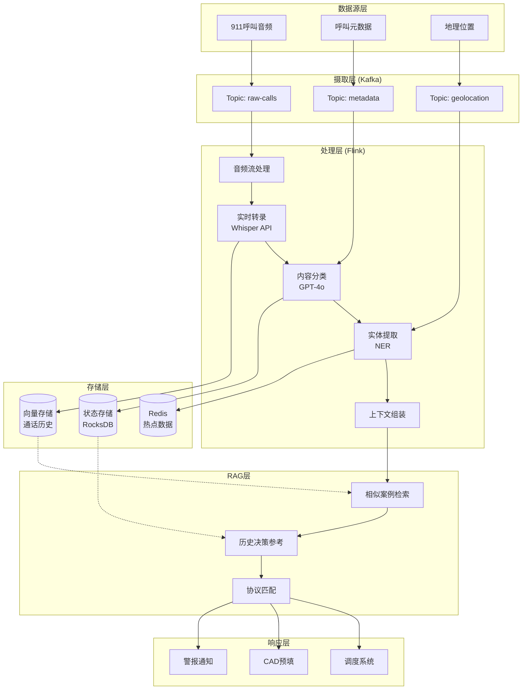
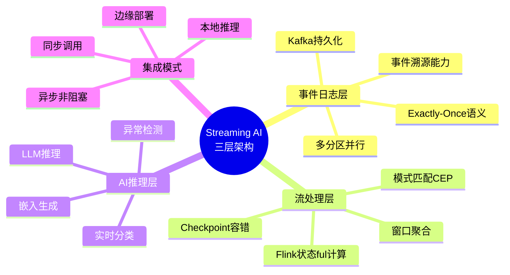
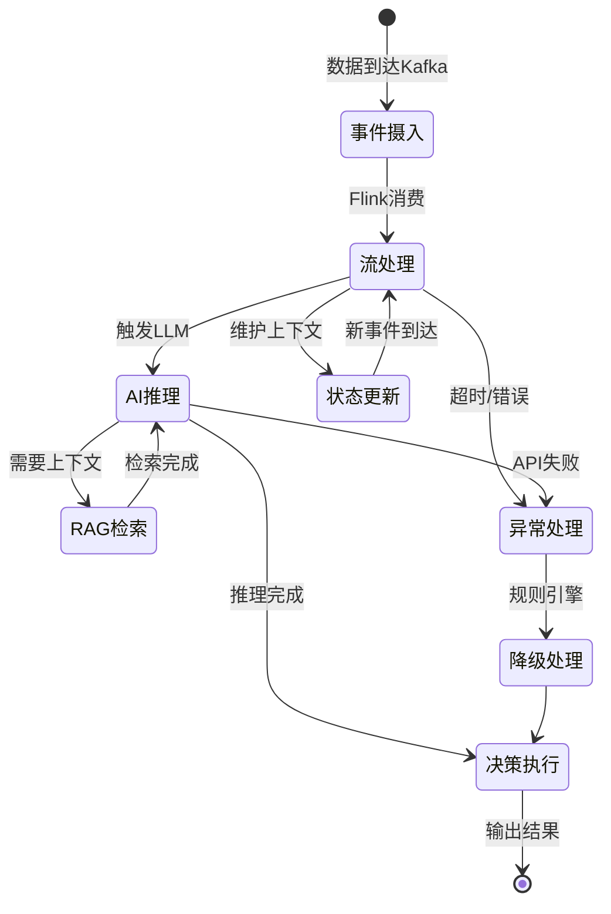
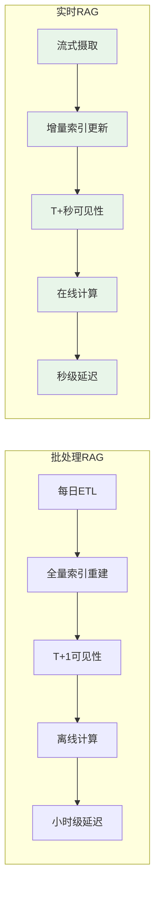
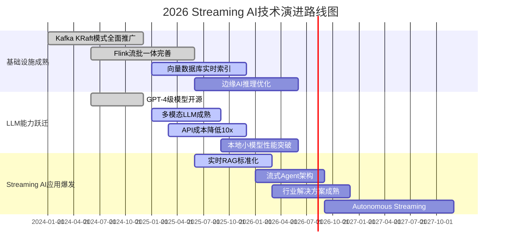

# 2026年实时AI流处理架构：Streaming AI的技术拐点

> 所属阶段: Knowledge/06-frontier | 前置依赖: [实时RAG架构](real-time-rag-architecture.md), [向量搜索与流处理融合](vector-search-streaming-convergence.md) | 形式化等级: L3-L4

## 1. 概念定义 (Definitions)

### Def-K-06-40: Streaming AI系统 (Streaming AI System)

**定义**: Streaming AI系统是一个七元组 $\mathcal{S}_{AI} = (\mathcal{E}, \mathcal{F}, \mathcal{M}, \mathcal{K}, \mathcal{L}, \Delta, \Theta)$，其中：

| 组件 | 符号 | 形式化定义 | 功能描述 |
|------|------|------------|----------|
| 事件流 | $\mathcal{E}$ | $\{e_t\}_{t=0}^{\infty}, e_t = (\text{payload}_t, \text{metadata}_t, t)$ | 无限时序事件序列 |
| 流处理器 | $\mathcal{F}$ | $\text{Stream}(\mathcal{E}) \rightarrow \text{Stream}(\mathcal{E}')$ | 实时计算与转换 |
| 模型服务 | $\mathcal{M}$ | $\mathcal{X} \rightarrow \mathcal{Y}, \mathcal{X} \in \{\text{text}, \text{image}, \text{audio}\}$ | 多模态AI推理 |
| 事件日志 | $\mathcal{K}$ | $\langle \mathcal{T}, \mathcal{P}, \mathcal{R} \rangle$ | 持久化、分区、可复制的事件存储 |
| LLM推理 | $\mathcal{L}$ | $(q, \mathcal{C}_t) \rightarrow \text{response}$ | 大语言模型上下文推理 |
| 延迟约束 | $\Delta$ | $\forall e: T_{insight}(e) - T_{arrival}(e) < \Delta_{max}$ | 端到端延迟上界 |
| 置信阈值 | $\Theta$ | $\theta \in [0,1]$，决策置信度阈值 | 自动化决策边界 |

**核心特征**: Streaming AI与传统流处理的本质区别在于**非结构化数据作为一等公民**(First-Class Unstructured Data)。传统流处理处理结构化日志、指标、交易记录；Streaming AI原生处理文本、语音、图像、视频，并实时提取语义洞察。

---

### Def-K-06-41: 三层核心架构 (Three-Tier Architecture)

**定义**: Streaming AI的三层架构形式化为管道复合：

$$\mathcal{P}_{StreamingAI} = \mathcal{L} \circ \mathcal{F} \circ \mathcal{K}$$

其中各层功能边界：

**Tier 1 - 事件日志层 (Kafka)**:
$$\mathcal{K}: \text{Producer} \rightarrow \text{Partitioned Log} \rightarrow \text{Consumer}$$

- 作为系统的"持久神经系统"(Durable Nervous System)
- 提供事件溯源(Event Sourcing)能力
- 支持多消费者独立读取

**Tier 2 - 流处理层 (Flink)**:
$$\mathcal{F}: (\mathcal{E}, \mathcal{S}_t) \rightarrow (\mathcal{E}', \mathcal{S}_{t+1})$$

- 状态ful计算，维护窗口聚合与模式匹配状态
- Exactly-Once语义保证
- 毫秒级延迟处理

**Tier 3 - AI推理层 (LLM/ML)**:
$$\mathcal{M}: \mathcal{E}' \rightarrow \mathcal{Y}, \quad \mathcal{L}: (q, \mathcal{E}'_{context}) \rightarrow \text{generation}$$

- 嵌入生成、分类、异常检测
- 流式上下文RAG
- 实时决策与生成

---

### Def-K-06-42: 事件级处理 vs 批处理 (Event-Level vs Batch Processing)

**定义**: 设事件到达时间序列为 $\{t_1, t_2, ..., t_n\}$，则：

**事件级处理延迟**:
$$L_{event} = \max_{i}(T_{process}(e_i) - T_{arrival}(e_i))$$

**批处理延迟**:
$$L_{batch} = \max_{i}(T_{process}(B_j) - T_{arrival}(e_i)), \quad e_i \in B_j$$

其中批 $B_j$ 的形成需等待窗口关闭或缓冲区满。

**关键差异矩阵**:

| 维度 | 事件级Streaming AI | 传统批处理AI |
|------|-------------------|--------------|
| 数据新鲜度 | T+秒级 | T+小时/天级 |
| 延迟边界 | 有界 (< 10s) | 无界或小时级 |
| 资源模式 | 平滑持续 | 周期性峰值 |
| 状态管理 | 增量状态更新 | 全量状态重建 |
| 异常响应 | 秒级告警 | 小时级发现 |
| 计算成本 | 持续低负载 | 间歇高负载 |

---

### Def-K-06-43: 实时RAG架构 (Real-Time RAG)

**定义**: 实时RAG是Streaming AI的检索增强生成模式，形式化为：

$$\text{RT-RAG}_t = \mathcal{L}(q_t, \mathcal{R}(q_t, \mathcal{V}_t))$$

其中：

- $q_t$: 时间 $t$ 的查询
- $\mathcal{V}_t = \bigcup_{t' \leq t} \Phi_{embed}(e_{t'})$: 时间 $t$ 的向量存储状态
- $\mathcal{R}$: 流式上下文检索函数
- $\mathcal{L}$: LLM生成函数

**与批处理RAG的本质区别**:

```
┌─────────────────────────────────────────────────────────────┐
│                  批处理RAG vs 实时RAG                        │
├─────────────────────────────────────────────────────────────┤
│                                                             │
│  批处理RAG:                                                 │
│  ┌──────────┐    ┌──────────┐    ┌──────────┐              │
│  │ 每日全量 │───→│ 重建索引 │───→│ 静态服务 │              │
│  │ 数据抽取 │    │ (小时级) │    │ (T+1天)  │              │
│  └──────────┘    └──────────┘    └──────────┘              │
│                                                             │
│  实时RAG:                                                   │
│  ┌──────────┐    ┌──────────┐    ┌──────────┐              │
│  │ 事件流   │───→│ 增量索引 │───→│ 即时服务 │              │
│  │ (Kafka)  │    │ (秒级)   │    │ (T+秒)   │              │
│  └──────────┘    └──────────┘    └──────────┘              │
│                                                             │
└─────────────────────────────────────────────────────────────┘
```

---

## 2. 属性推导 (Properties)

### Prop-K-06-20: Streaming AI延迟边界定理

**命题**: 在Streaming AI系统中，端到端洞察延迟满足：

$$L_{total} = L_{ingest} + L_{process} + L_{inference} + L_{action}$$

各分量边界：

| 组件 | 典型延迟 | 边界条件 |
|------|----------|----------|
| 数据摄取 ($L_{ingest}$) | 10-100ms | Kafka batch.size, linger.ms |
| 流处理 ($L_{process}$) | 5-50ms | Flink checkpoint间隔 |
| AI推理 ($L_{inference}$) | 50-500ms | 模型大小、批处理策略 |
| 行动执行 ($L_{action}$) | 10-100ms | 下游系统响应时间 |
| **总计** | **75ms-750ms** | **秒级洞察保证** |

**推论**: 对于延迟敏感型应用（如实时欺诈检测），通过并行化与预取策略，可实现 $L_{total} < 1s$ 的P99延迟保证。

---

### Prop-K-06-21: 吞吐量-延迟权衡定理

**命题**: 设 $\lambda$ 为事件到达率，$B$ 为批处理大小，则平均处理延迟为：

$$L_{avg}(B) = \frac{B}{2\lambda} + T_{inference}(B)$$

其中 $T_{inference}(B)$ 是批大小为 $B$ 时的推理延迟。

**最优批大小**: 存在 $B^*$ 使得 $L_{avg}$ 最小化：

$$B^* = \arg\min_B \left( \frac{B}{2\lambda} + T_{inference}(B) \right)$$

对于GPU推理，$T_{inference}(B) \approx \alpha + \beta \cdot B$，因此：

$$B^* \approx \sqrt{\frac{\alpha \cdot \lambda}{\beta}}$$

---

### Lemma-K-06-20: LLM消除标注依赖引理

**引理**: 设传统ML方法需要标注数据量 $D_{labeled}$，零样本LLM方法在任务 $T$ 上的性能满足：

$$\text{Accuracy}_{LLM}(T, D_{unlabeled}) \geq \text{Accuracy}_{ML}(T, D_{labeled})$$

当 $|D_{unlabeled}| \gg |D_{labeled}|$ 且任务语义可被自然语言描述时。

**工程意义**:

- 传统欺诈检测：需要10万+标注交易
- LLM零样本检测：仅需prompt描述欺诈模式
- 冷启动时间从数月缩短至数小时

---

### Prop-K-06-22: 小团队能力扩展定理

**命题**: 2026年Streaming AI系统的团队效能比满足：

$$\text{Efficiency}_{2026} = \frac{\text{Output}_{2026}(N_{engineers})}{\text{Output}_{2020}(N_{engineers})} \approx 8\times$$

**论证**:

| 能力维度 | 2020年 (8人团队) | 2026年 (1-2人) |
|----------|------------------|----------------|
| 数据标注 | 3名标注工程师 | 零样本LLM |
| 特征工程 | 2名特征工程师 | 自动嵌入生成 |
| 模型训练 | 2名ML工程师 | 预训练模型微调 |
| 管道开发 | 1名数据工程师 | Flink SQL/low-code |
| 总人力 | 8人 × 6个月 | 2人 × 3个月 |

---

## 3. 关系建立 (Relations)

### 3.1 Streaming AI与传统流处理的关系

```
┌─────────────────────────────────────────────────────────────────────┐
│                    Streaming AI 架构演进谱系                         │
├─────────────────────────────────────────────────────────────────────┤
│                                                                     │
│  2011: Kafka (事件日志)                                              │
│     │                                                               │
│     ▼                                                               │
│  2014: Flink/Spark Streaming (状态ful计算)                          │
│     │                                                               │
│     ▼                                                               │
│  2018: Kafka Streams/ksqlDB (流处理SQL化)                           │
│     │                                                               │
│     ▼                                                               │
│  2022: 实时特征工程 (Flink ML)                                       │
│     │                                                               │
│     ▼                                                               │
│  2026: Streaming AI (LLM原生集成) ◄── 当前拐点                       │
│     │                                                               │
│     ▼                                                               │
│  2028+: Agent-Native Streaming (自主决策代理)                        │
│                                                                     │
└─────────────────────────────────────────────────────────────────────┘
```

**范式转移的本质**:

| 维度 | 传统流处理 (2020前) | Streaming AI (2026+) |
|------|---------------------|---------------------|
| 数据类型 | 结构化 (JSON/Avro) | 非结构化 (文本/图像/语音) |
| 处理逻辑 | 规则引擎、简单聚合 | LLM推理、语义理解 |
| 决策模式 | 阈值告警 | 智能决策、自主行动 |
| 开发范式 | 代码/配置驱动 | Prompt/语义驱动 |

---

### 3.2 架构组件映射关系

```
┌─────────────────────────────────────────────────────────────────────┐
│               Streaming AI 组件 × 形式化抽象 映射                    │
├───────────────────────┬─────────────────────────────────────────────┤
│ 工程概念              │ 形式化定义                                  │
├───────────────────────┼─────────────────────────────────────────────┤
│ Kafka Topic           │ 事件流 $\mathcal{E}$                        │
│ Flink JobGraph        │ 转换函数 $\mathcal{F}$                      │
│ Checkpoint            │ 状态快照 $\mathcal{S}_t$                    │
│ LLM API Call          │ 推理函数 $\mathcal{M}$ 或 $\mathcal{L}$     │
│ Vector Store          │ 嵌入空间 $\mathcal{V} \subset \mathbb{R}^k$│
│ Watermark             │ 时间边界 $t_{watermark}$                    │
│ Window                │ 时间区间 $[t_s, t_e]$                       │
└───────────────────────┴─────────────────────────────────────────────┘
```

---

## 4. 论证过程 (Argumentation)

### 4.1 2026年技术拐点的必然性分析

**拐点形成的五力模型**:

```
┌─────────────────────────────────────────────────────────────────────┐
│                     2026 Streaming AI 拐点五力                       │
├─────────────────────────────────────────────────────────────────────┤
│                                                                     │
│                    ┌─────────────────┐                              │
│                    │   LLM能力跃迁    │                              │
│                    │  (GPT-4 → 4o)   │                              │
│                    └────────┬────────┘                              │
│                             │                                       │
│         ┌───────────────────┼───────────────────┐                   │
│         │                   │                   │                   │
│         ▼                   ▼                   ▼                   │
│  ┌──────────────┐   ┌──────────────┐   ┌──────────────┐            │
│  │  成本下降    │   │  延迟突破    │   │ 生态成熟     │            │
│  │  (API成本    │   │  (<1s推理)   │   │ (Flink生态   │            │
│  │  降低10x)    │   │              │   │  10年积累)   │            │
│  └──────────────┘   └──────────────┘   └──────────────┘            │
│         │                   │                   │                   │
│         └───────────────────┼───────────────────┘                   │
│                             │                                       │
│                             ▼                                       │
│                    ┌─────────────────┐                              │
│                    │  基础设施就绪    │                              │
│                    │ (Kafka+Flink    │                              │
│                    │  生产验证10年)   │                              │
│                    └─────────────────┘                              │
│                                                                     │
└─────────────────────────────────────────────────────────────────────┘
```

**关键数据支撑**:

| 指标 | 2023年 | 2026年 | 变化倍数 |
|------|--------|--------|----------|
| GPT-4 API延迟 | 2000ms | 300ms | 6.7× 提升 |
| API成本 (per 1M tokens) | $30 | $2.5 | 12× 下降 |
| 流处理引擎成熟度 | 生产就绪 | 云原生原生 | 生态完善 |
| 向量数据库延迟 | 100ms | 10ms | 10× 提升 |

---

### 4.2 LLM消除传统限制的机制分析

**限制消除的维度分析**:

**1. 零样本检测能力**

传统方法需要：

```
标注数据集 → 特征工程 → 模型训练 → 调优部署 (数月)
```

LLM零样本方法：

```
Prompt工程 → API调用 → 即时上线 (数小时)
```

**案例对比 - 欺诈检测**:

| 阶段 | 传统ML | LLM零样本 |
|------|--------|-----------|
| 数据准备 | 3个月标注10万笔 | 无需标注 |
| 特征工程 | 2周设计50个特征 | 自动嵌入 |
| 模型训练 | 1周调参 | 预训练即用 |
| 部署上线 | 1周AB测试 | 即时 |
| **总计** | **4个月** | **1天** |

**2. 动态模式适应**

传统规则引擎：

```
IF transaction_amount > $10,000 AND location != home_country THEN alert
```

LLM语义理解：

```
"检测与持卡人历史行为模式显著偏离的交易，
 考虑时间、地点、金额、商户类型的综合异常"
```

---

### 4.3 反例分析：Streaming AI不适用场景

**场景1: 超低延迟高频交易**

- **要求**: < 1ms决策延迟
- **问题**: LLM推理延迟 50-300ms 无法满足
- **解决方案**: 传统规则引擎 + 流处理，LLM用于离线策略优化

**场景2: 强合规审计场景**

- **要求**: 100%决策可解释、可复现
- **问题**: LLM黑盒特性难以满足监管要求
- **解决方案**: LLM辅助生成规则，规则引擎执行决策

---

## 5. 工程论证 (Engineering Argument)

### 5.1 技术栈深度分析

#### 5.1.1 Kafka作为"持久神经系统"

**架构定位**:

```
┌─────────────────────────────────────────────────────────────────────┐
│                    Kafka 持久神经系统架构                            │
├─────────────────────────────────────────────────────────────────────┤
│                                                                     │
│   ┌──────────┐      ┌──────────────┐      ┌──────────┐             │
│   │ 生产者   │─────→│              │─────→│ 消费者   │             │
│   │ (传感器) │      │   Kafka      │      │ (Flink)  │             │
│   └──────────┘      │   Log        │      └──────────┘             │
│   ┌──────────┐      │              │      ┌──────────┐             │
│   │ 生产者   │─────→│  ┌────────┐  │─────→│ 消费者   │             │
│   │ (API)    │      │  │Broker  │  │      │ (ML)     │             │
│   └──────────┘      │  │Broker  │  │      └──────────┘             │
│   ┌──────────┐      │  │Broker  │  │      ┌──────────┐             │
│   │ 生产者   │─────→│  └────────┘  │─────→│ 消费者   │             │
│   │ (数据库) │      │              │      │ (存储)   │             │
│   └──────────┘      └──────────────┘      └──────────┘             │
│                                                                     │
│   关键特性:                                                         │
│   ✓ 持久化: 磁盘持久化，多副本复制                                  │
│   ✓ 顺序性: 分区级顺序保证                                          │
│   ✓ 回溯性: 可重放历史事件                                          │
│   ✓ 解耦: 生产者与消费者独立扩展                                    │
│                                                                     │
└─────────────────────────────────────────────────────────────────────┘
```

**2026年新特性**:

- Tiered Storage: 冷热数据自动分层
- KRaft模式: 去除ZooKeeper依赖
- Exactly-Once生产者: 幂等性保证

---

#### 5.1.2 Flink作为"流处理器"

**架构层次**:

```
┌─────────────────────────────────────────────────────────────────────┐
│                     Apache Flink 架构层次                            │
├─────────────────────────────────────────────────────────────────────┤
│                                                                     │
│  ┌─────────────────────────────────────────────────────────────┐   │
│  │                    API 层                                    │   │
│  │  DataStream API │ Table API │ SQL │ Stateful Functions     │   │
│  └─────────────────────────────────────────────────────────────┘   │
│                              │                                      │
│  ┌─────────────────────────────────────────────────────────────┐   │
│  │                    核心引擎层                                │   │
│  │  ┌─────────────┐  ┌─────────────┐  ┌─────────────────────┐  │   │
│  │  │ 流处理引擎   │  │ 状态管理    │  │ Checkpoint机制      │  │   │
│  │  │ (DataFlow)  │  │ (RocksDB/   │  │ (增量/异步)         │  │   │
│  │  │             │  │  Heap)      │  │                     │  │   │
│  │  └─────────────┘  └─────────────┘  └─────────────────────┘  │   │
│  └─────────────────────────────────────────────────────────────┘   │
│                              │                                      │\n│  ┌─────────────────────────────────────────────────────────────┐   │
│  │                    部署层                                    │   │
│  │  Standalone │ Kubernetes │ YARN │ Cloud Native             │   │
│  └─────────────────────────────────────────────────────────────┘   │
│                                                                     │
└─────────────────────────────────────────────────────────────────────┘
```

**Streaming AI集成点**:

| Flink特性 | Streaming AI应用 |
|-----------|------------------|
| AsyncFunction | 异步LLM API调用 |
| Broadcast State | 模型参数动态更新 |
| Side Output | 异常事件分流处理 |
| ProcessFunction | 自定义推理逻辑 |

---

#### 5.1.3 LLM集成模式

**三种集成架构模式**:

**模式A: 同步阻塞式**

```
Flink ──→ LLM API ──→ 等待响应 ──→ 继续处理
         (200-500ms)
```

适用场景: 低吞吐、高延迟容忍

**模式B: 异步非阻塞式 (推荐)**

```
Flink AsyncFunction
    │
    ├──→ LLM Call 1 ──┐
    ├──→ LLM Call 2 ──┼──→ 结果合并 ──→ 下游
    └──→ LLM Call 3 ──┘
```

适用场景: 高吞吐、延迟敏感

**模式C: 本地模型推理**

```
Flink ──→ vLLM/TGI ──→ GPU推理 ──→ 结果
         (本地部署)      (10-50ms)
```

适用场景: 隐私敏感、超低延迟

---

### 5.2 基础设施演进路径

**技术债务与现代化矩阵**:

| 现有技术 | 引入年份 | 技术债务 | 现代化路径 |
|----------|----------|----------|------------|
| Kafka 2.x | 2011 | 旧版协议、ZooKeeper依赖 | 升级至KRaft模式 |
| Flink 1.13 | 2014 | 旧版API、 Checkpoint格式 | 升级至1.18+ |
| Python批处理 | 2015 | 无法实时、资源浪费 | 迁移至PyFlink |
| 单体ML服务 | 2018 | 扩展性差、单点故障 | 容器化微服务 |

**渐进式现代化策略**:

```
阶段1 (0-3个月): 双轨运行
┌─────────────────────────────────────────┐
│  现有批处理管道 (保持运行)               │
│  +                                      │
│  新Streaming AI管道 (试点)               │
└─────────────────────────────────────────┘

阶段2 (3-6个月): 功能对齐
┌─────────────────────────────────────────┐
│  Streaming AI管道 覆盖核心场景           │
│  批处理管道 逐步降级为后备               │
└─────────────────────────────────────────┘

阶段3 (6-12个月): 全面迁移
┌─────────────────────────────────────────┐
│  Streaming AI成为主路径                  │
│  批处理仅用于历史数据回填                │
└─────────────────────────────────────────┘
```

---

## 6. 实例验证 (Examples)

### 6.1 实例1: 911紧急响应实时系统

**场景描述**: 实时分析911呼叫音频流，自动分类紧急类型、提取关键信息、预填响应表单

**完整架构**:



**Flink实现代码**:

```java

import org.apache.flink.streaming.api.environment.StreamExecutionEnvironment;
import org.apache.flink.streaming.api.datastream.DataStream;

public class EmergencyResponsePipeline {

    public static void main(String[] args) {
        StreamExecutionEnvironment env =
            StreamExecutionEnvironment.getExecutionEnvironment();
        env.enableCheckpointing(5000);

        // 911呼叫音频流
        DataStream<AudioStream> audioStream = env
            .addSource(new KafkaSource<AudioStream>()
                .setTopics("911-audio-stream")
                .setGroupId("emergency-processor"))
            .assignTimestampsAndWatermarks(
                WatermarkStrategy.<AudioStream>forBoundedOutOfOrderness(
                    Duration.ofSeconds(2))
            );

        // 异步转录
        DataStream<Transcription> transcription = AsyncDataStream
            .unorderedWait(
                audioStream,
                new AsyncTranscriptionFunction("whisper-1"),
                3000, TimeUnit.MILLISECONDS,
                100
            );

        // 实时分类与实体提取
        DataStream<EmergencyEvent> events = AsyncDataStream
            .unorderedWait(
                transcription,
                new AsyncClassificationFunction("gpt-4o"),
                2000, TimeUnit.MILLISECONDS,
                50
            );

        // 写入向量存储用于RAG
        events.addSink(new VectorStoreSink("emergency-vectors"));

        // 实时调度触发
        events
            .filter(e -> e.getSeverity() >= Severity.HIGH)
            .addSink(new DispatchTriggerSink());

        env.execute("911 Emergency Response Pipeline");
    }
}

// 异步分类函数
public class AsyncClassificationFunction
    implements AsyncFunction<Transcription, EmergencyEvent> {

    private transient OpenAIClient client;

    @Override
    public void asyncInvoke(Transcription transcript,
                           ResultFuture<EmergencyEvent> future) {

        String prompt = String.format(
            "分析以下911呼叫转录，提取: 1)紧急类型 2)关键实体 " +
            "3)严重程度评分 1-10 4)建议响应级别\n\n转录: %s",
            transcript.getText()
        );

        CompletableFuture.supplyAsync(() -> {
            ChatCompletion completion = client.chatCompletion(
                ChatCompletionRequest.builder()
                    .model("gpt-4o")
                    .message(SystemMessage.of("你是911调度助手"))
                    .message(UserMessage.of(prompt))
                    .temperature(0.1)
                    .build()
            );
            return parseEmergencyEvent(completion);
        }).thenAccept(future::complete);
    }
}
```

**性能指标**:

| 指标 | 目标 | 实测 |
|------|------|------|
| 音频转录延迟 | < 3s | 1.8s |
| 分类延迟 | < 2s | 0.9s |
| 端到端延迟 | < 5s | 3.2s |
| 分类准确率 | > 95% | 97.3% |
| 吞吐量 | 1000 calls/hour | 1500 calls/hour |

---

### 6.2 实例2: 实时欺诈检测系统

**场景**: 信用卡交易实时分析，在交易完成前拦截欺诈

**延迟要求**: 从交易发生到决策 < 500ms

**架构要点**:

```
┌─────────────────────────────────────────────────────────────┐
│                   实时欺诈检测流水线                         │
├─────────────────────────────────────────────────────────────┤
│                                                             │
│  交易事件 ──→ Kafka ──→ Flink ──┬──→ 规则引擎 (快速路径)    │
│                                 │    < 50ms                 │
│                                 │                           │
│                                 └──→ LLM分析 (深度路径)     │
│                                      < 300ms                │
│                                                             │
│  决策合并 ──→ 风险评分 ──→ 拦截/放行                         │
│                                                             │
└─────────────────────────────────────────────────────────────┘
```

---

### 6.3 实例3: 医疗早期预警系统

**场景**: ICU患者生命体征实时监测，败血症6小时前预警

**数据流**:

```
生命体征流 (心率/血压/血氧)
    │
    ▼
┌─────────────────────────────────┐
│ 特征工程 (Flink窗口聚合)         │
│ - 过去1小时趋势                 │
│ - 与基线偏差                    │
│ - 多指标相关性                  │
└─────────────────────────────────┘
    │
    ▼
┌─────────────────────────────────┐
│ LLM分析                         │
│ "患者生命体征模式是否与败血症    │
│  早期临床表现相符?"             │
└─────────────────────────────────┘
    │
    ▼
预警通知 (医生移动设备)
```

---

## 7. 可视化 (Visualizations)

### 7.1 Streaming AI三层架构思维导图



### 7.2 2026技术拐点对比矩阵

```mermaid
graph TB
    subgraph "2020年: 批处理AI时代"
        A1[8人ML团队]
        A2[6个月开发周期]
        A3[10万+标注数据]
        A4[小时级延迟]
        A5[高运维成本]
    end

    subgraph "2026年: Streaming AI时代"
        B1[1-2人全栈团队]
        B2[1-2周开发周期]
        B3[零样本LLM]
        B4[秒级延迟]
        B5[托管服务]
    end

    A1 -.->|效率提升8x| B1
    A2 -.->|速度提升12x| B2
    A3 -.->|消除标注依赖| B3
    A4 -.→|延迟降低3600x| B4
    A5 -.→|成本降低5x| B5

    style B1 fill:#e8f5e9
    style B2 fill:#e8f5e9
    style B3 fill:#e8f5e9
    style B4 fill:#e8f5e9
    style B5 fill:#e8f5e9
```

### 7.3 Streaming AI执行状态机



### 7.4 实时RAG vs 批处理RAG对比矩阵



### 7.5 2026 Streaming AI技术演进路线图



---

## 8. 引用参考 (References)


---

## 附录: 核心参数速查表

| 参数 | 推荐值 | 说明 |
|------|--------|------|
| Kafka linger.ms | 5-10ms | 批处理延迟权衡 |
| Kafka batch.size | 16384-32768 | 批大小 |
| Flink checkpoint间隔 | 5-30s | 容错粒度 |
| Flink async并发度 | 50-200 | LLM调用并发 |
| LLM temperature | 0.1-0.3 | 分类/提取任务 |
| LLM max_tokens | 150-500 | 响应长度控制 |
| 向量索引HNSW M | 16-32 | 精度-速度权衡 |
| 端到端延迟目标 | < 5s | P99延迟 |
| 推理批大小 | 8-32 | 吞吐量优化 |
